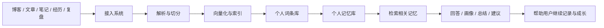

# Mneme

> 又名 Mnemosyne 或 记忆之芯

`Mneme` 不是一个普通的“上传文件然后问答”的 RAG 项目。  
它想解决的核心问题是：

> 当一个人的博客、文章、笔记、经历、复盘和思考越来越多时，如何让这些内容不只是被存放，而是真正沉淀成可被理解、可被检索、可被陪伴的个人记忆库。

---

## 项目起源

主流大模型已经非常擅长即时对话，但它们天然有一个明显限制：

- 一个人的长期内容太多，无法稳定地整段塞进上下文
- 上下文一长，成本会升高，幻觉风险也会增加
- 即使模型很强，也很难真正“长期理解一个人”

与此同时，现实中的很多长期陪伴服务又有自己的门槛：

- 心理咨询成本高
- 真实陪伴资源稀缺
- 即使是专业人士，也很难在极短时间内系统读完一个人的长期文字与经历材料

于是，这个项目想做的事情就变得很明确：

> 不让大模型一次性硬吃整个人生材料，而是先把一个人的内容慢慢沉淀成词条、片段、主题和记忆，再在需要的时候只取最相关的一部分交给模型理解。

这就是 `Mneme` 的起点。

---

## 产品定位

`Mneme` 是一个面向个人长期内容沉淀的记忆与成长平台。

用户可以持续输入：

- 博客
- 文章
- 学习笔记
- 简历
- 项目复盘
- 阶段总结
- 个人思考

系统会逐步把这些内容转化为：

- 可检索的个人词条库
- 可回溯的个人记忆库
- 可分析的成长画像
- 可延续的长期陪伴基础

它最终想做的，不是替代人与人的关系，也不是替代专业治疗，而是成为一种更长期、更克制、更有依据的数字陪伴形态。

---

## 它和普通问答型大模型有什么不同

很多问答型产品的核心流程是：

```text
提一个问题
-> 把当前上下文交给模型
-> 拿到一次回答
```

而 `Mneme` 想做的是另一种路径：

```text
持续记录个人内容
-> 形成个人词条库与记忆库
-> 针对问题检索最相关的记忆片段
-> 让模型基于这些片段分析与回答
-> 输出带依据的理解、总结和建议
```

这意味着它的优势不在“单次最聪明”，而在：

- 更适合长期积累
- 更适合个人化理解
- 更适合处理海量个人材料
- 更适合做有依据的分析

一句话说：

> 普通问答产品更像一次性对话，`Mneme` 更像长期记忆驱动的理解系统。

---

## 为什么它值得做

这个项目最值得做的地方，不是“又做了一个聊天机器人”，而是它抓住了一个更深的问题：

> 一个人最宝贵的，往往不是一条即时回答，而是那些逐渐形成自己的记忆与成长轨迹。

记忆本身并不只是回忆过去。  
记忆会塑造：

- 你如何理解自己
- 你长期关注什么
- 你如何表达
- 你经历过哪些阶段变化
- 你正在成长成什么样的人

`Mneme` 想做的，就是把这些分散在各处的个人内容，变成一个可被看见、可被检索、可被理解的长期结构。

---

## 核心突出点

### 1. 个人词条库，而不是普通文件堆积

这个项目的关键不只是“存文档”，而是：

- 把个人内容逐步沉淀成结构化记忆线索
- 让系统以后能围绕“词条、主题、阶段、事件”理解一个人

### 2. 检索优先，而不是上下文硬塞

`Mneme` 不依赖把所有材料一股脑塞进模型。  
它的核心思路是：

- 先沉淀
- 再检索
- 后分析

这样可以更稳定地控制：

- 上下文长度
- 模型成本
- 回答质量
- 幻觉风险

### 3. 长期积累，而不是一次性体验

这个产品不是只在用户上传一个文件时才有价值。  
它更像一个会随着时间越用越有价值的系统：

- 内容越积累，理解越完整
- 时间越拉长，画像越真实
- 记录越持续，陪伴感越强

### 4. 输出不只回答，还包括理解

`Mneme` 最终不会只做：

- “这个问题的答案是什么”

它更重要的输出会是：

- 个人画像
- 阶段总结
- 成长趋势
- 表达风格
- 关注主题
- 下一步建议

### 5. 以成长为目标，而不是以判断人为目标

这个项目不想做“给人下定义”的系统。  
它更想做的是：

- 帮用户看见自己
- 帮用户回看变化
- 帮用户理解成长轨迹

这会让它更温和，也更有长期价值。

---

## 目标用户

`Mneme` 适合那些有长期内容沉淀意愿的人，例如：

- 持续写博客的人
- 喜欢做复盘的人
- 有大量学习笔记的人
- 想建立个人知识档案的人
- 想做长期自我认知和成长跟踪的人

它尤其适合这样一类需求：

> 不是想立刻得到一个万能答案，而是想让系统随着时间越来越懂自己。

---

## 当前版本在做什么

目前这个仓库的前 7 天工作，主要是在搭 `Mneme` 的基础引擎。

已经覆盖的方向包括：

- FastAPI 后端骨架
- 文档上传
- 文档解析与切分
- 向量化索引
- 检索相关内容
- 基于检索结果的最小问答

如果把这一阶段压成一句话，就是：

> 先让系统学会记住内容，再为后续的“理解记忆”打底。

---

## 14 天后的目标

这个项目的目标不是停在基础 RAG。  
完整的 `Mneme` 最小版本，希望形成下面这条闭环：

```text
持续输入个人内容
-> 形成个人词条库
-> 形成个人记忆库
-> 检索相关记忆
-> 生成回答 / 画像 / 阶段总结
-> 输出成长建议
-> 继续记录与沉淀
```

也就是说，前半段在做“记住”，后半段在做“理解”。

---

## 核心功能愿景

后续版本中，`Mneme` 希望逐步具备这些能力：

- 个人内容持续接入
- 个人词条自动沉淀
- 个人记忆时间线组织
- 主题与能力画像分析
- 周期性成长总结
- 针对写作、学习、表达的个性化建议
- 更像陪伴式助手的结果输出

---

## 一张图理解 Mneme



---

## 产品边界

为了让方向更稳，这个项目会明确坚持下面几条边界：

- 它是成长与记忆平台，不是心理诊断系统
- 它可以提供陪伴感，但不替代专业医疗与心理咨询
- 它强调有依据的理解，而不是制造“全知全能”的幻觉
- 它更重视长期沉淀，而不是一次性惊艳

---

## 环境变量

项目配置现在统一从仓库根目录的 `.env` 读取。  
你可以先复制一份示例文件：

```bash
cp .env-example .env
```

Windows PowerShell 可以用：

```powershell
Copy-Item .env-example .env
```

最关键的变量包括：

- `DATABASE_URL`
- `DASHSCOPE_API_KEY`
- `JWT_SECRET`
- `CHROMA_PERSIST_DIR`
- `RAW_FILE_DIR`

如果你使用 `docker compose`，Compose 也会读取同一个 `.env`，并为应用容器自动把数据库主机改成 `postgres` 服务名。

如果 Docker 构建时下载 Python 依赖不稳定，还可以在 `.env` 里额外调整：

- `PYTHON_VERSION=3.12`
- `PIP_INDEX_URL=https://pypi.org/simple`
- `PIP_EXTRA_INDEX_URL=`

如果你当前网络访问 PyPI 不稳定，可以把 `PIP_INDEX_URL` 改成你更顺手的镜像源。

---

## 本地启动

1. 创建并激活虚拟环境
2. 安装依赖：`pip install -r requirements.txt`
3. 复制 `.env-example` 为 `.env` 并补齐你的真实配置
4. 准备 PostgreSQL 数据库
5. 执行迁移：`alembic upgrade head`
6. 启动服务：`uvicorn main:app --reload`

服务启动后，默认访问地址：

- API: `http://127.0.0.1:8000`
- Swagger: `http://127.0.0.1:8000/docs`

---

## Docker 部署

项目已经补齐了容器化文件：

- `Dockerfile`
- `docker-compose.yml`
- `.dockerignore`

启动方式：

```bash
docker compose up --build
```

如果构建阶段下载依赖频繁中断，可以先在 `.env` 里设置镜像源后再重试，例如：

```env
PIP_INDEX_URL=https://pypi.tuna.tsinghua.edu.cn/simple
```

这会启动：

- `mneme-postgres`：PostgreSQL 数据库
- `mneme-app`：FastAPI 应用服务

默认端口：

- 应用：`8000`
- 数据库：`${POSTGRES_PORT}`

容器启动时会先执行：

```bash
alembic upgrade head
```

然后再启动 `uvicorn`。  
向量库和原始文件目录会通过 `./storage` 挂载到容器内，避免重建镜像时丢失数据。

---

## 项目愿景

如果未来这个项目真的能长成它应该长成的样子，  
那它最理想的状态不是“一个更会说话的 AI”，而是：

> 一个能够长期承接个人内容、帮助用户理解自己、陪伴用户看见成长轨迹的记忆平台。

这就是 `Mneme`。
