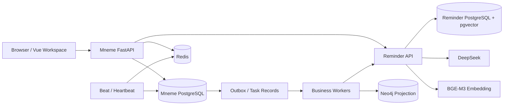

<div align="center">


# Reminder

### The memory Agent at the heart of Mneme

Mneme 的记忆 Agent 本体：让笔记、文档与经历成为可检索、可追踪、可持续演化的个人记忆。

[](https://github.com/juemimgcd/Reminder/actions/workflows/reminder-deploy.yml)
[](VERSION)
[](https://www.python.org/)
[](https://vuejs.org/)
[](https://fastapi.tiangolo.com/)
[](LICENSE)

[产品能力](#产品能力) · [系统架构](#系统架构) · [快速开始](#快速开始) · [配置](#配置) · [部署与运维](#部署与运维) · [文档](#文档)

</div>

**Reminder 是 Mneme 的 Agent 本体**，负责检索、记忆治理、回答生成、引用验证与长期记忆演化。**Mneme 是完整项目**，在 Reminder 之外还包含知识库、文档工作台、知识图谱、个人画像、成长分析、Vue 前端与部署运维体系。

本仓库同时维护 Mneme 应用与 Reminder Agent，并通过清晰的数据所有权、版本化 HTTP 契约和可恢复异步链路隔离二者职责。

## 为什么是 Reminder

- **长期记忆，而非一次性上下文**：从对话、文档和显式请求中形成受治理的记忆候选、修订与关系；
- **答案有来源**：结合 BGE-M3、pgvector、图谱与引用校验，保留回答所使用的证据；
- **数据边界清晰**：Mneme 与 Reminder 拥有独立数据库，只通过版本化 HTTP 契约通信；
- **异步链路可恢复**：PostgreSQL Outbox/Inbox、耐久 Agent Run、租约与幂等语义共同处理重试和进程中断；
- **记忆可以删除与重建**：删除 fence 阻止旧事件“复活”数据，投影和派生状态可安全回填；
- **从开发到发布完整闭环**：Vue 工作台、FastAPI API、Compose 服务栈、GHCR 版本镜像、监控规则与运维手册均在同一仓库维护。

## 产品能力

| 领域 | 能力 |
|---|---|
| 知识工作台 | 多知识库、文件夹、文档上传与阅读、解析切分、索引状态与失败重试 |
| AI 对话 | 知识库、记忆、画像、分析和通用对话模式，支持流式事件、回答再生成与会话历史 |
| 混合检索 | BGE-M3 语义向量、PostgreSQL pgvector、查询路由、结果融合、可选 reranker |
| 长期记忆 | 记忆候选、人工治理、Canonical Memory、修订历史、证据关系与删除边界 |
| 知识图谱 | Neo4j 投影、图谱查询与可重建派生状态 |
| 画像与成长 | 个人画像、成长报告、趋势分析与建议生成 |
| Agent Runtime | Durable Agent Run、事件流、steer/follow-up、abort、Heartbeat 与站内通知 |
| 自动化 | 定时和事件触发任务、active hours、审批提案及风险分级 |
| 多通道 | 版本化通道契约、消息投递队列与有序 Agent 流事件 |
| 生产基础 | JWT、限流、结构化日志、Prometheus 指标、告警规则、备份恢复与版本化发布流程 |

### 当前状态

当前版本为 **v0.1.0**，主回答链路已统一为：

```text
Mneme -> Reminder API -> DeepSeek
                \-> BGE-M3 + pgvector
```

Reminder 是在线回答的唯一 Agent 运行路径；失败会以可重试错误明确返回，不会在同一请求中静默切换回进程内实现。Milvus 保留为旧 Mneme 向量后端的可选兼容 profile，不是 Reminder 在线问答的必需依赖。

## 系统架构


```mermaid
flowchart LR
    U["Browser / Vue Workspace"] --> A["Mneme FastAPI"]
    A --> P[("Mneme PostgreSQL")]
    A --> R[("Redis")]
    A --> M["Reminder API"]
    P --> O["Outbox / Task Records"]
    O --> W["Business Workers"]
    W --> M
    W --> N[("Neo4j Projection")]
    M --> MP[("Reminder PostgreSQL + pgvector")]
    M --> D["DeepSeek"]
    M --> E["BGE-M3 Embedding"]
    B["Beat / Heartbeat"] --> R
    B --> P
```

### 服务职责

| 组件 | 职责 | 事实来源 |
|---|---|---|
| Mneme API | 用户、知识库、文档、会话、任务编排与前端托管 | Mneme PostgreSQL |
| Business Worker | 文档索引、Outbox 投影、Agent Run、自动化与维护任务 | PostgreSQL + Celery |
| Reminder | 检索、记忆治理、回答生成、引用验证与记忆删除 | Reminder PostgreSQL |
| Redis | Celery broker/result、短期事件流、FIFO 与可续租租约 | 临时协调状态 |
| Neo4j | 知识图谱读取模型 | 可重建派生状态 |
| Milvus | 旧 Mneme 向量后端兼容 | 可选 profile |

关键不变量：

- PostgreSQL 的 `agent_runs` 是耐久运行事实源，Redis 只负责短期协调；
- Mneme 与 Reminder 禁止跨数据库读取或 join；
- Neo4j、Milvus 和其他投影必须可以由主事实重建；
- 写动作只生成风险分级的审批提案；当前 `apply_enabled=false`，批准后也不会自动修改数据；
- 日志、指标与删除审计只记录安全 ID、状态、计数和耗时，不记录 Prompt、答案、证据正文、记忆内容或凭据。

更多设计细节见[架构文档](docs/architecture.md)与[运行时契约](docs/runtime-contracts.md)。

## 快速开始

推荐使用 Docker Compose 启动完整服务栈。

### 环境要求

- Docker Engine 与 Docker Compose v2
- 至少可容纳约 **2.3 GB** BGE-M3 模型缓存的磁盘空间
- 可用的 DeepSeek API Key

### 1. 获取项目

```bash
git clone https://github.com/juemimgcd/Reminder.git Mneme
cd Mneme
```

### 2. 创建配置

```bash
# Linux / macOS / WSL
cp .env-example .env
```

Windows PowerShell：

```powershell
# Windows PowerShell
Copy-Item .env-example .env
```

至少修改以下配置：

```dotenv
DEEPSEEK_API_KEY=replace-with-your-deepseek-api-key
JWT_SECRET=replace-with-a-long-random-secret
MEMORY_AGENT_SERVICE_JWT_SECRET=replace-with-another-long-random-secret
POSTGRES_PASSWORD=replace-with-a-database-password
NEO4J_PASSWORD=replace-with-a-neo4j-password
```

> [!WARNING]
> `JWT_SECRET` 与 `MEMORY_AGENT_SERVICE_JWT_SECRET` 必须使用两个不同的随机密钥。示例配置中的默认密码只适合本地开发。

### 3. 启动服务

```bash
docker compose up -d --build
docker compose ps
```

首次启动会下载 BGE-M3 模型。模型缓存保存在 `storage` volume 中，后续重建容器无需重复下载；Memory Agent readiness 会在模型预加载与依赖检查完成后才通过。

### 4. 访问与检查

- 应用工作台：<http://127.0.0.1:8000/>
- OpenAPI：<http://127.0.0.1:8000/docs>
- Mneme 健康检查：<http://127.0.0.1:8000/health>

```bash
curl -fsS http://127.0.0.1:8000/health

docker compose exec -T memory-agent-api python -c \
  "from urllib.request import urlopen; print(urlopen('http://127.0.0.1:8010/health/readiness').read().decode())"

docker compose exec -T memory-agent-api python -c \
  "from urllib.request import urlopen; print(urlopen('http://127.0.0.1:8010/health/worker').read().decode())"
```

Memory Agent API 只在 Compose 网络中通过 `memory-agent-api:8010` 提供服务，不需要暴露到宿主机公网。

## 配置

Mneme 使用两层配置：

- **`.env`**：应用、数据库、JWT、Redis、Celery、Neo4j、模型缓存、通道和部署参数；
- **`memoria.json`**：Agent 模型、上下文预算、检索、推理、工具与可选 Multi-Agent 策略。

`memoria.json` 可以通过 `${VAR_NAME}` 引用 `.env` 中的密钥，也可以用 `MEMORIA_CONFIG_PATH` 指定其他文件。Agent 配置以 `memoria.json` 为准，旧 Agent 环境变量不会覆盖它。

### 常用环境变量

| 配置项 | 用途 |
|---|---|
| `DATABASE_URL` | Mneme 主数据库连接 |
| `JWT_SECRET` | 用户 JWT 签名密钥 |
| `MEMORY_AGENT_SERVICE_JWT_SECRET` | Mneme 调用 Reminder 的服务身份密钥 |
| `DEEPSEEK_API_KEY` | 当前默认聊天、记忆提取与回答模型凭据 |
| `MEMORIA_CONFIG_PATH` | Agent JSON 配置文件位置 |
| `CELERY_BROKER_URL` / `CELERY_RESULT_BACKEND` | Celery broker 与结果存储 |
| `NEO4J_URI` / `NEO4J_PASSWORD` | 图谱服务连接 |
| `MEMORY_AGENT_EMBEDDING_MODEL_NAME` | Memory Agent embedding 模型，默认 `BAAI/bge-m3` |
| `MEMORY_AGENT_EMBEDDING_LOCAL_FILES_ONLY` | 是否只从本地缓存加载模型 |
| `MEMORY_AGENT_EMBEDDING_SPARSE_ENABLED` | 是否启用 BGE-M3 sparse 文档检索；启用后需先回填活动 chunk |
| `MEMORY_AGENT_EMBEDDING_SPARSE_HEAD_PATH` | 可选的本地 `sparse_linear.pt` 路径；为空时从 BGE-M3 缓存解析 |
| `APP_HOST_PORT` | 宿主机监听地址，生产环境建议绑定 `127.0.0.1:8000` |

### Agent 配置入口

`memoria.json` 的主要配置段：

- `chat.model`、`chat.history`、`chat.retrieval`；
- `memory_agent.extraction_model`、`memory_agent.answer_model`；
- `memory_agent.retry`、`memory_agent.answer`、`memory_agent.reasoning`；
- `memory_agent.tools`、`memory_agent.multi_agent`。

默认配置使用 DeepSeek 完成聊天、记忆提取与回答，使用 `BAAI/bge-m3` 生成语义向量。

## 本地开发

如需脱离 Compose 联调，需要自行准备 Python 3.12、Node.js 20、PostgreSQL/pgvector、Redis 和 Neo4j。

### 安装依赖

```bash
python -m pip install -r requirements.txt

cd app/mneme_frontend_v0.2.1
npm ci
cd ../..
```

依赖按用途拆分在 `requirements/`：

- `base.txt`：API、数据库、任务队列与文档处理；
- `ai.txt`：LLM、embedding 与 reranker；
- `vector.txt`：Milvus 兼容依赖；
- `test.txt`：后端测试依赖；
- `dev.txt`：完整开发和质量检查依赖。

### 迁移并启动

```bash
python -m alembic upgrade head
./start.sh
```

`start.sh` 需要 Bash，支持：

```bash
./start.sh --backend-only
./start.sh --frontend-only
./start.sh --backend-port 8001
./start.sh --dry-run
```

## 部署与运维

### Compose 服务

完整 Compose 栈包括：

- PostgreSQL/pgvector、Redis 与 Neo4j；
- Mneme migration、API、business worker 与 beat；
- Reminder database init、migration、API 与 worker；
- 可选的 Milvus、etcd 与 MinIO `vector` profile。

仅兼容旧 Mneme Milvus 向量后端时启用：

```bash
COMPOSE_PROFILES=vector docker compose up -d --build
```

常用排查命令：

```bash
docker compose ps
docker compose logs -f app
docker compose logs -f worker
docker compose logs -f memory-agent-api
docker compose logs -f memory-agent-worker
docker compose logs -f beat
docker compose exec -T app python -m app.mneme.memoria.cli.operations
```

生产环境应将应用置于 Nginx 后方，只对外暴露 Web 入口，不直接暴露 PostgreSQL、Redis、Neo4j、Milvus 或 Memory Agent API。

### 版本发布与回滚

Git tag `vMAJOR.MINOR.PATCH` 会触发 GitHub Actions 完成后端、前端、集成测试与确定性 Reminder 评测，随后发布版本化 GHCR 镜像。

```bash
docker login ghcr.io
IMAGE_TAG=v0.1.0 bash deploy/release-image.sh
```

回滚时使用上一版本 tag 重新执行同一脚本。不要删除 Outbox/Inbox、投影、记忆、删除 fence 或 Answer Run 审计数据：

```bash
IMAGE_TAG=v0.0.9 bash deploy/release-image.sh
```

生产准备、Nginx、systemd、备份、恢复、监控与故障排查见：

- [部署指南](deploy/DEPLOY.md)
- [Operations Runbook](docs/operations-runbook.md)

### 删除、回填与重建

Mneme 使用按事件 envelope 排序的删除 fence，确保迟到或重放的旧事件不能重新写入已经删除的文档、知识库或会话数据。投影回填复用在线 DTO 与 Outbox 契约，并使用原子 checkpoint 支持安全续跑。

预览 Mneme 到 Reminder 的投影回填：

```bash
python -m app.mneme.memoria.cli.export_projection \
  --dry-run \
  --owner-id 42 \
  --knowledge-base-id kb_123 \
  --batch-size 50
```

执行可恢复回填：

```bash
python -m app.mneme.memoria.cli.export_projection \
  --owner-id 42 \
  --knowledge-base-id kb_123 \
  --batch-size 50 \
  --checkpoint var/memory-agent-backfill.json
```

只读检查 Reminder 投影状态：

```bash
python -m app.mneme.memoria.server.cli.backfill \
  --owner-id 42 \
  --knowledge-base-id kb_123 \
  --batch-size 100 \
  --dry-run
```

迁移后补齐历史 memory revision 的语义向量：

```bash
python -m app.mneme.memoria.server.cli.embedding_backfill --memory --dry-run
python -m app.mneme.memoria.server.cli.embedding_backfill --memory --batch-size 100
```

上下文化向量格式升级后重建当前文档 chunk 向量：

```bash
python -m app.mneme.memoria.server.cli.embedding_backfill --documents --dry-run
python -m app.mneme.memoria.server.cli.embedding_backfill --documents --batch-size 100
```

启用 BGE-M3 sparse 检索时，先执行数据库迁移，再设置
`MEMORY_AGENT_EMBEDDING_SPARSE_ENABLED=true` 并运行上述 document backfill。任一 owner/KB
仍有活动 chunk 缺少 sparse 向量时，检索会继续使用原有 dense + keyword 路径。

完整删除、重建和恢复流程见[部署指南中的 Reminder operations](deploy/DEPLOY.md#memoria-rebuild-and-deletion-operations)。

## 项目结构

```text
.
├── app/
│   ├── mneme/
│   │   ├── bootstrap/            # 应用创建、路由与 lifespan
│   │   ├── domains/              # 业务域 API 与服务
│   │   ├── infra/                # Celery、缓存、限流与存储适配
│   │   ├── memoria/              # Memory Agent 契约、客户端与独立服务
│   │   ├── models/               # SQLAlchemy ORM
│   │   ├── pipelines/            # 索引、记忆、分析与建议流程
│   │   └── tasks/                # Celery task 入口
│   └── mneme_frontend_v0.2.1/    # Vue 3 / TypeScript 工作台
├── alembic/                      # Mneme 数据库迁移
├── deploy/                       # 发布、Nginx、systemd 与监控
├── docker/                       # 镜像入口脚本
├── requirements/                 # 分组 Python 依赖
├── tests/                        # 单元、契约与集成测试
├── memoria.json                  # Agent 运行配置
├── docker-compose.yml            # 完整服务拓扑
└── main.py                       # FastAPI 入口
```

## 质量检查

### 后端

```bash
python -m pip install -r requirements/dev.txt
python -m compileall app main.py
python -m ruff check app main.py tests
python -m pytest -q -p no:cacheprovider -m "not integration"
```

确定性 Reminder 评测：

```bash
python -m app.mneme.memoria.server.eval.runner \
  --dataset app/mneme/memoria/server/eval/cases.jsonl \
  --multi-agent-dataset app/mneme/memoria/server/eval/multi_agent_cases.jsonl \
  --output .tmp/memoria-eval.json
```

### 前端

```bash
cd app/mneme_frontend_v0.2.1
npm ci
npm run lint
npm run test:contracts
npm run build
```

### 集成测试

集成测试需要真实 PostgreSQL/pgvector 与 Redis：

```bash
RUN_INTEGRATION_TESTS=1 \
python -m pytest -q -p no:cacheprovider -m integration tests/integration
```

CI 会分别执行前端、后端和集成检查；只有三个阶段全部通过，版本 tag 才能发布镜像。

## 文档

| 文档 | 内容 |
|---|---|
| [Architecture](docs/architecture.md) | 系统边界、数据所有权与核心执行流 |
| [Runtime Contracts](docs/runtime-contracts.md) | 耐久运行、事件、Outbox、Evidence、Tool 与错误不变量 |
| [Current State](docs/current-state.md) | 已完成能力、当前风险与下一阶段计划 |
| [Answer Modes](docs/answer-modes.md) | 知识库、记忆、画像、分析与通用回答模式 |
| [Reminder Module](docs/memoria-module.md) | Reminder Agent 模块边界与集成方式 |
| [Exception Boundaries](docs/exception-boundaries.md) | 异常分类、传播与恢复约束 |
| [Operations Runbook](docs/operations-runbook.md) | 监控、告警、备份、恢复与故障处理 |
| [Deployment](deploy/DEPLOY.md) | 生产部署、发布、回滚及 Reminder 运维 |

规范路径：[docs/architecture.md](docs/architecture.md)、[docs/runtime-contracts.md](docs/runtime-contracts.md)、[docs/current-state.md](docs/current-state.md)。

## 参与贡献

欢迎通过 [Issues](https://github.com/juemimgcd/Reminder/issues) 报告问题或提出建议。提交 Pull Request 前，请运行与改动范围对应的质量检查，并保持以下边界：

- 不跨越 Mneme 与 Reminder 的数据库所有权；
- 不以进程内快捷路径替代耐久队列、Outbox 或审批；
- 不在日志、指标或错误响应中暴露内容与凭据；
- 所有派生状态必须保持可重建。

## License

本项目基于 [MIT License](LICENSE) 开源。
