# Day 1 - Day 20 主体架构总览

这份文档只看两件事：

- Day 1 到 Day 20 每天到底把 `Mneme` 推进成了什么能力
- 这 20 天的能力最后如何拼成一个“长期记忆 + GraphRAG + 可评测 + 可演进”的系统

这一版基于 `Mneme_polish_v4.md` 整理，刻意不展开 ORM 字段、表结构实现细节和具体函数签名，只保留主线、阶段目标和架构意义。

---

## 一句话总览

Day 1 到 Day 20，整条优化主线其实就是：

```text
把一个“以 Chunk RAG 为主的后端原型”
-> 升级成“MemoryEntry 主链路化的长期记忆系统”
-> 升级成“Chunk + Memory + Graph 的 Evidence RAG 系统”
-> 升级成“任务可恢复、图投影可重放、效果可评测”的工程化后端
-> 最后再收口成“可继续减重、可继续演进”的模块化架构
```

---

## 架构优化主线

如果只从“架构优化”角度看，这 20 天其实又可以压缩成另一条线：

```text
先把 Mneme 的产品目标从“文档问答”改成“长期记忆系统”
-> 再把主业务链路从 Chunk RAG 升级成 Memory + Graph + Evidence RAG
-> 再把执行过程从同步串行升级成任务化、状态化、可重放
-> 再把系统结构从平铺目录升级成 api / core / domains / workflow 分层
-> 最后用 LlamaIndex 和 MongoDB 有选择地减掉不该长期自研维护的部分
```

这意味着 Day 1 - Day 20 不只是能力增强，也是在持续回答 5 个架构问题：

```text
1. 核心业务对象到底是谁：Chunk 还是 MemoryEntry
2. 核心回答链路到底怎么收口：单检索还是 Chunk + Memory + Graph
3. 核心执行模型到底怎么升级：同步调用还是任务化状态机
4. 核心代码结构到底怎么演进：平铺目录还是领域收口
5. 核心技术债到底怎么减：继续自研还是引入成熟框架承接
```

---

## Day 1：重定项目目标与优化边界

### Day 1 做成了什么

- 明确 Mneme 下一阶段不再只是文档问答系统
- 确认目标从 `Chunk RAG` 升级为 `长期记忆系统`
- 划清本轮不优先做的内容：多模态、重平台化、复杂权限、过早前端可视化

### Day 1 流程图

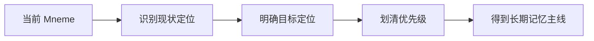

### 这一天的意义

Day 1 不是写代码，  
而是先回答一个更根的问题：

> Mneme 接下来到底是在继续堆功能，还是在把系统真正推进成“长期记忆引擎”？

---

## Day 2：目标架构升级蓝图

### Day 2 做成了什么

- 把主链路从 `Document -> Chunk -> Embedding -> Retrieval -> Answer`
  升级成
  `Document -> Chunk -> MemoryEntry -> GraphRAG -> Profile Snapshot -> Evidence Answer`
- 明确后续阶段划分：记忆闭环、检索质量、可靠性、长期记忆、评测闭环、分析层

### Day 2 流程图

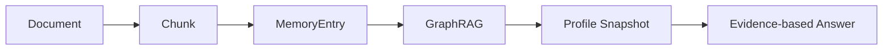

### 这一天的意义

Day 2 解决的是：

> 后面每一天做的优化，到底应该接在什么总蓝图上？

---

## Day 3：MemoryEntry 正式进入主链路

### Day 3 做成了什么

- 明确 `MemoryEntry` 不再是附属分析结果，而是核心资产
- 定义了 MemoryEntry 主链路在文档索引流程中的位置
- 明确 MemoryEntry 的类型、字段和状态语义

### Day 3 流程图

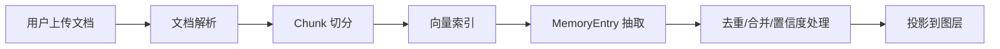

### 这一天的意义

Day 3 解决的是：

> 为什么 Mneme 不能永远停留在“只会检索 Chunk”的阶段？

---

## Day 4：回答证据化

### Day 4 做成了什么

- 明确回答必须绑定来源
- 设计回答结构中的 `answer / source ids / confidence / uncertainty`
- 把“引用感”和“可追溯性”正式写进系统目标

### Day 4 流程图

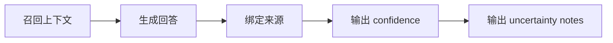

### 这一天的意义

Day 4 解决的是：

> 长期记忆系统为什么不能只给结论，而必须给证据？

---

## Day 5：Hybrid Search 第一版

### Day 5 做成了什么

- 确认单纯向量检索不够
- 引入 `vector + keyword + memory` 的多路召回思路
- 明确 `ContextItem` 作为统一召回结果结构

### Day 5 流程图

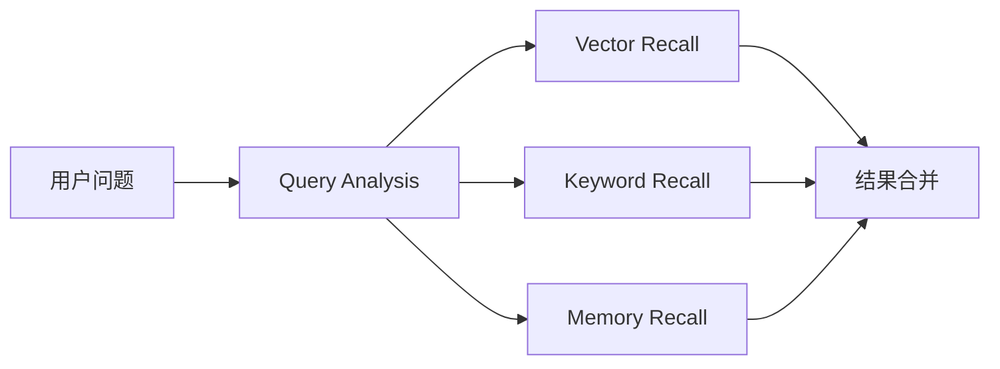

### 这一天的意义

Day 5 解决的是：

> 为什人名、日期、标题、术语类查询不能只靠 embedding？

---

## Day 6：Chunk 结构化切分

### Day 6 做成了什么

- 把 Chunk 从“固定大小文本块”升级为“结构感知块”
- 明确 `Document -> Section -> Chunk -> EvidenceSpan` 的层次
- 强调检索时要返回相邻 chunk 和 section 摘要

### Day 6 流程图

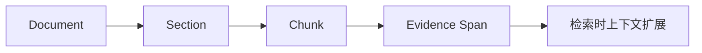

### 这一天的意义

Day 6 解决的是：

> 为什么切分策略会直接决定后面检索和回答质量？

---

## Day 7：Rerank 层

### Day 7 做成了什么

- 在多路召回之后增加统一 rerank
- 明确 `vector_score / keyword_score / memory_importance / graph_distance / recency`
  等融合因子
- 给后续 cross-encoder 或 LLM rerank 留接口

### Day 7 流程图

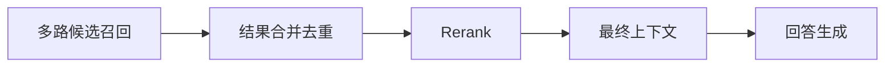

### 这一天的意义

Day 7 解决的是：

> 多路召回以后，为什么不能直接把所有结果一股脑塞给模型？

---

## Day 8：Neo4j 从展示层升级为检索层

### Day 8 做成了什么

- 让 Neo4j 进入回答链路，不再只是图展示
- 定义 GraphRAG 的 seed node、图扩展和 structured context 过程
- 让图谱真正参与多跳关系理解

### Day 8 流程图

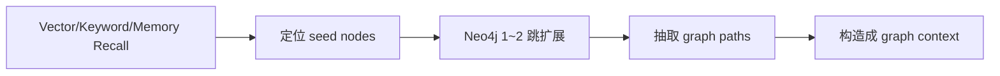

### 这一天的意义

Day 8 解决的是：

> 图数据库如果只用来画图，为什么价值不够？

---

## Day 9：关系类型细化

### Day 9 做成了什么

- 把图关系从模糊 `RELATED` 升级到更细颗粒度的语义关系
- 支持 `SUPPORTS / CONTRADICTS / REFINES / EVIDENCE_FOR / ABOUT_TOPIC`
  等关系
- 为后续冲突检测、主题演化和画像稳定性打基础

### Day 9 流程图

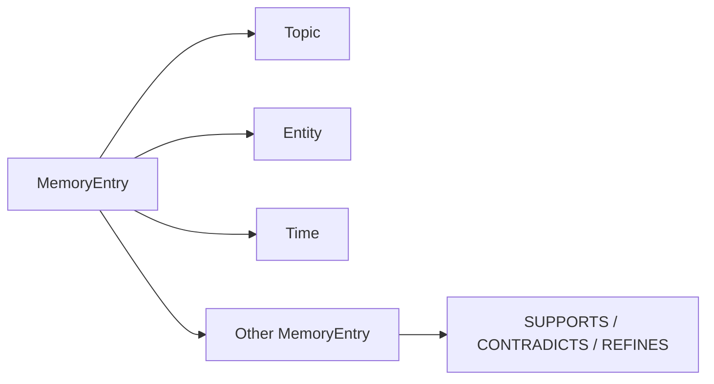

### 这一天的意义

Day 9 解决的是：

> 图谱关系如果太粗，为什么后面的推理和演化分析会失真？

---

## Day 10：TaskRecord 状态机

### Day 10 做成了什么

- 正式把长任务纳入 `TaskRecord`
- 明确 `pending / running / succeeded / failed / retrying / cancelled`
  等状态语义
- 把任务过程从“黑盒执行”变成“可观察执行”

### Day 10 流程图

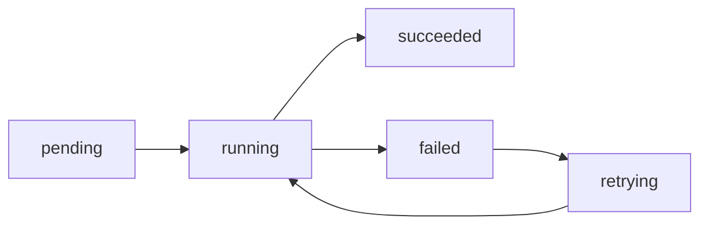

### 这一天的意义

Day 10 解决的是：

> 文档索引、记忆抽取、图投影这些长任务，为什么不能再只靠同步调用和日志硬扛？

---

## Day 11：Graph Projection Outbox

### Day 11 做成了什么

- 确立 PostgreSQL 是事实源，Neo4j 是投影层
- 用 outbox 隔离主业务事务和图投影副作用
- 给图谱重放、重试、死信处理留出基础

### Day 11 流程图

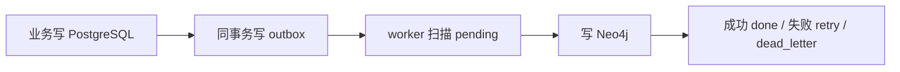

### 这一天的意义

Day 11 解决的是：

> Neo4j 暂时不可用时，为什么不应该直接把图投影丢掉？

---

## Day 12：记忆合并与 CanonicalMemory

### Day 12 做成了什么

- 正式把重复、补充、冲突、演化这些记忆关系纳入治理
- 设计 `CanonicalMemory`
- 明确 `duplicate / supplement / contradict / refine / temporal_update`
  这些演化判定

### Day 12 流程图

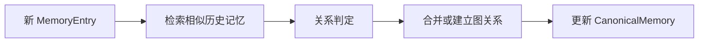

### 这一天的意义

Day 12 解决的是：

> 长期记忆如果只会越积越多，不会合并和演化，最后为什么一定会变成噪声库？

---

## Day 13：画像快照

### Day 13 做成了什么

- 明确画像不应每次临时全量生成
- 引入 `stable_profile / recent_profile / topic_profile / growth_snapshot`
- 让 ProfileSnapshot 成为稳定可读资产

### Day 13 流程图

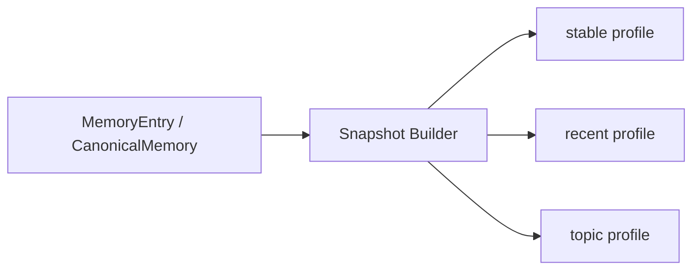

### 这一天的意义

Day 13 解决的是：

> 画像为什么不能每次都现扫全库、现让模型临时总结？

---

## Day 14：时间线与反复主题发现

### Day 14 做成了什么

- 引入时间线和主题频率分析能力
- 让系统开始能回答“最近在反复关注什么”“哪些目标在演化”
- 让长期记忆真正带上时间视角

### Day 14 流程图

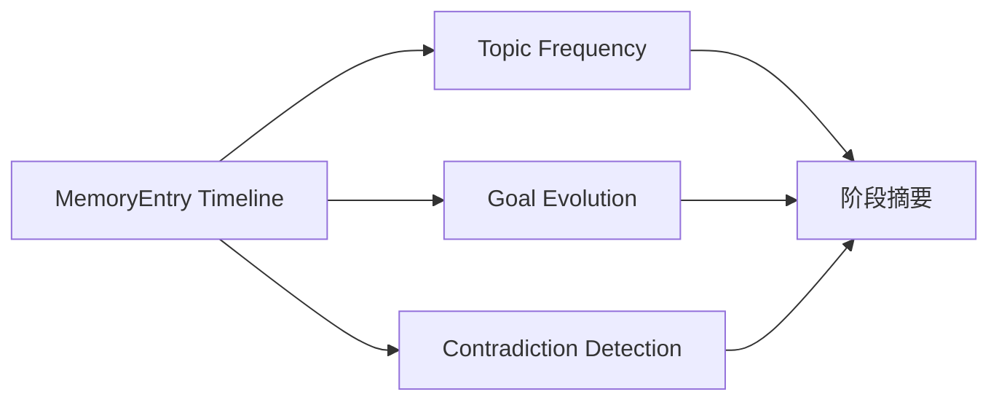

### 这一天的意义

Day 14 解决的是：

> 只有“记住”还不够，为什么还要“看到变化”？

---

## Day 15：Retrieval Debug

### Day 15 做成了什么

- 给每次问答保留 `query_rewrite / vector_results / keyword_results / graph_paths / rerank_scores`
- 把召回失败、误召回、低质量上下文变成可分析对象
- 为后续 Eval 和调参准备原始观测面

### Day 15 流程图

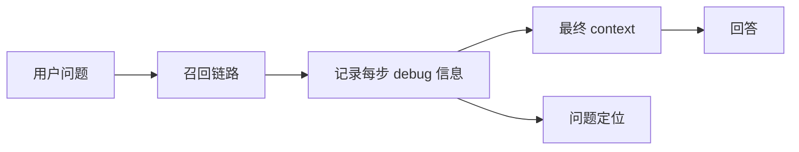

### 这一天的意义

Day 15 解决的是：

> 当回答不好时，系统到底是检索差、排序差、还是证据组装差？

---

## Day 16：RAG Eval

### Day 16 做成了什么

- 引入 `eval_dataset / eval_case / eval_run / eval_result`
- 明确 `Recall@K / MRR / Faithfulness / Citation Accuracy`
  等核心指标
- 让每次优化从“感觉变好了”升级成“可以量化比较”

### Day 16 流程图

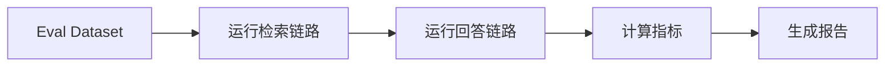

### 这一天的意义

Day 16 解决的是：

> 没有评测闭环，为什么所有 RAG 优化最后都容易沦为拍脑袋？

---

## Day 17：DuckDB 分析与调试辅助层

### Day 17 做成了什么

- 把 DuckDB 定位成分析层，而不是主业务数据库
- 用于 retrieval logs、eval results、chunk stats 的离线分析
- 给调试、报表、实验比较提供轻量 SQL 能力

### Day 17 流程图

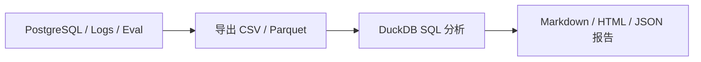

### 这一天的意义

Day 17 解决的是：

> 系统要如何具备“自我分析能力”，而不是只会运行？

---

## Day 18：入口变薄与装配层收口

### Day 18 做成了什么

- 把 `main.py` 从大总管入口变成薄入口
- 引入 `bootstrap / api / core / container`
  这套装配收口思路
- 减少散落的依赖注入和全局 import 穿透

### Day 18 流程图

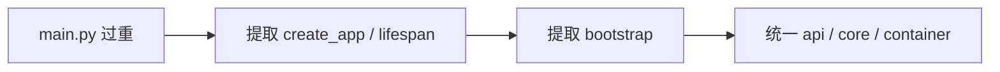

### 这一天的意义

Day 18 解决的是：

> 为什么一个长期要演进的后端，不能把所有装配细节一直堆在入口文件里？

### 架构层面的变化

从这一天开始，Mneme 的优化不再只盯业务能力，  
而是开始显式处理下面这些结构问题：

```text
入口文件过重
依赖注入散落
启动/关闭逻辑混杂
全局资源没有统一收口
```

---

## Day 19：领域化收口

### Day 19 做成了什么

- 把平铺的 `routers / services / schemas / models / crud`
  逐步收敛为 `domains`
- 先重构 `documents`
- 再抽 `retrieval / memory / graph / workflow`
  的明确边界

### Day 19 流程图

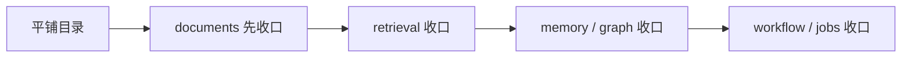

### 这一天的意义

Day 19 解决的是：

> 当系统开始复杂起来，为什么“目录搬家”不等于“架构优化”，而必须先收口边界？

### 架构层面的变化

Day 19 真正推动的是这一件事：

```text
把“按技术类型平铺”
改成
“按领域职责收口”
```

也就是逐步从：

```text
routers/
services/
schemas/
models/
crud/
clients/
pipelines/
```

演进到：

```text
app/mneme/
  api/
  core/
  infra/
  domains/
  workflow/
```

这样后面的 `documents / retrieval / memory / graph / tasks`
才会有真正稳定的边界。

---

## Day 20：LlamaIndex / MongoDB 裁剪式引入

### Day 20 做成了什么

- 明确 `LlamaIndex` 适合减掉一部分 RAG 编排代码
- 明确 `MongoDB` 更适合先承接 snapshot / debug / eval / logs
  这类半结构化副存储
- 保持 `PostgreSQL` 继续做主事务层，避免过早替主库

### Day 20 流程图

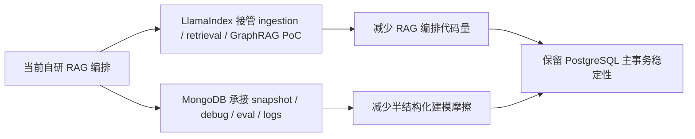

### 这一天的意义

Day 20 解决的是：

> 架构优化做到后面，为什么还要继续“减重”，而不是把所有能力都永远自己维护？

### 架构层面的变化

Day 20 不是在推翻前面的架构优化，  
而是在做最后一步判断：

```text
哪些层必须自己掌握
哪些层适合交给成熟框架
哪些存储必须继续保持事务稳定
哪些数据更适合进入半结构化副存储
```

所以它对应的是“架构减重”，不是“架构重来”。

---

## Day 1 - Day 20 串联总图

```mermaid
flowchart TD
    A[Day 1-2 目标重定向与蓝图] --> B[Day 3-4 MemoryEntry + Evidence]
    B --> C[Day 5-7 Hybrid Search + Chunk + Rerank]
    C --> D[Day 8-9 GraphRAG + 图关系细化]
    D --> E[Day 10-11 TaskRecord + Outbox]
    E --> F[Day 12-14 CanonicalMemory + Snapshot + Timeline]
    F --> G[Day 15-17 Debug + Eval + DuckDB]
    G --> H[Day 18-19 入口变薄 + 领域化收口]
    H --> I[Day 20 LlamaIndex + MongoDB 减重策略]
```

### 这 20 天到底在搭什么

这 20 天不是在做一个“功能越来越多”的后端，  
而是在把 Mneme 推向下面这个形态：

```text
一个以文档为输入
以 MemoryEntry 为核心资产
以 GraphRAG 为关系扩展层
以 Evidence Answer 为输出规范
以 TaskRecord / Outbox 为可靠性保障
以 Eval / DuckDB 为反馈闭环
以领域化收口和外部框架减重为长期演进基础
的长期记忆后端系统
```

---

## 最终系统总架构图

```mermaid
flowchart TD
    A[User Upload / Query] --> B[API Layer]
    B --> C[Document Pipeline]
    C --> D[Chunk]
    D --> E[MemoryEntry Extraction]
    E --> F[CanonicalMemory / Snapshot]
    D --> G[Vector Store]
    E --> H[Neo4j Graph]
    B --> I[Retrieval Orchestrator]
    G --> I
    E --> I
    H --> I
    I --> J[Rerank / Context Assembly]
    J --> K[Evidence-based Answer]
    C --> L[TaskRecord / Worker]
    E --> M[Graph Projection Outbox]
    I --> N[Retrieval Debug]
    N --> O[Eval / DuckDB Analysis]
```

### 这张图要表达什么

这张图想表达的不是“Mneme 接了很多组件”，  
而是它的主线已经从普通 RAG 系统升级成了：

```text
索引链路可治理
检索链路可解释
记忆资产可演化
图投影可重放
问答结果可追溯
优化效果可评测
架构结构可继续减重
```

### 目标分层结构

如果把最终目标再用代码结构说一遍，它更接近下面这种分层：

```text
app/mneme/
  main.py
  bootstrap/
    app_factory.py
    startup.py
    shutdown.py
    router_registry.py
  api/
    router.py
    deps.py
    response.py
    errors.py
  core/
    config.py
    container.py
    logging.py
  domains/
    documents/
    retrieval/
    memory/
    graph/
    profile/
    tasks/
    analysis/
  workflow/
    jobs/
    dispatcher.py
    task_state.py
  infra/
    vector_store/
    graph_store/
    cache/
    retry/
    rate_limit/
```

这个目标结构想表达的是：

```text
api 负责入站请求
core 负责应用装配
domains 负责业务边界
workflow 负责长任务执行模型
infra 负责外部基础设施适配
```

---

## 最小长期记忆闭环图

```mermaid
flowchart LR
    A[Document] --> B[Chunk]
    B --> C[MemoryEntry]
    C --> D[CanonicalMemory]
    C --> E[Neo4j Graph]
    B --> F[Vector Search]
    C --> G[Memory Search]
    E --> H[Graph Expansion]
    F --> I[Retrieval Orchestrator]
    G --> I
    H --> I
    I --> J[Evidence-based Answer]
    J --> K[Retrieval Debug / Eval]
```

### 这一张图就是整个 Day 1 - Day 20 的灵魂

如果只记住一张图，就记住这一张。

因为它说明了 Mneme 最终不是：

```text
上传文档
切 chunk
做 embedding
问答
```

而是：

```text
上传文档
生成结构化记忆
把记忆组织成图
用 Chunk + Memory + Graph 联合回答
再把效果回流到 debug / eval / analysis
```

---

## 20 天结束时，你应该拿到什么

```text
1. 一个明确从 Chunk RAG 升级到长期记忆系统的总蓝图
2. 一条以 MemoryEntry 为核心资产的主链路
3. 一套 Hybrid Search + GraphRAG 的检索思路
4. 一套以 Evidence 为约束的回答标准
5. 一套 TaskRecord + Outbox 的可靠性底座
6. 一套 CanonicalMemory + Snapshot + Timeline 的长期记忆治理能力
7. 一套 Retrieval Debug + RAG Eval + DuckDB 的反馈闭环
8. 一条 main.py 变薄、领域化收口、继续减重的架构演进路线
9. 一份对 LlamaIndex / MongoDB 引入顺序的克制判断
10. 一个真正可以继续往公司级架构靠近，但又不至于过度设计的 Mneme 方案
```

---

## 最后一句话

Day 1 到 Day 20，不是在把 Mneme 做成“更复杂的 RAG”，  
而是在把它做成：

> 一个能记、能查、能解释、能演化、能评测、还能继续减重的长期记忆后端。
