# Day 1 - Day 20 主体架构总览

这份文档只看两件事：

- Day 1 到 Day 20 每天到底把 `Mneme` 推进成了什么能力
- 这 20 天的能力最后如何拼成一个“长期记忆 + GraphRAG + 可评测 + 可演进”的系统

这一版基于 `Mneme_polish_v4.md` 整理，刻意不展开 ORM 字段、表结构实现细节和具体函数签名，只保留主线、阶段目标和架构意义。

---

## 一句话总览

Day 1 到 Day 20，整条优化主线其实就是：

```text
把一个“以 Chunk RAG 为主的后端原型”
-> 升级成“MemoryEntry 主链路化的长期记忆系统”
-> 升级成“Chunk + Memory + Graph 的 Evidence RAG 系统”
-> 升级成“任务可恢复、图投影可重放、效果可评测”的工程化后端
-> 最后再收口成“可继续减重、可继续演进”的模块化架构
```

---

## 架构优化主线

如果只从“架构优化”角度看，这 20 天其实又可以压缩成另一条线：

```text
先把 Mneme 的产品目标从“文档问答”改成“长期记忆系统”
-> 再把主业务链路从 Chunk RAG 升级成 Memory + Graph + Evidence RAG
-> 再把执行过程从同步串行升级成任务化、状态化、可重放
-> 再把系统结构从平铺目录升级成 api / core / domains / workflow 分层
-> 最后把技术栈收敛到 PostgreSQL + Milvus + Neo4j + Redis，并保留后续消息层替换空间
```

这意味着 Day 1 - Day 20 不只是能力增强，也是在持续回答 5 个架构问题：

```text
1. 核心业务对象到底是谁：Chunk 还是 MemoryEntry
2. 核心回答链路到底怎么收口：单检索还是 Chunk + Memory + Graph
3. 核心执行模型到底怎么升级：同步调用还是任务化状态机
4. 核心代码结构到底怎么演进：平铺目录还是领域收口
5. 核心技术债到底怎么减：收敛数据库/索引组件，还是继续叠加新中间件
```

---

## Day 1：重定项目目标与优化边界

### Day 1 做成了什么

- 明确 Mneme 下一阶段不再只是文档问答系统
- 确认目标从 `Chunk RAG` 升级为 `长期记忆系统`
- 划清本轮不优先做的内容：多模态、重平台化、复杂权限、过早前端可视化

### Day 1 流程图

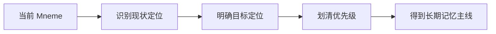

### 这一天的意义

Day 1 不是写代码，  
而是先回答一个更根的问题：

> Mneme 接下来到底是在继续堆功能，还是在把系统真正推进成“长期记忆引擎”？

---

## Day 2：目标架构升级蓝图

### Day 2 做成了什么

- 把主链路从 `Document -> Chunk -> Embedding -> Retrieval -> Answer`
  升级成
  `Document -> Chunk -> MemoryEntry -> GraphRAG -> Profile Snapshot -> Evidence Answer`
- 明确后续阶段划分：记忆闭环、检索质量、可靠性、长期记忆、评测闭环、分析层

### Day 2 流程图

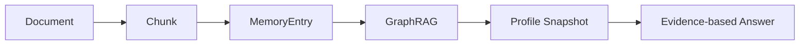

### 这一天的意义

Day 2 解决的是：

> 后面每一天做的优化，到底应该接在什么总蓝图上？

---

## Day 3：MemoryEntry 正式进入主链路

### Day 3 做成了什么

- 明确 `MemoryEntry` 不再是附属分析结果，而是核心资产
- 定义了 MemoryEntry 主链路在文档索引流程中的位置
- 明确 MemoryEntry 的类型、字段和状态语义

### Day 3 流程图

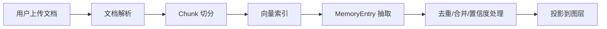

### 这一天的意义

Day 3 解决的是：

> 为什么 Mneme 不能永远停留在“只会检索 Chunk”的阶段？

---

## Day 4：回答证据化

### Day 4 做成了什么

- 明确回答必须绑定来源
- 设计回答结构中的 `answer / source ids / confidence / uncertainty`
- 把“引用感”和“可追溯性”正式写进系统目标

### Day 4 流程图

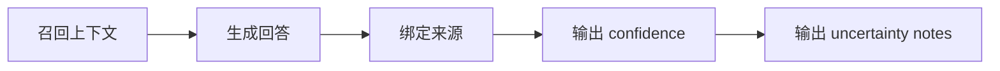

### 这一天的意义

Day 4 解决的是：

> 长期记忆系统为什么不能只给结论，而必须给证据？

---

## Day 5：Hybrid Search 第一版

### Day 5 做成了什么

- 确认单纯向量检索不够
- 引入 `vector + keyword + memory` 的多路召回思路
- 明确 `ContextItem` 作为统一召回结果结构

### Day 5 流程图

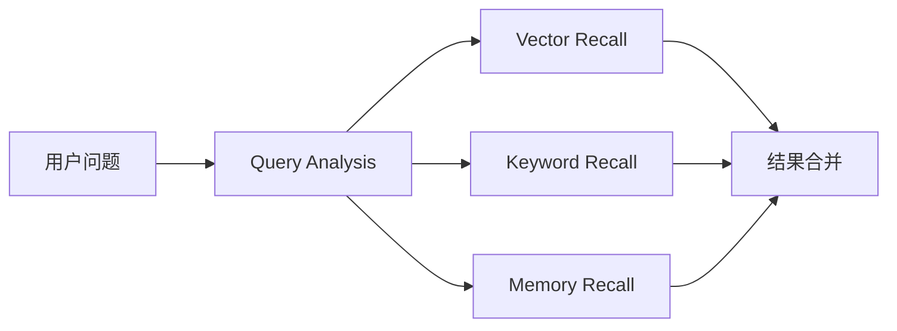

### 这一天的意义

Day 5 解决的是：

> 为什人名、日期、标题、术语类查询不能只靠 embedding？

---

## Day 6：Chunk 结构化切分与检索字段准备

### Day 6 做成了什么

- 把 Chunk 从“固定大小文本块”升级为“结构感知的检索资产”
- 明确 `Document -> Section -> Chunk -> EvidenceSpan` 的层次
- 为每个 chunk 准备可同时进入 Milvus 向量索引和 PostgreSQL keyword recall 的字段
- 明确 `section_title / section_path / section_summary / page_no / chunk_index` 等检索信号

### Day 6 流程图

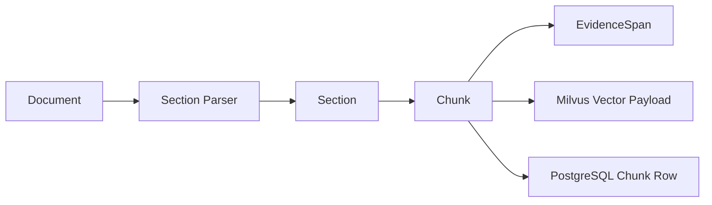

### 这一天的意义

Day 6 解决的是：

> 为什么 RAG 调优不能只从 embedding 和 prompt 下手，而必须先把 chunk 做成可检索、可引用、可评估的资产？

如果 chunk 没有结构，后面的 keyword recall、rerank、citation 校验和 eval 都会缺少稳定字段。

---

## Day 7：Query Router，先判断是否需要 RAG

### Day 7 做成了什么

- 引入 `QueryRouter`，不再让每次对话都强制走 RAG
- 把用户问题先分流为 `general_chat / kb_qa / memory_query / profile_query / analysis_query / action_request`
- 为不同 query type 选择不同链路：普通闲聊走轻量回答，知识库问题走 RAG，画像问题走 profile pipeline
- 记录 router 决策，方便后续评估“该不该检索”的准确率

### Day 7 流程图

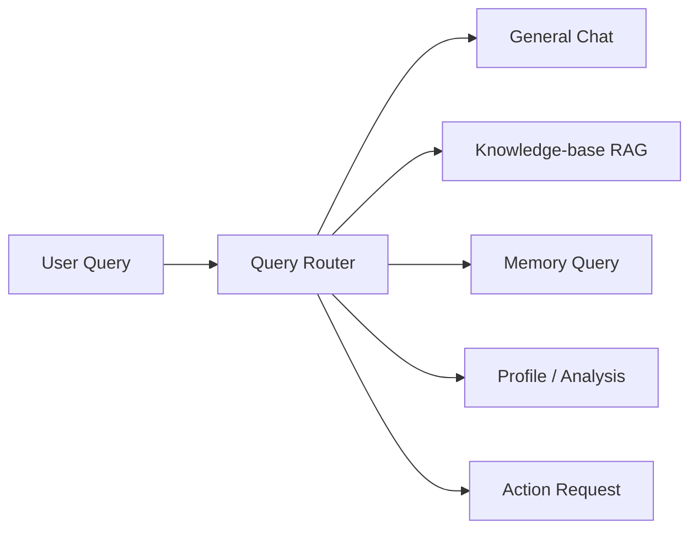

### 这一天的意义

Day 7 解决的是：

> 为什么一个真正可用的 AI 后端，不能把所有问题都塞进 RAG 链路？

RAG 不是默认动作，而是有成本、有延迟、有误召回风险的工具。先路由，才能减少无意义检索，也能让用户画像、分析总结和普通对话各走自己的正确路径。

---

## Day 8：PostgreSQL Keyword Recall 与轻量 Hybrid Search

### Day 8 做成了什么

- 保留 Day 5 的 PostgreSQL keyword recall，不再额外引入 Elasticsearch
- 建立 `Milvus vector + PostgreSQL keyword + memory` 的轻量多路召回
- 让 PostgreSQL 承接 chunk 原文、结构化字段、任务状态和半结构化 JSONB 数据
- 明确 MongoDB、Elasticsearch、DuckDB 都不进入当前默认技术栈

### Day 8 流程图

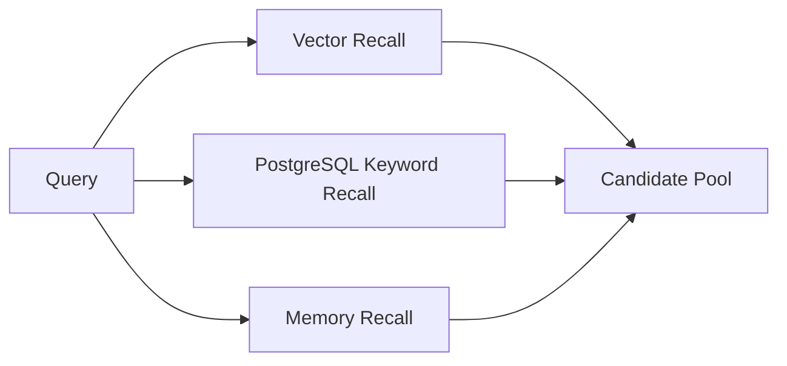

### 这一天的意义

Day 8 解决的是：

> 为什么当前阶段的“混合检索”应该先收敛在 Milvus + PostgreSQL + Memory 上，而不是继续增加专用搜索存储？

PostgreSQL keyword recall 不是最终形态的上限，但它足够承接当前的人名、标题、术语和原文短语召回；在作品集阶段，减少一个独立搜索集群比追求 BM25 完整能力更重要。

---

## Day 9：Fusion 与 Rerank 层

### Day 9 做成了什么

- 在多路召回之后增加统一 fusion 层
- 第一版支持 RRF 或加权融合，把 `vector_score / keyword_score / memory_importance / recency / exact_match` 合成统一排序信号
- 增加 rerank 接口，为后续 cross-encoder reranker 或小规模 LLM rerank 留位置
- 明确 rerank 只处理候选集，不重新承担召回职责

### Day 9 流程图

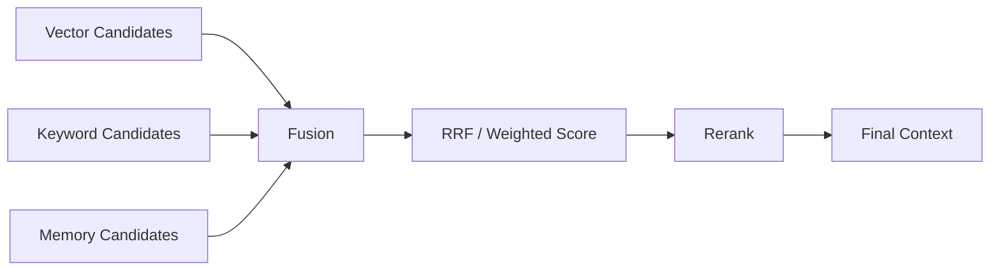

### 这一天的意义

Day 9 解决的是：

> 多路召回以后，为什么不能直接把所有结果一股脑塞给模型？

Hybrid Search 的关键不是“召回越多越好”，而是让不同召回源的结果能被公平合并、可解释排序，并且在进入上下文前被再次筛选。

---

## Day 10：Retrieval Debug，建立调优观测面

### Day 10 做成了什么

- 给每次问答记录完整检索链路：router 决策、query rewrite、vector results、keyword results、memory results、fusion score、rerank score、final context
- 让“没召回、召回错、排序差、上下文组装差、模型没用证据”可以被区分
- 把 debug 结果保存成可查询对象，为后续 RAG Eval 准备输入

### Day 10 流程图

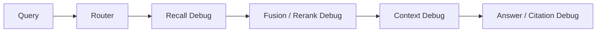

### 这一天的意义

Day 10 解决的是：

> 当 RAG 回答不好时，系统到底是检索差、排序差、上下文差，还是生成阶段没有遵守证据？

没有 Retrieval Debug，就没有真正的 RAG 调优，只能靠感觉改 prompt。

---

## Day 11：RAG Eval，建立效果评估闭环

### Day 11 做成了什么

- 引入 `eval_dataset / eval_case / eval_run / eval_result`
- 每个 eval case 至少包含 `question / expected_answer / expected_source_chunk_ids / tags / difficulty`
- 检索层评估 `Recall@K / MRR / nDCG / source_hit`
- 生成层评估 `faithfulness / citation_accuracy / answer_relevance / abstention_accuracy`
- 记录 latency、token cost、LLM call count、retrieval count 等工程指标

### Day 11 流程图

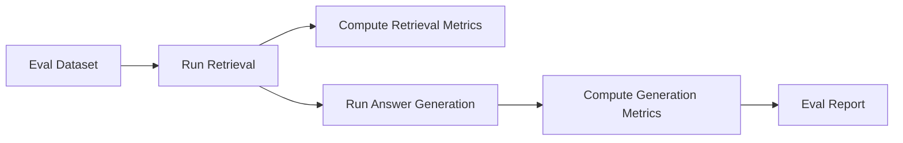

### 这一天的意义

Day 11 解决的是：

> 为什么 RAG 项目不能只说“感觉回答变好了”，而必须能量化比较每次改动？

Eval 是后续 keyword recall、rerank、GraphRAG、chunking 和 prompt 改动的共同验收标准。

---

## Day 12：Citation 校验与 Faithfulness 防线

### Day 12 做成了什么

- 对 Evidence Answer 的 citation 做严格校验
- 检查 `source_id` 是否存在、quote 是否真的出现在 source text 中
- 检查回答中的关键 claim 是否能被引用支撑
- 当证据不足时，要求系统降低 confidence 或明确拒答

### Day 12 流程图

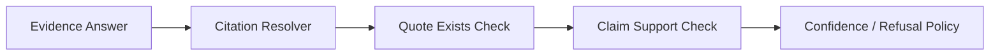

### 这一天的意义

Day 12 解决的是：

> 为什么“有 citations 字段”不等于回答可信？

RAG 的价值不是生成一段看起来合理的话，而是让结论能回到证据上。Citation 校验是项目从 demo 走向可信系统的关键一步。

---

## Day 13：MemoryEntry 生命周期治理

### Day 13 做成了什么

- 把 MemoryEntry 从“只增不减的抽取结果”升级为“可治理的长期记忆资产”
- 引入 `duplicate / supplement / contradict / refine / temporal_update / supersede` 等关系
- 设计 CanonicalMemory 或等价聚合视图，避免长期记忆变成噪声库
- 增加 importance、recency、confidence 的更新策略

### Day 13 流程图


### 这一天的意义

Day 13 解决的是：

> 长期记忆如果只会越积越多，为什么最后一定会变成噪声库？

真正的长期记忆系统必须会合并、冲突、演化和降噪。

---

## Day 14：画像生成升级为 Evidence-based ReAct Pipeline

### Day 14 做成了什么

- 不再让画像生成只做一次性全库总结
- 引入 profile 专用工具：`search_memory / search_recent_memory / search_topic_timeline / get_contradictions / get_profile_snapshot`
- 用 ReAct 或 tool calling 组织画像分析过程，让模型按需查询证据
- 最终输出仍然收口为结构化画像：`stable_traits / recent_focus / goals / risks / evidence / uncertainty`

### Day 14 流程图

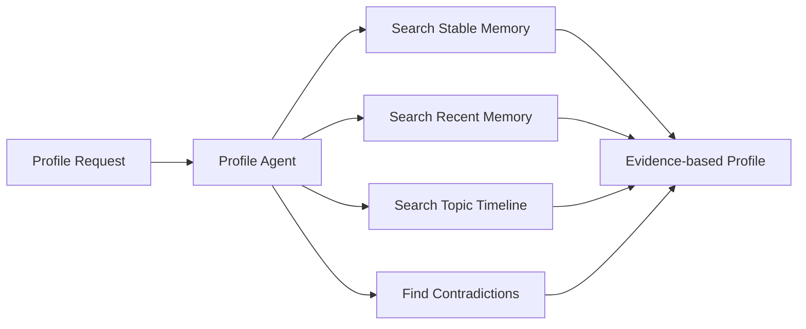

### 这一天的意义

Day 14 解决的是：

> 为什么用户画像不能只是“让模型总结一下”，而应该是带工具调用、带证据、带不确定性的分析结果？

ReAct 适合用在画像分析的取证过程，但最终画像不能自由发散，必须回到结构化结果和证据约束。

---

## Day 15：GraphRAG 评估驱动接入

### Day 15 做成了什么

- 让 Neo4j 从展示层进入检索增强链路，但不盲目扩大图谱复杂度
- 明确 GraphRAG 只对多跳关系、冲突关系、主题演化类问题启用
- 用 eval 判断图扩展是否提升 Recall@K、citation accuracy 和 answer relevance
- 把图关系从粗粒度 `RELATED` 逐步升级为 `SUPPORTS / CONTRADICTS / REFINES / EVIDENCE_FOR / ABOUT_TOPIC`

### Day 15 流程图

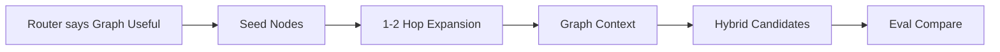

### 这一天的意义

Day 15 解决的是：

> 为什么 GraphRAG 不能只因为“听起来高级”就进入主链路，而必须由问题类型和评估指标驱动？

图谱应该服务检索质量，不应该只是一个好看的展示层。

---

## Day 16：TaskRecord 与高吞吐消息队列

### Day 16 做成了什么

- 把长任务统一纳入 `TaskRecord`，记录 `pending / running / succeeded / failed / retrying / cancelled`
- 把文档索引、MemoryEntry 抽取、Milvus 写入、Neo4j 投影、Eval Run 都任务化
- 当前保留 Redis 作为 Celery broker / result backend，不把业务事实放进 Redis
- 后续消息层优先考虑 RabbitMQ 承接更清晰路由和更强可观测性的任务分发

### Day 16 流程图

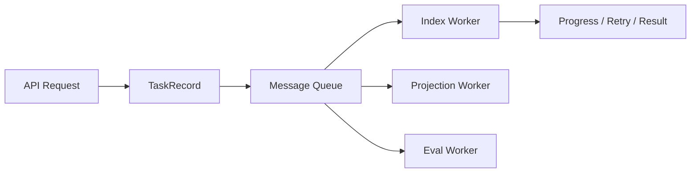

### 这一天的意义

Day 16 解决的是：

> 文档索引、向量写入、图投影和评测这些长任务，为什么不能继续靠同步调用或轻量后台任务硬扛？

需要注意的是：Celery 是任务框架，Redis / RabbitMQ 是 broker，不是完全同一层概念。当前阶段 Redis 继续保留，后续替换 RabbitMQ 时应优先保持 TaskRecord 状态机和 worker 消费接口不变。

---

## Day 17：Outbox 与多索引一致性

### Day 17 做成了什么

- 确立 PostgreSQL 是事实源，Milvus 和 Neo4j 是外部投影层
- 用 outbox 隔离主业务事务和外部索引副作用
- 为 Milvus / Neo4j 的重试、重放、死信和幂等写入建立统一机制
- 避免外部服务短暂不可用时丢失索引或图投影

### Day 17 流程图

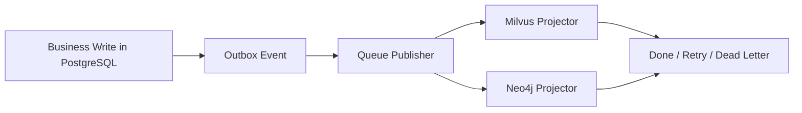

### 这一天的意义

Day 17 解决的是：

> 当一个系统同时维护 PostgreSQL、Milvus、Neo4j 时，为什么必须把一致性和重放能力设计出来？

多索引系统最大的风险不是“组件不够多”，而是某一步失败后系统状态悄悄分裂。

---

## Day 18：PostgreSQL 分析视图与调优报表

### Day 18 做成了什么

- 把调优分析收敛到 PostgreSQL 表、视图和必要的离线导出
- 用于 retrieval logs、eval results、chunk stats、latency、cost 的分析
- 产出 Markdown / HTML / JSON 报表，支持不同版本检索策略对比
- 不默认引入 DuckDB / MongoDB，避免作品集阶段数据库技术栈继续膨胀

### Day 18 流程图

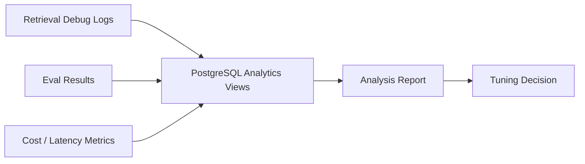

### 这一天的意义

Day 18 解决的是：

> 系统如何从“能跑”升级成“能分析自己为什么跑得好或不好”？

调优报表能把 keyword recall、rerank、GraphRAG、chunking、prompt 的改动放到同一个指标面上比较。

---

## Day 19：入口变薄与领域化收口

### Day 19 做成了什么

- 在 RAG 主链路、Eval、任务系统稳定后，再做结构收口
- 把平铺的 `routers / services / schemas / models / crud`
  逐步收敛到 `api / core / domains / workflow / infra`
- 优先收口 `retrieval / eval / memory / profile / workflow`，避免只做目录搬家
- 把 `main.py` 变成薄入口，启动、路由注册、依赖装配放到 bootstrap 层

### Day 19 流程图

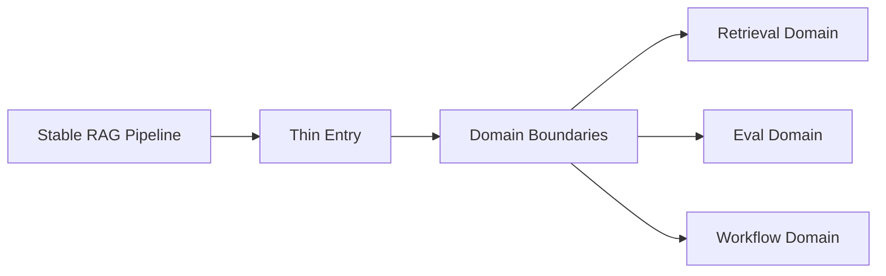

### 这一天的意义

Day 19 解决的是：

> 为什么领域化重构应该发生在核心链路稳定以后，而不是一开始就做大规模目录搬家？

架构收口的目标是让边界更清楚，不是让文件路径看起来更高级。

---

## Day 20：框架减重与生产化验收

### Day 20 做成了什么

- 基于 Eval 和 Debug 的结果判断哪些 RAG 编排值得自研，哪些适合交给成熟框架
- LlamaIndex 只作为 ingestion / retrieval / GraphRAG PoC 的可选减重方案，不强行替换主链路
- MongoDB、Elasticsearch、DuckDB 不再作为默认引入项，除非后续评测证明 PostgreSQL + Milvus + Neo4j 无法承接目标负载
- 形成最终验收标准：可路由、可检索、可引用、可评估、可重试、可重放、可分析

### Day 20 流程图

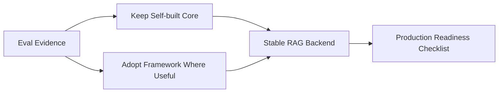

### 这一天的意义

Day 20 解决的是：

> 架构优化最后不是继续加组件，而是判断哪些东西真的提升效果、哪些只是增加维护成本。

这一天对应的是“减重”和“验收”，不是“继续堆技术栈”。

---

## Day 1 - Day 20 串联总图

```mermaid
flowchart TD
    A[Day 1-2 目标重定向与蓝图] --> B[Day 3-4 MemoryEntry + Evidence]
    B --> C[Day 5-6 Hybrid 起点 + Chunk 结构化]
    C --> D[Day 7 Query Router]
    D --> E[Day 8-9 Lightweight Hybrid + Fusion/Rerank]
    E --> F[Day 10-12 Debug + Eval + Citation 校验]
    F --> G[Day 13-15 Memory 治理 + Profile ReAct + GraphRAG]
    G --> H[Day 16-17 MQ + Outbox + 多索引一致性]
    H --> I[Day 18-20 PostgreSQL 分析报表 + 领域收口 + 框架减重]
```

### 这 20 天到底在搭什么

这 20 天不是在做一个“组件越来越多”的后端，
而是在把 Mneme 推向下面这个形态：

```text
一个以文档为输入
以 MemoryEntry 为长期记忆资产
以 Query Router 判断是否需要 RAG
以 PostgreSQL Keyword + Milvus Vector + Memory 组成 Hybrid Search
以 Fusion / Rerank 控制上下文质量
以 Evidence Answer 和 Citation 校验约束生成
以 Retrieval Debug / RAG Eval 形成调优闭环
以 Profile ReAct Pipeline 生成有证据的用户画像
以 TaskRecord / Redis 当前 broker / 后续 RabbitMQ / Outbox 支撑长任务和多索引一致性
以 PostgreSQL 分析视图和离线报表支撑调优分析
以领域化收口和框架减重支撑长期演进
的长期记忆型 RAG 后端
```

---

## 最终系统总架构图

```mermaid
flowchart TD
    A[User Query / Upload] --> B[API Layer]
    B --> C[Query Router]
    C --> D[General Chat]
    C --> E[RAG Pipeline]
    C --> F[Profile / Analysis Pipeline]

    B --> G[Document Pipeline]
    G --> H[Section-aware Chunk]
    H --> I[MemoryEntry Extraction]
    H --> J[Milvus Vector Index]
    I --> L[Memory Governance]
    I --> M[Neo4j Graph Projection]

    E --> N[Vector Recall]
    E --> O[PostgreSQL Keyword Recall]
    E --> P[Memory Recall]
    E --> Q[Optional Graph Expansion]
    N --> R[Fusion / Rerank]
    O --> R
    P --> R
    Q --> R
    R --> S[Context Assembly]
    S --> T[Evidence Answer]
    T --> U[Citation Check]

    T --> V[Retrieval Debug]
    U --> W[RAG Eval]
    W --> X[PostgreSQL Report Views]

    G --> Y[TaskRecord]
    Y --> Z[Redis Broker Now / RabbitMQ Later]
    Z --> AA[Workers]
    AA --> AB[Outbox Replay]
```

### 这张图要表达什么

这张图想表达的不是“Mneme 接了很多组件”，  
而是它的主线已经从普通 RAG 系统升级成了：

```text
是否需要 RAG 可判断
检索链路可组合
排序过程可解释
回答结果可追溯
引用质量可校验
优化效果可评测
长期记忆可治理
画像生成可取证
任务执行可恢复
多索引投影可重放
系统演进可减重
```

---

## 目标分层结构

如果把最终目标再用代码结构说一遍，它更接近下面这种分层：

```text
app/mneme/
  main.py
  bootstrap/
    app_factory.py
    startup.py
    shutdown.py
    router_registry.py
  api/
    router.py
    deps.py
    response.py
    errors.py
  core/
    config.py
    container.py
    logging.py
  domains/
    documents/
    retrieval/
      router.py
      vector_recall.py
      keyword_recall.py
      memory_recall.py
      fusion.py
      rerank.py
      context_assembly.py
    eval/
      datasets.py
      runner.py
      metrics.py
      reports.py
    memory/
      entries.py
      governance.py
      canonical.py
    graph/
    profile/
      tools.py
      react_pipeline.py
      snapshot.py
    tasks/
  workflow/
    jobs/
    dispatcher.py
    task_state.py
    outbox.py
    queue.py
  infra/
    vector_store/
    relational_store/
      postgresql.py
    graph_store/
      neo4j.py
    cache/
      redis.py
    message_queue/
      rabbitmq.py
    retry/
    rate_limit/
```

这个目标结构想表达的是：

```text
api 负责入站请求
core 负责应用装配
domains 负责业务边界
retrieval 负责 RAG 检索、融合、排序和上下文组装
eval 负责效果评估和调优报告
profile 负责画像工具调用和证据化生成
workflow 负责长任务、队列、outbox 和状态机
infra 负责外部基础设施适配
```

---

## 最小可调优 RAG 闭环图

```mermaid
flowchart LR
    A[User Query] --> B[Query Router]
    B --> C{Needs RAG?}
    C -->|No| D[Direct / General Answer]
    C -->|Yes| E[Vector + Keyword + Memory Recall]
    E --> F[Fusion / Rerank]
    F --> G[Context Assembly]
    G --> H[Evidence Answer]
    H --> I[Citation Check]
    I --> J[Retrieval Debug]
    J --> K[RAG Eval]
    K --> L[Tuning Decision]
    L --> E
```

### 这一张图就是 Day 6 以后重构的核心

如果只记住 Day 6 之后的一张图，就记住这一张。

因为它说明了 Mneme 后续不应该只是：

```text
检索一些 chunk
塞给模型
返回答案
```

而是：

```text
先判断是否需要 RAG
再用 Milvus Vector + PostgreSQL Keyword + Memory 多路召回
再融合、排序、组装上下文
再生成带证据的回答
再校验 citation
再把 debug 和 eval 回流给下一轮调优
```

---

## 20 天结束时，你应该拿到什么

```text
1. 一个明确从 Chunk RAG 升级到长期记忆系统的总蓝图
2. 一条以 MemoryEntry 为核心资产的主链路
3. 一套 Query Router，能判断哪些对话不该走 RAG
4. 一套 PostgreSQL Keyword + Milvus Vector + Memory 的轻量 Hybrid Search
5. 一套 Fusion / Rerank 的候选排序机制
6. 一套 Evidence Answer + Citation Check 的可信回答协议
7. 一套 Retrieval Debug + RAG Eval 的调优闭环
8. 一套 MemoryEntry 去重、合并、冲突和演化治理机制
9. 一套 evidence-based Profile ReAct Pipeline
10. 一套 TaskRecord + Redis 当前 broker + 后续 RabbitMQ + Outbox 的长任务和多索引一致性底座
11. 一套 PostgreSQL 分析视图和离线报表能力
12. 一条领域化收口、框架减重、避免 Elasticsearch/MongoDB/DuckDB 过早引入的演进路线
```

---

## 最后一句话

Day 1 到 Day 20，不是在把 Mneme 做成“更复杂的 RAG”，  
而是在把它做成：

> 一个知道什么时候该检索、知道怎么检索、知道怎么评估检索效果、知道怎么约束生成结果，还能持续调优和演进的长期记忆后端。
