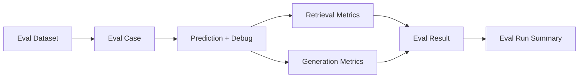

# Day 11：RAG Eval，建立效果评估闭环

## 今天的总目标

今天不是继续改 prompt，  
也不是继续凭感觉判断 RAG 效果，  
而是在 Day 10 的 `RetrievalDebugData` 基础上，  
补上一套**最小可运行的离线 RAG Eval 结构**。

Day 11 要解决的问题是：

> 每次改 chunk、ES、fusion、rerank、prompt 之后，系统到底有没有变好，不能只靠主观感觉。

所以今天的优化目标是：

```text
eval_dataset
-> eval_case
-> prediction + RetrievalDebugData
-> retrieval metrics
-> generation metrics
-> eval_run summary
```

---

## 今天结束前已经拿到什么

今天完成了这 5 件事：

1. 新增 `schemas/eval.py`，定义 `EvalDataset / EvalCase / EvalPrediction / EvalRun / EvalResult`。
2. 新增 `services/eval_service.py`，支持计算 `Recall@K / MRR / nDCG / source_hit`。
3. 增加基础生成侧指标：`faithfulness / citation_accuracy / answer_relevance / abstention_accuracy`。
4. 支持记录工程指标：`latency_ms / token_cost / llm_call_count / retrieval_count`。
5. 新增 `scripts/debug_day11.py`，用模拟 Day 10 debug packet 本地验证 eval 闭环。

---

## Day 11 一图总览

```text
EvalDataset
-> EvalCase
-> Run prediction
-> Collect answer / sources / citations / debug
-> Evaluate retrieval
-> Evaluate generation
-> EvalRun summary
```



---

## 这一天为什么重要

Day 7 到 Day 10 已经做了：

```text
Query Router
-> BM25
-> Fusion / Rerank
-> Retrieval Debug
```

但如果没有 eval，后面每次改动都会变成：

```text
我感觉好像更准了
```

这不够。  
RAG 系统必须能回答：

```text
Recall@K 有没有提升？
MRR 有没有提升？
nDCG 有没有提升？
source_hit_rate 有没有提升？
citation_accuracy 有没有下降？
```

Day 11 的核心就是让后续优化可以被量化比较。

---

## 本次代码落点

### 文件 1：`schemas/eval.py`

新增 eval 相关结构：

```python
EvalCase
EvalDataset
EvalPrediction
RetrievalEvalMetrics
GenerationEvalMetrics
EngineeringEvalMetrics
EvalResult
EvalRun
```

其中 `EvalCase` 最少包含：

```python
case_id
question
expected_answer
expected_source_chunk_ids
tags
difficulty
```

这和 Day 11 计划里的验收对象一致。

---

### 文件 2：`services/eval_service.py`

新增核心评估函数：

```python
evaluate_retrieval(...)
evaluate_generation(...)
evaluate_case(...)
build_eval_run(...)
summarize_eval_results(...)
```

检索侧指标：

```text
Recall@K
MRR
nDCG
source_hit
expected_source_count
retrieved_source_count
```

生成侧指标：

```text
faithfulness
citation_accuracy
answer_relevance
abstention_accuracy
```

工程侧指标：

```text
latency_ms
token_cost
llm_call_count
retrieval_count
```

---

## 当前 Retrieval Metrics 怎么算

### 1. `Recall@K`

看 `debug.final_context` 的前 K 个 chunk 里，  
命中了多少 `expected_source_chunk_ids`。

```text
Recall@K = hit_expected_source_count / expected_source_count
```

### 2. `MRR`

看第一个命中的 expected chunk 排在第几位。

```text
MRR = 1 / first_hit_rank
```

如果没有命中，就是 0。

### 3. `nDCG`

把 expected chunk 当成二元相关性：

```text
命中 = 1
未命中 = 0
```

然后按 final context 排名计算 DCG / IDCG。

### 4. `source_hit`

只要 final context 中命中任意一个 expected chunk，就是 `True`。

---

## 当前 Generation Metrics 怎么算

### 1. `faithfulness`

第一版只检查 citation 的 `source_id` 是否存在于 sources。

这不是最终的忠实性校验，  
真正的 quote exists / claim support 留给 Day 12。

### 2. `citation_accuracy`

检查引用的 source 是否能映射到 expected chunk。

如果 citation 引用了正确 evidence source，分数会更高。

### 3. `answer_relevance`

第一版用 expected answer 里的词项做轻量匹配。  
它不是语义评估，只是无外部 LLM 的本地可跑版本。

### 4. `abstention_accuracy`

用于判断无证据或证据不足时，回答是否表现出拒答/不确定。

---

## 为什么今天不做数据库表

Day 11 计划里提到：

```text
eval_dataset / eval_case / eval_run / eval_result
```

今天先把它们做成 Pydantic schema 和 service，而不是立刻建表。

原因是：

```text
先跑通指标定义
先确认 debug packet 足够支撑 eval
等指标结构稳定后再落库
```

否则很容易先建一批很快要改的表。

---

## 本地验证结果

已运行语法检查：

```text
.\.venv\Scripts\python.exe -m compileall schemas\eval.py services\eval_service.py scripts\debug_day11.py
```

已运行 Day 11 调试脚本：

```text
.\.venv\Scripts\python.exe scripts\debug_day11.py
```

关键输出：

```text
case_count=2
avg_recall_at_k=0.5000
avg_mrr=0.5000
avg_ndcg=0.5000
source_hit_rate=0.5000
avg_citation_accuracy=0.5000
avg_answer_relevance=1.0000

case_id=case_hit
recall_at_k=1.0000
mrr=1.0000
ndcg=1.0000
source_hit=True
citation_accuracy=1.0000

case_id=case_miss
recall_at_k=0.0000
mrr=0.0000
ndcg=0.0000
source_hit=False
citation_accuracy=0.0000
```

这说明 Day 11 的最小验收成立：

```text
能表达 eval dataset / case / run / result
能从 Day 10 debug packet 读取 final context
能量化检索命中与漏召回
能汇总 eval run 指标
```

---

## 今天没有做什么

### 1. 没有真实跑 LLM 批量评测

今天先建立 eval 结构和指标计算。  
批量调用 `generate_rag_answer(...)` 可以在后续接 API 或任务化时补。

### 2. 没有做 LLM-as-judge

`answer_relevance` 当前是本地词项匹配。  
这保证本地无 key 也能验证，但不等价于最终语义评估。

### 3. 没有做 quote exists / claim support

这些属于 Day 12 的 citation 校验和 faithfulness 防线。

---

## 今日验收标准

今天结束时，至少要能回答这 6 个问题：

1. 一个 eval case 最少需要哪些字段？
2. 为什么 retrieval eval 必须依赖 expected source chunk ids？
3. Recall@K、MRR、nDCG 分别衡量什么？
4. 为什么 citation_accuracy 不能完全等价于 faithfulness？
5. Day 10 的 debug packet 哪些字段被 Day 11 使用了？
6. 为什么今天先做 schema/service，而不是直接建数据库表？

---

## 给 Day 12 的交接提示

Day 12 可以接住 Day 11 的这个前提：

> 现在系统已经能量化“有没有检索到 expected source”，也能初步看 citation 是否指向 expected source。

但 Day 11 还不能证明：

```text
quote 真的出现在 source text 中
answer claim 真的被 source 支撑
模型没有编造 source 外的信息
```

所以 Day 12 要继续进入：

```text
Citation Resolver
-> quote exists check
-> claim support check
-> confidence / refusal policy
```

Day 11 最终交给 Day 12 的输入是：

```text
EvalCase.expected_source_chunk_ids
Prediction.sources
Prediction.citations
RetrievalDebugData.final_context
GenerationEvalMetrics.citation_accuracy
```

这就是 Day 11 最终要交给 Day 12 的东西。
