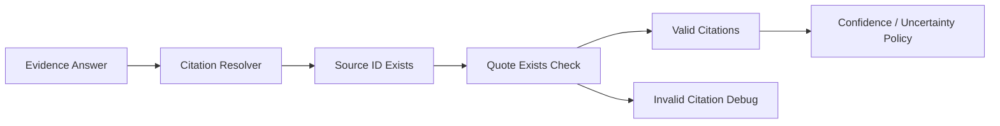

# Day 12：Citation 校验与 Faithfulness 防线

## 今天的总目标

今天不是继续增加 citations 字段，  
也不是只相信模型说“我引用了 S1”，  
而是在 Day 4 的 Evidence Answer、Day 10 的 debug packet、Day 11 的 eval 基础上，  
补上一层**引用真实性校验**。

Day 12 要解决的问题是：

> 有 citations 字段，不等于回答可信。  
> citation 必须能回到真实 source，quote 也必须真的出现在 source text 里。

所以今天的优化目标是：

```text
Evidence Answer
-> Citation Resolver
-> source_id exists check
-> quote exists check
-> valid citations only
-> confidence / uncertainty policy
-> debug / eval can observe validation
```

---

## 今天结束前已经拿到什么

今天完成了这 5 件事：

1. 新增 `services/citation_validation_service.py`，集中处理 citation 校验。
2. `query_service.invoke_evidence_answer(...)` 不再直接信任模型 citation，而是只返回校验通过的 citations。
3. `ChatCitationItem` 增加 `validation_status / quote_found / validation_reason`。
4. Day 10 的 `answer_debug` 现在能看到 `citation_validation` 和 `invalid_citations`。
5. Day 11 的 `faithfulness` 会识别 citation 校验字段，不再只看 source_id 是否存在。

---

## Day 12 一图总览

```text
LLM EvidenceAnswerDraft
-> citation drafts
-> validate source_id
-> validate quote in source text
-> drop invalid citations
-> adjust confidence / uncertainty
-> answer debug
```



---

## 这一天为什么重要

Day 4 让回答开始有：

```text
answer
sources
citations
confidence
uncertainty
```

但如果模型输出：

```text
source_id=S1
quote=一段 source text 里并不存在的话
```

系统不能直接接受。  
否则 citations 只是在制造“看起来可信”的幻觉。

Day 12 的核心是：

> citation 必须被 source text 校验。

---

## 本次代码落点

### 文件 1：`services/citation_validation_service.py`

新增核心函数：

```python
validate_citation_drafts(...)
quote_exists_in_source(...)
apply_citation_confidence_policy(...)
```

当前校验规则：

```text
1. source_id 必须存在于 sources
2. quote 不能为空
3. quote 必须出现在 source.text 中
4. 允许忽略空白差异做一次 normalize 匹配
```

校验结果分成：

```text
valid_citations
invalid_citations
summary
```

---

### 文件 2：`services/query_service.py`

`resolve_citations(...)` 现在不再只是把 citation draft 映射成 source，  
而是调用：

```python
validate_citation_drafts(...)
```

`invoke_evidence_answer(...)` 现在返回：

```text
citations: 只包含 valid citations
citation_validation: 校验摘要
invalid_citations: 被拒绝的引用
confidence: 可能被 policy 调低
uncertainty: 可能追加校验说明
```

如果没有任何有效 citation：

```text
confidence -> low
uncertainty -> 说明引用未通过校验或没有可校验证据
```

如果部分 citation 无效：

```text
保留有效 citation
移除无效 citation
uncertainty 追加“部分引用未通过校验”
```

---

### 文件 3：`schemas/chat.py`

`ChatCitationItem` 新增：

```python
validation_status: str | None
quote_found: bool | None
validation_reason: str | None
```

示例：

```text
validation_status=valid
quote_found=True
validation_reason=quote_found
```

---

### 文件 4：`services/retrieval_debug_service.py`

`build_answer_debug(...)` 新增：

```text
citation_validation
invalid_citations
```

这样 Day 10 的 debug packet 可以区分：

```text
模型没有给 citation
source_id 不存在
quote 不在 source text 中
citation 通过校验
```

---

### 文件 5：`services/eval_service.py`

`calculate_faithfulness(...)` 现在会识别：

```text
validation_status != invalid
quote_found is not False
```

也就是说，引用 source_id 存在但 quote 校验失败，不再被算作 faithful citation。

---

### 文件 6：`scripts/debug_day12.py`

新增本地脚本：

```text
.\.venv\Scripts\python.exe scripts\debug_day12.py
```

它构造三条 citation：

```text
1. source_id 存在，quote 存在 -> valid
2. source_id 存在，quote 不存在 -> invalid
3. source_id 不存在 -> invalid
```

---

## 当前 Citation Policy

### 场景 1：全部 citation 有效

```text
confidence 不变
uncertainty 不追加
```

### 场景 2：部分 citation 无效

```text
保留有效 citation
移除无效 citation
confidence 不强行降低
uncertainty 追加说明
```

### 场景 3：没有有效 citation

```text
confidence=low
uncertainty 说明原因
```

原因是：  
如果一个 evidence answer 没有任何可校验引用，就不能继续保持 high / medium confidence。

---

## 本地验证结果

已运行语法检查：

```text
.\.venv\Scripts\python.exe -m compileall services\citation_validation_service.py services\query_service.py services\retrieval_debug_service.py services\eval_service.py schemas\chat.py scripts\debug_day12.py
```

已运行 Day 12 调试脚本：

```text
.\.venv\Scripts\python.exe scripts\debug_day12.py
```

关键输出：

```text
valid_citation_count=1
invalid_citation_count=2
has_valid_citation=True
confidence=high
uncertainty=部分引用未通过校验，已从 citations 中移除。

valid source_id=S1
quote_found=True
validation_reason=quote_found

invalid source_id=S1
quote_found=False
validation_reason=quote_not_found_in_source

invalid source_id=S9
quote_found=False
validation_reason=source_id_not_found
```

这说明 Day 12 的最小验收成立：

```text
source_id 不存在会被拒绝
quote 不在 source text 中会被拒绝
有效 citation 会保留
部分失败会写入 uncertainty
校验结果能进入 debug / eval
```

---

## 今天没有做什么

### 1. 没有做 LLM claim support

今天的 claim support 是第一版本地防线：  
回答必须至少有有效 citation 才能维持较高 confidence。

真正逐 claim 校验需要额外的 claim extractor / verifier，后续可以再接。

### 2. 没有强制拒答重写

如果模型回答内容很多但 citation 全失败，当前策略是：

```text
confidence=low
uncertainty 说明原因
citations=[]
```

是否重写 answer 成拒答，可以后续结合产品策略决定。

### 3. 没有把 invalid citation 暴露到普通 sources/citations

普通 `citations` 只保留 valid citations。  
无效 citation 只进入 debug，避免对外回答混入不可用证据。

---

## 今日验收标准

今天结束时，至少要能回答这 6 个问题：

1. 为什么 source_id 存在还不代表 citation 可信？
2. quote exists check 在 Day 12 解决了什么问题？
3. 无效 citation 为什么不应该进入最终 citations？
4. 没有任何有效 citation 时，为什么 confidence 必须降低？
5. Day 12 的校验结果如何进入 Day 10 debug packet？
6. Day 12 和 Day 11 的 citation_accuracy / faithfulness 有什么关系？

---

## 给 Day 13 的交接提示

Day 13 会进入 MemoryEntry 生命周期治理。  
它可以接住 Day 12 的这个前提：

> 现在系统不只会生成 memory/evidence，也开始要求 evidence 能被校验。

长期记忆治理也要遵守类似原则：

```text
MemoryEntry 不能只增不减
相似记忆要能合并
冲突记忆要能标记
过时记忆要能降权或 supersede
长期画像不能直接吃未治理噪声
```

Day 12 最终交给 Day 13 的输入是：

```text
valid evidence
invalid evidence debug
confidence / uncertainty policy
faithfulness-aware eval
```

这就是 Day 12 最终要交给 Day 13 的东西。
