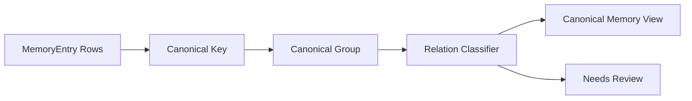

# Day 13：MemoryEntry 生命周期治理

## 今天的总目标

今天不是继续让 `MemoryEntry` 越抽越多，  
也不是马上新增一堆 canonical memory 表，  
而是在现有 `memory_entries` 表之上，先补一层**可查询的治理视图**。

Day 13 要解决的问题是：

> MemoryEntry 如果只增不减，长期一定会变成噪声库。  
> 相似记忆、重复记忆、冲突记忆和阶段更新，必须能被系统识别出来。

所以今天的优化目标是：

```text
MemoryEntry rows
-> canonical key
-> canonical memory view
-> duplicate / supplement / contradict / refine / temporal_update relation
-> needs_review / merged / stable / single status
-> memory governance API
```

---

## 今天结束前已经拿到什么

今天完成了这 4 件事：

1. 新增 `schemas/memory_governance.py`，定义 canonical memory 和 memory relation 的结构化返回。
2. 新增 `services/memory_governance_service.py`，在不改表结构的前提下计算记忆治理视图。
3. 在 `routers/memory.py` 增加 `GET /memory/knowledge-bases/{knowledge_base_id}/governance`。
4. 新增 `scripts/debug_day13.py`，用本地样本验证 duplicate / contradict / canonical status。

---

## Day 13 一图总览

```text
raw MemoryEntry
-> group by entry_type + entry_name
-> choose representative entry
-> classify adjacent relations
-> build canonical memory items
-> expose governance view
```



---

## 这一天为什么重要

Day 3 让 `MemoryEntry` 正式进入主链路。  
Day 5 让 `MemoryEntry` 进入召回候选。  
Day 12 让 evidence 和 citation 开始被校验。

但如果长期记忆没有治理层，系统会很快遇到几个问题：

```text
同一个事实被重复抽取
同一个主题在不同文档里有补充信息
旧事实和新事实互相冲突
阶段性变化无法被识别
画像和分析直接吃噪声
```

所以 Day 13 的重点不是“再抽取更多记忆”，  
而是让已有记忆开始具备生命周期语义。

---

## 代码落点

### 1. `schemas/memory_governance.py`

新增三个结构：

```text
CanonicalMemoryItem
MemoryRelationItem
MemoryGovernanceData
```

其中：

- `CanonicalMemoryItem` 表示一个治理后的聚合记忆视图。
- `MemoryRelationItem` 表示两个 MemoryEntry 之间的关系。
- `MemoryGovernanceData` 是知识库级治理接口的返回结构。

### 2. `services/memory_governance_service.py`

这个服务只做纯计算，不写数据库。

核心函数是：

```python
build_memory_governance_view(...)
```

它做 4 步：

```text
1. 用 entry_type + entry_name 作为 canonical key 分组
2. 每组选择 importance 最高的 representative entry
3. 组内按时间相邻条目判断 relation
4. 输出 canonical memories + relations + relation_type_counts
```

### 3. `routers/memory.py`

新增接口：

```text
GET /memory/knowledge-bases/{knowledge_base_id}/governance
```

它复用已有知识库权限校验，只允许用户查看自己的知识库治理结果。

### 4. `scripts/debug_day13.py`

这个脚本不依赖数据库，直接构造样本：

```text
entry_1 / entry_2：重复 Qwen embedding 记忆
entry_3：和前面 Qwen embedding 记忆冲突
entry_4：单条 Redis broker 记忆
```

用于验证：

```text
duplicate 能识别
contradict 能识别
冲突组 status=needs_review
单条组 status=single
```

---

## 当前关系类型

Day 13 第一版支持这些关系：

```text
duplicate
supplement
contradict
refine
temporal_update
```

### duplicate

同一个 canonical key 下，summary / evidence 几乎一样。

用途：

```text
说明这类记忆可以合并展示，避免重复污染画像和检索上下文。
```

### supplement

同一个 canonical key 下，内容不冲突，但提供了互补证据。

用途：

```text
说明这个主题有更多来源支持，但还不需要标记冲突。
```

### contradict

同一个 canonical key 下，正负向语义冲突。

当前第一版用本地规则识别，例如：

```text
已完成 / 成功 / 支持
vs
没有完成 / 未完成 / 无法 / 不能
```

用途：

```text
把 canonical memory 标记成 needs_review，提醒画像和回答不要直接当成稳定事实。
```

### refine

同一个 canonical key 下，一个 summary 是另一个的更具体版本，或文本相似度较高。

用途：

```text
说明新记忆可能是在细化旧记忆。
```

### temporal_update

同一个 canonical key 在不同时间被观察到，但不是明显重复、冲突或 refine。

用途：

```text
说明这个主题有阶段变化，后续可以接 timeline / profile snapshot。
```

---

## 当前 canonical status

每个 canonical memory 会得到一个状态：

```text
single
stable
merged
needs_review
```

含义如下：

| 状态 | 含义 |
| --- | --- |
| `single` | 只有一条 MemoryEntry，还没有治理关系 |
| `stable` | 多条相关记忆，没有重复或冲突 |
| `merged` | 存在重复记忆，可以聚合展示 |
| `needs_review` | 存在冲突关系，下游需要谨慎使用 |

---

## 为什么今天不直接加表

今天没有新增：

```text
canonical_memories 表
memory_relations 表
memory_entry.canonical_id 字段
memory_entry.status 字段
```

原因是：

1. 当前项目还处在作品集和主链路收敛阶段。
2. MemoryEntry 治理规则还需要通过 debug / eval 验证。
3. 先做只读治理视图，可以避免迁移和数据回填成本。
4. 后续如果规则稳定，再把 canonical memory / relation 持久化也不迟。

今天的代码相当于给未来持久化版本打样：

```text
现在：computed governance view
以后：persisted canonical memory + relation table
```

---

## 验证结果

执行：

```bash
.\.venv\Scripts\python.exe scripts\debug_day13.py
```

当前输出能看到：

```text
raw_entry_count=4
canonical_memory_count=2
relation_count=2
relation_type_counts={'duplicate': 1, 'contradict': 1}
```

并且 `Qwen embedding` 这一组会被标记为：

```text
status=needs_review
entry_ids=['entry_1', 'entry_2', 'entry_3']
```

这说明 Day 13 的最小验收成立：

```text
重复记忆能归并
冲突记忆能识别
canonical memory 能生成
needs_review 能暴露给下游
```

---

## 今天没有做什么

### 1. 没有持久化 CanonicalMemory

今天只做 computed view。  
这让 Day 13 可以快速验证治理语义，不引入迁移风险。

### 2. 没有用 LLM 做复杂关系判断

当前关系分类是本地规则：

```text
文本相似度
summary 包含关系
正负向 marker
created_at 时间差
```

后续如果要更准，可以把 `classify_memory_relation(...)` 替换成 LLM judge 或小模型分类器。

### 3. 没有修改 Neo4j 关系投影

当前 Neo4j 仍然投影 Document -> MemoryEntry 和文档 RELATED 边。  
Day 13 的 canonical / relation 先停留在 API 视图层，等规则稳定后再投影到图里。

### 4. 没有改变 MemoryEntry 抽取链路

Day 13 不重写抽取 prompt，也不改变索引 pipeline。  
它只在已抽取条目之上增加治理视图。

---

## 今日验收标准

今天结束时，至少要能回答这 6 个问题：

1. 为什么 MemoryEntry 不能只增不减？
2. canonical memory view 和真实 `memory_entries` 表是什么关系？
3. `duplicate / supplement / contradict / refine / temporal_update` 分别解决什么问题？
4. 为什么 `needs_review` 对画像和回答很重要？
5. 为什么今天先不新增 canonical memory 表？
6. Day 13 的治理结果后续如何接到 Day 14 的 profile tools？

---

## 给 Day 14 的交接提示

Day 14 会进入画像生成升级。  
它可以直接接住 Day 13 的这个前提：

> MemoryEntry 已经不只是原始抽取结果，而是可以被治理、聚合和标记风险的长期记忆资产。

Day 14 做 profile / ReAct tools 时，应该优先消费：

```text
canonical_memories
relations
needs_review status
contradict relation
first_seen_at / last_seen_at
```

这样画像生成就不再是“全量扫 memory entries 后让模型总结”，  
而是可以先看稳定记忆、再看冲突记忆、最后带着证据和不确定性输出画像。

Day 13 最终交给 Day 14 的输入是：

```text
canonical memory view
memory relation view
needs_review risk marker
debug script for governance behavior
```

这就是 Day 13 最终要交给 Day 14 的东西。
