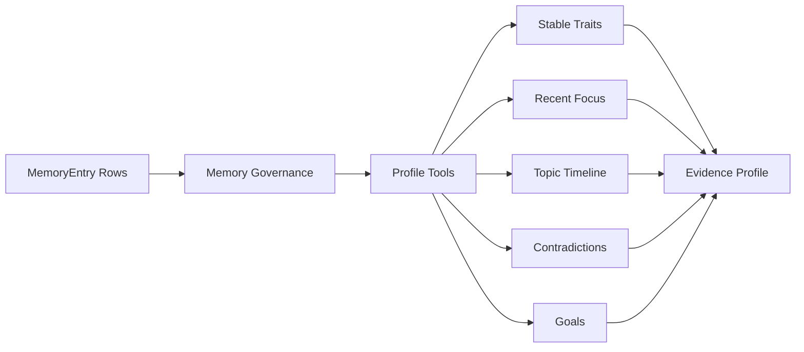

# Day 14：画像生成升级为 Evidence-based Tool Pipeline

## 今天的总目标

今天不是继续让画像接口直接把全量 memory 丢给 LLM 总结，  
也不是马上接一个复杂 ReAct agent，  
而是在 Day 13 的 memory governance 基础上，先补一层**证据化画像工具链**。

Day 14 要解决的问题是：

> 用户画像不能只是“模型总结了一段话”。  
> 它必须知道自己查了哪些记忆、用了哪些证据、哪些结论存在冲突风险。

所以今天的优化目标是：

```text
MemoryEntry rows
-> Memory Governance View
-> profile tools
-> stable traits / recent focus / goals / risks / topic timeline
-> evidence list
-> tool_calls trace
-> evidence profile API
```

---

## 今天结束前已经拿到什么

今天完成了这 5 件事：

1. 新增 `schemas/profile_evidence.py`，定义 evidence profile 的结构化返回。
2. 新增 `services/profile_tool_service.py`，实现画像专用工具层。
3. 在 `services/insight_service.py` 增加 `build_evidence_profile_for_knowledge_base(...)`。
4. 在 `routers/profile.py` 增加 `GET /profile/knowledge-bases/{knowledge_base_id}/evidence`。
5. 新增 `scripts/debug_day14.py`，用本地样本验证 tool calls、evidence、risks 和 uncertainty。

---

## Day 14 一图总览

```text
raw MemoryEntry
-> governance view
-> search_stable_memory
-> search_recent_memory
-> search_topic_timeline
-> get_contradictions
-> search_goal_memory
-> evidence profile
```



---

## 这一天为什么重要

Day 13 已经让 `MemoryEntry` 不再只是原始抽取结果，  
而是可以被聚合、标记冲突、暴露治理状态。

Day 14 接住这个前提，把画像生成从：

```text
全量 memory
-> LLM 总结
-> profile result
```

升级为：

```text
治理后的 memory
-> 工具化检索
-> 明确证据
-> 明确冲突风险
-> profile result
```

这样画像结果就不是一段孤立总结，  
而是一个可以解释“为什么这么判断”的证据化视图。

---

## 代码落点

### 1. `schemas/profile_evidence.py`

新增这些结构：

```text
ProfileEvidenceItem
ProfileToolCallItem
EvidenceProfileTraitItem
EvidenceProfileRiskItem
TopicTimelineItem
EvidenceProfileData
```

其中：

- `ProfileEvidenceItem` 记录画像用到的原始证据。
- `ProfileToolCallItem` 记录工具调用轨迹。
- `EvidenceProfileTraitItem` 表示稳定特征、近期关注或目标。
- `EvidenceProfileRiskItem` 表示冲突、风险或需要复核的画像信号。
- `TopicTimelineItem` 表示主题第一次出现和最近一次出现的时间。
- `EvidenceProfileData` 是最终接口返回。

### 2. `services/profile_tool_service.py`

这个服务实现第一版画像工具链，不调用 LLM。

当前工具包括：

```text
search_stable_memory
search_recent_memory
search_topic_timeline
get_contradictions
search_goal_memory
```

核心入口是：

```python
build_evidence_profile_from_entries(...)
```

它会先调用 Day 13 的：

```python
build_memory_governance_view(...)
```

再把治理结果转成画像需要的结构。

### 3. `services/insight_service.py`

新增：

```python
build_evidence_profile_for_knowledge_base(...)
```

它负责从数据库加载该知识库的 MemoryEntry，然后调用画像工具层。

### 4. `routers/profile.py`

新增接口：

```text
GET /profile/knowledge-bases/{knowledge_base_id}/evidence
```

参数：

```text
recent_days=30
```

这个接口和旧的 `/profile/knowledge-bases/{knowledge_base_id}` 并存。  
旧接口仍然保留 LLM profile，Day 14 新接口提供 evidence-based profile。

### 5. `scripts/debug_day14.py`

这个脚本不依赖数据库，直接构造样本：

```text
FastAPI backend：稳定能力记忆
Qwen embedding migration：目标/计划记忆
Neo4j backend：冲突架构记忆
```

用于验证：

```text
tool_calls 会记录每个工具产出
stable_traits 能返回稳定特征
recent_focus 能返回近期关注
goals 能返回目标信号
risks 能返回 contradict 风险
evidence 能收集所有使用过的 entry
```

---

## 当前画像工具

### search_stable_memory

输入 Day 13 的 governance view。  
只读取：

```text
single
stable
merged
```

不直接把 `needs_review` 当成稳定画像。

用途：

```text
生成 stable_traits。
```

### search_recent_memory

按 `recent_days` 从 MemoryEntry 中取近期条目。

用途：

```text
生成 recent_focus。
```

### search_topic_timeline

按 `entry_type + entry_name` 分组，统计：

```text
entry_count
first_seen_at
last_seen_at
evidence_entry_ids
```

用途：

```text
让画像看到主题是否持续出现，而不是只看某一条记忆。
```

### get_contradictions

读取 Day 13 governance relations 中的：

```text
relation_type=contradict
```

用途：

```text
生成 risks，并把 uncertainty 写清楚。
```

### search_goal_memory

通过轻量 marker 识别目标和计划类记忆：

```text
目标 / 计划 / 下一步 / 准备 / 希望 / goal / plan / next
```

用途：

```text
生成 goals。
```

---

## 当前输出结构

Day 14 新接口返回：

```text
knowledge_base_id
entry_count
canonical_memory_count
stable_traits
recent_focus
goals
risks
topic_timeline
evidence
tool_calls
uncertainty
```

这比旧画像接口多了三个关键能力：

```text
1. evidence：每个结论能回到 MemoryEntry
2. tool_calls：能看到画像过程查了什么
3. risks / uncertainty：冲突记忆不会被静默吞掉
```

---

## 为什么今天不直接做完整 ReAct Agent

今天没有直接做：

```text
LLM tool calling loop
多轮 ReAct 推理
工具选择策略
profile claim verifier
profile snapshot 持久化
```

原因是：

1. 当前项目要先把技术栈和主链路收敛住。
2. Day 13 的 governance 结果刚落地，还需要先证明它能支撑画像。
3. 直接上 ReAct agent 会引入额外的不稳定性和调试成本。
4. 先把工具输入输出固定下来，后续再让 LLM 调这些工具更稳。

今天做的是：

```text
deterministic tool pipeline
```

它是未来 ReAct agent 的可控底座。

---

## 验证结果

执行：

```bash
.\.venv\Scripts\python.exe scripts\debug_day14.py
```

当前输出能看到：

```text
entry_count=5
canonical_memory_count=3
stable_trait_count=2
recent_focus_count=4
goal_count=1
risk_count=1
evidence_count=5
tool_call_count=5
uncertainty=Some profile signals include contradictory memory entries and should be reviewed.
```

并且 tool calls 包含：

```text
search_stable_memory
search_recent_memory
search_topic_timeline
get_contradictions
search_goal_memory
```

这说明 Day 14 的最小验收成立：

```text
画像过程可观察
画像结论有证据
近期关注可提取
目标信号可提取
冲突风险可暴露
```

---

## 今天没有做什么

### 1. 没有替换旧 profile 接口

旧接口：

```text
GET /profile/knowledge-bases/{knowledge_base_id}
```

仍然保留。  
新接口是：

```text
GET /profile/knowledge-bases/{knowledge_base_id}/evidence
```

这样不会破坏已有调用方。

### 2. 没有调用 LLM 生成最终自然语言画像

Day 14 先返回结构化 evidence profile。  
后续可以把这个结构再交给 LLM 生成自然语言摘要。

### 3. 没有持久化 ProfileSnapshot

当前 snapshot 是请求时计算。  
后续如果要减少重复计算，可以增加 `profile_snapshots` 表或 outbox 刷新机制。

### 4. 没有把 profile tools 接成真正 tool-calling agent

当前工具是确定性顺序执行。  
后续可以把这些工具注册给 LLM，让模型按需调用。

---

## 今日验收标准

今天结束时，至少要能回答这 6 个问题：

1. 为什么画像生成不能只让 LLM 总结全量 memory？
2. Day 14 的 evidence profile 和旧 profile 接口有什么区别？
3. `tool_calls` 解决了什么可观测性问题？
4. `risks / uncertainty` 如何接住 Day 13 的 contradict 关系？
5. 为什么今天先做 deterministic tool pipeline，而不是完整 ReAct agent？
6. Day 14 的输出后续如何接到 profile snapshot 或 LLM summary？

---

## 给 Day 15 的交接提示

Day 15 会进入 GraphRAG 评估驱动接入。  
它可以接住 Day 14 的这个前提：

> 画像已经能通过工具化方式消费治理后的记忆，并带着 evidence / risks / tool_calls 输出。

Day 15 做 GraphRAG 时，也应该遵守同样原则：

```text
图扩展不能只是为了展示
图路径要能转成 evidence
图召回要能进入 debug
图增强是否有效要被 eval 验证
```

Day 14 最终交给 Day 15 的输入是：

```text
governed memory
tool-call trace
evidence profile
contradiction risks
profile uncertainty
```

这就是 Day 14 最终要交给 Day 15 的东西。
