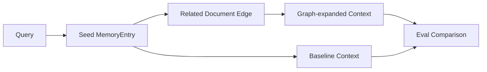

# Day 15：GraphRAG 评估驱动接入

## 今天的总目标

今天不是把 GraphRAG 直接塞进主问答链路，  
也不是为了“用了 Neo4j”就强行让所有问题都走图扩展，  
而是在 Day 10 - Day 12 的 debug / eval 基础上，先补一层**可解释、可评估、可回退的 GraphRAG 决策视图**。

Day 15 要解决的问题是：

> 图召回不能只因为听起来高级就进入回答上下文。  
> 它必须知道自己为什么启用、扩展了哪些文档、补了哪些 evidence，以及指标上有没有提升。

所以今天的优化目标是：

```text
query
-> seed MemoryEntry
-> related document edge
-> graph-expanded context
-> baseline vs graph retrieval eval
-> GraphRAG decision API
```

---

## 今天结束前已经拿到什么

今天完成了这 4 件事：

1. 新增 `schemas/graph_rag.py`，定义 GraphRAG seed、expansion、context、eval comparison 的结构化返回。
2. 新增 `services/graph_rag_service.py`，实现只读 GraphRAG 决策层和 baseline / graph 指标对比。
3. 在 `routers/graph.py` 增加 `GET /graph/knowledge-bases/{knowledge_base_id}/rag`。
4. 新增 `scripts/debug_day15.py`，用本地样本验证图扩展能补到 baseline 漏掉的 evidence chunk。

---

## Day 15 一图总览

```text
query
-> extract query terms
-> match seed MemoryEntry
-> find related document edges
-> build graph contexts
-> compare baseline retrieval with graph retrieval
```



---

## 这一日为什么重要

前面几天已经有了几块基础：

```text
Day 10: Retrieval Debug
Day 11: Eval metrics
Day 12: Citation validation
Day 13: Memory governance
Day 14: Evidence-based profile tools
```

但如果 GraphRAG 只是停留在“图能展示出来”，它还没有真正进入 RAG 能力层。  
Day 15 做的是把图从展示能力推进到检索决策能力：

```text
不是：有图 -> 就扩展
而是：问题需要关系证据 -> 找 seed -> 沿共享记忆扩展 -> 用 eval 验证
```

这样后续把 GraphRAG 接进主问答链路时，就不是盲目扩大上下文，而是有 debug 和 eval 兜底。

---

## 代码落点

### 1. `schemas/graph_rag.py`

新增这些结构：

```text
GraphRagSeedItem
GraphRagExpansionItem
GraphRagContextItem
GraphRagDecisionData
GraphRagEvalComparisonData
```

其中：

- `GraphRagSeedItem` 表示 query 命中的种子记忆。
- `GraphRagExpansionItem` 表示从种子文档沿图扩展出来的相关文档边。
- `GraphRagContextItem` 表示最终可进入上下文候选池的 seed / expansion evidence。
- `GraphRagDecisionData` 是接口返回的主结构。
- `GraphRagEvalComparisonData` 用于比较 baseline retrieval 和 graph retrieval 的指标变化。

### 2. `services/graph_rag_service.py`

这个服务只做纯计算，不写数据库。

核心入口是：

```python
build_graph_rag_decision(...)
```

它做 5 步：

```text
1. 从 query 中抽取 query_terms
2. 在 MemoryEntry 中找 seed memory
3. 复用现有 shared memory 关系生成 related document edge
4. 把 seed context 和 graph-expanded context 统一成可调试结构
5. 判断 graph_useful 和 reason
```

另一个调试入口是：

```python
compare_graph_retrieval(...)
```

它复用 Day 11 的 `evaluate_retrieval(...)`，把 baseline chunk ids 和 graph chunk ids 放到同一组指标里比较。

### 3. `routers/graph.py`

新增接口：

```text
GET /graph/knowledge-bases/{knowledge_base_id}/rag
```

参数：

```text
query
top_k
max_expansions
```

这个接口会复用知识库权限校验，只允许用户查看自己的知识库 GraphRAG 决策结果。

返回里最关键的是：

```text
graph_useful
reason
seeds
expansions
contexts
```

也就是说，调用方不仅知道“要不要用图”，还能看到为什么用图、图扩展补了哪些 evidence。

### 4. `scripts/debug_day15.py`

调试脚本构造了 3 个文档：

```text
architecture_notes.md
embedding_plan.md
ops_notes.md
```

其中 `architecture_notes.md` 是 query 的 seed 文档，  
`embedding_plan.md` 通过共享的 `GraphRAG expansion` 记忆与它产生 related edge。

这样可以验证一个最小场景：

```text
baseline 只命中 Neo4j seed chunk
graph expansion 补到 embedding plan chunk
eval 指标能看到 recall 提升
```

---

## 当前 GraphRAG 启用规则

Day 15 第一版会优先识别这类 query：

```text
relationship / related / conflict / timeline / dependency / impact
关系 / 关联 / 冲突 / 变化 / 演化 / 时间线 / 影响 / 依赖 / 共同
```

只要 query 命中这些关系型意图，并且存在 seed memory 与 related document edge，接口会返回：

```text
graph_useful=True
```

如果没有 seed memory，返回：

```text
graph_useful=False
reason=No seed memory matched the query.
```

如果有 seed 但没有图边，返回：

```text
graph_useful=False
reason=Seed memories were found, but no related document edges were available.
```

这让 GraphRAG 的启用逻辑可以被 debug，而不是藏在主链路里。

---

## 为什么今天不直接改主问答链路

今天没有直接改：

```text
services/query_service.py
services/context_service.py
Milvus retrieval pipeline
answer generation prompt
```

原因是：

1. GraphRAG 需要先证明它在哪些问题上有用。
2. 图扩展如果直接进上下文，可能会带来噪声和 citation 压力。
3. Day 11 的 eval 已经存在，今天应该先让图增强接上 eval，而不是绕开 eval。
4. 当前项目正在收敛技术栈，应该优先做可观测的薄层，不引入新的存储或复杂 agent。

所以 Day 15 的边界是：

```text
GraphRAG decision view
Graph-expanded context candidates
baseline vs graph retrieval comparison
```

它是未来接入主链路之前的评估闸门。

---

## 验证结果

执行：

```bash
.\.venv\Scripts\python.exe -B scripts\debug_day15.py
```

当前输出能看到：

```text
graph_useful=True
seed_count=1
expansion_count=1
context_count=2
baseline_chunk_ids=['doc_arch_chunk_1']
graph_chunk_ids=['doc_arch_chunk_1', 'doc_embedding_chunk_1']
baseline_recall_at_k=0.0000
graph_recall_at_k=1.0000
recall_delta=1.0000
```

这说明 Day 15 的最小验收成立：

```text
query 能找到 seed memory
seed document 能沿 shared memory edge 扩展到 related document
graph context 能补到 baseline 漏掉的 chunk
eval 能量化 graph retrieval 的提升
```

同时执行了 AST 语法检查：

```bash
.\.venv\Scripts\python.exe -B -c "import ast, pathlib; files=['schemas/graph_rag.py','services/graph_rag_service.py','routers/graph.py','scripts/debug_day15.py']; [ast.parse(pathlib.Path(f).read_text(encoding='utf-8'), filename=f) for f in files]; print('ast_ok')"
```

结果：

```text
ast_ok
```

---

## 今天没有做什么

### 1. 没有把 GraphRAG 强行接进所有问答

Day 15 只是新增一个决策视图。  
主问答链路仍然保持原样，避免 GraphRAG 噪声影响现有回答。

### 2. 没有新建 GraphRAG 专用表

当前扩展基于已有的：

```text
documents
memory_entries
shared memory relationship
```

Neo4j 仍然是图投影后端，PostgreSQL fallback 仍然保留。

### 3. 没有引入新的图算法库

今天只做一跳 related document expansion。  
多跳路径、路径打分、社区发现、PageRank 等都不在今天范围内。

### 4. 没有把 citation validation 直接接进 GraphRAG

今天先验证 retrieval 指标。  
后续接主链路时，再让 graph-expanded context 进入 citation validation。

---

## 今日验收标准

今天结束时，至少要能回答这 6 个问题：

1. GraphRAG 为什么不能默认对所有 query 启用？
2. seed MemoryEntry 在 GraphRAG 里承担什么角色？
3. related document edge 当前是怎么生成的？
4. graph-expanded context 如何进入 debug 视图？
5. baseline retrieval 和 graph retrieval 如何用同一套 eval 指标比较？
6. 为什么 Day 15 先做决策视图，而不是直接改主问答链路？

---

## 给 Day 16 的交接提示

Day 16 可以进入任务可靠性和消息队列方向。  
结合用户之前的技术栈约束，Day 16 应该记住：

```text
Redis 仍然保留
Celery 后面会替换成 RabbitMQ broker 方向
PostgreSQL / Milvus / Neo4j 是默认数据与检索主栈
GraphRAG 已经有了可评估的接入闸门
```

Day 16 不应该回头扩大数据库技术栈，而应该开始把长耗时任务、重试、索引刷新和图投影刷新放进更稳定的异步任务边界里。

Day 15 最终交给 Day 16 的输入是：

```text
GraphRAG decision API
graph-expanded context candidates
baseline vs graph retrieval eval comparison
debug_day15 verification script
```

这就是 Day 15 最终要交给 Day 16 的东西。
