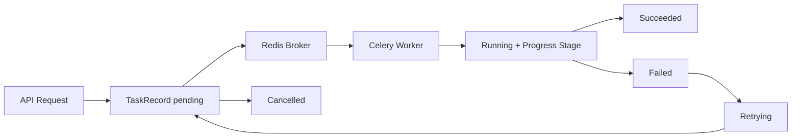

# Day 16：TaskRecord 与高吞吐消息队列

## 今天的总目标

今天不是把所有长任务一次性重写成复杂工作流，  
也不是提前进入 Day 17 的 outbox 和多索引一致性，  
而是在 Day 15 的 GraphRAG 决策视图之后，先把**长耗时任务的生命周期、执行阶段、重试和队列边界**收口清楚。

Day 16 要解决的问题是：

> 文档索引、MemoryEntry 抽取、Milvus 写入、Neo4j 投影和 Eval Run 这类长任务，不能继续只靠同步调用或松散后台执行。  
> 它们必须先有统一的 TaskRecord 状态机，再接消息队列和 worker。

所以今天的优化目标是：

```text
API request
-> TaskRecord(pending)
-> Celery / Redis queue
-> Worker running + progress_stage
-> succeeded / failed / retrying / cancelled
-> task status API
```

---

## 今天结束前已经拿到什么

今天完成了这 7 件事：

1. 扩展 `TaskRecord`，把旧的阶段型 `status` 升级为生命周期状态，并新增 `progress_stage / queue_name / celery_task_id / attempt_count / max_attempts / result_summary`。
2. 新增 Alembic migration：`alembic/versions/20260526_01_expand_task_record_lifecycle.py`。
3. 重写 `services/task_state_service.py`，统一 `pending / running / succeeded / failed / retrying / cancelled` 状态机，并兼容旧状态。
4. 调整文档索引提交逻辑，让新任务默认进入 `pending`，同时记录 Celery 队列和任务 ID。
5. 调整 Celery 配置，明确任务路由、late ack、worker prefetch，保持 Redis broker 现状。
6. 调整 cancel / retry 语义：取消只允许 `pending`；失败或取消后重试会复用原 TaskRecord。
7. 新增 `scripts/debug_day16.py`，用纯本地方式验证状态迁移、旧状态兼容和非法迁移拦截。

---

## Day 16 一图总览

```text
document index request
-> create TaskRecord(status=pending)
-> enqueue Celery task
-> worker starts
-> status=running, progress_stage=parsing/chunking/...
-> status=succeeded or failed
-> cancel / retry API controls lifecycle
```



---

## 这一日为什么重要

Day 13 - Day 15 已经把长期记忆治理、画像工具和 GraphRAG 决策视图补起来了。  
这些能力一旦进入真实使用，就会遇到同一个工程问题：

```text
它们都不是适合卡在 HTTP 请求里的短操作。
```

文档索引会解析文件、切 chunk、抽取 MemoryEntry、写 Milvus、同步 Neo4j。  
GraphRAG 后续会触发图投影刷新。  
Eval Run 后续会批量跑 case、计算指标和生成报告。

如果没有统一任务状态，用户只能看到“请求发出去了”，但不知道：

```text
任务是否还在排队
worker 是否已经开始执行
当前卡在哪个阶段
失败后能不能重试
取消是否真的生效
```

Day 16 的关键不是换成 RabbitMQ，  
而是先把消息层背后的业务事实放回 PostgreSQL 的 `TaskRecord`。

---

## 代码落点

### 1. `models/task_record.py`

把 `TaskRecord.status` 从旧的阶段状态改成生命周期状态：

```text
pending
running
succeeded
failed
retrying
cancelled
```

同时新增：

```text
progress_stage
queue_name
celery_task_id
attempt_count
max_attempts
result_summary
```

这样 `status` 回答“任务处于什么生命周期”，  
`progress_stage` 回答“运行中具体走到哪一步”。

### 2. `alembic/versions/20260526_01_expand_task_record_lifecycle.py`

新增 migration 做两类事情：

```text
1. 给 task_records 增加 Day 16 所需字段
2. 把历史状态迁移到新的生命周期模型
```

历史状态映射为：

```text
queued -> pending
completed -> succeeded
canceled -> cancelled
parsing / chunking / memory_extracting / embedding / vector_upserting
-> status=running, progress_stage=原阶段
```

这保证旧任务记录不会因为状态语义变化而丢失执行阶段。

### 3. `schemas/task_record.py`

`TaskRecordData` 暴露新增字段，让 `/tasks/{task_id}` 可以返回：

```text
status
progress_stage
queue_name
celery_task_id
attempt_count
max_attempts
result_summary
error_message
```

前端或调试脚本可以直接区分“排队中”和“运行到 embedding 阶段”。

### 4. `services/task_state_service.py`

今天的核心文件。

新增：

```text
normalize_task_status(...)
is_active_task_status(...)
resolve_task_transition(...)
transition_task_status(...)
```

当前合法迁移是：

```text
pending -> running / failed / cancelled
running -> succeeded / failed / retrying / cancelled
retrying -> pending / running / failed / cancelled
failed -> retrying / pending
cancelled -> retrying / pending
succeeded -> terminal
```

同时保留旧状态兼容：

```text
queued -> pending
completed -> succeeded
canceled -> cancelled
旧阶段状态 -> running
```

### 5. `services/document_service.py`

提交文档索引任务时，新的 TaskRecord 会写成：

```text
task_type=document_index
status=pending
queue_name=document_index
celery_task_id=task_id
max_attempts=settings.CELERY_TASK_MAX_RETRIES
```

文档自身仍然保留 `queued`，因为这是 document 资源状态；  
任务记录使用 `pending`，因为这是 TaskRecord 生命周期状态。

这两者不要混在一起：

```text
document.status 描述文档资源处于什么业务阶段
task_record.status 描述异步任务处于什么执行生命周期
```

### 6. `infra/celery_app.py` 和 `infra/task_queue.py`

Celery 当前仍然使用 Redis：

```text
CELERY_BROKER_URL=redis://...
CELERY_RESULT_BACKEND=redis://...
```

今天没有替换 RabbitMQ。  
只补了更明确的执行边界：

```text
task_routes
task_acks_late=True
task_reject_on_worker_lost=True
worker_prefetch_multiplier=settings.CELERY_WORKER_PREFETCH_MULTIPLIER
```

`enqueue_index_document_task(...)` 明确投递到 `document_index` 队列，并返回 Celery task id。

### 7. `tasks/index_tasks.py`

worker 启动后，阶段变化不再直接改成阶段状态，  
而是通过 `transition_task_status(...)` 变成：

```text
status=running
progress_stage=parsing / chunking / memory_extracting / embedding / vector_upserting
```

任务成功后：

```text
status=succeeded
result_summary=chunks=...; memories=...; vector_batches=...; indexed_vectors=...
```

任务失败后：

```text
status=failed
error_message=...
document.status=failed
```

### 8. `services/task_admin_service.py`

取消规则收紧为：

```text
只有 pending 任务可以取消
```

重试规则是：

```text
failed / cancelled
-> retrying
-> pending
-> 重新投递同一个 task_id
```

这样重试不会额外制造一条新 TaskRecord，  
同一个任务 ID 可以保留完整尝试次数和状态轨迹。

### 9. `scripts/debug_day16.py`

新增本地调试脚本，验证这些点：

```text
旧状态 queued / completed / canceled 能归一化
pending -> parsing 会得到 running + progress_stage=parsing
running -> succeeded 成立
failed -> retrying -> pending 成立
pending -> cancelled 成立
succeeded -> failed 会被拦截
```

---

## 当前 TaskRecord 状态策略

### 生命周期状态

| 状态 | 含义 |
| --- | --- |
| `pending` | 已创建 TaskRecord，等待 worker 消费 |
| `running` | worker 已开始执行 |
| `succeeded` | 任务完成 |
| `failed` | 任务失败，可进入 retry |
| `retrying` | 正在准备重新投递 |
| `cancelled` | 用户取消，worker 不应继续处理 |

### 执行阶段

`progress_stage` 暂时承接这些阶段：

```text
parsing
chunking
memory_extracting
embedding
vector_upserting
graph_projecting
eval_running
```

其中后两个是为 Day 17 之后的图投影刷新和 Eval Run 预留的阶段名，  
今天没有提前实现对应 worker。

---

## 为什么今天不直接换 RabbitMQ

Day 16 的路线里已经明确：

```text
当前保留 Redis 作为 Celery broker / result backend
后续消息层优先考虑 RabbitMQ
```

但现在最重要的是先让业务状态机稳定。  
如果今天直接切 RabbitMQ，而 TaskRecord 仍然只有松散阶段状态，问题不会真正解决。

所以今天的边界是：

```text
先稳定 TaskRecord 生命周期
再稳定 worker 状态上报
再让 Celery 配置显式化
RabbitMQ 留到消息层替换或生产化阶段
```

---

## 验证结果

执行：

```bash
.\.venv\Scripts\python.exe -B scripts\debug_day16.py
```

当前输出能看到：

```text
active_statuses=['pending', 'retrying', 'running']
legacy_queued=pending
legacy_completed=succeeded
legacy_canceled=cancelled
pending->parsing: status=running progress_stage=parsing
running->chunking: status=running progress_stage=chunking
running->succeeded: status=succeeded progress_stage=None
failed->retrying: status=retrying progress_stage=None
retrying->pending: status=pending progress_stage=None
pending->cancelled: status=cancelled progress_stage=None
is_pending_active=True
is_running_active=True
is_retrying_active=True
is_succeeded_active=False
illegal_transition_error=BusinessException
```

同时执行了 AST 语法检查：

```bash
.\.venv\Scripts\python.exe -B -c "import ast, pathlib; files=[...]; [ast.parse(pathlib.Path(f).read_text(encoding='utf-8'), filename=f) for f in files]; print('ast_ok')"
```

结果：

```text
ast_ok
```

还执行了核心模块导入检查：

```bash
.\.venv\Scripts\python.exe -B -c "import conf.config, crud.task_record, infra.celery_app, infra.task_queue, models.task_record, schemas.task_record, services.document_service, services.task_admin_service, services.task_state_service, tasks.index_tasks; print('imports_ok')"
```

结果：

```text
imports_ok
```

额外说明：尝试执行 `compileall` 时，当前仓库多个 `__pycache__` 目录里的 `.pyc` 文件权限不可写，导致 `PermissionError`。  
因此今天改用不会写入缓存文件的 AST 检查和模块导入检查。

---

## 今天没有做什么

### 1. 没有把所有长任务都改成 Celery worker

今天只把文档索引这条已有异步链路收口。  
Memory rebuild、Graph projection rebuild、Eval Run 后续可以复用同一套 TaskRecord 状态机。

### 2. 没有引入 RabbitMQ

Redis 仍然保留。  
RabbitMQ 是后续消息层替换方向，不是今天的必要前提。

### 3. 没有实现 outbox

Day 17 才应该处理 PostgreSQL 事实源与 Milvus / Neo4j 外部投影之间的一致性、重放和死信。

### 4. 没有把任务历史拆成事件表

今天只扩展 `task_records`。  
如果后续需要完整 timeline，可以新增 `task_events`，但不是 Day 16 的最小落点。

---

## 今日验收标准

今天结束时，至少要能回答这 7 个问题：

1. `TaskRecord.status` 和 `progress_stage` 为什么要分开？
2. 为什么 document 的 `queued` 和 task 的 `pending` 不是同一层概念？
3. worker 阶段变化如何写回 TaskRecord？
4. 失败任务如何进入 retry？
5. 为什么取消只允许发生在 `pending`？
6. 当前为什么继续保留 Redis，而不是直接切 RabbitMQ？
7. Day 17 的 outbox 应该接在哪个边界之后？

---

## 给 Day 17 的交接提示

Day 17 可以进入 Outbox 与多索引一致性。

Day 16 已经交给 Day 17 这几样东西：

```text
TaskRecord 生命周期状态机
progress_stage 阶段上报
Celery / Redis 队列投递边界
document_index worker 的 succeeded / failed / retry / cancel 语义
可本地验证的 debug_day16.py
```

Day 17 不应该重新发明任务状态。  
它应该在这个基础上继续解决：

```text
PostgreSQL 业务写入成功
-> 产生 outbox event
-> worker 消费 event
-> 写 Milvus / Neo4j 投影
-> 幂等、重试、死信、重放
```

也就是说，Day 16 解决的是“长任务怎么被可靠地看见和控制”，  
Day 17 要解决的是“外部索引副作用怎么不丢、不乱、不重复”。
