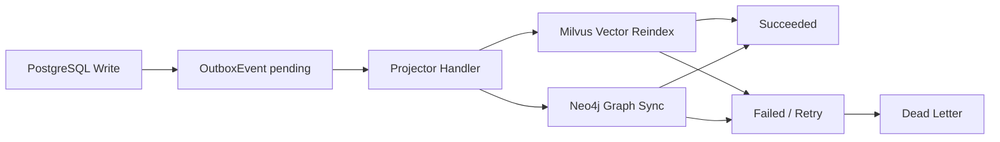

# Day 17：Outbox 与多索引一致性

## 今天的总目标

今天不是继续增加一个新的外部存储，  
也不是把所有任务都重写成复杂 workflow，  
而是在 Day 16 的 `TaskRecord + Celery` 基础上，补上**PostgreSQL 事实源与 Milvus / Neo4j 外部投影之间的 outbox 边界**。

Day 17 要解决的问题是：

> 文档 chunk、MemoryEntry、任务状态都在 PostgreSQL 里。  
> Milvus 和 Neo4j 只是外部投影层。  
> 如果外部写入失败，系统不能悄悄丢掉索引刷新或图投影刷新。

所以今天的优化目标是：

```text
PostgreSQL business write
-> OutboxEvent
-> projector handler
-> Milvus / Neo4j
-> succeeded / failed / dead_letter
-> later replay
```

---

## 今天结束前已经拿到什么

今天完成了这 7 件事：

1. 新增 `models/outbox_event.py`，定义 outbox 事件表结构。
2. 新增 `schemas/outbox_event.py` 和 `crud/outbox_event.py`，提供 outbox 读写、状态更新和待分发查询。
3. 新增 Alembic migration：`alembic/versions/20260526_02_add_outbox_events.py`。
4. 新增 `services/outbox_service.py`，实现 outbox 事件创建、幂等 key、失败重试、dead letter 判断，以及 Milvus / Neo4j handler。
5. 新增 `tasks/outbox_tasks.py`，把单个 outbox event 处理和批量 pending event dispatch 接入 Celery。
6. 调整 `infra/celery_app.py` 和 `infra/task_queue.py`，增加 `outbox_projection` 队列与投递入口。
7. 调整 `pipelines/document_index_pipeline.py`，让文档索引里的 Milvus reindex 和最终 Neo4j document-memory sync 通过 outbox 事件执行。

---

## Day 17 一图总览

```text
document index pipeline
-> persist chunks / memories in PostgreSQL
-> create vector reindex outbox event
-> process Milvus projection
-> mark document indexed
-> create graph sync outbox event
-> process Neo4j projection
```



---

## 这一日为什么重要

Day 16 解决的是：

```text
长任务如何被看见、控制、取消、重试
```

但这还不够。  
因为文档索引任务内部至少有两类副作用：

```text
1. 写 PostgreSQL：documents / chunks / memory_entries / task_records
2. 写外部投影：Milvus vectors / Neo4j graph
```

PostgreSQL 写入可以通过事务保证一致。  
但 Milvus 和 Neo4j 不在同一个数据库事务里。

如果流程是：

```text
chunks 写入成功
memory_entries 写入成功
Milvus 短暂不可用
```

系统不能只把任务标失败然后丢掉上下文。  
它必须留下一个可查询、可重试、可重放的事件。

这就是 Day 17 引入 outbox 的原因。

---

## 代码落点

### 1. `models/outbox_event.py`

新增 `OutboxEvent`。

核心字段是：

```text
id
event_type
aggregate_type
aggregate_id
target_backend
payload
idempotency_key
status
attempt_count
max_attempts
next_attempt_at
locked_at
processed_at
last_error
```

其中：

- `event_type` 表示要做什么，例如 `document.vector.reindex`。
- `target_backend` 表示投影目标，例如 `milvus` 或 `neo4j`。
- `payload` 保存 handler 所需的最小参数。
- `idempotency_key` 用来避免同一业务操作重复创建事件。
- `status` 表示 outbox 生命周期，不和 `TaskRecord.status` 混用。

### 2. `alembic/versions/20260526_02_add_outbox_events.py`

新增 `outbox_events` 表，并建立 4 类索引：

```text
idx_outbox_events_status_next_attempt
idx_outbox_events_backend_status
idx_outbox_events_aggregate
idx_outbox_events_idempotency_key
```

这些索引用来支持：

```text
按状态扫描待处理事件
按 backend 查 Milvus / Neo4j 投影事件
按 aggregate 查某个 document 的事件
按 idempotency_key 保证同一操作不重复入库
```

### 3. `crud/outbox_event.py`

新增 outbox 的最小 CRUD：

```text
create_outbox_event(...)
get_outbox_event_by_id(...)
get_outbox_event_by_idempotency_key(...)
list_dispatchable_outbox_events(...)
update_outbox_event_status(...)
```

Day 17 不直接做复杂锁表或分布式调度。  
先把事件状态和可重放查询面补齐。

### 4. `services/outbox_service.py`

这是今天的核心服务。

当前支持两类事件：

```text
document.vector.reindex -> milvus
document.graph.sync -> neo4j
```

当前 outbox 状态是：

```text
pending
running
succeeded
failed
dead_letter
```

处理流程是：

```text
load event
-> mark running
-> apply handler
-> mark succeeded
```

失败流程是：

```text
handler exception
-> attempt_count + 1
-> failed + next_attempt_at
-> 超过 max_attempts 后进入 dead_letter
```

### 5. Milvus handler

`document.vector.reindex` 的 handler 会：

```text
1. 从 PostgreSQL 读取 document
2. 读取该 document 的 chunks
3. 转成 LangChain Document
4. 先按 chunk_id 删除旧向量
5. 再按 batch 写入 Milvus
```

这让 vector projection 具备基本幂等性：

```text
同一个 document 重放时，先删再写
```

### 6. Neo4j handler

`document.graph.sync` 的 handler 会：

```text
1. 从 PostgreSQL 读取 document
2. 读取 user / knowledge_base
3. 读取该 document 的 memory_entries
4. 调用 sync_document_memory_projection(...)
5. 重建相关 document edge
```

Neo4j 写入本身使用 `MERGE` 和 replace document memory 的方式，  
因此也适合被 outbox 重放。

为了让 outbox 能真实感知 Neo4j 投影失败，今天还给 `services/graph_projection_service.py` 增加了默认关闭的 `raise_on_error` 参数。  
普通接口仍保留原来的宽容行为，outbox handler 会显式开启严格失败上抛。

### 7. `tasks/outbox_tasks.py`

新增两个 Celery task：

```text
tasks.process_outbox_event_task
tasks.dispatch_pending_outbox_events_task
```

前者处理单个 event。  
后者扫描 pending / failed 且到达 `next_attempt_at` 的事件，并批量分发。

### 8. `pipelines/document_index_pipeline.py`

今天把文档索引中的两个外部副作用纳入 outbox：

```text
Milvus vector reindex
Neo4j graph sync
```

原来的主链路仍然保持：

```text
parse
-> chunk
-> persist chunks
-> rebuild memory entries
-> vector_upserting
-> indexed
```

但 `vector_upserting` 不再直接调用 vector store，  
而是：

```text
enqueue document.vector.reindex outbox event
-> process_outbox_event_by_id(...)
```

最终 document 标记为 `indexed` 后，会：

```text
enqueue document.graph.sync outbox event
-> process_outbox_event_by_id(...)
```

这意味着当外部服务失败时，错误不再只停留在日志里，  
而会落到 `outbox_events`。

---

## 当前 Outbox 状态策略

| 状态 | 含义 |
| --- | --- |
| `pending` | 已记录事件，等待处理 |
| `running` | handler 正在处理 |
| `succeeded` | 投影成功 |
| `failed` | 本次投影失败，可重试 |
| `dead_letter` | 超过最大尝试次数，需要人工处理或脚本重放 |

当前失败退避策略很克制：

```text
next_attempt_at = now + OUTBOX_RETRY_BASE_DELAY_SECONDS * attempt_count
```

默认配置是：

```text
OUTBOX_EVENT_MAX_ATTEMPTS=5
OUTBOX_RETRY_BASE_DELAY_SECONDS=30
```

---

## 为什么今天不把所有外部副作用都迁进去

今天只迁了文档索引主链路里的两个核心外部投影：

```text
Milvus vector reindex
Neo4j graph sync
```

还没有迁：

```text
document delete -> Milvus delete / Neo4j delete
knowledge base delete -> projection delete
memory rebuild API -> projection refresh
manual graph rebuild API
eval report generation
```

原因是 Day 17 的关键是先把 outbox 模式立住。  
删除链路和批量 rebuild 涉及更多补偿语义，不应该和第一版 outbox 基础设施混在一起做。

---

## 验证结果

执行：

```bash
.\.venv\Scripts\python.exe -B scripts\debug_day17.py
```

当前输出能看到：

```text
statuses=['pending', 'running', 'succeeded', 'failed', 'dead_letter']
event_types=['document.vector.reindex', 'document.graph.sync']
backends=['milvus', 'neo4j']
idempotency_key=document.vector.reindex:document:doc_day17:index_run_001
next_attempt_is_future=True
dead_letter_before_limit=False
dead_letter_at_limit=True
chunk_doc_id=chunk_day17_1
chunk_doc_backend_payload_document_id=doc_day17
chunk_doc_has_section=True
```

同时执行了 AST 语法检查：

```bash
.\.venv\Scripts\python.exe -B -c "import ast, pathlib; files=[...]; [ast.parse(pathlib.Path(f).read_text(encoding='utf-8'), filename=f) for f in files]; print('ast_ok')"
```

结果：

```text
ast_ok
```

还执行了核心模块导入检查：

```bash
.\.venv\Scripts\python.exe -B -c "import models.outbox_event, schemas.outbox_event, crud.outbox_event, services.outbox_service, tasks.outbox_tasks, pipelines.document_index_pipeline, infra.celery_app, infra.task_queue; print('imports_ok')"
```

结果：

```text
imports_ok
```

说明 Day 17 新增的 outbox model / crud / service / task / pipeline 接入面至少可以被正常解析和导入。

---

## 今天没有做什么

### 1. 没有执行数据库 migration

今天新增了 migration 文件，但没有运行：

```bash
alembic upgrade head
```

因为这会修改当前数据库。

### 2. 没有启动 Celery worker 实测外部服务

本地验证覆盖了脚本、语法和导入。  
没有启动 Redis / Celery worker / Milvus / Neo4j 做端到端真实投影。

### 3. 没有把 delete 链路迁入 outbox

删除链路需要更谨慎处理文件删除、PostgreSQL 删除和外部投影删除的顺序。  
这应该作为后续补偿语义来做。

### 4. 没有引入 RabbitMQ

Day 17 继续沿用 Day 16 的 Redis broker。  
Outbox 解决的是业务一致性和重放，不依赖 RabbitMQ 才能成立。

### 5. 没有做 task_events 历史表

`outbox_events` 不是 `task_events`。  
今天只记录外部投影事件，不记录每个 TaskRecord 的完整历史 timeline。

---

## 今日验收标准

今天结束时，至少要能回答这 7 个问题：

1. 为什么 PostgreSQL 是事实源，而 Milvus / Neo4j 是投影层？
2. OutboxEvent 和 TaskRecord 的职责有什么区别？
3. 为什么 Milvus reindex 要先 delete existing 再 add？
4. Neo4j graph sync 为什么适合用 MERGE / replace 方式做幂等重放？
5. outbox event 失败后如何进入 retry？
6. 什么情况下 outbox event 会进入 dead_letter？
7. 为什么 Day 17 不应该一次性迁移所有删除链路？

---

## 给 Day 18 的交接提示

Day 18 可以进入 PostgreSQL 分析视图与调优报表。

Day 17 已经交给 Day 18 这些输入：

```text
TaskRecord 生命周期状态
OutboxEvent 投影状态
Milvus vector reindex 结果
Neo4j graph sync 结果
failed / dead_letter 事件
```

Day 18 不应该再继续增加新数据库。  
它应该基于 PostgreSQL 已有数据做：

```text
retrieval debug logs
eval result summary
task_records 状态分布
outbox_events failed / dead_letter 报表
document / chunk / memory 统计
```

也就是说，Day 17 解决的是“外部投影失败以后还能重放”，  
Day 18 要解决的是“系统运行以后如何分析哪里慢、哪里错、哪里需要调优”。
