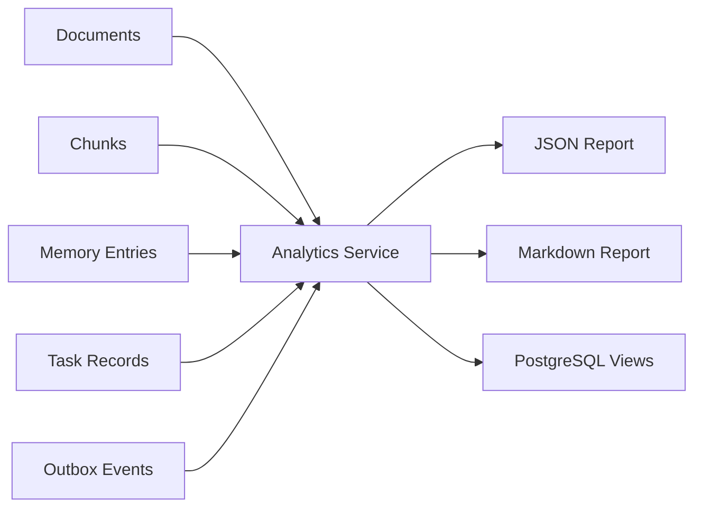

# Day 18：PostgreSQL 分析视图与调优报表

## 今天的总目标

今天不是继续增加 DuckDB、MongoDB 或新的分析中间件，  
也不是把 eval / debug 全部重做成一个报表平台，  
而是在 Day 16 的 `TaskRecord` 和 Day 17 的 `OutboxEvent` 之后，先补一层**基于 PostgreSQL 事实数据的运行分析视图和只读报表接口**。

Day 18 要解决的问题是：

> Mneme 现在已经能索引、检索、评估、投影和重试。  
> 下一步不是继续堆组件，而是能看见系统哪里慢、哪里失败、哪里数据质量差。

所以今天的优化目标是：

```text
PostgreSQL facts
-> analytics views
-> analytics service
-> markdown / JSON report
-> tuning decision
```

---

## 今天结束前已经拿到什么

今天完成了这 5 件事：

1. 新增 `schemas/analytics.py`，定义知识库运行分析报表结构。
2. 新增 `services/analytics_service.py`，汇总 documents / chunks / memory_entries / task_records / outbox_events。
3. 在 `routers/analysis.py` 增加 `GET /analysis/knowledge-bases/{knowledge_base_id}/analytics`。
4. 新增 Alembic migration：`alembic/versions/20260526_03_add_postgresql_analytics_views.py`，创建 PostgreSQL 分析视图。
5. 新增 `scripts/debug_day18.py`，用本地样本验证统计、状态分布和 Markdown 报表生成。

---

## Day 18 一图总览

```text
documents / chunks / memory_entries
task_records / outbox_events
-> analytics service
-> structured JSON
-> markdown report
```



---

## 这一日为什么重要

Day 10 - Day 12 让 RAG 调优有了 debug / eval / citation 防线。  
Day 16 - Day 17 让长任务和外部投影有了状态、重试和 outbox。

但如果系统运行以后没有分析面，开发者还是只能靠日志猜：

```text
哪个知识库文档最多？
chunk 是否异常膨胀？
memory entry 是否明显偏少？
任务失败集中在哪些状态？
outbox 是否有 failed / dead_letter？
```

Day 18 的核心就是把这些信号先从 PostgreSQL 里拿出来。  
它不是最终 BI 系统，但它能让后续调优有依据。

---

## 代码落点

### 1. `schemas/analytics.py`

新增这些结构：

```text
StatusCountData
BackendStatusData
DocumentAnalyticsData
ChunkAnalyticsData
MemoryAnalyticsData
TaskAnalyticsData
OutboxAnalyticsData
KnowledgeBaseAnalyticsReportData
```

报表按 5 块组织：

```text
documents
chunks
memory
tasks
outbox
```

最后额外返回一份 `markdown`，方便离线保存或贴到调优记录里。

### 2. `services/analytics_service.py`

这是今天的核心服务。

主要入口是：

```python
build_knowledge_base_analytics_report(...)
```

它会校验知识库归属，然后加载：

```text
documents
chunks
memory_entries
document_index task_records
document aggregate outbox_events
```

再汇总出：

```text
document_count
document status distribution
total_file_size
chunk_count
avg_chunks_per_document
section_count
memory_entry_count
memory entry_type distribution
task_count
active_task_count
failed_task_count
outbox_event_count
failed_event_count
dead_letter_count
backend_status distribution
```

同时保留一个纯内存入口：

```python
build_analytics_report_from_snapshots(...)
```

这个入口用于脚本验证和后续单元测试，不依赖真实数据库。

### 3. `routers/analysis.py`

新增接口：

```text
GET /analysis/knowledge-bases/{knowledge_base_id}/analytics
```

这个接口只读 PostgreSQL，返回 `KnowledgeBaseAnalyticsReportData`。

它不是 LLM 分析接口，也不调用外部模型。  
它的目标是提供稳定、低成本、可重复的工程指标。

### 4. `alembic/versions/20260526_03_add_postgresql_analytics_views.py`

新增 4 个 PostgreSQL view：

```text
mneme_kb_document_analytics
mneme_document_status_analytics
mneme_task_status_analytics
mneme_outbox_status_analytics
```

这些 view 不是新事实源，  
只是把已有事实表整理成更适合查询和报表的结构。

当前 view 覆盖：

```text
知识库文档 / chunk / memory 总量
document status 分布
task status 分布
outbox backend + status 分布
```

### 5. `scripts/debug_day18.py`

调试脚本用本地 `SimpleNamespace` 样本构造：

```text
3 个 documents
4 个 chunks
3 个 memory_entries
3 个 task_records
3 个 outbox_events
```

用它验证：

```text
状态计数
section 去重
active / failed task 统计
failed / dead_letter outbox 统计
markdown 报表生成
```

---

## 当前 Analytics Report 结构

当前接口返回的核心结构是：

```text
knowledge_base_id
generated_at
documents
chunks
memory
tasks
outbox
markdown
```

其中 `markdown` 是给人读的摘要，JSON 字段是给前端、脚本和后续报表生成器消费的结构化数据。

---

## 为什么今天不引入 DuckDB / MongoDB

Day 18 的目标是分析已有事实，而不是增加新事实源。  
当前需要分析的数据已经在 PostgreSQL：

```text
documents
chunks
memory_entries
task_records
outbox_events
```

在这个阶段继续引入 DuckDB 或 MongoDB，会让作品集复杂度上升，  
但不能直接改善检索质量、引用质量或任务可靠性。

所以今天的边界是：

```text
PostgreSQL view
service aggregation
API report
Markdown export
```

---

## 今天没有做什么

### 1. 没有持久化 eval_run 表

Day 11 的 eval 目前仍是内存结构和脚本式评估。  
Day 18 没有顺手新建 eval_run / eval_result 表，避免扩大范围。

### 2. 没有新增 retrieval_debug 表

当前 retrieval debug 仍随回答返回。  
如果后续要做跨请求统计，再把 debug packet 持久化。

### 3. 没有做前端图表

今天只提供后端 JSON / Markdown 报表。  
前端可以后续用同一结构渲染图表。

### 4. 没有执行数据库 migration

今天新增了 PostgreSQL view migration，但没有运行：

```bash
alembic upgrade head
```

因为这会修改当前数据库。

---

## 验证结果

执行：

```bash
.\.venv\Scripts\python.exe -B scripts\debug_day18.py
```

当前输出能看到：

```text
document_count=3
total_file_size=2600
chunk_count=4
section_count=2
avg_chunks_per_document=1.33
memory_entry_count=3
task_count=3
active_task_count=1
failed_task_count=1
outbox_event_count=3
outbox_failed_event_count=1
outbox_dead_letter_count=1
markdown_has_dead_letter=True
```

同时执行了 AST 语法检查：

```bash
.\.venv\Scripts\python.exe -B -c "import ast, pathlib; files=[...]; [ast.parse(pathlib.Path(f).read_text(encoding='utf-8'), filename=f) for f in files]; print('ast_ok')"
```

结果：

```text
ast_ok
```

还执行了核心模块导入检查：

```bash
.\.venv\Scripts\python.exe -B -c "import schemas.analytics, services.analytics_service, routers.analysis; print('imports_ok')"
```

结果：

```text
imports_ok
```

---

## 今日验收标准

今天结束时，至少要能回答这 7 个问题：

1. Day 18 为什么优先用 PostgreSQL 做分析？
2. 当前 analytics report 消费了哪些事实表？
3. TaskRecord 和 OutboxEvent 分别贡献了哪些运行信号？
4. `failed_task_count` 和 `dead_letter_count` 分别代表什么风险？
5. 为什么 Markdown 和 JSON 要同时保留？
6. 为什么今天不做前端图表？
7. Day 19 做领域化收口时，analytics 应该归到哪个边界？

---

## 给 Day 19 的交接提示

Day 19 可以进入入口变薄与领域化收口。

Day 18 已经交给 Day 19 这些输入：

```text
TaskRecord 状态机
OutboxEvent 投影事件
analytics report service
PostgreSQL analytics views
analysis router 中的只读工程报表接口
```

Day 19 不应该做“大规模目录搬家”。  
它应该先围绕稳定链路收口边界：

```text
documents
retrieval
memory
graph
tasks / workflow
analytics
```

也就是说，Day 18 解决的是“系统运行后如何看见状态和风险”，  
Day 19 要解决的是“这些稳定能力如何从平铺目录收口到更清楚的领域边界”。
