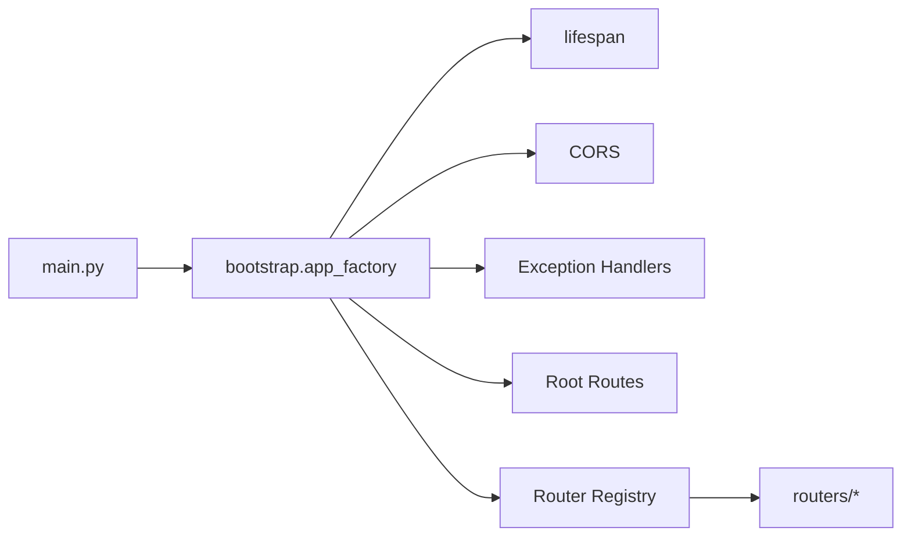

# Day 19：入口变薄与领域化收口

## 今天的总目标

今天不是把 `routers / services / schemas / models / crud` 全部搬进新目录，  
也不是为了“看起来更架构化”做大规模路径重命名，  
而是在 Day 16 - Day 18 的任务、outbox 和 analytics 稳定之后，先把**应用入口、生命周期、路由注册和基础装配**从 `main.py` 里拆出来。

Day 19 要解决的问题是：

> `main.py` 不应该继续同时负责应用创建、生命周期、CORS、中间件、异常处理、路由注册和 root endpoint。  
> 它应该变成薄入口，具体装配交给 bootstrap 层。

所以今天的优化目标是：

```text
main.py
-> bootstrap.create_app()
-> lifespan / middleware / exception handlers / root routes / router registry
```

---

## 今天结束前已经拿到什么

今天完成了这 5 件事：

1. 新增 `bootstrap/app_factory.py`，统一创建 FastAPI app。
2. 新增 `bootstrap/lifespan.py`，承接启动和关闭逻辑。
3. 新增 `bootstrap/router_registry.py`，集中管理 routers 注册顺序。
4. 新增 `bootstrap/root_routes.py`，把 `/` 和 `/hello/{name}` 从 `main.py` 移出。
5. 把 `main.py` 收敛成只负责暴露 `app = create_app()` 的薄入口。

---

## Day 19 一图总览

```text
main.py
-> create_app()
-> configure_cors()
-> configure_exception_handlers()
-> register root routes
-> register domain routers
```



---

## 这一日为什么重要

Day 1 - Day 18 已经把 Mneme 从普通 RAG 原型推进到：

```text
可路由
可检索
可引用
可评估
可治理
可任务化
可重放
可分析
```

这个阶段如果继续让 `main.py` 承担所有装配职责，后面会越来越难看清系统边界。  
尤其是 Day 16 - Day 18 新增了：

```text
TaskRecord
OutboxEvent
Analytics Report
GraphRAG decision
Profile evidence tools
Memory governance
```

这些能力已经不是单个文件能解释清楚的。  
Day 19 的重点不是目录好看，而是先让入口足够薄，让后续领域化收口有稳定入口。

---

## 代码落点

### 1. `bootstrap/app_factory.py`

新增 `create_app()`。

它负责：

```text
创建 FastAPI app
配置 CORS
注册 BusinessException handler
注册 root router
注册业务 routers
```

同时拆出两个小函数：

```python
configure_cors(app)
configure_exception_handlers(app)
```

这样后续如果要做测试 app、管理 app 或不同部署入口，可以复用同一个工厂。

### 2. `bootstrap/lifespan.py`

从 `main.py` 移出原来的 lifespan 逻辑：

```text
setup_logger()
embedding preload
close neo4j driver
engine dispose
logger complete
```

今天没有改变生命周期行为，只是把它放到更合适的位置。

### 3. `bootstrap/router_registry.py`

新增：

```python
ROUTER_MODULE_NAMES = [...]
register_routers(app)
```

当前注册顺序保持和旧 `main.py` 一致：

```text
health
auth
users
documents
chat
memory
advice
analysis
profile
companion
tasks
graph
```

这里没有移动任何 router 文件。  
只是把“有哪些 router 要注册”从入口文件中抽出来。

### 4. `bootstrap/root_routes.py`

把原来的：

```text
GET /
GET /hello/{name}
```

移动到 root router。

这避免 `main.py` 继续夹杂业务 endpoint。

### 5. `main.py`

现在只剩：

```python
from bootstrap.app_factory import create_app

app = create_app()
```

这就是 Day 19 的核心验收：入口变薄。

### 6. `scripts/debug_day19.py`

新增本地调试脚本，验证：

```text
create_app() 能正常返回 FastAPI app
router registry 数量正确
root route 存在
hello route 存在
health route 存在
tasks route 存在
analysis analytics route 存在
graph rag route 存在
```

---

## 为什么今天不做大规模目录搬家

Day 19 的目标结构里确实有：

```text
api/
core/
domains/
workflow/
infra/
```

但当前代码仍有大量横向引用：

```text
routers -> services -> crud -> models
pipelines -> services -> clients
tasks -> pipelines -> services
```

如果今天直接移动目录，很容易制造大量 import churn，反而模糊真正的架构改进。

所以今天只做最小稳定收口：

```text
main.py 变薄
bootstrap 层出现
router registry 显式化
lifespan 和 root routes 抽离
```

后续真正的领域化迁移，应围绕稳定链路逐块做，而不是一次性搬所有文件。

---

## 当前新的启动边界

现在启动链路是：

```text
uvicorn main:app
-> main.app
-> bootstrap.app_factory.create_app()
-> bootstrap.lifespan.lifespan
-> bootstrap.router_registry.register_routers()
```

这条链路让入口责任更清楚：

| 文件 | 职责 |
| --- | --- |
| `main.py` | 暴露 ASGI app |
| `bootstrap/app_factory.py` | 创建和装配 FastAPI app |
| `bootstrap/lifespan.py` | 启动和关闭资源 |
| `bootstrap/router_registry.py` | 注册业务 routers |
| `bootstrap/root_routes.py` | 根路径和 hello endpoint |

---

## 今天没有做什么

### 1. 没有移动业务 router

`routers/*.py` 仍然在原位置。  
今天只改变注册方式。

### 2. 没有移动 service / crud / model

Day 19 没有把 `services` 拆成 `domains`。  
那应该在入口稳定之后，按领域逐步迁移。

### 3. 没有改 API 路径

现有 API 路径保持不变。  
这是薄入口重构，不是对外契约变更。

### 4. 没有改启动命令

仍然可以使用：

```bash
uvicorn main:app
```

---

## 验证结果

执行：

```bash
.\.venv\Scripts\python.exe -B scripts\debug_day19.py
```

当前输出能看到：

```text
project_title=Agentic RAG Assistant
router_module_count=12
route_count=37
has_root=True
has_hello=True
has_health=True
has_tasks=True
has_analysis_analytics=True
has_graph_rag=True
```

同时执行了 AST 语法检查：

```bash
.\.venv\Scripts\python.exe -B -c "import ast, pathlib; files=[...]; [ast.parse(pathlib.Path(f).read_text(encoding='utf-8'), filename=f) for f in files]; print('ast_ok')"
```

结果：

```text
ast_ok
```

还执行了核心导入检查：

```bash
.\.venv\Scripts\python.exe -B -c "import main; from bootstrap.app_factory import create_app; app=create_app(); print('imports_ok'); print(len(app.routes))"
```

结果：

```text
imports_ok
38
```

---

## 今日验收标准

今天结束时，至少要能回答这 7 个问题：

1. 为什么 `main.py` 应该变薄？
2. `bootstrap/app_factory.py` 负责什么？
3. `bootstrap/lifespan.py` 负责什么？
4. `bootstrap/router_registry.py` 为什么比在 `main.py` 里连续 `include_router` 更清楚？
5. 为什么今天不做大规模目录搬家？
6. 为什么 API 路径不应该在 Day 19 改？
7. Day 20 做框架减重时，应该基于哪些稳定边界判断是否继续拆？

---

## 给 Day 20 的交接提示

Day 20 可以进入框架减重与生产化验收。

Day 19 已经交给 Day 20 这些输入：

```text
薄 main.py
bootstrap app factory
lifespan 边界
router registry
root routes
稳定的 TaskRecord / OutboxEvent / Analytics / GraphRAG / Profile / Memory 能力
```

Day 20 不应该继续大规模加功能。  
它应该基于前面 19 天的结果做：

```text
哪些链路值得保留自研
哪些地方可以借助框架减重
哪些中间件不进入默认栈
哪些验证项属于生产化验收
```

也就是说，Day 19 解决的是“入口和装配边界变清楚”，  
Day 20 要解决的是“整个系统如何收口、减重和验收”。
