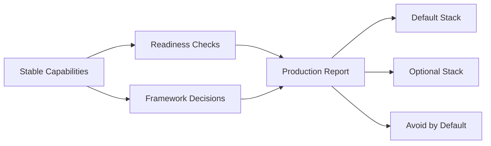

# Day 20：框架减重与生产化验收

## 今天的总目标

今天不是继续加一个新 RAG 框架，  
也不是把 Day 1 - Day 19 的成果再重构一遍，  
而是把 Mneme 当前已经具备的能力收口成一份**可检查、可解释、可继续演进的生产化验收报告**。

Day 20 要解决的问题是：

> 架构优化最后不能靠“我感觉已经差不多了”。  
> 它必须能回答：默认技术栈是什么、哪些框架只做可选 PoC、哪些组件不默认引入、哪些上线检查仍然是 warn。

所以今天的优化目标是：

```text
stable capabilities
-> production readiness checks
-> framework reduction decisions
-> default / optional / avoid stack
-> final acceptance report
```

---

## 今天结束前已经拿到什么

今天完成了这 4 件事：

1. 新增 `schemas/production.py`，定义生产化验收和框架减重决策结构。
2. 新增 `services/production_readiness_service.py`，生成 readiness checks、framework decisions、默认栈和 Markdown 报告。
3. 在 `routers/health.py` 增加 `GET /health/readiness`。
4. 新增 `scripts/debug_day20.py`，用本地方式验证 readiness 报告、框架决策和减重清单。

---

## Day 20 一图总览

```text
TaskRecord / OutboxEvent / Analytics / GraphRAG / Memory / Profile
-> production readiness report
-> framework decisions
-> stack reduction
-> final acceptance
```



---

## 这一日为什么重要

Day 1 - Day 19 已经把 Mneme 推进到这些能力：

```text
Query Router
Hybrid Retrieval
Fusion / Rerank
Evidence Answer
Citation Validation
Memory Governance
Profile Evidence Tools
GraphRAG Decision View
TaskRecord
OutboxEvent
Analytics Report
Thin Bootstrap Entry
```

Day 20 的关键不是继续扩大系统，  
而是判断哪些东西应该留在主链路，哪些东西最多只是可选实验。

否则项目会很容易走向：

```text
再接一个 RAG 框架
再接一个数据库
再接一个消息系统
再接一个分析系统
```

这些都可能让作品集变复杂，却不一定让系统更可靠。

---

## 代码落点

### 1. `schemas/production.py`

新增三类结构：

```text
ReadinessCheckData
FrameworkDecisionData
ProductionReadinessReportData
```

其中 `ProductionReadinessReportData` 返回：

```text
overall_status
checks
framework_decisions
default_stack
optional_stack
avoid_by_default
markdown
```

这份结构既能给 API 返回 JSON，  
也能把 `markdown` 存成最终验收说明。

### 2. `services/production_readiness_service.py`

这是今天的核心服务。

它定义了三类技术栈清单：

```text
DEFAULT_STACK
OPTIONAL_STACK
AVOID_BY_DEFAULT
```

当前默认栈是：

```text
FastAPI
PostgreSQL
Milvus
Neo4j
Redis
Celery
Qwen-compatible LLM API
```

当前可选栈是：

```text
RabbitMQ as future Celery broker
LlamaIndex for ingestion / GraphRAG PoC only
```

当前不默认引入的是：

```text
MongoDB
Elasticsearch
DuckDB
New vector database
```

这和 Day 1 - Day 20 的总体技术路线保持一致。

### 3. Readiness checks

当前检查覆盖：

```text
bootstrap_app_factory
query_routing
hybrid_retrieval
citation_guardrail
task_lifecycle
outbox_projection
postgresql_analytics
migration_execution
external_service_probe
production_secret
```

这些检查分成：

```text
pass
warn
fail
```

`overall_status` 的规则是：

```text
有 fail -> fail
没有 fail 但有 warn -> warn
全部 pass -> pass
```

当前本地报告是 `warn`，原因是它不能确认 Day 16 - Day 18 的 migration 是否已经应用到真实数据库。  
这不是代码错误，而是生产化验收必须保留的提醒。

### 4. Framework decisions

当前框架减重决策是：

| area | decision | 原因 |
| --- | --- | --- |
| `retrieval_core` | `keep_self_built` | Query routing、hybrid recall、fusion、rerank、evidence answer 和 debug/eval 已经和项目深度结合 |
| `document_ingestion` | `optional_poc` | LlamaIndex 可以作为 ingestion 便利性实验，但不能无证据替换当前 pipeline |
| `graph_rag` | `optional_poc` | GraphRAG 必须继续受 decision / eval gate 约束 |
| `analytics_store` | `avoid_by_default` | PostgreSQL views 已覆盖当前调优分析需求 |
| `keyword_search` | `avoid_by_default` | PostgreSQL keyword recall 仍是当前阶段默认方案 |

### 5. `routers/health.py`

新增：

```text
GET /health/readiness
```

这个接口和 `/health` 不一样：

```text
/health 只回答服务是否启动
/health/readiness 回答系统是否达到当前生产化验收标准
```

它不会访问外部服务做重 IO，只返回当前代码和配置层面的 readiness report。

### 6. `scripts/debug_day20.py`

新增本地验证脚本，检查：

```text
overall_status
check_count
status_counts
framework_decision_count
default_stack_count
optional_stack_count
avoid_by_default_count
LlamaIndex 是否只作为 optional_poc
DuckDB 是否 avoid_by_default
Markdown 是否包含 Framework Decisions
```

---

## 当前生产化验收状态

本地执行后，当前状态是：

```text
overall_status=warn
```

这说明：

```text
核心代码能力已经形成
但生产环境仍需确认 migration、外部服务和 secrets
```

这比直接返回 `pass` 更符合真实上线检查。

---

## 为什么今天不直接引入 LlamaIndex

Day 20 的结论不是“LlamaIndex 不好”，  
而是：

```text
LlamaIndex 只能作为 ingestion / GraphRAG PoC 的可选减重方案
不能无 eval evidence 替换当前核心链路
```

当前核心链路已经有：

```text
Query Router
ContextItem
Hybrid Recall
Fusion / Rerank
Evidence Answer
Citation Validation
Retrieval Debug
RAG Eval
GraphRAG Decision
```

如果直接替换，可能会丢掉已经建立的调试面、引用约束和评估闭环。  
所以 Day 20 只给出决策，不做替换。

---

## 为什么不默认引入 MongoDB / Elasticsearch / DuckDB

当前默认事实源已经是 PostgreSQL：

```text
documents
chunks
memory_entries
task_records
outbox_events
analytics views
```

当前检索主栈已经是：

```text
PostgreSQL keyword recall
Milvus vector recall
Memory recall
Neo4j graph projection
```

在没有 eval 证明之前，再引入 MongoDB / Elasticsearch / DuckDB 会增加：

```text
部署面
备份面
一致性面
调试面
```

所以它们都被标记为 `avoid_by_default`。

---

## 今天没有做什么

### 1. 没有替换 RAG 编排框架

今天没有把当前检索链路替换成 LlamaIndex 或其他框架。  
只把框架采用策略写入 readiness report。

### 2. 没有执行数据库 migration

Day 16 - Day 18 的 migration 仍需要在真实环境执行：

```bash
alembic upgrade head
```

今天没有运行，因为这会修改数据库。

### 3. 没有启动真实外部服务做验收

本地验证覆盖代码和路由注册。  
没有启动 Redis / Celery / Milvus / Neo4j 做完整生产 smoke test。

### 4. 没有继续做目录搬家

Day 19 已经完成薄入口。  
Day 20 不继续扩大重构范围。

---

## 验证结果

执行：

```bash
.\.venv\Scripts\python.exe -B scripts\debug_day20.py
```

当前输出能看到：

```text
overall_status=warn
check_count=10
status_counts={'pass': 9, 'warn': 1}
framework_decision_count=5
default_stack_count=7
optional_stack_count=2
avoid_by_default_count=4
has_llamaindex_optional=True
has_duckdb_avoid=True
markdown_has_framework=True
```

同时执行了 Day19 启动注册检查：

```bash
.\.venv\Scripts\python.exe -B scripts\debug_day19.py
```

当前可见：

```text
route_count=38
has_health=True
```

并执行了 AST 检查：

```bash
.\.venv\Scripts\python.exe -B -c "import ast, pathlib; files=[...]; [ast.parse(pathlib.Path(f).read_text(encoding='utf-8'), filename=f) for f in files]; print('ast_ok')"
```

结果：

```text
ast_ok
```

还执行了 readiness 路由导入检查：

```bash
.\.venv\Scripts\python.exe -B -c "import schemas.production, services.production_readiness_service, routers.health; from bootstrap.app_factory import create_app; app=create_app(); print('imports_ok'); print(any(route.path == '/health/readiness' for route in app.routes))"
```

结果：

```text
imports_ok
True
```

---

## 今日验收标准

今天结束时，至少要能回答这 8 个问题：

1. 当前默认技术栈是什么？
2. RabbitMQ 和 LlamaIndex 为什么只是 optional？
3. MongoDB / Elasticsearch / DuckDB 为什么不默认引入？
4. 当前哪些核心能力应该保留自研？
5. readiness 为什么是 `warn` 而不是直接 `pass`？
6. `/health` 和 `/health/readiness` 的区别是什么？
7. 哪些检查必须在真实生产环境补跑？
8. Day 1 - Day 20 最终到底把 Mneme 推到了什么形态？

---

## 20 天最终交接

Day 1 - Day 20 最终交付的是：

```text
一个以 PostgreSQL 为事实源
以 Milvus 为向量投影
以 Neo4j 为图投影
以 Redis + Celery 为当前任务底座
以 TaskRecord / OutboxEvent 支撑可恢复和可重放
以 Query Router / Hybrid Retrieval / Fusion / Rerank 支撑检索质量
以 Evidence Answer / Citation Validation 支撑可信回答
以 Memory Governance / Profile Evidence Tools / GraphRAG Decision 支撑长期记忆分析
以 Analytics Report / Readiness Report 支撑调优和生产化验收
的长期记忆型 RAG 后端。
```

后续如果继续演进，优先顺序应该是：

```text
1. 执行并验证所有 migration
2. 启动真实 Redis / Celery / Milvus / Neo4j 做 smoke test
3. 用真实 eval dataset 比较 GraphRAG / rerank / framework PoC
4. 再决定是否引入 RabbitMQ 或 LlamaIndex
5. 最后再做按领域迁移的目录重构
```

Day 20 的结论是：

```text
不要继续盲目加组件。
先让已有能力可验证、可观测、可恢复，再用 eval 证据决定是否减重或替换。
```
