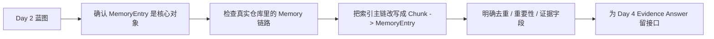

# Day 3：MemoryEntry 正式进入主链

## 今天的总目标

- 把 `MemoryEntry` 从“已经存在但还不够主链化的结果对象”，升级成 `Mneme` 长期记忆系统里的核心资产。
- 把真实仓库里的索引链路重新讲顺：`Document -> Chunk -> MemoryEntry -> 图投影准备 -> 向量检索 / 后续 Evidence`。
- 基于当前代码明确 Day 3 的最小改造落点，让后面的 Evidence、Hybrid Retrieval、GraphRAG 都有统一中心对象。
- 产出 Day 4 可以直接接住的输入：`MemoryEntry` 字段边界、主链阶段、最小返回结果、后续证据化接口预留。

## 今天结束前，你必须拿到什么

- 一张你自己能讲顺的 `MemoryEntry` 入链图，而不是“抽完词条就完了”的零散印象。
- 一份明确写清楚“当前 MemoryEntry 已经在哪、还缺什么”的仓库落点说明。
- 一份 Day 3 最小主链方案：哪些文件先改造，哪些文件先不碰。
- 一份 Day 4 能继续使用的交接结论：回答证据化应该消费哪些 `MemoryEntry` 信息。
- 一份清楚的非目标清单，避免今天误冲进 GraphRAG、Snapshot、Eval。

---

## Day 3 一图总览



---

## 为什么这一天重要

Day 2 已经把蓝图讲清楚了，  
但蓝图要想真正落地，第一件必须做对的事，不是图，不是评测，也不是分层搬家，  
而是先回答：

> 后面所有长期记忆能力，到底围绕哪个核心对象组织？

当前仓库里，`MemoryEntry` 其实已经存在：

- `models/memory.py`
- `schemas/memory_entry.py`
- `services/memory_service.py`
- `pipelines/memory_extract_pipeline.py`
- `routers/memory.py`
- `services/graph_projection_service.py`

但它还没有彻底变成“主链中心”，原因主要有 3 个：

- 它虽然在 `pipelines/document_index_pipeline.py` 里被调用了，但阶段信号和最终结果里还没有把它当成一级产物。
- 当前有 `rebuild_memory_entries_for_document(...)` 和 `run_memory_extract_pipeline(...)` 两条相近路径，说明主链还没有完全统一。
- 后续问答、证据化、检索调试还没有围绕 `MemoryEntry` 定义统一输入输出。

所以 Day 3 的意义不是“再抽一些 memory”，  
而是把下面这句话正式写进系统：

> `Chunk` 仍然重要，但它不再是长期记忆系统唯一的核心资产；`MemoryEntry` 要成为后续召回、证据、图扩展和记忆治理的统一中间层。

---

## Day 3 整体架构

今天你要同时看清楚两条链。

第一条链是当前真实仓库已经在跑的主链：

```text
routers/documents.py
  -> services/document_service.py
  -> tasks/index_tasks.py
  -> pipelines/document_index_pipeline.py
  -> create_chunks(...)
  -> rebuild_memory_entries_for_document(...)
  -> add_documents_to_vector_store_in_batches(...)
```

第二条链是 Day 3 结束后你应该统一理解的主链：

```text
Document
  -> Chunk
  -> MemoryEntry
  -> 去重 / 重要性保留 / 证据文本保留
  -> 图投影准备
  -> Chunk Retrieval / Day 4 Evidence / Day 8 GraphRAG
```

这里最关键的一点是：

> Day 3 不是要消灭 Chunk，而是让 Chunk 成为 `MemoryEntry` 的证据来源和定位来源，而不是系统唯一核心对象。

---

## 今天的边界要讲透

### 今天之后，各层职责应该怎么理解

从 Day 3 开始，和 `MemoryEntry` 最相关的职责边界建议固定成下面这样：

```text
routers/documents.py
  负责接收索引动作，不负责记忆抽取细节

tasks/index_tasks.py
  负责 worker 任务推进和阶段汇报

pipelines/document_index_pipeline.py
  负责主链阶段编排，决定 MemoryEntry 在索引链中的位置

services/memory_service.py
  负责从 chunk 构造 MemoryEntry、组织去重和重建流程

schemas/memory_entry.py
  负责 Day 3 的最小结构化输入输出

models/memory.py
  负责 MemoryEntry 最小持久化字段

services/graph_projection_service.py
  负责把已经稳定下来的 MemoryEntry 投影到图层
```

### 对当前仓库的处理原则

今天不要把仓库想成“还没有 MemoryEntry”，  
而要把它想成“MemoryEntry 已经出现，但还没有被主链正式承认”。

当前这几个事实你要明确看到：

| 真实文件 | 今天该怎么理解 |
|---|---|
| `models/memory.py` | `MemoryEntry` 已经有最小持久化模型 |
| `schemas/memory_entry.py` | 已经有抽取结果和 payload 结构 |
| `services/memory_service.py` | 已经承担 chunk -> entry 的主要逻辑 |
| `pipelines/memory_extract_pipeline.py` | 已经有独立 memory 抽取流水线雏形 |
| `pipelines/document_index_pipeline.py` | 已经在主索引链里调用 memory rebuild，但还不够显式 |
| `routers/memory.py` | 已经有查询和重建入口，说明 memory 不只是内部临时对象 |
| `services/graph_projection_service.py` | 已经说明 memory 会流向图层，而不是只停留在表里 |

### 先不要急着做这些

今天先不要急着做：

- 完整 `CanonicalMemory` 合并体系。
- 完整 `entry_status / conflict_status / canonical_id` 治理模型。
- 先做多跳图推理。
- 先做画像快照。
- 先做 Eval 指标。
- 先做 LlamaIndex 接管。

原因很简单：

> 如果 Day 3 还没把 `MemoryEntry` 明确成主链对象，后面的图、画像、评测都只能挂在半空中。

---

## 第 1 层：Day 3 的本质是什么

Day 3 的本质不是“写一个新的 memory 表”，而是：

```text
把长期记忆系统的核心业务对象
第一次正式拉进主链
```

你今天必须能讲顺这句话：

> `Mneme` 当前已经能把文档切成 chunk，也已经能从 chunk 中抽取 `MemoryEntry`。  
> 但如果索引结果、阶段信号、后续问答接口都还主要围绕 chunk 说话，`MemoryEntry` 就仍然只是附属分析结果。  
> Day 3 要做的，是让系统开始承认：后面很多能力都会消费 `MemoryEntry`，而不只是消费 chunk。

如果这句话你讲不顺，说明 Day 3 还没做完。

---

## 第 2 层：Day 3 的主链一定要从“当前真实代码”出发

今天不要从未来的 `CanonicalMemory` 或 `ProfileSnapshot` 出发，  
一定要从当前仓库已经存在的真实链路出发。

建议你重点顺这条线去看：

```text
tasks/index_tasks.py
  -> pipelines/document_index_pipeline.py
  -> crud.chunk.create_chunks(...)
  -> services.memory_service.rebuild_memory_entries_for_document(...)
  -> schemas/document.DocumentIndexPipelineResult
```

你今天要回答 4 个问题：

1. `MemoryEntry` 现在进入主链的准确位置在哪？
2. 当前索引结果为什么还没有把 memory 当成一级产物？
3. 现有 `memory_extract_pipeline.py` 和 `memory_service.py` 的职责为什么有重叠？
4. Day 4 以后要想做 Evidence，最应该复用 `MemoryEntry` 的哪些字段？

---

## 第 3 层：Day 3 必须先把“最小 MemoryEntry 对象”讲清楚

今天先不要把 `MemoryEntry` 设计得太大，  
而是要从当前真实模型出发，把最小对象稳定下来。

当前 `models/memory.py` 里已经能看见这些核心字段：

```text
id
user_id
knowledge_base_id / knowledge_base_pk
document_id / document_pk
chunk_id
entry_name
entry_type
summary
evidence_text
importance_score
```

这意味着 Day 3 的最小认知应该是：

```text
MemoryEntry
  不是 chunk 的复制品
  而是“从 chunk 中抽取出的、可被检索和组织的记忆单位”
```

你今天一定要明确下面这几个字段为什么重要：

| 字段 | 今天为什么必须理解 |
|---|---|
| `chunk_id` | 说明 MemoryEntry 不是脱离证据来源的悬空对象 |
| `entry_name` | 后续可作为主题、实体或记忆项的统一标题 |
| `entry_type` | 为 Day 5 以后按类型检索、聚合、过滤做准备 |
| `summary` | 是后续回答压缩上下文的重要输入 |
| `evidence_text` | 是 Day 4 证据化回答最直接的基础 |
| `importance_score` | 是后续 rerank、筛选和摘要压缩的基础信号 |

---

## 第 4 层：Day 3 必须先把“当前不足”讲清楚

今天你要敢于明确指出，当前仓库虽然已经有 `MemoryEntry`，  
但还至少有 4 个不足：

### 不足 1：Memory 阶段没有被主链显式命名

`pipelines/document_index_pipeline.py` 里已经调用了 `rebuild_memory_entries_for_document(...)`，  
但阶段信号只有：

```text
parsing
chunking
embedding
vector_upserting
```

这会导致：

- worker 和日志里看不出 memory 是一个独立阶段
- Day 3 的核心动作无法被任务状态准确体现
- 后续调试时很难判断是 chunk、memory 还是 vector 阶段出了问题

### 不足 2：索引结果还没有返回 memory 统计

当前 `schemas/document.py` 里的 `DocumentIndexPipelineResult` 只包含：

```text
chunk_count
vector_batch_count
vector_batch_size
indexed_vector_count
status
```

这说明系统虽然做了 memory rebuild，  
但结果摘要还没有把它当成第一类产物。

### 不足 3：memory 主链还存在两条相近路径

当前仓库既有：

- `services/memory_service.rebuild_memory_entries_for_document(...)`
- `pipelines/memory_extract_pipeline.run_memory_extract_pipeline(...)`

这不是坏事，  
但它说明 Day 3 需要先讲清楚：

> 到底谁是“主链入口”，谁是“可复用的子流程”。

### 不足 4：MemoryEntry 还没有成为回答接口的统一输入

当前 `routers/memory.py` 更多还是“查看 memory library / rebuild”视角，  
它已经证明 memory 是可见资产，  
但还没有让问答主链以它为核心组织 Evidence。

---

## 第 5 层：Day 3 的最小主链应该长什么样

今天建议你把 Day 3 的最小主链固定成下面这条：

```text
Document
  -> Chunk
  -> extract_entries_from_chunks(...)
  -> deduplicate_memory_entries(...)
  -> create_memory_entries(...)
  -> sync_document_memory_projection(...)
  -> MemoryEntry Library / Day 4 Evidence / Day 8 GraphRAG
```

这条链一定要表达两个原则：

### 原则 1：MemoryEntry 必须从 chunk 来

今天不做凭空记忆。  
所有 `MemoryEntry` 都要能回到：

```text
document_id
chunk_id
evidence_text
```

### 原则 2：MemoryEntry 必须能继续被下游消费

今天不要把它只当作“抽取结果表”，  
而要当作下面这些下游能力的共同输入：

```text
Memory Library
Evidence-based Answer
Memory Retrieval
Graph Projection
Profile / Snapshot
```

---

## 第 6 层：结合当前仓库，Day 3 最小落点应该放在哪

今天最值得反复看的真实文件是这些：

| 文件 | 今天为什么要看 |
|---|---|
| `pipelines/document_index_pipeline.py` | 明确 MemoryEntry 在主索引链中的准确位置 |
| `services/memory_service.py` | 明确 chunk -> entry 的核心实现和 rebuild 流程 |
| `pipelines/memory_extract_pipeline.py` | 明确去重、入库、图投影的独立流水线雏形 |
| `schemas/memory_entry.py` | 明确 Day 3 的结构化输入输出 |
| `models/memory.py` | 明确最小持久化字段 |
| `services/graph_projection_service.py` | 明确 entry 不会只停留在表里 |
| `schemas/document.py` | 看当前索引结果为什么还不够 memory-aware |
| `tasks/index_tasks.py` | 明确 worker 阶段如何暴露 memory 过程 |
| `routers/memory.py` | 看现有 memory 资产已经如何被外部查看和重建 |

今天不需要扫全仓，  
只要围绕这几处把“主链化”讲清楚就够了。

---

## 第 7 层：Day 3 最小接口建议长什么样

今天你不一定要一次定完所有接口，  
但建议先把 Day 3 的最小结构化结果统一成下面这种心智：

```text
DocumentIndexPipelineResult
  document_id
  knowledge_base_id
  chunk_count
  deleted_memory_entry_count
  memory_entry_count
  indexed_vector_count
  status
```

以及：

```text
MemoryEntry
  id
  entry_name
  entry_type
  summary
  evidence_text
  importance_score
  chunk_id
```

这样做的意义是：

- 让索引主链第一次正式承认 memory 产出
- 让 Day 4 可以直接消费 `summary + evidence_text`
- 让 Day 5 以后可以消费 `entry_type + importance_score`
- 让 Day 8 以后可以消费 `entry_name + document_id + knowledge_base_id`

---

## 第 8 层：Day 3 不建议做什么

今天不建议做：

- 直接引入 `CanonicalMemory`。
- 直接设计完整冲突检测。
- 直接做 snapshot / timeline。
- 直接把 `MemoryEntry` 送进复杂图推理。
- 直接重写 `query_service.py`。
- 直接把所有 memory 逻辑再复制一份到新目录。

今天真正要避免的坑只有一句话：

> 用“提前做后面几天的事情”，替代“先把 MemoryEntry 主链化”的工作。

---

## 上午学习：9:00 - 12:00

## 09:00 - 09:50：把 Day 2 的蓝图翻译成 Day 3 的对象语言

今天第一段不要急着写实现，  
先把 Day 2 的总蓝图压缩成一句话：

> 长期记忆系统后面的很多能力，必须围绕 `MemoryEntry` 这个中间对象组织，而不能只围绕 chunk 组织。

### 你至少要能回答这两个问题

1. 为什么 `MemoryEntry` 不是“从 chunk 额外抽出来的一份装饰信息”？
2. 为什么后面的 Evidence、GraphRAG、Snapshot 都需要它先入链？

---

## 09:50 - 10:40：沿真实链路看 MemoryEntry 现在已经做到哪

建议你顺着这条链去读：

```text
tasks/index_tasks.py
-> pipelines/document_index_pipeline.py
-> services/memory_service.py
-> schemas/memory_entry.py
-> models/memory.py
-> services/graph_projection_service.py
```

### 今天你要特别记住 4 个事实

- `MemoryEntry` 已经不是空设计，模型和 schema 都存在。
- 主索引链已经会触发 memory rebuild。
- 图投影已经会消费 memory，而不是只消费 document。
- 结果摘要和阶段命名还没有把它完全扶正。

---

## 10:40 - 11:30：把 Day 3 的边界和非目标钉死

### 今天必须明确要做

- 明确 `MemoryEntry` 的最小字段边界。
- 明确它进入索引主链的准确位置。
- 明确 Day 3 的最小去重和重要性处理。
- 明确 Day 4 证据化回答会消费哪些字段。

### 今天明确不做

- 不做完整记忆治理。
- 不做完整多路检索。
- 不做完整图谱问答。
- 不做完整评测体系。

### 这一段最重要的结论

你要得到一句稳定的话：

> Day 3 先解决“记忆对象有没有真正入链”，不是先解决“长期记忆系统所有后续能力”。

---

## 11:30 - 12:00：先决定今天怎么验收

### Day 3 最直接的验收方式

- 你能自己画出 `Document -> Chunk -> MemoryEntry` 链路。
- 你能指出当前主链里 memory 已经出现在哪些真实文件。
- 你能说出当前为什么还不算完全主链化。
- 你能说出 Day 4 应该消费哪些 `MemoryEntry` 字段。

如果你说不清楚，说明今天还没完成。

---

## 下午编码：14:00 - 18:00

## 14:00 - 15:10：梳理 `services/memory_service.py` 的 Day 3 主体职责

这一段的目标不是重写整个 memory 模块，  
而是把当前已经存在的函数，收拢成“MemoryEntry 是主链对象”的讲法。

### 今天建议重点改造

- `services/memory_service.py`
- `pipelines/document_index_pipeline.py`
- `schemas/document.py`

### 围绕现有业务文件的练手骨架版

```python
from langchain_core.documents import Document as LCDocument
from sqlalchemy.ext.asyncio import AsyncSession


class DocumentMemoryEntryBuilder:
    def __init__(self, db: AsyncSession, *, document, knowledge_base, user) -> None:
        # 你要做的事情：
        # 1. 保存 db / document / knowledge_base / user
        # 2. 准备重建 MemoryEntry 所需的上下文
        # 3. 不要在初始化里做重 IO
        raise NotImplementedError

    def build_chunk_documents(self, chunk_rows: list) -> list[LCDocument]:
        # 你要做的事情：
        # 1. 把 chunk rows 转成带 metadata 的 LCDocument
        # 2. metadata 至少要保留 document_id、chunk_id、knowledge_base_id、user_id
        # 3. 不要在这里发起 LLM 调用
        raise NotImplementedError

    async def extract_entries(self, chunk_docs: list[LCDocument]) -> list[dict]:
        # 你要做的事情：
        # 1. 调用现有 memory 抽取逻辑
        # 2. 返回原始 entries
        # 3. 不要在这里直接入库
        raise NotImplementedError

    def deduplicate_entries(self, entries: list[dict]) -> list[dict]:
        # 你要做的事情：
        # 1. 对 entry_name / entry_type / chunk_id 做最小去重
        # 2. 保留证据字段和重要性分数
        # 3. 不要在这里做跨文档 canonical merge
        raise NotImplementedError

    async def persist_entries(self, entries: list[dict]) -> list[object]:
        # 你要做的事情：
        # 1. 把 entries 持久化成 MemoryEntry
        # 2. 返回持久化后的结果
        # 3. 空列表时要安全返回
        raise NotImplementedError

    async def sync_projection(self, memory_entries: list[object]) -> None:
        # 你要做的事情：
        # 1. 把 document + memory_entries 同步到图投影层
        # 2. 空列表也要允许同步，保证图层不会保留陈旧节点
        raise NotImplementedError

    async def rebuild_for_document(self, chunk_rows: list) -> dict[str, int]:
        # 你要做的事情：
        # 1. 删除旧 memory entries
        # 2. 生成 chunk docs
        # 3. 抽取、去重、入库、同步投影
        # 4. 返回 chunk_count / deleted_entry_count / entry_count
        raise NotImplementedError
```

这个骨架不是要求你新建 `scripts/company_target/day3_memory_entry_builder.py`，  
而是帮助你把下面这些现有函数的职责看顺：

- `services/memory_service.build_chunk_documents_from_rows(...)`
- `services/memory_service.extract_entries_from_chunks(...)`
- `services/memory_service.rebuild_memory_entries_for_document(...)`
- `services.graph_projection_service.sync_document_memory_projection(...)`

### 围绕现有业务文件的参考答案

```python
from langchain_core.documents import Document as LCDocument
from sqlalchemy.ext.asyncio import AsyncSession

from crud.memory_entry import create_memory_entries, delete_memory_entries_by_document_id
from services.graph_projection_service import sync_document_memory_projection
from services.memory_service import extract_entries_from_chunks


class DocumentMemoryEntryBuilder:
    def __init__(self, db: AsyncSession, *, document, knowledge_base, user) -> None:
        self.db = db
        self.document = document
        self.knowledge_base = knowledge_base
        self.user = user

    def build_chunk_documents(self, chunk_rows: list) -> list[LCDocument]:
        docs: list[LCDocument] = []
        for chunk in chunk_rows:
            docs.append(
                LCDocument(
                    page_content=chunk.content,
                    metadata={
                        "user_id": self.document.user_id,
                        "knowledge_base_id": self.document.knowledge_base_id,
                        "knowledge_base_pk": self.document.knowledge_base_pk,
                        "document_id": self.document.id,
                        "document_pk": self.document.pk,
                        "chunk_id": chunk.id,
                        "chunk_index": chunk.chunk_index,
                        "page_no": chunk.page_no,
                    },
                )
            )
        return docs

    async def extract_entries(self, chunk_docs: list[LCDocument]) -> list[dict]:
        return await extract_entries_from_chunks(chunk_docs)

    def deduplicate_entries(self, entries: list[dict]) -> list[dict]:
        seen: set[tuple[str | None, str | None, str | None]] = set()
        result: list[dict] = []
        for item in entries:
            key = (
                item.get("chunk_id"),
                item.get("entry_name"),
                item.get("entry_type"),
            )
            if key in seen:
                continue
            seen.add(key)
            result.append(item)
        return result

    async def persist_entries(self, entries: list[dict]) -> list[object]:
        if not entries:
            return []
        return await create_memory_entries(self.db, entries=entries)

    async def sync_projection(self, memory_entries: list[object]) -> None:
        await sync_document_memory_projection(
            db=self.db,
            user=self.user,
            knowledge_base=self.knowledge_base,
            document=self.document,
            memory_entries=memory_entries,
        )

    async def rebuild_for_document(self, chunk_rows: list) -> dict[str, int]:
        deleted_entry_count = await delete_memory_entries_by_document_id(
            self.db,
            document_id=self.document.id,
        )
        chunk_docs = self.build_chunk_documents(chunk_rows)
        raw_entries = await self.extract_entries(chunk_docs)
        deduped_entries = self.deduplicate_entries(raw_entries)
        persisted_entries = await self.persist_entries(deduped_entries)
        await self.sync_projection(persisted_entries)
        return {
            "chunk_count": len(chunk_docs),
            "deleted_entry_count": deleted_entry_count,
            "entry_count": len(persisted_entries),
        }
```

### 按你当前仓库里的原文件，`services/memory_service.py` 具体应该改哪几处

文件位置：

- `services/memory_service.py`

你当前文件里已经有这些现成函数：

- `build_chunk_documents_from_rows(...)`
- `extract_entries_from_chunks(...)`
- `rebuild_memory_entries_for_document(...)`

所以 Day 3 不建议你再新建一个 `DocumentMemoryEntryBuilder` 类，  
而是直接围绕现有函数做 2 处增量改造。

#### 1. 在 `services/memory_service.py` 里补一个最小去重函数

你现在文件里已经有：

```python
async def extract_entries_from_chunks(chunk_docs: list[LCDocument]) -> list[dict]:
    ...
    return entries
```

建议就在这个函数后面，插入一个新函数：

```python
def deduplicate_memory_entries(entries: list[dict]) -> list[dict]:
    seen: set[tuple[str | None, str | None, str | None]] = set()
    result: list[dict] = []

    for item in entries:
        key = (
            item.get("chunk_id"),
            item.get("entry_name"),
            item.get("entry_type"),
        )
        if key in seen:
            continue
        seen.add(key)
        result.append(item)

    return result
```

这里的插入位置建议很简单：

- 放在 `extract_entries_from_chunks(...)` 后面
- 放在 `rebuild_memory_entries_for_document(...)` 前面

这样后面重建函数可以直接调用，不会打乱你当前文件结构。

#### 2. 在 `rebuild_memory_entries_for_document(...)` 里把“抽取后直接入库”改成“先去重再入库”

你当前函数里有这一段：

```python
    chunk_docs = build_chunk_documents_from_rows(
        document=document,
        chunk_rows=chunk_rows,
    )
    entries = await extract_entries_from_chunks(chunk_docs)
    persisted_entries = []
    if entries:
        persisted_entries = await create_memory_entries(db, entries=entries)
```

这里建议改成：

```python
    chunk_docs = build_chunk_documents_from_rows(
        document=document,
        chunk_rows=chunk_rows,
    )
    entries = await extract_entries_from_chunks(chunk_docs)
    deduped_entries = deduplicate_memory_entries(entries)
    persisted_entries = []
    if deduped_entries:
        persisted_entries = await create_memory_entries(db, entries=deduped_entries)
```

也就是说：

- `entries = await extract_entries_from_chunks(chunk_docs)` 这一行保留
- 紧跟着新增一行：`deduped_entries = deduplicate_memory_entries(entries)`
- 把 `if entries:` 改成 `if deduped_entries:`
- 把 `create_memory_entries(..., entries=entries)` 改成 `entries=deduped_entries`

#### 3. 如果你想让日志更适合 Day 3 排查，可以顺手补一条 memory 重建统计日志

你当前函数末尾已经有：

```python
    log_event(
        "memory_service",
        "info",
        "memory.rebuild_document.completed",
        document_id=document.id,
        chunk_count=len(chunk_docs),
        deleted_entry_count=deleted_entry_count,
        entry_count=len(persisted_entries),
    )
```

如果你加了最小去重，建议这里多带一个 `raw_entry_count`，改成：

```python
    log_event(
        "memory_service",
        "info",
        "memory.rebuild_document.completed",
        document_id=document.id,
        chunk_count=len(chunk_docs),
        raw_entry_count=len(entries),
        deleted_entry_count=deleted_entry_count,
        entry_count=len(persisted_entries),
    )
```

这不是强制必须，  
但这样 Day 3 你就能直接看到：

- LLM 一共抽了多少条
- 去重后真正落库了多少条

### 这一步真正要得到什么

不是再发明一套 memory 模块，  
而是让你明确：

> Day 3 的核心动作其实是把 `build chunk docs -> extract -> dedup -> persist -> sync projection` 这一条链讲顺。

---

## 15:10 - 16:20：让 `pipelines/document_index_pipeline.py` 正式承认 memory 阶段

这一段的目标是让主链编排和返回结果都开始“看得见 `MemoryEntry`”。

### 今天建议重点改造

- `pipelines/document_index_pipeline.py`
- `schemas/document.py`
- 可选联动：`tasks/index_tasks.py`

### `pipelines/document_index_pipeline.py` / `schemas/document.py` 练手骨架版

```python
from pydantic import BaseModel


class DocumentIndexPipelineResult(BaseModel):
    document_id: str
    knowledge_base_id: str
    chunk_count: int
    deleted_memory_entry_count: int
    memory_entry_count: int
    vector_batch_count: int
    vector_batch_size: int
    indexed_vector_count: int
    status: str


async def run_document_index_pipeline(
    db,
    *,
    document,
    on_stage_change=None,
):
    # 你要做的事情：
    # 1. 在 chunking 之后显式发出 memory_extracting 阶段
    # 2. 调用 rebuild_memory_entries_for_document(...) 并接住统计结果
    # 3. 保留原有 embedding / vector_upserting 阶段
    # 4. 返回包含 memory 统计的结果对象
    raise NotImplementedError
```

### `pipelines/document_index_pipeline.py` / `schemas/document.py` 参考答案

```python
from pydantic import BaseModel

from services.memory_service import rebuild_memory_entries_for_document


class DocumentIndexPipelineResult(BaseModel):
    document_id: str
    knowledge_base_id: str
    chunk_count: int
    deleted_memory_entry_count: int
    memory_entry_count: int
    vector_batch_count: int
    vector_batch_size: int
    indexed_vector_count: int
    status: str


async def run_document_index_pipeline(
    db,
    *,
    document,
    on_stage_change=None,
):
    await emit_stage("parsing", on_stage_change=on_stage_change)
    docs = await load_langchain_documents(...)

    await emit_stage("chunking", on_stage_change=on_stage_change)
    chunk_docs = await split_documents(document_id=document.id, documents=docs)
    await create_chunks(
        db,
        document_id=document.id,
        document_pk=document.pk,
        chunk_docs=chunk_docs,
    )

    await emit_stage("memory_extracting", on_stage_change=on_stage_change)
    memory_result = await rebuild_memory_entries_for_document(
        db,
        document=document,
    )

    await emit_stage("embedding", on_stage_change=on_stage_change)
    await emit_stage("vector_upserting", on_stage_change=on_stage_change)
    vector_result = await add_documents_to_vector_store_in_batches(chunk_docs=chunk_docs, batch_size=...)

    return DocumentIndexPipelineResult(
        document_id=document.id,
        knowledge_base_id=document.knowledge_base_id,
        chunk_count=len(chunk_docs),
        deleted_memory_entry_count=memory_result["deleted_entry_count"],
        memory_entry_count=memory_result["entry_count"],
        vector_batch_count=vector_result["batch_count"],
        vector_batch_size=vector_result["batch_size"],
        indexed_vector_count=vector_result["total_count"],
        status="indexed",
    )
```

### 按你当前仓库里的原文件，具体应该改哪几处

这里不要按“新写一个完整文件”的思路改，  
而是直接在现有文件上做 3 处增量修改。

#### 1. 改 `pipelines/document_index_pipeline.py`

文件位置：

- `pipelines/document_index_pipeline.py`

你现在文件里已经有这一段：

```python
    await create_chunks(
        db,
        document_id=doc.id,
        document_pk=doc.pk,
        chunk_docs=chunk_docs,
    )

    await rebuild_memory_entries_for_document(
        db,
        document=doc,
    )

    await emit_stage("embedding", on_stage_change=on_stage_change)
```

这里要改成：

```python
    await create_chunks(
        db,
        document_id=doc.id,
        document_pk=doc.pk,
        chunk_docs=chunk_docs,
    )

    await emit_stage("memory_extracting", on_stage_change=on_stage_change)
    memory_result = await rebuild_memory_entries_for_document(
        db,
        document=doc,
    )

    await emit_stage("embedding", on_stage_change=on_stage_change)
```

也就是说：

- 在 `await rebuild_memory_entries_for_document(...)` 前面，新增一行 `await emit_stage("memory_extracting", ...)`
- 把原来“直接 await”的写法，改成 `memory_result = await ...`

#### 2. 继续改 `pipelines/document_index_pipeline.py` 的返回结果

你现在文件末尾的返回大致是：

```python
    return DocumentIndexPipelineResult(
        document_id=doc.id,
        knowledge_base_id=doc.knowledge_base_id,
        chunk_count=len(chunk_docs),
        vector_batch_count=vector_result["batch_count"],
        vector_batch_size=vector_result["batch_size"],
        indexed_vector_count=vector_result["total_count"],
        status="indexed",
    )
```

这里要补成：

```python
    return DocumentIndexPipelineResult(
        document_id=doc.id,
        knowledge_base_id=doc.knowledge_base_id,
        chunk_count=len(chunk_docs),
        deleted_memory_entry_count=memory_result["deleted_entry_count"],
        memory_entry_count=memory_result["entry_count"],
        vector_batch_count=vector_result["batch_count"],
        vector_batch_size=vector_result["batch_size"],
        indexed_vector_count=vector_result["total_count"],
        status="indexed",
    )
```

也就是说：

- 在 `chunk_count=len(chunk_docs),` 后面插入
  - `deleted_memory_entry_count=memory_result["deleted_entry_count"],`
  - `memory_entry_count=memory_result["entry_count"],`

#### 3. 检查 `schemas/document.py`，不要重复改已经存在的字段

你当前仓库里的 `schemas/document.py` 已经有：

```python
class DocumentIndexPipelineResult(BaseModel):
    document_id: str
    knowledge_base_id: str
    chunk_count: int
    deleted_memory_entry_count: int
    memory_entry_count: int
    vector_batch_count: int
    vector_batch_size: int
    indexed_vector_count: int
    status: str
```

所以这份文件在你现在这个分支里：

- 不需要再新增字段
- 只需要确认字段名和 `memory_result["deleted_entry_count"]`、`memory_result["entry_count"]` 对得上

### 如果你真的要加 `memory_extracting` 阶段，别漏掉这一处联动

文件位置：

- `services/task_state_service.py`

你当前的 `ALLOWED_TASK_TRANSITIONS` 大致是：

```python
ALLOWED_TASK_TRANSITIONS = {
    "queued": ["parsing", "failed", "canceled"],
    "parsing": ["chunking", "failed"],
    "chunking": ["embedding", "failed"],
    "embedding": ["vector_upserting", "failed"],
    "vector_upserting": ["completed", "failed"],
}
```

如果 Day 3 要把 `memory_extracting` 真的发到 worker 状态里，  
这里也要一起改成：

```python
ALLOWED_TASK_TRANSITIONS = {
    "queued": ["parsing", "failed", "canceled"],
    "parsing": ["chunking", "failed"],
    "chunking": ["memory_extracting", "failed"],
    "memory_extracting": ["embedding", "failed"],
    "embedding": ["vector_upserting", "failed"],
    "vector_upserting": ["completed", "failed"],
}
```

不改这一处的话，`tasks/index_tasks.py` 里的：

```python
await transition_task_status(db, task_id=task_id, to_status=stage)
```

在收到 `memory_extracting` 时会直接报非法状态迁移。

### `tasks/index_tasks.py` 也建议一起补这两处

文件位置：

- `tasks/index_tasks.py`

#### 1. `report_stage(...)` 本身不用大改

你当前已经有：

```python
            async def report_stage(stage: str) -> None:
                app_logger.bind(module="index_task").info(
                    f"worker task stage task_id={task_id} document_id={document_id} stage={stage}"
                )
                await transition_task_status(db,task_id=task_id,to_status=stage,)
```

这一段本身已经能接住 `memory_extracting`，  
前提只是上面说的 `ALLOWED_TASK_TRANSITIONS` 要先补上。

所以这里你不用重写逻辑，  
只要确认 `stage` 透传就够了。

#### 2. 把任务完成日志补上 memory 统计

你当前成功日志大致是：

```python
            app_logger.bind(module="index_task").info(
                f"index task completed task_id={task_id} document_id={document_id} "
                f"chunk_count={result.chunk_count} vector_batch_count={result.vector_batch_count} "
                f"vector_batch_size={result.vector_batch_size}"
            )
```

建议直接改成：

```python
            app_logger.bind(module="index_task").info(
                f"index task completed task_id={task_id} document_id={document_id} "
                f"chunk_count={result.chunk_count} "
                f"deleted_memory_entry_count={result.deleted_memory_entry_count} "
                f"memory_entry_count={result.memory_entry_count} "
                f"vector_batch_count={result.vector_batch_count} "
                f"vector_batch_size={result.vector_batch_size}"
            )
```

这样你在 worker 日志里能直接看到：

- chunk 数
- 清掉了多少旧 memory
- 新落了多少 memory
- 向量批次信息

### 这一步最重要的价值

不是多加两个字段那么简单，  
而是让主链第一次正式变成：

```text
索引完成
= chunk 完成
+ memory 完成
+ vector 完成
```

只有这样，Day 3 才算真的把 `MemoryEntry` 扶正了。

---

## 16:20 - 17:10：整理 Day 4 的证据化交接输入

这一段的目标不是直接做回答生成，  
而是明确 Day 4 会消费哪些 `MemoryEntry` 信息。

### Day 4 最应该接住的字段

- `entry_name`
- `summary`
- `evidence_text`
- `chunk_id`
- `document_id`
- `importance_score`

### 你今天至少要写清楚这 4 点

- 为什么 `summary` 适合做回答压缩上下文。
- 为什么 `evidence_text` 适合做引用和证据绑定。
- 为什么 `chunk_id` / `document_id` 能保证可追溯。
- 为什么 `importance_score` 可以作为 Day 5 以后 rerank 的基础信号。

---

## 17:10 - 18:00：给 Day 3 留一份最小交付说明

今天结束前，建议你至少整理出下面这张交付链：

```text
当前真实 MemoryEntry 文件落点
-> 主索引链里 MemoryEntry 的准确位置
-> 最小字段集合
-> 最小去重策略
-> 最小结果摘要
-> Day 4 证据化消费字段
```

只要这条链写清楚，  
Day 4 就可以直接往 Evidence Answer 继续推进。

---

## 晚上复盘：20:00 - 21:00

今晚不要泛泛复述今天做了什么，  
而要回答下面这些问题：

1. 当前仓库里 `MemoryEntry` 已经出现在哪些真实文件？
2. 为什么说它“已经存在”但“还没完全主链化”？
3. `Document -> Chunk -> MemoryEntry` 这条链里，哪一步是 Day 3 的真正中心？
4. 为什么今天不该提前跳去做 `CanonicalMemory`？
5. Day 4 的证据化回答最应该消费 `MemoryEntry` 的哪些字段？

如果其中有两题答不顺，说明今天还没真正收口。

---

## 今日验收标准

- 你能清楚讲出 Day 3 的核心不是“再抽取一次”，而是“让 MemoryEntry 成为主链对象”。
- 你能指出 `pipelines/document_index_pipeline.py`、`services/memory_service.py`、`schemas/memory_entry.py`、`models/memory.py` 之间的关系。
- 你能说出当前主链为什么还不算 memory-aware。
- 你能给出一版最小结果结构，让索引结果正式包含 memory 统计。
- 你能给 Day 4 留下一份可直接消费的证据字段说明。

---

## 今天最容易踩的坑

### 坑 1：把 Day 3 理解成“Memory 表已经有了，所以今天没什么可做”

问题：

看到 `models/memory.py`、`routers/memory.py`、`services/memory_service.py` 已经存在，  
就误以为 Day 3 已经天然完成。

规避建议：

看主链，而不是只看有没有文件。  
今天真正的问题是：

> `MemoryEntry` 有没有被主链、阶段和结果摘要正式承认。

### 坑 2：今天就急着上完整长期记忆治理

问题：

一看到 memory，就想同时做去重、合并、冲突、时间线、画像。

规避建议：

今天先只做最小对象入链。  
Day 12 以后再处理更重的治理层。

### 坑 3：把 Day 3 做成另一条平行流水线

问题：

为了让 memory 更“独立”，又在主链外复制一条新逻辑。

规避建议：

今天要做的是：

```text
统一入口
统一阶段
统一结果摘要
```

不是再造第三条 memory 路。

### 坑 4：今天只讲抽取，不讲下游消费

问题：

只说“能从 chunk 抽出 entry”，但不说 Day 4、Day 5、Day 8 怎么消费它。

规避建议：

今天一定要同时说明：

- Day 4 消费 `summary + evidence_text`
- Day 5 消费 `entry_type + importance_score`
- Day 8 消费 `entry_name + document_id`

### 坑 5：今天继续只按 chunk 结果验收

问题：

验收时仍然只看 chunk 数和向量数。

规避建议：

今天至少把：

- `deleted_memory_entry_count`
- `memory_entry_count`

也纳入 Day 3 的结果视角。

---

## 给明天的交接提示

Day 4 要接住的不是“继续讨论 MemoryEntry 是什么”，  
而是直接利用 Day 3 留下的 memory 资产，进入回答证据化。

明天开始之前，你应该已经具备这 5 份输入：

```text
MemoryEntry 的真实文件落点
-> MemoryEntry 在主索引链中的准确位置
-> 最小字段集合
-> 最小结果摘要
-> 可供回答引用的 evidence_text / chunk_id / document_id
```

到了 Day 4，就不要再反复讨论“到底要不要以 MemoryEntry 为中心”，  
而是直接进入：

```text
MemoryEntry
-> 证据字段绑定
-> answer / citation / confidence / uncertainty
-> Evidence-based Answer
```

这就是 Day 3 最终要交给 Day 4 的东西。
