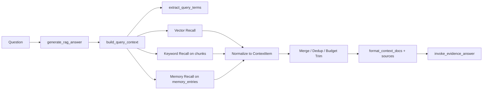

# Day 5：Hybrid Search 第一版 + 统一召回对象收口

## 今天的总目标

今天不是继续给回答结构加字段，  
而是基于 Day 4 已经稳定下来的 `answer / sources / citations / confidence / uncertainty` 协议，  
正式把检索层从“单路向量召回”升级成“`vector + keyword + memory` 三路召回”的第一版。

你今天要做成的，不是一个完美检索系统，  
而是一个**在当前仓库上真实可落地、可本地验证、不会破坏 Day 4 回答协议**的最小 Hybrid Search。

---

## 今天结束前，你必须拿到什么

今天结束前，你至少要拿到这 6 个结果：

1. 你能明确说出：Day 5 优化的是“召回质量”，不是“回答格式”。
2. `services/context_service.py` 不再只会做 vector recall，而是能统一编排 `vector / keyword / memory` 三路召回。
3. 你有一个统一的 `ContextItem` 结果结构，用来承接不同召回来源。
4. `crud/chunk.py` 和 `crud/memory_entry.py` 至少各有一条最小可用的关键词召回能力。
5. `services/query_service.py`、`routers/chat.py`、`routers/companion.py` 能把 `db` 会话穿到检索链路里，但 Day 4 的最终返回结构不变。
6. 你能本地验证：对于“人名 / 日期 / 标题 / 专有名词”类问题，系统至少有机会不只依赖 embedding。

---

## Day 5 一图总览

```text
Question
-> services/query_service.generate_rag_answer(...)
-> services/context_service.build_query_context(...)
-> Query Term Normalize
-> Vector Recall
-> Keyword Recall (chunks)
-> Memory Recall (memory_entries)
-> ContextItem Merge / Dedup / Budget Trim
-> Prompt Context + Sources
-> Evidence Answer
```

如果你想得更具体一点，Day 5 真正做的是：

```text
原来：
Question
-> Vector Recall
-> Prompt
-> Answer

现在：
Question
-> Vector Recall
-> Keyword Recall
-> Memory Recall
-> 统一成 ContextItem
-> 合并去重
-> 仍然输出 Day 4 的 Evidence Answer
```

---

## 为什么这一天重要

因为 Day 4 已经把“回答是否可追溯”这件事站住了。  
一旦回答协议站住，下一步最应该优化的就不再是“模型怎么说”，而是“模型到底拿到了什么证据”。

在当前系统里，`services/context_service.py` 的主链还是：

```text
问题
-> 相似度检索
-> 去重
-> 相邻 chunk 合并
-> budget 裁剪
-> prompt context
```

这条链路对“语义相近”的问题有效，  
但它天然会在下面这些查询上掉链子：

- 人名、组织名、项目名
- 日期、页码、编号、标题
- 用户明确提到的原文术语
- 明明在 `memory_entries` 里已经被抽出来了，但原 chunk 向量排序不够靠前

所以 Day 5 的意义不是“再堆一种技术”，  
而是正式承认一件事：

> 长期记忆系统的检索入口，不能只靠单路 embedding；  
> 它至少需要 literal match 和 memory asset 参与召回。

---

## Day 5 整体架构



今天之后，检索层的核心认识应该是：

- `query_service` 负责回答编排，不负责写 SQL。
- `context_service` 负责检索编排，不负责最终回答生成。
- `crud/chunk.py` 负责 chunk 关键词召回。
- `crud/memory_entry.py` 负责 memory 关键词召回。
- `schemas/chat.py` 负责统一定义召回对象和对外返回对象。
- `routers/chat.py` / `routers/companion.py` 负责把 `db` 会话送进来，但不承接检索细节。

---

## 今天的边界要讲透

### 今天之后，各层职责应该怎么理解

| 层 | 今天之后负责什么 | 今天不负责什么 |
| --- | --- | --- |
| `routers/chat.py` | 收请求、校验知识库归属、传 `db` | 不拼检索逻辑 |
| `routers/companion.py` | 复用主问答链路、保持兼容 | 不单独发明一套召回 |
| `services/query_service.py` | 编排 “检索上下文 -> 证据回答” | 不直接写 chunk / memory SQL |
| `services/context_service.py` | 三路召回、合并、去重、裁剪、格式化 | 不做最终 LLM 回答收口 |
| `crud/chunk.py` | 基于 chunks 表做最小关键词召回 | 不做复杂检索策略 |
| `crud/memory_entry.py` | 基于 memory_entries 表做最小召回 | 不做图检索、不做聚类 |
| `schemas/chat.py` | 定义 `ContextItem` 和问答返回结构 | 不放 service 逻辑 |

### 对当前仓库的处理原则

今天一定要坚持这 6 条原则：

1. **外部返回协议不改。**  
   `ChatQueryData` 继续保持 Day 4 的字段，不要今天又改成另一套回答结构。

2. **先把 `db` 会话打通，再谈 SQL 检索。**  
   当前 `generate_rag_answer(...) -> build_query_context(...)` 这条链路拿不到 `AsyncSession`，Day 5 必须先承认这个现实。

3. **关键词召回先用数据库可验证的最小方案。**  
   第一版直接在 `chunks.content`、`memory_entries.entry_name / summary / evidence_text` 上做 SQL 条件检索即可，不要跳到 Elasticsearch、Whoosh、BM25 服务化。

4. **Memory Recall 不是直接替换 source。**  
   Memory 召回的作用是“把更可能相关的资产提上来”，不是把 `sources` 改成另一种协议。

5. **`source_id` 只能在一个地方稳定生成。**  
   不要让 prompt context 和 API sources 各自重新编号。

6. **日志里要能看出三路召回分别召回了多少。**  
   否则 Day 5 做完以后你根本不知道问题出在 vector、keyword，还是 memory。

### 先不要急着做这些

今天明确不做下面这些事情：

- 不做 Graph Recall
- 不做 rerank 学习排序
- 不做 query rewrite / query expansion
- 不做多轮检索代理
- 不做 chunk 切分策略重写
- 不做 `citations` 协议再扩展
- 不把 companion 改成另一套检索链

今天的关键词只有 8 个字：

> 三路召回，统一收口

---

## 第 1 层：Day 5 的本质是什么

Day 5 的本质不是“让召回结果变多”。  
Day 5 的本质是：

> 让系统在“语义相似”之外，开始具备“字面命中”和“记忆命中”的能力。

你如果只把今天理解成“把 top_k 从 4 改成 8”，  
那你就完全走偏了。

因为 Day 5 要解决的不是数量问题，  
而是召回维度问题：

```text
原来只有：
语义近

今天至少变成：
语义近
+ 字面匹配
+ memory 资产命中
```

---

## 第 2 层：Day 5 的主链一定要从“当前真实问答代码”出发

今天不要脱离仓库谈架构。  
你必须从当前真实代码出发去看：

```text
routers/chat.py
-> services/query_service.generate_rag_answer(...)
-> services/context_service.build_query_context(...)
-> clients/vector_store_client.similarity_search_with_score_resilient(...)
```

这意味着一件事：

当前系统真正已经存在的召回入口，只有 vector recall。  
所以 Day 5 不是推倒重写检索层，  
而是在这条现有链路上，把下面两类能力补进去：

```text
build_query_context(...)
-> vector recall
-> chunk keyword recall
-> memory keyword recall
-> merge
-> sources / context_text
```

这就是 Day 5 的最小升级路径。

---

## 第 3 层：为什么“只靠向量检索”对很多问题天然不够

下面这类问题，单纯 embedding 很容易失手：

1. 用户问一个非常具体的人名  
   例如：“王某某提到的目标学校是什么？”

2. 用户问一个日期或数字  
   例如：“简历里 2023 年 8 月做了什么项目？”

3. 用户问一个标题或专有名词  
   例如：“《XX 方案》里怎么定义增长飞轮？”

4. 用户问 MemoryEntry 明明抽过的主题  
   例如：“他反复提到的阻碍是什么？”

对于这四类问题，embedding 的问题不是“完全没用”，  
而是它没有把“字面命中”和“已抽取记忆资产”作为一级召回信号。

所以 Day 5 的最小判断标准不是：

> vector recall 还在不在

而是：

> 当 vector recall 不够时，系统有没有第二条和第三条可解释的补充召回路径

---

## 第 4 层：Day 5 必须先把“最小三路召回”讲清楚

今天的三路召回，不是三套平行大系统，  
而是三种最小信号源：

### 路 1：Vector Recall

来源：

- `clients/vector_store_client.py`
- `services/context_service.retrieve_documents_with_scores(...)`

职责：

- 继续承接语义相似召回
- 继续作为默认主召回链

### 路 2：Keyword Recall

来源：

- `crud/chunk.py`
- `models/chunk.py`

职责：

- 让标题、术语、日期、编号、人名这类 literal match 问题有补救手段
- 第一版直接在 `chunks.content` 上做最小 SQL 召回

### 路 3：Memory Recall

来源：

- `crud/memory_entry.py`
- `models/memory.py`

职责：

- 利用 Day 3 已经进入主链的 `MemoryEntry`
- 让 `entry_name / summary / evidence_text / importance_score` 真正参与问答前的检索

今天最重要的认知变化是：

```text
MemoryEntry 不只是分析视图资产
-> 它开始变成问答检索资产
```

---

## 第 5 层：Day 5 的统一召回对象应该长什么样

今天必须承认：  
不同召回来源的返回结构天然不一样。

- vector recall 返回的是 `LCDocument + score`
- chunk keyword recall 返回的是 `Chunk` 行
- memory recall 返回的是 `MemoryEntry` 行

如果你不先统一成一个内部对象，  
后面去重、裁剪、sources 构造、prompt 格式化都会越来越乱。

所以今天建议在 `schemas/chat.py` 里新增一个内部使用的 `ContextItem`：

```python
class ContextItem(BaseModel):
    recall_type: str
    score: float
    knowledge_base_id: str | None = None
    document_id: str
    chunk_id: str
    page_no: int | None = None
    text: str
    source_chunk_ids: list[str] = Field(default_factory=list)
    source_page_nos: list[int] = Field(default_factory=list)
    merged_chunk_count: int = 1
    memory_entry_id: str | None = None
    entry_name: str | None = None
    matched_terms: list[str] = Field(default_factory=list)
```

这个对象的关键不是字段多少，  
而是它表达了一个原则：

> 不管召回来源是什么，进入 merge 阶段以后，大家都说同一种语言。

---

## 第 6 层：结合当前仓库，Day 5 最小落点应该放在哪

今天建议的最小文件落点是这 7 个：

- `schemas/chat.py`
- `crud/chunk.py`
- `crud/memory_entry.py`
- `services/context_service.py`
- `services/query_service.py`
- `routers/chat.py`
- `routers/companion.py`

其中每个文件的职责建议如下：

| 文件 | 今天建议承担的最小职责 |
| --- | --- |
| `schemas/chat.py` | 增加 `ContextItem` |
| `crud/chunk.py` | 增加 chunk 关键词召回 |
| `crud/memory_entry.py` | 增加 memory 关键词召回 |
| `services/context_service.py` | 召回编排、统一结构、合并去重、最终 sources/context 输出 |
| `services/query_service.py` | 把 `db` 透传到检索层 |
| `routers/chat.py` | 调用 `generate_rag_answer(..., db=db)` |
| `routers/companion.py` | 调用 `generate_rag_answer(..., db=db)` |

注意：

`utils/prompt_builder.py` 今天理论上不用大改。  
因为 Day 4 已经把 Evidence Answer 协议站住了，  
Day 5 的重点是“给模型更好的 context”，不是“再换一版提示词协议”。

---

## 第 7 层：Day 5 最小接口建议长什么样

今天建议你把最小接口收口成下面这几条：

```python
from sqlalchemy.ext.asyncio import AsyncSession
from langchain_core.documents import Document as LCDocument

from models.chunk import Chunk
from models.memory_entry import MemoryEntry

async def search_chunks_by_keywords(
    db: AsyncSession,
    *,
    knowledge_base_id: str,
    user_id: int | None,
    query_terms: list[str],
    limit: int,
) -> list[Chunk]:
    ...

async def search_memory_entries_by_keywords(
    db: AsyncSession,
    *,
    knowledge_base_id: str,
    user_id: int | None,
    query_terms: list[str],
    limit: int,
) -> list[MemoryEntry]:
    ...

async def build_query_context(
    query: str,
    *,
    db: AsyncSession,
    top_k: int = 4,
    user_id: int | None = None,
    knowledge_base_id: str | None = None,
    context_budget: int = 4000,
) -> dict:
    ...

async def generate_rag_answer(
    question: str,
    *,
    db: AsyncSession,
    knowledge_base_id: str,
    user_id: int | None = None,
    top_k: int = 4,
) -> dict:
    ...
```

这几条接口背后的设计重点有两个：

1. `db` 只透传到需要数据库召回的地方，不扩散到 prompt 层。
2. 对外回答接口不改，内部检索接口升级。

---

## 第 8 层：Day 5 不建议做什么

今天最不建议做的 5 件事：

1. 一上来就新建一个庞大的 `hybrid_search_service.py`，把已有 `context_service.py` 推翻。
2. 还没跑通 SQL 关键词召回，就先引入全文检索中间件。
3. 让 memory recall 直接返回另一种 source 结构，破坏 Day 4 的 `citations` 绑定逻辑。
4. 把 query analysis 设计成必须依赖 LLM 的复杂链路。
5. 在 `query_service.py` 里直接写 SQL，把 service 和 CRUD 层搅在一起。

今天的原则是：

> 用最小升级，把 Day 4 的回答协议喂得更准。

---

## 上午学习：09:00 - 12:00

## 09:00 - 09:50：把 Day 4 的交接翻译成 Day 5 的检索任务

今天上午第一件事，不是看新技术，  
而是把 Day 4 最后交接的这条链路重新读一遍：

```text
带 source_id 的 sources
-> 最小 citations 结构
-> confidence / uncertainty 协议
-> 兼容 companion 的 rag_result 结构
-> 可继续扩召回的上下文契约
```

你要明确：

- Day 4 已经解决的是“回答怎么带证据”
- Day 5 要解决的是“证据怎么更容易被召回上来”

### 你至少要能回答这两个问题

1. 为什么 Day 5 不能继续围着 `citations` 打转？
2. 为什么 Day 5 最应该动的是 `build_query_context(...)`，而不是 prompt 协议？

---

## 09:50 - 10:40：沿真实链路确认今天必须新增什么能力

把这几段真实代码串起来看：

- `routers/chat.py`
- `routers/companion.py`
- `services/query_service.py`
- `services/context_service.py`
- `clients/vector_store_client.py`

你今天要特别记住 5 个事实：

1. 当前检索只真正依赖 vector store。
2. `generate_rag_answer(...)` 现在拿不到 `db`。
3. Day 4 的 Evidence Answer 已经够用，今天不该重写回答协议。
4. `memory_entries` 已经真实存在于仓库和数据库模型里。
5. `chunks` 与 `memory_entries` 都可以作为 Day 5 的 SQL 召回入口。

---

## 10:40 - 11:30：先把 Day 5 的最小协议和非目标钉死

### 今天必须明确要做

- 三路召回：`vector + keyword + memory`
- 统一内部召回对象：`ContextItem`
- `db` 打通到检索层
- 日志能打印每路召回数量
- 最终外部返回结构不变

### 今天明确不做

- Graph Recall
- rerank
- query rewrite
- chunk 结构重切
- 大规模 prompt 改造

### 这一段最重要的结论

今天不是要证明 “Hybrid Search 很高级”，  
而是要先把下面这条最小链路跑通：

```text
Question
-> 至少三种召回信号
-> 统一成 ContextItem
-> 仍然喂给 Day 4 的 Evidence Answer
```

---

## 11:30 - 12:00：先决定今天怎么验收

### Day 5 最直接的验收方式

你今天至少准备 4 类问题去做人工验收：

1. 语义问题  
   看 vector recall 是否仍然正常

2. 人名 / 术语问题  
   看 keyword recall 是否能补到结果

3. 已抽取主题问题  
   看 memory recall 是否能把相关 chunk 顶上来

4. companion 复用问题  
   看 `routers/companion.py` 是否仍能吃同一份 `rag_result`

如果你连这 4 类问题都没有准备，  
下午写完代码以后你很容易不知道自己到底改成了什么。

---

## 下午编码：14:00 - 18:00

## 14:00 - 15:00：先把 `schemas/chat.py` 和 `crud/chunk.py` 变成 Hybrid-ready

### 文件 1：`schemas/chat.py`

文件位置：

- `schemas/chat.py`

今天这一步的目标不是改对外 API，  
而是补一个统一内部召回对象。

#### `schemas/chat.py` 练手骨架版

```python
from pydantic import BaseModel, Field


class ContextItem(BaseModel):
    recall_type: str = Field(..., description="vector / keyword / memory")
    score: float = Field(..., description="统一后的召回分数")
    knowledge_base_id: str | None = Field(default=None)
    document_id: str = Field(...)
    chunk_id: str = Field(...)
    page_no: int | None = Field(default=None)
    text: str = Field(...)
    source_chunk_ids: list[str] = Field(default_factory=list)
    source_page_nos: list[int] = Field(default_factory=list)
    merged_chunk_count: int = Field(default=1)
    memory_entry_id: str | None = Field(default=None)
    entry_name: str | None = Field(default=None)
    matched_terms: list[str] = Field(default_factory=list)
```

#### `schemas/chat.py` 参考答案

```python
from pydantic import BaseModel, Field


class ContextItem(BaseModel):
    recall_type: str = Field(..., description="vector / keyword / memory")
    score: float = Field(..., description="统一后的召回分数")
    knowledge_base_id: str | None = Field(default=None, description="知识库 ID")
    document_id: str = Field(..., description="来源文档 ID")
    chunk_id: str = Field(..., description="主 chunk ID")
    page_no: int | None = Field(default=None, description="主页码")
    text: str = Field(..., description="进入 prompt 的文本")
    source_chunk_ids: list[str] = Field(default_factory=list, description="合并后的源 chunk 列表")
    source_page_nos: list[int] = Field(default_factory=list, description="合并后的源页码列表")
    merged_chunk_count: int = Field(default=1, description="当前上下文块由多少个 chunk 合并而来")
    memory_entry_id: str | None = Field(default=None, description="如果来自 memory recall，对应的 entry id")
    entry_name: str | None = Field(default=None, description="命中的记忆条目名")
    matched_terms: list[str] = Field(default_factory=list, description="命中的关键词")
```

#### `schemas/chat.py` 按原文件具体怎么改

原则：

- 不动 `ChatQueryData`
- 不动 `ChatSourceItem`
- 不动 `ChatCitationItem`
- 只新增内部召回对象，给 `context_service.py` 用

这样做的好处是：

```text
外部 API 稳定
-> 内部检索对象升级
-> Day 4 协议继续复用
```

### 文件 2：`crud/chunk.py`

文件位置：

- `crud/chunk.py`

今天要在这里补一个最小关键词召回函数。

#### `crud/chunk.py` 练手骨架版

```python
from sqlalchemy import or_, select
from sqlalchemy.ext.asyncio import AsyncSession

from models.chunk import Chunk


async def search_chunks_by_keywords(
    db: AsyncSession,
    *,
    knowledge_base_id: str,
    user_id: int | None = None,
    query_terms: list[str],
    limit: int = 6,
) -> list[Chunk]:
    # 你要做的事：
    # 1. 如果 query_terms 为空，直接返回 []
    # 2. 构造 chunks.content 的最小关键词匹配条件
    # 3. 只查当前 knowledge_base_id 下的 chunk
    # 4. 保持结果数量可控
    # 5. 第一版不做复杂评分，只要把候选召回出来
    raise NotImplementedError
```

#### `crud/chunk.py` 参考答案

```python
from sqlalchemy import or_, select
from sqlalchemy.ext.asyncio import AsyncSession

from models.chunk import Chunk
from models.document import Document


async def search_chunks_by_keywords(
    db: AsyncSession,
    *,
    knowledge_base_id: str,
    user_id: int | None = None,
    query_terms: list[str],
    limit: int = 6,
) -> list[Chunk]:
    terms = [term.strip() for term in query_terms if term and term.strip()]
    if not terms:
        return []

    document_table = Document.__table__
    conditions = [Chunk.content.ilike(f"%{term}%") for term in terms]
    sql = select(Chunk).join(document_table, Chunk.document_pk == document_table.c.pk).where(
        document_table.c.knowledge_base_id == knowledge_base_id,
        or_(*conditions),
    )
    if user_id is not None:
        sql = sql.where(document_table.c.user_id == user_id)

    sql = sql.order_by(Chunk.document_pk.asc(), Chunk.chunk_index.asc()).limit(limit)
    res = await db.execute(sql)
    return list(res.scalars().all())
```

#### `crud/chunk.py` 按原文件具体怎么改

这一步建议直接按“显式 join 文档表”的版本落地：

- 正式引入 `models.document.Document`
- 先取 `document_table = Document.__table__`
- 用 `Chunk.document_pk == document_table.c.pk` 去 join
- 按 `document_table.c.knowledge_base_id == knowledge_base_id` 过滤
- 如果传入了 `user_id`，再按 `document_table.c.user_id == user_id` 过滤

### 这一步真正要得到什么

这一步结束后，你应该已经有两件东西：

1. 一个统一内部召回对象 `ContextItem`
2. 一个能从 `chunks` 表里拉 literal match 候选的最小入口

---

## 15:00 - 16:10：让 `crud/memory_entry.py` 和 `services/context_service.py` 正式承认 Memory Recall

### 文件 3：`crud/memory_entry.py`

文件位置：

- `crud/memory_entry.py`

今天这一步的目标是：  
让 Day 3 生成出来的 `MemoryEntry` 真正开始服务问答召回。

#### `crud/memory_entry.py` 练手骨架版

```python
from sqlalchemy import or_, select
from sqlalchemy.ext.asyncio import AsyncSession

from models.memory_entry import MemoryEntry


async def search_memory_entries_by_keywords(
    db: AsyncSession,
    *,
    knowledge_base_id: str,
    user_id: int | None = None,
    query_terms: list[str],
    limit: int = 6,
) -> list[MemoryEntry]:
    # 你要做的事：
    # 1. 过滤空关键词
    # 2. 在 entry_name / summary / evidence_text 上做最小匹配
    # 3. 只查当前 knowledge_base_id
    # 4. 优先让更重要的条目排前面
    raise NotImplementedError
```

#### `crud/memory_entry.py` 参考答案

```python
from sqlalchemy import or_, select
from sqlalchemy.ext.asyncio import AsyncSession

from models.memory_entry import MemoryEntry


async def search_memory_entries_by_keywords(
    db: AsyncSession,
    *,
    knowledge_base_id: str,
    user_id: int | None = None,
    query_terms: list[str],
    limit: int = 6,
) -> list[MemoryEntry]:
    terms = [term.strip() for term in query_terms if term and term.strip()]
    if not terms:
        return []

    memory_entry_table = MemoryEntry.__table__
    field_conditions = []
    for term in terms:
        field_conditions.extend(
            [
                MemoryEntry.entry_name.ilike(f"%{term}%"),
                MemoryEntry.summary.ilike(f"%{term}%"),
                MemoryEntry.evidence_text.ilike(f"%{term}%"),
            ]
        )

    sql = (
        select(MemoryEntry)
        .where(memory_entry_table.c.knowledge_base_id == knowledge_base_id)
        .where(or_(*field_conditions))
    )
    if user_id is not None:
        sql = sql.where(memory_entry_table.c.user_id == user_id)

    sql = sql.order_by(MemoryEntry.importance_score.desc(), MemoryEntry.document_pk.asc()).limit(limit)
    res = await db.execute(sql)
    return list(res.scalars().all())
```

#### `crud/memory_entry.py` 按原文件具体怎么改

注意今天不要做两件过头的事：

- 不要把 memory search 设计成复杂 DSL
- 不要把 graph relation 也一起塞进来
- 如果编辑器对 `MemoryEntry.user_id == user_id` 这类 ORM 属性条件发黄，就改成 `memory_entry_table = MemoryEntry.__table__`，再用 `memory_entry_table.c.user_id == user_id`

Day 5 第一版的目标只是：

```text
当 query 和 memory entry 名称 / summary / evidence_text 明显相关时
-> 这条 memory 能进入候选池
```

### 文件 4：`services/context_service.py`

文件位置：

- `services/context_service.py`

这里是 Day 5 的主战场。  
今天你不是只补一个函数，  
而是要让它从“vector-only context builder”升级成“hybrid context orchestrator”。

#### `services/context_service.py` 练手骨架版

```python
from langchain_core.documents import Document as LCDocument

from models.chunk import Chunk
from models.memory_entry import MemoryEntry
from schemas.chat import ContextItem


def extract_query_terms(query: str) -> list[str]:
    # 你要做的事：
    # 1. 做最小清洗，去掉前后空白
    # 2. 保留中文词组、英文词、数字串这类 literal 信号
    # 3. 去掉过短、无意义的噪音词
    raise NotImplementedError


def build_context_item_from_vector(doc: LCDocument, score: float) -> ContextItem:
    # 你要做的事：
    # 1. 复用已有 metadata
    # 2. 保证 source_chunk_ids / source_page_nos 完整
    # 3. recall_type 标成 vector
    raise NotImplementedError


def build_context_item_from_chunk(
    chunk: Chunk,
    *,
    knowledge_base_id: str,
    matched_terms: list[str],
) -> ContextItem:
    # 你要做的事：
    # 1. 把 chunk 行翻译成 ContextItem
    # 2. recall_type 标成 keyword
    # 3. 第一版 score 可以给固定值或简单规则
    raise NotImplementedError


def build_context_item_from_memory(
    memory_entry: MemoryEntry,
    *,
    matched_terms: list[str],
) -> ContextItem:
    # 你要做的事：
    # 1. 优先使用 evidence_text 作为 text
    # 2. chunk_id / document_id 要保留
    # 3. memory_entry_id / entry_name 要保留
    # 4. recall_type 标成 memory
    raise NotImplementedError


def merge_context_items(items: list[ContextItem]) -> list[ContextItem]:
    # 你要做的事：
    # 1. 按 chunk_id 或 document+text 去重
    # 2. 同一来源多次命中时保留更高 score
    # 3. 合并 matched_terms
    raise NotImplementedError
```

#### `services/context_service.py` 完整流程参考（可跳过）

```python
import re
from langchain_core.documents import Document as LCDocument

from models.chunk import Chunk
from models.memory_entry import MemoryEntry
from schemas.chat import ContextItem


def extract_query_terms(query: str) -> list[str]:
    normalized = query.strip()
    if not normalized:
        return []

    raw_terms = re.findall(r"[A-Za-z0-9_\\-]+|[\\u4e00-\\u9fff]{2,}", normalized)
    noise_words = {"什么", "怎么", "如何", "一下", "一个", "这个", "那个"}
    result: list[str] = []
    for term in raw_terms:
        item = term.strip()
        if len(item) <= 1:
            continue
        if item in noise_words:
            continue
        if item not in result:
            result.append(item)
    return result


def build_context_item_from_vector(doc: LCDocument, score: float) -> ContextItem:
    source_chunk_ids = doc.metadata.get("source_chunk_ids") or [doc.metadata.get("chunk_id")]
    source_page_nos = doc.metadata.get("source_page_nos") or (
        [doc.metadata.get("page_no")] if doc.metadata.get("page_no") is not None else []
    )
    return ContextItem(
        recall_type="vector",
        score=float(score),
        knowledge_base_id=doc.metadata.get("knowledge_base_id"),
        document_id=doc.metadata.get("document_id"),
        chunk_id=doc.metadata.get("chunk_id"),
        page_no=doc.metadata.get("page_no"),
        text=doc.page_content,
        source_chunk_ids=[str(item) for item in source_chunk_ids if item],
        source_page_nos=[item for item in source_page_nos if isinstance(item, int)],
        merged_chunk_count=int(doc.metadata.get("merged_chunk_count", 1)),
    )


def build_context_item_from_chunk(
    chunk: Chunk,
    *,
    knowledge_base_id: str,
    matched_terms: list[str],
) -> ContextItem:
    return ContextItem(
        recall_type="keyword",
        score=1.0,
        knowledge_base_id=knowledge_base_id,
        document_id=chunk.document_id,
        chunk_id=chunk.id,
        page_no=chunk.page_no,
        text=chunk.content,
        source_chunk_ids=[chunk.id],
        source_page_nos=[chunk.page_no] if chunk.page_no is not None else [],
        merged_chunk_count=1,
        matched_terms=matched_terms,
    )


def build_context_item_from_memory(
    memory_entry: MemoryEntry,
    *,
    matched_terms: list[str],
) -> ContextItem:
    return ContextItem(
        recall_type="memory",
        score=float(memory_entry.importance_score or 0.5),
        knowledge_base_id=memory_entry.knowledge_base_id,
        document_id=memory_entry.document_id,
        chunk_id=memory_entry.chunk_id,
        text=memory_entry.evidence_text or memory_entry.summary,
        source_chunk_ids=[memory_entry.chunk_id],
        source_page_nos=[],
        merged_chunk_count=1,
        memory_entry_id=memory_entry.id,
        entry_name=memory_entry.entry_name,
        matched_terms=matched_terms,
    )


def merge_context_items(items: list[ContextItem]) -> list[ContextItem]:
    merged: dict[tuple[str, str], ContextItem] = {}
    for item in items:
        key = (item.document_id, item.chunk_id)
        existing = merged.get(key)
        if not existing:
            merged[key] = item
            continue
        if item.score > existing.score:
            base = item.model_copy(deep=True)
        else:
            base = existing.model_copy(deep=True)
        base.matched_terms = list(dict.fromkeys(existing.matched_terms + item.matched_terms))
        if existing.recall_type != item.recall_type:
            base.recall_type = f"{base.recall_type}+{item.recall_type}"
        merged[key] = base
    return list(merged.values())
```

这一组函数都是 Day 5 新增 helper，  
所以这里给完整参考答案是合理的。  
但下面的 `build_query_context(...)` 是当前仓库已经存在的老函数，  
写法应该改成“按原函数具体怎么改”，不要整段替换抄过去。

### 这一步真正要得到什么

这一步结束后，你应该已经把三路召回的原始结果，  
变成了同一语言体系里的 `ContextItem`。

这一步一旦做对，后面的 `sources`、`context_text`、budget 裁剪都会简单很多。

---

## 16:10 - 17:10：把 `services/context_service.py` 和 `services/query_service.py` 正式升级成 Hybrid 主链

### 文件 5：`services/context_service.py`

今天这一步真正要做的是把前面的基础函数串起来。

#### `services/context_service.py` 练手骨架版

```python
async def build_query_context(
    query: str,
    *,
    db: AsyncSession,
    top_k: int = 4,
    user_id: int | None = None,
    knowledge_base_id: str | None = None,
    context_budget: int = 4000,
) -> dict:
    # 你要做的事：
    # 1. 先做 vector recall
    # 2. 再抽 query_terms
    # 3. 调 chunk keyword recall
    # 4. 调 memory recall
    # 5. 全部转成 ContextItem
    # 6. 合并去重
    # 7. 裁剪成最终 prompt context 和 sources
    # 8. 把每路召回数量打到日志里
    raise NotImplementedError
```

#### `services/context_service.py` 参考答案

```python
async def build_query_context(
    query: str,
    *,
    db: AsyncSession,
    top_k: int = 4,
    user_id: int | None = None,
    knowledge_base_id: str | None = None,
    context_budget: int = 4000,
) -> dict:
    raw_vector_items = await retrieve_documents_with_scores(
        query=query,
        top_k=top_k,
        user_id=user_id,
        knowledge_base_id=knowledge_base_id,
    )

    vector_items = [
        build_context_item_from_vector(doc, score)
        for doc, score in deduplicate_retrieved_documents(raw_vector_items)
    ]

    query_terms = extract_query_terms(query)

    chunk_rows = await search_chunks_by_keywords(
        db,
        knowledge_base_id=knowledge_base_id,
        user_id=user_id,
        query_terms=query_terms,
        limit=top_k,
    )
    keyword_items = [
        build_context_item_from_chunk(
            chunk,
            knowledge_base_id=knowledge_base_id,
            matched_terms=[term for term in query_terms if term in chunk.content],
        )
        for chunk in chunk_rows
    ]

    memory_rows = await search_memory_entries_by_keywords(
        db,
        knowledge_base_id=knowledge_base_id,
        user_id=user_id,
        query_terms=query_terms,
        limit=top_k,
    )
    memory_items = [
        build_context_item_from_memory(
            row,
            matched_terms=[
                term
                for term in query_terms
                if term in row.entry_name or term in row.summary or term in row.evidence_text
            ],
        )
        for row in memory_rows
    ]

    merged_items = merge_context_items(vector_items + keyword_items + memory_items)
    sorted_items = sorted(merged_items, key=lambda item: item.score, reverse=True)

    final_items: list[ContextItem] = []
    total_chars = 0
    for item in sorted_items:
        item_len = len(item.text)
        if final_items and total_chars + item_len > context_budget:
            break
        final_items.append(item)
        total_chars += item_len

    final_docs = []
    for item in final_items:
        final_docs.append(
            LCDocument(
                page_content=item.text,
                metadata={
                    "knowledge_base_id": item.knowledge_base_id,
                    "document_id": item.document_id,
                    "chunk_id": item.chunk_id,
                    "page_no": item.page_no,
                    "source_chunk_ids": item.source_chunk_ids or [item.chunk_id],
                    "source_page_nos": item.source_page_nos,
                    "merged_chunk_count": item.merged_chunk_count,
                },
            )
        )

    return {
        "context_text": format_context_docs(final_docs),
        "sources": [
            build_source_item(doc, source_id=f"S{index}")
            for index, doc in enumerate(final_docs, start=1)
        ],
        "raw_count": len(raw_vector_items),
        "vector_count": len(vector_items),
        "keyword_count": len(keyword_items),
        "memory_count": len(memory_items),
        "merged_count": len(merged_items),
        "final_count": len(final_items),
    }
```

#### `services/context_service.py` 按原函数具体怎么改

`build_query_context(...)` 是老函数，真正写计划时应以“在原函数上改哪几处”为主，不建议读者整段照抄上面的完整流程。

1. 先改函数签名。
   只补一个 `db: AsyncSession` 参数，其他参数顺序和默认值都尽量不动。

   ```python
   async def build_query_context(
       query: str,
       *,
       db: AsyncSession,
       top_k: int = 4,
       user_id: int | None = None,
       knowledge_base_id: str | None = None,
       context_budget: int = 4000,
   ) -> dict:
   ```

2. 保留老的 vector 主链。
   原函数里已有的 `retrieve_documents_with_scores(...) -> deduplicate_retrieved_documents(...) -> merge_adjacent_scored_documents(...)` 不要删。Day 5 不是推翻这段，而是把这段结果先翻译成 `ContextItem`。

   ```python
   vector_items = [
       build_context_item_from_vector(doc, score)
       for doc, score in merged_items
   ]
   ```

3. 在 vector 后面插入两路新召回。
   先抽 `query_terms`，再分别调用：

   ```python
   chunk_rows = await search_chunks_by_keywords(...)
   memory_rows = await search_memory_entries_by_keywords(...)
   ```

   然后把它们翻译成：

   ```python
   keyword_items = [...]
   memory_items = [...]
   ```

4. 把“最终裁剪对象”从 `(doc, score)` 改成 `ContextItem`。
   原函数老版本通常是对 `merged_items` 直接做 budget 裁剪；Day 5 要先：

   ```python
   all_items = vector_items + keyword_items + memory_items
   merged_context_items = merge_context_items(all_items)
   ```

   然后再按 `item.text` 和 `context_budget` 做裁剪。

5. 最后只改 return 组装，不改 Day 4 对外协议。
   也就是说，最终仍然返回：

   ```python
   {
       "context_text": ...,
       "sources": ...,
       ...
   }
   ```

   只是中间先把 `final_context_items` 翻回 `LCDocument`，并额外补调试计数：

   ```python
   "vector_count": len(vector_items),
   "keyword_count": len(keyword_items),
   "memory_count": len(memory_items),
   ```

#### 这一步最重要的两个收口动作

1. `source_id` 生成只能在最终输出阶段统一做  
   不要在中间对象里到处先生成一遍

2. `memory recall` 最终仍然要落回 source-backed context  
   也就是说，它的输出最终仍然要能映射回 `document_id / chunk_id`

### 文件 6：`services/query_service.py`

文件位置：

- `services/query_service.py`

今天这里只需要做一个关键改动：

> 把 `db` 会话接进 `generate_rag_answer(...)`，再透传给 `build_query_context(...)`

#### `services/query_service.py` 练手骨架版

```python
async def generate_rag_answer(
    question: str,
    *,
    db: AsyncSession,
    knowledge_base_id: str,
    user_id: int | None = None,
    top_k: int = 4,
) -> dict:
    # 你要做的事：
    # 1. 保留 general chat bypass
    # 2. 在检索型问题里把 db 传给 build_query_context(...)
    # 3. 保持 Day 4 的最终返回结构不变
    raise NotImplementedError
```

#### `services/query_service.py` 完整流程参考（可跳过）

```python
async def generate_rag_answer(
    question: str,
    *,
    db: AsyncSession,
    knowledge_base_id: str,
    user_id: int | None = None,
    top_k: int = 4,
) -> dict:
    if is_general_assistant_question(question):
        answer = await invoke_llm_answer(
            prompt=get_general_chat_prompt(),
            question=question,
            knowledge_base_id=knowledge_base_id,
            user_id=user_id,
        )
        return {
            "answer": answer,
            "sources": [],
            "citations": [],
            "confidence": "high",
            "uncertainty": None,
        }

    context_packet = await build_query_context(
        query=question,
        db=db,
        top_k=top_k,
        user_id=user_id,
        knowledge_base_id=knowledge_base_id,
    )

    evidence_result = await invoke_evidence_answer(
        question=question,
        context_text=context_packet["context_text"],
        sources=context_packet["sources"],
        knowledge_base_id=knowledge_base_id,
        user_id=user_id,
    )
    return {
        "answer": evidence_result["answer"],
        "sources": context_packet["sources"],
        "citations": evidence_result["citations"],
        "confidence": evidence_result["confidence"],
        "uncertainty": evidence_result["uncertainty"],
    }
```

#### `services/query_service.py` 按原函数具体怎么改

`generate_rag_answer(...)` 也是老函数，这里同样应以“增量修改说明”为主。

1. 先改函数签名，只补一个 `db: AsyncSession`。

   ```python
   async def generate_rag_answer(
       question: str,
       *,
       db: AsyncSession,
       knowledge_base_id: str,
       user_id: int | None = None,
       top_k: int = 4,
   ) -> dict:
   ```

2. general chat bypass 分支尽量不动。
   像 `if is_general_assistant_question(question): ...` 这块继续保留，只确认它返回的结构依然兼容 Day 4 的 `answer / sources / citations / confidence / uncertainty`。

3. 只改 `build_query_context(...)` 这一处调用。
   原来大致是：

   ```python
   context_packet = await build_query_context(
       query=question,
       top_k=top_k,
       user_id=user_id,
       knowledge_base_id=knowledge_base_id,
   )
   ```

   今天改成：

   ```python
   context_packet = await build_query_context(
       query=question,
       db=db,
       top_k=top_k,
       user_id=user_id,
       knowledge_base_id=knowledge_base_id,
   )
   ```

后面的 empty sources 分支、`invoke_evidence_answer(...)` 和最终 return 结构都继续按 Day 4 的方式收口，不要顺手把回答层也重写一遍。

### 这一步真正要得到什么

你真正要得到的不是“多了几个 helper”，  
而是这条链路已经成立：

```text
router 提供 db
-> query_service 编排
-> context_service 三路召回
-> Day 4 evidence answer 协议照旧
```

---

## 17:10 - 18:00：把 `routers/chat.py`、`routers/companion.py` 和交付说明补齐

### 文件 7：`routers/chat.py`

文件位置：

- `routers/chat.py`

这里最小改动就是把 `db=db` 传进去。

#### `routers/chat.py` 练手骨架版

```python
result = await generate_rag_answer(
    question=payload.question,
    knowledge_base_id=payload.knowledge_base_id,
    user_id=current_user.id,
    top_k=payload.top_k,
    db=db,
)
```

#### `routers/chat.py` 按原文件具体怎么改

```python
result = await generate_rag_answer(
    question=payload.question,
    knowledge_base_id=payload.knowledge_base_id,
    user_id=current_user.id,
    top_k=payload.top_k,
    db=db,
)
```

### 文件 8：`routers/companion.py`

文件位置：

- `routers/companion.py`

这里也一样，继续复用主问答链路，但把 `db` 会话带上。

#### `routers/companion.py` 练手骨架版

```python
result = await generate_rag_answer(
    question=payload.question,
    top_k=payload.top_k,
    knowledge_base_id=knowledge_base_id,
    user_id=current_user.id,
    db=db,
)
```

#### `routers/companion.py` 按原文件具体怎么改

```python
result = await generate_rag_answer(
    question=payload.question,
    top_k=payload.top_k,
    knowledge_base_id=knowledge_base_id,
    user_id=current_user.id,
    db=db,
)
```

### 兼容性确认：`services/companion_service.py`

今天理论上不需要改 `services/companion_service.py`。  
原因很简单：

- 它消费的是 `rag_result`
- Day 5 没有改 `rag_result` 的外部结构
- Day 5 只是让 `sources` 的质量更高

所以今天最重要的兼容性原则是：

```text
尽量不改消费方
-> 先把召回质量做实
```

### 这一步真正要留下什么交付说明

今天结束前，建议你给 Day 6 留下这样一条清晰交付链：

```text
Day 4 已经把回答证据化
-> Day 5 已经把召回从单路向量升级成三路召回
-> 现在真正暴露出来的问题会变成 chunk 边界质量
-> 所以下一天应该去做 Chunk 结构化切分
```

---

## 晚上复盘：20:00 - 21:00

今晚不要泛泛复述“今天做了 hybrid search”。  
而是要回答下面这 6 个问题：

1. Day 5 到底优化的是回答层还是检索层？
2. 为什么 `db` 会话必须被引进 `generate_rag_answer(...)` 这条链路？
3. `ContextItem` 为什么是必要的，而不是多余抽象？
4. 为什么 keyword recall 第一版先做 SQL 最小可用就够了？
5. 为什么 memory recall 今天不能直接改掉 Day 4 的 `sources / citations` 协议？
6. Day 5 跑通以后，下一阶段为什么会自然暴露 chunk 切分问题？

如果这 6 个问题里有 2 个你讲不顺，  
说明你今天只是“加了几个函数”，还没有真正完成架构收口。

---

## 今日验收标准

- 你能清楚讲出 Day 5 的目标是“让检索不只依赖 embedding”。
- 你能指出 `routers/chat.py`、`services/query_service.py`、`services/context_service.py`、`crud/chunk.py`、`crud/memory_entry.py` 的职责分层。
- 你能给出一版最小 `ContextItem` 结构，把 vector、chunk keyword、memory recall 统一起来。
- 你能让 `generate_rag_answer(...)` 把 `db` 传给 `build_query_context(...)`。
- 你能记录并打印至少这几个数字：`vector_count / keyword_count / memory_count / merged_count / final_count`。
- 你能确认 `ChatQueryData` 的对外返回结构没有被 Day 5 打乱。
- 你能举出至少一个“vector 可能不稳，但 keyword 或 memory 能补上”的真实问题例子。

---

## 今天最容易踩的坑

### 坑 1：把 Day 5 理解成“多召回一点结果就行”

问题：

只想着把 `top_k` 调大，  
没有真正引入新的召回信号。

规避建议：

今天的核心不是“更多”，而是“更多种”：

```text
语义召回
+ 字面召回
+ memory 召回
```

### 坑 2：今天就想上全文检索中间件

问题：

一看到关键词召回，就想直接引 Elasticsearch、OpenSearch 或额外索引服务。

规避建议：

Day 5 第一版先要的是：

```text
本地可验证
-> 仓库内可落地
-> 不引入额外基础设施
```

### 坑 3：把 `ContextItem` 做成对外 API 契约

问题：

今天一抽象，就忍不住想让前端接口也直接暴露 `ContextItem`。

规避建议：

`ContextItem` 今天是内部召回统一对象，  
对外仍然保持 Day 4 的 `sources / citations / confidence / uncertainty` 协议。

### 坑 4：让 memory recall 直接输出“记忆条目摘要”，却丢了 source 映射

问题：

如果 memory recall 最终不能映射回 `document_id / chunk_id`，  
Day 4 的证据协议就会断。

规避建议：

memory recall 今天必须坚持：

```text
命中 memory
-> 仍然映射回 document_id / chunk_id
-> 最终仍然能生成 source-backed citations
```

### 坑 5：把 SQL 检索逻辑写进 `query_service.py`

问题：

为了图快，直接在回答编排层写数据库查询。

规避建议：

今天一定要守住这条边界：

```text
query_service 负责编排
context_service 负责编排检索
crud 层负责数据访问
```

---

## 给明天的交接提示

Day 6 要接住的，不再是“回答怎么带证据”，  
也不再是“要不要做多路召回”，  
而是：

> 既然 Day 5 已经把更多候选召回上来了，  
> 那么这些候选的 chunk 边界、上下文连续性、section 结构感，开始成为真正的瓶颈。

明天开始前，你应该已经具备这 6 份输入：

```text
三路召回的最小主链
-> ContextItem 统一召回对象
-> vector / keyword / memory 的召回计数
-> 不破坏 Day 4 的 evidence answer 协议
-> 继续兼容 companion 的 rag_result
-> 对 chunk 边界质量的新痛点有直观感受
```

到了 Day 6，就不要再反复争论“要不要 Hybrid Search”了，  
而是直接进入：

```text
Document
-> Section
-> Better Chunk
-> Better Recall Unit
-> Better Evidence Span
```

这就是 Day 5 最终要交给 Day 6 的东西。
