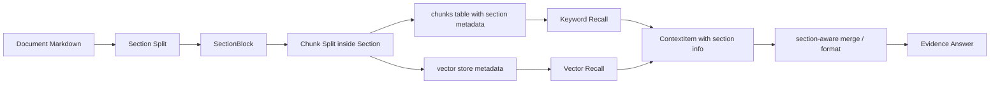

# Day 6：Chunk 结构化切分 + Section-aware metadata

## 今天的总目标

今天不是继续扩召回路数，  
也不是继续改回答协议，  
而是基于 Day 5 已经建立起来的 `vector + keyword + memory` 多路召回，  
正式把“检索单元本身”从固定大小文本块升级成**带结构感的 chunk**。

你今天要做成的，不是一个完美文档解析器，  
而是一个**在当前仓库上真实可落地、仍然 local-first、能把 section 结构一路带进 chunk metadata 的第一版结构化切分方案**。

---

## 今天结束前，你必须拿到什么

今天结束前，你至少要拿到这 6 个结果：

1. 你能清楚说出：Day 6 优化的是“chunk 质量”和“检索单元质量”，不是回答层格式。
2. `clients/text_splitter_client.py` 不再只会做固定大小切块，而是先按 markdown heading 切 section，再在 section 内切 chunk。
3. `models/chunk.py` 和 `crud/chunk.py` 能承接 `section_id / section_title / section_path / section_summary / section_chunk_index` 这类结构化 metadata。
4. `schemas/chat.py` 里的内部对象 `ContextItem` 能携带 section 相关字段，但对外回答协议仍然保持 Day 4 的收口方式。
5. `services/context_service.py` 知道“不要跨 section 粗暴合并 chunk”，并且能把 section 信息写进 prompt context。
6. 你能给 Day 7 留下一个干净前提：后面做 rerank 时，不再只面对一堆平铺的文本块，而是面对更像检索资产的 chunk。

---

## Day 6 一图总览

```text
Markdown Document
-> SectionBlock
-> Section-aware Chunk
-> chunks table
-> vector store metadata
-> ContextItem with section fields
-> section-aware merge / format
-> Evidence Answer
```

如果你想得更具体一点，Day 6 真正做的是：

```text
原来：
Document
-> RecursiveCharacterTextSplitter
-> Flat Chunk
-> Vector / Keyword Recall

现在：
Document
-> Markdown Section Split
-> Chunk inside Section
-> Chunk carries section metadata
-> Recall sees section title / section path / section summary
```

---

## 为什么这一天重要

Day 5 已经把“召回信号不只靠 embedding”这件事站住了。  
一旦多路召回站住，新的瓶颈就会立刻暴露出来：

> 候选不是完全召不回来，  
> 而是召回单元本身太平、太碎、太缺结构感。

当前仓库里，文档索引主链是真实存在的：

```text
clients/document_loader_client.load_langchain_documents(...)
-> clients/text_splitter_client.split_documents(...)
-> crud.chunk.create_chunks(...)
-> pipelines/document_index_pipeline.run_document_index_pipeline(...)
-> clients.vector_store_client.add_documents_to_vector_store_in_batches(...)
```

这条链路目前的问题不是“不能切 chunk”，  
而是它切出来的 chunk 还太像：

```text
固定大小文本片段
```

而不是：

```text
带 section 归属的检索单元
```

所以 Day 6 的意义，不是再加一层 fancy 架构，  
而是正式承认：

> 如果 chunk 本身没有结构感，  
> 那么 Day 5 再多召回几路，后面也只是把更多“边界不清”的片段喂给模型。

---

## Day 6 整体架构



今天之后，你应该这样理解这一层：

- `document_loader_client.py` 负责把原文件统一翻译成 markdown 文本。
- `text_splitter_client.py` 负责先识别 section，再做 chunk。
- `crud.chunk.py` 负责把 section-aware chunk metadata 落库。
- `models/chunk.py` 负责承接新的结构字段。
- `schemas/chat.py` 里的 `ContextItem` 负责把这些结构字段带进检索编排。
- `context_service.py` 负责消费这些 metadata，而不是继续把所有 chunk 当成平铺文本块。

---

## 今天的边界要讲透

### 今天之后，各层职责应该怎么理解

| 层 | 今天之后负责什么 | 今天不负责什么 |
| --- | --- | --- |
| `clients/document_loader_client.py` | 输出稳定 markdown 文本和基础文档 metadata | 不做 section-aware chunk 策略 |
| `clients/text_splitter_client.py` | 先切 section，再在 section 内切 chunk | 不做检索排序 |
| `models/chunk.py` | 定义 chunk 的结构字段 | 不写业务逻辑 |
| `crud.chunk.py` | 把 section metadata 正式写入 chunks 表 | 不拼 prompt |
| `schemas/chat.py` | 让内部 `ContextItem` 能携带 section 信息 | 不改外部回答协议 |
| `services/context_service.py` | section-aware merge / format / prompt context | 不做 rerank |
| `pipelines/document_index_pipeline.py` | 把新的切分主链串起来并记录统计 | 不做模型回答 |

### 对当前仓库的处理原则

今天一定要坚持这 6 条原则：

1. **先尊重当前 markdown-first 入口。**  
   当前 loader 已经统一把文件转成 markdown，所以 Day 6 先在 markdown heading 上做结构化，不要再同时发明 PDF AST、HTML AST、Office AST 三套解析器。

2. **今天先做 section-aware metadata，不单独建 sections 表。**  
   第一版先把结构信息挂到 chunk 上，就能支撑后续检索和 prompt 上下文消费。

3. **固定大小切分器不删除，只降级成 section 内二次切分器。**  
   `RecursiveCharacterTextSplitter` 仍然有用，只是它不再独占第一刀。

4. **对外回答协议尽量不动。**  
   Day 6 可以扩内部 `ContextItem`，但不要顺手重写 `ChatQueryData`。

5. **没有 heading 的文档必须有 fallback。**  
   不能因为结构化切分就让“普通纯文本”文档直接失去可索引能力。

6. **日志和结果统计里要能看到 section 规模。**  
   否则你后面根本不知道切分变化到底有没有发生。

### 先不要急着做这些

今天明确不做下面这些事情：

- 不做独立 `sections` 表
- 不做段落级 AST 图谱
- 不做 rerank
- 不做 graph recall
- 不做新的 prompt 协议
- 不做多模型切分器比较平台
- 不做“所有文件格式各写一套 parser”

今天的关键词只有 8 个字：

> 先分 section，再切 chunk

---

## 第 1 层：Day 6 的本质是什么

Day 6 的本质不是“把 chunk 再切小一点”。  
Day 6 的本质是：

> 让 chunk 从“平铺文本块”升级成“带结构归属的检索单元”。

如果你把今天理解成：

```text
chunk_size 从 500 改成 400
chunk_overlap 从 100 改成 80
```

那你其实还停留在 Day 5 之前。

因为 Day 6 关心的不是纯参数微调，  
而是单元语义：

```text
原来：
一段文本

今天：
属于哪个 section
-> 在 section 里的第几个 chunk
-> 这个 section 大概讲什么
```

---

## 第 2 层：Day 6 的主链一定要从“当前真实索引流水线”出发

今天不要脱离仓库谈结构化切分。  
你必须从当前真实索引链路出发：

```text
load_langchain_documents(...)
-> split_documents(...)
-> create_chunks(...)
-> rebuild_memory_entries_for_document(...)
-> add_documents_to_vector_store_in_batches(...)
```

这意味着：

Day 6 最适合动的入口，  
不是 `query_service.py`，  
而是 `text_splitter_client.py`。

因为当前系统真正决定 chunk 形状的地方，就是这里：

```text
split_documents(...)
-> build_text_splitter()
-> splitter.split_documents(...)
```

所以 Day 6 的最小升级路径应该是：

```text
保持 loader 不变
-> 先切 section
-> 再在 section 内切 chunk
-> chunk metadata 写入 DB 和向量库
-> context_service 消费这些 metadata
```

---

## 第 3 层：为什么 Day 5 之后，“固定大小 chunk”会立刻暴露出问题

Day 5 已经把更多候选召回上来了，  
于是 Day 6 最容易看到 4 个问题：

### 问题 1：chunk 可能横跨两个 section

这样一来，召回虽然“像相关”，  
但证据单位其实已经混了两个主题。

### 问题 2：chunk 没有 section 归属，prompt 不知道它属于哪一段结构

当前 `format_context_docs(...)` 只能输出：

- source_id
- document_id
- chunk_id
- text

但它看不到：

- 这一段来自哪个标题
- 上级标题路径是什么
- 这整个 section 大概讲什么

### 问题 3：相邻 chunk 合并可能跨 section

当前 `can_merge_documents(...)` 的主判断还是：

- 同一 document
- chunk_index 连续
- 页码接近

但这不等于“语义上应该合并”。

### 问题 4：Day 7 做 rerank 时信号太平

如果 chunk 本身没有 `section_title / section_path / section_summary`，  
后面的 rerank 只能看裸文本和分数，信号面太窄。

---

## 第 4 层：Day 6 的最小结构化 chunk 契约应该长什么样

今天不需要把 chunk 搞成复杂对象图，  
但至少要让它带上下面这些字段：

| 字段 | 作用 |
| --- | --- |
| `section_id` | 标识 chunk 属于哪个 section |
| `section_title` | 标识当前标题 |
| `section_level` | 标识标题层级，例如 `# / ## / ###` |
| `section_path` | 标识标题路径，例如 `项目经历 > 推荐系统 > 检索层` |
| `section_summary` | 给检索和 prompt 一个 section 级摘要锚点 |
| `section_chunk_index` | 标识当前 chunk 在该 section 内的顺序 |

今天最重要的认知变化是：

```text
chunk 不再只是 content + offsets
-> chunk 还要携带结构归属
```

---

## 第 5 层：Day 6 的最小步骤链应该先有什么

今天建议你把 Day 6 的主链理解成下面这几步：

```text
Markdown doc
-> Heading detection
-> SectionBlock
-> Section summary
-> Chunk split inside section
-> Persist section metadata
-> Recall consumes section metadata
```

这里一定要注意顺序：

不是：

```text
先全局 chunk
-> 再倒推 section
```

而是：

```text
先认 section
-> 再切 chunk
```

因为 Day 6 要保护的是边界本身。

---

## 第 6 层：结合当前仓库，Day 6 最小落点应该放在哪

今天建议的最小文件落点是这 7 个：

- `models/chunk.py`
- `alembic/versions/20260514_01_add_chunk_section_fields.py` 新增
- `clients/text_splitter_client.py`
- `crud/chunk.py`
- `schemas/chat.py`
- `services/context_service.py`
- `pipelines/document_index_pipeline.py`

如果你还想补观测字段，可以再带上：

- `schemas/document.py`
- `tasks/index_tasks.py`

其中每个文件建议承担的最小职责如下：

| 文件 | 今天建议承担的最小职责 |
| --- | --- |
| `models/chunk.py` | 新增 section 相关列 |
| `alembic/versions/...` | 给数据库正式加列 |
| `clients/text_splitter_client.py` | section split + section 内 chunk split |
| `crud/chunk.py` | 把 chunk metadata 正式落库 |
| `schemas/chat.py` | 扩内部 `ContextItem`，承接 section 字段 |
| `services/context_service.py` | section-aware merge / format |
| `pipelines/document_index_pipeline.py` | 记录 section-aware chunking 的统计 |

---

## 第 7 层：Day 6 最小接口建议长什么样

今天建议你把最小接口收口成下面这几条：

```python
from dataclasses import dataclass
from typing import Any

from langchain_core.documents import Document as LCDocument


@dataclass
class SectionBlock:
    section_id: str
    section_title: str | None
    section_level: int | None
    section_path: str | None
    section_summary: str | None
    section_start_offset: int
    page_no: int | None
    text: str
    base_metadata: dict[str, Any]


def build_section_summary(*, title: str | None, text: str, max_chars: int = 120) -> str:
    ...


def split_document_into_sections(doc: LCDocument) -> list[SectionBlock]:
    ...


async def split_documents(
    *,
    document_id: str,
    documents: list[LCDocument],
) -> list[LCDocument]:
    ...


def build_chunk_row_from_doc(
    *,
    document_id: str,
    document_pk: int,
    chunk: LCDocument,
) -> dict:
    ...
```

这几条接口背后的设计重点有三个：

1. `SectionBlock` 是 Day 6 的中间对象，不需要暴露到对外 API。
2. `split_documents(...)` 仍然保留原入口名，减少主链改动面。
3. `create_chunks(...)` 尽量只负责写库，metadata 组织逻辑单独收口。

---

## 第 8 层：Day 6 不建议做什么

今天最不建议做的 5 件事：

1. 一上来就新建一个庞大的“文档结构解析引擎”目录。
2. 为了做 section-aware chunk，顺手把所有 loader 重写一遍。
3. 还没把 section metadata 跑通，就先讨论 section table、paragraph table、span table 三层模型。
4. 把 `ChatSourceItem` 当成 Day 6 的主战场，顺手改外部协议。
5. 因为 Day 6 是结构化切分，就把 Day 5 的多路召回链一起推翻。

今天的原则是：

> 只升级 chunk 的结构感，不打散已经稳定的主链。

---

## 上午学习：09:00 - 12:00

## 09:00 - 09:50：把 Day 5 的交接翻译成 Day 6 的 chunk 问题

今天上午第一件事，不是先写代码，  
而是把 Day 5 最后交接这句话吃透：

> 现在真正暴露出来的问题会变成 chunk 边界质量。

你要明确：

- Day 5 已经解决的是“召回不只靠 embedding”
- Day 6 要解决的是“召回单元别再这么平”

### 你至少要能回答这两个问题

1. 为什么 Day 6 不应该继续围着 Hybrid Search 本身打转？
2. 为什么 Day 6 最应该动的是 `split_documents(...)`，而不是 `generate_rag_answer(...)`？

---

## 09:50 - 10:40：沿真实索引链确认今天必须新增什么能力

把这几段真实代码串起来看：

- `clients/document_loader_client.py`
- `clients/text_splitter_client.py`
- `crud/chunk.py`
- `pipelines/document_index_pipeline.py`
- `services/context_service.py`

你今天要特别记住 5 个事实：

1. 当前入口已经是 markdown-first。
2. 当前 `split_documents(...)` 还是固定大小切分。
3. 当前 `Chunk` 模型没有 section 元数据。
4. 当前 `context_service.py` 的相邻合并规则还不知道 section 边界。
5. Day 7 rerank 想变好，前提是 Day 6 先把 chunk 做得更像检索资产。

---

## 10:40 - 11:30：先把 Day 6 的最小协议和非目标钉死

### 今天必须明确要做

- 先识别 section，再在 section 内切 chunk
- chunk 正式携带 section metadata
- 内部 `ContextItem` 承接 section 字段
- 检索阶段不要跨 section 粗暴合并
- 日志和结果里能看出结构化切分是否生效

### 今天明确不做

- 独立 `sections` 表
- 独立 `evidence_spans` 表
- rerank
- graph recall
- 新回答协议

### 这一段最重要的结论

今天不是要证明“结构化切分很高级”，  
而是要先把下面这条最小链路跑通：

```text
Markdown
-> SectionBlock
-> Section-aware Chunk
-> Retrieval can see section info
```

---

## 11:30 - 12:00：先决定今天怎么验收

### Day 6 最直接的验收方式

你今天至少准备 4 类文档或问题去做人工验收：

1. 有明显 heading 的 markdown / PDF 转 markdown 文档  
   看 `section_title / section_path` 是否能稳定产出

2. 没有 heading 的普通文本  
   看 fallback 是否还能正常切 chunk

3. 跨 section 邻接片段  
   看 `context_service.py` 是否还会粗暴合并

4. 标题驱动问题  
   看 prompt context 是否能把 section 结构暴露给回答链

---

## 下午编码：14:00 - 18:00

## 14:00 - 14:50：先把 `models/chunk.py` 和 migration 变成 Section-ready

### 文件 1：`models/chunk.py`

文件位置：

- `models/chunk.py`

今天这一步不是重写 `Chunk` 模型，  
而是在原表结构上补最小结构字段。

#### `models/chunk.py` 按原文件具体怎么改

保留原有字段：

- `id`
- `document_id`
- `document_pk`
- `chunk_index`
- `content`
- `page_no`
- `start_offset`
- `end_offset`

今天只补这 6 个字段：

```python
section_id: Mapped[Optional[str]] = mapped_column(String(80), nullable=True)
section_title: Mapped[Optional[str]] = mapped_column(String(255), nullable=True)
section_level: Mapped[Optional[int]] = mapped_column(Integer, nullable=True)
section_path: Mapped[Optional[str]] = mapped_column(String(500), nullable=True)
section_summary: Mapped[Optional[str]] = mapped_column(Text, nullable=True)
section_chunk_index: Mapped[Optional[int]] = mapped_column(Integer, nullable=True)
```

建议顺手补一个联合索引：

```python
Index("idx_chunks_document_pk_section_id", "document_pk", "section_id")
```

### 文件 2：`alembic/versions/20260514_01_add_chunk_section_fields.py` 新增

今天真正要把模型落地到数据库，  
所以 migration 不要省。

#### `alembic/versions/...` 练手骨架版

```python
from alembic import op
import sqlalchemy as sa


def upgrade() -> None:
    # 你要做的事：
    # 1. 给 chunks 表加 section_id / section_title / section_level
    # 2. 再加 section_path / section_summary / section_chunk_index
    # 3. 加 document_pk + section_id 联合索引
    raise NotImplementedError


def downgrade() -> None:
    # 你要做的事：
    # 1. 先删索引
    # 2. 再逆序删列
    raise NotImplementedError
```

#### `alembic/versions/...` 参考答案

```python
from alembic import op
import sqlalchemy as sa


def upgrade() -> None:
    op.add_column("chunks", sa.Column("section_id", sa.String(length=80), nullable=True))
    op.add_column("chunks", sa.Column("section_title", sa.String(length=255), nullable=True))
    op.add_column("chunks", sa.Column("section_level", sa.Integer(), nullable=True))
    op.add_column("chunks", sa.Column("section_path", sa.String(length=500), nullable=True))
    op.add_column("chunks", sa.Column("section_summary", sa.Text(), nullable=True))
    op.add_column("chunks", sa.Column("section_chunk_index", sa.Integer(), nullable=True))
    op.create_index(
        "idx_chunks_document_pk_section_id",
        "chunks",
        ["document_pk", "section_id"],
        unique=False,
    )


def downgrade() -> None:
    op.drop_index("idx_chunks_document_pk_section_id", table_name="chunks")
    op.drop_column("chunks", "section_chunk_index")
    op.drop_column("chunks", "section_summary")
    op.drop_column("chunks", "section_path")
    op.drop_column("chunks", "section_level")
    op.drop_column("chunks", "section_title")
    op.drop_column("chunks", "section_id")
```

### 这一步真正要得到什么

这一步结束后，你要拿到的是：

```text
Chunk 表已经有能力承接 section 结构
-> 后面的切分和检索改造才不会停留在内存里
```

---

## 14:50 - 16:10：让 `clients/text_splitter_client.py` 正式承认 SectionBlock

### 文件 3：`clients/text_splitter_client.py`

文件位置：

- `clients/text_splitter_client.py`

这里是 Day 6 的主战场。  
今天真正改变 chunk 质量的地方就在这里。

#### `clients/text_splitter_client.py` 练手骨架版

```python
from dataclasses import dataclass
from typing import Any

from langchain_core.documents import Document as LCDocument


@dataclass
class SectionBlock:
    section_id: str
    section_title: str | None
    section_level: int | None
    section_path: str | None
    section_summary: str | None
    section_start_offset: int
    page_no: int | None
    text: str
    base_metadata: dict[str, Any]


def build_section_summary(*, title: str | None, text: str, max_chars: int = 120) -> str:
    # 你要做的事：
    # 1. 先清洗 text
    # 2. 优先保留 title
    # 3. 截取一小段稳定摘要
    raise NotImplementedError


def split_document_into_sections(doc: LCDocument) -> list[SectionBlock]:
    # 你要做的事：
    # 1. 识别 markdown heading
    # 2. 构造 section_path
    # 3. 没有 heading 时给一个 root section fallback
    # 4. 保留 page 和基础 metadata
    raise NotImplementedError


async def split_documents(
    *,
    document_id: str,
    documents: list[LCDocument],
) -> list[LCDocument]:
    # 你要做的事：
    # 1. 先 build_text_splitter()
    # 2. 按 source doc 拆成 sections
    # 3. 在每个 section 内再切 chunk
    # 4. 给 chunk 写 section_* metadata
    # 5. 保持全局 chunk_index 递增
    raise NotImplementedError
```

#### `clients/text_splitter_client.py` 参考答案

```python
import re
import uuid
from dataclasses import dataclass
from typing import Any

from langchain_core.documents import Document as LCDocument


HEADING_PATTERN = re.compile(r"^(#{1,6})\\s+(.+)$", re.MULTILINE)


@dataclass
class SectionBlock:
    section_id: str
    section_title: str | None
    section_level: int | None
    section_path: str | None
    section_summary: str | None
    section_start_offset: int
    page_no: int | None
    text: str
    base_metadata: dict[str, Any]


def build_section_summary(*, title: str | None, text: str, max_chars: int = 120) -> str:
    normalized = " ".join(text.split())
    if not normalized:
        return title or ""
    body = normalized[:max_chars]
    if title:
        return f"{title}: {body}"
    return body


def split_document_into_sections(doc: LCDocument) -> list[SectionBlock]:
    text = doc.page_content.strip()
    if not text:
        return []

    matches = list(HEADING_PATTERN.finditer(text))
    raw_page = doc.metadata.get("page")
    page_no = raw_page + 1 if isinstance(raw_page, int) else None

    if not matches:
        return [
            SectionBlock(
                section_id=f"{doc.metadata.get('document_id')}_sec_0",
                section_title=None,
                section_level=None,
                section_path=None,
                section_summary=build_section_summary(title=None, text=text),
                section_start_offset=0,
                page_no=page_no,
                text=text,
                base_metadata=dict(doc.metadata),
            )
        ]

    sections: list[SectionBlock] = []
    heading_stack: list[str] = []

    for index, match in enumerate(matches):
        start = match.start()
        end = matches[index + 1].start() if index + 1 < len(matches) else len(text)
        level = len(match.group(1))
        title = match.group(2).strip()
        section_text = text[start:end].strip()
        if not section_text:
            continue

        heading_stack = heading_stack[: level - 1] + [title]
        section_path = " > ".join(heading_stack)

        sections.append(
            SectionBlock(
                section_id=f"{doc.metadata.get('document_id')}_sec_{index}",
                section_title=title,
                section_level=level,
                section_path=section_path,
                section_summary=build_section_summary(title=title, text=section_text),
                section_start_offset=start,
                page_no=page_no,
                text=section_text,
                base_metadata=dict(doc.metadata),
            )
        )

    return sections
```

#### `clients/text_splitter_client.py` 按原函数具体怎么改

`split_documents(...)` 是老函数，  
这里不要整段重写，只改主链顺序。

原来大致是：

```python
splitter = await build_text_splitter()
chunks = splitter.split_documents(documents=documents)
```

今天改成：

```python
splitter = await build_text_splitter()
chunks: list[LCDocument] = []
global_chunk_index = 0

for source_doc in documents:
    sections = split_document_into_sections(source_doc)
    for section in sections:
        section_doc = LCDocument(
            page_content=section.text,
            metadata={
                **section.base_metadata,
                "section_id": section.section_id,
                "section_title": section.section_title,
                "section_level": section.section_level,
                "section_path": section.section_path,
                "section_summary": section.section_summary,
            },
        )
        section_chunks = splitter.split_documents([section_doc])
        for section_chunk_index, chunk in enumerate(section_chunks):
            local_start = chunk.metadata.get("start_index")
            absolute_start = (
                section.section_start_offset + local_start
                if isinstance(local_start, int)
                else None
            )
            raw_page = chunk.metadata.get("page")
            page_no = raw_page + 1 if isinstance(raw_page, int) else section.page_no
            chunk.metadata["chunk_id"] = f"{document_id}_chunk_{global_chunk_index}_{uuid.uuid4().hex[:6]}"
            chunk.metadata["chunk_index"] = global_chunk_index
            chunk.metadata["section_chunk_index"] = section_chunk_index
            chunk.metadata["page_no"] = page_no
            chunk.metadata["start_offset"] = absolute_start
            chunks.append(chunk)
            global_chunk_index += 1
```

注意这里最重要的是：

- 全局 `chunk_index` 继续保留
- 新增 `section_chunk_index`
- `start_offset` 不能直接拿 section 内局部 offset，要换回文档内 offset
- 没有 heading 的文档也必须走 root section fallback

### 这一步真正要得到什么

这一步结束后，你应该已经把切分主链从：

```text
全文 -> flat chunk
```

改成了：

```text
全文 -> section -> chunk
```

---

## 16:10 - 17:00：让 `schemas/chat.py` 和 `crud/chunk.py` 正式承认 section metadata

### 文件 4：`schemas/chat.py`

文件位置：

- `schemas/chat.py`

今天不要改对外 `ChatSourceItem` 协议，  
只扩内部 `ContextItem`。

#### `schemas/chat.py` 练手骨架版

```python
class ContextItem(BaseModel):
    recall_type: str
    score: float
    knowledge_base_id: str | None = None
    document_id: str
    chunk_id: str
    page_no: int | None = None
    text: str
    source_chunk_ids: list[str] = Field(default_factory=list)
    source_page_nos: list[int] = Field(default_factory=list)
    merged_chunk_count: int = 1
    memory_entry_id: str | None = None
    entry_name: str | None = None
    matched_terms: list[str] = Field(default_factory=list)
    section_id: str | None = None
    section_title: str | None = None
    section_level: int | None = None
    section_path: str | None = None
    section_summary: str | None = None
    section_chunk_index: int | None = None
```

#### `schemas/chat.py` 参考答案

```python
class ContextItem(BaseModel):
    recall_type: str = Field(..., description="vector / keyword / memory")
    score: float = Field(..., description="统一后的召回分数")
    knowledge_base_id: str | None = Field(default=None)
    document_id: str = Field(...)
    chunk_id: str = Field(...)
    page_no: int | None = Field(default=None)
    text: str = Field(...)
    source_chunk_ids: list[str] = Field(default_factory=list)
    source_page_nos: list[int] = Field(default_factory=list)
    merged_chunk_count: int = Field(default=1)
    memory_entry_id: str | None = Field(default=None)
    entry_name: str | None = Field(default=None)
    matched_terms: list[str] = Field(default_factory=list)
    section_id: str | None = Field(default=None, description="所属 section ID")
    section_title: str | None = Field(default=None, description="当前标题")
    section_level: int | None = Field(default=None, description="标题层级")
    section_path: str | None = Field(default=None, description="标题路径")
    section_summary: str | None = Field(default=None, description="section 摘要")
    section_chunk_index: int | None = Field(default=None, description="section 内 chunk 序号")
```

### 文件 5：`crud/chunk.py`

文件位置：

- `crud/chunk.py`

这里最适合加一个小 helper，  
把 row 组织逻辑收口一下。

#### `crud/chunk.py` 练手骨架版

```python
from langchain_core.documents import Document as LCDocument


def build_chunk_row_from_doc(
    *,
    document_id: str,
    document_pk: int,
    chunk: LCDocument,
) -> dict:
    # 你要做的事：
    # 1. 保留 create_chunks(...) 现在已有的基础字段
    # 2. 再把 section_* metadata 带进去
    # 3. content 为空时由上层决定是否跳过
    raise NotImplementedError
```

#### `crud/chunk.py` 参考答案

```python
from langchain_core.documents import Document as LCDocument


def build_chunk_row_from_doc(
    *,
    document_id: str,
    document_pk: int,
    chunk: LCDocument,
) -> dict:
    content = chunk.page_content.strip()
    start_offset = chunk.metadata.get("start_offset")
    end_offset = (
        start_offset + len(content)
        if isinstance(start_offset, int)
        else None
    )
    return {
        "id": chunk.metadata["chunk_id"],
        "document_id": document_id,
        "document_pk": document_pk,
        "chunk_index": chunk.metadata["chunk_index"],
        "content": content,
        "page_no": chunk.metadata.get("page_no"),
        "start_offset": start_offset,
        "end_offset": end_offset,
        "section_id": chunk.metadata.get("section_id"),
        "section_title": chunk.metadata.get("section_title"),
        "section_level": chunk.metadata.get("section_level"),
        "section_path": chunk.metadata.get("section_path"),
        "section_summary": chunk.metadata.get("section_summary"),
        "section_chunk_index": chunk.metadata.get("section_chunk_index"),
    }
```

#### `crud/chunk.py` 按原函数具体怎么改

`create_chunks(...)` 是老函数，  
今天不要重写 bulk insert 主链。

你只需要做两步：

1. 把原来那段大 `rows.append({...})` 提取成 `build_chunk_row_from_doc(...)`
2. 在 `create_chunks(...)` 里改成：

```python
row = build_chunk_row_from_doc(
    document_id=document_id,
    document_pk=document_pk,
    chunk=chunk,
)
rows.append(row)
```

这样好处很直接：

```text
chunk metadata 组织逻辑收口
-> Day 6 字段变多时不把 create_chunks(...) 越写越乱
```

### 这一步真正要得到什么

这一步结束后，你应该已经做到：

```text
section-aware chunk
-> 能被 DB 正式保存
-> 能被内部 ContextItem 正式承接
```

---

## 17:00 - 17:40：把 `services/context_service.py` 和 pipeline 收成 section-aware

### 文件 6：`services/context_service.py`

文件位置：

- `services/context_service.py`

这里今天不要整段重写，  
重点是**让已有的检索治理逻辑尊重 section 边界**。

#### `services/context_service.py` 按原函数具体怎么改

今天最关键的是改 4 处。

#### 1. `build_context_item_from_vector(...)` / `build_context_item_from_chunk(...)` / `build_context_item_from_memory(...)`

把 section 字段带进 `ContextItem`：

```python
section_id=doc.metadata.get("section_id"),
section_title=doc.metadata.get("section_title"),
section_level=doc.metadata.get("section_level"),
section_path=doc.metadata.get("section_path"),
section_summary=doc.metadata.get("section_summary"),
section_chunk_index=doc.metadata.get("section_chunk_index"),
```

chunk row 和 memory entry 对应的构造函数也一样，  
有值就带，没有值就留空。

#### 2. `can_merge_documents(...)`

原来主要看：

- 同一 document
- chunk_index 连续
- 页码接近

今天还要补一个 section 条件：

```python
prev_section = prev_doc.metadata.get("section_id")
current_section = current_doc.metadata.get("section_id")
if prev_section or current_section:
    if prev_section != current_section:
        return False
```

也就是说，  
只要 section 信息存在，就不要跨 section 合并。

#### 3. `format_context_docs(...)`

原来只输出：

- source_id
- document_id
- chunk_id
- text

今天要补 section 上下文：

```python
f"section_title={doc.metadata.get('section_title')}",
f"section_path={doc.metadata.get('section_path')}",
f"section_summary={doc.metadata.get('section_summary')}",
```

这样 Day 6 虽然不改回答协议，  
但模型在 prompt 里已经能看到 chunk 的结构归属。

#### 4. 最后重建 `LCDocument` 时，把 section metadata 写回 metadata

在 `build_query_context(...)` 里把 `ContextItem -> LCDocument` 的那一段补成：

```python
"section_id": item.section_id,
"section_title": item.section_title,
"section_level": item.section_level,
"section_path": item.section_path,
"section_summary": item.section_summary,
"section_chunk_index": item.section_chunk_index,
```

### 文件 7：`pipelines/document_index_pipeline.py`

文件位置：

- `pipelines/document_index_pipeline.py`

这一步主要做两件事：

1. 在 `document_index.chunked` 日志里顺手增加结构化统计  
   例如 `section_count`

2. 如果你愿意把观测做完整，  
   就在 `DocumentIndexPipelineResult` 里新增 `section_count`

#### `pipelines/document_index_pipeline.py` 按原函数具体怎么改

`run_document_index_pipeline(...)` 是老函数，  
今天不要改主链顺序，仍然保持：

```text
load -> split -> create_chunks -> memory -> vector
```

你只需要在 `split_documents(...)` 返回后，多统计一个：

```python
section_count = len(
    {
        chunk.metadata.get("section_id")
        for chunk in chunk_docs
        if chunk.metadata.get("section_id")
    }
)
```

然后把它打进：

- `document_index.chunked` 日志
- `DocumentIndexPipelineResult`

如果你同步改了 `schemas/document.py` 和 `tasks/index_tasks.py`，  
就再把这个字段一路打到 task 完成日志里。

### 这一步真正要得到什么

这一步结束后，你应该已经把：

```text
结构化切分
-> 内部检索对象
-> 检索治理逻辑
-> 索引结果统计
```

串成了一条完整链。

---

## 17:40 - 18:00：给 Day 7 留一份真正可消费的交付说明

今天结束前，建议你整理出这样一条交付链：

```text
Chunk 不再只是平铺文本块
-> chunk 带 section metadata
-> prompt context 知道标题路径和 section 摘要
-> retrieval merge 不再跨 section 粗暴拼接
-> Day 7 可以开始做更像样的 rerank
```

Day 7 最需要接住的一句话是：

> 现在候选不再只是“文本像不像”，  
> 而是已经开始带有结构提示，所以后面的 rerank 终于有机会融合 chunk 内容和 section 信号。

---

## 晚上复盘：20:00 - 21:00

今晚不要泛泛复述“今天做了结构化 chunk”。  
而是要回答下面这 6 个问题：

1. Day 6 到底优化的是召回路数，还是检索单元本身？
2. 为什么 Day 6 最适合改 `text_splitter_client.py`，而不是先改 `query_service.py`？
3. 为什么今天第一版先把 section 元数据挂到 chunk 上，而不是单独建 sections 表？
4. 为什么 `can_merge_documents(...)` 必须开始尊重 section 边界？
5. 为什么 Day 6 不应该顺手重写 `ChatQueryData`？
6. Day 7 做 rerank 之前，为什么 Day 6 的结构化 chunk 是必要前提？

如果这 6 个问题里有 2 个你答不顺，  
说明你今天可能只是“多存了几个字段”，还没有真正完成结构层收口。

---

## 今日验收标准

- 你能清楚讲出 Day 6 的目标是“把 chunk 升级成带结构归属的检索单元”。
- 你能指出 `document_loader_client.py`、`text_splitter_client.py`、`crud.chunk.py`、`context_service.py` 的职责分层。
- 你能给出一版最小 `SectionBlock` 中间对象。
- 你能说明 `section_id / section_title / section_path / section_summary / section_chunk_index` 为什么足够支撑第一版。
- 你能让 `split_documents(...)` 变成“先 section 后 chunk”的主链。
- 你能让 `can_merge_documents(...)` 不再跨 section 粗暴合并。
- 你能确认没有 heading 的文档仍然能 fallback 正常切分。
- 你能给 Day 7 留下一份结构化 chunk 的可消费输入。

---

## 今天最容易踩的坑

### 坑 1：把 Day 6 理解成“继续调 chunk_size / chunk_overlap”

问题：

只改参数，  
没有真的引入 section-aware 结构。

规避建议：

今天的核心不是“切分参数更精致”，  
而是“切分语义更有边界”。

### 坑 2：今天就想把 sections 表也一起建了

问题：

一看到 section 结构，就忍不住继续往数据库层拆更多表。

规避建议：

Day 6 第一版先做：

```text
section metadata 挂 chunk
-> 先把检索收益跑出来
```

### 坑 3：没有 heading 的文档直接切坏

问题：

结构化切分做完以后，只有 markdown heading 很规整的文档才能跑通。

规避建议：

一定保留 root section fallback：

```text
没有 heading
-> 仍然有一个默认 section
-> 仍然可索引
```

### 坑 4：跨 section 还在继续合并 chunk

问题：

切分阶段已经有 section 了，  
但检索阶段的 merge 还在跨 section 拼接。

规避建议：

Day 6 一定要让 `can_merge_documents(...)` 承认 section 边界。

### 坑 5：把 Day 6 做成对外 API 改造日

问题：

内部 `ContextItem` 一扩字段，就忍不住把 `ChatSourceItem` 也跟着大改。

规避建议：

今天先坚持：

```text
内部检索对象升级
-> prompt 上下文更有结构
-> 对外回答协议尽量不动
```

---

## 给明天的交接提示

Day 7 要接住的，不再是“还要不要做结构化切分”，  
而是：

> 既然 Day 6 已经把 chunk 从平铺文本块升级成了带结构归属的检索单元，  
> 那么下一步终于可以认真讨论：多路候选进来以后，到底怎么排，才值得被送进最终上下文。

明天开始前，你应该已经具备这 6 份输入：

```text
section-aware chunk 主链
-> chunks 表里的 section metadata
-> ContextItem 可承接 section 字段
-> merge 逻辑尊重 section 边界
-> prompt context 可见标题路径和 section 摘要
-> 更适合做 rerank 的候选单元
```

到了 Day 7，就不要再回头争论“结构化 chunk 要不要做”了，  
而是直接进入：

```text
Vector Recall
+ Keyword Recall
+ Memory Recall
-> Structured Candidate
-> Rerank
-> Final Context
-> Evidence Answer
```

这就是 Day 6 最终要交给 Day 7 的东西。
