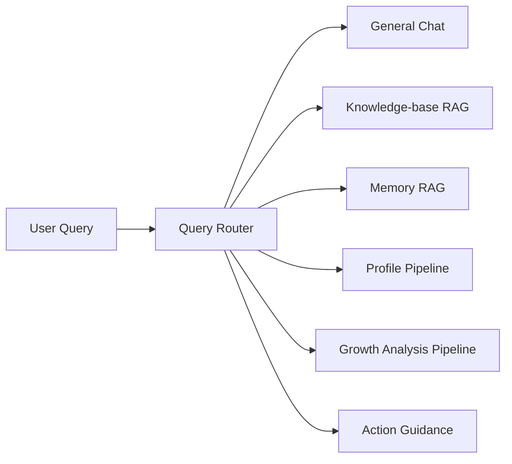

# Day 7：Query Router，先判断是否需要 RAG

## 今天的总目标

今天不是继续扩大召回路数，  
也不是继续改 prompt 或回答格式，  
而是在 Day 5 的 Hybrid Search 和 Day 6 的 section-aware chunk 基础上，  
给问答入口补上一层**查询路由**。

Day 7 要解决的问题是：

> 不是所有用户输入都应该进入 RAG。  
> RAG 有成本、有延迟，也有误召回风险。先判断问题类型，再选择链路。

所以今天的优化目标是：

```text
User Query
-> QueryRouter
-> general_chat / kb_qa / memory_query / profile_query / analysis_query / action_request
-> 对应 pipeline
-> 统一 ChatQueryData 返回
```

---

## 今天结束前已经拿到什么

今天完成了这 6 件事：

1. 新增 `services/query_router_service.py`，把 query type 判断从 `query_service` 里拆出来。
2. 在 `schemas/chat.py` 增加 `QueryRouteDecision` 和 `QueryType`，让路由结果有稳定结构。
3. `services/query_service.py` 不再只做“general chat 特判 + 其余全部 RAG”，而是根据 router 决策分流。
4. `profile_query` 会走已有画像 pipeline，`analysis_query` 会走已有成长分析 pipeline。
5. `action_request` 不会在聊天里直接执行上传、删除、重建索引等动作，而是返回操作引导。
6. `ChatQueryData` 增加 `route` 字段，接口调用方可以看到本次 query 的路由决策。

---

## Day 7 一图总览

```text
Question
-> route_query(...)
-> QueryRouteDecision
   - query_type
   - requires_retrieval
   - target_pipeline
   - confidence
   - reason
-> generate_rag_answer(...)
-> selected path
-> answer / sources / citations / confidence / uncertainty / route
```

更具体一点：



---

## 这一天为什么重要

Day 5 和 Day 6 已经让 RAG 链路变得更像样：

```text
vector recall
+ keyword recall
+ memory recall
+ section-aware chunk
+ evidence answer
```

但如果入口仍然把所有问题都塞进 RAG，就会出现 3 个问题：

1. 普通问候、帮助类问题也触发检索，浪费资源。
2. “我的画像是什么”这类问题被当成普通文档问答，绕开了已经存在的 profile pipeline。
3. “帮我删除文档”这类动作请求可能被误当成知识问答，而不是明确告诉用户该走操作入口。

所以 Day 7 的核心不是“让回答更聪明一点”，  
而是让系统开始知道：

> 当前问题到底应该交给哪条链路处理。

---

## 本次代码落点

### 文件 1：`schemas/chat.py`

新增：

```python
QueryType = Literal[
    "general_chat",
    "kb_qa",
    "memory_query",
    "profile_query",
    "analysis_query",
    "action_request",
]
```

新增 `QueryRouteDecision`：

```python
class QueryRouteDecision(BaseModel):
    query_type: QueryType
    requires_retrieval: bool
    target_pipeline: str
    confidence: str
    reason: str
```

同时在 `ChatQueryData` 里增加：

```python
route: QueryRouteDecision | None = None
```

这样前端或调试工具可以直接看到：

```text
这次为什么走 RAG
或者为什么没有走 RAG
```

---

### 文件 2：`services/query_router_service.py`

新增最小可用的规则路由器：

```text
general_chat
-> assistant/help/greeting

kb_qa
-> 默认知识库证据问答

memory_query
-> 我之前 / 以前提到 / 记忆 / 历史记录

profile_query
-> 画像 / 风格 / 偏好 / 能力标签 / 长期关注

analysis_query
-> 最近 / 近期 / 阶段 / 成长 / 卡点 / 亮点 / 趋势

action_request
-> 上传 / 删除 / 创建 / 重建 / 导入 / 导出 / 修改 / 更新
```

这版没有引入 LLM router，原因是当前阶段更适合先做一个可解释、可本地验证、不会增加外部调用成本的规则版。

---

### 文件 3：`services/query_service.py`

`generate_rag_answer(...)` 现在的入口变成：

```python
route = route_query(question)
```

然后按 `route.query_type` 分流：

```text
general_chat
-> get_general_chat_prompt()
-> no sources

action_request
-> action guidance
-> no side effect

profile_query
-> build_profile_for_knowledge_base(...)
-> formatted profile answer

analysis_query
-> build_growth_for_knowledge_base(...)
-> formatted growth answer

kb_qa / memory_query
-> build_query_context(...)
-> invoke_evidence_answer(...)
```

这让 `generate_rag_answer` 的职责从“永远 RAG”变成：

```text
先路由
再执行对应问答链路
最后保持统一响应结构
```

---

### 文件 4：`routers/chat.py`

聊天接口成功日志里补充了：

```text
query_type=...
```

路由决策本身也会被 `query_service` 打进结构化日志字段：

```text
query_type
requires_retrieval
target_pipeline
reason
```

这给后面的 Day 10 Retrieval Debug 留了入口：  
以后可以评估“这个问题到底该不该检索”。

---

### 文件 5：`scripts/debug_day7.py`

调试脚本改成不依赖数据库、向量库或模型 key 的纯 router 验证：

```text
python scripts/debug_day7.py
```

当前验证样例覆盖：

```text
你好，你能做什么？
这篇文档的主要内容是什么？
我之前提到过哪些 FastAPI 项目经验？
根据这些记忆，帮我总结一下我的画像
最近 30 天我的成长卡点是什么？
帮我删除这个知识库里的旧文档
```

---

## 当前路由策略

### 1. `general_chat`

典型问题：

```text
你好
你是谁
你能做什么
怎么使用
```

处理方式：

```text
不进 RAG
-> get_general_chat_prompt()
-> sources=[]
```

---

### 2. `kb_qa`

典型问题：

```text
这篇文档的主要内容是什么？
某个术语在资料里是怎么解释的？
请根据知识库回答这个问题
```

处理方式：

```text
进入 Evidence RAG
-> build_query_context(...)
-> vector + keyword + memory
-> evidence answer
```

---

### 3. `memory_query`

典型问题：

```text
我之前提到过什么？
以前记录过哪些项目经验？
我的历史记录里有没有某件事？
```

处理方式：

```text
进入检索链路
-> 当前先复用 build_query_context(...)
-> memory recall 会参与候选合并
```

这版还没有单独拆 `memory-only context`，因为 Day 5 已经把 memory recall 合进统一 `ContextItem` 了。  
先复用这条链，避免过早拆出重复链路。

---

### 4. `profile_query`

典型问题：

```text
我的画像是什么？
根据这些记忆总结我的风格
我长期关注什么？
```

处理方式：

```text
不走普通 RAG
-> build_profile_for_knowledge_base(...)
-> 格式化画像摘要
```

这里复用已有 profile pipeline，避免让“画像问题”退化成普通文档问答。

---

### 5. `analysis_query`

典型问题：

```text
最近 30 天我的成长卡点是什么？
近期有什么变化？
阶段总结一下
```

处理方式：

```text
不走普通 RAG
-> build_growth_for_knowledge_base(...)
-> 格式化成长分析结果
```

当前固定使用 `recent_days=30`，后续如果接口层传入分析窗口，再把这个值参数化。

---

### 6. `action_request`

典型问题：

```text
帮我删除这个文档
请重建索引
帮我创建一个知识库
```

处理方式：

```text
不执行副作用
不进 RAG
-> 返回操作入口引导
```

聊天入口不应该悄悄执行删除、上传、重建索引这类动作。  
Day 7 先明确边界：识别动作请求，但不在聊天链路直接执行。

---

## 本地验证结果

已运行语法检查：

```text
.\.venv\Scripts\python.exe -m compileall routers\chat.py schemas\chat.py services\query_service.py services\query_router_service.py scripts\debug_day7.py
```

已运行 Day 7 调试脚本：

```text
.\.venv\Scripts\python.exe scripts\debug_day7.py
```

当前关键输出：

```text
你好，你能做什么？
-> general_chat
-> requires_retrieval=False

这篇文档的主要内容是什么？
-> kb_qa
-> requires_retrieval=True

我之前提到过哪些 FastAPI 项目经验？
-> memory_query
-> requires_retrieval=True

根据这些记忆，帮我总结一下我的画像
-> profile_query
-> requires_retrieval=False

最近 30 天我的成长卡点是什么？
-> analysis_query
-> requires_retrieval=False

帮我删除这个知识库里的旧文档
-> action_request
-> requires_retrieval=False
```

这说明 Day 7 的最小验收已经成立：

```text
普通聊天不会进 RAG
知识库问题会进 RAG
记忆问题会保留检索
画像问题会走 profile
分析问题会走 growth analysis
动作请求不会被当成知识问答
```

---

## 今天没有做什么

### 1. 没有做 LLM Router

原因：

```text
规则 router 可解释
本地可验证
没有额外模型调用成本
适合第一版落地
```

后续如果发现规则覆盖不足，再用 LLM router 或 few-shot classifier 替换。

### 2. 没有新增数据库表保存 router trace

今天只先把 route 放进返回结构和日志。  
等 Day 10 做 Retrieval Debug 时，再把 router trace、recall trace、fusion trace 一起沉淀成可查询对象。

### 3. 没有让 action_request 真的执行动作

这是刻意保留的边界。  
聊天里的动作执行需要权限确认、参数解析、审计日志和幂等控制，不适合在 Day 7 顺手做掉。

---

## 今日验收标准

今天结束时，至少要能回答这 6 个问题：

1. 为什么普通问候和帮助问题不应该触发 RAG？
2. 为什么 `profile_query` 不应该被当成普通 `kb_qa`？
3. 为什么 `action_request` 只能识别和引导，不能在聊天里直接执行？
4. `QueryRouteDecision` 里为什么必须有 `requires_retrieval` 和 `target_pipeline`？
5. Day 7 的路由日志未来怎样接到 Day 10 的 Retrieval Debug？
6. 当前规则 router 的边界在哪里，什么时候应该升级成 LLM router？

---

## 给 Day 8 的交接提示

Day 8 可以接住 Day 7 的这个前提：

> 进入检索链路的问题，已经不是所有用户输入，而是经过 router 初筛后真正需要 RAG 的问题。

所以 Day 8 做 Elasticsearch BM25 时，不需要再纠结“普通闲聊会不会也打到 ES”。  
它可以专注在：

```text
kb_qa / memory_query
-> vector recall
+ keyword recall
+ future BM25 recall
-> candidate pool
```

也就是说，Day 7 给 Day 8 留下的输入是：

```text
QueryRouter
-> only retrieval-worthy query enters retrieval
-> route decision is observable
-> RAG 链路可以更专注地优化召回质量
```

这就是 Day 7 最终要交给 Day 8 的东西。
