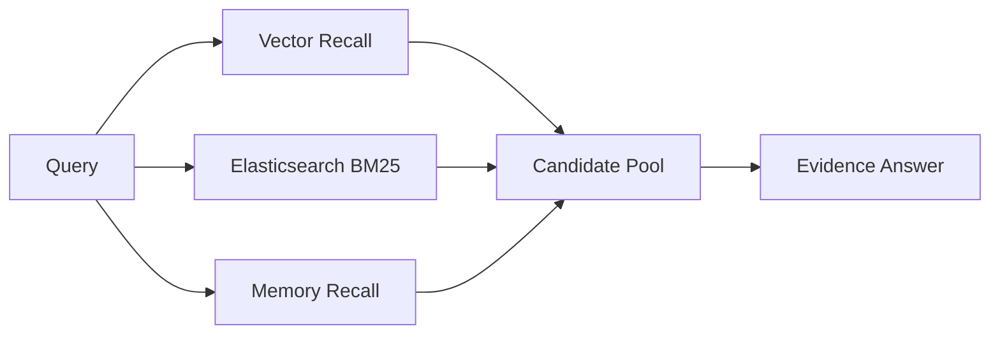

# Day 8：Elasticsearch BM25 与真 Hybrid Search

## 今天的总目标

今天不是继续扩展回答协议，  
也不是把 rerank 提前做掉，  
而是在 Day 7 的 Query Router 之后，  
把真正需要检索的问题接到更可靠的 lexical recall 底座上。

Day 8 要解决的问题是：

> Day 5 的 keyword recall 还停留在数据库 `LIKE`。  
> 它能兜底，但不适合长期承担人名、标题、日期、术语、短语和高亮解释。

所以今天的优化目标是：

```text
kb_qa / memory_query
-> vector recall
+ Elasticsearch BM25 recall
+ memory recall
-> ContextItem candidate pool
-> Evidence Answer
```

---

## 今天结束前已经拿到什么

今天完成了这 7 件事：

1. 新增 `clients/elasticsearch_client.py`，用项目已有的 `httpx` 直接接 ES REST API，没有额外增加依赖。
2. 在 `conf/config.py` 和 `.env-example` 增加 ES 配置项。
3. 文档索引 pipeline 在 chunk 入库后，会把 chunk 同步写入 ES。
4. 删除文档资源时，会同步删除 ES 中的 chunk 文档。
5. `services/context_service.py` 的 lexical recall 改成优先 ES BM25。
6. ES 未启用或不可用时，自动 fallback 到 Day 5 已有 SQL `LIKE` keyword recall。
7. 新增 `scripts/debug_day8.py`，可在无 ES 的本地环境验证 fallback 语义，也可在开启 ES 后验证真实 BM25。

---

## Day 8 一图总览

```text
Document Index:

load document
-> split section-aware chunks
-> save chunks table
-> index chunks to Elasticsearch
-> extract memory
-> upsert vectors
```

```text
Query:

route_query(...)
-> kb_qa / memory_query
-> vector recall
-> ES BM25 recall
-> memory recall
-> merge ContextItem
-> final context
```



---

## 这一天为什么重要

Embedding 擅长语义相似，但它天然不稳定地处理这些问题：

```text
精确人名
文件标题
日期
短语原文
缩写
专业术语
带结构字段的标题路径
```

SQL `LIKE` 能做最小兜底，  
但它缺少成熟 lexical search 需要的能力：

```text
BM25 相关性
字段权重
高亮
可解释命中
后续可扩展 analyzer
```

Day 8 的核心不是“为了用 ES 而用 ES”，  
而是把 Hybrid Search 从：

```text
vector + SQL LIKE + memory
```

推进到：

```text
vector + BM25 + memory
```

---

## 本次代码落点

### 文件 1：`conf/config.py`

新增 ES 配置：

```python
ELASTICSEARCH_ENABLED: bool = False
ELASTICSEARCH_URL: str = "http://127.0.0.1:9200"
ELASTICSEARCH_USERNAME: str = ""
ELASTICSEARCH_PASSWORD: str = ""
ELASTICSEARCH_INDEX_NAME: str = "mneme_chunks"
ELASTICSEARCH_TIMEOUT_SECONDS: float = 5.0
```

默认关闭 ES，是为了保证当前本地环境和 CI 不会因为没有外部 ES 服务而失败。

---

### 文件 2：`clients/elasticsearch_client.py`

新增 ES 客户端能力：

```text
ensure_elasticsearch_index()
index_chunks_to_elasticsearch(...)
search_chunks_by_bm25(...)
delete_chunks_from_elasticsearch(...)
```

第一版 ES mapping 重点覆盖：

```text
chunk_id
document_id
knowledge_base_id
user_id
file_name
content
section_title
section_path
section_summary
page_no
chunk_index
section_id
section_level
section_chunk_index
```

BM25 查询使用 `multi_match`，字段权重是：

```text
section_title^3
section_path^2
section_summary^1.5
file_name^1.5
content
```

这样 Day 6 的 section metadata 终于真正进入 lexical recall。

---

### 文件 3：`pipelines/document_index_pipeline.py`

索引流水线新增阶段：

```text
lexical_indexing
```

位置在：

```text
chunk 入库之后
memory 抽取之前
vector upsert 之前
```

当前顺序是：

```text
parsing
-> chunking
-> persist chunks
-> lexical_indexing
-> memory_extracting
-> embedding
-> vector_upserting
```

这让 ES 和 Milvus 都能使用同一批 section-aware chunk。

---

### 文件 4：`services/context_service.py`

Day 5 这里原本是：

```text
vector recall
+ SQL LIKE keyword recall
+ memory recall
```

今天改成：

```text
vector recall
+ Elasticsearch BM25 recall
+ memory recall
```

但保留 fallback：

```text
ES disabled / unavailable
-> SQL LIKE keyword recall
```

返回的 `ContextItem.recall_type`：

```text
ES 命中：bm25
SQL fallback：keyword
```

并在 `context_packet` 中增加：

```text
lexical_backend = elasticsearch_bm25 / sql_like
```

后续 Day 10 做 Retrieval Debug 时，可以直接知道这次 lexical recall 用的是哪条链路。

---

### 文件 5：`services/resource_service.py`

删除文档资源时新增：

```python
await delete_chunks_from_elasticsearch(ids=chunk_ids)
```

这样 chunk 删除不会只清数据库和 Milvus，ES 里也会同步清理。

---

### 文件 6：`schemas/document.py`

`DocumentIndexPipelineResult` 增加：

```python
elasticsearch_enabled: bool
indexed_elasticsearch_count: int
```

索引完成后能看到：

```text
ES 是否启用
本次写入 ES 的 chunk 数
```

---

### 文件 7：`scripts/debug_day8.py`

新增调试脚本：

```text
.\.venv\Scripts\python.exe scripts\debug_day8.py
```

如果 ES 未启用，它会验证：

```text
index_chunks_to_elasticsearch(...)
-> 不写外部服务
-> 返回 indexed_count=0

search_chunks_by_bm25(...)
-> 返回 None
-> 查询链路会 fallback SQL LIKE
```

如果 ES 已启用，它会写入一条 debug chunk，并执行 BM25 查询。

---

## 当前路由与召回关系

Day 7 之后，不是所有 query 都会进入 Day 8。

当前关系是：

```text
general_chat
-> 不检索

profile_query
-> profile pipeline

analysis_query
-> growth analysis pipeline

action_request
-> action guidance

kb_qa / memory_query
-> Day 8 retrieval
```

也就是说，ES BM25 只服务真正需要检索的问题。

---

## 本地验证结果

已运行语法检查：

```text
.\.venv\Scripts\python.exe -m compileall clients\elasticsearch_client.py conf\config.py services\context_service.py pipelines\document_index_pipeline.py services\resource_service.py schemas\document.py schemas\chat.py scripts\debug_day8.py
```

已运行 Day 8 调试脚本：

```text
.\.venv\Scripts\python.exe scripts\debug_day8.py
```

当前本地默认配置是：

```text
ELASTICSEARCH_ENABLED=False
```

因此脚本验证的是 fallback 语义：

```text
index_result={'enabled': False, 'indexed_count': 0}
search_result=None
```

这代表在无 ES 的本地环境里，系统仍会回到 SQL `LIKE` keyword recall，不会影响现有问答链路。

---

## 今天没有做什么

### 1. 没有引入中文 analyzer

第一版先使用 ES 默认 text mapping。  
后续如果要优化中文召回，可以再接 IK、smartcn 或自定义 analyzer。

### 2. 没有做 fusion/rerank

Day 8 只负责把 BM25 召回接进候选池。  
不同召回源的公平融合、权重归一和 rerank 留给 Day 9。

### 3. 没有强制 ES 成为必选依赖

默认仍然：

```text
ELASTICSEARCH_ENABLED=false
```

原因是当前仓库要保持 local-first，不能让没有 ES 的环境无法索引和问答。

---

## 今日验收标准

今天结束时，至少要能回答这 6 个问题：

1. 为什么 SQL `LIKE` 只能做 fallback，不能长期作为 keyword recall 主体？
2. Day 6 的 `section_title / section_path / section_summary` 为什么适合进入 ES 字段？
3. 为什么 ES 查询要给 `section_title` 和 `section_path` 更高权重？
4. 为什么 Day 8 不应该顺手做 fusion/rerank？
5. ES 不可用时，当前系统如何保证问答链路不被外部服务拖死？
6. Day 8 的 `lexical_backend` 如何为 Day 10 Retrieval Debug 留观测入口？

---

## 给 Day 9 的交接提示

Day 9 可以接住 Day 8 的这个前提：

> 多路召回现在不再只是名义上的 hybrid，候选已经来自 vector、BM25 和 memory 三类不同信号。

所以 Day 9 不应该再继续扩召回路数，  
而应该开始解决：

```text
不同召回源的 score 不可直接比较
BM25 分数和 vector 分数尺度不同
memory importance 和文本相关性不是同一种信号
重复 chunk 需要合并
section 命中、精确词命中、recency 等信号需要进入排序
```

Day 8 最终交给 Day 9 的输入是：

```text
vector candidates
+ bm25 candidates
+ memory candidates
-> ContextItem candidate pool
-> lexical_backend observable
```

这就是 Day 8 最终要交给 Day 9 的东西。
