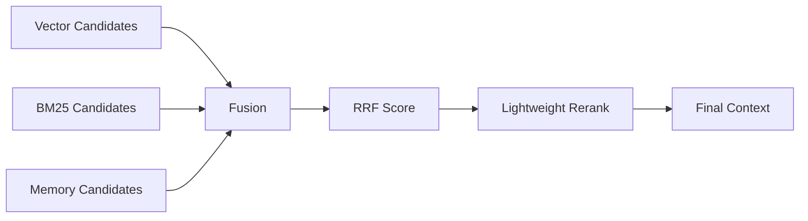

# Day 9：Fusion 与 Rerank 层

## 今天的总目标

今天不是继续增加召回源，  
也不是直接上 cross-encoder 或 LLM reranker，  
而是在 Day 8 已经形成的 `vector + BM25 + memory` 候选池之后，  
补上一层**统一 fusion 与轻量 rerank**。

Day 9 要解决的问题是：

> 多路召回以后，不能直接把不同来源的原始分数放在一起排序。  
> vector score、BM25 score、memory importance 不是同一种尺度。

所以今天的优化目标是：

```text
vector candidates
+ bm25 / keyword candidates
+ memory candidates
-> RRF Fusion
-> lightweight rerank
-> final context
-> Evidence Answer
```

---

## 今天结束前已经拿到什么

今天完成了这 6 件事：

1. 新增 `services/retrieval_fusion_service.py`，把 fusion/rerank 从 `context_service` 里拆出来。
2. `ContextItem` 增加 `vector_score / bm25_score / keyword_score / memory_score / fusion_score / rerank_score` 等调试字段。
3. 多路候选现在先走 RRF 融合，而不是直接按各自原始 `score` 排序。
4. 重复 chunk 会合并 recall type，例如 `vector+bm25+memory`。
5. 增加轻量 rerank 接口，第一版支持 exact match、section match、multi-source bonus。
6. 新增 `scripts/debug_day9.py`，可本地验证 fusion/rerank 排序效果。

---

## Day 9 一图总览

```text
Query
-> Vector Recall
-> BM25 / Keyword Recall
-> Memory Recall
-> ContextItem groups
-> RRF Fusion
-> Lightweight Rerank
-> Context Budget Trim
-> Prompt Context
```



---

## 这一天为什么重要

Day 8 之后，候选已经来自三类不同信号：

```text
vector: 语义相似
bm25 / keyword: 词面匹配
memory: 长期记忆重要性
```

这些分数不能直接比较：

```text
vector score 可能是相似度
BM25 score 可能是 7.8、12.3 这种检索分
memory score 是重要性分
SQL keyword fallback 甚至只是固定 1.0
```

如果直接 `sorted(score, reverse=True)`，排序很容易被某一路的分数尺度绑架。  
Day 9 的核心就是先把这些分数转成更公平的排序信号。

---

## 本次代码落点

### 文件 1：`schemas/chat.py`

`ContextItem` 新增调试字段：

```python
vector_score: float | None
bm25_score: float | None
keyword_score: float | None
memory_score: float | None
fusion_score: float | None
rerank_score: float | None
exact_match_count: int
recall_ranks: dict[str, int]
rerank_reasons: list[str]
```

这些字段当前主要用于内部排序和后续 debug，  
不会改变 Day 4 已经收口的外部回答协议。

---

### 文件 2：`services/retrieval_fusion_service.py`

新增核心函数：

```python
fuse_context_items_by_rrf(...)
rerank_context_items(...)
fuse_and_rerank_context_items(...)
```

第一版 RRF 权重：

```python
RECALL_WEIGHTS = {
    "vector": 1.0,
    "bm25": 1.15,
    "keyword": 0.75,
    "memory": 0.9,
}
```

这里让 BM25 略高于 SQL fallback，因为 Day 8 的目标就是让 ES 承接更可靠的 lexical recall。  
`keyword` 权重更低，是因为 SQL `LIKE` 只是 fallback。

---

### 文件 3：`services/context_service.py`

Day 8 结束时这里还是：

```text
vector_items + keyword_items + memory_items
-> merge_context_items(...)
-> sorted(score)
-> final context
```

今天改成：

```text
vector_items
+ keyword_items / bm25_items
+ memory_items
-> fuse_and_rerank_context_items(...)
-> context budget trim
-> final context
```

同时 `context_packet` 增加：

```text
candidate_count
fusion_count
rerank_count
```

这样 Day 10 做 Retrieval Debug 时，可以区分：

```text
召回了多少候选
融合后剩多少候选
重排后送入上下文多少候选
```

---

### 文件 4：`services/query_service.py`

`rag.context.ready` 日志补充：

```text
candidate_count
fusion_count
rerank_count
```

这一步不是完整 Retrieval Debug，  
但已经给 Day 10 留下了可观测字段。

---

### 文件 5：`scripts/debug_day9.py`

新增本地调试脚本：

```text
.\.venv\Scripts\python.exe scripts\debug_day9.py
```

脚本构造三组候选：

```text
vector: chunk_1, chunk_2
bm25: chunk_1, chunk_3
memory: chunk_1
```

期望结果是：

```text
chunk_1
-> vector+bm25+memory
-> fusion_score highest
-> rerank_score highest

chunk_3
-> bm25
-> exact/section match bonus

chunk_2
-> vector only
```

---

## 当前 Fusion 策略

第一版使用 RRF：

```text
score += recall_weight / (RRF_K + rank)
```

默认：

```text
RRF_K = 60
```

它的好处是：

1. 不要求不同召回源的原始分数可比较。
2. 更看重“在某一路召回里排得靠前”。
3. 同一个 chunk 被多路召回命中，会自然累加分数。

例如同一个 chunk 同时命中：

```text
vector rank 1
bm25 rank 1
memory rank 1
```

它的融合分会明显高于单路命中的 chunk。

---

## 当前 Rerank 策略

第一版 rerank 不是模型重排，  
而是轻量可解释重排：

```text
rerank_score = fusion_score + exact_match_bonus + section_match_bonus + multi_source_bonus
```

当前使用的信号：

```text
exact_text_match
section_match
multi_source
```

也就是说：

1. query term 在文本或 matched_terms 里出现，会加一点分。
2. query term 命中 `section_title / section_path / section_summary`，会加一点分。
3. 同一个 chunk 同时来自多路召回，会加一点分。

这不是最终版 rerank，  
但它给后续 cross-encoder reranker 或 LLM reranker 留了明确接口。

---

## 本地验证结果

已运行语法检查：

```text
.\.venv\Scripts\python.exe -m compileall services\retrieval_fusion_service.py services\context_service.py services\query_service.py schemas\chat.py scripts\debug_day9.py
```

已运行 Day 9 调试脚本：

```text
.\.venv\Scripts\python.exe scripts\debug_day9.py
```

关键输出：

```text
rank=1
chunk_id=chunk_1
recall_type=vector+bm25+memory
fusion_score=0.050000
rerank_score=0.065000
exact_match_count=3
recall_ranks={'vector': 1, 'bm25': 1, 'memory': 1}

rank=2
chunk_id=chunk_3
recall_type=bm25
fusion_score=0.018548
rerank_score=0.028548

rank=3
chunk_id=chunk_2
recall_type=vector
fusion_score=0.016129
rerank_score=0.016129
```

这说明 Day 9 的最小验收成立：

```text
多路命中的候选会被合并
不同召回源不再直接比较原始分数
融合分和重排分都有明确字段
最终排序能体现 multi-source 与 exact match
```

---

## 今天没有做什么

### 1. 没有上 cross-encoder reranker

原因是当前阶段先要把接口和信号打通。  
如果现在直接接模型 reranker，会把“排序结构问题”和“模型效果问题”混在一起。

### 2. 没有把 fusion trace 落库

今天只把字段放进 `ContextItem` 和日志统计。  
Day 10 会专门处理 Retrieval Debug 的持久化和可查询结构。

### 3. 没有重写召回层

Day 9 只处理候选集。  
它不重新承担 vector recall、BM25 recall 或 memory recall 的职责。

---

## 今日验收标准

今天结束时，至少要能回答这 6 个问题：

1. 为什么 BM25 score 和 vector score 不能直接排序？
2. RRF 为什么适合作为 Day 9 第一版 fusion？
3. 为什么被多路召回同时命中的 chunk 应该得到更高优先级？
4. 当前轻量 rerank 使用了哪些信号？
5. 为什么 Day 9 不应该顺手上 cross-encoder？
6. Day 9 的 fusion/rerank 字段如何为 Day 10 Retrieval Debug 做准备？

---

## 给 Day 10 的交接提示

Day 10 可以接住 Day 9 的这个前提：

> 现在一次问答已经有 router、recall、fusion、rerank 和 final context 的基本统计字段。

Day 10 不应该再继续改排序公式，  
而应该开始把这些链路记录下来：

```text
router decision
vector candidates
bm25 / keyword candidates
memory candidates
fusion score
rerank score
final context
answer citations
```

Day 9 最终交给 Day 10 的输入是：

```text
ContextItem with source scores
ContextItem with fusion_score
ContextItem with rerank_score
context_packet counts
query_service context logs
```

这就是 Day 9 最终要交给 Day 10 的东西。
