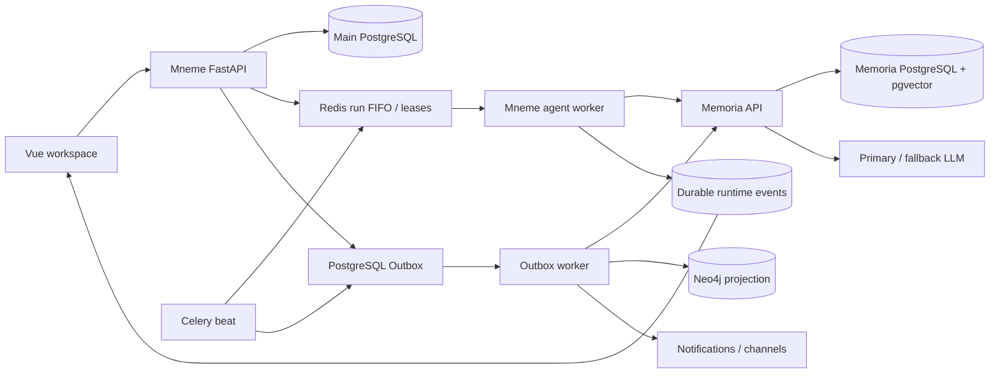

# Mneme Architecture

## Purpose and scope

本文档描述当前生产代码的系统边界、数据所有权和关键执行路径。历史设计过程保留在
`docs/superpowers/plans`，运维步骤保留在 `docs/operations-runbook.md`；本文件只记录
现在实际运行的架构。

Mneme 是面向个人长期知识沉淀的应用。主 FastAPI 应用负责身份、知识库、文档、聊天
会话、任务、自动化和渠道入口；Memoria 服务负责检索、受治理记忆、模型调用、引用验证
和回答运行审计。两者通过带服务令牌的 HTTP 契约通信，不跨数据库读取或 join。

## Runtime topology

## Application boundaries

### Mneme FastAPI

The application factory in `app/mneme/bootstrap/app_factory.py` installs HTTP correlation and
metrics, CORS, trusted-host handling, exception boundaries, API routers, and the built frontend.
Router registration is centralized in `app/mneme/bootstrap/router_registry.py`.

Responsibilities:

- authenticate users and enforce owner scope;
- manage knowledge bases, documents, sessions and messages;
- persist durable agent-run and automation records;
- enqueue document, graph, memory and channel work through Celery or the Outbox;
- expose the browser application and public APIs;
- stream ordered agent events to an authenticated session owner.

### Memoria API

The independent application in `app/mneme/memoria/server/app.py` owns answer generation and
governed-memory processing. The answer endpoint in
`app/mneme/memoria/server/api/answers.py` validates service-token scope before starting the
retrieval, generation and citation phases.

Responsibilities:

- retrieve owner-scoped document, memory, profile and relation evidence;
- execute bounded single-agent or multi-agent reasoning;
- expose only approval proposals for write-class tools;
- call the configured primary model and optional fallback model;
- validate citations against retrieved evidence;
- persist answer-run, projection and memory-governance audit state.

### Workers and scheduler

- Mneme workers consume document indexing, Outbox, agent-run, automation, maintenance and
  channel-delivery queues declared in `app/mneme/infra/celery_app.py`.
- The Memoria worker consumes its isolated queue declared in
  `app/mneme/memoria/server/celery_app.py`.
- Celery beat recovers stale runs, dispatches due heartbeats and advances pending Outbox work.
- FastAPI handlers persist durable intent before publishing background work; they do not use
  `BackgroundTasks` for durable jobs.

## Data ownership

| Store | Owner | Durable responsibilities |
|---|---|---|
| Main PostgreSQL | Mneme | users, knowledge bases, documents, chat, tasks, Outbox, durable agent runs, runtime events, heartbeats, approvals, notifications, channels |
| Memoria PostgreSQL with pgvector | Memoria | projected chunks, inbox events, memory candidates, canonical memories, revisions, relations, deletion fences, answer runs and action audit |
| Redis DB 0/1 | Mneme Celery | broker and result backend |
| Redis DB 2/3 | Memoria Celery | isolated broker and result backend |
| Redis DB 4 | Mneme agent runtime | short-lived run cache, ordered session FIFO, leases, abort intent and event-stream acceleration |
| Neo4j | Mneme projection worker | derived graph projection; PostgreSQL remains the source of truth |
| Milvus profile | Mneme legacy/vector compatibility | optional vector backend; the default Memoria answer path uses pgvector |

The Compose definitions and network bindings are authoritative in `docker-compose.yml`. Redis is
coordination state, not the durable source of truth for an agent run. Neo4j and Milvus contain
rebuildable projections.

## Request and event flows

### Durable agent run

1. `POST /kb/chat/sessions/{session_id}/runs` validates session ownership and creates an
   idempotent run identity.
2. `app/mneme/memoria/run_submission.py` commits the durable PostgreSQL run before publishing any
   broker-visible work.
3. `app/mneme/memoria/persistence/runs.py` atomically appends the run to the session FIFO in Redis.
4. The agent worker claims the head of that session with a renewable lease. Independent sessions
   may execute concurrently; one session executes serially.
5. The worker calls Memoria through `app/mneme/memoria/clients/memory_agent.py`.
6. Memoria validates, retrieves, generates, validates citations and records the answer run.
7. Each public progress event is persisted in PostgreSQL, then mirrored to Redis for streaming.
8. Terminal state and the assistant answer are saved before the session lease is released.

### Document and memory projection

Document mutations and memory-relevant domain events are committed with an Outbox row. The worker
loads a snapshot, dispatches by target backend, records retry state, and moves exhausted work to a
dead-letter state. Projection consumers are idempotent and must remain rebuildable from the
PostgreSQL source records.

### Run control

`POST /kb/chat/runs/{run_id}/control` supports:

- `interrupt`: persist abort intent and cancel the active run;
- `steer`: abort the active run and queue a replacement with updated direction;
- `followup`: queue another run after the current session turn.

The API always checks run and session ownership before applying control.

## Model resilience

`app/mneme/memoria/server/providers/llm.py` resolves a request-scoped model or the service default.
Transient capacity and availability failures are retried with bounded delay. Repeated provider
failures open a short process-local cooldown; when enabled and distinct, the fallback configuration
is attempted. Attempt metadata, selected provider/model, token usage and fallback use are recorded
with the answer run. API keys are excluded from public contracts and logs.

## Health and observability

- Mneme liveness: `GET /health`
- Mneme production-readiness report: `GET /health/readiness`
- Mneme HTTP metrics: `GET /health/metrics`
- Memoria liveness: `GET /health`
- Memoria dependency readiness: `GET /health/readiness`
- Memoria worker diagnostic: `GET /health/worker`
- Memoria operational metrics: `GET /metrics`

Both applications use the shared correlation context in `app/mneme/observability`. Request IDs,
trace IDs, run IDs and event IDs are propagated where available. Alert response and recovery
commands are documented in `docs/operations-runbook.md`.

## Change rules

- A service may not read the other service's database directly.
- A broker-visible task may not precede its durable PostgreSQL record.
- Derived projections must have an idempotent rebuild path.
- Public streaming events must be durable and monotonically sequenced per run.
- New write-capable agent tools must remain proposal-only until a separately reviewed apply path
  exists.
- Architecture changes must update this document and `docs/runtime-contracts.md` in the same
  change.
