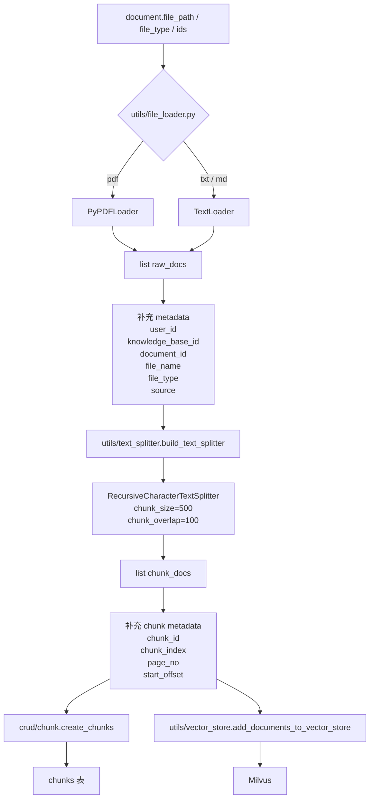
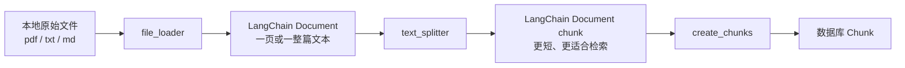
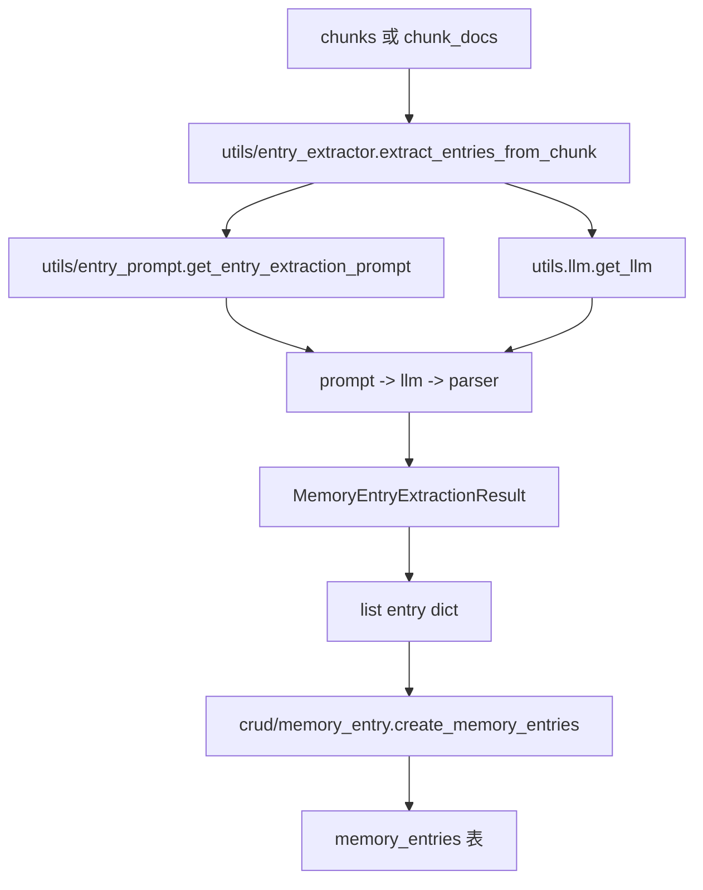
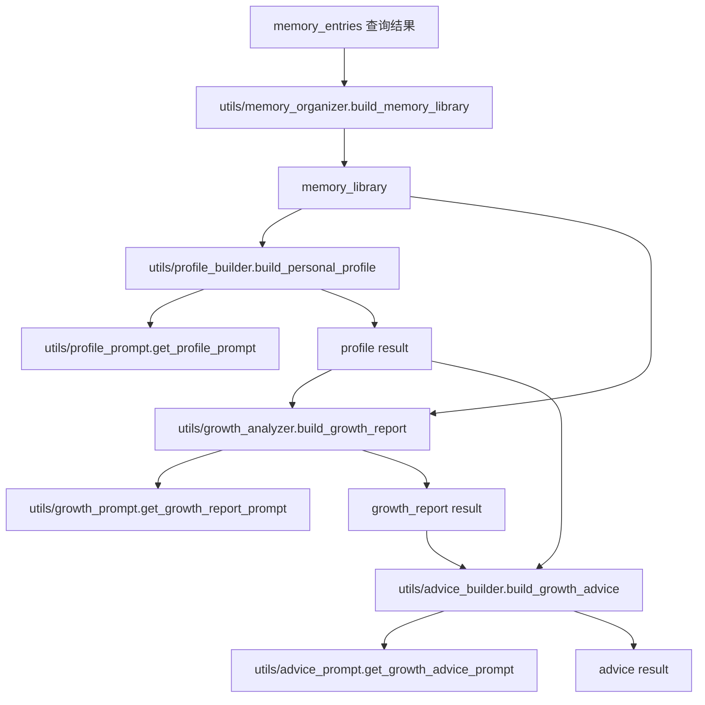
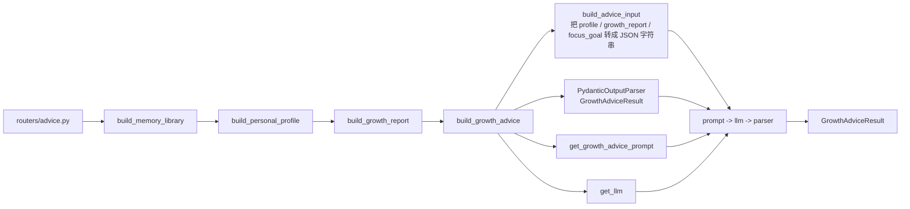
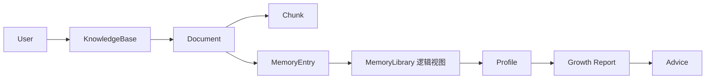

# Agentic RAG 流程图与 ER 图

这份文档专门用来拆开项目里最容易混的几段链路，尤其是：

- `file_loader -> text_splitter -> create_chunks`
- `chunk -> entry`
- `memory_library -> profile -> growth_report -> advice`

如果只记一件事，先记住这个区别：

- `file_loader` 产出的是 `LangChain Document`
- `text_splitter` 产出的是“切碎后的 `LangChain Document`”
- `create_chunks` 才会把它们真正写进数据库里的 `chunks` 表

再补一个现在很关键的建模变化：

- 对外 API 继续使用 `kb_xxx`、`doc_xxx` 这类字符串业务 ID
- 数据库内部新增了 bigint surrogate key，热点关系与查询开始转向内部数值键

## 1. 总览图

```mermaid
flowchart LR
    A[上传文件<br/>routers/documents.py upload_document] --> B[documents 表落库<br/>crud/document.create_document]
    B --> C[索引入口<br/>utils/index_service.index_document]
    C --> D[读取原文件<br/>utils/file_loader.load_langchain_documents]
    D --> E[切分 chunk_docs<br/>utils/text_splitter.split_documents]
    E --> F[chunks 表落库<br/>crud/chunk.create_chunks]
    E --> G[写入 Milvus 向量库<br/>utils/vector_store.add_documents_to_vector_store]
    G --> H[RAG 检索问答<br/>utils/retriever + utils/rag_service]

    E -. 代码已实现但当前未接入 index_document .-> I[词条抽取<br/>utils/entry_extractor.extract_entries_from_chunks]
    I -.-> J[memory_entries 表落库<br/>crud/memory_entry.create_memory_entries]
    J --> K[memory_library<br/>utils/memory_organizer.build_memory_library]
    K --> L[profile<br/>utils/profile_builder]
    L --> M[growth_report<br/>utils/growth_analyzer]
    M --> N[advice<br/>utils/advice_builder]
```



## 2. 前半段最容易混的对象

| 阶段 | 真实对象 | 主要内容 | 代表文件 |
| --- | --- | --- | --- |
| 上传阶段 | `UploadFile` | 浏览器上传过来的文件流 | `routers/documents.py` |
| loader 后 | `list[LangChain Document]` | `page_content + metadata`，还没入库 | `utils/file_loader.py` |
| splitter 后 | `list[LangChain Document]` | 还是 LangChain Document，只是每条变成 chunk | `utils/text_splitter.py` |
| chunk 入库后 | `list[Chunk ORM]` | 真正写入 PostgreSQL 的 `chunks` 表记录 | `crud/chunk.py` |
| 向量入库后 | Milvus 文档记录 | 用 chunk 文本和 metadata 建向量索引 | `utils/vector_store.py` |
| entry 抽取后 | `list[dict]` | 从 chunk 总结出的记忆词条 | `utils/entry_extractor.py` |
| entry 入库后 | `list[MemoryEntry ORM]` | 真正写入 `memory_entries` 表 | `crud/memory_entry.py` |

## 3. `file_loader -> text_splitter -> create_chunks` 详细流程



### 这里每层到底在做什么

- `utils/file_loader.py` 只负责“把文件读出来”，统一变成 LangChain `Document`
- `utils/text_splitter.py` 只负责“把长文本切碎”，输出仍然是 LangChain `Document`
- `crud/chunk.py` 负责把 `chunk_docs` 变成数据库里的 `Chunk` 行
- `utils/vector_store.py` 负责把同一批 `chunk_docs` 写进 Milvus，供后面检索

## 4. `file_loader` 和 `text_splitter` 为什么看起来像重复



一句话理解：

- `loader` 解决“怎么读”
- `splitter` 解决“怎么切”

## 5. `chunk -> entry` 支线图

这条链路的代码已经写出来了，但当前 `utils/index_service.py` 还没有真正调用它。



### entry 里装的是什么

- `entry_name`：词条名，比如“FastAPI 后端开发”
- `entry_type`：类型，只允许 `theme / event / ability / emotion / stage`
- `summary`：对这条词条的简述
- `evidence_text`：它来自哪段原文
- `importance_score`：重要性分数

## 6. `memory -> profile -> growth -> advice` 流程图

按当前模块组织，这条链路是这样串起来的。



### 这一段的角色分工

- `memory_organizer`：把一堆零散 `memory_entries` 整成 `memory_library`
- `profile_builder`：从长期记忆里抽出“这个人长期像什么”
- `growth_analyzer`：把时间线分成较早阶段和最近阶段，分析变化
- `advice_builder`：把 `profile + growth_report + focus_goal` 拼起来，让模型给出建议

## 7. `advice_builder -> advice_prompt` 细化图



## 8. 当前代码里一个容易忽略的事实

`profile`、`analysis`、`advice` 这几个路由虽然都带了 `knowledge_base_id`，但当前实现里实际查询 entry 时，主要用的是：

- `list_memory_entries_by_user_id(db, user_id=current_user.id)`

也就是说，按当前代码逻辑，它们更接近：

- 先拿“当前用户全部 memory_entries”
- 再生成 `memory_library`
- 再把 `knowledge_base_id` 当作上下文参数传给后面的 builder

如果你以后觉得“为什么接口是知识库级，但画像像是用户级”，问题大概率就在这里。

## 9. 数据库 ER 图

这是“按当前 ORM 模型定义”的主 ER 图。

其中：

- `id` 仍然是对外公开的业务 ID
- `pk` 是新增的内部数值键，主要给数据库关系和查询优化用

```mermaid
erDiagram
    USERS ||--o{ KNOWLEDGE_BASES : owns
    USERS ||--o{ DOCUMENTS : uploads
    USERS ||--o{ MEMORY_ENTRIES : owns
    USERS ||--o{ CHAT_SESSIONS : starts

    KNOWLEDGE_BASES ||--o{ DOCUMENTS : contains
    KNOWLEDGE_BASES ||--o{ MEMORY_ENTRIES : scopes
    KNOWLEDGE_BASES ||--o{ CHAT_SESSIONS : hosts

    DOCUMENTS ||--o{ CHUNKS : splits_into
    DOCUMENTS ||--o{ MEMORY_ENTRIES : yields

    USERS {
        bigint id PK
        string username
        string display_name
        string password_hash
        string avatar_url
        datetime last_login_at
        datetime created_at
        datetime updated_at
    }

    KNOWLEDGE_BASES {
        bigint pk UK
        string id PK
        bigint user_id FK
        string name
        text description
        bool is_default
        datetime created_at
        datetime updated_at
    }

    DOCUMENTS {
        bigint pk UK
        string id PK
        bigint user_id FK
        string knowledge_base_id
        bigint knowledge_base_pk FK
        string file_name
        string file_path
        string file_type
        int file_size
        string status
        datetime created_at
        datetime updated_at
    }

    CHUNKS {
        bigint pk UK
        string id PK
        string document_id
        bigint document_pk FK
        int chunk_index
        text content
        int page_no
        int start_offset
        int end_offset
        datetime created_at
        datetime updated_at
    }

    MEMORY_ENTRIES {
        string id PK
        bigint user_id FK
        string knowledge_base_id
        bigint knowledge_base_pk FK
        string document_id
        bigint document_pk FK
        string chunk_id
        string entry_name
        string entry_type
        text summary
        text evidence_text
        float importance_score
        datetime created_at
        datetime updated_at
    }

    CHAT_SESSIONS {
        string id PK
        bigint user_id FK
        string knowledge_base_id
        bigint knowledge_base_pk FK
        string title
        datetime created_at
        datetime updated_at
    }

    TASK_RECORDS {
        string id PK
        string task_type
        string target_id
        string status
        text error_message
        datetime created_at
        datetime updated_at
    }
```

补一句容易忽略的点：

- `memory_entries.chunk_id` 目前只是字符串字段，用来逻辑上指向 chunk，但 ORM 里还没有把它声明成 `ForeignKey("chunks.id")`

## 10. 这张 ER 图里最值得记的主链



## 11. 你可以怎么读这个项目

建议按下面顺序看，最不容易绕晕：

1. 先看 `routers/documents.py`，理解“入口在哪里”
2. 再看 `utils/index_service.py`，理解“索引主流程怎么串”
3. 然后看 `utils/file_loader.py` 和 `utils/text_splitter.py`，理解“对象怎么变形”
4. 再看 `crud/chunk.py`，理解“什么时候真正入库”
5. 最后再看 `utils/entry_extractor.py`、`utils/memory_organizer.py`、`utils/profile_builder.py`

如果你愿意，下一步我可以继续帮你补一版：

- “按文件逐个解释版”，把每个 util 的输入输出写成清单
- 或者“只画前半段大图”，专门把 `loader / splitter / chunk / vector_store` 再拆得更细
