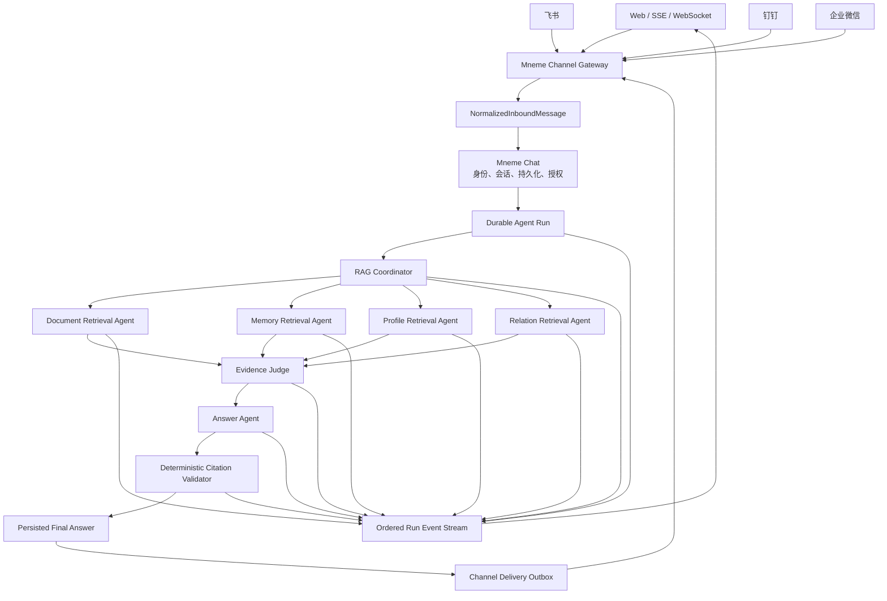

# Memoria 流式交互、多渠道与多 Agent 优化路线

> 状态：Phase 1–4 implemented and verified
> 日期：2026-07-18
> 适用范围：`app/mneme/memoria`、Mneme Chat、前端工作区与后续渠道接入层

> Phase 4 完成于 2026-07-19：Multi-Agent 改为会话级显式可选且默认关闭；
> durable run 固化本次选择；服务端总开关支持灰度与紧急回滚；确定性 A/B
> 报告覆盖质量、路由、证据裁决、安全、延迟、token 与成本发布门槛。

## 1. 核心判断

Memoria 的目标不是成为 AtlasClaw、Codex Harness 或通用 Skill 平台。

Memoria 应继续保持一个边界清晰的 RAG Agent：

```text
以可信证据为输入
以可验证引用为约束
以可恢复运行为基础
以流式交互、多渠道接入和有界多 Agent 协作为增强
```

本轮优化只围绕三个方向：

1. **流式交互**：把当前“阶段事件 + 最终结果”升级为可恢复的 RAG 原生事件流。
2. **多渠道**：通过 Mneme 边缘适配层接入 WebSocket、飞书、钉钉、企业微信等入口，Memoria 保持渠道无关。
3. **多 Agent**：围绕多来源检索、证据裁决和答案生成建立固定角色、严格预算、可评测的协作链。

本路线不把以下能力纳入主线：

- 通用 Skill Registry；
- 动态插件市场；
- 任意工具发现与安装；
- MCP/Harness 兼容层；
- 浏览器、终端、文件系统等通用执行工具；
- 任意层级的子 Agent 自主繁殖；
- 通用 Agent 管理后台。

这些能力属于上层 Harness，而不是 Memoria 的 RAG 核心职责。

---

## 2. 当前基础

Memoria 已经具备本路线需要复用的关键基础。

### 2.1 持久化运行链

现有主链为：

```text
HTTP / Heartbeat / domain hook
  -> PostgreSQL agent_runs
  -> Redis session FIFO + lease
  -> Celery worker
  -> Memoria answer runtime
  -> persisted chat exchange + runtime events
  -> Outbox
  -> in-app notification
```

这条链继续作为唯一可信执行路径，不新增第二套前台 Agent 运行时。

### 2.2 已有运行能力

- 按 owner、session 和 knowledge base 隔离运行；
- 稳定 request ID 与幂等重放；
- 阶段超时、取消传播和错误码归一化；
- stale queued/running run 恢复；
- 有限推理步数和总输出 token 预算；
- 受控读工具和 proposal-only 写操作；
- 引用验证、证据不足判定和回答质量评测；
- PostgreSQL 作为恢复事实来源；
- Redis 只负责协调与实时投影；
- Celery 负责后台执行。

### 2.3 当前不足

- SSE 主要发布 phase 和 final，缺少答案增量、检索进度和断线续传；
- Web 产品是主要入口，尚未形成统一渠道消息合同；
- 多来源检索仍由一个 Agent/一次主流程组织；
- 没有独立 Evidence Judge 对多来源证据做冲突、覆盖度和预算裁决；
- 没有多 Agent 共享 deadline、token、调用次数和费用预算；
- 现有评测尚未覆盖多 Agent 路由收益与协作成本。

---

## 3. 目标架构



### 3.1 关键边界

#### Memoria 负责

- RAG 路由与检索计划；
- 多 Agent 检索协作；
- Evidence Judge；
- 上下文与证据预算；
- 答案生成；
- 引用与证据约束；
- Agent 运行事件；
- Agent 质量评测。

#### Mneme Chat 负责

- 用户身份与权限上下文；
- 会话和消息持久化；
- conversation snapshot；
- durable run 提交；
- 最终 assistant message 落库；
- 渠道消息与系统用户的绑定；
- 渠道投递 Outbox。

#### Channel Gateway 负责

- 协议接入；
- webhook 签名验证；
- 入站消息归一化；
- 渠道消息幂等；
- 出站格式适配；
- 长消息拆分；
- Markdown/附件降级；
- 发送失败重试。

Channel Gateway 不负责检索、提示词、模型调用、引用验证或多 Agent 调度。

---

## 4. Phase 1：Streaming RAG

### 4.1 目标

把当前直接 SSE 升级成“持久化事实 + Redis 实时投影 + 可重放游标”的 RAG 原生事件流。

流式断开不能终止后台 run，也不能导致最终答案丢失。

### 4.2 事件合同

建议新增显式的事件类型，而不是继续依赖任意字符串：

```python
from enum import StrEnum


class AgentRunEventType(StrEnum):
    RUN_STARTED = "run.started"
    QUERY_REWRITTEN = "query.rewritten"
    RETRIEVAL_STARTED = "retrieval.started"
    RETRIEVAL_SOURCE_COMPLETED = "retrieval.source_completed"
    EVIDENCE_SELECTED = "evidence.selected"
    ANSWER_STARTED = "answer.started"
    ANSWER_DELTA = "answer.delta"
    CITATION_RESOLVED = "citation.resolved"
    ANSWER_COMPLETED = "answer.completed"
    RUN_FAILED = "run.failed"
    RUN_CANCELLED = "run.cancelled"
```

事件模型至少包含：

```python
class AgentRunEvent(BaseModel):
    run_id: str
    sequence: int
    type: AgentRunEventType
    created_at: datetime
    agent_role: str | None = None
    phase: str | None = None
    public_payload: dict[str, Any] = Field(default_factory=dict)
```

### 4.3 公共事件安全边界

允许公开：

- 阶段名称；
- 数据源类型；
- 候选证据数量；
- 去重后证据数量；
- 耗时；
- 当前降级状态；
- 模型输出文本增量；
- 最终引用；
- sanitized error code；
- token/费用的聚合统计。

禁止公开：

- 隐藏 chain-of-thought；
- 完整系统提示词；
- 原始数据库查询；
- 未裁剪的检索证据；
- API key、服务 token 或上游凭证；
- 其他 owner 的任何标识；
- 模型内部 review note；
- 未完成候选答案的完整快照。

### 4.4 运行链

```text
Agent Runtime
  -> append durable runtime event
  -> publish Redis event projection
  -> SSE/WebSocket consumer receives event
  -> client stores last sequence
  -> reconnect with Last-Event-ID
  -> server replays missing durable events
```

PostgreSQL 中的终态记录和最终 response 仍然是事实来源。Redis 消息可以丢失，但不能影响恢复。

### 4.5 前端行为

前端需要区分：

- `run status`：排队、执行、成功、失败、取消；
- `retrieval progress`：正在查询哪些来源、各来源结果数量；
- `assistant draft`：仅由 `answer.delta` 构造；
- `persisted answer`：终态后重新读取数据库消息；
- `reconnect state`：断线、恢复、游标追赶；
- `degraded state`：部分来源失败但仍生成答案。

终态到达后，前端必须用持久化消息替换流式草稿，避免客户端草稿与数据库最终版本不一致。

### 4.6 文件映射

优先小步修改：

- 修改 `app/mneme/memoria/events.py`
  - 定义稳定事件类型和公共 payload。
- 修改 `app/mneme/memoria/models/runtime_event.py`
  - 增加 sequence、agent_role 和事件版本。
- 修改 `app/mneme/memoria/persistence/runs.py`
  - 提供游标读取和终态事件写入。
- 修改 `app/mneme/memoria/run_service.py`
  - 在 durable run 周期发布统一事件。
- 修改 `app/mneme/memoria/server/api/answers.py`
  - 将 direct stream 对齐统一事件合同。
- 修改 `app/mneme/memoria/server/runtime/orchestrator.py`
  - 通过 callback/emitter 发布细粒度 RAG 事件。
- 修改 `app/mneme/memoria/server/providers/llm.py`
  - 支持受控答案 delta，不暴露 review note。
- 修改 `app/mneme_frontend_v0.2.1/src/types.ts`
  - 增加事件联合类型。
- 修改 `app/mneme_frontend_v0.2.1/src/lib/api.ts`
  - 支持 Last-Event-ID/sequence 恢复。
- 修改 `app/mneme_frontend_v0.2.1/src/composables/useMnemeWorkspace.ts`
  - 管理草稿、恢复、取消和终态刷新。

### 4.7 验收标准

- [x] 用户能在答案生成过程中看到增量文本。
- [x] 用户能看到数据源级检索进度，但看不到私有证据正文。
- [x] SSE 断开后 run 继续执行。
- [x] 客户端带游标重连后不会丢事件或重复拼接文本。
- [x] 取消信号能传播到等待、检索和模型生成阶段。
- [x] 最终 UI 内容与数据库持久化消息一致。
- [x] Redis 丢失时可以从 PostgreSQL 恢复终态与关键事件。
- [x] 所有事件均不包含 prompt、凭证和隐藏推理。

实现说明（2026-07-18）：答案增量采用“结构化生成与引用校验通过后再分块发布”的安全策略，
不直接透传模型 provider 的原始 token 流；这样仍能提供稳定的 `answer.delta` 交互，同时避免泄露
未完成 JSON、内部 review note 或随后可能被校验拒绝的候选答案。

---

## 5. Phase 2：Multi-Channel Gateway

### 5.1 目标

让同一个 Mneme 会话与 Memoria run 能被多个渠道使用，同时保证身份、幂等、授权和投递可靠性。

Memoria answer runtime 不感知渠道类型。

### 5.2 统一入站合同

```python
class NormalizedInboundMessage(BaseModel):
    channel: str
    account_id: str
    conversation_id: str
    thread_id: str | None = None
    sender_id: str
    message_id: str
    text: str
    attachments: list["NormalizedAttachment"] = Field(default_factory=list)
    reply_to_message_id: str | None = None
    metadata: dict[str, Any] = Field(default_factory=dict)
```

幂等键：

```text
channel + account_id + message_id
```

会话映射键：

```text
channel + account_id + conversation_id + optional thread_id
```

### 5.3 身份绑定

渠道身份不能直接作为 `owner_id`。

需要持久化：

```text
ChannelIdentity
├─ channel
├─ account_id
├─ external_user_id
├─ mneme_user_id
├─ verified_at
├─ status
└─ metadata
```

所有入站消息必须先解析到 Mneme 用户，再由现有授权上下文提交 Agent run。

### 5.4 出站投递

```text
Persisted final answer
  -> channel_delivery Outbox row
  -> delivery worker
  -> channel adapter
  -> success / retry / dead-letter
```

Agent run 成功不等于渠道发送成功。二者必须使用不同状态：

- `agent_run.status`；
- `channel_delivery.status`。

渠道故障不能把已经完成的 Agent run 标记为失败。

### 5.5 Adapter 接口

```python
class ChannelAdapter(Protocol):
    channel: str

    async def verify_inbound(self, request: Request) -> None: ...

    async def parse_inbound(self, request: Request) -> list[NormalizedInboundMessage]: ...

    async def send(self, delivery: ChannelDelivery) -> ChannelSendResult: ...

    async def render_answer(self, answer: PersistedAnswer) -> list[OutboundPart]: ...
```

第一阶段只实现一个外部渠道，建议优先选择真实使用需求最强的飞书或钉钉，不要同时铺开所有 SDK。

### 5.6 渠道降级策略

每个 Adapter 必须处理：

- Markdown 不兼容；
- 超长文本拆分；
- 引用链接格式；
- 图片和附件；
- 回复线程；
- 频率限制；
- webhook 重复；
- API 超时；
- token 失效；
- 部分消息发送成功。

### 5.7 文件映射

建议新增：

```text
app/mneme/channels/
├─ __init__.py
├─ contracts.py
├─ identities.py
├─ inbound.py
├─ delivery.py
├─ registry.py
└─ adapters/
   ├─ __init__.py
   └─ feishu.py            # 第一阶段示例
```

建议修改：

- `app/mneme/bootstrap/router_registry.py`
  - 注册渠道 webhook 路由。
- `app/mneme/domains/chat/service.py`
  - 将归一化入站消息转换为持久化用户消息和 durable run。
- `app/mneme/domains/tasks/outbox.py`
  - 分发 channel delivery。
- `app/mneme/memoria/chat_bridge.py`
  - 保持 Agent 结果到 Chat 的单一落库路径。
- `app/mneme/conf/config.py`
  - 增加渠道配置和密钥引用，不存储明文输出。

### 5.8 验收标准

- [x] 同一 webhook 重试不会创建重复用户消息或重复 run。
- [x] 外部用户必须绑定 Mneme 用户后才能访问私有知识库。
- [x] 渠道 Adapter 无法扩大 owner 或 knowledge-base scope。
- [x] 渠道发送失败可以独立重试。
- [x] Agent run 完成后即使渠道不可用，最终答案仍可在 Web 端查看。
- [x] 长答案、引用和附件能按渠道能力正确降级。
- [x] 渠道 SDK 代码不进入 `app/mneme/memoria/server`。

实现说明（2026-07-18）：

- 首个 Adapter 为飞书，默认关闭，只有配置验证 token 和应用凭证后才启用。
- Webhook 只负责验签、归一化和幂等落库，实际绑定或 run 提交进入 `channel_delivery` Celery 队列。
- 身份绑定采用 Web 端生成短期码、外部账号发送 `/mneme bind CODE` 的双端证明。
- 新绑定会话默认是 `general_chat`；私有知识库必须由登录用户通过渠道会话配置 API 显式选择。
- 多个渠道会话可以映射到同一个、且属于当前登录用户的 Mneme ChatSession；已有消息的会话
  只允许保持原 knowledge-base scope 和 answer mode，不能借重新映射改变历史授权边界。
- 投递使用独立 `channel_deliveries` 状态机，支持指数退避、部分成功续传、陈旧任务恢复、
  dead-letter 和登录用户手动重试。
- 飞书文本输出执行 Markdown 纯文本降级、长消息拆分和引用摘要；暂不从飞书下载附件，
  而是明确提示用户改由 Web 端上传，避免把未验证附件直接带入私有 RAG。

---

## 6. Phase 3：Bounded Multi-Agent RAG

### 6.1 目标

使用固定角色、多来源并行检索和 Evidence Judge 提升复杂 RAG 问题的覆盖度与冲突处理能力。

多 Agent 不是默认路径。简单问题继续使用当前单 Agent 快路径。

### 6.2 角色

#### RAG Coordinator

负责：

- 判断是否需要 multi-agent；
- 选择需要查询的证据来源；
- 生成来源级子问题；
- 分配 top-k、token 和 deadline；
- 聚合子任务状态；
- 决定是否允许一次补充检索。

不负责：

- 直接读取数据库；
- 绕过 owner/KB scope；
- 生成最终事实回答；
- 创建更多 Coordinator；
- 调用写工具。

#### Retrieval Agents

第一阶段固定四种：

- `document_retriever`；
- `memory_retriever`；
- `profile_retriever`；
- `relation_retriever`。

它们只返回结构化证据包：

```python
class EvidenceBundle(BaseModel):
    agent_role: str
    source_type: str
    query: str
    evidence: list[RetrievedEvidence]
    coverage: float
    uncertainty: list[str] = Field(default_factory=list)
    elapsed_ms: int
    degraded: bool = False
```

Retrieval Agent 不生成面向用户的长答案。

#### Evidence Judge

负责：

- 跨来源去重；
- 证据冲突检测；
- 证据与问题相关性排序；
- 来源覆盖度判断；
- 保留/淘汰原因；
- 上下文预算裁剪；
- 决定是否需要一次补充检索；
- 生成 `JudgedEvidenceSet`。

不负责：

- 改写证据内容；
- 伪造引用；
- 把历史 assistant 文本提升为证据；
- 访问未被 Coordinator 选择的数据源。

#### Answer Agent

只消费：

- 当前问题；
- bounded conversation snapshot；
- `JudgedEvidenceSet`；
- answer mode；
- 输出合同。

最终结果继续通过确定性 Citation Validator。

### 6.3 为什么不是所有步骤都做成 Agent

以下步骤继续使用确定性服务：

- owner/KB 权限过滤；
- 引用格式验证；
- 证据 ID 校验；
- token 预算计算；
- 向量与关键词融合；
- stale run 恢复；
- 幂等与租约；
- 敏感字段清洗；
- 事件 sequence 分配。

只有需要根据不确定上下文选择策略、并且输出可以被合同验证的步骤才使用模型。

### 6.4 共享预算

建议第一阶段硬限制：

```text
Coordinator                <= 1
Retrieval Agents           <= 4
Supplemental retrieval     <= 1 round
Evidence Judge             <= 1
Answer Agent               <= 1
Nested agent spawning      = 0
Write tools                = disabled
```

所有角色共享：

- run deadline；
- aggregate prompt token budget；
- aggregate completion token budget；
- aggregate retrieval top-k；
- aggregate model-call count；
- estimated cost ceiling；
- cancellation signal。

任一角色不能自行扩大预算。

### 6.5 快慢路径

```text
Simple question
  -> existing single-agent RAG
  -> citation validation

Complex / multi-source / conflict-prone question
  -> Coordinator
  -> parallel Retrieval Agents
  -> Evidence Judge
  -> Answer Agent
  -> citation validation
```

Multi-agent 触发依据应来自可评测的结构化判定，例如：

- 明确要求比较多个来源；
- 问题包含多个独立实体或时间范围；
- 单次检索覆盖度不足；
- 证据存在冲突；
- answer mode 要求跨 memory/document/profile/relations；
- 用户显式请求深度检索。

不要在核心代码里堆积大量中文/英文关键词表。

### 6.6 并发与降级

并行 Retrieval Agent 使用结构化并发：

- 父 run 取消时统一取消子任务；
- 每个来源有独立 timeout；
- 失败来源记录 sanitized error；
- 允许部分来源成功；
- Evidence Judge 明确知道缺失来源；
- 只有必需来源全部失败时整体失败；
- 降级回答必须在 uncertainty 中说明覆盖范围不足。

### 6.7 文件映射

建议新增：

```text
app/mneme/memoria/server/multi_agent/
├─ __init__.py
├─ contracts.py
├─ budget.py
├─ coordinator.py
├─ executor.py
├─ evidence_judge.py
└─ roles/
   ├─ __init__.py
   ├─ documents.py
   ├─ memories.py
   ├─ profile.py
   └─ relations.py
```

建议修改：

- `app/mneme/memoria/server/runtime/plans.py`
  - 增加单 Agent/多 Agent 执行计划，不增加通用 Skill 计划。
- `app/mneme/memoria/server/runtime/contracts.py`
  - 增加 execution mode、共享预算和 judged evidence 合同。
- `app/mneme/memoria/server/runtime/orchestrator.py`
  - 委托单 Agent pipeline 或 multi-agent executor。
- `app/mneme/memoria/server/runtime/retriever.py`
  - 复用现有 source-specific 检索，不复制检索实现。
- `app/mneme/memoria/server/providers/llm.py`
  - 将 Coordinator、Judge、Answer 的 prompt 与结构化输出分离。
- `app/mneme/memoria/server/repositories/runs.py`
  - 持久化 sanitized role attempts、预算和 stop reason。
- `app/mneme/memoria/server/observability/metrics.py`
  - 增加角色级延迟、费用、失败和降级指标。

### 6.8 验收标准

- [x] 简单问题默认不进入 multi-agent 路径。
- [x] 多来源问题可以并行检索。
- [x] 所有 Retrieval Agent 都继承同一个 owner/KB scope。
- [x] 子 Agent 不能创建新的 Agent。
- [x] 总调用数、token、费用和 deadline 都有硬上限。
- [x] 单个非必需来源失败时可以返回降级答案。
- [x] Evidence Judge 能输出保留、淘汰和冲突信息。
- [x] 最终引用只来自 JudgedEvidenceSet。
- [x] 多 Agent 事件可以通过 Phase 1 的事件流展示。
- [x] 不记录 chain-of-thought、原始 prompt 或未裁剪证据。

---

## 7. Phase 4：Multi-Agent Evaluation

### 7.1 目标

证明 multi-agent 相比单 Agent 确实提升了 RAG 质量，而不只是增加模型调用。

### 7.2 新增指标

在现有 answer gates 和 agent gates 基础上增加：

- `route_accuracy`：是否选择正确的单/多 Agent 路径；
- `source_selection_precision`；
- `source_selection_recall`；
- `duplicate_retrieval_ratio`；
- `empty_agent_ratio`；
- `evidence_conflict_detection_rate`；
- `judge_keep_precision`；
- `judge_drop_precision`；
- `citation_validity`；
- `grounded_answer_rate`；
- `partial_failure_recovery_rate`；
- `quality_gain_vs_single_agent`；
- `latency_increase_vs_single_agent`；
- `token_increase_vs_single_agent`；
- `cost_increase_vs_single_agent`。

### 7.3 发布门槛

建议 multi-agent 默认关闭，通过 feature flag 灰度。

进入默认路径前至少满足：

- 复杂问题 grounded answer rate 有稳定提升；
- 引用正确率不下降；
- 简单问题误路由率低于约定阈值；
- 延迟和费用增幅在预算内；
- 单来源失败可稳定降级；
- 不出现 owner/KB scope 越界；
- 不出现 action safety violation；
- 不泄漏 prompt、证据正文或隐藏推理。

### 7.4 A/B 基线

每个评测案例同时运行：

```text
Baseline: current single-agent RAG
Candidate: bounded multi-agent RAG
```

只有 Candidate 在质量、覆盖度或冲突处理上有显著收益时，才保留 multi-agent 路径。

### 7.5 实现结果

- [x] 用户可为每个聊天会话显式开启或关闭 Multi-Agent，默认关闭。
- [x] `analysis_query` 不再因为 `auto` 隐式进入 Multi-Agent。
- [x] durable run 持久化 `single` / `multi`，队列恢复不读取后来变更的偏好。
- [x] 服务端 feature flag 可强制回退到 single-agent。
- [x] 固定 A/B 数据集同时评估 Baseline 与 Candidate。
- [x] 路由、来源选择、重复检索、空 Agent、冲突检测、Judge、引用、grounding、
  部分失败、质量、延迟、token、费用、scope 与 action safety 均进入报告。
- [x] Multi-Agent gates 与现有 answer gates、agent gates 共同决定 CLI 退出码。

---

## 8. 分阶段实施顺序

### Milestone 1：稳定事件合同

- 统一事件模型；
- 事件 sequence；
- PostgreSQL 重放；
- Redis 实时投影；
- SSE 游标恢复；
- 不改变现有回答语义。

### Milestone 2：答案增量与前端恢复

- provider delta；
- `answer.delta`；
- 前端草稿；
- 断线追赶；
- 终态消息替换草稿；
- 取消传播。

### Milestone 3：单一外部渠道

- normalized inbound contract；
- identity binding；
- webhook 幂等；
- delivery Outbox；
- 一个真实 Adapter；
- 发送失败重试。

### Milestone 4：多来源并行检索

- 先不引入 Coordinator 模型；
- 使用确定性 plan 并行调用 source retriever；
- 统一 EvidenceBundle；
- 验证并发、超时和部分失败。

### Milestone 5：Evidence Judge

- 冲突检测；
- 去重与预算裁剪；
- judged evidence contract；
- Judge 评测集。

### Milestone 6：RAG Coordinator

- 单/多 Agent 路由；
- 来源选择；
- 子问题生成；
- 一次补充检索；
- 全局预算控制。

### Milestone 7：灰度与评测

- [x] feature flag；
- [x] 单/多 Agent A/B；
- [x] 质量、延迟和费用指标；
- [x] 回滚开关；
- [x] 会话级用户选择，并仅在支持多来源的 Analysis 模式开放前端入口。

---

## 9. 迁移原则

### 9.1 复用

- 复用现有 durable `agent_runs`；
- 复用 Redis session FIFO 和 lease；
- 复用 Celery run task；
- 复用 retrieval plan；
- 复用 source-specific retriever；
- 复用 citation validator；
- 复用 conversation snapshot；
- 复用 Outbox；
- 复用现有 eval runner。

### 9.2 小改

- 将事件从 phase/final 扩展为版本化事件；
- 将 provider 输出扩展为可选 delta；
- 将 retrieval result 包装成 EvidenceBundle；
- 将单一 orchestrator 拆成单 Agent 和 multi-agent 两条 pipeline；
- 将前端 run 状态改为游标驱动。

### 9.3 暂不修改

- 不引入通用 Skill 目录；
- 不引入动态 Agent 注册表；
- 不改变 Memoria service-token 边界；
- 不让渠道 Adapter 直接访问 Memoria 数据库；
- 不让子 Agent 直接写 Chat 表；
- 不让模型负责引用真实性最终判断；
- 不开放 write action executor；
- 不把 Redis 变成最终事实来源。

---

## 10. 风险与防线

### 风险 1：流式内容与最终消息不一致

防线：

- delta 只作为草稿；
- completed 后读取持久化 response；
- 客户端以终态消息覆盖草稿。

### 风险 2：渠道身份造成越权

防线：

- external identity 必须映射到 Mneme user；
- owner/KB scope 仍由 Mneme 授权上下文生成；
- Adapter 不接收或覆盖 owner ID。

### 风险 3：多 Agent 造成成本失控

防线：

- 共享 budget object；
- 父级 deadline；
- 固定最大角色数量；
- 禁止嵌套 spawn；
- 简单问题走单 Agent 快路径。

### 风险 4：多个 Agent 产生重复或冲突证据

防线：

- Evidence Judge；
- evidence ID 去重；
- source/version 元数据；
- 冲突标记；
- 引用只从 judged evidence 生成。

### 风险 5：把普通 pipeline 伪装成 Agent

防线：

- 确定性规则继续保留为服务；
- 只有策略选择和不确定性判断使用模型；
- 每个 Agent 必须有结构化输入输出和独立评测。

### 风险 6：事件流泄漏敏感信息

防线：

- public payload 白名单；
- 服务端统一清洗；
- 不直接序列化内部对象；
- 增加事件敏感字段测试。

---

## 11. 最终验收定义

这条路线完成后，Memoria 应达到以下状态：

```text
用户可以从 Web 或外部渠道发起问题
  -> Mneme 完成身份、会话和权限解析
  -> durable run 被可靠提交
  -> 用户实时看到检索与答案进度
  -> 复杂问题使用有界多 Agent 并行检索
  -> Evidence Judge 统一裁决证据
  -> Answer Agent 基于裁决后的证据生成答案
  -> Citation Validator 确定性验证引用
  -> 最终答案持久化
  -> Web 与外部渠道可靠收到结果
  -> 断线、worker 重启或渠道失败均可恢复
```

最终系统仍然是一个 RAG Agent，而不是 Harness：

- 核心价值是证据质量，不是工具数量；
- 核心自治是检索策略，不是任意系统操作；
- 核心协作是多来源证据处理，不是无限子 Agent；
- 核心可靠性来自持久化、幂等、预算、引用和评测；
- 上层 Harness 可以调用 Memoria，但不能反向污染 Memoria 的领域边界。

---

## 12. Phase 5：Runtime Experience（已实现）

本阶段只优化运行体验与 Agent 能力，不增加身份/RBAC、多租户、安全与凭据治理或配置控制面。

- [x] `interrupt` 复用 durable abort 语义；
- [x] `followup` 进入同会话 FIFO，并通过 trigger 关系关联原 run；
- [x] `steer` 采用诚实的“中止并按新方向重启”语义；
- [x] Web 生成期间可继续输入，并选择立即调整或排队追问；
- [x] 历史上下文同时受 turn count 与估算 token budget 约束；
- [x] compaction 产生不含正文的 `context.compacted` 事件；
- [x] 主模型连续失败时进入短暂 cooldown，并优先尝试 fallback；
- [x] 单 Agent 快路径、固定多 Agent 角色和只读工具边界保持不变。
