# Day 1 - Day 15 主体架构总览

这份文档只看两件事：

- Day 1 到 Day 15 每天到底把 Mneme 优化成了什么能力
- 这 15 天的能力最后拼成了一个什么样的任务化、可恢复、可扩展系统

这一版我刻意不展开 `model`、`crud`、表结构和具体任务参数这些实现细节，只保留主体架构和优化主线。

---

## 一句话总览

Day 1 到 Day 15，整个优化主线其实就是：

```text
把一个“同步式可运行 RAG 原型”
-> 做成“索引任务异步执行的后端”
-> 做成“可恢复、可治理、可扩展的基础 Harness”
-> 再预埋“记忆流水线、进阶 Harness 和 MCP 标准能力层”
```

---

## Day 1：明确优化边界

### Day 1 做成了什么

- 明确本轮优化不是推倒重构
- 确认主线是 `Celery + Redis`
- 把目标从“继续加功能”改成“升级执行模型和模块边界”

### Day 1 流程图


### 这一天的意义

Day 1 不是开始写 worker，  
而是在回答一个更根本的问题：

> Mneme 接下来到底是继续堆功能，还是先把运行底座做稳？

从这一天开始，项目目标从“能跑”转向“能稳定扩展”。

---

## Day 2：目标架构分层

### Day 2 做成了什么

- 明确 `routers / crud / models / schemas` 继续保留
- 新增 `services / pipelines / clients / infra` 的演进方向
- 把 `utils` 从业务承载层重新收敛为通用工具层

### Day 2 流程图


### 这一天的意义

Day 2 解决的是：

> 复杂业务逻辑以后应该放在哪里？

如果这一天不讲清楚，后面 Celery、状态机、检索优化和 MCP 都容易各写一套逻辑。

---

## Day 3：索引接口任务化

### Day 3 做成了什么

- 索引接口不再直接执行完整索引链路
- API 层只负责校验、创建任务、提交任务
- 用户拿到 `task_id`，后续通过状态接口查询进度

### Day 3 流程图

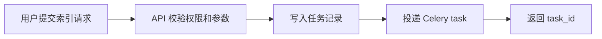

### 这一天的意义

Day 3 解决的是：

> 索引这种重任务，为什么不应该继续压在 HTTP 请求里？

从这一天开始，请求链路变短，真正的重活开始交给 worker。

---

## Day 4：Worker 接管索引执行

### Day 4 做成了什么

- Celery worker 开始消费索引任务
- 文档解析、切分、向量化、写入向量库进入后台执行
- API 和重任务执行之间形成清晰边界

### Day 4 流程图


### 这一天的意义

Day 4 解决的是：

> 谁来真正执行索引链路？

从这一天开始，Mneme 不再是“API 里串行跑重任务”的系统，而是有了后台执行模型。

---

## Day 5：索引链路批处理

### Day 5 做成了什么

- chunk 生成、embedding、vector upsert 开始按 batch 执行
- 批大小成为可调参数
- 索引吞吐不再完全依赖单条串行处理

### Day 5 流程图

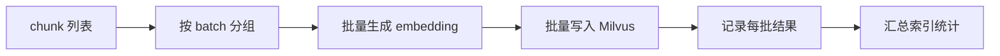

### 这一天的意义

Day 5 解决的是：

> 文档变大以后，索引链路怎么避免一条一条慢慢跑？

这一天让索引链路从“能完成”走向“有吞吐调优空间”。

---

## Day 6：幂等状态机

### Day 6 做成了什么

- 把任务状态显式拆成 `queued / parsing / chunking / embedding / vector_upserting / completed / failed`
- 每一步状态迁移都可记录、可校验
- 为失败重试、重复提交保护和问题定位打基础

### Day 6 流程图

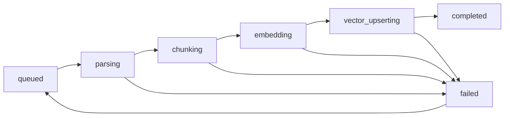

### 这一天的意义

Day 6 解决的是：

> 任务失败、重复提交、执行到一半中断时，系统到底知道自己在哪里吗？

从这一天开始，Mneme 的索引链路变得可恢复，而不只是“跑一次试试看”。

---

## Day 7：阻塞点迁移与对象缓存

### Day 7 做成了什么

- 文件解析、同步 I/O、embedding、Milvus 写入等阻塞点移出请求事件循环
- embedding model、vector store client、LLM client 开始复用
- 避免每次请求重复初始化重对象

### Day 7 流程图

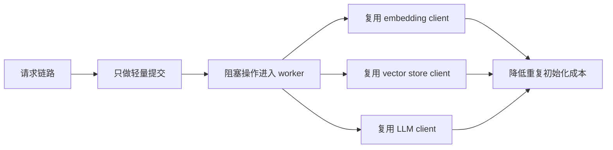

### 这一天的意义

Day 7 解决的是：

> 系统为什么会在并发稍微上来后变慢、卡住或资源抖动？

这一天让 Mneme 的执行模型真正开始适合生产化运行。

---

## Day 8：utils 轻量拆分

### Day 8 做成了什么

- 把业务动作迁入 `services/`
- 把多步骤流程迁入 `pipelines/`
- 把外部依赖访问迁入 `clients/`
- 把运行时能力迁入 `infra/`

### Day 8 流程图

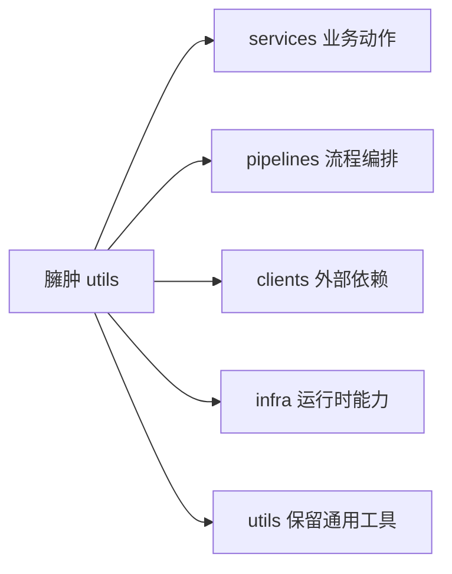

### 这一天的意义

Day 8 解决的是：

> `utils` 里什么都放，后面还怎么维护？

从这一天开始，Mneme 的模块边界不再只靠命名约定，而是有了清晰职责分层。

---

## Day 9：Context 组装治理

### Day 9 做成了什么

- 引入 `context_service`
- 检索结果开始做去重、相邻 chunk 合并、裁剪与必要压缩
- 上下文组装开始受 token budget 控制

### Day 9 流程图

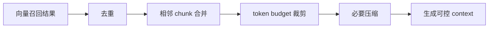

### 这一天的意义

Day 9 解决的是：

> RAG 回答时，为什么不能把 top-k 结果直接粗暴拼成长上下文？

这一天让问答链路从“能拼 context”变成“能治理 context”。

---

## Day 10：限流、熔断与退避重试

### Day 10 做成了什么

- 对上传、索引提交、问答请求建立基础限流
- 对 embedding、LLM、Milvus 等外部依赖建立熔断意识
- 对可恢复错误采用退避重试

### Day 10 流程图

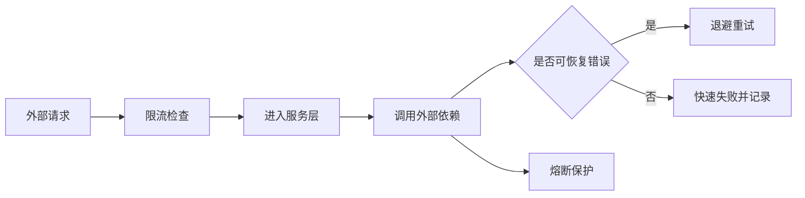

### 这一天的意义

Day 10 解决的是：

> 外部依赖变慢、失败或流量突然升高时，系统怎么避免被拖垮？

从这一天开始，Mneme 不只是能跑任务，而是开始具备基础运行时治理能力。

---

## Day 11：文档域流水线成型

### Day 11 做成了什么

- 明确文档域流水线：上传、解析、切分、embedding、向量入库
- `document_index_pipeline` 成为索引主流程承载层
- 文档索引链路和 API 入口进一步解耦

### Day 11 流程图


### 这一天的意义

Day 11 解决的是：

> 文档索引到底是一堆工具函数，还是一条清晰的业务流水线？

这一天让“文档变成知识库”的过程有了稳定承载位置。

---

## Day 12：记忆域流水线预埋

### Day 12 做成了什么

- 明确记忆域不应该混在文档索引链路里
- 预留 `memory_extract_pipeline` 和 `memory_service`
- 为 memory entry、profile snapshot、analysis 的异步化做准备

### Day 12 流程图

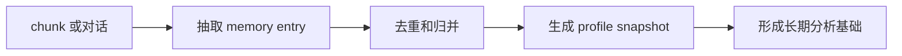

### 这一天的意义

Day 12 解决的是：

> Mneme 以后要做长期记忆时，能不能不污染现有文档索引主线？

从这一天开始，系统有了“文档域”和“记忆域”两条独立演进路线。

---

## Day 13：基础 Harness 完整闭环

### Day 13 做成了什么

- Runtime Harness：任务化、状态机、重试、限流、熔断初步闭环
- Context Harness：上下文治理初步闭环
- Module Boundary Harness：模块边界初步闭环
- Dual Pipeline Foundation：双流水线基础初步闭环

### Day 13 流程图

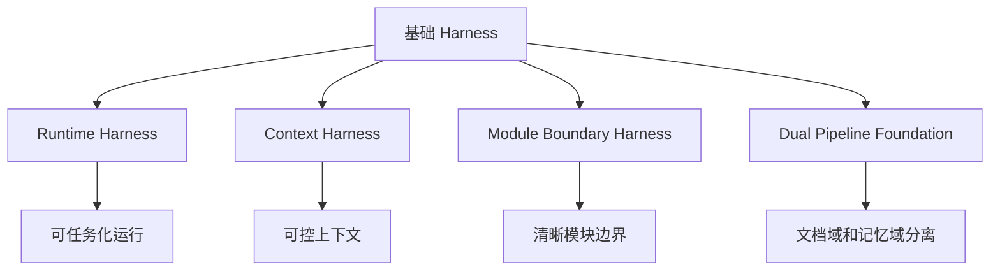

### 这一天的意义

Day 13 解决的是：

> 第一版 polish 到底是不是 Harness Engineering？

答案是：它不是完整的进阶 Harness，但它已经是 Harness Engineering 的基础层。

---

## Day 14：进阶 Harness 预埋

### Day 14 做成了什么

- 预埋 verification gate：索引、检索、memory 抽取后的自动检查
- 预埋 policy externalization：chunk、batch、retry、context packing 策略外置
- 预埋 observability / evaluation：任务耗时、失败原因、检索质量和问答质量可追踪

### Day 14 流程图

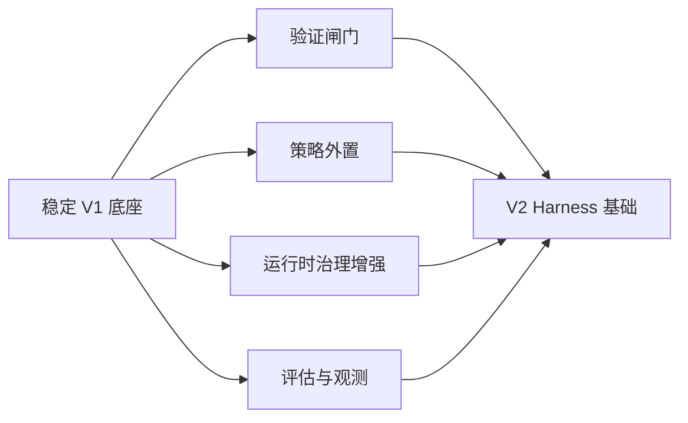

### 这一天的意义

Day 14 解决的是：

> 为什么不能在 V1 还没稳时直接做复杂 V2？

这一天的重点不是立刻堆复杂控制层，而是把 V2 需要的接口和观测点提前留好。

---

## Day 15：MCP 标准能力层预埋

### Day 15 做成了什么

- 明确 MCP 不替代任务队列、worker、状态机、限流和重试
- MCP 定位为 REST API 之外的标准化能力暴露层
- 预留 `mcp/` 模块，用于暴露 `search_kb`、`submit_index_task`、`get_index_task_status`、`query_memory` 等能力

### Day 15 流程图

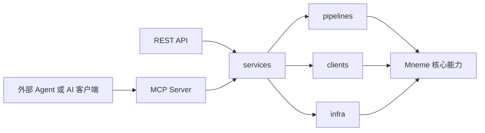

### 这一天的意义

Day 15 解决的是：

> Mneme 做稳以后，怎么变成可以被外部 Agent 标准化调用的能力节点？

从这一天开始，Mneme 的长期方向不只是内部 RAG 服务，而是可以成为外部 AI 应用生态中的 MCP 能力层。

---

## Day 1 - Day 15 串联总图

这一张图最重要。  
你后面复盘时，优先看这张。

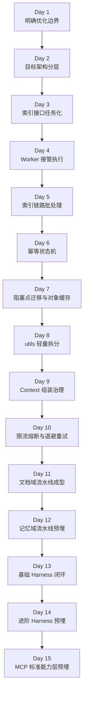

### 这 15 天到底是在搭什么

你可以把它理解成 5 个阶段：

- 第 1 阶段：确定优化方向
  - Day 1
  - Day 2

- 第 2 阶段：把索引链路任务化
  - Day 3
  - Day 4
  - Day 5
  - Day 6
  - Day 7

- 第 3 阶段：把模块边界和检索链路做稳
  - Day 8
  - Day 9
  - Day 10

- 第 4 阶段：建立文档域 / 记忆域双流水线
  - Day 11
  - Day 12
  - Day 13

- 第 5 阶段：为 V2 Harness 和 MCP 做预埋
  - Day 14
  - Day 15

---

## 最终系统总架构图

如果只看主体架构，不看任何细节，  
Day 1 到 Day 15 最后拼出来的是这样一个系统：

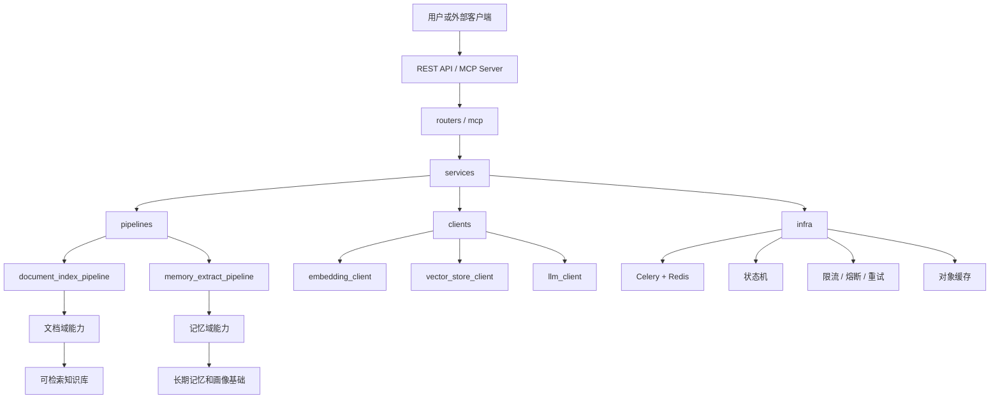

### 这张图要表达什么

最终你做出来的，不是一个“同步上传、同步索引、同步问答”的 RAG 原型，  
而是一个具备基础 Harness 能力的后端系统：

- API 层负责提交任务和查询状态
- worker 负责执行重任务
- pipeline 负责承载多步骤业务流程
- service 负责复用核心业务动作
- client 负责隔离外部依赖
- infra 负责支撑运行时治理
- MCP 在 V2 阶段负责标准化暴露能力

---

## 最小优化全链路图

如果你只想记住最关键的优化主线，就记这一张：


### 这一张图就是整个 Day 1 - Day 15 的灵魂

因为它把本轮优化最核心的价值浓缩成了一条线：

> 先把 Mneme 从同步原型做成稳定的任务化后端，再在稳定底座上演进记忆能力、进阶 Harness 和 MCP 标准集成。
