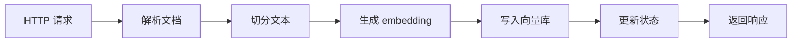
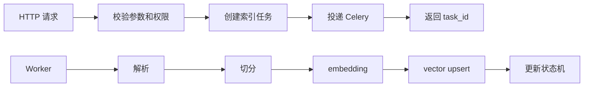

# Day 1：明确优化边界

## 今天的总目标

- 明确本轮优化不是推倒重构
- 确认优化主线是 `Celery + Redis`
- 把目标从“继续加功能”切换成“升级执行模型和模块边界”
- 找出当前 Mneme 最需要先治理的同步重任务和阻塞点
- 为 Day 2 的目标架构分层准备清晰边界

## 今天结束前，你必须拿到什么

- 一份你自己能讲清楚的优化边界认知
- 一张当前同步 RAG 链路的问题图
- 一张目标任务化链路的方向图
- 一份“不做什么”的边界清单
- 一份 Day 2 可以继续使用的架构分层输入

---

## 今天开始，先不要急着写 Celery

Day 1 最容易犯的错误就是：

- 一看到 `Celery + Redis` 就马上开始装依赖
- 一看到 `services / pipelines / clients / infra` 就马上新建目录
- 一看到 `utils` 复杂就马上大拆文件

这些都不是 Day 1 的重点。

今天真正要解决的是：

> 这次优化到底要解决什么问题？哪些地方必须改？哪些地方暂时不能动？

如果这个问题没讲清楚，后面很容易出现两种坏结果：

- 改得太少，只是把同步代码包了一层 task，问题仍然存在
- 改得太多，一上来就重构全项目，风险失控

所以 Day 1 的关键词不是“实现”，而是：

```text
边界
主线
风险
低风险增量优化
```

---

## 第 1 层：先把当前系统状态讲明白

Mneme 当前不是一个空项目。

它已经具备这些主干能力：

- 认证
- 知识库管理
- 文档上传
- 文档分块
- 向量索引
- 向量检索
- RAG 问答

这说明当前项目的问题不是：

> 功能完全没有，需要从零开始搭。

而是：

> 主链路已经跑通，但执行模型还偏同步，重任务容易压在 API 请求链路里。

这句话非常重要。

因为它决定了本轮优化不能按“新项目搭建”的方式来做，  
而应该按“已有系统低风险工程化升级”的方式来做。

---

## 第 2 层：这次优化到底不是什么

今天你要先排除几个错误方向。

### 不是全盘重构

本轮优化不应该把当前目录全部推倒重来。

这些现有层仍然要保留：

- `routers/`
- `crud/`
- `models/`
- `schemas/`

原因很简单：

- 它们已经承接了当前主链路
- 数据模型和接口形态已经存在
- 一上来大拆会制造大量回归风险

### 不是重新设计一个 RAG

当前已经有 RAG 主链路：

```text
上传文档
-> 解析和切分
-> embedding
-> 向量入库
-> 检索
-> 组织上下文
-> 大模型回答
```

Day 1 不是要否定这条链路。

本轮优化要做的是：

```text
让这条链路从“同步串行可运行”
变成“异步任务化、可恢复、可治理”
```

### 不是一开始就做完整 Harness

`Mneme_polish_v3.md` 里已经把路线分成了：

- V1：基础 Harness
- V2：进阶 Harness

今天只确认 V1 的起点。

不要一开始就上：

- verification gate 全套体系
- policy externalization 全套配置系统
- evaluation harness 全套评估平台
- MCP 完整 server

这些方向是对的，但不是 Day 1 的执行重点。

---

## 第 3 层：这次优化真正要解决什么

本轮优化的核心不是继续增加接口能力，而是解决执行模型问题。

你可以把当前问题理解成 4 类。

### 问题 1：同步 API 内串行执行重任务

最典型的是索引链路：

```text
HTTP 请求
-> 文件解析
-> 文本切分
-> embedding
-> 向量写入
-> 更新状态
-> 返回响应
```

这条链路如果全部压在请求里，会带来几个问题：

- 请求时间长
- 用户等待久
- 单个大文档容易拖垮接口
- 失败后恢复困难
- 并发上来后资源抖动明显

### 问题 2：阻塞点没有隔离

这些操作天然偏重：

- 文件解析
- 同步 I/O
- embedding 调用
- Milvus 写入
- LLM 调用

如果它们直接混在请求事件循环里，系统就会越来越难稳定。

### 问题 3：长生命周期对象重复创建

例如：

- embedding model
- vector store client
- LLM client

如果每次请求都重新初始化，性能和资源占用都会很差。

### 问题 4：业务模块边界开始模糊

`utils/` 如果继续承接太多业务职责，后续会越来越难维护。

比如这些东西不应该长期混在一起：

- 纯工具函数
- 业务动作
- 多步骤流程
- 外部依赖 client
- 运行时治理能力

Day 1 要做的不是马上拆文件，  
而是先确认这些边界问题是真正存在的。

---

## 第 4 层：为什么主线定为 `Celery + Redis`

今天你要理解：  
`Celery + Redis` 不是为了显得架构复杂，而是为了解决一个具体问题。

这个问题是：

> 索引这种长耗时任务，不应该由 HTTP 请求直接完成。

### Celery 负责什么

Celery 负责：

- 接收后台任务
- 调度 worker 执行
- 控制并发
- 支持重试
- 把重任务从请求链路里移出去

### Redis 负责什么

Redis 在这里主要负责：

- broker
- 轻量任务结果或状态缓存
- worker 和 API 之间的消息传递基础设施

### PostgreSQL 仍然负责什么

业务状态不应该全部依赖 Redis。

PostgreSQL 仍然负责：

- document 状态
- task 记录
- 索引统计
- 错误信息
- 可审计的业务数据

你要记住这个分工：

```text
Celery 负责执行
Redis 负责传递
PostgreSQL 负责业务事实
```

---

## 第 5 层：今天要确定的最小优化主线

Day 1 不需要把所有优化都展开。

你先把这条最小主线记住：

```text
当前同步索引接口
-> 改成任务提交接口
-> API 返回 task_id
-> worker 执行索引
-> 状态机记录进度
-> 用户查询任务状态
```

这条线是后面 Day 3 到 Day 7 的基础。

它解决的是最核心的执行模型问题：

- 请求链路变短
- 重任务进 worker
- 失败可记录
- 状态可查询
- 后续可重试
- 后续可批处理

---

## 第 6 层：今天必须画清楚的边界

今天最重要的产物不是代码，而是边界。

### 边界 1：API 层不再承接重任务

`routers/` 以后应该更像这样：

```text
接收请求
-> 校验权限和参数
-> 调用 service 创建任务
-> 投递任务
-> 返回 task_id
```

而不是：

```text
接收请求
-> 解析文件
-> 切分文本
-> 调 embedding
-> 写向量库
-> 调 LLM
-> 返回
```

### 边界 2：业务动作进入 services

例如：

- 创建索引任务
- 查询任务状态
- 校验 document 是否可索引
- 更新 document 状态

这些更适合沉淀到 `services/`。

### 边界 3：多步骤流程进入 pipelines

例如完整文档索引：

```text
parse
-> chunk
-> embed
-> vector_upsert
-> finalize
```

这类链路不应该散落在 router 或 utils 里。

它更适合放到：

```text
pipelines/document_index_pipeline.py
```

### 边界 4：外部依赖进入 clients

例如：

- embedding
- vector store
- LLM

这些都应该通过 client 封装，避免业务层到处直接调 SDK。

### 边界 5：运行时能力进入 infra

例如：

- Celery app
- retry
- rate limit
- circuit breaker
- object cache

这些是运行时支撑能力，不是业务工具函数。

---

## 第 7 层：今天不要做的事情

Day 1 最重要的是克制。

今天不建议做：

- 不急着安装 Celery
- 不急着启动 Redis
- 不急着拆 `utils/`
- 不急着改数据库表
- 不急着写 worker task
- 不急着做 MCP
- 不急着做 memory 抽取
- 不急着做完整 evaluation harness

今天只做一件事：

> 把本轮优化的范围、主线、风险和边界讲清楚。

---

## 上午学习：09:00 - 12:00

## 09:00 - 09:50：把 Day 1 的主问题讲顺

### 今天你要能顺着说出来

```text
Mneme 已经有 RAG 主链路
-> 当前瓶颈不是功能缺失
-> 当前核心问题是同步执行模型偏重
-> 索引链路应该先任务化
-> 本轮优化要低风险增量推进
-> 所以主线定为 Celery + Redis
```

### 你必须能回答这两个问题

1. 为什么当前不适合一上来全盘重构？
2. 为什么索引任务化比继续加 RAG 功能更优先？

---

## 09:50 - 10:40：识别当前同步重任务

### 先从这条链路看

```text
上传后的文档
-> 解析
-> 切分
-> embedding
-> Milvus upsert
-> 状态更新
```

你要给每一步打标签：

- 是否耗时
- 是否可能失败
- 是否依赖外部服务
- 是否适合重试
- 是否适合放到 worker

### 一个简单判断标准

如果某一步满足下面任意一条，就不适合长期压在 HTTP 请求里：

- 可能超过几秒
- 依赖外部服务
- 消耗 CPU 或 GPU
- 有明显 I/O 等待
- 失败后需要恢复
- 后续需要批处理或并发控制

按照这个标准，embedding 和向量写入通常应该优先移出请求链路。

---

## 10:40 - 11:30：确定本轮优化的范围

### 本轮明确要做

- 索引从同步 API 改为异步任务执行
- 同步阻塞点移出事件循环
- 缓存 embedding / vector store / LLM 等长生命周期对象
- 拆分 `utils` 中已演化为业务服务的模块
- 明确文档域和记忆域两条流水线
- 把状态管理做成幂等状态机
- 索引链路做批处理和分段并发
- 优化 context 组装
- 增加限流、熔断、退避重试

### 本轮先不做成主线

- 不把 MCP 放到 V1 初期
- 不先做完整进阶 Harness
- 不先做复杂多租户策略系统
- 不先做完整评估平台
- 不先把所有目录大搬家

白话理解：

> 先把 Mneme 做稳，再把 Mneme 做强；先做 V1，再演进 V2。

---

## 11:30 - 12:00：先决定今天怎么验收

### Day 1 最直接的验收方式

今天不是靠接口跑通来验收。

今天靠这 4 个问题验收：

1. 你能不能讲清楚当前系统为什么需要任务化？
2. 你能不能讲清楚为什么是 `Celery + Redis`？
3. 你能不能讲清楚哪些目录保留，哪些目录后续新增？
4. 你能不能讲清楚 Day 2 应该继续设计什么？

如果这 4 个问题讲不清楚，  
说明你还不该进入 Day 2。

---

## 下午整理：14:00 - 18:00

## 14:00 - 14:30：先做一次现状审计

### 建议你先看这些位置

- `routers/`
- `utils/`
- `crud/`
- `models/`
- `schemas/`
- `main.py`
- `requirements.txt`

### 你今天不是为了改它们

今天看这些目录，只是为了判断：

- 当前接口层是否承担了重任务
- `utils` 里是否混入了业务服务
- 外部依赖调用是否分散
- 是否已有任务状态或索引状态概念
- 哪些模块后续最适合先迁移

---

## 14:30 - 15:20：整理“问题审计表”

### `rebuild/day1_boundary_audit.md` 练手骨架版

````markdown
# Day 1 边界审计表

## 当前主链路

```text
TODO: 写出当前文档索引或问答主链路
```

## 发现的同步重任务

| 位置 | 当前职责 | 问题 | 后续方向 |
|---|---|---|---|
| TODO | TODO | TODO | TODO |

## 发现的阻塞点

| 阻塞点 | 是否在请求链路 | 风险 | 后续处理 |
|---|---|---|---|
| TODO | TODO | TODO | TODO |

## 发现的模块边界问题

| 模块 | 当前问题 | 建议归属 |
|---|---|---|
| TODO | TODO | TODO |
````

### `rebuild/day1_boundary_audit.md` 参考答案

````markdown
# Day 1 边界审计表

## 当前主链路

```text
用户上传文档
-> 系统保存文档
-> 系统解析和切分文本
-> 生成 embedding
-> 写入向量库
-> 用户提问
-> 检索 chunk
-> 组织 context
-> 调用 LLM
-> 返回 answer 和 sources
```

## 发现的同步重任务

| 位置 | 当前职责 | 问题 | 后续方向 |
|---|---|---|---|
| 索引接口 | 触发完整索引链路 | 请求耗时长，失败难恢复 | 改为提交 Celery task |
| 文档解析 | 读取原始文件内容 | 文件大时会阻塞 | 移入 worker 或 pipeline |
| embedding | 生成向量 | 外部依赖重，耗时不可控 | 批处理并封装 client |
| vector upsert | 写入 Milvus | I/O 重，可能失败 | 批量写入并记录状态 |

## 发现的阻塞点

| 阻塞点 | 是否在请求链路 | 风险 | 后续处理 |
|---|---|---|---|
| 文件解析 | 可能是 | 大文档拖慢接口 | worker 执行 |
| embedding | 可能是 | 外部服务慢会拖垮请求 | client 缓存 + batch |
| Milvus 写入 | 可能是 | 写入失败难恢复 | 状态机 + 重试 |
| LLM 调用 | 可能是 | 延迟和失败不可控 | 封装 client 并治理 |

## 发现的模块边界问题

| 模块 | 当前问题 | 建议归属 |
|---|---|---|
| `utils/rag_service.py` | 如果承接完整业务动作，就不应长期留在 utils | `services/` |
| `utils/index_service.py` | 如果编排索引多步骤流程，就不应只是工具 | `pipelines/` 或 `services/` |
| `utils/embeddings.py` | 外部模型或 SDK 访问更像 client | `clients/` |
| 重试/限流/缓存逻辑 | 属于运行时支撑 | `infra/` |
````

### 这一段你一定要看懂

这个审计表不是为了“证明当前代码不好”。

它的作用是：

> 让后续每一次改动都有明确理由，而不是凭感觉重构。

---

## 15:20 - 16:20：整理“优化决策记录”

### `rebuild/day1_decision_record.md` 练手骨架版

````markdown
# Day 1 优化决策记录

## 决策 1：本轮是否全盘重构

结论：

理由：

## 决策 2：是否引入 Celery + Redis

结论：

理由：

## 决策 3：V1 是否包含 MCP

结论：

理由：

## 决策 4：utils 是否立即全量拆分

结论：

理由：
````

### `rebuild/day1_decision_record.md` 参考答案

````markdown
# Day 1 优化决策记录

## 决策 1：本轮是否全盘重构

结论：不全盘重构。

理由：当前 Mneme 已具备认证、知识库管理、文档上传、分块索引、向量检索和 RAG 问答等主干能力。当前主要问题是执行模型和模块边界，而不是项目从零缺失。

## 决策 2：是否引入 Celery + Redis

结论：引入，并作为 V1 主线。

理由：索引链路包含文件解析、切分、embedding、向量写入等重任务，不适合长期压在 HTTP 请求链路中。Celery + Redis 可以把重任务迁移到 worker，并为状态查询、重试和并发控制打基础。

## 决策 3：V1 是否包含 MCP

结论：V1 初期不做 MCP，只预留边界。

理由：MCP 是标准化能力暴露层，不替代任务队列、worker、状态机、限流、重试和熔断。应该先把基础运行时做稳，再在 V2 阶段接入。

## 决策 4：utils 是否立即全量拆分

结论：不立即全量拆分，采用小步迁移。

理由：utils 中确实可能已有业务职责，但一次性大搬家会带来回归风险。更合理的方式是按 services、pipelines、clients、infra 的边界逐步迁移。
````

### 为什么 Day 1 要写决策记录

因为后面一旦开始改代码，你会不断遇到诱惑：

- 要不要顺手改数据库？
- 要不要顺手重写 RAG？
- 要不要顺手做 MCP？
- 要不要顺手把 utils 全拆了？

决策记录就是为了防止主线失控。

---

## 16:20 - 17:10：画出两张核心图

### 图 1：当前问题链路



这张图要表达：

> 当前链路的问题不是步骤不对，而是执行位置太重。

### 图 2：目标方向链路



这张图要表达：

> API 层提交任务，worker 层执行任务，状态机记录事实。

---

## 17:10 - 18:00：整理 Day 2 的输入

### Day 2 需要接住什么

Day 2 会进入目标架构分层。

所以今天结束前，你要把这些输入准备好：

- 哪些职责继续留在 `routers/`
- 哪些职责应该沉淀到 `services/`
- 哪些多步骤流程应该进入 `pipelines/`
- 哪些外部依赖应该封装到 `clients/`
- 哪些运行时能力应该放到 `infra/`
- `utils/` 最终应该只保留什么

### Day 2 最需要的一句话

```text
保留现有主干层，新增服务层、流水线层、客户端层和运行时基础设施层，以小步方式把同步重任务迁出请求链路。
```

只要这句话你能讲清楚，Day 2 就不会跑偏。

---

## 晚上复盘：20:00 - 21:00

### 今晚你必须自己讲顺的 8 个点

1. 为什么 Mneme 当前不是“功能缺失”，而是“执行模型需要升级”？
2. 为什么本轮优化不建议全盘重构？
3. 为什么索引链路要先任务化？
4. `Celery`、`Redis`、`PostgreSQL` 在任务化链路里分别负责什么？
5. 为什么 API 层不应该继续承接长链路重任务？
6. 为什么 `utils` 不能继续承接所有业务职责？
7. 为什么 MCP 不应该放到 V1 初期主线？
8. Day 2 的目标架构分层要解决什么问题？

---

## 今日验收标准

- 能讲清楚当前 Mneme 的主问题是同步重任务和边界混乱，而不是 RAG 功能从零缺失
- 能讲清楚本轮优化为什么采用 `Celery + Redis`
- 能画出当前同步索引链路的问题图
- 能画出目标任务化链路的方向图
- 能列出本轮要做和暂时不做的范围
- 能说明为什么保留 `routers / crud / models / schemas`
- 能说明为什么后续新增 `services / pipelines / clients / infra`
- 能给 Day 2 提供清晰的架构分层输入

---

## 今天最容易踩的坑

### 坑 1：一上来就装 Celery

问题：

- 容易把“技术接入”误当成“架构升级”
- 没想清楚任务边界，后面 task 里会继续堆旧逻辑

规避建议：

- 先画清楚任务提交、worker 执行和状态记录三者边界

### 坑 2：把本轮优化做成全盘重构

问题：

- 改动面过大
- 回归风险变高
- 主链路可能长期跑不通

规避建议：

- 保留现有主干层
- 只围绕同步重任务和模块边界做增量升级

### 坑 3：把 MCP 提前放进 V1 主线

问题：

- MCP 会增加协议层复杂度
- 但它不能替代 worker、状态机、限流和重试

规避建议：

- V1 先做基础 Harness
- V2 再接 MCP 标准能力层

### 坑 4：把 Redis 当成业务事实存储

问题：

- Redis 更适合 broker 或轻状态缓存
- 关键业务状态如果只放 Redis，审计和恢复会变弱

规避建议：

- 任务事实、document 状态、错误信息仍然落 PostgreSQL

### 坑 5：把 utils 拆分理解成“文件搬家”

问题：

- 只改路径，不改职责边界
- 后续还是会出现新的大杂烩模块

规避建议：

- 先按职责判断：业务动作进 `services`，流程编排进 `pipelines`，外部依赖进 `clients`，运行时能力进 `infra`

---

## 给明天的交接提示

明天会进入 Day 2：目标架构分层。

你会开始真正把今天的边界落成一套目录和职责设计：

- `routers/` 只做请求入口
- `services/` 承接业务动作
- `pipelines/` 承接多步骤流程
- `clients/` 封装外部依赖
- `infra/` 承接运行时能力
- `utils/` 回到纯工具层

只要 Day 1 的优化边界讲清楚，Day 2 的分层就不是为了“看起来高级”，而是为了让后面的 Celery、状态机、批处理、context 治理和 MCP 预埋都有稳定位置。
