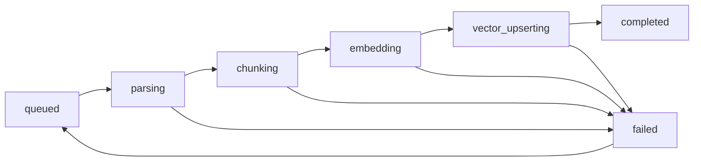
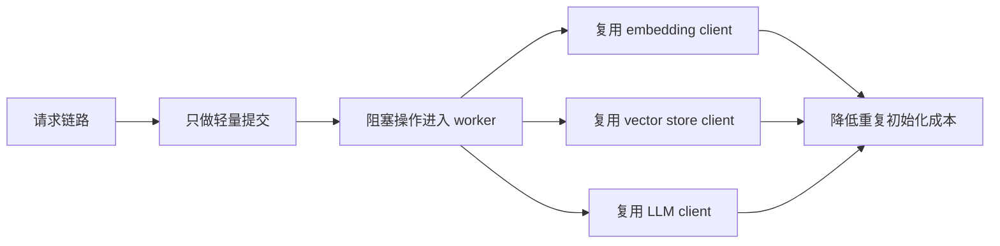
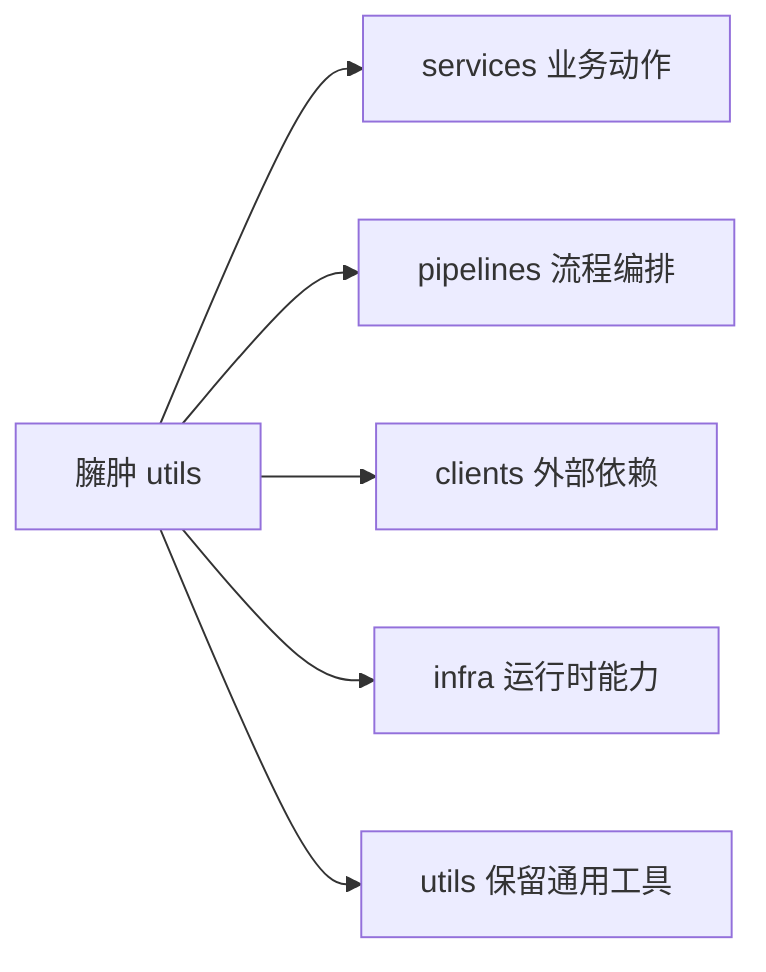
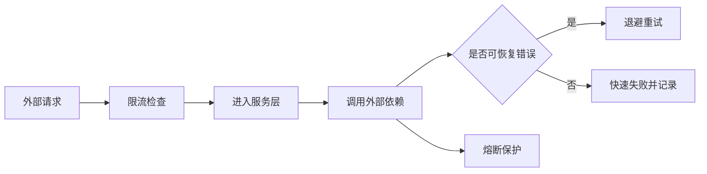
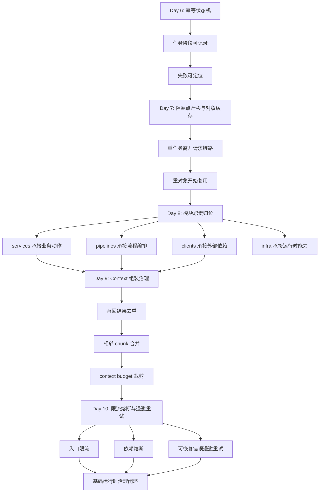

# Day 10：限流、熔断与退避重试

## 今天的总目标

- 给上传、索引提交、问答请求补上第一版基础限流
- 给 `LLM`、`Milvus` 这类外部依赖补上统一的熔断与退避重试入口
- 让系统开始区分“入口流量过大”和“下游依赖不稳定”这两类问题
- 只对可恢复错误做重试，对不可恢复错误快速失败
- 为 Day 11 的文档域流水线成型提供更稳的运行时底座

## 今天结束前，你必须拿到什么

- 一套你自己能讲清楚的 `rate limit / retry / circuit breaker` 分工
- `conf/config.py` 里第一版稳定性治理配置
- `infra/rate_limit.py`
- `infra/retry.py`
- `infra/circuit_breaker.py`
- `routers/chat.py` 和 `routers/documents.py` 的基础接法
- `services/query_service.py`、`clients/vector_store_client.py` 的最小接法
- 一份你能自己讲清楚的“为什么 Day 10 不是到处加 `try/except`”认知

---

## Day 6 - Day 10 流程图串联回看

在正式进入 Day 10 之前，  
你最好先把 Day 6 到 Day 10 这 5 天的主流程重新串起来看一遍。

因为 Day 10 不是突然冒出来的一层保护网，  
它是建立在：

- Day 6 的状态机
- Day 7 的运行时执行模型
- Day 8 的模块边界
- Day 9 的 context 治理

这些前提都开始成立之后，  
才真正有位置可放的。

### Day 6：幂等状态机



### Day 7：阻塞点迁移与对象缓存



### Day 8：utils 轻量拆分



### Day 9：Context 组装治理


### Day 10：限流、熔断与退避重试



### 这 5 张图连起来要表达什么

- Day 6 先让系统知道自己执行到哪里了
- Day 7 再把真正的阻塞点和重对象从请求链路里拿出去
- Day 8 再把职责边界拆开，知道每层该放什么
- Day 9 再把问答前的 context 输入治理干净
- Day 10 才开始补入口保护和依赖保护

如果没有前面这 4 天，  
Day 10 很容易沦为：

- 到处加 `try/except`
- 到处加一点 retry
- 到处塞一点限流判断

最后看起来像治理，  
实际上只是把复杂度摊得到处都是。

### Day 6 - Day 10 总结流程图



这张总图要表达的是：

```text
状态可控
-> 执行可控
-> 边界可控
-> 输入可控
-> 运行时可控
```

也就是说，  
Day 6 - Day 10 这 5 天不是 5 个孤立优化点，  
而是在给 Mneme 补一条最小生产化运行底座。

---

## 今天开始，系统不能再裸连外部依赖了

从当前仓库看，Day 9 之后主链路已经开始变清楚：

- `routers/chat.py` 负责问答入口
- `routers/documents.py` 负责上传和索引提交入口
- `services/query_service.py` 负责问答主流程
- `services/context_service.py` 负责召回后的 context 治理
- `clients/vector_store_client.py`、`clients/llm_client.py` 已经承担外部依赖访问边界

但现在仍然有一个很现实的问题：

```text
请求一进来
-> 直接进服务
-> 直接打 Milvus / LLM
-> 下游一慢，上游一起抖
```

这会导致 3 类问题同时暴露：

- 突发流量会把 API、worker、外部依赖一起拖慢
- 可恢复的瞬时失败没有被温和吸收
- 某个依赖已经明显异常时，系统还在继续猛打它

所以 Day 10 的核心不是“多写几个异常处理”，  
而是：

> 给系统补上最基础的自我保护能力。

---

## 第 1 层：先把 Day 10 的两类问题分清楚

Day 10 最重要的认知，是先把这两类问题分开。

### 第 1 类：入口流量治理

它关注的是：

- 同一个用户短时间是否提交了太多上传请求
- 同一个文档是否被重复提交索引
- 同一个知识库的问答请求是否突然升高

它解决的是：

- 入口洪峰
- 热点用户
- 热点知识库
- 明显过量的重复请求

它最适合放在：

- `router`
- 或已经拿到作用域信息的 `service`

### 第 2 类：外部依赖治理

它关注的是：

- Milvus 短暂超时了怎么办
- LLM 临时抖动了怎么办
- 某个依赖连续失败时要不要继续打

它解决的是：

- 可恢复错误的自动吸收
- 故障扩散
- 雪崩式重试

它最适合放在：

- `infra/`
- 再由 `client` 或 `service` 去调用

如果 Day 10 不先把这两类问题拆开，  
你后面很容易写成这种坏味道：

```text
router
-> service
-> client
-> 每层都各自 try/except 一点
-> 每层都偷偷 retry 一点
-> 最后没人说得清到底哪一层在保护什么
```

---

## 第 2 层：结合当前项目，Day 10 的真实脆弱点

### 问题 1：上传入口还没有任何节流意识

当前 `routers/documents.py` 的上传链路会直接做：

- 文件大小校验
- 本地写盘
- 数据库落库

如果同一个用户连续高频上传：

- 本地 I/O 会抖
- 数据库写入会增加
- 后面索引任务也会被连带放大

### 问题 2：索引提交入口很容易被重复点击

当前 `index_document_api(...)` 最终会走：

```text
submit_document_index_task(...)
-> create_task_record(...)
-> update document.status
```

虽然 Day 6 已经开始有状态机边界，  
但 Day 10 还是要承认一个现实：

- 用户可能重复点击
- 前端可能重复提交
- 接口可能被脚本高频打

所以索引提交入口也需要基础限流。

### 问题 3：问答链路是 Day 10 最敏感的入口

当前问答大致是：

```text
chat router
-> query_service
-> context_service
-> Milvus retrieval
-> LLM generation
```

这条链路里既有：

- 检索依赖
- 模型依赖
- 上下文治理

所以它天然最容易受：

- 突发请求
- Milvus 超时
- LLM 抖动

影响。

### 问题 4：不是所有失败都适合重试

Day 10 如果不讲清楚这个边界，  
系统很容易被“重试”两个字带偏。

比如：

- `知识库不存在`
- `用户不存在`
- `文件类型不支持`
- `document 已经 indexed`

这些都不是可恢复错误。  
它们不该重试。

再比如：

- 本地磁盘写文件
- 数据库事务提交
- 向量批写已经部分成功

这些也不该在 Day 10 第一版里盲目自动重试。  
否则很容易出现重复副作用。

---

## 第 3 层：Day 10 第一版最稳的落点

今天最稳的第一版，不是“全链路到处接策略”，  
而是只抓这 3 个落点：

### 落点 1：入口限流先抓 3 个 API

- `POST /kb/documents/upload`
- `POST /kb/documents/{document_id}/index`
- `POST /kb/chat/query`

原因：

- 这 3 个最直接承接用户请求
- 都可能把后续链路打满
- 都已经有比较清晰的作用域信息

### 落点 2：退避重试先抓可恢复的外部调用

今天第一版优先考虑：

- Milvus 检索
- LLM 调用

这些有几个特点：

- 属于外部依赖
- 有短暂失败可能
- 失败后重试的副作用相对小

今天先不主打：

- 本地文件写盘重试
- 数据库写事务重试
- 向量批写全量自动重试

### 落点 3：熔断先做进程内、依赖级别

第一版就先做：

- 进程内 breaker
- 以依赖名做 key
- 达到阈值后短时间 open

今天先不做：

- Redis 分布式熔断器
- 跨实例共享 breaker 状态
- 很复杂的统计面板

---

## 第 4 层：今天要改哪些文件

Day 10 主要围绕这些文件展开：

- `conf/config.py`
- `infra/rate_limit.py`
- `infra/retry.py`
- `infra/circuit_breaker.py`
- `routers/chat.py`
- `routers/documents.py`
- `services/document_service.py`
- `services/query_service.py`
- `services/context_service.py`
- `clients/vector_store_client.py`
- `scripts/debug_day10.py`

### 每个文件今天负责什么

| 文件 | 今天负责什么 |
|---|---|
| `conf/config.py` | 第一版限流、重试、熔断参数 |
| `infra/rate_limit.py` | 进程内固定窗口限流 |
| `infra/retry.py` | 异步退避重试 helper |
| `infra/circuit_breaker.py` | 进程内依赖级 breaker |
| `routers/chat.py` | 问答入口限流 |
| `routers/documents.py` | 上传入口限流 |
| `services/document_service.py` | 索引提交入口限流 |
| `services/query_service.py` | LLM 调用接 retry + breaker |
| `clients/vector_store_client.py` | Milvus 检索接 retry + breaker |
| `services/context_service.py` | 改成通过 client 的 resilient retrieval 取数据 |
| `scripts/debug_day10.py` | 打印限流、重试、熔断的最小验收结果 |

---

## 第 5 层：今天不要做什么

Day 10 不建议做：

- 不做 Redis 分布式限流
- 不做基于网关的全局限流
- 不做 Prometheus / Grafana 全套观测
- 不做“失败任务自动重试 API”
- 不做对本地文件写入和数据库事务的盲目自动重试
- 不做对向量批写的激进自动重试
- 不引入很重的第三方 resilience 框架

今天的原则是：

```text
先把第一版保护层立起来
-> 位置清楚
-> 语义清楚
-> 副作用可控

不要一上来做成复杂运行时平台
```

---

## 上午学习：09:00 - 12:00

## 09:00 - 09:50：先把 Day 10 的主问题讲顺

### 今天你要能顺着说出来

```text
入口流量治理
-> rate limit

下游依赖治理
-> retry + circuit breaker

两者不是一回事
```

### 你必须能回答这两个问题

1. 为什么限流最适合先放在入口，而不是放在 `llm_client.py`？
2. 为什么熔断和重试更适合做成 `infra` helper，而不是散落在 `router`？

---

## 09:50 - 10:40：先决定 Day 10 的治理边界

### 今天最稳的边界图

```text
router/service
-> 负责入口限流

client/service
-> 负责调用外部依赖

infra
-> 提供可复用的 retry / breaker / rate limit 能力
```

### 哪些失败今天要直接归类成“不可重试”

- `BusinessException`
- 参数不合法
- 权限或归属校验失败
- 资源不存在
- 文档状态不允许

### 哪些失败今天可以先按“可恢复”处理

第一版建议先收这些：

- `TimeoutError`
- `ConnectionError`
- 一部分外部依赖抛出的 `OSError`

白话理解：

- 这些更像“这次打过去没打稳”
- 不是“业务本身不成立”

---

## 10:40 - 11:30：先决定第一版策略长什么样

### Day 10 第一版限流策略

先用最简单、最稳的固定窗口：

- key
- limit
- window_seconds

例如：

- 上传：`user:{user_id}`
- 索引提交：`index_submit:{user_id}:{knowledge_base_id}`
- 问答：`chat:{user_id}:{knowledge_base_id}`

### Day 10 第一版重试策略

先用指数退避：

- 第 1 次失败，等短一点
- 后面逐步放大等待时间
- 到上限就不再继续等

第一版参数建议：

- `max_attempts = 3`
- `base_delay_seconds = 0.5`
- `max_delay_seconds = 4.0`

### Day 10 第一版熔断策略

先用最小版本：

- 连续失败计数
- 达到阈值后打开 breaker
- 冷却时间后允许一次 half-open 试探

第一版参数建议：

- `failure_threshold = 3`
- `recovery_timeout_seconds = 30`

---

## 11:30 - 12:00：先决定今天怎么验收

### Day 10 最直接的验收方式

你今天至少要能手工证明这 3 件事：

1. 同一 key 在窗口内超过阈值后，限流会生效
2. 可恢复异常会出现退避重试行为
3. 连续失败达到阈值后，breaker 会从 closed 变成 open

如果这 3 件事你都演示不出来，  
那 Day 10 大概率还停留在“写了点 helper，但系统没真正接上”。

---

## 下午编码：14:00 - 18:00

## 14:00 - 14:30：先补 Day 10 的稳定性配置

### 建议修改

- `conf/config.py`

### 今天建议新增

```python
RATE_LIMIT_WINDOW_SECONDS: int = 60
UPLOAD_RATE_LIMIT_MAX: int = 10
INDEX_SUBMIT_RATE_LIMIT_MAX: int = 20
CHAT_QUERY_RATE_LIMIT_MAX: int = 30

EXTERNAL_RETRY_MAX_ATTEMPTS: int = 3
EXTERNAL_RETRY_BASE_DELAY_SECONDS: float = 0.5
EXTERNAL_RETRY_MAX_DELAY_SECONDS: float = 4.0

CIRCUIT_BREAKER_FAILURE_THRESHOLD: int = 3
CIRCUIT_BREAKER_RECOVERY_TIMEOUT_SECONDS: int = 30
```

### 为什么 Day 10 先把参数配出来

因为你后面会很快发现：

- 限流阈值是要调的
- retry 参数是要调的
- breaker 阈值也是要调的

如果 Day 10 第一版就把它们写死在函数里，  
后面只会越来越难收敛。

---

## 14:30 - 15:00：新增 `infra/rate_limit.py`

### 这一段属于新增能力

所以这里保留壳子和参考实现。

### `infra/rate_limit.py` 练手骨架版

```python
from time import time

from utils.exceptions import BusinessException


_WINDOW_COUNTERS: dict[str, dict[str, float | int]] = {}


def enforce_fixed_window_rate_limit(
    *,
    bucket: str,
    key: str,
    limit: int,
    window_seconds: int,
) -> None:
    # 你要做的事：
    # 1. 生成 bucket + key 对应的计数键
    # 2. 找到当前窗口起点
    # 3. 如果窗口已过期，重置计数
    # 4. 超过 limit 时抛 BusinessException
    # 5. 没超过则计数 +1
    raise NotImplementedError("先自己实现 enforce_fixed_window_rate_limit")
```

### `infra/rate_limit.py` 参考答案

```python
from time import time

from utils.exceptions import BusinessException


_WINDOW_COUNTERS: dict[str, dict[str, float | int]] = {}


def enforce_fixed_window_rate_limit(
    *,
    bucket: str,
    key: str,
    limit: int,
    window_seconds: int,
) -> None:
    if limit <= 0:
        return

    counter_key = f"{bucket}:{key}"
    now = time()
    record = _WINDOW_COUNTERS.get(counter_key)

    if not record or now >= float(record["window_end"]):
        record = {
            "count": 0,
            "window_end": now + window_seconds,
        }
        _WINDOW_COUNTERS[counter_key] = record

    if int(record["count"]) >= limit:
        raise BusinessException(
            message=f"请求过于频繁，请稍后再试: {bucket}",
            code=4290,
            status_code=429,
        )

    record["count"] = int(record["count"]) + 1
```

### 这里要先理解的点

Day 10 这个限流器是：

- 进程内限流
- 第一版演示级保护层
- API 进程和 worker 进程各自维护自己的窗口

它不是：

- Redis 限流
- 多实例共享限流
- 网关级统一限流

今天先把这个级别的保护做稳就够了。

---

## 15:00 - 15:30：新增 `infra/retry.py`

### 这一段也属于新增能力

所以这里按“壳子 + 参考实现”来写。

### `infra/retry.py` 练手骨架版

```python
import asyncio
from collections.abc import Awaitable, Callable
from typing import TypeVar


T = TypeVar("T")


async def retry_async(
    func: Callable[[], Awaitable[T]],
    *,
    is_retryable: Callable[[Exception], bool],
    max_attempts: int,
    base_delay_seconds: float,
    max_delay_seconds: float,
) -> T:
    # 你要做的事：
    # 1. 最多执行 max_attempts 次
    # 2. 捕获异常后判断是否可重试
    # 3. 最后一次失败直接抛出
    # 4. 中间失败按指数退避 sleep
    raise NotImplementedError("先自己实现 retry_async")
```

### `infra/retry.py` 参考答案

```python
import asyncio
from collections.abc import Awaitable, Callable
from typing import TypeVar


T = TypeVar("T")


async def retry_async(
    func: Callable[[], Awaitable[T]],
    *,
    is_retryable: Callable[[Exception], bool],
    max_attempts: int,
    base_delay_seconds: float,
    max_delay_seconds: float,
) -> T:
    attempt = 0

    while True:
        attempt += 1
        try:
            return await func()
        except Exception as exc:
            if attempt >= max_attempts or not is_retryable(exc):
                raise

            delay = min(
                base_delay_seconds * (2 ** (attempt - 1)),
                max_delay_seconds,
            )
            await asyncio.sleep(delay)
```

### 这里有 3 个特别容易忽略的点

#### 点 1：重试不是吞错

最终失败还是应该抛出去。  
否则你只会得到：

- 表面没报错
- 实际结果不可信

#### 点 2：重试判断一定要显式

如果你什么异常都重试，  
那 `404`、参数错误、业务错误也会被硬重试。

这不是稳，  
这是把错误放大。

#### 点 3：Day 10 先做 helper，不做装饰器魔法

第一版更稳的方式是：

- 显式包住一次外部调用
- 显式传 `is_retryable`

这样最容易看清边界。

---

## 15:30 - 16:10：新增 `infra/circuit_breaker.py`

### 这一段仍然属于新增能力

所以这里继续保留壳子和参考实现。

### `infra/circuit_breaker.py` 练手骨架版

```python
from time import time

from utils.exceptions import BusinessException


_BREAKER_STATE: dict[str, dict[str, float | int | str]] = {}


def before_call(*, name: str, recovery_timeout_seconds: int) -> None:
    # 你要做的事：
    # 1. 读取 breaker 状态
    # 2. 如果是 open 且还没到恢复时间，直接拒绝
    # 3. 如果已到恢复时间，切成 half_open
    raise NotImplementedError("先自己实现 before_call")


def record_success(*, name: str) -> None:
    # 你要做的事：
    # 1. 成功后清零失败计数
    # 2. 状态切回 closed
    raise NotImplementedError("先自己实现 record_success")


def record_failure(
    *,
    name: str,
    failure_threshold: int,
    recovery_timeout_seconds: int,
) -> None:
    # 你要做的事：
    # 1. 失败计数 +1
    # 2. 达到阈值时切成 open
    # 3. 记录 reopen 时间
    raise NotImplementedError("先自己实现 record_failure")
```

### `infra/circuit_breaker.py` 参考答案

```python
from time import time

from utils.exceptions import BusinessException


_BREAKER_STATE: dict[str, dict[str, float | int | str]] = {}


def before_call(*, name: str, recovery_timeout_seconds: int) -> None:
    state = _BREAKER_STATE.get(name)
    if not state:
        return

    current_state = str(state["state"])
    reopen_at = float(state.get("reopen_at", 0))

    if current_state == "open":
        if time() < reopen_at:
            raise BusinessException(
                message=f"外部依赖暂时不可用: {name}",
                code=5031,
                status_code=503,
            )
        state["state"] = "half_open"


def record_success(*, name: str) -> None:
    _BREAKER_STATE[name] = {
        "state": "closed",
        "failure_count": 0,
        "reopen_at": 0.0,
    }


def record_failure(
    *,
    name: str,
    failure_threshold: int,
    recovery_timeout_seconds: int,
) -> None:
    state = _BREAKER_STATE.setdefault(
        name,
        {
            "state": "closed",
            "failure_count": 0,
            "reopen_at": 0.0,
        },
    )
    failure_count = int(state["failure_count"]) + 1
    state["failure_count"] = failure_count

    if failure_count >= failure_threshold:
        state["state"] = "open"
        state["reopen_at"] = time() + recovery_timeout_seconds
```

### 为什么 Day 10 的 breaker 先这样做

因为今天你最重要的是把这 3 个动作立住：

- 调用前检查
- 成功后恢复
- 连续失败后打开

只要这 3 个动作位置清楚，  
后面要不要扩成 class、要不要加指标，都还来得及。

---

## 16:10 - 16:50：给上传、索引提交、问答入口接限流

### 这一段需要改代码，但不需要重写整文件

更合理的方式是给出典型接法。

### 1. `routers/documents.py` 的上传入口

最稳的第一版是：

```python
from conf.config import settings
from infra.rate_limit import enforce_fixed_window_rate_limit


enforce_fixed_window_rate_limit(
    bucket="document_upload",
    key=f"user:{user_id}",
    limit=settings.UPLOAD_RATE_LIMIT_MAX,
    window_seconds=settings.RATE_LIMIT_WINDOW_SECONDS,
)
```

插入位置建议放在：

- `user` 校验通过之后
- 真正写文件之前

这样更合理，因为：

- 无效用户不占限流窗口
- 真正的文件写盘动作前就能拦住热点流量

### 2. `services/document_service.py` 的索引提交入口

这里更适合放在 `service`，  
因为它已经拿到了 `document`、`knowledge_base_id`、`user_id` 这些信息。

典型接法：

```python
from conf.config import settings
from infra.rate_limit import enforce_fixed_window_rate_limit


enforce_fixed_window_rate_limit(
    bucket="index_submit",
    key=f"user:{doc.user_id}:kb:{doc.knowledge_base_id}",
    limit=settings.INDEX_SUBMIT_RATE_LIMIT_MAX,
    window_seconds=settings.RATE_LIMIT_WINDOW_SECONDS,
)
```

### 3. `routers/chat.py` 的问答入口

最直接的第一版是：

```python
from conf.config import settings
from infra.rate_limit import enforce_fixed_window_rate_limit


enforce_fixed_window_rate_limit(
    bucket="chat_query",
    key=f"user:{payload.user_id}:kb:{payload.knowledge_base_id}",
    limit=settings.CHAT_QUERY_RATE_LIMIT_MAX,
    window_seconds=settings.RATE_LIMIT_WINDOW_SECONDS,
)
```

### 为什么 Day 10 先这样接

因为今天的目标不是搞复杂策略，  
而是先让系统具备：

- 明确的入口保护点
- 明确的作用域 key
- 明确的错误反馈

---

## 16:50 - 17:30：让 LLM 和 Milvus 调用开始受治理

### 这一段属于增量修改

这里最稳的改法是：

- `services/query_service.py` 负责 LLM 调用治理
- `clients/vector_store_client.py` 负责 Milvus 调用治理
- `services/context_service.py` 只改调用入口，不重新塞治理逻辑

### `services/query_service.py` 练手骨架版

```python
from infra.circuit_breaker import before_call, record_failure, record_success
from infra.retry import retry_async


async def generate_rag_answer(...):
    ...

    async def invoke_llm():
        # 你要做的事：
        # 1. breaker 调用前检查
        # 2. 执行 chain.ainvoke(...)
        # 3. 成功时 record_success
        # 4. 失败时 record_failure 再抛出
        raise NotImplementedError("先自己实现 invoke_llm")

    answer = await retry_async(
        invoke_llm,
        is_retryable=is_retryable_external_error,
        max_attempts=...,
        base_delay_seconds=...,
        max_delay_seconds=...,
    )
```

### `services/query_service.py` 参考答案

```python
from conf.config import settings
from infra.circuit_breaker import before_call, record_failure, record_success
from infra.retry import retry_async


def is_retryable_external_error(exc: Exception) -> bool:
    return isinstance(exc, (TimeoutError, ConnectionError, OSError))


async def generate_rag_answer(...):
    ...

    async def invoke_llm() -> str:
        before_call(
            name="llm",
            recovery_timeout_seconds=settings.CIRCUIT_BREAKER_RECOVERY_TIMEOUT_SECONDS,
        )
        try:
            answer_text = await chain.ainvoke(
                {
                    "context": context_packet["context_text"],
                    "question": question,
                }
            )
            record_success(name="llm")
            return answer_text
        except Exception:
            record_failure(
                name="llm",
                failure_threshold=settings.CIRCUIT_BREAKER_FAILURE_THRESHOLD,
                recovery_timeout_seconds=settings.CIRCUIT_BREAKER_RECOVERY_TIMEOUT_SECONDS,
            )
            raise

    answer = await retry_async(
        invoke_llm,
        is_retryable=is_retryable_external_error,
        max_attempts=settings.EXTERNAL_RETRY_MAX_ATTEMPTS,
        base_delay_seconds=settings.EXTERNAL_RETRY_BASE_DELAY_SECONDS,
        max_delay_seconds=settings.EXTERNAL_RETRY_MAX_DELAY_SECONDS,
    )
```

### `clients/vector_store_client.py` 最稳的第一版改法

今天不建议把整个文件重写。  
更稳的是加一个专门的检索入口，例如：

```python
from conf.config import settings
from infra.circuit_breaker import before_call, record_failure, record_success
from infra.retry import retry_async


def is_retryable_vector_error(exc: Exception) -> bool:
    return isinstance(exc, (TimeoutError, ConnectionError, OSError))


async def similarity_search_with_score_resilient(**search_kwargs):
    vector_store = get_vector_store()

    async def do_search():
        before_call(
            name="milvus",
            recovery_timeout_seconds=settings.CIRCUIT_BREAKER_RECOVERY_TIMEOUT_SECONDS,
        )
        try:
            result = await asyncio.to_thread(
                lambda: vector_store.similarity_search_with_score(**search_kwargs)
            )
            record_success(name="milvus")
            return result
        except Exception:
            record_failure(
                name="milvus",
                failure_threshold=settings.CIRCUIT_BREAKER_FAILURE_THRESHOLD,
                recovery_timeout_seconds=settings.CIRCUIT_BREAKER_RECOVERY_TIMEOUT_SECONDS,
            )
            raise

    return await retry_async(
        do_search,
        is_retryable=is_retryable_vector_error,
        max_attempts=settings.EXTERNAL_RETRY_MAX_ATTEMPTS,
        base_delay_seconds=settings.EXTERNAL_RETRY_BASE_DELAY_SECONDS,
        max_delay_seconds=settings.EXTERNAL_RETRY_MAX_DELAY_SECONDS,
    )
```

### `services/context_service.py` 这里应该怎么改

把原来的：

```python
vector_store = get_vector_store()
return vector_store.similarity_search_with_score(...)
```

改成：

```python
return await similarity_search_with_score_resilient(**search_kwargs)
```

### 这里有 4 个特别容易忽略的点

#### 点 1：重试和 breaker 不要塞回 router

因为它们保护的是：

- 外部依赖调用

不是：

- HTTP 入口解析

#### 点 2：breaker 统计的是“连续失败”，不是“总失败”

只要成功一次，  
第一版就应该重置。

#### 点 3：向量批写今天不要盲目全量重试

因为它可能出现：

- 部分写入成功
- 再重试带来重复副作用

Day 10 第一版更稳的做法是：

- 先保护检索
- 写入失败先留给任务状态机和后续恢复策略

#### 点 4：当前项目的 embedding 默认是本地模型

所以今天更值得先治理的是：

- `llm`
- `milvus`

如果后面切远程 embedding API，  
再复用同一套 `retry + breaker` 即可。

---

## 17:30 - 18:00：写一个最小验收脚本

### 这一段建议写代码

因为 Day 10 如果没有最小验收脚本，  
你会很难快速证明：

- 限流真的拦住了
- breaker 真的开了
- retry 真的发生了

### `scripts/debug_day10.py` 练手骨架版

```python
import asyncio

from infra.circuit_breaker import before_call, record_failure, record_success
from infra.rate_limit import enforce_fixed_window_rate_limit
from infra.retry import retry_async


async def flaky_call():
    # 你要做的事：
    # 1. 前两次抛 TimeoutError
    # 2. 第三次返回 success
    raise NotImplementedError("先自己实现 flaky_call")


async def main():
    # 你要做的事：
    # 1. 连续打限流，观察何时抛错
    # 2. 调 retry_async，观察是否最终成功
    # 3. 连续 record_failure，观察 breaker 是否 open
    pass


if __name__ == "__main__":
    asyncio.run(main())
```

### `scripts/debug_day10.py` 参考答案

```python
import asyncio

from infra.circuit_breaker import _BREAKER_STATE, before_call, record_failure
from infra.rate_limit import enforce_fixed_window_rate_limit
from infra.retry import retry_async


CALL_COUNT = {"flaky": 0}


async def flaky_call():
    CALL_COUNT["flaky"] += 1
    if CALL_COUNT["flaky"] < 3:
        raise TimeoutError("temporary timeout")
    return "success"


def is_retryable(exc: Exception) -> bool:
    return isinstance(exc, TimeoutError)


async def main():
    print("rate_limit_demo")
    for index in range(1, 5):
        try:
            enforce_fixed_window_rate_limit(
                bucket="chat_query",
                key="user:1:kb:demo",
                limit=3,
                window_seconds=60,
            )
            print(f"request_{index}=allowed")
        except Exception as exc:
            print(f"request_{index}=blocked:{exc}")

    print()
    print("retry_demo")
    result = await retry_async(
        flaky_call,
        is_retryable=is_retryable,
        max_attempts=3,
        base_delay_seconds=0.01,
        max_delay_seconds=0.02,
    )
    print(f"retry_result={result}")
    print(f"retry_call_count={CALL_COUNT['flaky']}")

    print()
    print("circuit_breaker_demo")
    for _ in range(3):
        record_failure(
            name="milvus",
            failure_threshold=3,
            recovery_timeout_seconds=30,
        )
    print(_BREAKER_STATE["milvus"])
    try:
        before_call(name="milvus", recovery_timeout_seconds=30)
    except Exception as exc:
        print(f"breaker_blocked={exc}")


if __name__ == "__main__":
    asyncio.run(main())
```

### 为什么 Day 10 值得写这个脚本

因为这类治理能力有一个共同特点：

- 代码不多
- 但如果不手动演示，很容易以为自己接上了

而一旦你能快速跑这个脚本，  
后面无论调参数还是接更多入口，都更稳。

---

## 晚上复盘：20:00 - 21:00

### 今晚你必须自己讲顺的 8 个点

1. 为什么限流和重试不是一回事？
2. 为什么 Day 10 先把限流放在入口，而不是散落到每个 client？
3. 为什么重试只应该处理可恢复错误？
4. 为什么 breaker 最适合统计依赖级连续失败？
5. 为什么 Day 10 不建议重试本地文件写盘和数据库事务？
6. 为什么向量批写今天不建议做激进自动重试？
7. 为什么 Day 9 做完 context 治理后，Day 10 更容易定位慢点？
8. Day 10 给 Day 11 的真正交接价值是什么？

---

## 今日验收标准

- 上传入口已具备基础限流
- 索引提交入口已具备基础限流
- 问答入口已具备基础限流
- `infra/rate_limit.py` 可单独演示
- `infra/retry.py` 可单独演示
- `infra/circuit_breaker.py` 可单独演示
- `services/query_service.py` 已开始用 `retry + breaker` 保护 LLM 调用
- `services/context_service.py` 已通过 `clients/vector_store_client.py` 的 resilient 检索入口取数据
- 你能明确说出 Day 10 哪些动作今天不应该自动重试

---

## 今天最容易踩的坑

### 坑 1：把限流理解成“系统性能优化”

问题：

- 限流的第一目标不是提速
- 而是防止入口把系统打穿

规避建议：

- 先把它理解成保护层，而不是优化器

### 坑 2：什么异常都拿去重试

问题：

- 业务错误会被错误放大
- 故障定位会更乱

规避建议：

- 显式写 `is_retryable(...)`

### 坑 3：breaker 和 retry 在不同层各写一套

问题：

- 语义会混乱
- 后面很难调参

规避建议：

- 统一下沉到 `infra/`

### 坑 4：今天就把限流做成分布式系统

问题：

- 范围瞬间膨胀
- 反而交不出第一版

规避建议：

- 先进程内固定窗口，先让位置和语义成立

### 坑 5：对有副作用的写操作盲目自动重试

问题：

- 可能重复写
- 可能出现半成功半失败

规避建议：

- Day 10 第一版优先保护检索和 LLM 调用

---

## 给明天的交接提示

明天会进入 Day 11：`文档域流水线成型`。

Day 11 的重点不是“多一条 pipeline”这么简单，  
而是：

> 当入口限流、依赖熔断和可恢复重试开始有了固定落点之后，  
> 文档索引这条业务流水线才更适合被正式收拢成一条稳定主链路。

所以 Day 10 最关键的交接只有一句话：

```text
系统已经开始区分入口保护和依赖保护，运行时治理不再散落在业务链路里，接下来把文档域主流程正式收拢成 pipeline，会更稳、更容易验收。
```
