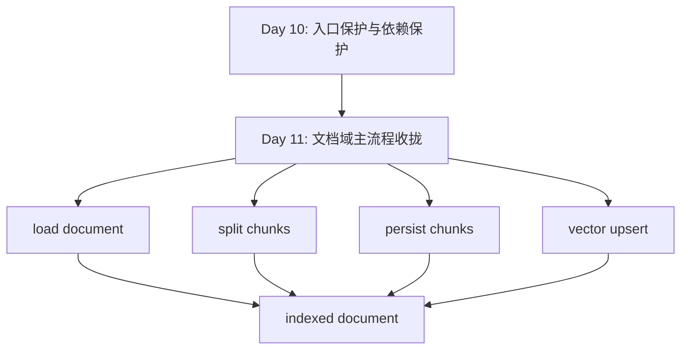

# Day 11：文档域流水线成型

## 今天的总目标

- 把“文档变成知识库”的过程正式收拢成一条清晰主链路
- 让 `pipelines/document_index_pipeline.py` 真正成为文档域主流程承载层
- 把 `task / pipeline / client / crud` 的职责重新讲清楚
- 补齐文档索引流水线的输入、输出、阶段信号和验收方式
- 为 Day 12 的记忆域流水线预埋提供稳定的文档域参考模板

## 今天结束前，你必须拿到什么

- 一套你自己能讲清楚的“文档域流水线”和“运行时任务壳”分工
- `schemas/document.py` 中第一版流水线结果模型
- `pipelines/document_index_pipeline.py` 的主链路整理方案
- `tasks/index_tasks.py` 的边界收口方案
- 一份你能自己讲清楚的“为什么 Day 11 不是再包一层函数”认知
- 一份最小验收脚本，例如 `scripts/debug_day11_pipeline.py`

---

## 今天开始，文档索引不能再只是几段调用凑在一起

从当前仓库看，Day 10 之后运行时保护已经开始有落点：

- 入口限流开始放在 `router / service`
- 依赖保护开始下沉到 `infra`
- `task`、`pipeline`、`client` 的边界已经比前面清楚很多

而文档索引链路现在也已经具备了基本组件：

- `clients/document_loader_client.py`
- `clients/text_splitter_client.py`
- `crud/chunk.py`
- `clients/vector_store_client.py`
- `pipelines/document_index_pipeline.py`
- `tasks/index_tasks.py`

但现在仍然有一个明显问题：

```text
组件已经有了
!=
流水线已经真正成型了
```

因为“有几个步骤能串起来”  
和“有一条稳定、可讲清楚、可验收的业务主链路”  
不是一回事。

所以 Day 11 的核心不是继续补功能点，  
而是：

> 把文档域主流程真正收拢成一条业务流水线。

---

## Day 11 一图总览

如果把 Day 11 压缩成一句话，它做的就是：

> 让 `document_index_pipeline` 不再只是“能跑的组合函数”，而是“文档域主链路的正式承载层”。

今天的主链路先背成这样：

```text
document uploaded
-> task submitted
-> worker starts task
-> document_index_pipeline
-> load document
-> split chunks
-> persist chunks
-> vector upsert
-> indexed document
```

你今天要特别清楚：

- `router / service` 负责提交任务，不负责执行索引
- `task` 负责运行时驱动，不负责业务细节拼装
- `pipeline` 负责文档域主流程编排
- `client / crud` 负责单动作

---

## 为什么 Day 11 也要重构

很多人看到当前项目会说：

```text
不是已经有 document_index_pipeline.py 了吗？
```

但 Day 11 真正要解决的不是“有没有这个文件”，  
而是下面这几个问题：

- 它现在是不是文档域唯一可信的主流程承载层
- 它的输入输出是不是稳定 contract
- 它有没有把阶段信号真正打出来
- `task` 和 `pipeline` 有没有重复负责同一件事
- 后面要预埋记忆域流水线时，能不能直接照这个边界抄模板

如果这些问题不解决，  
那当前的 `document_index_pipeline.py` 更像：

- 一段能跑的组合代码

而不是：

- 一个已经成型的领域流水线

---

## Day 10 到 Day 11 的交接图



这张图你要记住：

- Day 10 解决的是“运行时怎么保护”
- Day 11 解决的是“文档域主流程到底归谁承载”

---

## 第 1 层：先把 Day 11 的 4 个角色分清楚

Day 11 最重要的认知，是先把这 4 个角色拆开。

### 第 1 个角色：`router / service`

它负责：

- 接用户请求
- 校验资源归属
- 创建任务记录
- 返回 `task_id`

它不负责：

- 真正执行索引
- 解析文件
- 切分 chunk
- 向量写入

### 第 2 个角色：`task`

它负责：

- 从队列进入运行时
- 建立数据库 session
- 驱动状态机
- 调用流水线
- 在失败时兜底标记状态

它不负责：

- 文档索引业务细节
- 自己拼完整索引链

### 第 3 个角色：`pipeline`

它负责：

- 文档索引业务主流程编排
- 决定执行顺序
- 决定阶段边界
- 汇总结果

它不负责：

- HTTP 入口
- 任务投递
- 具体外部依赖初始化细节

### 第 4 个角色：`client / crud`

它负责：

- 单动作执行
- 外部依赖访问
- 持久化写入

它不负责：

- 业务主链路编排
- 流程状态机驱动

如果 Day 11 不先把这 4 个角色拆开，  
后面你就会不断看到这种坏味道：

```text
task 像 pipeline
pipeline 像 service
service 像 task
client 里又开始偷偷带业务判断
```

---

## 第 2 层：结合当前项目，Day 11 的真实问题点

### 问题 1：`document_index_pipeline.py` 已经存在，但边界还没完全立住

当前它已经做了：

- `load_langchain_documents(...)`
- `split_documents(...)`
- `create_chunks(...)`
- `add_documents_to_vector_store_in_batches(...)`
- `update_document_status(...)`

这已经很接近主流水线了。

但现在还缺两件关键事：

- 流水线结果 contract 还是裸 `dict`
- `on_stage_change` 参数虽然存在，但没有真正发出阶段信号

这说明它“快成型了”，  
但还没有真正成型。

### 问题 2：`task` 和 `pipeline` 还在重复负责文档状态

当前 `tasks/index_tasks.py` 里会做：

```text
update_document_status(..., "indexing")
```

而 `pipelines/document_index_pipeline.py` 里也会做：

```text
update_document_status(..., "indexing")
```

这就会带来一个很典型的问题：

- 两层都想做主人

Day 11 必须把这个边界收口。  
否则后面再加更多阶段时，谁负责 document 粗粒度状态会越来越乱。

### 问题 3：阶段状态在 Day 6 说清楚了，但 pipeline 还没把信号真正打出来

Day 6 说清楚了：

- `parsing`
- `chunking`
- `embedding`
- `vector_upserting`

而现在 `task` 也已经把：

```python
on_stage_change=report_stage
```

传给了 pipeline。

但当前 pipeline 还没有真的在关键节点调用它。  
这说明：

- 线已经接好了
- 信号还没真正发出来

### 问题 4：缺少一个更稳定的流水线结果口径

现在 `run_document_index_pipeline(...)` 返回的还是普通字典。

这在早期当然能跑，  
但 Day 11 已经不是“先跑起来”阶段了。

今天更合理的第一版做法是：

- 给它一个明确结果模型
- 让 `task`、日志、后续验收都消费同一口径

---

## 第 3 层：Day 11 的最稳边界

今天最稳的边界，建议定成这样：

### 边界 1：`task` 负责运行时壳，`pipeline` 负责业务主链路

所以：

- `task` 负责 session、异常兜底、状态机驱动
- `pipeline` 负责 load / split / persist / vector upsert

### 边界 2：`document.status` 的“正常推进”交给 `pipeline`

第一版最稳做法是：

- pipeline 开始时写 `indexing`
- pipeline 成功结束时写 `indexed`
- task 只在失败兜底时写 `failed`

这样职责最清楚。

### 边界 3：阶段状态信号通过 `on_stage_change(...)` 从 pipeline 往外打

也就是说：

- pipeline 不直接写 task record
- pipeline 只发阶段信号
- task 再把信号转成状态迁移

这正好延续 Day 6 的边界。

### 边界 4：流水线结果要结构化，不要继续散装

今天至少要让返回值表达这些内容：

- `document_id`
- `knowledge_base_id`
- `chunk_count`
- `vector_batch_count`
- `vector_batch_size`
- `indexed_vector_count`
- `status`

---

## 第 4 层：今天要改哪些文件

Day 11 主要围绕这些文件展开：

- `schemas/document.py`
- `pipelines/document_index_pipeline.py`
- `tasks/index_tasks.py`
- `clients/document_loader_client.py`
- `clients/text_splitter_client.py`
- `clients/vector_store_client.py`
- `crud/chunk.py`
- `scripts/debug_day11_pipeline.py`

### 每个文件今天负责什么

| 文件 | 今天负责什么 |
|---|---|
| `schemas/document.py` | 定义流水线结果模型 |
| `pipelines/document_index_pipeline.py` | 收拢主流程、发阶段信号、返回结构化结果 |
| `tasks/index_tasks.py` | 收口 task 和 pipeline 的边界 |
| `clients/document_loader_client.py` | 保持单动作装载能力 |
| `clients/text_splitter_client.py` | 保持单动作切分能力 |
| `clients/vector_store_client.py` | 保持向量写入能力 |
| `crud/chunk.py` | 保持 chunk 持久化能力 |
| `scripts/debug_day11_pipeline.py` | 最小化验证流水线顺序和返回结构 |

---

## 第 5 层：今天不要做什么

Day 11 不建议做：

- 不重写上传接口
- 不重写 Celery 队列
- 不做记忆域流水线
- 不把 query / context 链路混进来
- 不引入新的抽象层比如 `DocumentIndexService`
- 不把 `client` 改成超级业务模块
- 不顺手做“删除文档 -> 清理 chunk -> 清理向量”的反向流水线

今天的原则是：

```text
先把文档索引正向主链路彻底收拢
-> 主人是谁
-> 顺序是什么
-> 输入输出是什么
-> 状态信号怎么流动
```

---

## 上午学习：09:00 - 12:00

## 09:00 - 09:50：先把 Day 11 的主问题讲顺

### 今天你要能顺着说出来

```text
task 负责运行时
pipeline 负责编排业务主链
client / crud 负责单动作

文档域主流程
必须有唯一主人
```

### 你必须能回答这两个问题

1. 为什么 Day 11 不是“已有 pipeline 文件就算完成”？
2. 为什么 `task` 不应该继续自己持有文档索引主链路？

---

## 09:50 - 10:40：先把 Day 11 的真实主链路画出来

### 今天你先记住这条主链

```text
document
-> load_langchain_documents
-> split_documents
-> create_chunks
-> add_documents_to_vector_store_in_batches
-> indexed
```

### 这条链真正要表达什么

- 这是文档域业务动作顺序
- 不是 HTTP 顺序
- 也不是队列运行时顺序

你要把这三层分开：

- 入口层：提交任务
- 运行时层：worker 执行任务
- 业务层：文档索引流水线

---

## 10:40 - 11:30：先决定 Day 11 的 contract 放哪

### 最合理的第一版位置

第一版最稳的是放到：

- `schemas/document.py`

建议新增类似：

```python
class DocumentIndexPipelineResult(BaseModel):
    document_id: str
    knowledge_base_id: str
    chunk_count: int
    vector_batch_count: int
    vector_batch_size: int
    indexed_vector_count: int
    status: str
```

### 为什么今天值得补这个模型

因为它会统一 3 个地方的口径：

- pipeline 返回值
- task 日志
- debug 脚本验收

### 为什么不单独新建 `schemas/pipeline.py`

因为这还是：

- 文档域内部结果

更贴合：

- `schemas/document.py`

---

## 11:30 - 12:00：先决定今天怎么验收

### Day 11 最直接的验收方式

你今天至少要能证明这 4 件事：

1. `run_document_index_pipeline(...)` 的步骤顺序是稳定的
2. `on_stage_change(...)` 会按关键阶段发信号
3. `task` 和 `pipeline` 不再重复负责正常状态推进
4. 流水线返回的是统一结构，不再是随手拼的散装字典

如果这 4 件事你讲不出来，  
那 Day 11 还不能算“成型”。

---

## 下午编码：14:00 - 18:00

## 14:00 - 14:30：先给流水线补结果 contract

### 这一段属于新增能力

所以这里保留壳子和参考实现。

### `schemas/document.py` 练手骨架版

```python
from pydantic import BaseModel


class DocumentIndexPipelineResult(BaseModel):
    # 你要做的事：
    # 1. 把流水线最小结果字段补齐
    # 2. 保持和当前 pipeline 返回值一致
    raise NotImplementedError("先自己实现 DocumentIndexPipelineResult")
```

### `schemas/document.py` 参考答案

```python
from pydantic import BaseModel


class DocumentIndexPipelineResult(BaseModel):
    document_id: str
    knowledge_base_id: str
    chunk_count: int
    vector_batch_count: int
    vector_batch_size: int
    indexed_vector_count: int
    status: str
```

### 这里要先理解的点

今天补这个模型，  
不是为了“类型更好看”。

它真正的意义是：

- 让 pipeline 有稳定出口
- 让后面日志和调试脚本都能对齐同一口径

---

## 14:30 - 15:20：把 `document_index_pipeline.py` 真正收拢成主链路

### 这一段属于 Day 11 的关键改法

这里不是另起一个新 pipeline。  
而是在现有文件上把“差最后一步”的地方补齐。

### `pipelines/document_index_pipeline.py` 练手骨架版

```python
from collections.abc import Awaitable, Callable

from schemas.document import DocumentIndexPipelineResult


async def run_document_index_pipeline(
    db: AsyncSession,
    *,
    document: Document,
    on_stage_change: Callable[[str], Awaitable[None]] | None = None,
) -> DocumentIndexPipelineResult:
    # 你要做的事：
    # 1. 在开始时写 document.status = indexing
    # 2. 在 parsing / chunking / embedding / vector_upserting 前发阶段信号
    # 3. 保持 load -> split -> create_chunks -> vector upsert 主链
    # 4. 在成功时写 document.status = indexed
    # 5. 返回结构化结果
    raise NotImplementedError("先自己实现 Day 11 成型版 pipeline")
```

### `pipelines/document_index_pipeline.py` 参考答案

```python
from collections.abc import Awaitable, Callable

from schemas.document import DocumentIndexPipelineResult


async def emit_stage(
    stage: str,
    *,
    on_stage_change: Callable[[str], Awaitable[None]] | None,
) -> None:
    if on_stage_change:
        await on_stage_change(stage)


async def run_document_index_pipeline(
    db: AsyncSession,
    *,
    document: Document,
    on_stage_change: Callable[[str], Awaitable[None]] | None = None,
) -> DocumentIndexPipelineResult:
    doc = await update_document_status(
        db,
        document_id=document.id,
        status="indexing",
    )

    await emit_stage("parsing", on_stage_change=on_stage_change)
    docs = await load_langchain_documents(
        file_path=doc.file_path,
        file_type=doc.file_type,
        user_id=doc.user_id,
        knowledge_base_id=doc.knowledge_base_id,
        knowledge_base_pk=doc.knowledge_base_pk,
        file_name=doc.file_name,
        document_id=doc.id,
        document_pk=doc.pk,
    )

    await emit_stage("chunking", on_stage_change=on_stage_change)
    chunk_docs = await split_documents(
        document_id=doc.id,
        documents=docs,
    )

    await create_chunks(
        db,
        document_id=doc.id,
        document_pk=doc.pk,
        chunk_docs=chunk_docs,
    )

    await emit_stage("embedding", on_stage_change=on_stage_change)
    await emit_stage("vector_upserting", on_stage_change=on_stage_change)
    vector_result = await add_documents_to_vector_store_in_batches(
        chunk_docs=chunk_docs,
        batch_size=settings.INDEX_VECTOR_BATCH_SIZE,
    )

    await update_document_status(
        db,
        document_id=doc.id,
        status="indexed",
    )

    return DocumentIndexPipelineResult(
        document_id=doc.id,
        knowledge_base_id=doc.knowledge_base_id,
        chunk_count=len(chunk_docs),
        vector_batch_count=vector_result["batch_count"],
        vector_batch_size=vector_result["batch_size"],
        indexed_vector_count=vector_result["total_count"],
        status="indexed",
    )
```

### 这里有 4 个特别容易忽略的点

#### 点 1：`create_chunks(...)` 仍然属于主链内部步骤

很多人会误以为：

- 只有调外部依赖才算 pipeline 动作

不是。

只要它是文档变知识库主流程的一环，  
它就应该留在主链里。

#### 点 2：`embedding` 阶段今天仍然只是“逻辑阶段”

因为当前项目里 embedding 和 vector upsert 还是紧挨着的。

所以今天先打两个信号：

- `embedding`
- `vector_upserting`

就足够。

#### 点 3：`emit_stage(...)` 值得单独提一个小函数

因为这样后面看代码时会很清楚：

- 这是阶段信号
- 不是业务步骤本身

#### 点 4：今天不急着把每一步拆成独立 pipeline node class

现在这样已经够清楚：

- 顺序明确
- 边界明确
- 结果明确

不要为了“看起来架构化”再引入额外复杂度。

---

## 15:20 - 16:00：让 `tasks/index_tasks.py` 真正退回运行时壳

### 这里是 Day 11 的关键收口

当前最值得收掉的一处重复是：

- `task` 里先写一次 `document.status = indexing`
- `pipeline` 里又写一次 `document.status = indexing`

Day 11 第一版建议保留这种边界：

- pipeline 负责正常推进：`indexing -> indexed`
- task 负责失败兜底：`failed`

### `tasks/index_tasks.py` 练手骨架版

```python
async def run_index_document_task_async(...):
    async with AsyncSessionLocal() as db:
        try:
            async def report_stage(stage: str) -> None:
                await transition_task_status(...)

            # 你要做的事：
            # 1. 保留 task_record 的状态驱动
            # 2. 不再在这里重复写 document.status = indexing
            # 3. 把 document 交给 pipeline
            # 4. 成功时标记 completed
            # 5. 失败时 document.status = failed
            ...
```

### `tasks/index_tasks.py` 参考改法

```python
async def run_index_document_task_async(
    *,
    task_id: str,
    document_id: str,
) -> None:
    async with AsyncSessionLocal() as db:
        try:
            async def report_stage(stage: str) -> None:
                await transition_task_status(
                    db,
                    task_id=task_id,
                    to_status=stage,
                )

            doc = await get_document_by_id(db, document_id=document_id)
            if not doc:
                raise BusinessException(message="document not found", code=404)

            result = await run_document_index_pipeline(
                db,
                document=doc,
                on_stage_change=report_stage,
            )

            app_logger.bind(module="index_task").info(
                "index task completed",
                task_id=task_id,
                document_id=document_id,
                chunk_count=result.chunk_count,
                vector_batch_count=result.vector_batch_count,
                vector_batch_size=result.vector_batch_size,
            )
            await transition_task_status(
                db,
                task_id=task_id,
                to_status="completed",
            )
            await db.commit()
        except Exception as exc:
            await transition_task_status(
                db,
                task_id=task_id,
                to_status="failed",
                error_message=str(exc),
            )
            await update_document_status(
                db,
                document_id=document_id,
                status="failed",
            )
            await db.commit()
            raise
```

### 为什么 Day 11 这里值得动

因为如果 `task` 不退回运行时壳，  
后面所有领域流水线都会被它重新吸厚。

而 Day 11 正是要把这句话立住：

```text
task 不是业务主人
pipeline 才是文档域主流程主人
```

---

## 16:00 - 16:40：今天哪些依赖继续保持瘦，不要误拆

### `clients/document_loader_client.py` 今天先不加业务判断

它负责的还是：

- 按文件类型选择 loader
- 执行文档装载
- 补基础 metadata

它今天不负责：

- 文档状态机
- chunk 规则
- 流水线结果汇总

### `clients/text_splitter_client.py` 今天也先保持单动作

它负责的还是：

- 构建 splitter
- 生成 chunks
- 补 chunk metadata

它今天不负责：

- chunk 落库
- 任务阶段推进
- 向量写入

### 为什么 Day 11 要刻意强调这个

因为一旦你把“流水线成型”误解成“所有相关代码都往 pipeline 旁边堆”，  
那 `client` 很快又会变回旧 `utils` 的味道。

---

## 16:40 - 17:20：写一个最小验收脚本

### 这一段建议写代码

Day 11 最稳的验收方式，  
不是直接跑全链路真环境。

更稳的第一版是：

- 用 patch/mock 固定住依赖返回值
- 只验证流水线顺序、阶段信号和结果结构

这样不会被：

- 数据库环境
- Milvus
- 本地文件

这些外部条件打断。

### `scripts/debug_day11_pipeline.py` 练手骨架版

```python
import asyncio
from types import SimpleNamespace
from unittest.mock import AsyncMock, patch


async def main():
    stage_events: list[str] = []

    async def report_stage(stage: str) -> None:
        # 你要做的事：
        # 1. 记录阶段顺序
        pass

    fake_document = SimpleNamespace(
        id="doc_demo_001",
        pk=1,
        user_id=1,
        knowledge_base_id="kb_demo_001",
        knowledge_base_pk=1,
        file_name="demo.txt",
        file_path="storage/raw/demo.txt",
        file_type="txt",
    )

    # 你要做的事：
    # 1. patch 掉 update_document_status / load / split / create_chunks / vector upsert
    # 2. 调 run_document_index_pipeline(...)
    # 3. 打印 stage_events 和 result


if __name__ == "__main__":
    asyncio.run(main())
```

### `scripts/debug_day11_pipeline.py` 参考答案

```python
import asyncio
import sys
from pathlib import Path
from types import SimpleNamespace
from unittest.mock import AsyncMock, patch

from langchain_core.documents import Document as LCDocument

PROJECT_ROOT = Path(__file__).resolve().parent.parent
if str(PROJECT_ROOT) not in sys.path:
    sys.path.insert(0, str(PROJECT_ROOT))

from pipelines.document_index_pipeline import run_document_index_pipeline


async def main():
    stage_events: list[str] = []

    async def report_stage(stage: str) -> None:
        stage_events.append(stage)

    fake_document = SimpleNamespace(
        id="doc_demo_001",
        pk=1,
        user_id=1,
        knowledge_base_id="kb_demo_001",
        knowledge_base_pk=1,
        file_name="demo.txt",
        file_path="storage/raw/demo.txt",
        file_type="txt",
    )

    fake_loaded_docs = [
        LCDocument(page_content="第一段原文", metadata={}),
    ]
    fake_chunk_docs = [
        LCDocument(
            page_content="第一段 chunk",
            metadata={
                "chunk_id": "doc_demo_001_chunk_0_x1",
                "chunk_index": 0,
                "page_no": 1,
                "start_offset": 0,
            },
        )
    ]

    with (
        patch(
            "pipelines.document_index_pipeline.update_document_status",
            new=AsyncMock(side_effect=[fake_document, fake_document]),
        ),
        patch(
            "pipelines.document_index_pipeline.load_langchain_documents",
            new=AsyncMock(return_value=fake_loaded_docs),
        ),
        patch(
            "pipelines.document_index_pipeline.split_documents",
            new=AsyncMock(return_value=fake_chunk_docs),
        ),
        patch(
            "pipelines.document_index_pipeline.create_chunks",
            new=AsyncMock(return_value=None),
        ),
        patch(
            "pipelines.document_index_pipeline.add_documents_to_vector_store_in_batches",
            new=AsyncMock(
                return_value={
                    "batch_count": 1,
                    "batch_size": 64,
                    "total_count": 1,
                }
            ),
        ),
    ):
        result = await run_document_index_pipeline(
            db=SimpleNamespace(),
            document=fake_document,
            on_stage_change=report_stage,
        )

    print("stage_events")
    print(stage_events)
    print()

    print("pipeline_result")
    print(result.model_dump())


if __name__ == "__main__":
    asyncio.run(main())
```

### 为什么 Day 11 值得写这个脚本

因为 Day 11 真正要验收的是：

- 流程顺序
- 阶段信号
- 结果口径

而不是先去赌本地环境刚好都可用。

---

## 17:20 - 18:00：整理 Day 11 之后的领域认知

### 到 Day 11 为止，文档域应该开始变成这样

```text
router / service
-> submit task

task
-> runtime shell + state driving

document_index_pipeline
-> document-domain main flow

client / crud
-> single actions
```

### 这意味着什么

- 文档索引终于有了唯一业务承载位置
- task 不再继续变厚
- 以后做记忆域流水线时，有了现成模板
- 以后做删除、重建、回补等反向流程时，也更容易知道该放哪一层

---

## 晚上复盘：20:00 - 21:00

### 今晚你必须自己讲顺的 8 个点

1. 为什么 Day 11 不是“已有 pipeline 文件就算完成”？
2. `task` 和 `pipeline` 的真正边界是什么？
3. 为什么 `document.status` 的正常推进更适合放进 pipeline？
4. 为什么 pipeline 只发 `on_stage_change(...)`，不直接写 task record？
5. 为什么 `client / crud` 还要继续保持单动作？
6. 为什么 Day 11 要补一个流水线结果模型？
7. Day 10 和 Day 11 的关系到底是什么？
8. Day 11 给 Day 12 提供了什么模板价值？

---

## 今日验收标准

- `document_index_pipeline` 已成为文档索引主流程唯一承载层
- pipeline 已开始真正发出 `parsing / chunking / embedding / vector_upserting` 信号
- `task` 不再重复负责 `document.status = indexing`
- pipeline 返回的是统一结构，不再是随手拼的散装结果
- 你能清楚讲出 `task / pipeline / client / crud` 的分工
- 有一份最小 debug 脚本能验证阶段顺序和返回结构

---

## 今天最容易踩的坑

### 坑 1：把 Day 11 理解成“再加一个 pipeline 文件”

问题：

- 文件早就有了
- 真问题是边界和 contract 没完全立住

规避建议：

- 记住 Day 11 的目标是“成型”，不是“命名”

### 坑 2：让 task 继续持有业务主链

问题：

- 后面 task 会越来越厚
- 所有领域流程都会被运行时层吞掉

规避建议：

- task 只做运行时壳和失败兜底

### 坑 3：为了结构化，把 client 也改成业务模块

问题：

- 单动作边界会重新模糊
- 旧 utils 的问题会回来

规避建议：

- client 继续保持单动作

### 坑 4：阶段信号只留参数，不真正发

问题：

- 代码看起来像接好了
- 实际状态机根本没吃到信号

规避建议：

- Day 11 一定真的调用 `on_stage_change(...)`

### 坑 5：今天顺手把记忆域流水线也做掉

问题：

- 范围会立刻膨胀
- 文档域模板还没站稳

规避建议：

- 先把文档域打成模板，再进 Day 12

---

## 给明天的交接提示

明天会进入 Day 12：`记忆域流水线预埋`。

Day 12 的重点不是“再复制一份 document pipeline”这么简单，  
而是：

> 你必须先有一条边界清晰、状态信号明确、输入输出稳定的文档域流水线，  
> 才知道记忆域流水线应该学什么、不该学什么。

所以 Day 11 最关键的交接只有一句话：

```text
文档索引已经开始拥有正式的领域主链路承载层，task 退回运行时壳，client 和 crud 保持单动作，接下来预埋记忆域流水线时，终于有了一份可复用的模板。
```
