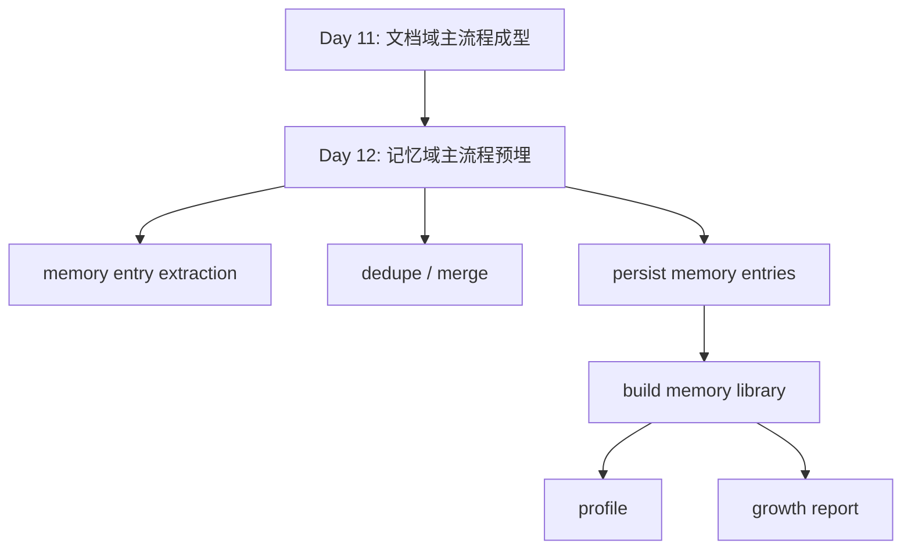

# Day 12：记忆域流水线预埋

## 今天的总目标

- 明确记忆域不应该混在文档索引流水线里
- 把“memory entry 抽取”从 `memory_service.py` 里抽成一条独立主链路
- 预留 `pipelines/memory_extract_pipeline.py` 作为记忆域流水线承载层
- 让 `memory entry -> memory library -> profile / growth` 这条链开始有稳定边界
- 为 Day 13 的双流水线基础闭环提供第二条领域模板

## 今天结束前，你必须拿到什么

- 一套你自己能讲清楚的“文档域”和“记忆域”分工
- `schemas/memory_entry.py` 里的第一版抽取/流水线结果 contract
- `pipelines/memory_extract_pipeline.py` 的预埋方案
- `services/memory_service.py` 的职责收口方案
- 一份你能自己讲清楚的“为什么 Day 12 不是做 companion 输出层”认知
- 一份最小验收脚本，例如 `scripts2/debug_day12_memory_pipeline.py`

---

## 今天开始，记忆域不能再藏在 service 里慢慢长厚

从当前仓库看，Day 11 之后文档域已经开始有清晰主链路：

- `tasks/index_tasks.py` 负责运行时壳
- `pipelines/document_index_pipeline.py` 负责文档域主流程
- `clients/*` 和 `crud/*` 负责单动作

但记忆域现在还不是这个状态。

当前记忆相关代码主要散落在：

- `services/memory_service.py`
- `crud/memory_entry.py`
- `services/profile_service.py`
- `services/growth_service.py`
- `routers/memory.py`
- `routers/profile.py`

这里面已经有不少能力：

- `extract_entries_from_chunk(...)`
- `extract_entries_from_chunks(...)`
- `build_memory_library(...)`
- `build_personal_profile(...)`
- `build_growth_report(...)`

但现在仍然有一个明显问题：

```text
记忆域已经有功能
!=
记忆域已经有流水线
```

所以 Day 12 的重点不是“把记忆功能继续堆多一点”，  
而是：

> 先把记忆域从散装 service 逻辑，预埋成一条独立演进路线。

---

## Day 12 一图总览

如果把 Day 12 压缩成一句话，它做的就是：

> 给记忆域补上一条“抽取 -> 去重归并 -> 入库 -> 组织 -> 消费”的独立主链，而不是继续混在文档域和产品层之间。

今天的主链路先背成这样：

```text
chunk docs
-> extract memory entries
-> dedupe / merge
-> persist memory entries
-> build memory library
-> profile / growth consume
```

你今天要特别清楚：

- Day 11 的重点是“文档域主流程成型”
- Day 12 的重点是“记忆域主流程预埋”
- Day 12 不等于 companion 输出层

---

## 为什么 Day 12 也要重构

很多人看到当前项目会说：

```text
不是已经有 memory_service.py、profile_service.py、growth_service.py 了吗？
```

但 Day 12 真正要解决的不是“有没有记忆能力”，  
而是下面这些问题：

- memory entry 抽取逻辑现在到底归谁承载
- `memory_service.py` 里“抽取”和“组织”是不是混在一起了
- profile 和 growth 消费的是不是一套稳定记忆输入
- 文档域以后如果完成索引，记忆域应该怎么接，而不污染 `document_index_pipeline`
- 记忆域后面如果要任务化、状态化、异步化，有没有主链可挂

如果这些问题不解决，  
后面很容易出现两种坏味道：

- 文档索引 pipeline 里顺手加记忆抽取
- companion / profile / growth 各自偷偷再做一遍 memory 组织

这两种都不稳。

---

## Day 11 到 Day 12 的交接图



这张图你要记住：

- Day 11 给的是第一条领域流水线模板
- Day 12 是把第二条领域流水线预埋出来

---

## 为什么 Day 12 不是 companion 输出层

当前仓库里其实已经有：

- `services/companion_service.py`
- `schemas/companion.py`

这说明项目里已经开始出现更靠产品层的组合输出尝试。

但 Day 12 在 `rebuild` 这条主线里，  
应该守住一个边界：

> 先把记忆域底层主链立住，再谈上层产品化组合输出。

因为如果 Day 12 直接跳去做 companion，  
你很容易得到一种假象：

- 产品接口变丰富了
- 但下面的记忆抽取链其实还是散的

这会让后面：

- 记忆异步化
- 记忆重试
- 记忆去重归并
- 记忆快照沉淀

这些能力都没有稳定落点。

---

## 第 1 层：先把 Day 12 的 4 个角色分清楚

### 第 1 个角色：文档域流水线

它负责：

- 文档被解析
- chunk 被切分
- chunk 被落库和向量化

它不负责：

- 从 chunk 里抽记忆词条
- 组织 memory library
- 生成 profile 和 growth

### 第 2 个角色：记忆域流水线

它负责：

- 从 chunk docs 里抽取 memory entries
- 做第一版去重和归并
- 写入 `memory_entries`
- 输出可被 profile / growth 继续消费的结果

它不负责：

- 文档索引
- 向量入库
- 最终 companion 输出

### 第 3 个角色：记忆组织层

它负责：

- `build_memory_library(...)`
- timeline / by_type / by_theme 组织

它不负责：

- 直接调用 LLM 从 chunk 抽词条

### 第 4 个角色：画像/分析消费层

它负责：

- 基于 memory library 做 profile
- 基于 memory library + profile 做 growth report

它不负责：

- 再回头抽 entry
- 再偷偷做 chunk 级 dedupe

---

## 第 2 层：结合当前项目，Day 12 的真实问题点

### 问题 1：`memory_service.py` 现在同时干了两类事

当前它既做：

- `extract_entries_from_chunk(...)`
- `extract_entries_from_chunks(...)`

也做：

- `build_memory_library(...)`
- `build_timeline(...)`
- `build_theme_groups(...)`

这就说明它同时承担了：

- 抽取层
- 组织层

Day 12 第一件事，  
就是把这两个层次拆开看。

### 问题 2：memory entry 抽取还没有主流程承载层

当前仓库里：

- 文档域有 `document_index_pipeline.py`
- 记忆域还没有 `memory_extract_pipeline.py`

这意味着后面如果想把记忆抽取接在文档处理之后，  
你会不知道：

- 这条主链到底挂哪

### 问题 3：profile 和 growth 已经开始消费记忆结果，但输入还不够“流水线化”

当前已经有：

- `build_personal_profile(...)`
- `build_growth_report(...)`

但它们吃的仍然更像：

- service 组织好的 dict

而不是：

- 一条清晰记忆域主链的稳定产物

### 问题 4：当前 `routers/profile.py` 的取数口径已经暴露出边界不稳

现在它走的是：

```text
list_memory_entries_by_user_id(...)
-> build_memory_library(...)
-> build_personal_profile(...)
```

但路由路径又是：

```text
/profile/knowledge-bases/{knowledge_base_id}
```

这说明现在已经开始有一个真实风险：

- 路径按知识库
- 取数却按用户

Day 12 虽然不一定今天就把所有代码全改完，  
但必须先把这个边界讲透。

---

## 第 3 层：Day 12 的最稳边界

### 边界 1：文档域只产出 chunk，记忆域再消费 chunk

也就是说：

- 文档域主链停在 chunk 和向量写入
- 记忆域主链从 chunk docs 或 chunk rows 开始

不要在 `document_index_pipeline.py` 里顺手做 entry extraction。

### 边界 2：记忆抽取主链单独放进 `pipelines/`

第一版最稳位置就是：

- `pipelines/memory_extract_pipeline.py`

它负责：

- extract
- dedupe / merge
- persist
- 返回结构化结果

### 边界 3：`memory_service.py` 收口成“组织层”

今天更合理的方向是：

- 把 entry extraction 相关逻辑迁出
- `memory_service.py` 保留 `build_memory_library(...)` 及其辅助函数

### 边界 4：profile / growth 只消费记忆产物，不再回头碰 chunk

这条边界必须先讲死。

否则后面很容易变成：

- profile prompt 直接吃 chunk
- growth report 再自己组一次 timeline

那记忆域就没有真正成立。

---

## 第 4 层：今天要改哪些文件

Day 12 主要围绕这些文件展开：

- `schemas/memory_entry.py`
- `schemas/memory_library.py`
- `pipelines/memory_extract_pipeline.py`
- `services/memory_service.py`
- `crud/memory_entry.py`
- `services/profile_service.py`
- `services/growth_service.py`
- `routers/memory.py`
- `routers/profile.py`
- `scripts2/debug_day12_memory_pipeline.py`

### 每个文件今天负责什么

| 文件 | 今天负责什么 |
|---|---|
| `schemas/memory_entry.py` | 定义 entry 抽取和流水线结果 contract |
| `schemas/memory_library.py` | 明确 memory library 的结构口径 |
| `pipelines/memory_extract_pipeline.py` | 预埋记忆域主流程 |
| `services/memory_service.py` | 收口成 memory library 组织层 |
| `crud/memory_entry.py` | memory entry 持久化和查询 |
| `services/profile_service.py` | 只消费 memory library 构建画像 |
| `services/growth_service.py` | 只消费 memory library + profile 构建阶段分析 |
| `routers/memory.py` | 暴露记忆库读取入口 |
| `routers/profile.py` | 强化知识库口径边界 |
| `scripts2/debug_day12_memory_pipeline.py` | 验证记忆抽取主链顺序和返回结构 |

---

## 第 5 层：今天不要做什么

Day 12 不建议做：

- 不把记忆抽取塞进 `document_index_pipeline.py`
- 不直接做 companion 输出层
- 不急着给记忆域也接 Celery 任务化
- 不做完整 profile snapshot 持久化
- 不做 growth report snapshot 持久化
- 不做复杂的 entry 语义聚类
- 不做跨知识库的超级记忆总线

今天的原则是：

```text
先让记忆域有一条独立可讲的主链
-> 主人是谁
-> 起点是什么
-> 输出是什么
-> 下游谁消费
```

---

## 上午学习：09:00 - 12:00

## 09:00 - 09:50：先把 Day 12 的主问题讲顺

### 今天你要能顺着说出来

```text
文档域主链
-> 产出 chunk

记忆域主链
-> 消费 chunk
-> 产出 memory entries
-> 组织 memory library
-> 继续供 profile / growth 消费
```

### 你必须能回答这两个问题

1. 为什么 Day 12 不能把记忆抽取顺手做进 `document_index_pipeline.py`？
2. 为什么 `memory_service.py` 不适合同时承担抽取层和组织层？

---

## 09:50 - 10:40：先把 Day 12 的真实主链路画出来

### 今天你先记住这条主链

```text
chunk docs
-> extract_entries_from_chunks
-> dedupe / merge entries
-> create_memory_entries
-> build_memory_library
-> build_profile / build_growth
```

### 这条链真正要表达什么

- 这是记忆域业务主链
- 不是路由顺序
- 也不是最终产品输出顺序

你要分清：

- 抽取层
- 组织层
- 消费层

---

## 10:40 - 11:30：先决定 Day 12 的 contract 放哪

### 最合理的第一版位置

第一版最稳的是放到：

- `schemas/memory_entry.py`

建议新增类似：

```python
class MemoryEntryPayload(BaseModel):
    id: str
    user_id: int
    knowledge_base_id: str
    knowledge_base_pk: int
    document_id: str
    document_pk: int
    chunk_id: str
    page_no: int | None = None
    entry_name: str
    entry_type: str
    summary: str
    evidence_text: str
    importance_score: float


class MemoryExtractPipelineResult(BaseModel):
    knowledge_base_id: str
    document_id: str | None = None
    raw_entry_count: int
    dedup_entry_count: int
    persisted_entry_count: int
```

### 为什么今天值得补这个模型

因为它会统一：

- pipeline 返回值
- debug 脚本输出
- 后面 profile / growth 的输入预期

---

## 11:30 - 12:00：先决定今天怎么验收

### Day 12 最直接的验收方式

你今天至少要能证明这 4 件事：

1. 记忆抽取主链已经有独立 pipeline 位置
2. `memory_service.py` 不再是“既抽又组”
3. 记忆流水线返回的是统一结构，不再只是散装 list[dict]
4. profile / growth 的输入口径开始围绕 knowledge base 收口

---

## 下午编码：14:00 - 18:00

## 14:00 - 14:30：先给记忆域补结果 contract

### 这一段属于新增能力

所以这里保留壳子和参考实现。

### `schemas/memory_entry.py` 练手骨架版

```python
from pydantic import BaseModel


class MemoryEntryPayload(BaseModel):
    # 你要做的事：
    # 1. 把抽取后准备入库的最小字段补齐
    # 2. 保持和当前 MemoryEntry 表结构一致
    raise NotImplementedError("先自己实现 MemoryEntryPayload")


class MemoryExtractPipelineResult(BaseModel):
    # 你要做的事：
    # 1. 给记忆域流水线定义最小统计出口
    raise NotImplementedError("先自己实现 MemoryExtractPipelineResult")
```

### `schemas/memory_entry.py` 参考答案

```python
from pydantic import BaseModel, Field


class MemoryEntryPayload(BaseModel):
    id: str
    user_id: int
    knowledge_base_id: str
    knowledge_base_pk: int
    document_id: str
    document_pk: int
    chunk_id: str
    page_no: int | None = None
    entry_name: str
    entry_type: str
    summary: str
    evidence_text: str
    importance_score: float = Field(default=0.5)


class MemoryExtractPipelineResult(BaseModel):
    knowledge_base_id: str
    document_id: str | None = None
    raw_entry_count: int
    dedup_entry_count: int
    persisted_entry_count: int
```

### 这里要先理解的点

今天补这个 contract，  
重点不是类型更漂亮。

而是让记忆域主链也开始拥有：

- 稳定输入
- 稳定输出

---

## 14:30 - 15:20：新增 `pipelines/memory_extract_pipeline.py`

### 这一段属于 Day 12 的关键改法

这里不是把 `memory_service.py` 整个推倒重来。  
而是把“抽取主链”单独提出来。

### `pipelines/memory_extract_pipeline.py` 练手骨架版

```python
from langchain_core.documents import Document as LCDocument

from schemas.memory_entry import MemoryExtractPipelineResult


async def run_memory_extract_pipeline(
    db: AsyncSession,
    *,
    chunk_docs: list[LCDocument],
    knowledge_base_id: str,
    document_id: str | None = None,
) -> MemoryExtractPipelineResult:
    # 你要做的事：
    # 1. 先从 chunk docs 抽 entries
    # 2. 做第一版去重 / 归并
    # 3. 调 create_memory_entries(...) 入库
    # 4. 返回结构化统计结果
    raise NotImplementedError("先自己实现 Day 12 预埋版记忆流水线")
```

### `pipelines/memory_extract_pipeline.py` 参考答案

```python
from schemas.memory_entry import MemoryEntryPayload, MemoryExtractPipelineResult
from crud.memory_entry import create_memory_entries
from services.memory_service import (
    deduplicate_memory_entries,
    extract_entries_from_chunks,
)


async def run_memory_extract_pipeline(
    db: AsyncSession,
    *,
    chunk_docs,
    knowledge_base_id: str,
    document_id: str | None = None,
) -> MemoryExtractPipelineResult:
    raw_entries = await extract_entries_from_chunks(chunk_docs)
    deduped_entries = deduplicate_memory_entries(raw_entries)

    payloads = [
        MemoryEntryPayload(**item).model_dump()
        for item in deduped_entries
    ]
    await create_memory_entries(
        db,
        entries=payloads,
    )

    return MemoryExtractPipelineResult(
        knowledge_base_id=knowledge_base_id,
        document_id=document_id,
        raw_entry_count=len(raw_entries),
        dedup_entry_count=len(deduped_entries),
        persisted_entry_count=len(payloads),
    )
```

### 这里有 4 个特别容易忽略的点

#### 点 1：Day 12 第一版不要求把记忆流水线正式接进文档任务

今天的关键词是：

- 预埋

不是：

- 全链打通

#### 点 2：去重规则第一版要确定性，不要语义魔法

比如先按：

- `knowledge_base_id`
- `document_id`
- `chunk_id`
- `entry_name`
- `entry_type`

这类组合键做去重就够了。

#### 点 3：`create_memory_entries(...)` 仍然只是单动作

不要把 dedupe、grouping、profile 生成再塞回 crud。

#### 点 4：Day 12 的 pipeline 产物是 entry，不是 profile

profile 和 growth 是：

- 记忆域消费层

不是：

- 记忆域抽取主链本身

---

## 15:20 - 16:00：收口 `memory_service.py`

### 这里是 Day 12 的关键收口

当前最值得收掉的一处混层是：

- `memory_service.py` 同时做抽取和组织

Day 12 第一版建议变成：

- `extract_entries_from_chunk(...)`
- `extract_entries_from_chunks(...)`
- `deduplicate_memory_entries(...)`

这部分继续暂留，供 pipeline 调用

而：

- `build_memory_library(...)`
- `build_timeline(...)`
- `build_theme_groups(...)`

明确归类为：

- 组织层能力

### `services/memory_service.py` 练手骨架版

```python
def deduplicate_memory_entries(entries: list[dict]) -> list[dict]:
    # 你要做的事：
    # 1. 给 entry 设计第一版确定性去重键
    # 2. 保持原始顺序
    raise NotImplementedError("先自己实现 deduplicate_memory_entries")
```

### `services/memory_service.py` 参考答案

```python
def deduplicate_memory_entries(entries: list[dict]) -> list[dict]:
    seen: set[tuple] = set()
    result: list[dict] = []

    for item in entries:
        key = (
            item.get("knowledge_base_id"),
            item.get("document_id"),
            item.get("chunk_id"),
            item.get("entry_name"),
            item.get("entry_type"),
        )
        if key in seen:
            continue
        seen.add(key)
        result.append(item)

    return result
```

### 为什么 Day 12 值得先这样收

因为 Day 12 的核心不是把 `memory_service` 弄没，  
而是让它开始变得：

- 可分层
- 可迁出
- 可供 pipeline 调用

---

## 16:00 - 16:40：让 profile / growth 的输入边界更稳

### `services/profile_service.py` 今天先不再碰 chunk

它负责的应该还是：

- 吃 `memory_library`
- 产出 `PersonalProfileResult`

它今天不负责：

- entry extraction
- chunk 级治理

### `services/growth_service.py` 也先守住消费层边界

它负责的应该还是：

- 吃 `memory_library + profile`
- 产出 `GrowthReportResult`

它今天不负责：

- 自己从数据库重新拼 entry pipeline
- 再去做知识库范围判断

### `routers/profile.py` 今天最值得先说明的边界

当前它按：

```text
/profile/knowledge-bases/{knowledge_base_id}
```

但取数却是：

```text
list_memory_entries_by_user_id(...)
```

Day 12 第一版最合理的方向是改成：

```text
list_memory_entries_by_knowledge_base_id(...)
```

即使你今天不把整条代码都重写，  
这条边界也必须先讲清楚。

---

## 16:40 - 17:20：写一个最小验收脚本

### 这一段建议写代码

Day 12 最稳的验收方式，  
不是直接跑全链路真实 LLM。

更稳的第一版是：

- 构造一组带 metadata 的 fake chunk docs
- mock 掉抽取函数返回
- 只验证去重、入库调用和统计结果

### `scripts2/debug_day12_memory_pipeline.py` 练手骨架版

```python
import asyncio
from types import SimpleNamespace
from unittest.mock import AsyncMock, patch


async def main():
    # 你要做的事：
    # 1. 构造 fake chunk docs
    # 2. mock extract_entries_from_chunks(...)
    # 3. mock create_memory_entries(...)
    # 4. 调 run_memory_extract_pipeline(...)
    # 5. 打印 pipeline result
    pass


if __name__ == "__main__":
    asyncio.run(main())
```

### `scripts2/debug_day12_memory_pipeline.py` 参考答案

```python
import asyncio
import sys
from pathlib import Path
from types import SimpleNamespace
from unittest.mock import AsyncMock, patch

from langchain_core.documents import Document as LCDocument

PROJECT_ROOT = Path(__file__).resolve().parent.parent
if str(PROJECT_ROOT) not in sys.path:
    sys.path.insert(0, str(PROJECT_ROOT))

from pipelines.memory_extract_pipeline import run_memory_extract_pipeline


async def main():
    chunk_docs = [
        LCDocument(
            page_content="用户长期在做知识管理和成长复盘。",
            metadata={
                "user_id": 1,
                "knowledge_base_id": "kb_demo_001",
                "knowledge_base_pk": 1,
                "document_id": "doc_demo_001",
                "document_pk": 1,
                "chunk_id": "doc_demo_001_chunk_0_x1",
                "page_no": 1,
            },
        )
    ]

    fake_entries = [
        {
            "id": "entry_001",
            "user_id": 1,
            "knowledge_base_id": "kb_demo_001",
            "knowledge_base_pk": 1,
            "document_id": "doc_demo_001",
            "document_pk": 1,
            "chunk_id": "doc_demo_001_chunk_0_x1",
            "page_no": 1,
            "entry_name": "知识管理",
            "entry_type": "theme",
            "summary": "长期关注知识管理与沉淀",
            "evidence_text": "用户长期在做知识管理和成长复盘。",
            "importance_score": 0.8,
        },
        {
            "id": "entry_002",
            "user_id": 1,
            "knowledge_base_id": "kb_demo_001",
            "knowledge_base_pk": 1,
            "document_id": "doc_demo_001",
            "document_pk": 1,
            "chunk_id": "doc_demo_001_chunk_0_x1",
            "page_no": 1,
            "entry_name": "知识管理",
            "entry_type": "theme",
            "summary": "长期关注知识管理与沉淀",
            "evidence_text": "用户长期在做知识管理和成长复盘。",
            "importance_score": 0.8,
        },
    ]

    with (
        patch(
            "pipelines.memory_extract_pipeline.extract_entries_from_chunks",
            new=AsyncMock(return_value=fake_entries),
        ),
        patch(
            "pipelines.memory_extract_pipeline.create_memory_entries",
            new=AsyncMock(return_value=[SimpleNamespace(id="entry_001")]),
        ),
    ):
        result = await run_memory_extract_pipeline(
            db=SimpleNamespace(),
            chunk_docs=chunk_docs,
            knowledge_base_id="kb_demo_001",
            document_id="doc_demo_001",
        )

    print("memory_pipeline_result")
    print(result.model_dump())


if __name__ == "__main__":
    asyncio.run(main())
```

### 为什么 Day 12 值得写这个脚本

因为 Day 12 你真正要验收的是：

- 主链位置
- 去重逻辑
- 入库调用
- 返回结构

而不是先赌：

- LLM prompt
- 线上模型稳定性

---

## 17:20 - 18:00：整理 Day 12 之后的领域认知

### 到 Day 12 为止，双流水线应该开始变成这样

```text
document pipeline
-> document parsing / chunking / vector upsert

memory pipeline
-> memory entry extraction / dedupe / persist

memory library
-> profile / growth consume
```

### 这意味着什么

- 文档域和记忆域终于开始分轨
- profile / growth 不再建立在散装记忆抽取逻辑上
- 后面如果给记忆域加 task、状态机、重试，会有明确位置
- 后面做 companion 或更高层产品输出，也不会再反向污染底层

---

## 晚上复盘：20:00 - 21:00

### 今晚你必须自己讲顺的 8 个点

1. 为什么 Day 12 不是把记忆抽取塞进 `document_index_pipeline.py`？
2. 为什么 `memory_service.py` 现在最该先拆成“抽取层 + 组织层”？
3. `memory_extract_pipeline` 的真正主人职责是什么？
4. 为什么 profile / growth 只能消费记忆产物，不能再碰 chunk？
5. 为什么 Day 12 不该直接跳去做 companion 输出层？
6. 为什么 Day 12 要先给记忆域补 contract？
7. Day 11 和 Day 12 的关系到底是什么？
8. Day 12 给 Day 13 的真正交接价值是什么？

---

## 今日验收标准

- 记忆域已经有了独立 pipeline 预埋位置
- `memory_service.py` 的抽取职责和组织职责开始被明确区分
- 记忆抽取主链已经有统一结构出口
- profile / growth 的消费边界已经讲清
- `routers/profile.py` 的 knowledge base 口径问题已经被显式指出并给出收口方向
- 有一份最小 debug 脚本能验证记忆抽取流水线结果

---

## 今天最容易踩的坑

### 坑 1：把 Day 12 理解成“记忆功能继续堆一点”

问题：

- 能力也许更多了
- 但主链还是散的

规避建议：

- 记住 Day 12 的目标是“预埋主链”，不是“多加几个接口”

### 坑 2：把记忆抽取顺手做进文档域 pipeline

问题：

- 两个领域会重新缠在一起
- 后面很难独立演进

规避建议：

- 坚持文档域只产出 chunk，记忆域再消费 chunk

### 坑 3：profile 和 growth 继续各自偷偷组织输入

问题：

- 记忆域主链会失去主人
- 输入口径会越来越乱

规避建议：

- 统一让它们消费 memory library

### 坑 4：Day 12 就直接跳到 companion 输出层

问题：

- 上层产品接口看起来更完整了
- 底层记忆域却还没有站稳

规避建议：

- 先把记忆域主链立住，再谈产品组合层

### 坑 5：一上来就做复杂语义归并

问题：

- 范围会立刻爆炸
- 第一天很难交出稳定版本

规避建议：

- 第一版先用确定性规则做 dedupe

---

## 给明天的交接提示

明天会进入 Day 13：`基础 Harness 完整闭环`。

Day 13 的重点不是“再多补一点注释或多一张图”这么简单，  
而是：

> 当文档域和记忆域两条主链都开始有了边界、位置和 contract，  
> 你才有可能真正回头检查：运行时、上下文治理、模块边界、双流水线这几条线到底有没有形成闭环。

所以 Day 12 最关键的交接只有一句话：

```text
记忆域已经开始拥有独立演进路线，不再寄生在文档索引链和产品输出层之间，接下来做基础 Harness 总结时，双流水线这条线终于能被完整讲清楚。
```
