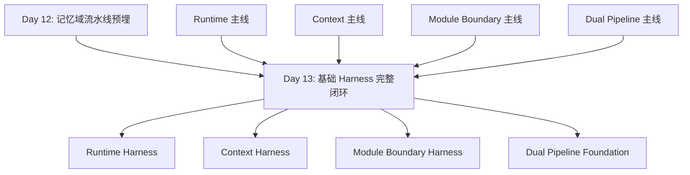
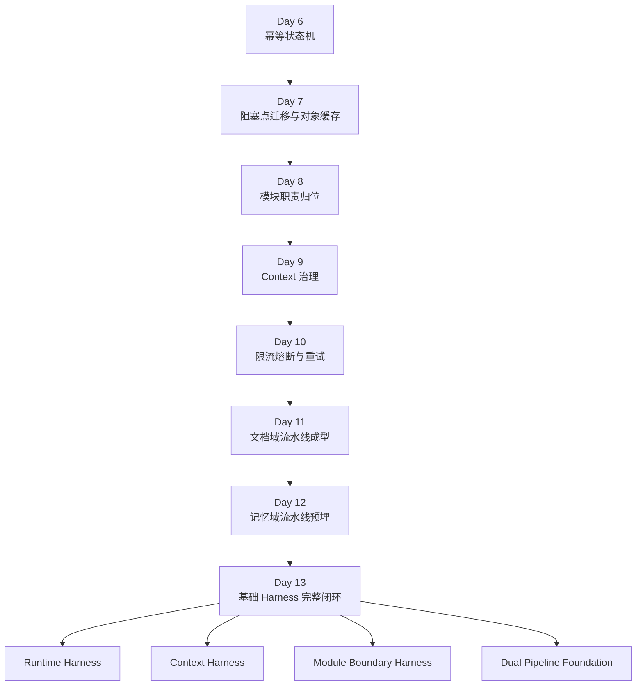

# Day 13：基础 Harness 完整闭环

## 今天的总目标

- 把 Day 1 - Day 12 这条优化主线收拢成 4 条可讲清楚的基础 Harness
- 明确 Runtime Harness、Context Harness、Module Boundary Harness、Dual Pipeline Foundation 各自到底闭到了哪一步
- 不再把前面的成果看成散装优化点，而是看成一套基础工程底座
- 给 Day 14 的进阶 Harness 预埋提供一份最小闭环检查模板
- 把“现在已经闭环了什么”和“现在还没闭环什么”说清楚

## 今天结束前，你必须拿到什么

- 一套你自己能讲清楚的 4 条基础 Harness 视图
- 一份 Day 13 最小闭环检查清单
- 一份最小化验证脚本，例如 `scripts2/debug_day13_harness.py`
- 一份你能自己讲清楚的“为什么 Day 13 不是新功能日”认知
- 一份你能自己讲清楚的“基础闭环和进阶闭环的区别”认知

---

## 今天开始，不要再把前 12 天当成零散改造了

到 Day 12 为止，项目里已经陆续出现了很多看起来彼此独立的成果：

- 任务化
- 状态机
- 阻塞点迁移
- 对象缓存
- 模块拆分
- context 治理
- 限流、熔断、退避重试
- 文档域流水线
- 记忆域流水线预埋

如果只按“功能点”看，  
这些东西当然都各有价值。

但 Day 13 的核心不是继续加第 13 个功能点，  
而是要回答一个更基础的问题：

> 这些改造合在一起，到底能不能叫一套基础 Harness？

所以 Day 13 的重点不是继续往前冲，  
而是先回头把已经搭出来的底座讲清楚、验清楚、收清楚。

---

## Day 13 一图总览

如果把 Day 13 压缩成一句话，它做的就是：

> 把前 12 天散落在运行时、上下文、模块边界、双流水线上的改造成果，收拢成一套最小基础闭环。

今天的主链先背成这样：

```text
Runtime Harness
-> 任务能跑、状态可追、故障可挡

Context Harness
-> 检索结果可治理、prompt 输入可控

Module Boundary Harness
-> router / service / pipeline / client / crud 各有主人

Dual Pipeline Foundation
-> 文档域和记忆域开始分轨
```

你今天要特别清楚：

- Day 12 的重点是“第二条领域主链预埋”
- Day 13 的重点是“前面这些线有没有形成基础闭环”
- Day 13 不是“再造一个新层”

---

## 为什么 Day 13 也要重构

很多人会误以为：

```text
Day 13 只是总结日
```

这句话只对了一半。

Day 13 确实要总结，  
但它不是写一份回顾笔记就结束。

它真正要做的是把下面 4 件事讲清楚：

1. 哪些线已经形成了最小闭环
2. 哪些线只有局部能力，还不算闭环
3. 这些线之间是怎么互相支撑的
4. Day 14 以后为什么应该做进阶 Harness，而不是回头重做基础层

如果 Day 13 不先把这 4 个问题讲透，  
后面很容易出现两种误判：

- 误以为现在已经“工程化完成”
- 误以为前面做的都只是零散优化，没形成体系

这两种判断都不准。

---

## Day 12 到 Day 13 的交接图



这张图你要记住：

- Day 13 不是某一条线继续前进
- 而是四条线一起回头做“基础闭环检查”

---

## 第 1 层：先把 Day 13 的 4 条 Harness 分清楚

### 第 1 条：Runtime Harness

它关注的是：

- 任务是否任务化
- 状态是否可追踪
- 阻塞是否迁出请求链路
- 重对象是否复用
- 入口是否限流
- 依赖是否熔断和重试

它解决的是：

- 系统能不能稳稳地跑起来

### 第 2 条：Context Harness

它关注的是：

- 召回结果有没有去重
- 相邻 chunk 有没有合并
- context budget 有没有裁剪
- query service 有没有只消费治理后的 context packet

它解决的是：

- 问答输入是不是可控、可解释、可复盘

### 第 3 条：Module Boundary Harness

它关注的是：

- router 有没有变薄
- service 有没有只承接业务动作
- pipeline 有没有只承接主流程
- client / crud 有没有保持单动作

它解决的是：

- 模块边界是不是靠职责成立，而不是只靠文件名成立

### 第 4 条：Dual Pipeline Foundation

它关注的是：

- 文档域主链有没有主人
- 记忆域主链有没有主人
- 两条线是不是已经开始分轨
- profile / growth / companion 这些消费层有没有反向污染底层

它解决的是：

- 后面做更复杂能力时，底层是不是还有清楚的领域分层

---

## 第 2 层：结合当前项目，Day 13 的真实问题点

### 问题 1：Runtime Harness 已经有骨架，但还缺统一检查视图

当前仓库里已经有：

- `tasks/index_tasks.py`
- `services/task_state_service.py`
- `infra/rate_limit.py`
- `infra/retry.py`
- `infra/circuit_breaker.py`
- `scripts2/debug_day10.py`

这说明 Runtime Harness 已经不是空的了。

但现在还缺：

- 一份统一的 Runtime 闭环检查视图

也就是说：

- 能力有了
- 但还没被收拢成“闭环检查口径”

### 问题 2：Context Harness 已经成型了一半，但还停在问答链局部

当前仓库里已经有：

- `services/context_service.py`
- `services/query_service.py`
- `schemas/chat.py`

这说明：

- context 治理能力已经成型

但 Day 13 还是要承认一个现实：

- 它现在主要闭环在 chat / query 这条链
- 还没有升成通用 harness 视图

### 问题 3：Module Boundary Harness 已经能看见，但局部仍然有漏边

比如当前仓库里：

- `document_index_pipeline.py` 已经开始像主流程承载层
- `memory_extract_pipeline.py` 也已经预埋出来

但同时你也能看到一些边界还没收干净的信号：

- `routers/profile.py` 的路径是 knowledge base，取数却还是按 user
- `routers/companion.py` 和 `pipelines/companion_pipeline.py` 仍然存在 user 级取数口径
- 个别 router 还在承担偏厚的组合逻辑

这就说明：

- 边界已经看得见
- 但还不是完全收口

### 问题 4：Dual Pipeline Foundation 已经开始存在，但还只是 foundation

当前仓库已经有：

- `pipelines/document_index_pipeline.py`
- `pipelines/memory_extract_pipeline.py`

这说明双流水线基础已经不是空话。

但现在仍然不该夸大成：

- 双流水线完整成熟

因为现在你还能明显看到：

- 记忆域还没正式接入任务化
- profile / growth / companion 的消费口径还没全按 knowledge base 收紧

所以 Day 13 的一个关键任务，  
就是把“已经开始成立”和“已经完全闭环”这两件事分清楚。

---

## 第 3 层：Day 13 的最稳边界

### 边界 1：Day 13 不新增重功能，重点做闭环收束

今天不应该再把重点放在：

- 新增大路由
- 新增新领域模块
- 再做一条新 pipeline

今天最重要的是：

- 把已有成果组织成 4 条基础 Harness

### 边界 2：Day 13 要承认“闭环是分层次的”

今天不要讲成：

- 一切都已经完整成熟

更准确的说法应该是：

- 基础闭环已经开始成立
- 进阶闭环还没做

### 边界 3：Day 13 的产物更像“检查视图”和“验证脚本”

今天更有价值的产物是：

- 一份闭环检查清单
- 一份最小验证脚本
- 一张总图
- 一份清楚的闭环口径

而不是再去拼新的产品层输出。

### 边界 4：Day 13 只做基础 Harness，不做进阶 Harness

今天先不做：

- verification gate
- policy externalization
- 自动质量闸门
- 更复杂的 harness 指标体系

这些是 Day 14 的事。

---

## 第 4 层：今天要改哪些文件

Day 13 主要围绕这些文件展开：

- `rebuild/day13.md`
- `scripts2/debug_day13_harness.py`
- `tasks/index_tasks.py`
- `services/task_state_service.py`
- `infra/rate_limit.py`
- `infra/retry.py`
- `infra/circuit_breaker.py`
- `services/context_service.py`
- `services/query_service.py`
- `pipelines/document_index_pipeline.py`
- `pipelines/memory_extract_pipeline.py`
- `routers/profile.py`
- `routers/companion.py`
- `pipelines/companion_pipeline.py`

### 每个文件今天负责什么

| 文件 | 今天负责什么 |
|---|---|
| `rebuild/day13.md` | 讲清 4 条基础 Harness 视图 |
| `scripts2/debug_day13_harness.py` | 最小闭环检查脚本 |
| `tasks/index_tasks.py` | Runtime Harness 的 task 壳证据 |
| `services/task_state_service.py` | Runtime Harness 的状态机证据 |
| `infra/rate_limit.py` | Runtime Harness 的入口保护证据 |
| `infra/retry.py` | Runtime Harness 的可恢复错误处理证据 |
| `infra/circuit_breaker.py` | Runtime Harness 的依赖保护证据 |
| `services/context_service.py` | Context Harness 的治理证据 |
| `services/query_service.py` | Context Harness 的消费证据 |
| `pipelines/document_index_pipeline.py` | 文档域主链证据 |
| `pipelines/memory_extract_pipeline.py` | 记忆域主链证据 |
| `routers/profile.py` / `routers/companion.py` | 边界仍未完全收口的反例 |
| `pipelines/companion_pipeline.py` | 双流水线消费层仍存在口径风险的反例 |

---

## 第 5 层：今天不要做什么

Day 13 不建议做：

- 不新增新的大功能域
- 不重写 companion
- 不给记忆域正式接 Celery
- 不做复杂自动化测试矩阵
- 不做完整策略外置
- 不做 verification gate
- 不把 Day 14 的进阶 Harness 提前做掉

今天的原则是：

```text
先确认基础层有没有真的形成闭环
-> 位置是不是对
-> 主人是不是清楚
-> 最小验证能不能跑
-> 明确还没闭到哪里
```

---

## 上午学习：09:00 - 12:00

## 09:00 - 09:50：先把 Day 13 的主问题讲顺

### 今天你要能顺着说出来

```text
Runtime Harness
-> 系统能稳跑

Context Harness
-> 输入可控

Module Boundary Harness
-> 边界可讲

Dual Pipeline Foundation
-> 领域可分轨
```

### 你必须能回答这两个问题

1. 为什么 Day 13 不是“总结一下前面做了什么”这么简单？
2. 为什么 Day 13 一定要同时承认“已经基础闭环”和“还没有进阶闭环”？

---

## 09:50 - 10:40：先把 4 条 Harness 的证据链列出来

### Runtime Harness 的证据链

```text
router/service submit
-> task queue
-> worker task
-> task_state_service
-> rate limit / retry / circuit breaker
```

### Context Harness 的证据链

```text
retrieval
-> dedupe
-> merge
-> budget trim
-> governed context
-> query service consume
```

### Module Boundary Harness 的证据链

```text
router
-> service
-> pipeline
-> client / crud
-> infra
```

### Dual Pipeline Foundation 的证据链

```text
document_index_pipeline
||
memory_extract_pipeline
-> profile / growth / companion consume
```

### 这一段真正要表达什么

Day 13 不是空谈“架构理念”，  
而是必须拿出：

- 文件
- 代码位置
- 调试脚本
- 反例

来证明这 4 条线分别站到了哪一步。

---

## 10:40 - 11:30：先决定 Day 13 的产物长什么样

### Day 13 最值得留下的产物

第一版最有价值的是：

1. 一张基础 Harness 总图
2. 一份闭环检查清单
3. 一份最小验证脚本
4. 一份“当前还没闭到哪里”的清楚说明

### 为什么 Day 13 不该只留一篇总结

因为如果只有一篇总结文案，  
你后面很难快速回答：

- 哪条线已经闭了
- 哪条线只是部分成立
- 哪条线最该继续补

所以 Day 13 应该更像：

- 工程收束日

而不是：

- 心得体会日

---

## 11:30 - 12:00：先决定今天怎么验收

### Day 13 最直接的验收方式

你今天至少要能证明这 4 件事：

1. Runtime、Context、Boundary、Dual Pipeline 4 条线都能各自找到代码证据
2. 至少有一份脚本能把这 4 条线的“最小证据”跑出来
3. 你能明确说出哪些地方已经基础闭环
4. 你能明确说出哪些地方还只是 foundation，不是 fully closed

---

## 下午编码：14:00 - 18:00

## 14:00 - 14:40：先写一份 Day 13 闭环检查清单

### 这一段属于新增能力

这里最合理的第一版不是大改代码，  
而是先写出检查口径。

### `rebuild/day13_harness_checklist.md` 练手骨架版

```md
# Day 13 Harness Checklist

## Runtime Harness
- [ ] task 化入口存在
- [ ] 状态机存在
- [ ] 限流存在
- [ ] retry 存在
- [ ] breaker 存在

## Context Harness
- [ ] 去重存在
- [ ] 相邻合并存在
- [ ] budget 裁剪存在
- [ ] query service 只消费 context packet

## Module Boundary Harness
- [ ] router 不承接重业务
- [ ] pipeline 承接主流程
- [ ] client / crud 保持单动作

## Dual Pipeline Foundation
- [ ] document pipeline 存在
- [ ] memory pipeline 存在
- [ ] profile / growth 消费层存在
```

### `rebuild/day13_harness_checklist.md` 参考答案

```md
# Day 13 Harness Checklist

## Runtime Harness
- [x] `tasks/index_tasks.py` 已存在
- [x] `services/task_state_service.py` 已存在
- [x] `infra/rate_limit.py` 已存在
- [x] `infra/retry.py` 已存在
- [x] `infra/circuit_breaker.py` 已存在
- [x] `scripts2/debug_day10.py` 可演示限流 / retry / breaker

## Context Harness
- [x] `services/context_service.py` 已存在
- [x] 去重逻辑已存在
- [x] 相邻合并逻辑已存在
- [x] budget 裁剪逻辑已存在
- [x] `services/query_service.py` 已改成只消费治理后的 context packet

## Module Boundary Harness
- [x] `routers/`、`services/`、`pipelines/`、`clients/`、`infra/` 已分层
- [x] `document_index_pipeline.py` 已是文档域主流程承载层
- [x] `memory_extract_pipeline.py` 已开始预埋
- [ ] `routers/profile.py`、`routers/companion.py` 仍有 knowledge base 口径未完全收口

## Dual Pipeline Foundation
- [x] `pipelines/document_index_pipeline.py` 已存在
- [x] `pipelines/memory_extract_pipeline.py` 已存在
- [x] `profile_service.py`、`growth_service.py` 已开始围绕记忆产物消费
- [ ] 记忆域还未正式任务化
```

### 为什么 Day 13 值得先写这个清单

因为 Day 13 的关键词就是：

- 闭环检查

没有检查清单，  
你后面的“闭环”就很容易变成一句大话。

---

## 14:40 - 15:30：写一个最小 Harness 验证脚本

### 这一段建议写代码

Day 13 最稳的脚本不是跑整套真实业务，  
而是：

- 对每条 Harness 线各拿一个最小证据
- 用最少代码把它们打印出来

### `scripts2/debug_day13_harness.py` 练手骨架版

```python
import asyncio


async def main():
    # 你要做的事：
    # 1. 打印 Runtime Harness 的证据点
    # 2. 打印 Context Harness 的证据点
    # 3. 打印 Module Boundary Harness 的证据点
    # 4. 打印 Dual Pipeline Foundation 的证据点
    pass


if __name__ == "__main__":
    asyncio.run(main())
```

### `scripts2/debug_day13_harness.py` 参考答案

```python
import asyncio
import sys
from pathlib import Path

PROJECT_ROOT = Path(__file__).resolve().parent.parent
if str(PROJECT_ROOT) not in sys.path:
    sys.path.insert(0, str(PROJECT_ROOT))

from infra.circuit_breaker import _BREAKER_STATE
from infra.rate_limit import _WINDOW_COUNTERS
from services.context_service import (
    build_similarity_search_kwargs,
    deduplicate_retrieved_documents,
    merge_adjacent_scored_documents,
    trim_scored_documents_by_budget,
)
from tasks.index_tasks import index_document_task
from services.task_state_service import ALLOWED_TASK_TRANSITIONS
from pipelines.document_index_pipeline import run_document_index_pipeline
from pipelines.memory_extract_pipeline import run_memory_extract_pipeline


async def main():
    print("runtime_harness")
    print(f"task_entry={index_document_task.name}")
    print(f"state_machine_keys={list(ALLOWED_TASK_TRANSITIONS.keys())}")
    print(f"rate_limit_counter_type={type(_WINDOW_COUNTERS).__name__}")
    print(f"breaker_state_type={type(_BREAKER_STATE).__name__}")
    print()

    print("context_harness")
    print(build_similarity_search_kwargs(
        "什么是 RAG",
        top_k=4,
        user_id=1,
        knowledge_base_id="kb_demo_001",
    ))
    print(f"dedupe_fn={deduplicate_retrieved_documents.__name__}")
    print(f"merge_fn={merge_adjacent_scored_documents.__name__}")
    print(f"trim_fn={trim_scored_documents_by_budget.__name__}")
    print()

    print("module_boundary_harness")
    print(f"document_pipeline={run_document_index_pipeline.__name__}")
    print(f"memory_pipeline={run_memory_extract_pipeline.__name__}")
    print()

    print("dual_pipeline_foundation")
    print("document_domain=ready")
    print("memory_domain=pre-embedded")


if __name__ == "__main__":
    asyncio.run(main())
```

### 为什么 Day 13 值得写这个脚本

因为 Day 13 你真正要证明的是：

- 4 条线都已经不是抽象概念
- 它们都已经在仓库里有了可指认的落点

这比直接跑大而全的接口更重要。

---

## 15:30 - 16:20：把 Runtime Harness 的闭环讲顺

### 你今天至少要讲清 Runtime Harness 的这条链

```text
documents/chat router
-> service submit / invoke
-> task
-> state machine
-> runtime protection
```

### 哪些地方已经算基础闭环

- 任务入口已经有
- 状态机已经有
- 限流已经有
- retry 已经有
- breaker 已经有

### 哪些地方今天只能算“已开始成立”

- 统一 runtime harness 报表还没有
- 更细粒度验证 gate 还没有
- 更系统的 runtime policy externalization 还没有

---

## 16:20 - 17:00：把 Context Harness 和 Module Boundary Harness 讲顺

### Context Harness 现在至少闭到了哪

当前至少已经闭到：

- retrieval kwargs 有统一入口
- raw retrieval 和 governed context 已经分开
- `query_service` 已开始只消费 context packet

这就已经构成了 Context Harness 的第一版闭环。

### Module Boundary Harness 现在至少闭到了哪

当前至少已经闭到：

- `routers/`
- `services/`
- `pipelines/`
- `clients/`
- `infra/`

这套层次已经不再只是目录名。

### 但今天一定要承认的两个缺口

1. `routers/profile.py` 仍有 knowledge base 路径和 user 级取数错位
2. `routers/companion.py` / `pipelines/companion_pipeline.py` 仍然存在类似口径问题

这两个缺口很重要，  
因为 Day 13 的诚实比“看起来圆满”更重要。

---

## 17:00 - 18:00：把 Dual Pipeline Foundation 讲顺

### 到 Day 13 为止，双流水线应该开始被这样理解

```text
document pipeline
-> index and vectorize

memory pipeline
-> extract and organize memory entries

consumer layer
-> profile / growth / companion
```

### 为什么这里叫 Foundation，不叫 Full Dual Pipeline

因为现在你已经有：

- 文档域主链
- 记忆域主链预埋

但你还没有：

- 记忆域正式任务化
- 更干净的 knowledge base 消费口径
- 更完整的跨流水线验证机制

所以 Day 13 更准确的说法就是：

- Dual Pipeline Foundation 已经初步闭环

而不是：

- 双流水线已经完整成熟

---

## Day 6 - Day 13 总结总图



### 这张图要表达什么

```text
先把局部能力做出来
-> 再把它们放到对的位置
-> 再确认这些位置之间已经开始形成工程闭环
```

这就是 Day 13 的核心。

---

## 晚上复盘：20:00 - 21:00

### 今晚你必须自己讲顺的 8 个点

1. 为什么 Day 13 不是普通总结日？
2. Runtime Harness、Context Harness、Module Boundary Harness、Dual Pipeline Foundation 分别是什么？
3. 为什么 Day 13 要同时承认“已经基础闭环”和“还没进阶闭环”？
4. 为什么 `scripts2/debug_day13_harness.py` 这种脚本在 Day 13 特别重要？
5. 为什么 Day 13 不该再造新功能？
6. 为什么 Dual Pipeline 现在更准确地叫 foundation？
7. 当前项目里哪两个位置最能说明边界还没完全收口？
8. Day 13 给 Day 14 的真正交接价值是什么？

---

## 今日验收标准

- 4 条基础 Harness 都能找到对应代码证据
- 有一份闭环检查清单
- 有一份最小 Harness 验证脚本
- 你能明确说出 Runtime Harness 已经闭到哪一步
- 你能明确说出 Context Harness 已经闭到哪一步
- 你能明确说出 Module Boundary Harness 还剩哪些缺口
- 你能明确说出为什么现在只能叫 Dual Pipeline Foundation

---

## 今天最容易踩的坑

### 坑 1：把 Day 13 理解成“写个总结就完了”

问题：

- 说了很多
- 但没有检查口径和验证证据

规避建议：

- 一定要留下 checklist 和 debug 脚本

### 坑 2：把基础闭环说成完整成熟

问题：

- 会掩盖真实缺口
- 后面很难继续精确推进

规避建议：

- 明确区分基础闭环和进阶闭环

### 坑 3：为了证明闭环，回头再塞一个新功能

问题：

- Day 13 会重新变成功能日
- 收束目标会被冲淡

规避建议：

- 今天只做收束，不做扩张

### 坑 4：只讲 Runtime，不讲 Context 和双流水线

问题：

- 会把 Day 13 讲窄
- 失去这一天真正的系统视角

规避建议：

- 四条线必须同时出现

### 坑 5：不愿意承认还没收口的地方

问题：

- 看起来更完整
- 实际会让后面所有规划失真

规避建议：

- 把 `profile/companion` 这些口径问题明确写出来

---

## 给明天的交接提示

明天会进入 Day 14：`进阶 Harness 预埋`。

Day 14 的重点不是“再重复一遍 Day 13 的闭环检查”，  
而是：

> 当你已经知道基础闭环在哪里、缺口在哪里，  
> 才能开始预埋 verification gate、policy externalization、自动检查点这些更进阶的 Harness 能力。

所以 Day 13 最关键的交接只有一句话：

```text
前 12 天做出来的局部成果，已经被收拢成 Runtime、Context、Boundary、Dual Pipeline 这 4 条基础 Harness 线，接下来才适合进入进阶 Harness 的预埋阶段。
```
