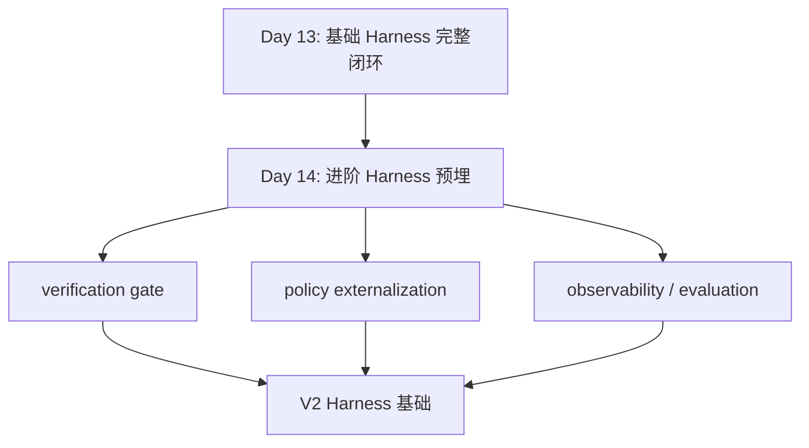
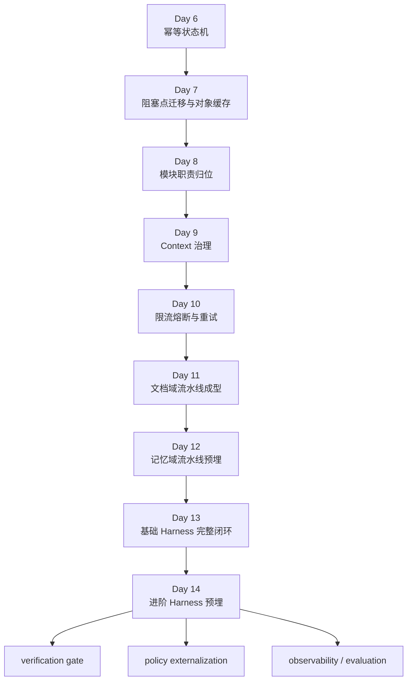

# Day 14：进阶 Harness 预埋

## 今天的总目标

- 在 Day 13 基础闭环之上，预埋 verification gate、policy externalization、observability 这 3 条进阶 Harness 线
- 不急着把复杂控制层全做完，而是先把接口、落点和扩展方向立起来
- 把“哪些策略现在写死在代码里”和“哪些检查现在只能靠人眼看脚本”明确列出来
- 为 Day 15 的标准能力暴露层预埋，提供更稳定的内部工程底座

## 今天结束前，你必须拿到什么

- 一套你自己能讲清楚的 3 条进阶 Harness 视图
- 一份最小 verification gate 检查清单
- 一份 policy externalization 的落点设计
- 一份 observability / evaluation 的最小指标表
- 一份最小化验证脚本，例如 `scripts2/debug_day14_advanced_harness.py`
- 一份你能自己讲清楚的“为什么 Day 14 不是立刻做完整平台化控制层”认知

---

## 今天开始，不能再只靠人眼盯 debug 脚本了

到 Day 13 为止，项目已经开始有了基础闭环：

- Runtime Harness 能讲顺
- Context Harness 能讲顺
- Module Boundary Harness 能讲顺
- Dual Pipeline Foundation 也开始成立

但现在仍然有一个明显现实：

```text
基础闭环已经有了
!=
系统已经具备进阶工程控制层
```

当前很多关键判断仍然主要靠：

- 人手动跑脚本
- 人看日志
- 人凭经验判断参数该不该调

所以 Day 14 的重点不是“把 V2 复杂平台一次性做完”，  
而是：

> 先把 V2 需要的 gate、policy、观测点预埋出来。

---

## Day 14 一图总览

如果把 Day 14 压缩成一句话，它做的就是：

> 不直接堆复杂控制层，而是先给验证闸门、策略外置、观测评估留好位置和接口。

今天的主链先背成这样：

```text
基础闭环已成立
-> 找到关键检查点
-> 找到关键策略项
-> 找到关键观测指标
-> 预埋进阶 Harness 接口
```

你今天要特别清楚：

- Day 13 的重点是“基础闭环已经开始成立”
- Day 14 的重点是“进阶闭环的入口和挂点先立住”
- Day 14 不是“完整平台控制层上线日”

---

## 为什么 Day 14 也要重构

很多人会误以为：

```text
Day 13 都已经闭环了
Day 14 就可以直接上复杂 V2 了
```

这句话问题很大。

因为如果没有 Day 14 这种“预埋层”，  
你后面会很容易在 3 个地方失控：

1. 验证全靠人工经验
2. 策略都写死在代码里
3. 运行时和质量问题没有稳定观测点

现在仓库里已经能明显看到这些信号：

- `clients/text_splitter_client.py` 里 `chunk_size=500`、`chunk_overlap=100` 直接写死
- `services/context_service.py` 里 `context_budget=4000` 还是函数默认值
- `conf/config.py` 已经有 `INDEX_VECTOR_BATCH_SIZE`、retry、breaker 参数，但还没形成完整 policy 视图
- debug 脚本很多，但 verification gate 还没有统一入口

所以 Day 14 的一句话目标就是：

> 不急着把控制层做满，而是先把控制层未来应该挂在哪里讲清楚。

---

## Day 13 到 Day 14 的交接图



这张图你要记住：

- Day 13 回头确认“基础层已经成立”
- Day 14 开始给“进阶控制层”留挂点

---

## 第 1 层：先把 Day 14 的 3 条进阶 Harness 分清楚

### 第 1 条：Verification Gate

它关注的是：

- 一次索引结束后，最少应该检查什么
- 一次 context 组装结束后，最少应该检查什么
- 一次 memory entry 抽取结束后，最少应该检查什么

它解决的是：

- 系统是不是只能“跑完”，还不能“验完”

### 第 2 条：Policy Externalization

它关注的是：

- chunk 规则是不是写死在代码里
- batch 规则是不是写死在代码里
- retry 规则是不是分散在函数参数里
- context packing 规则是不是写死在实现里

它解决的是：

- 后面调策略时，是不是只能直接改源码

### 第 3 条：Observability / Evaluation

它关注的是：

- 一次任务耗时能不能看到
- 失败原因能不能稳定落下来
- context 治理前后统计能不能稳定看见
- memory entry 抽取量和去重后数量能不能看见

它解决的是：

- 后面出现质量问题时，是不是根本无从定位

---

## 第 2 层：结合当前项目，Day 14 的真实问题点

### 问题 1：Verification 现在还主要停留在 debug 脚本阶段

当前仓库里已经有不少 debug 脚本：

- `scripts2/debug_day10.py`
- `scripts2/debug_day11_pipeline.py`
- `scripts2/debug_day12_memory_pipeline.py`
- `scripts2/debug_day13_harness.py`

这说明：

- 已经有最小验证意识

但它还没有升级成：

- 统一 verification gate 视图

也就是说：

- 你知道怎么手动验
- 但系统自己还不知道哪些检查点最关键

### 问题 2：策略项已经开始出现，但散落在多个位置

当前真实散落位置大概是：

- `clients/text_splitter_client.py`：`chunk_size`、`chunk_overlap`
- `conf/config.py`：`INDEX_VECTOR_BATCH_SIZE`
- `services/context_service.py`：`context_budget` 默认值、`max_merged_length` 默认值
- `infra/retry.py`、`infra/circuit_breaker.py`：策略能力存在，但更多参数还是由调用方散落传入

这说明：

- policy 不是没有
- 而是还没有形成“可统一查看和调整”的视图

### 问题 3：Observability 已经有零散统计，但没有统一指标口径

当前仓库里已经能看到一些统计信号：

- `document_index_pipeline.py` 会返回 `chunk_count / vector_batch_count / indexed_vector_count`
- `context_service.py` 会返回 `raw_count / dedup_count / merged_count / final_count`
- `memory_extract_pipeline.py` 会返回 `raw_entry_count / dedup_entry_count / persisted_entry_count`

这说明：

- 观测点已经开始出现

但还没形成：

- 一份统一指标表
- 一套最值得看的最小指标口径

### 问题 4：有些基础边界问题如果不先记录，后面进阶 Harness 会建错地方

比如当前仓库里还存在：

- `routers/profile.py`、`routers/companion.py` 的 knowledge base 口径未完全收紧

如果 Day 14 不先把这些“前置缺口”写清楚，  
后面做 verification gate 时就会有风险：

- gate 挂在有问题的边界上

那越往后越乱。

---

## 第 3 层：Day 14 的最稳边界

### 边界 1：Day 14 只做预埋，不做完整平台化

今天先不做：

- 完整 verification framework
- 完整策略中心
- 完整 metrics backend
- 完整线上 evaluation 平台

今天更合理的目标是：

- 定义挂点
- 定义输入输出
- 定义最小检查项

### 边界 2：Verification Gate 先做“最小必检项”，不要追求全自动

比如今天先明确：

- 索引后必须检查 `chunk_count > 0`
- context 治理后必须检查 `final_count > 0 or sources empty`
- memory 抽取后必须检查 `raw_entry_count >= dedup_entry_count >= persisted_entry_count`

第一版做到这些就够了。

### 边界 3：Policy Externalization 先做“集中命名”和“未来位置”，不是今天就全部配置化

更稳的第一步是：

- 先列出哪些策略项应该外置
- 再确定它们未来放在哪

而不是今天就把所有调用都重写。

### 边界 4：Observability 先做“统一指标表”，不是今天就接监控平台

今天真正值得交付的是：

- 指标名
- 指标含义
- 指标产生位置

而不是：

- 马上接 Prometheus / Grafana

---

## 第 4 层：今天要改哪些文件

Day 14 主要围绕这些文件展开：

- `rebuild/day14.md`
- `rebuild/day14_verification_checklist.md`
- `rebuild/day14_policy_map.md`
- `rebuild/day14_observability_metrics.md`
- `scripts2/debug_day14_advanced_harness.py`
- `conf/config.py`
- `clients/text_splitter_client.py`
- `services/context_service.py`
- `pipelines/document_index_pipeline.py`
- `pipelines/memory_extract_pipeline.py`

### 每个文件今天负责什么

| 文件 | 今天负责什么 |
|---|---|
| `rebuild/day14.md` | 讲清 3 条进阶 Harness 视图 |
| `rebuild/day14_verification_checklist.md` | 列出最小 gate 检查项 |
| `rebuild/day14_policy_map.md` | 列出该外置的策略项与未来落点 |
| `rebuild/day14_observability_metrics.md` | 列出最小指标口径 |
| `scripts2/debug_day14_advanced_harness.py` | 打印 gate / policy / metrics 的最小证据 |
| `conf/config.py` | 承接第一批适合集中放置的策略项 |
| `clients/text_splitter_client.py` | 代表 chunk policy 当前写死位置 |
| `services/context_service.py` | 代表 context packing policy 当前写死位置 |
| `pipelines/document_index_pipeline.py` | 代表索引结果 gate 和观测点 |
| `pipelines/memory_extract_pipeline.py` | 代表 memory gate 和观测点 |

---

## 第 5 层：今天不要做什么

Day 14 不建议做：

- 不接完整监控栈
- 不做复杂自动评测系统
- 不把所有策略项一次性完全配置化
- 不给所有流水线补全自动 gate
- 不重写 profile / companion 路由
- 不把 Day 15 的标准能力暴露层提前做掉

今天的原则是：

```text
先定义
-> 哪些地方该检查
-> 哪些参数该外置
-> 哪些指标该观测

而不是立刻把整套平台全做完
```

---

## 上午学习：09:00 - 12:00

## 09:00 - 09:50：先把 Day 14 的主问题讲顺

### 今天你要能顺着说出来

```text
基础闭环已经成立
-> 现在开始找验证点
-> 找策略项
-> 找观测点
-> 预埋进阶 Harness
```

### 你必须能回答这两个问题

1. 为什么 Day 14 不能直接跳到复杂 V2 控制层？
2. 为什么 verification、policy、observability 这三条线必须一起看？

---

## 09:50 - 10:40：先把最小 verification gate 列出来

### 索引链最小 gate

第一版建议先检查：

- `chunk_count > 0`
- `indexed_vector_count > 0`
- `vector_batch_count >= 1`
- `status == "indexed"`

### Context 链最小 gate

第一版建议先检查：

- `raw_count >= dedup_count`
- `merged_count >= final_count`
- `final_count >= 0`
- 有 sources 时 `context_text` 不应为空

### Memory 链最小 gate

第一版建议先检查：

- `raw_entry_count >= dedup_entry_count`
- `dedup_entry_count >= persisted_entry_count`
- `persisted_entry_count >= 0`

### 这一段真正要表达什么

verification gate 第一版不需要很聪明，  
但必须：

- 简单
- 稳
- 能挡住明显错误

---

## 10:40 - 11:30：先把最值得外置的 policy 列出来

### 当前最值得外置的 policy

至少包括：

- chunk policy
  - `chunk_size`
  - `chunk_overlap`
  - `separators`
- vector batch policy
  - `INDEX_VECTOR_BATCH_SIZE`
- retry policy
  - `max_attempts`
  - `base_delay_seconds`
  - `max_delay_seconds`
- breaker policy
  - `failure_threshold`
  - `recovery_timeout_seconds`
- context packing policy
  - `top_k`
  - `context_budget`
  - `max_merged_length`

### 为什么今天先列清单，不急着全改代码

因为 Day 14 真正的重点是：

- 先确认未来有哪些策略值得独立出来

不是：

- 今天必须把每一条调用都重构完

---

## 11:30 - 12:00：先决定今天怎么验收

### Day 14 最直接的验收方式

你今天至少要能证明这 4 件事：

1. verification gate 已经有一份最小检查清单
2. policy externalization 已经有一份明确映射表
3. observability 已经有一份最小指标表
4. 至少有一个脚本能把这些挂点打印出来

---

## 下午编码：14:00 - 18:00

## 14:00 - 14:40：先写 `day14_verification_checklist.md`

### 这一段属于新增能力

这里最合理的第一版是把 gate 清单明确写出来。

### `rebuild/day14_verification_checklist.md` 练手骨架版

```md
# Day 14 Verification Checklist

## Document Index Gate
- [ ] chunk_count > 0
- [ ] indexed_vector_count > 0

## Context Gate
- [ ] raw_count >= dedup_count
- [ ] merged_count >= final_count

## Memory Gate
- [ ] raw_entry_count >= dedup_entry_count
- [ ] dedup_entry_count >= persisted_entry_count
```

### `rebuild/day14_verification_checklist.md` 参考答案

```md
# Day 14 Verification Checklist

## Document Index Gate
- [x] `chunk_count > 0`
- [x] `vector_batch_count >= 1`
- [x] `indexed_vector_count > 0`
- [x] `status == "indexed"`

## Context Gate
- [x] `raw_count >= dedup_count`
- [x] `merged_count >= final_count`
- [x] `final_count >= 0`
- [x] 有 sources 时 `context_text` 不应为空

## Memory Gate
- [x] `raw_entry_count >= dedup_entry_count`
- [x] `dedup_entry_count >= persisted_entry_count`
- [x] `persisted_entry_count >= 0`
```

### 为什么 Day 14 值得先写这个清单

因为如果 gate 连“最少该检查什么”都没说清楚，  
后面你再接自动化也没有标准。

---

## 14:40 - 15:20：写 `day14_policy_map.md`

### 这一段也属于新增能力

这里不是马上全量配置化，  
而是先把映射关系写出来。

### `rebuild/day14_policy_map.md` 练手骨架版

```md
# Day 14 Policy Map

| policy | current location | future location |
|---|---|---|
| chunk_size | ? | ? |
| context_budget | ? | ? |
| retry max_attempts | ? | ? |
```

### `rebuild/day14_policy_map.md` 参考答案

```md
# Day 14 Policy Map

| policy | current location | future location |
|---|---|---|
| `chunk_size` | `clients/text_splitter_client.py` | `conf/config.py` |
| `chunk_overlap` | `clients/text_splitter_client.py` | `conf/config.py` |
| `separators` | `clients/text_splitter_client.py` | `conf/config.py` |
| `INDEX_VECTOR_BATCH_SIZE` | `conf/config.py` | `conf/config.py` |
| `context_budget` | `services/context_service.py` | `conf/config.py` |
| `max_merged_length` | `services/context_service.py` | `conf/config.py` |
| `EXTERNAL_RETRY_MAX_ATTEMPTS` | `conf/config.py` | `conf/config.py` |
| `CIRCUIT_BREAKER_FAILURE_THRESHOLD` | `conf/config.py` | `conf/config.py` |
```

### 为什么这一步有价值

因为从 Day 14 开始，  
你要逐步把“改源码调策略”变成“改策略项调行为”。

---

## 15:20 - 16:00：写 `day14_observability_metrics.md`

### 这一段同样属于新增能力

今天最值得先定义的是最小指标表。

### `rebuild/day14_observability_metrics.md` 练手骨架版

```md
# Day 14 Observability Metrics

| metric | source | meaning |
|---|---|---|
| ? | ? | ? |
```

### `rebuild/day14_observability_metrics.md` 参考答案

```md
# Day 14 Observability Metrics

| metric | source | meaning |
|---|---|---|
| `document.chunk_count` | `document_index_pipeline` | 单文档切分出的 chunk 数 |
| `document.vector_batch_count` | `document_index_pipeline` | 单文档向量写入批次数 |
| `document.indexed_vector_count` | `document_index_pipeline` | 单文档成功写入向量数 |
| `context.raw_count` | `context_service` | 原始召回片段数 |
| `context.dedup_count` | `context_service` | 去重后片段数 |
| `context.merged_count` | `context_service` | 合并后片段数 |
| `context.final_count` | `context_service` | 最终进入 context 的片段数 |
| `memory.raw_entry_count` | `memory_extract_pipeline` | 原始抽取词条数 |
| `memory.dedup_entry_count` | `memory_extract_pipeline` | 去重后词条数 |
| `memory.persisted_entry_count` | `memory_extract_pipeline` | 持久化成功词条数 |
```

### 为什么 Day 14 要先做这个表

因为进阶 Harness 的观测第一步，  
不是多做几个 logger，  
而是先统一：

- 到底该看哪些数

---

## 16:00 - 16:40：写一个最小进阶 Harness 脚本

### `scripts2/debug_day14_advanced_harness.py` 练手骨架版

```python
import asyncio


async def main():
    # 你要做的事：
    # 1. 打印 verification gate 示例
    # 2. 打印 policy map 示例
    # 3. 打印 observability metric 示例
    pass


if __name__ == "__main__":
    asyncio.run(main())
```

### `scripts2/debug_day14_advanced_harness.py` 参考答案

```python
import asyncio
import sys
from pathlib import Path

PROJECT_ROOT = Path(__file__).resolve().parent.parent
if str(PROJECT_ROOT) not in sys.path:
    sys.path.insert(0, str(PROJECT_ROOT))

from conf.config import settings
from services.context_service import build_query_context
from pipelines.document_index_pipeline import run_document_index_pipeline
from pipelines.memory_extract_pipeline import run_memory_extract_pipeline


async def main():
    print("verification_gate_examples")
    print("document_index_gate=chunk_count > 0, indexed_vector_count > 0")
    print("context_gate=raw_count >= dedup_count >= final_count")
    print("memory_gate=raw_entry_count >= dedup_entry_count >= persisted_entry_count")
    print()

    print("policy_examples")
    print(f"index_vector_batch_size={settings.INDEX_VECTOR_BATCH_SIZE}")
    print(f"retry_max_attempts={settings.EXTERNAL_RETRY_MAX_ATTEMPTS}")
    print(f"breaker_failure_threshold={settings.CIRCUIT_BREAKER_FAILURE_THRESHOLD}")
    print("chunk_policy_source=clients/text_splitter_client.py")
    print("context_budget_source=services/context_service.py")
    print()

    print("observability_examples")
    print(f"document_pipeline_fn={run_document_index_pipeline.__name__}")
    print(f"memory_pipeline_fn={run_memory_extract_pipeline.__name__}")
    print(f"context_builder_fn={build_query_context.__name__}")


if __name__ == "__main__":
    asyncio.run(main())
```

### 为什么 Day 14 值得写这个脚本

因为 Day 14 你真正想证明的是：

- 这些进阶挂点已经有位置
- 不只是脑子里知道该做什么

---

## 16:40 - 17:20：把前置缺口和 Day 14 的关系讲清楚

### 为什么要把 `profile/companion` 的口径问题继续留在视野里

因为这些地方还没完全收口，  
会直接影响后面 gate 的挂法。

比如如果：

- 路径按 knowledge base
- 取数却按 user

那你后面做 evaluation 和 verification 时，  
口径就可能天然是歪的。

### Day 14 在这里最正确的态度

不是今天把它们全修完，  
而是：

- 明确记录
- 明确影响
- 明确后面应该在哪层处理

---

## 17:20 - 18:00：整理 Day 14 之后的进阶认知

### 到 Day 14 为止，项目应该开始变成这样

```text
基础闭环
-> 已经成立

进阶 Harness
-> gate 已定义
-> policy 已梳理
-> metrics 已列清
-> 但还没全自动落地
```

### 这意味着什么

- Day 14 后，项目不再只是“能跑”
- 也不再只是“能讲”
- 开始进入“可验证、可调参、可追踪”的预备阶段

---

## Day 6 - Day 14 总结总图



### 这张图要表达什么

```text
先把底座搭稳
-> 再把闭环收住
-> 再给进阶控制层留接口
```

这就是 Day 14 的核心。

---

## 晚上复盘：20:00 - 21:00

### 今晚你必须自己讲顺的 8 个点

1. 为什么 Day 14 不能直接跳到完整 V2 平台？
2. verification gate、policy externalization、observability 三条线各自负责什么？
3. 为什么 Day 14 更像“预埋层”而不是“完工层”？
4. 当前仓库里最值得外置的策略项有哪些？
5. 为什么统一指标表是 observability 的第一步？
6. 为什么 debug 脚本在 Day 14 仍然很重要？
7. 哪些基础边界问题会影响进阶 Harness 的挂法？
8. Day 14 给 Day 15 的真正交接价值是什么？

---

## 今日验收标准

- verification gate 已有最小检查清单
- policy externalization 已有最小映射表
- observability / evaluation 已有最小指标表
- 有一个最小进阶 Harness 脚本
- 你能明确说出哪些策略项最值得先外置
- 你能明确说出哪些指标最值得先看
- 你能明确说出 Day 14 现在还只是“预埋”，不是“完整平台”

---

## 今天最容易踩的坑

### 坑 1：忍不住今天就把平台全做完

问题：

- 范围会立刻爆炸
- 最后什么都不稳

规避建议：

- 坚持 Day 14 先定义挂点，不做完整平台

### 坑 2：只谈策略，不谈验证和观测

问题：

- 看起来更“架构”
- 实际没有闭环

规避建议：

- 三条线必须一起出现

### 坑 3：把 policy externalization 变成纯“配置搬家”

问题：

- 文件位置变了
- 但没有形成统一策略视图

规避建议：

- 先写 policy map，再谈逐步迁移

### 坑 4：指标很多，但没有最小核心指标

问题：

- 看起来很全
- 实际没人知道先看什么

规避建议：

- 先定义最小指标表

### 坑 5：不承认基础边界问题会影响进阶 Harness

问题：

- gate 和 evaluation 可能挂错位置

规避建议：

- 把 knowledge base 口径未收口这些风险继续显式写出来

---

## 给明天的交接提示

明天会进入 Day 15：`MCP 标准能力层预埋`。

Day 15 的重点不是“跳过内部架构直接暴露标准能力”，  
而是：

> 当内部已经有基础闭环，也开始有 verification、policy、metrics 这些进阶挂点时，  
> 你才更适合思考：哪些能力值得以标准化方式暴露给外部工具层。

所以 Day 14 最关键的交接只有一句话：

```text
项目已经不只是有基础闭环，还开始拥有进阶 Harness 的挂点和口径，接下来才能更稳地进入标准能力暴露层的预埋阶段。
```
