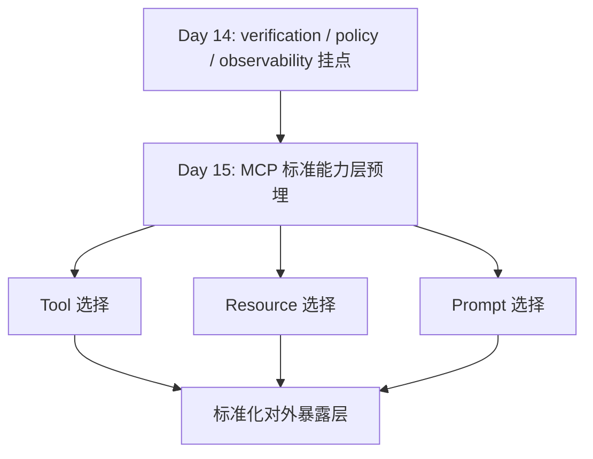
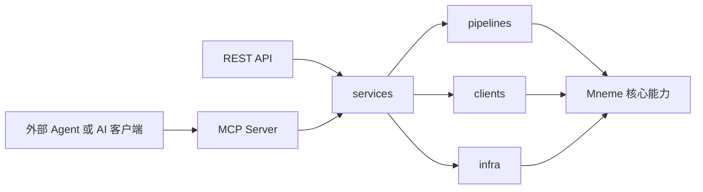
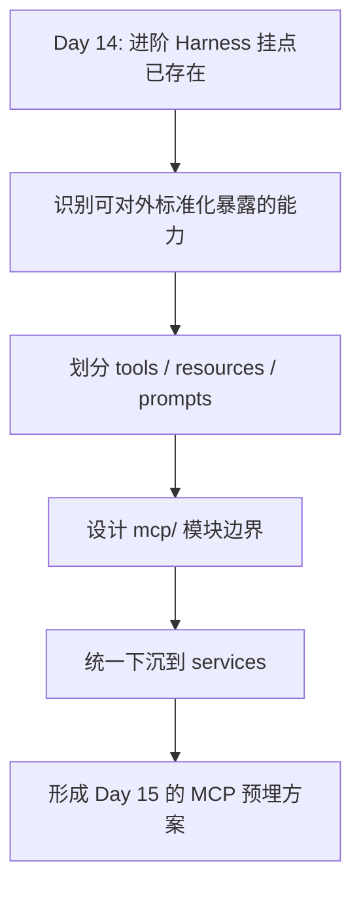

# Day 15：MCP 标准能力层预埋

## 今天的总目标

- 在 Day 14 已经预埋 verification、policy、observability 之后，继续预埋一层标准化能力暴露接口
- 明确 MCP 的定位是 `REST API` 之外的标准能力层，而不是替代 `worker / state machine / retry / breaker`
- 先挑出最稳定、最适合标准化暴露的能力，而不是把所有内部接口一次性映射出去
- 为 Mneme 后续接入外部 Agent、AI 客户端、工具运行时留下统一接入点

## 今天结束前，你必须拿到什么

- 一份你自己能讲清楚的 MCP 定位说明
- 一份 Mneme 当前阶段适合暴露的第一批能力清单
- 一份 `mcp/` 模块的最小目录设计
- 一份 MCP 与 `services / pipelines / clients / infra` 的调用边界图
- 一份最小验证脚本方向，例如 `scripts2/debug_day15_mcp_contract.py`
- 一份你能明确说清楚的“为什么 Day 15 仍然是预埋，不是全面接入日”认知

---

## 到 Day 15，项目不能只停留在“自己能用”

到 Day 14 为止，项目已经具备了这些关键基础：

- 索引任务化已经成立
- 状态机和恢复语义已经成立
- `services / pipelines / clients / infra` 边界已经开始成立
- verification、policy、observability 已经开始有挂点
- memory pipeline 和 companion/profile 相关链路已经开始出现

但这时还存在一个更长期的问题：

```text
内部后端已经越来越完整
!=
外部 Agent 可以稳定、标准化地调用它
```

现在项目对外主要还是：

- REST API
- 手动调接口
- 手动跑 debug 脚本

这意味着：

- 你自己能调用
- 但外部 AI 工具生态还不能低成本接入

所以 Day 15 的重点不是“今天把 MCP Server 全接完”，  
而是：

> 先把 Mneme 里哪些能力适合被标准化暴露，以及这层应该挂在哪里讲清楚。

---

## Day 15 一图总览

如果把 Day 15 压缩成一句话，它做的就是：

> 在稳定内部底座之上，预埋一层给外部 Agent 用的标准能力暴露接口。

今天主链先背成这样：

```text
内部能力边界基本成立
-> 识别哪些能力稳定且高价值
-> 区分哪些能力适合暴露为 tool / resource / prompt
-> 设计 mcp/ 适配层
-> 保持 MCP 只做协议暴露，不吞业务逻辑
```

你今天要特别清楚：

- Day 14 解决的是“进阶 Harness 挂点”
- Day 15 解决的是“标准化能力暴露挂点”
- Day 15 不是“协议层上线替代内部主链”

---

## 为什么 Day 15 仍然是预埋，而不是直接上 MCP Server

很多人到这一步会很兴奋，容易马上想做：

```text
直接加一个 mcp/server.py
直接把所有 router 都映射成 tool
然后宣布系统支持 MCP
```

这条路风险很大。

因为如果现在直接硬接：

1. 很容易把 REST API 和 MCP 各写一套逻辑
2. 很容易把还不稳定的内部接口直接暴露出去
3. 很容易把权限、审计、配额这些问题推迟，最后返工
4. 很容易让 MCP handler 反过来侵入 `services` 设计

所以 Day 15 的一句话目标是：

> 不是急着“支持 MCP”，而是先把“如何低风险支持 MCP”讲清楚。

---

## Day 14 到 Day 15 的交接图



这张图你要记住：

- Day 14 让内部能力更像“可治理系统”
- Day 15 才开始思考“哪些能力值得对外标准化”

---

## 第 1 层：先把 MCP 的职责边界讲透

### MCP 不负责什么

MCP 不替代这些内部能力：

- 不替代任务队列
- 不替代 worker
- 不替代状态机
- 不替代限流
- 不替代重试
- 不替代熔断
- 不替代 embedding、向量库、数据库这些底层依赖

这些仍然属于 Mneme 的内部运行时底座。

也就是说，这条关系一定要背熟：

```text
MCP 是标准暴露层
不是内部执行层
```

### MCP 负责什么

MCP 更适合负责：

- 把已有能力标准化暴露为外部可调用工具
- 把已有数据快照标准化暴露为资源
- 把可复用提示模板标准化暴露为 prompt
- 让外部 Agent 用统一协议调用 Mneme

也就是说，它的位置更像：

```text
外部 Agent / AI Client
-> MCP Server
-> services
-> pipelines / clients / infra
```

而不是：

```text
外部 Agent / AI Client
-> MCP Handler
-> 直接写核心业务
```

---

## 第 2 层：结合当前项目，Day 15 真正站得住的前提

如果没有前 14 天，Day 15 是很难成立的。

因为 MCP 想做稳，至少要先满足这些前提：

### 前提 1：核心业务不能散在接口层

现在项目已经逐步形成：

- `routers/` 负责 HTTP 入口
- `services/` 负责核心业务动作
- `pipelines/` 负责多步骤流程
- `clients/` 负责外部依赖
- `infra/` 负责运行时治理

这正是 Day 15 能成立的根基。

如果业务逻辑还都压在 router 里，  
你一做 MCP，就会立刻复制出第二份实现。

### 前提 2：内部执行模型必须先稳定

现在项目已经有：

- Celery 异步执行
- 任务状态流转
- retry / breaker / rate limit
- 文档索引 pipeline
- memory extract pipeline

这意味着：

- MCP 可以暴露能力
- 但真正执行能力的仍然是内部底座

### 前提 3：能力暴露前，至少要知道怎么验证

Day 14 已经开始建立：

- verification gate
- policy map
- observability 指标

这点很关键。

因为如果没有这些挂点，  
外部一旦通过 MCP 调用能力，出问题时你很难知道：

- 是工具调用层错了
- 还是内部服务层错了
- 还是策略参数错了

---

## 第 3 层：结合当前仓库，哪些能力适合第一批暴露

Day 15 最容易犯的错误，是把“项目里存在的接口”直接等价成“适合暴露的 MCP 能力”。

这两个概念并不相同。

判断标准应该是：

- 业务边界比较稳定
- 输入输出较清晰
- 外部调用价值高
- 不会立刻暴露一堆内部实现细节

### 第一批优先暴露的 MCP Tools

这 3 个最稳，应该放在第一批：

1. `search_kb`
   - 价值高
   - 输入输出边界清楚
   - 本质是标准检索能力

2. `submit_index_task`
   - 已经有明确任务化语义
   - 很适合给外部 Agent 发起索引任务

3. `get_index_task_status`
   - 和 `submit_index_task` 配对
   - 能把异步任务状态查询标准化

这 3 个加在一起，已经构成一个非常像样的标准能力组：

```text
知识检索
+ 异步索引提交
+ 异步索引状态查询
```

### 第二批再考虑的 MCP Tools

下面这些不是不能做，  
而是当前仓库阶段更适合谨慎推进：

1. `query_memory`
2. `profile_snapshot`
3. `companion_reply`

原因不是能力不重要，  
而是当前项目里这些链路仍有边界未完全收口的问题：

- user scope 和 knowledge base scope 口径还不够统一
- `routers/profile.py`、`routers/companion.py`、`pipelines/companion_pipeline.py` 的边界还不够干净
- 一部分能力更接近“应用态输出”，不一定适合作为 Day 15 第一批 MCP Tool

所以 Day 15 更稳的说法应该是：

> memory / profile / companion 相关能力可以列入 MCP 候选集，  
> 但第一批优先暴露知识检索和索引任务链。

---

## 第 4 层：Tool、Resource、Prompt 应该怎么分

这是 Day 15 必须讲清楚的另一件事。

### 什么适合做 Tool

适合做 Tool 的通常是：

- 有明确输入
- 有明确输出
- 表示一个动作或调用

例如：

- `search_kb`
- `submit_index_task`
- `get_index_task_status`

### 什么适合做 Resource

适合做 Resource 的通常是：

- 某种数据快照
- 某种稳定只读视图
- 某种供外部读取的结构化信息

例如：

- `document_resource`
- `kb_summary_resource`
- `profile_snapshot_resource`

但这里要注意，  
`profile_snapshot_resource` 当前更适合作为候选项，而不是 Day 15 首批强推项。

### 什么适合做 Prompt

适合做 Prompt 的通常是：

- 已经沉淀出复用价值的提示模板
- 适合被外部 Agent Runtime 调用
- 不直接耦合太多内部实现细节

例如：

- `document_qa_prompt`
- `memory_summary_prompt`
- `index_failure_analysis_prompt`

Day 15 这里不需要真的把 prompts 全建出来，  
但你要能讲清楚“为什么 prompt 也可以成为标准能力的一部分”。

---

## 第 5 层：推荐的 `mcp/` 模块落点

Day 15 的核心不是代码量，  
而是模块位置和边界要站稳。

推荐目录先这样预埋：

```text
mcp/
  server.py
  registry.py
  tools/
    search_kb.py
    submit_index_task.py
    get_index_task_status.py
    query_memory.py
  resources/
    document_resource.py
    kb_summary_resource.py
    profile_snapshot_resource.py
  prompts/
    document_qa_prompt.py
    memory_summary_prompt.py
    index_failure_analysis_prompt.py
```

这里最重要的设计原则只有 3 句：

1. `mcp/` 只负责协议适配和能力注册
2. 真正业务逻辑继续留在 `services/`
3. 多步骤流程继续留在 `pipelines/`

也就是说，不要写成这样：

```text
mcp/tools/search_kb.py
-> 直接拼数据库查询
-> 直接调用向量库
-> 直接在里面做复杂上下文裁剪
```

而应该写成这样：

```text
mcp/tools/search_kb.py
-> 参数校验
-> 调用 query_service / context_service / document_service
-> 返回协议层结果
```

---

## 第 6 层：Mneme 在 Day 15 的推荐调用图



这张图要反复看，  
因为它直接决定了后面会不会出现“两套业务逻辑”。

你一定要守住这件事：

```text
REST API 和 MCP 是两个入口
但不是两套系统
```

---

## 第 7 层：结合当前项目，Day 15 先做哪些“预埋”最合理

如果今天是教学推进日，而不是一次性大开发日，  
那 Day 15 最值得做的其实是下面这 5 件事：

### 任务 1：写出第一批 MCP 能力清单

先定清楚：

- 哪些是首批 tool
- 哪些是候选 resource
- 哪些是候选 prompt

这比直接写 server 更重要。

### 任务 2：写出 `mcp/` 的目录设计

先把模块放在哪里讲清楚，  
后面接入成本才会低。

### 任务 3：写出调用边界图

明确：

- MCP 不直接写业务
- MCP 统一下沉到 `services`

### 任务 4：写出首批 contract

例如给首批 tool 定最小输入输出：

- `search_kb(kb_id, query, top_k, filters)`
- `submit_index_task(document_id, kb_id)`
- `get_index_task_status(task_id)`

Day 15 不一定要真接协议库，  
但 contract 要先能讲清楚。

### 任务 5：写一个最小 debug / harness 验证脚本方向

例如：

- `scripts2/debug_day15_mcp_contract.py`

这个脚本不一定是完整 MCP Server 集成测试，  
它更像是先验证：

- 首批 tool 的输入输出结构是否稳定
- service 入口是否足够适合被协议层复用

---

## 第 8 层：Day 15 的最小 contract 示例

下面这个示意不是让你今天全部实现，  
而是让你知道 Day 15 的标准能力长什么样。

### Tool 1：`search_kb`

输入：

```json
{
  "kb_id": 1,
  "query": "异步索引为什么要任务化",
  "top_k": 5,
  "filters": {}
}
```

输出：

```json
{
  "items": [
    {
      "document_id": 12,
      "chunk_id": 88,
      "score": 0.91,
      "text": "..."
    }
  ],
  "count": 1
}
```

### Tool 2：`submit_index_task`

输入：

```json
{
  "document_id": 12,
  "kb_id": 1
}
```

输出：

```json
{
  "task_id": "task-123"
}
```

### Tool 3：`get_index_task_status`

输入：

```json
{
  "task_id": "task-123"
}
```

输出：

```json
{
  "task_id": "task-123",
  "status": "embedding",
  "step": "embedding",
  "message": null,
  "stats": {
    "chunk_count": 42
  }
}
```

Day 15 讲到这里，你就已经开始进入“协议视角”了。

---

## 第 9 层：为什么 Day 15 不应该直接把所有 router 变成 MCP Tool

这是最容易踩的坑之一。

因为 Router 的存在，  
不等于它天然就是一个好的 MCP Tool。

原因包括：

1. 有些 router 更偏应用态接口，不够通用
2. 有些 router 输入输出更适合 HTTP，不适合标准工具调用
3. 有些 router 还夹杂用户身份、页面语义或组合型逻辑
4. 有些 router 背后的 service 边界还没完全稳定

所以你今天一定要会说这句话：

> MCP 不是把现有接口原样搬过去，  
> 而是重新挑出最标准、最稳定、最值得暴露的能力集合。

---

## 第 10 层：Day 15 的最小完成标准

如果今天结束时，你已经做到下面这些，Day 15 就算成立了：

- 你能清楚解释 MCP 不是内部 runtime 的替代品
- 你能列出第一批最值得暴露的 3 个 tool
- 你能解释为什么 memory / profile / companion 更适合放候选批次
- 你能画出 `MCP -> services -> pipelines / clients / infra` 调用图
- 你能给出 `mcp/` 的最小目录结构
- 你能写出一个最小 contract 校验脚本方向

如果这些都没有，  
而只是多了一个空的 `server.py`，那 Day 15 其实没完成。

---

## Day 15 总流程图



---

## 今天最容易踩的坑

### 坑 1：把 MCP 当成新的业务层

问题：

- 很快会和 `services` 打架
- 最后形成两套实现

规避建议：

- MCP 层只做协议适配和注册

### 坑 2：把所有现有接口都暴露出去

问题：

- 暴露面过大
- 权限和治理来不及跟上

规避建议：

- 第一批只保留最稳定、最标准的能力

### 坑 3：在能力边界还没稳时提前暴露 memory / companion

问题：

- 后面一收边界就要返工

规避建议：

- 先把它们列入候选批次，不强行塞进首批

### 坑 4：以为接上协议库就等于完成 Day 15

问题：

- 有壳没有能力模型
- 有入口没有 contract

规避建议：

- 先定能力集合，再谈协议实现

### 坑 5：忽略验证、策略和观测挂点

问题：

- 外部调用一来，定位成本暴涨

规避建议：

- Day 15 一定建立在 Day 14 的进阶 Harness 预埋之上

---

## 给这一阶段收束的交接提示

如果 Day 1 到 Day 14 解决的是：

```text
如何把 Mneme 从同步原型做成稳定、任务化、可治理的后端
```

那么 Day 15 解决的就是：

```text
如何在不破坏内部主链的前提下，
为 Mneme 预埋一层面向外部 Agent 的标准能力暴露接口
```

所以 Day 15 最重要的一句话只有这一句：

> Mneme 的长期方向不只是“自己能跑”，  
> 而是“在稳定内部底座之上，能够被外部 Agent 以标准方式调用”。

到这里，Day 1 - Day 15 这条主线就完整了。
