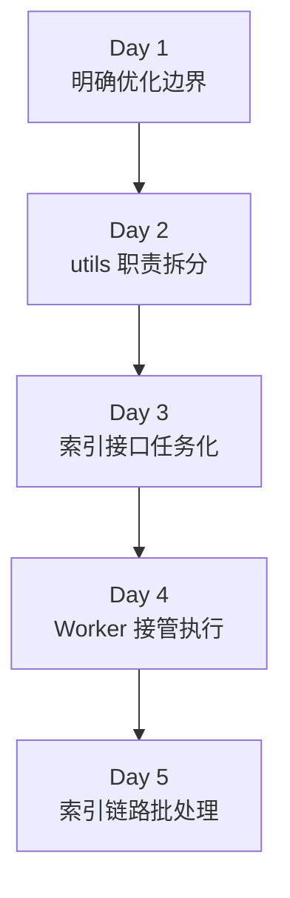
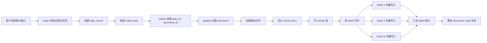

# Day 5：索引链路批处理

## 今天的总目标

- 让索引链路开始按 batch 处理 chunk，而不是整批一把梭或一条一条慢慢跑
- 给 embedding / vector upsert 增加可配置的 batch size
- 让 `document_index_pipeline` 返回批处理统计信息
- 为 Day 6 的状态机和 Day 7 的阻塞点治理准备更稳定的执行模型
- 在文档末尾总结 Day 1 到 Day 5 的阶段成果，并画出总流程图

## 今天结束前，你必须拿到什么

- 一套你自己能讲清楚的“为什么先做批处理，再做更细治理”认知
- `conf/config.py` 里的批处理配置项设计
- `clients/vector_store_client.py` 的批处理入口设计
- `pipelines/document_index_pipeline.py` 的批处理接入方案
- 一份 Day 1 - Day 5 阶段成果总结
- 一张前五天成果串联流程图

---

## 今天开始，索引链路不能再一把处理到底

Day 4 已经把最重要的事情做成了：

```text
API 提交任务
-> worker 接住任务
-> pipeline 真正执行索引
```

这意味着索引主链路已经从请求线程里挪出来了。  
但这还不等于它已经有吞吐能力。

如果 Day 4 之后你的 pipeline 还是这样跑：

```text
拿到全部 chunk_docs
-> 一次性 add_documents(...)
-> 一次性等待完成
```

那它虽然不再堵 HTTP 请求，  
但还是会有几个明显问题：

- 大文档时单次处理过重
- embedding 和向量写入压力集中在一个调用里
- 日志和错误定位粒度太粗
- 后面想做重试、补偿、分段统计都不方便

所以 Day 5 的核心不是“再换一个架构”，  
而是：

> 在 Day 4 已经建立的 worker + pipeline 执行入口上，开始把索引链路改成可控批处理。

---

## 第 1 层：Day 5 的核心变化是什么

今天最核心的变化可以用一句话讲清楚：

```text
完整 chunk 列表一次性处理
-> chunk 列表按 batch 分段处理
```

你可以把 Day 4 和 Day 5 的区别理解成：

- Day 4：任务真的能执行
- Day 5：任务开始有吞吐调优空间

### Day 4 更像这样

```text
chunk_docs
-> add_documents_to_vector_store(chunk_docs)
-> 全部完成
```

### Day 5 更像这样

```text
chunk_docs
-> 按 batch 切片
-> batch 1 写入
-> batch 2 写入
-> batch 3 写入
-> 汇总 batch_count / total_count
```

这个变化很朴素，  
但它是后面性能治理的第一步。

---

## 第 2 层：为什么 Day 5 先做批处理，而不是直接做并发

很多人一看到“吞吐不够”，第一反应就是上并发。

但 Day 5 不建议直接跳到复杂并发，原因很简单：

### 批处理比并发更容易控风险

你先把一个长列表切成多个 batch，  
系统就已经有了：

- 更小的执行单元
- 更清晰的日志边界
- 更稳定的资源占用

而不需要一上来处理：

- 多 worker 竞争
- 批之间的顺序问题
- 失败补偿复杂度
- 更细粒度并发控制

### 当前项目更适合先做 batch

因为当前仓库的主链路才刚完成：

- Day 3：提交任务
- Day 4：worker 接管执行

这时候最稳的做法不是马上做复杂并发，  
而是先把每次 worker 内部的处理单位变小。

### Day 5 的目标不是“最快”

今天要的是：

> 从“能执行”变成“能按受控批次执行”。

这是为后面继续优化做地基。

---

## 第 3 层：今天真正的数据流是什么

Day 5 这条链路你要非常清楚：

```text
worker 拿到 document_id
-> pipeline 生成 chunk_docs
-> chunk_docs 按 batch size 切片
-> 每个 batch 调 vector store 写入
-> 记录每批大小和累计数量
-> 最终汇总 total_chunks / batch_count
-> 更新任务结果
```

在当前架构下，最务实的第一版做法是：

```text
split 完整 chunk_docs
-> 按 batch 做 vector upsert
```

也就是说，Day 5 第一版重点先放在：

- 向量写入的 batch 控制
- embedding 随着 batch 切片一起受控

因为当前 `Milvus + LangChain` 这层通常是：

```text
vector_store.add_documents(batch_docs)
```

embedding 会随每个 batch 的 `add_documents(...)` 一起发生。

---

## 第 4 层：今天先用什么 batch 参数最合理

今天最容易纠结的问题是：

- embedding batch size 要不要一个参数
- vector upsert batch size 要不要另一个参数

### Day 5 最务实的第一版

先支持一个统一参数就够了：

```text
INDEX_VECTOR_BATCH_SIZE
```

或者叫：

```text
INDEX_BATCH_SIZE
```

都可以。

### 为什么 Day 5 先不强拆两个参数

因为当前这条链路里：

- embedding 和 upsert 还是通过 `vector_store.add_documents(...)` 连在一起
- 先把 batch 切片逻辑稳定下来更重要

等后面 embedding service 独立化时，  
再细拆：

- embedding batch size
- vector upsert batch size

会更合理。

### Day 5 推荐初始值

先从：

- `64`

开始最稳。

如果文档更大或内存更紧，  
可以先回落到：

- `32`

今天不追求“最佳值”，  
只要先把 batch 控制能力建立起来就够了。

---

## 第 5 层：今天到底改哪些文件

Day 5 主要围绕这几个文件展开：

- `conf/config.py`
- `clients/vector_store_client.py`
- `pipelines/document_index_pipeline.py`
- `tasks/index_tasks.py`

如果 Day 2 的迁移你已经做完，  
就直接基于这些新路径继续改。

如果 Day 2 还没完全落地，  
那 Day 5 的思路也一样，只是路径临时对应到旧模块。

### 每个文件今天负责什么

| 文件 | 今天负责什么 |
|---|---|
| `conf/config.py` | 提供 batch size 配置 |
| `clients/vector_store_client.py` | 提供分 batch 的向量写入能力 |
| `pipelines/document_index_pipeline.py` | 接入 batch 写入并汇总统计 |
| `tasks/index_tasks.py` | 可选记录 batch 统计日志 |

---

## 第 6 层：今天不要做什么

Day 5 不建议做：

- 不直接做多 worker 并发调度
- 不直接做完整阶段状态机
- 不直接做对象缓存
- 不直接做熔断和重试
- 不直接做 context 去重和 budget 控制
- 不直接做 embedding service 独立部署

今天只做：

> 让单个 worker 内部的索引链路开始按 batch 执行。

---

## 上午学习：09:00 - 12:00

## 09:00 - 09:50：把 Day 5 的主链路讲顺

### 今天你要能顺着说出来

```text
Day 3 让接口返回 task_id
-> Day 4 让 worker 真正执行索引
-> Day 5 让 worker 内部的索引链路开始按 batch 处理
-> 每个 batch 都有更可控的资源占用和统计粒度
```

### 你必须能回答这两个问题

1. 为什么 Day 5 不应该直接跳到复杂并发？
2. 为什么 batch 能让 Day 6 和 Day 7 更容易继续做下去？

---

## 09:50 - 10:40：先把批处理边界讲清楚

### 今天先处理哪一段最合理

在当前项目里，Day 5 第一版最适合先控制的是：

```text
chunk_docs
-> add_documents_to_vector_store(...)
```

也就是先把：

- embedding
- vector upsert

这条组合链按 batch 切起来。

### 为什么不是先改 chunk 生成

因为当前项目里的 chunk 生成还直接依赖：

- loader
- splitter
- metadata 整理

这部分牵涉面更大。  
Day 5 先从“向量写入按 batch”下手最稳。

---

## 10:40 - 11:30：先决定 batch 统计要长什么样

### Day 5 最少应该拿到这些统计

- `chunk_count`
- `vector_batch_count`
- `vector_batch_size`

如果你愿意，再多加一个：

- `indexed_vector_count`

### 为什么今天要统计这些

因为 Day 5 的价值不只是“分成多批”，  
还在于你要能知道：

- 一共切了多少 chunk
- 分成了几批
- 每批大概多大

否则后面做调优就没有依据。

---

## 11:30 - 12:00：先决定今天怎么验收

### Day 5 最直接的验收方式

今天最少要能回答：

1. batch size 从哪读
2. chunk_docs 怎么切 batch
3. 每个 batch 在哪一层被写入向量库
4. pipeline 最后如何汇总 batch 统计
5. 为什么这一步做完后，Day 6 更容易接状态机

---

## 下午编码：14:00 - 18:00

## 14:00 - 14:30：先补批处理配置

### 建议修改

- `conf/config.py`

### 今天建议新增

```python
INDEX_VECTOR_BATCH_SIZE: int = 64
```

### 如果你更喜欢通用命名

也可以直接用：

```python
INDEX_BATCH_SIZE: int = 64
```

### 今天的建议

为了避免未来混淆，我更建议你先写成：

```python
INDEX_VECTOR_BATCH_SIZE
```

因为 Day 5 处理的重点就是：

- vector upsert 的分批执行

后面 embedding service 独立出去时，  
再增加更细的 batch 配置。

---

## 14:30 - 15:20：在 `clients/vector_store_client.py` 增加批处理能力

### 这一段属于新增能力，不是普通迁移

所以这里应该先给壳子，再给参考实现。

### `clients/vector_store_client.py` 练手骨架版

```python
from langchain_core.documents import Document as LCDocument


def build_document_batches(
    chunk_docs: list[LCDocument],
    *,
    batch_size: int,
) -> list[list[LCDocument]]:
    # 你要做的事：
    # 1. 校验 batch_size > 0
    # 2. 按 batch_size 切片
    # 3. 返回二维列表
    raise NotImplementedError("先自己实现 build_document_batches")


async def add_documents_to_vector_store_in_batches(
    *,
    chunk_docs: list[LCDocument],
    batch_size: int,
) -> dict:
    # 你要做的事：
    # 1. 先切分 batches
    # 2. 逐批调用 vector_store.add_documents(...)
    # 3. 汇总 batch_count / total_count
    raise NotImplementedError("先自己实现 add_documents_to_vector_store_in_batches")
```

### `clients/vector_store_client.py` 参考答案

```python
from langchain_core.documents import Document as LCDocument


def build_document_batches(
    chunk_docs: list[LCDocument],
    *,
    batch_size: int,
) -> list[list[LCDocument]]:
    if batch_size <= 0:
        raise ValueError("batch_size must be greater than 0")

    return [
        chunk_docs[index:index + batch_size]
        for index in range(0, len(chunk_docs), batch_size)
    ]


async def add_documents_to_vector_store_in_batches(
    *,
    chunk_docs: list[LCDocument],
    batch_size: int,
) -> dict:
    if not chunk_docs:
        return {
            "batch_count": 0,
            "total_count": 0,
            "batch_size": batch_size,
        }

    vector_store = get_vector_store()
    batches = build_document_batches(
        chunk_docs,
        batch_size=batch_size,
    )

    total_count = 0
    for batch_docs in batches:
        ids = [str(chunk.metadata["chunk_id"]) for chunk in batch_docs]
        vector_store.add_documents(
            documents=batch_docs,
            ids=ids,
        )
        total_count += len(batch_docs)

    return {
        "batch_count": len(batches),
        "total_count": total_count,
        "batch_size": batch_size,
    }
```

### 这里有 3 个特别容易忽略的点

#### 点 1：Day 5 的 batch 是“受控切片”，不是并发

这个函数今天只负责把大列表切成多个可控小列表。

它不负责：

- 多批并发执行
- retry
- 限流

这些后面再做。

#### 点 2：Day 5 先不急着做通用 batching 工具库

虽然你可以抽一个 `batch_utils.py`，  
但 Day 5 先在 `vector_store_client.py` 把能力做清楚更直接。

#### 点 3：LangChain 的 `add_documents(...)` 是同步调用

这在 Day 5 第一版是可以接受的，  
因为它已经在 worker 背景任务里，不再堵 HTTP 请求。

更细的阻塞点治理放到 Day 7。

---

## 15:20 - 16:10：让 pipeline 接住批处理

### 这一段是对现有主链路的增量修改

这里不是重写 pipeline。  
而是在已有 `run_document_index_pipeline(...)` 基础上，把向量写入改成 batch 版本。

### 迁移改法

把原来类似这样的调用：

```python
await add_documents_to_vector_store(chunk_docs=chunk_docs)
```

改成：

```python
vector_result = await add_documents_to_vector_store_in_batches(
    chunk_docs=chunk_docs,
    batch_size=settings.INDEX_VECTOR_BATCH_SIZE,
)
```

### `pipelines/document_index_pipeline.py` 练手骨架版

```python
async def run_document_index_pipeline(
    db: AsyncSession,
    *,
    document: Document,
) -> dict:
    # 你要做的事：
    # 1. 继续保留原来的 load / split / create_chunks 主体逻辑
    # 2. 把 vector store 写入改成 batch 版本
    # 3. 把 batch_count / batch_size 汇总进返回值
    raise NotImplementedError("先自己实现 Day 5 批处理版 pipeline")
```

### `pipelines/document_index_pipeline.py` 参考改法

```python
from conf.config import settings
from clients.vector_store_client import add_documents_to_vector_store_in_batches


async def run_document_index_pipeline(
    db: AsyncSession,
    *,
    document: Document,
) -> dict:
    doc = await update_document_status(db, document_id=document.id, status="indexing")

    docs = await load_langchain_documents(
        file_path=doc.file_path,
        file_type=doc.file_type,
        user_id=doc.user_id,
        knowledge_base_id=doc.knowledge_base_id,
        knowledge_base_pk=doc.knowledge_base_pk,
        file_name=doc.file_name,
        document_id=doc.id,
        document_pk=doc.pk,
    )

    chunk_docs = await split_documents(
        document_id=doc.id,
        documents=docs,
    )

    await create_chunks(
        db,
        document_id=doc.id,
        document_pk=doc.pk,
        chunk_docs=chunk_docs,
    )

    vector_result = await add_documents_to_vector_store_in_batches(
        chunk_docs=chunk_docs,
        batch_size=settings.INDEX_VECTOR_BATCH_SIZE,
    )

    await update_document_status(db, document_id=doc.id, status="indexed")

    return {
        "document_id": doc.id,
        "knowledge_base_id": doc.knowledge_base_id,
        "chunk_count": len(chunk_docs),
        "vector_batch_count": vector_result["batch_count"],
        "vector_batch_size": vector_result["batch_size"],
        "indexed_vector_count": vector_result["total_count"],
        "status": "indexed",
    }
```

### 为什么 Day 5 这里不算“重写 pipeline”

因为你保留的主链路还是：

- load
- split
- create_chunks
- vector upsert
- update status

Day 5 只是把最后一段：

```text
vector upsert
```

从一次性执行改成按 batch 执行。

---

## 16:10 - 17:00：让 worker 记录批处理结果

### 这里不是必须改 schema

Day 5 的批处理结果优先用于：

- worker 日志
- pipeline 返回值
- 任务执行结果观察

不一定非要立刻暴露给 HTTP API。

### 最小做法

在 `tasks/index_tasks.py` 里，接住 pipeline 返回结果后，补一条日志：

```python
app_logger.bind(module="index_task").info(
    "index task completed",
    task_id=task_id,
    document_id=document_id,
    chunk_count=result["chunk_count"],
    vector_batch_count=result["vector_batch_count"],
    vector_batch_size=result["vector_batch_size"],
)
```

### 为什么这一步有价值

因为 Day 5 开始，你最需要看见的不是“任务完成了”，  
而是：

> 它到底是按多少批完成的。

---

## 17:00 - 18:00：整理前五天的阶段成果

### 到 Day 5 为止，Mneme 已经拿到了什么

你可以把前五天理解成 5 个连续跃迁：

1. Day 1：明确优化边界
2. Day 2：把 `utils` 拆到更清楚的层级
3. Day 3：索引接口变成任务提交入口
4. Day 4：worker 真正接管索引执行
5. Day 5：worker 内部索引链路开始按 batch 处理

### 这 5 天的共同结果

到今天为止，Mneme 已经不再只是：

```text
同步 API 里串行跑完整索引
```

而开始变成：

```text
API 提交任务
-> worker 后台执行
-> pipeline 串索引链路
-> vector 写入按 batch 处理
```

---

## Day 1 - Day 5 成果总览

### 一句话总结

前五天完成的是：

> 从“同步式可运行 RAG 原型”，走到“有清晰分层、可任务化执行、并开始具备批处理能力的索引后端”。

### Day 1 - Day 5 演进图



### 到 Day 5 为止的索引总流程图



### 这张图要表达什么

前五天最重要的成果不是“多了一个 Celery”或者“多了一个 batch 参数”，  
而是索引链路已经开始具备这几个工程特征：

- 入口层和执行层分离
- 索引流程有稳定承接位置
- 外部依赖开始有清晰归属
- 执行链路开始有批处理粒度

这就是后面继续做状态机、缓存、限流和 context 治理的基础。

---

## 晚上复盘：20:00 - 21:00

### 今晚你必须自己讲顺的 8 个点

1. Day 5 为什么先做 batch，而不是直接做复杂并发？
2. 为什么 Day 5 第一版最适合先控制 vector upsert 的 batch？
3. `INDEX_VECTOR_BATCH_SIZE` 为什么适合作为今天的最小配置？
4. 为什么 `vector_store_client.py` 适合承接 batch 切片和逐批写入？
5. 为什么 Day 5 只是增量修改 pipeline，不是重写 pipeline？
6. 为什么 Day 5 的 batch 统计优先放在 worker 日志和 pipeline 返回值里？
7. 前五天的主线到底是怎么一步步从同步原型走到任务化后端的？
8. Day 6 接下来为什么更适合开始做状态机？

---

## 今日验收标准

- 已明确 Day 5 的批处理重点是 worker 内部的索引链路
- 已增加 batch size 配置设计
- 已给出 `clients/vector_store_client.py` 的 batch 写入方案
- 已给出 `pipelines/document_index_pipeline.py` 的批处理接入方案
- pipeline 返回值中已包含基础 batch 统计
- 已形成 Day 1 - Day 5 的阶段成果总结
- 已补出前五天总流程图

---

## 今天最容易踩的坑

### 坑 1：把 Day 5 直接做成复杂并发优化

问题：

- worker 才刚稳定接住任务
- 一上来并发会让问题定位变难

规避建议：

- 先做可控 batch
- 后面再做更细并发

### 坑 2：把 Day 5 理解成“重写整个 pipeline”

问题：

- 主链路其实并没有变
- 只是 vector upsert 的执行粒度变了

规避建议：

- 保留原主链路
- 只替换最后一段写入方式

### 坑 3：batch size 一上来设太大

问题：

- 单批内存占用上升
- 外部依赖压力反而更集中

规避建议：

- 从 `64` 或 `32` 开始
- 不要一开始就追大值

### 坑 4：只做 batch，不做统计

问题：

- 后面看不到批处理到底有没有帮助

规避建议：

- 至少记录 `chunk_count / vector_batch_count / vector_batch_size`

### 坑 5：把批处理函数写成“什么都想管”

问题：

- batching、retry、限流、熔断、日志全堆一起

规避建议：

- Day 5 的 batching 函数只负责任务切片和逐批写入
- 其他治理能力后面再接

---

## 给明天的交接提示

明天会进入 Day 6：幂等状态机。

Day 6 不是继续优化 batch，  
而是要开始回答：

```text
任务如果执行到一半失败
-> 系统怎么知道失败在 parsing / chunking / embedding / upsert 哪一步
-> 怎么避免重复提交和重复写入
-> 怎么为重试留下稳定状态边界
```

所以 Day 5 最关键的交接只有一句话：

```text
索引链路已经有了更细的 batch 执行粒度，下一步要把这些执行阶段显式状态化。
```
