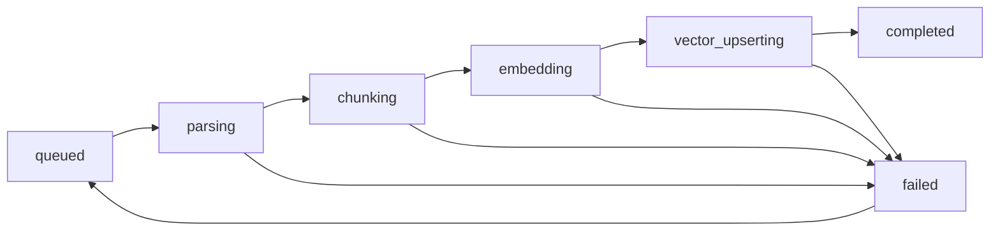

# Day 6：幂等状态机

## 今天的总目标

- 把索引任务状态从粗粒度的 `queued / running / completed / failed` 细化成显式阶段状态
- 建立一套可校验的状态迁移规则，避免乱跳状态
- 让 worker 在执行 pipeline 时能按阶段上报进度
- 为失败重试、重复提交保护和问题定位打下稳定基础
- 保持 Day 4 的边界不乱：pipeline 不直接操作 `task_record`

## 今天结束前，你必须拿到什么

- 一套你自己能讲清楚的索引状态机定义
- 一个专门负责状态迁移校验的服务入口
- `tasks/index_tasks.py` 和 `pipelines/document_index_pipeline.py` 的阶段上报接法
- `models/task_record.py` / `crud/task_record.py` 的最小增量修改方案
- 一份 Day 6 之后“重复提交 / 中途失败 / 未来重试”怎么处理的认知

---

## 今天开始，系统要知道自己到底卡在哪一步

Day 5 之后，Mneme 已经能做到：

```text
API 提交任务
-> worker 后台执行
-> pipeline 跑完整索引
-> vector 写入按 batch 处理
```

但这条链路还有一个很大的问题：

> 一旦任务执行到一半失败，系统到底知道它失败在什么阶段吗？

如果你现在只有这种状态：

- `queued`
- `running`
- `completed`
- `failed`

那很多问题都没法回答：

- 失败发生在文件解析，还是 chunk 切分？
- 失败发生在 embedding，还是 Milvus upsert？
- 如果任务重新跑，哪些步骤应该重做，哪些步骤要避免重复？

所以 Day 6 的核心不是继续提吞吐，  
而是：

> 把任务执行过程显式状态化，并让状态迁移受到规则约束。

从今天开始，任务不是“在跑”或“没在跑”这么粗糙，  
而是能明确知道：

- 已排队
- 正在解析
- 正在切分
- 正在 embedding
- 正在向量写入
- 已完成
- 已失败

---

## 第 1 层：Day 6 的核心变化是什么

今天最核心的变化是：

```text
粗粒度任务状态
-> 显式阶段状态机
```

### Day 4 更像这样

```text
queued
-> running
-> completed
```

### Day 6 更像这样

```text
queued
-> parsing
-> chunking
-> embedding
-> vector_upserting
-> completed
```

失败路径则是：

```text
parsing
-> failed

chunking
-> failed

embedding
-> failed

vector_upserting
-> failed
```

未来重试再允许：

```text
failed
-> queued
```

这个变化非常关键，  
因为从 Day 6 开始，系统才真正具备“知道自己执行到哪了”的能力。

---

## 第 2 层：为什么 Day 6 要先做状态机，而不是先做重试

很多人会觉得：

- 任务失败了
- 那就先做 retry 不就行了

但如果没有状态机，retry 会很危险。

### 没有状态机时的问题

如果你只知道任务失败了，  
却不知道失败在哪一步，那你很难判断：

- 是不是应该整条链重跑
- 哪一步可能已经成功落库
- 会不会重复写 chunk
- 会不会重复写向量

### 有了状态机之后

你至少先能确定：

- 失败发生在哪个阶段
- 阶段迁移是不是合法
- 当前状态是否允许重试

所以 Day 6 的正确顺序是：

```text
先把状态边界做清楚
-> 再谈重试和补偿
```

这也是为什么 Day 6 要先做幂等状态机，  
而不是直接做“失败后再跑一次”。

---

## 第 3 层：今天的最小状态定义

Day 6 不建议把状态做得比现在更复杂。

今天最小够用的任务状态建议就是：

- `queued`
- `parsing`
- `chunking`
- `embedding`
- `vector_upserting`
- `completed`
- `failed`

### 这些状态各自表达什么

| 状态 | 含义 |
|---|---|
| `queued` | 任务已创建，等待 worker 消费 |
| `parsing` | 正在解析原始文件 |
| `chunking` | 正在切分并整理 chunk |
| `embedding` | 正在做 embedding / batch embedding |
| `vector_upserting` | 正在写入向量库 |
| `completed` | 整条索引链成功结束 |
| `failed` | 当前执行失败，等待排查或未来重试 |

### document.status 还要不要保留粗粒度

要保留。

今天最稳的做法是：

- `task_record.status` 细粒度
- `document.status` 粗粒度

也就是：

- task 负责表达阶段进度
- document 负责表达业务可用性

建议对应关系：

- task 进入 `parsing / chunking / embedding / vector_upserting`
  - document 统一保持 `indexing`
- task 进入 `completed`
  - document 进入 `indexed`
- task 进入 `failed`
  - document 进入 `failed`

这样层次最清楚。

---

## 第 4 层：今天最重要的迁移规则

Day 6 的核心不是“多几个状态字符串”，  
而是：

> 状态只能按允许的方向迁移。

今天最小迁移规则可以定成：

```text
queued -> parsing
parsing -> chunking
chunking -> embedding
embedding -> vector_upserting
vector_upserting -> completed

parsing -> failed
chunking -> failed
embedding -> failed
vector_upserting -> failed

failed -> queued   # 为未来 retry 预留
```

### 什么叫幂等

Day 6 先用最实用的定义就够了：

- 如果当前已经是目标状态，再写一次，不应该出错
- 如果当前状态不允许跳到目标状态，应该明确拒绝

也就是说：

- `parsing -> parsing`
  - 允许，当成 no-op
- `queued -> embedding`
  - 不允许，直接拒绝
- `completed -> chunking`
  - 不允许，直接拒绝

这就是 Day 6 的幂等状态机核心。

---

## 第 5 层：今天怎么做，才能不打破 Day 4 的边界

Day 4 已经讲得很清楚：

- pipeline 不应该直接负责 `task_record`
- task 层负责“任务执行语义”

Day 6 不能为了上状态机把这个边界打破。

最稳的做法是：

### 1. 新增一个状态迁移服务

例如：

- `services/task_state_service.py`

这个文件负责：

- 定义允许迁移关系
- 检查迁移是否合法
- 写回 `task_record.status`

### 2. pipeline 不直接改 task_record

pipeline 只在关键阶段开始时发出“阶段变化信号”。

比如：

- 进入 parsing 前发一次
- 进入 chunking 前发一次
- 进入 embedding 前发一次
- 进入 vector_upserting 前发一次

### 3. task 层把这个信号转成状态迁移

也就是说：

- pipeline 负责报告阶段
- task 层负责真正写状态

这就不会打破 Day 4 的边界。

---

## 第 6 层：今天要改哪些文件

Day 6 主要围绕这些文件展开：

- `models/task_record.py`
- `crud/task_record.py`
- `services/task_state_service.py`
- `tasks/index_tasks.py`
- `pipelines/document_index_pipeline.py`

### 每个文件今天负责什么

| 文件 | 今天负责什么 |
|---|---|
| `models/task_record.py` | 对齐默认状态和状态字段含义 |
| `crud/task_record.py` | 保留低层更新函数 |
| `services/task_state_service.py` | 状态迁移规则和合法性校验 |
| `tasks/index_tasks.py` | 把 pipeline 阶段回调接到状态迁移上 |
| `pipelines/document_index_pipeline.py` | 在关键阶段发出阶段变化信号 |

---

## 第 7 层：今天不要做什么

Day 6 不建议做：

- 不做完整 retry API
- 不做补偿事务
- 不做 chunk 去重回滚
- 不做 vector 删除回滚
- 不做并发锁和分布式锁
- 不做限流和熔断

今天只做：

> 把任务执行阶段显式化，并且让状态迁移有规则。

---

## 上午学习：09:00 - 12:00

## 09:00 - 09:50：把 Day 6 的主链路讲顺

### 今天你要能顺着说出来

```text
Day 3 建立任务提交入口
-> Day 4 worker 真正执行索引
-> Day 5 索引链路开始按 batch 处理
-> Day 6 把索引执行过程拆成显式阶段状态
-> 这样系统才能知道失败在哪一步，并为重试做准备
```

### 你必须能回答这两个问题

1. 为什么 `running` 一个状态不够用？
2. 为什么 Day 6 的状态机应该由 task 层驱动，而不是让 pipeline 直接写 task_record？

---

## 09:50 - 10:40：先把状态迁移图讲清楚

### 今天你先记住这张主图



### 这张图表达的三个重点

1. 正常路径必须按顺序走
2. 每个执行阶段都可能失败
3. `failed -> queued` 只是为未来 retry 预留，不代表今天就把 retry 做完

---

## 10:40 - 11:30：先决定状态机落在哪一层

### 最合理的第一版位置

今天最推荐的落点是：

- `services/task_state_service.py`

原因：

- 它不是数据库纯 CRUD
- 也不是 HTTP 入口
- 它是在表达业务规则：哪些状态能转，哪些不能转

### 为什么不直接塞进 `crud/task_record.py`

因为 `crud` 更适合做：

- 查一条记录
- 改一个字段
- flush / refresh

而“是否合法迁移”明显不是 CRUD 逻辑，  
它是状态规则。

---

## 11:30 - 12:00：先决定今天怎么验收

### Day 6 最直接的验收方式

今天最少要能回答：

1. `queued -> parsing` 为什么合法
2. `queued -> embedding` 为什么非法
3. pipeline 进入每个阶段时，谁来发信号，谁来写状态
4. 为什么 `document.status` 仍然保持粗粒度更合适
5. 如果任务在 `embedding` 阶段报错，数据库里应该能看到什么

---

## 下午编码：14:00 - 18:00

## 14:00 - 14:30：先对齐 `TaskRecord` 的状态默认值

### 这是普通增量修改，不需要重写

当前 `models/task_record.py` 里默认值还是：

```python
default="pending"
```

但从 Day 3 开始，你整套文档和代码都已经在用：

```python
"queued"
```

所以 Day 6 先把这个对齐掉。

### 今天建议直接改

把：

```python
default="pending"
```

改成：

```python
default="queued"
```

### 如果数据库里已经有旧值怎么办

Day 6 先在文档里记住这件事：

- 历史数据如果有 `pending`
- 后续要通过一次数据迁移或脚本统一改成 `queued`

今天不用把数据修复脚本展开太深。

---

## 14:30 - 15:20：新增 `services/task_state_service.py`

### 这一段属于新增能力

所以这里按“壳子 + 参考实现”来写。

### `services/task_state_service.py` 练手骨架版

```python
from sqlalchemy.ext.asyncio import AsyncSession


ALLOWED_TASK_TRANSITIONS = {
    # 你要做的事：
    # 1. 写出合法迁移表
    # 2. 支持同状态 no-op
}


async def transition_task_status(
    db: AsyncSession,
    *,
    task_id: str,
    to_status: str,
    error_message: str | None = None,
):
    # 你要做的事：
    # 1. 查询 task_record
    # 2. 读取当前状态
    # 3. 判断 current -> to_status 是否合法
    # 4. 同状态直接返回
    # 5. 非法迁移抛异常
    # 6. 合法迁移则更新 task_record.status
    raise NotImplementedError("先自己实现 transition_task_status")
```

### `services/task_state_service.py` 参考答案

```python
from sqlalchemy.ext.asyncio import AsyncSession

from crud.task_record import get_task_record_by_id, update_task_record_status
from utils.exceptions import BusinessException


ALLOWED_TASK_TRANSITIONS: dict[str, set[str]] = {
    "queued": {"queued", "parsing"},
    "parsing": {"parsing", "chunking", "failed"},
    "chunking": {"chunking", "embedding", "failed"},
    "embedding": {"embedding", "vector_upserting", "failed"},
    "vector_upserting": {"vector_upserting", "completed", "failed"},
    "completed": {"completed"},
    "failed": {"failed", "queued"},
}


async def transition_task_status(
    db: AsyncSession,
    *,
    task_id: str,
    to_status: str,
    error_message: str | None = None,
):
    task_record = await get_task_record_by_id(db, task_id=task_id)
    if not task_record:
        raise BusinessException(message="任务不存在", code=4044, status_code=404)

    current_status = task_record.status
    allowed = ALLOWED_TASK_TRANSITIONS.get(current_status, set())

    if to_status == current_status:
        return task_record

    if to_status not in allowed:
        raise BusinessException(
            message=f"非法状态迁移: {current_status} -> {to_status}",
            code=4009,
            status_code=400,
        )

    return await update_task_record_status(
        db,
        task_id=task_id,
        status=to_status,
        error_message=error_message,
    )
```

### 这里有 3 个特别容易忽略的点

#### 点 1：同状态 no-op 是幂等的关键

如果 worker 因为重复信号再次写：

```text
parsing -> parsing
```

系统不应该因此报错。

#### 点 2：非法跳转一定要显式拒绝

如果允许：

```text
queued -> embedding
```

那你后面看到的状态就不可信了。

#### 点 3：`failed -> queued` 先保留，不代表今天做重试

这只是给未来 retry 留门。

Day 6 的重点仍然是：

- 定规则
- 校验规则

不是把 retry 接口全做完。

---

## 15:20 - 16:10：让 pipeline 支持阶段上报

### 这一段属于新增能力

但它不是重写 pipeline，  
而是在现有 `run_document_index_pipeline(...)` 上加一个回调入口。

### 最稳的改法

给 pipeline 增加一个可选参数：

```python
on_stage_change: Callable[[str], Awaitable[None]] | None = None
```

然后在关键节点前调用它。

### `pipelines/document_index_pipeline.py` 练手骨架版

```python
async def run_document_index_pipeline(
    db: AsyncSession,
    *,
    document: Document,
    on_stage_change=None,
) -> dict:
    # 你要做的事：
    # 1. 进入解析前上报 parsing
    # 2. 进入切分前上报 chunking
    # 3. 进入 embedding 前上报 embedding
    # 4. 进入向量写入前上报 vector_upserting
    # 5. 保留原本的主链路
    raise NotImplementedError("先自己实现 Day 6 阶段上报版 pipeline")
```

### `pipelines/document_index_pipeline.py` 参考改法

```python
async def run_document_index_pipeline(
    db: AsyncSession,
    *,
    document: Document,
    on_stage_change=None,
) -> dict:
    doc = await update_document_status(db, document_id=document.id, status="indexing")

    if on_stage_change:
        await on_stage_change("parsing")
    docs = await load_langchain_documents(
        file_path=doc.file_path,
        file_type=doc.file_type,
        user_id=doc.user_id,
        knowledge_base_id=doc.knowledge_base_id,
        knowledge_base_pk=doc.knowledge_base_pk,
        file_name=doc.file_name,
        document_id=doc.id,
        document_pk=doc.pk,
    )

    if on_stage_change:
        await on_stage_change("chunking")
    chunk_docs = await split_documents(
        document_id=doc.id,
        documents=docs,
    )

    await create_chunks(
        db,
        document_id=doc.id,
        document_pk=doc.pk,
        chunk_docs=chunk_docs,
    )

    if on_stage_change:
        await on_stage_change("embedding")
    if on_stage_change:
        await on_stage_change("vector_upserting")
    vector_result = await add_documents_to_vector_store_in_batches(
        chunk_docs=chunk_docs,
        batch_size=settings.INDEX_VECTOR_BATCH_SIZE,
    )

    await update_document_status(db, document_id=doc.id, status="indexed")

    return {
        "document_id": doc.id,
        "knowledge_base_id": doc.knowledge_base_id,
        "chunk_count": len(chunk_docs),
        "vector_batch_count": vector_result["batch_count"],
        "vector_batch_size": vector_result["batch_size"],
        "indexed_vector_count": vector_result["total_count"],
        "status": "indexed",
    }
```

### 为什么 `embedding` 和 `vector_upserting` 紧挨着

因为当前项目里：

```text
vector_store.add_documents(batch_docs)
```

会把 embedding 和写入绑定得很近。

Day 6 先把两个阶段信号都打出来就够了。  
后面如果 embedding service 独立出去，再拆得更细。

---

## 16:10 - 17:00：让 task 层真正驱动状态机

### 这里是 Day 6 的关键接法

task 层要做两件事：

1. 在进入 pipeline 前，把 `queued -> parsing`
2. 把 pipeline 的 `on_stage_change(...)` 接到 `transition_task_status(...)`

### `tasks/index_tasks.py` 练手骨架版

```python
async def run_index_document_task_async(
    *,
    task_id: str,
    document_id: str,
) -> None:
    # 你要做的事：
    # 1. 定义 stage callback
    # 2. callback 内调用 transition_task_status(...)
    # 3. 把 callback 传给 run_document_index_pipeline(...)
    # 4. 成功后转 completed
    # 5. 失败后转 failed
    raise NotImplementedError("先自己实现 Day 6 状态机版 task runner")
```

### `tasks/index_tasks.py` 参考改法

```python
async def run_index_document_task_async(
    *,
    task_id: str,
    document_id: str,
) -> None:
    async with AsyncSessionLocal() as db:
        try:
            async def report_stage(stage: str) -> None:
                await transition_task_status(
                    db,
                    task_id=task_id,
                    to_status=stage,
                )

            await transition_task_status(
                db,
                task_id=task_id,
                to_status="parsing",
            )
            await update_document_status(
                db,
                document_id=document_id,
                status="indexing",
            )

            document = await get_document_by_id(db, document_id=document_id)
            if not document:
                raise ValueError(f"document not found: {document_id}")

            result = await run_document_index_pipeline(
                db,
                document=document,
                on_stage_change=report_stage,
            )

            await transition_task_status(
                db,
                task_id=task_id,
                to_status="completed",
            )
            await db.commit()
        except Exception as exc:
            await transition_task_status(
                db,
                task_id=task_id,
                to_status="failed",
                error_message=str(exc),
            )
            await update_document_status(
                db,
                document_id=document_id,
                status="failed",
            )
            await db.commit()
            raise
```

### 这里有 4 个特别容易忽略的点

#### 点 1：task 层依然是状态机主人

虽然 pipeline 会发阶段信号，  
但真正写 `task_record.status` 的还是 task 层。

#### 点 2：初始 `parsing` 会被调用两次怎么办

没关系。

因为你已经把：

```text
parsing -> parsing
```

定义成了 no-op。

这正是幂等的价值。

#### 点 3：失败路径要从当前阶段直达 `failed`

不需要先回 `running`。  
Day 6 以后 `running` 已经不再是主要执行状态。

#### 点 4：document.status 仍然保持粗粒度

今天不要把 document 也细拆成：

- parsing
- chunking
- embedding

否则 document 和 task 会混成两套重复状态。

---

## 17:00 - 18:00：整理 Day 6 之后的认知边界

### 到 Day 6 为止，Mneme 已经多了什么

从今天开始，Mneme 的索引任务不再只是：

```text
提交了
在跑
结束了
```

而是能表达：

```text
已经排队
正在解析
正在切分
正在 embedding
正在写向量
成功完成
执行失败
```

### 这意味着什么

这意味着后面很多能力终于有了落点：

- 重试
- 补偿
- 问题定位
- 重复提交保护
- 阶段耗时统计

Day 6 本质上是在给这些能力打“状态坐标系”。

---

## 晚上复盘：20:00 - 21:00

### 今晚你必须自己讲顺的 8 个点

1. 为什么 `queued / running / completed / failed` 对索引任务来说不够用？
2. 为什么 Day 6 要先做状态机，而不是先做 retry？
3. `task_record.status` 和 `document.status` 为什么要继续保持不同粒度？
4. 为什么状态迁移规则应该放在 `services/task_state_service.py`？
5. 为什么同状态 no-op 是幂等的关键？
6. 为什么 pipeline 通过 callback 上报阶段，比直接写 task_record 更合理？
7. 为什么 `failed -> queued` 先保留为规则，但不用当天就做重试接口？
8. Day 7 接下来为什么更适合做阻塞点迁移和对象缓存？

---

## 今日验收标准

- 已有显式阶段状态定义
- 已有合法迁移关系表
- 已有 `transition_task_status(...)` 这样的状态迁移入口
- pipeline 已支持阶段上报
- task 层已能接住阶段上报并驱动状态更新
- `document.status` 仍保持粗粒度，不和 task 状态混淆
- 非法状态跳转会被拒绝
- 同状态重复写会被视为 no-op

---

## 今天最容易踩的坑

### 坑 1：把状态机理解成“多几个字符串”

问题：

- 只有状态名，没有迁移规则
- 这样本质上还是不可信

规避建议：

- 先定合法迁移表
- 再定更新函数

### 坑 2：让 pipeline 直接写 task_record

问题：

- 打破 Day 4 建立的边界
- pipeline 开始承担任务执行语义

规避建议：

- pipeline 只发阶段信号
- task 层负责写状态

### 坑 3：把 document 状态也细拆成和 task 一样

问题：

- 两套状态完全重叠
- 后面更难维护

规避建议：

- document 保持业务可用性表达
- task_record 负责执行阶段表达

### 坑 4：非法跳转不报错

问题：

- 看起来任务“还能跑”
- 实际状态已经不可信

规避建议：

- 非法迁移直接拒绝
- 不要默默吞掉

### 坑 5：Day 6 就顺手把 retry 做完

问题：

- 范围容易失控
- 补偿和幂等边界还没完全想清楚

规避建议：

- 先把状态坐标系做稳
- retry 留给后面继续接

---

## 给明天的交接提示

明天会进入 Day 7：阻塞点迁移与对象缓存。

Day 7 不是继续细化状态机，  
而是要开始解决：

```text
为什么 worker 已经有了
为什么状态机也有了
系统还是可能慢、抖、重复初始化重对象
```

所以 Day 6 最关键的交接只有一句话：

```text
索引链路现在已经有了可信的阶段状态，下一步要把真正重的阻塞点和重对象生命周期管理好。
```
