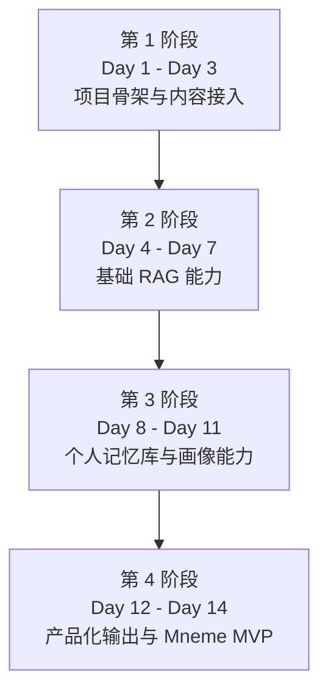
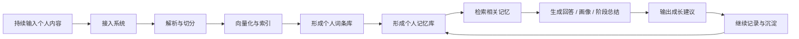

# Mneme：Day 1 - Day 14 总目标

副标题：把记忆沉淀为成长

这份文档不是每天的细碎任务清单，  
而是站在更高一层，回答下面两个问题：

- 14 天做完之后，这个项目应该长成什么样
- 前 7 天和后 7 天，分别在搭什么

---

## 一句话总目标

在 14 天内，把当前项目从一个“基础 RAG 后端”，推进成一个有明确产品方向的 `Mneme` 最小可用版本。

这个最小版本不再只是：

```text
上传文件 -> 问答
```

而是要进化成：

```text
持续输入个人内容
-> 形成个人词条库 / 记忆库
-> 支持检索与问答
-> 支持个人画像与阶段分析
-> 输出更像“长期陪伴”的结果
```

---

## 最终想做成什么

14 天结束时，`Mneme` 至少应该具备下面这 5 层能力：

1. 内容接入层
   - 用户可以持续上传博客、文章、笔记、简历、复盘、阶段总结

2. 记忆沉淀层
   - 系统不只存原文，还能把内容沉淀成可检索的词条、主题、时间线和片段

3. 检索理解层
   - 系统能根据问题，从海量个人内容里找出最相关的一小部分材料

4. 分析输出层
   - 系统不只会回答问题，还能生成个人画像、阶段总结、成长分析和建议

5. 长期陪伴层
   - 产品形态开始从“问答工具”走向“长期成长助手”

---

## Day 1 - Day 14 总体阶段划分

我建议你把 14 天分成 4 个阶段来看。



### 第 1 阶段：项目骨架与内容接入

对应：

- Day 1
- Day 2
- Day 3

这一段解决：

- 项目怎么站起来
- 内容怎么进系统

### 第 2 阶段：基础 RAG 能力

对应：

- Day 4
- Day 5
- Day 6
- Day 7

这一段解决：

- 内容怎么被理解
- 内容怎么变成知识库
- 系统怎么基于知识库回答

### 第 3 阶段：个人记忆库与画像能力

对应：

- Day 8
- Day 9
- Day 10
- Day 11

这一段解决：

- 怎么把“知识库”升级成“个人记忆库”
- 怎么从零散内容里提炼词条、主题、时间线和画像

### 第 4 阶段：产品化输出与 Mneme MVP

对应：

- Day 12
- Day 13
- Day 14

这一段解决：

- 怎么把底层能力变成更像产品的输出
- 怎么让它不只是会答题，而是更像长期陪伴

---

## 前 7 天在做什么

前 7 天你可以几乎不改主线，因为它们确实都是基础能力。

前 7 天真正做成的是：

```text
内容进入系统
-> 内容被解析
-> 内容被切分
-> 内容被索引
-> 内容可被检索
-> 系统可基于内容回答
```

这 7 天的定位很明确：

> 搭 `Mneme` 的引擎底座。

所以前 7 天不是没意义，  
而是在做最关键但还不够“像产品”的部分。

---

## 后 7 天要补什么

真正让 `Mneme` 和普通 RAG 不一样的，是后 7 天。

后 7 天要补的，不是简单地“再加几个接口”，而是要补出下面这条产品主线：

```text
个人内容
-> 个人词条库
-> 个人记忆库
-> 成长画像
-> 阶段报告
-> 个性化建议
-> 长期陪伴
```

---

## Day 8 - Day 14 的总目标拆解

下面我给你的是高层目标，不是实现细节。

### Day 8：从“文档块”升级到“个人词条”

目标：

- 不再只停留在 chunk 检索
- 开始为个人内容建立更结构化的词条层

这一天想做成的效果：

- 一段文章不只是被切块
- 还会被提炼成主题词、事件词、能力词、情绪词、阶段词

一句话理解：

> Day 8 开始，系统存的不只是文本，而是“这个人留下来的记忆线索”。

---

### Day 9：把词条组织成个人记忆库

目标：

- 把词条从零散数据，组织成更像“个人档案”的结构

这一天想做成的效果：

- 能按时间看内容
- 能按主题聚合内容
- 能按事件、能力、情绪做初步归类

一句话理解：

> Day 9 解决“记忆怎么被组织起来”。

---

### Day 10：做个人画像的第一版

目标：

- 从记忆库里提炼一个人的长期主题和能力轮廓

这一天想做成的效果：

- 主题画像
- 表达画像
- 能力标签
- 成长关注点

一句话理解：

> Day 10 开始，系统不只会回答问题，而是开始“理解这个人”。

---

### Day 11：做阶段性总结和成长分析

目标：

- 从“静态画像”走向“阶段变化”

这一天想做成的效果：

- 周总结 / 月总结
- 最近一段时间的关注主题变化
- 成长亮点
- 当前卡点

一句话理解：

> Day 11 开始，`Mneme` 不只是在看“你是谁”，而是在看“你最近怎么变化了”。

---

### Day 12：从问答工具升级成陪伴式输出

目标：

- 把输出从单次回答，升级为更像产品的结果页

这一天想做成的效果：

- 回答
- 引用
- 个人画像摘要
- 阶段总结摘要
- 建议下一步做什么

一句话理解：

> Day 12 解决“系统怎么把理解结果更完整地呈现给用户”。

---

### Day 13：加入成长建议和行动导向

目标：

- 从“分析你”走向“帮助你”

这一天想做成的效果：

- 写作建议
- 学习建议
- 表达建议
- 下一阶段行动建议

一句话理解：

> Day 13 让 `Mneme` 更像私人教师，而不只是回顾型工具。

---

### Day 14：收束成 Mneme 的最小可演示版本

目标：

- 把前面 14 天的能力收成一个统一故事

这一天想做成的效果：

- 有明确品牌名：`Mneme`
- 有清晰副标题：`把记忆沉淀为成长`
- 有完整产品闭环
- 能做一次从“输入内容”到“输出成长分析”的完整演示

一句话理解：

> Day 14 不是再补一个功能，而是让整个项目真正变成一个有灵魂的产品原型。

---

## Day 1 - Day 14 最终闭环

如果把 14 天所有内容压缩成一条完整链路，它应该长这样：



这条链路和普通问答产品最大的不同是：

- 普通问答产品更像“一次性对话”
- `Mneme` 更像“长期沉淀与长期理解”

---

## 14 天结束时，你应该拿到什么

如果这个项目走完 14 天，最理想的交付物应该是：

- 一个能运行的后端系统
- 一条完整的“内容 -> 记忆 -> 分析 -> 建议”链路
- 一个明确的品牌定位：`Mneme`
- 一个能演示的产品故事，而不只是几个零散接口

---

## 最后一句话

前 7 天做的是地基，  
后 7 天做的是灵魂。

所以 `Mneme` 的 14 天目标可以浓缩成一句最重要的话：

> 前 7 天让系统学会“记住内容”，后 7 天让系统学会“理解记忆，并把记忆转化为成长”。
