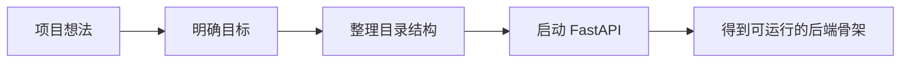
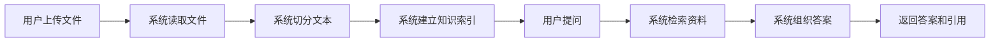
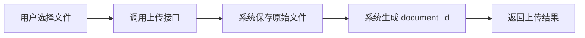
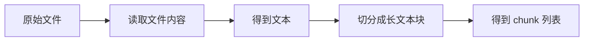
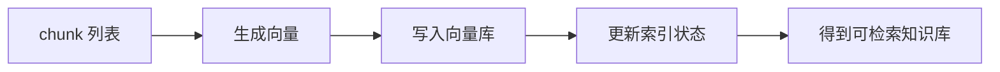
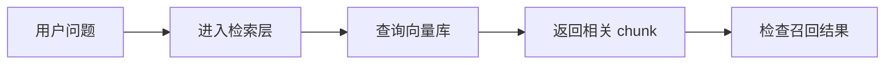
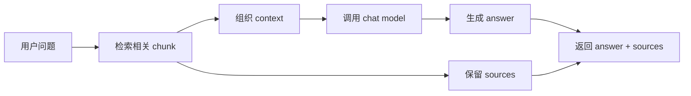
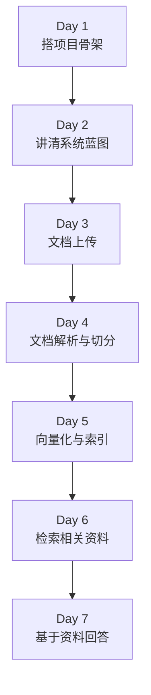
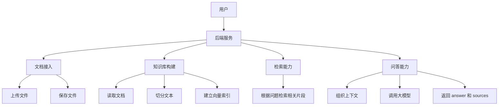

# Day 1 - Day 7 主体架构总览

这份文档只看两件事：

- Day 1 到 Day 7 每天到底做成了什么能力
- 这 7 天的能力最后拼成了一个什么样的整体系统

这一版我刻意不展开 `model`、`crud`、表结构这些实现细节，只保留主体架构。

---

## 一句话总览

Day 1 到 Day 7，整个项目的主线其实就是：

```text
把一个“空的 FastAPI 项目”
-> 做成“能接收文档的服务”
-> 做成“能把文档变成知识库的服务”
-> 做成“能基于知识库回答问题的 RAG 服务”
```

---

## Day 1：项目启动

### Day 1 做成了什么

- 明确项目目标和边界
- 跑起 FastAPI 服务
- 建立后端项目骨架

### Day 1 流程图



### 这一天的意义

Day 1 不是在做 RAG 本身，  
而是在回答一个更根本的问题：

> 这个项目以后要以什么样的后端系统形态存在？

---

## Day 2：系统蓝图

### Day 2 做成了什么

- 讲清楚业务数据流
- 明确接口方向
- 明确系统接下来要走的主链路

### Day 2 流程图



### 这一天的意义

Day 2 不是在写很多代码，  
而是在把整个项目的“路线图”画清楚。

如果 Day 2 不清楚，后面每天都会写得很乱。

---

## Day 3：文档进入系统

### Day 3 做成了什么

- 有了文档上传入口
- 文件能真正进入系统
- 系统开始有“文档”这个概念

### Day 3 流程图



### 这一天的意义

Day 3 解决的是：

> 文档怎么真正进入这个系统？

从这一天开始，你的项目不再只是空服务，  
而是开始具备“收文档”的能力。

---

## Day 4：文档变成可处理文本

### Day 4 做成了什么

- 系统能读取原始文件内容
- 能把长文本切成小块
- 文档第一次真正变成“可处理的知识片段”

### Day 4 流程图



### 这一天的意义

Day 4 解决的是：

> 文件虽然上传了，但系统到底怎么看懂它里面的内容？

从这一天起，文件不再只是磁盘上的一个 PDF，  
而是开始变成系统能处理的文本对象。

---

## Day 5：文本变成知识库

### Day 5 做成了什么

- chunk 被转成向量
- 向量被放进向量库
- 系统开始具备“建立知识索引”的能力

### Day 5 流程图



### 这一天的意义

Day 5 解决的是：

> 文本块怎么从“普通文本”变成“以后能被查出来的知识”？

从这一天开始，系统第一次真正有了“知识库”的雏形。

---

## Day 6：知识库开始会查资料

### Day 6 做成了什么

- 系统能根据问题去知识库里找相关片段
- 能返回 `top_k` 条相关内容
- 能肉眼检查召回结果对不对

### Day 6 流程图



### 这一天的意义

Day 6 解决的是：

> 系统能不能先把“相关资料”翻出来？

这一天还没有正式回答问题，  
但它决定了 Day 7 的回答质量上限。

---

## Day 7：基于资料生成回答

### Day 7 做成了什么

- 检索结果被组织成上下文
- 上下文和问题一起交给大模型
- 系统返回答案和来源

### Day 7 流程图



### 这一天的意义

Day 7 解决的是：

> 系统不只是“查到资料”，而是能“基于资料回答问题”。

从这一天开始，项目真正进入最小 RAG 问答阶段。

---

## Day 1 - Day 7 串联总图

这一张图最重要。  
你后面复盘时，优先看这张。



### 这 7 天到底是在搭什么

你可以把它理解成 3 个阶段：

- 第 1 阶段：把项目搭起来
  - Day 1
  - Day 2

- 第 2 阶段：把文档变成知识库
  - Day 3
  - Day 4
  - Day 5

- 第 3 阶段：把知识库变成问答能力
  - Day 6
  - Day 7

---

## 最终系统总架构图

如果只看主体架构，不看任何细节，  
Day 1 到 Day 7 最后拼出来的是这样一个系统：



### 这张图要表达什么

最终你做出来的，不是一个“上传 PDF 然后随便问一句”的临时脚本，  
而是一个完整的后端能力链路：

- 能接文档
- 能处理文档
- 能建立知识库
- 能检索相关内容
- 能基于资料生成答案

---

## 最小 RAG 全链路图

如果你只想记住最关键的业务主线，就记这一张：


### 这一张图就是整个 Day 1 - Day 7 的灵魂

因为它把系统最核心的价值浓缩成了一条线：

> 让系统学会先读文档、记住文档，再在回答时翻资料，而不是凭空乱答。
