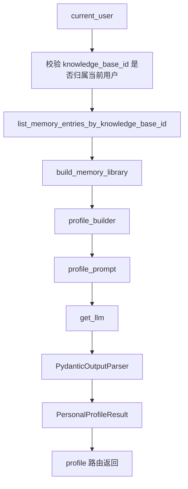
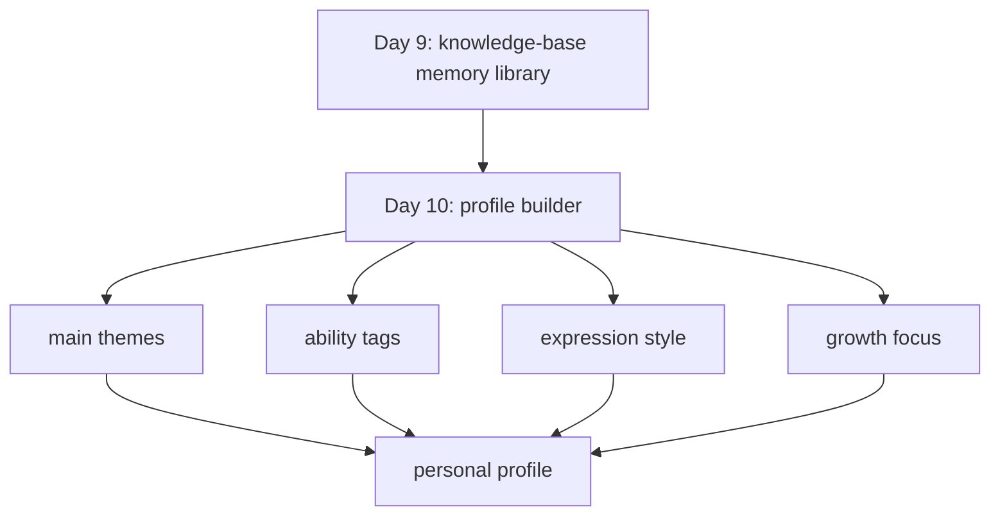

# Day 10：知识库级个人画像第一版

## 今天的总目标

- 不再按单篇 `document_id` 做画像
- 改成基于 `knowledge_base_id` 聚合整库记忆，生成第一版个人画像
- 把现有的用户体系、JWT、知识库作用域，真正接进画像链路

## 今天结束前，你必须拿到什么

- `schemas/profile.py`
- `utils/profile_prompt.py`
- `utils/profile_builder.py`
- `routers/profile.py`
- `scripts/debug_day10.py`
- 一套你能自己复述的“current_user + knowledge_base -> profile”理解框架

---

## Day 10 一图总览

如果把 Day 10 压缩成一句话，它做的就是：

> 基于当前用户自己的知识库记忆，生成一份有依据、有作用域的个人画像。

今天的主链路可以先背成这样：

```text
get current user
-> validate knowledge base ownership
-> load memory entries by knowledge_base_id
-> build memory library
-> summarize profile with llm
-> return structured profile
```

你今天要特别清楚：

- Day 9 的重点是“把词条组织成记忆库”
- Day 10 的重点是“在知识库作用域内提炼长期轮廓”

---

## 为什么 Day 10 要重构

旧版 Day 10 最大的问题是：

- 还是按 `document_id` 看画像
- 没把 `user -> knowledge_base -> document -> memory_entry` 这条主链路接起来
- 没把认证后的当前用户真正用起来

但你现在项目已经不是单文档 demo 了，而是：

```text
User
-> KnowledgeBase
-> Document
-> MemoryEntry
-> MemoryLibrary
-> Profile
```

所以 Day 10 的核心重构方向只有一句话：

> 画像必须属于某个用户的某个知识库，而不是属于某一篇文档。

---

## Day 10 整体架构



### 你要怎么理解这张图

#### 第 1 层：认证与作用域层

这一层负责：

- 从 JWT 里拿到 `current_user`
- 校验 `knowledge_base_id` 确实属于这个用户

这一步的意义非常大：

- 画像不再是“随便给一个库都能看”
- 而是“只能看自己知识库里的个人画像”

#### 第 2 层：画像输入层

这一层负责：

- 读取该知识库下的全部 `memory_entries`
- 组织成 `memory_library`

白话理解：

- Day 10 不该直接再碰原始 chunk
- 也不该只看一篇文档
- 而是看“这个用户在这个知识库里的长期记忆结构”

#### 第 3 层：画像构建层

这一层负责：

- 总结长期主题
- 总结能力轮廓
- 总结表达风格
- 总结当前持续关注点

但一定要注意：

- 只能基于输入内容做归纳
- 不能做人格测试
- 不能编造经历

---

## Day 9 到 Day 10 的交接图



这张图你要记住：

- Day 9 的产物是“结构化记忆库”
- Day 10 的产物是“结构化个人画像”

---

## 今天的边界要讲透

## 第 1 层：画像的输入必须是 knowledge base，不再是单 document

今天你要牢牢记住：

- `document_id`
  - 适合做局部调试
- `knowledge_base_id`
  - 才适合做个人画像

因为单文档往往只覆盖一个切面：

- 一份简历
- 一份日记
- 一篇总结

但知识库才更像：

- 一个人长期内容的集合

所以今天的画像目标不是：

- “这篇文档里这个人像什么”

而是：

- “这个知识库整体反映出的这个人更像什么”

## 第 2 层：画像必须接入认证

既然你现在已经有：

- `User`
- `KnowledgeBase`
- `JWT`
- `get_current_user`

那 Day 10 最合理的路由逻辑就应该是：

```text
token
-> current_user
-> knowledge_base ownership check
-> build profile
```

不要再走这种旧思路：

- 手动传一个 `user_id`
- 后端只做弱校验

更稳的第一版就是：

- 只认当前登录用户
- 只给当前用户看自己的画像

## 第 3 层：画像是“长期轮廓”，不是“最近变化”

Day 10 只回答：

- 长期主题是什么
- 经常出现的能力标签是什么
- 表达风格更偏哪里
- 当前稳定关注点有哪些

今天先不要急着回答：

- 最近变了什么
- 最近卡点是什么
- 下一步建议怎么给

这些是 Day 11 的事。

## 第 4 层：画像结果必须保留依据感

你今天最好把 schema 设计成这种味道：

- `main_themes`
  - 要有 `theme_name`
  - 要有 `reason`
  - 要有 `evidence_entries`
- `ability_tags`
  - 要有 `ability_name`
  - 要有 `reason`
  - 要有 `evidence_entries`

为什么？

因为以后你一看结果，应该能反问：

> 这个结论到底是从哪些词条里提炼出来的？

没有依据感的画像，很快就会变成：

- 好听
- 但没法验证

---

## 上午学习：09:00 - 12:00

## 09:00 - 09:50：先把新版 Day 10 主链路讲顺

今天你必须能顺着说出来：

```text
current_user
-> knowledge_base_id
-> load memory entries
-> build memory library
-> build personal profile
-> return structured result
```

你今天必须能回答这两个问题：

1. 为什么 Day 10 不能再按 `document_id` 做主输入？
2. 为什么画像接口最好直接绑定 `current_user`？

## 09:50 - 10:40：先想清楚 Day 10 的最小输出结构

今天建议先做这 5 个字段：

- `profile_summary`
- `main_themes`
- `ability_tags`
- `expression_style`
- `growth_focus`

这 5 个字段已经足够支撑：

- 页面展示
- 调试打印
- Day 11 的阶段分析基线

## 10:40 - 11:30：把路由作用域想清楚

今天推荐的接口风格是：

```text
GET /profile/knowledge-bases/{knowledge_base_id}
Authorization: Bearer <token>
```

内部流程建议：

1. `Depends(get_current_user)`
2. 查询 `knowledge_base`
3. 校验 `knowledge_base.user_id == current_user.id`
4. 读取该知识库下所有 `memory_entries`
5. 组织 `memory_library`
6. 生成画像

## 11:30 - 12:00：先决定今天怎么验收

Day 10 的最小验收目标：

- 能从一个 `knowledge_base_id` 生成结构化画像
- 路由带 JWT 访问控制
- 画像里至少有主题、能力、表达风格
- 画像结果能被 schema 校验通过

---

## 下午编码：14:00 - 18:00

## 14:00 - 14:40：先定义画像输出结构

建议新增文件：

- `schemas/profile.py`

建议最小结构：

```python
from pydantic import BaseModel, Field


class ProfileThemeItem(BaseModel):
    theme_name: str = Field(..., description="长期主题")
    reason: str = Field(..., description="主题判断依据")
    evidence_entries: list[str] = Field(default_factory=list, description="支撑主题的词条名")


class AbilityTagItem(BaseModel):
    ability_name: str = Field(..., description="能力标签")
    reason: str = Field(..., description="能力判断依据")
    evidence_entries: list[str] = Field(default_factory=list, description="支撑能力的词条名")


class PersonalProfileResult(BaseModel):
    knowledge_base_id: str = Field(..., description="画像所属知识库")
    entry_count: int = Field(..., description="本次画像使用的词条数")
    profile_summary: str = Field(..., description="画像摘要")
    main_themes: list[ProfileThemeItem] = Field(default_factory=list)
    ability_tags: list[AbilityTagItem] = Field(default_factory=list)
    expression_style: str = Field(..., description="表达风格总结")
    growth_focus: list[str] = Field(default_factory=list, description="稳定关注点")
```

这里你一定要看懂：

- `knowledge_base_id`
  - 明确画像归属
- `entry_count`
  - 方便判断这份画像是不是建立在足够材料之上

## 14:40 - 15:20：实现 `utils/profile_prompt.py`

建议 prompt 重点明确这几件事：

- 只基于输入内容做归纳
- 不做过度心理分析
- 先看长期主题，再看能力轮廓
- 输出必须严格结构化

### `utils/profile_prompt.py` 练手骨架版

```python
from langchain_core.prompts import ChatPromptTemplate


def get_profile_prompt(format_instructions: str) -> ChatPromptTemplate:
    # 你要做的事：
    # 1. 用 ChatPromptTemplate.from_messages(...)
    # 2. 准备一个 system 消息
    # 3. 明确告诉模型：输入是知识库级 memory library
    # 4. 明确告诉模型：只能基于输入内容做判断，不能编造
    # 5. 在 human 消息里至少包含 user_id、knowledge_base_id、memory_library_text
    # 6. 把 format_instructions 拼进去，约束输出结构
    raise NotImplementedError("先自己实现 get_profile_prompt")
```

### `utils/profile_prompt.py` 参考答案

```python
from langchain_core.prompts import ChatPromptTemplate


def get_profile_prompt(format_instructions: str) -> ChatPromptTemplate:
    return ChatPromptTemplate.from_messages(
        [
            (
                "system",
                "你是一个个人画像分析助手。"
                "你会根据知识库级 memory library，总结长期主题、能力轮廓、表达风格和稳定关注点。"
                "你只能基于输入内容做判断，不能编造经历，不能做过度心理分析。"
                "输出必须严格遵守格式要求。"
            ),
            (
                "human",
                "current_user_id={user_id}\n"
                "knowledge_base_id={knowledge_base_id}\n"
                "memory_library=\n{memory_library_text}\n\n"
                "{format_instructions}"
            ),
        ]
    ).partial(format_instructions=format_instructions)
```

## 15:20 - 16:20：实现 `utils/profile_builder.py`

今天的重点不是“让 LLM 多聪明”，  
而是把输入链路收干净。

建议函数拆成两层：

```python
def build_profile_input(memory_library: dict) -> str:
    # 你要做的事：
    # 1. 把 memory_library 转成 json 字符串
    # 2. ensure_ascii=False，保证中文可读
    # 3. default=str，避免 datetime 序列化报错
    # 4. indent=2，方便调试时肉眼检查
    raise NotImplementedError("先自己实现 build_profile_input")


async def build_personal_profile(
        *,
        user_id: int,
        knowledge_base_id: str,
        memory_library: dict,
) -> dict:
    # 你要做的事：
    # 1. 创建 PydanticOutputParser
    # 2. 获取 format_instructions
    # 3. 调 get_profile_prompt(...)
    # 4. 调 build_profile_input(memory_library)
    # 5. 获取 llm
    # 6. 组装 chain = prompt | llm | parser
    # 7. 调 chain.ainvoke({...})，传入 user_id、knowledge_base_id、memory_library_text
    # 8. 返回 result.model_dump()
    raise NotImplementedError("先自己实现 build_personal_profile")
```

推荐主流程：

1. `PydanticOutputParser`
2. `get_profile_prompt(...)`
3. `json.dumps(memory_library, ensure_ascii=False, default=str, indent=2)`
4. `prompt | llm | parser`
5. 返回 `result.model_dump()`

### `utils/profile_builder.py` 参考答案

```python
import json

from langchain_core.output_parsers import PydanticOutputParser

from schemas.profile import PersonalProfileResult
from clients.llm_client import get_llm
from utils.profile_prompt import get_profile_prompt


def build_profile_input(memory_library: dict) -> str:
  return json.dumps(
    memory_library,
    ensure_ascii=False,
    default=str,
    indent=2,
  )


async def build_personal_profile(
        *,
        user_id: int,
        knowledge_base_id: str,
        memory_library: dict,
) -> dict:
  parser = PydanticOutputParser(pydantic_object=PersonalProfileResult)
  instructions = parser.get_format_instructions()

  prompt = get_profile_prompt(format_instructions=instructions)
  llm = get_llm()
  chain = prompt | llm | parser

  result = await chain.ainvoke(
    {
      "user_id": user_id,
      "knowledge_base_id": knowledge_base_id,
      "memory_library_text": build_profile_input(memory_library),
    }
  )

  payload = result.model_dump()
  payload["knowledge_base_id"] = knowledge_base_id
  payload["entry_count"] = len(memory_library.get("timeline", []))
  return payload
```

## 16:20 - 17:00：补画像路由

建议新增：

- `routers/profile.py`

建议接口：

```python
from fastapi import APIRouter, Depends
from sqlalchemy.ext.asyncio import AsyncSession

from conf.database import get_database
from crud.knowledge_base import get_knowledge_base_by_id
from crud.memory_entry import list_memory_entries_by_knowledge_base_id
from models.user import User
from schemas.profile import PersonalProfileResult
from utils.auth import get_current_user
from services.memory_service import build_memory_library
from services.profile_service import build_personal_profile
from utils.response import success_response

router = APIRouter(prefix="/profile", tags=["profile"])


@router.get("/knowledge-bases/{knowledge_base_id}")
async def get_personal_profile(
        knowledge_base_id: str,
        current_user: User = Depends(get_current_user),
        db: AsyncSession = Depends(get_database),
):
  # 你要做的事：
  # 1. 查询 knowledge_base
  # 2. 判断 knowledge_base 是否存在
  # 3. 校验 knowledge_base.user_id == current_user.id
  # 4. 读取该知识库下的 memory entries
  # 5. 转成 build_memory_library(...) 需要的 dict 列表
  # 6. 调 build_memory_library(entries)
  # 7. 调 await build_personal_profile(...)
  # 8. 用 PersonalProfileResult 校验结果
  # 9. return success_response(data=data)
  raise NotImplementedError("先自己实现 get_personal_profile")
```

路由里你今天一定要做的事：

1. 查知识库
2. 校验归属
3. 拉该库所有 `memory_entries`
4. `build_memory_library(entries)`
5. `await build_personal_profile(...)`
6. 返回 `PersonalProfileResult`

### `routers/profile.py` 参考答案

```python
from fastapi import APIRouter, Depends
from sqlalchemy.ext.asyncio import AsyncSession

from conf.database import get_database
from crud.knowledge_base import get_knowledge_base_by_id
from crud.memory_entry import list_memory_entries_by_knowledge_base_id
from models.user import User
from schemas.profile import PersonalProfileResult
from utils.auth import get_current_user
from utils.exceptions import BusinessException
from services.memory_service import build_memory_library
from services.profile_service import build_personal_profile
from utils.response import success_response

router = APIRouter(prefix="/profile", tags=["profile"])


@router.get("/knowledge-bases/{knowledge_base_id}")
async def get_personal_profile(
        knowledge_base_id: str,
        current_user: User = Depends(get_current_user),
        db: AsyncSession = Depends(get_database),
):
  knowledge_base = await get_knowledge_base_by_id(db, knowledge_base_id)
  if not knowledge_base:
    raise BusinessException(message="知识库不存在", code=4042, status_code=404)
  if knowledge_base.user_id != current_user.id:
    raise BusinessException(message="知识库不属于当前用户", code=4007)

  rows = await list_memory_entries_by_knowledge_base_id(
    db,
    knowledge_base_id=knowledge_base_id,
  )

  entries = [
    {
      "id": item.id,
      "entry_name": item.entry_name,
      "entry_type": item.entry_type,
      "summary": item.summary,
      "created_at": item.created_at,
    }
    for item in rows
  ]

  memory_library = build_memory_library(entries)
  profile = await build_personal_profile(
    user_id=current_user.id,
    knowledge_base_id=knowledge_base_id,
    memory_library=memory_library,
  )
  data = PersonalProfileResult(**profile)

  return success_response(data=data)
```

## 17:00 - 17:40：做一个最小调试脚本

建议文件：

- `scripts/debug_day10.py`

今天脚本不要再喂“单文档输入”了，  
而要喂一个“知识库级 memory library 模拟对象”。

### `scripts/debug_day10.py` 练手骨架版

```python
import asyncio

from services.profile_service import build_personal_profile


async def main():
  # 你要做的事：
  # 1. 准备一个最小 memory_library 模拟对象
  # 2. 传入 user_id、knowledge_base_id
  # 3. 调 build_personal_profile(...)
  # 4. 打印 profile_summary
  # 5. 打印 main_themes
  # 6. 打印 ability_tags
  # 7. 打印 growth_focus
  raise NotImplementedError("先自己实现 main")


if __name__ == "__main__":
  asyncio.run(main())
```

建议至少打印：

- `profile_summary`
- `main_themes`
- `ability_tags`
- `growth_focus`

### `scripts/debug_day10.py` 参考答案

```python
import asyncio
from datetime import datetime

from services.profile_service import build_personal_profile

memory_library = {
  "timeline": [
    {
      "entry_id": "entry_001",
      "entry_name": "FastAPI 后端开发",
      "entry_type": "ability",
      "summary": "有 FastAPI 后端开发经验",
      "created_at": datetime(2026, 4, 1, 10, 0, 0),
    },
    {
      "entry_id": "entry_002",
      "entry_name": "个人成长记录",
      "entry_type": "theme",
      "summary": "长期关注成长、复盘与记录",
      "created_at": datetime(2026, 4, 2, 10, 0, 0),
    },
    {
      "entry_id": "entry_003",
      "entry_name": "知识管理",
      "entry_type": "theme",
      "summary": "希望把个人内容沉淀为长期可用的记忆库",
      "created_at": datetime(2026, 4, 3, 10, 0, 0),
    },
  ],
  "by_type": {
    "ability": ["FastAPI 后端开发"],
    "theme": ["个人成长记录", "知识管理"],
  },
  "by_theme": [
    {
      "theme_name": "个人成长记录",
      "entries": ["长期关注成长、复盘与记录"],
      "count": 1,
    },
    {
      "theme_name": "知识管理",
      "entries": ["希望把个人内容沉淀为长期可用的记忆库"],
      "count": 1,
    },
  ],
}


async def main():
  profile = await build_personal_profile(
    user_id=1,
    knowledge_base_id="kb_demo_001",
    memory_library=memory_library,
  )

  print("profile_summary")
  print(profile["profile_summary"])
  print()

  print("main_themes")
  for item in profile["main_themes"]:
    print(item)
  print()

  print("ability_tags")
  for item in profile["ability_tags"]:
    print(item)
  print()

  print("growth_focus")
  print(profile["growth_focus"])


if __name__ == "__main__":
  asyncio.run(main())
```

## 17:40 - 18:00：给 Day 11 留下明确交接

今天你要留住这句话：

```text
Day 10:
knowledge-base long-term profile

Day 11:
knowledge-base stage change analysis
```

也就是：

- Day 10 是长期画像
- Day 11 是阶段变化

---

## 晚上复盘：20:00 - 21:00

今晚你必须自己讲顺的 10 个点：

1. 为什么画像输入要从 `document_id` 升级到 `knowledge_base_id`？
2. 为什么 Day 10 一定要接入 `current_user`？
3. `profile_summary` 和 `main_themes` 的区别是什么？
4. 为什么 `ability_tags` 最好保留 `reason` 和 `evidence_entries`？
5. 为什么 Day 10 不能直接做“最近变化”？
6. 为什么画像不应该做成心理测试？
7. 为什么今天的画像仍然必须结构化？
8. 如果画像太空洞，优先改 prompt 还是先加字段？
9. Day 10 和 Day 11 的边界到底是什么？
10. 为什么“知识库级画像”比“文档级画像”更像真实产品？

---

## 今日验收标准

- 能基于 `knowledge_base_id` 生成结构化画像
- 画像接口接入 `Depends(get_current_user)`
- 有知识库归属校验
- `profile_summary` 可用
- `main_themes` 可用
- `ability_tags` 可用
- `expression_style` 可用
- `build_personal_profile(...)` 可用

---

## 今天最容易踩的坑

### 坑 1：继续按单文档做画像

问题：

- 结果非常局部
- 很难代表“这个人”

规避建议：

- 今天主输入默认升级成 `knowledge_base_id`

### 坑 2：画像接口没做用户归属校验

问题：

- 多用户系统里会有越权风险

规避建议：

- 一定做 `knowledge_base.user_id == current_user.id`

### 坑 3：画像做成一堆空洞好话

问题：

- 看起来顺
- 实际没有依据

规避建议：

- 主题和能力尽量带 `reason` 与 `evidence_entries`

### 坑 4：今天就急着做最近变化

问题：

- 和 Day 11 混层

规避建议：

- 今天只做长期轮廓

### 坑 5：输入链路没收口

问题：

- 代码能跑，但产品边界不清

规避建议：

- 坚持这条主链路：
  `current_user -> knowledge_base -> memory_entries -> memory_library -> profile`

---

## 给明天的交接提示

明天你会进入“阶段变化分析”：

- 最近关注主题是否发生了变化
- 最近能力信号是否在变强
- 最近亮点和卡点是什么
- 下一步建议怎么给更贴近当前阶段

所以 Day 10 的意义是：

> 先为这个知识库建立一份稳定、可信、有归属的长期画像。

只有长期画像先立住，  
Day 11 的阶段分析才不会漂。
