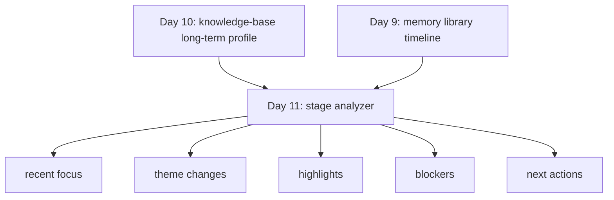

# Day 11：知识库级阶段总结与成长分析

## 今天的总目标

- 不再只停留在“这个知识库长期像什么”
- 开始回答“这个知识库最近出现了什么变化”
- 让系统从静态画像走向带时间窗口的动态分析

## 今天结束前，你必须拿到什么

- `schemas/growth_report.py`
- `utils/growth_prompt.py`
- `utils/growth_analyzer.py`
- `routers/analysis.py`
- `scripts/debug_day11.py`
- 一套你能自己复述的“current_user + knowledge_base + timeline + profile -> growth report”理解框架

---

## Day 11 一图总览

如果把 Day 11 压缩成一句话，它做的就是：

> 基于知识库时间线和长期画像，提炼最近阶段的主题变化、亮点、卡点和下一步方向。

今天的主链路可以先背成这样：

```text
get current user
-> validate knowledge base ownership
-> load memory entries by knowledge_base_id
-> build memory library
-> build long-term profile
-> split recent vs earlier timeline
-> build growth report
```

你今天要特别清楚：

- Day 10 的重点是“长期轮廓”
- Day 11 的重点是“阶段变化”

---

## 为什么 Day 11 也要重构

旧版 Day 11 还有两个典型问题：

- 还是偏 `document_id` 视角
- 还没有真正把“当前用户 + 知识库所有权”纳入分析链路

但你现在项目的真实输入边界已经是：

```text
current_user
-> knowledge_base
-> memory_entries
-> memory_library
-> profile
-> growth_report
```

所以 Day 11 的一句话重构目标就是：

> 阶段分析必须建立在“当前用户自己的知识库”之上，而不是随便对一份文档做总结。

---

## Day 11 整体架构

```mermaid
flowchart TD
    A[current_user] --> B[校验 knowledge_base ownership]
    B --> C[list_memory_entries_by_knowledge_base_id]
    C --> D[build_memory_library]
    D --> E[build_personal_profile]
    E --> F[split_timeline]
    F --> G[growth_analyzer]
    G --> H[growth_prompt]
    H --> I[get_llm]
    I --> J[PydanticOutputParser]
    J --> K[GrowthReportResult]
    K --> L[/analysis 路由返回]
```

### 你要怎么理解这张图

#### 第 1 层：认证与作用域层

这层负责：

- 只允许当前登录用户分析自己的知识库
- 保证 Day 11 的输出有明确归属

#### 第 2 层：基线构建层

这层负责：

- 把记忆词条组织成 `memory_library`
- 用 Day 10 的逻辑先构建长期 `profile`

白话理解：

- 没有长期画像，就没有稳定 baseline
- 没有 baseline，就很难谈“变化”

#### 第 3 层：阶段分析层

这层负责：

- 切出最近窗口
- 对比更早窗口
- 识别变化主题
- 提炼亮点、卡点、下一步动作

---

## Day 10 到 Day 11 的交接图



你要记住：

- Day 10 是“长期像什么”
- Day 11 是“最近变成什么样”

---

## 今天的边界要讲透

## 第 1 层：Day 11 不是再写一版 Day 10

如果 Day 11 只是重复输出：

- 长期主题
- 能力标签
- 表达风格

那你只是又做了一次画像。

今天真正要回答的是：

- 最近重点在变强什么
- 最近新出现了什么
- 最近卡点在哪里
- 下一步最值得做什么

所以今天一定要守住一个关键词：

- `change`

## 第 2 层：没有时间窗口，就没有阶段分析

Day 11 最核心的工程动作不是“再调一次 LLM”，  
而是先做：

- 时间窗口切分

第一版建议直接这样做：

- 默认 `recent_days=30`

如果样本不足，再退化成：

- 前半段 vs 后半段

也就是说，今天最关键的不是 prompt 多漂亮，  
而是你先把“最近”和“更早”真正分开。

## 第 3 层：阶段分析必须接入 knowledge_base 作用域

Day 11 最容易犯的错是：

- 拿一篇文档的 timeline 硬做阶段分析

但阶段分析要观察的是：

- 这个知识库整体内容近一段时间的变化

所以今天的主输入一定是：

- `knowledge_base_id`

单文档最多只能作为：

- 调试窗口
- 局部验证手段

## 第 4 层：Day 11 的输出不能只有一段总结

建议今天至少保留这几个字段：

- `analysis_window`
- `stage_summary`
- `recent_focus`
- `theme_changes`
- `highlights`
- `blockers`
- `next_actions`

这样做的好处是：

- 能检查
- 能展示
- 能复用
- 能进入 Day 12 的产品化组合层

## 第 5 层：今天的结论要比 Day 10 更克制

因为 Day 11 很容易一不小心就写成：

- 夸大变化
- 夸大阻力
- 夸大建议

所以今天一定要允许输出：

- “变化信号有限”
- “当前数据不足以支持很强结论”

这反而会让系统更像一个可靠产品。

---

## 上午学习：09:00 - 12:00

## 09:00 - 09:50：先把新版 Day 11 主链路讲顺

今天你必须能顺着说出来：

```text
current_user
-> knowledge_base_id
-> memory entries
-> memory library
-> long-term profile
-> recent vs earlier split
-> growth report
```

你今天必须能回答这两个问题：

1. 为什么 Day 11 不能只看 Day 10 的 `profile`？
2. 为什么 Day 11 必须先切时间窗口再做总结？

## 09:50 - 10:40：先想清楚 Day 11 的最小输出结构

今天建议先做这 7 个字段：

- `knowledge_base_id`
- `analysis_window`
- `stage_summary`
- `recent_focus`
- `theme_changes`
- `highlights`
- `blockers`
- `next_actions`

这里最重要的是：

- 一定要保留 `analysis_window`
- 这样你以后看到结果时，才知道这份报告到底在分析哪段时间

## 10:40 - 11:30：把窗口切分策略想清楚

今天建议你先实现两个策略：

### 主策略

- 按 `recent_days=30` 切

### 退化策略

- 如果更早窗口为空，而且总样本量还行
- 那就退化成前半段 vs 后半段

这一步做好之后，Day 11 的分析框架就会稳很多。

## 11:30 - 12:00：先决定今天怎么验收

Day 11 的最小验收目标：

- 能基于 `knowledge_base_id` 输出结构化成长报告
- 报告接口接入 JWT
- 能切出 recent / earlier 两段时间线
- 报告至少包含阶段总结、亮点、卡点、下一步建议

---

## 下午编码：14:00 - 18:00

## 14:00 - 14:40：先定义成长报告结构

建议新增：

- `schemas/growth_report.py`

建议最小结构：

```python
from pydantic import BaseModel, Field


class ThemeChangeItem(BaseModel):
    theme_name: str = Field(..., description="主题名")
    change_type: str = Field(..., description="new、stronger、weaker、stable")
    reason: str = Field(..., description="变化判断依据")
    evidence_entries: list[str] = Field(default_factory=list, description="支撑变化的词条名")


class GrowthReportResult(BaseModel):
    knowledge_base_id: str = Field(..., description="所属知识库")
    analysis_window: str = Field(..., description="分析窗口说明")
    stage_summary: str = Field(..., description="阶段总结")
    recent_focus: list[str] = Field(default_factory=list, description="最近关注主题")
    theme_changes: list[ThemeChangeItem] = Field(default_factory=list)
    highlights: list[str] = Field(default_factory=list, description="阶段亮点")
    blockers: list[str] = Field(default_factory=list, description="当前卡点")
    next_actions: list[str] = Field(default_factory=list, description="下一步建议")
```

这里你一定要看懂：

- `knowledge_base_id`
  - 明确报告归属
- `analysis_window`
  - 明确报告时段

## 14:40 - 15:20：实现 `utils/growth_prompt.py`

今天 prompt 的核心不是“写得感人”，  
而是：

- 明确要求做对比
- 明确要求看最近变化
- 明确要求控制结论强度

推荐骨架：

```python
from langchain_core.prompts import ChatPromptTemplate


def get_growth_report_prompt(format_instructions: str) -> ChatPromptTemplate:
    return ChatPromptTemplate.from_messages(
        [
            (
                "system",
                "你是一个个人成长阶段分析助手。"
                "你会基于长期画像、较早阶段内容和最近阶段内容，提炼主题变化、亮点、卡点和下一步建议。"
                "你只能基于输入内容做判断，不能编造经历，不能给出过度绝对的结论。"
                "输出必须严格遵守格式要求。"
            ),
            (
                "human",
                "current_user_id={user_id}\n"
                "knowledge_base_id={knowledge_base_id}\n"
                "growth_input=\n{growth_input_text}\n\n"
                "{format_instructions}"
            ),
        ]
    ).partial(format_instructions=format_instructions)
```

## 15:20 - 16:20：实现 `utils/growth_analyzer.py`

今天建议你把分析逻辑拆成 3 段：

### 第一段：切窗口

```python
def split_timeline_by_recent_days(
        timeline: list[dict],
        recent_days: int = 30,
) -> tuple[list[dict], list[dict]]:
    ...
```

### 第二段：构造输入

```python
def build_growth_input(
        *,
        knowledge_base_id: str,
        memory_library: dict,
        profile: dict,
        recent_days: int,
) -> str:
    ...
```

### 第三段：生成报告

```python
async def build_growth_report(
        *,
        user_id: int,
        knowledge_base_id: str,
        memory_library: dict,
        profile: dict,
        recent_days: int = 30,
) -> dict:
    ...
```

推荐主流程：

1. 先用 `memory_library["timeline"]` 切窗口
2. 再把 `profile + earlier + recent` 统一打包
3. `json.dumps(..., ensure_ascii=False, default=str, indent=2)`
4. `prompt | llm | parser`
5. 返回 `result.model_dump()`

## 16:20 - 17:00：补阶段分析路由

建议新增：

- `routers/analysis.py`

建议接口：

```python
GET /analysis/knowledge-bases/{knowledge_base_id}/growth?recent_days=30
Authorization: Bearer <token>
```

推荐内部流程：

1. `Depends(get_current_user)`
2. 查知识库并校验归属
3. 拉知识库下所有 `memory_entries`
4. `build_memory_library(entries)`
5. `build_personal_profile(...)`
6. `build_growth_report(...)`
7. 返回 `GrowthReportResult`

## 17:00 - 17:40：做一个最小调试脚本

建议新增：

- `scripts/debug_day11.py`

今天脚本里最值得看的不是“有没有返回”，  
而是：

- `analysis_window` 是否合理
- `theme_changes` 是否站得住
- `highlights` 和 `blockers` 是否真的贴着输入内容

建议至少打印：

- `analysis_window`
- `stage_summary`
- `theme_changes`
- `highlights`
- `next_actions`

## 17:40 - 18:00：给 Day 12 留下产品化入口

今天你要留下来的心智模型：

```text
Day 10:
who this knowledge base looks like over the long term

Day 11:
what changed recently inside this knowledge base

Day 12:
how to present profile + growth report as product output
```

---

## 晚上复盘：20:00 - 21:00

今晚你必须自己讲顺的 10 个点：

1. 为什么 Day 11 不能只是重写一版 Day 10？
2. 为什么阶段分析必须先切 recent / earlier？
3. 为什么 Day 11 也必须按 `knowledge_base_id` 做作用域？
4. 为什么今天的接口也最好直接绑定 `current_user`？
5. `recent_focus` 和 `theme_changes` 的区别是什么？
6. 为什么 `analysis_window` 一定要保留？
7. 如果数据很少，为什么允许输出“变化信号有限”？
8. 为什么 `next_actions` 不能写成空泛鸡汤？
9. Day 11 和 Day 12 的边界到底是什么？
10. 为什么知识库级阶段分析比文档级总结更像产品能力？

---

## 今日验收标准

- 能基于 `knowledge_base_id` 构建成长报告
- 路由接入 `Depends(get_current_user)`
- 有知识库归属校验
- 能切出 `recent / earlier`
- `stage_summary` 可用
- `theme_changes` 可用
- `highlights` 可用
- `blockers` 可用
- `next_actions` 可用
- `build_growth_report(...)` 可用

---

## 今天最容易踩的坑

### 坑 1：继续按单文档做阶段分析

问题：

- 时间跨度很窄
- 很难看出长期变化

规避建议：

- 今天主输入默认升级成 `knowledge_base_id`

### 坑 2：没有作用域校验

问题：

- 多用户场景下容易越权

规避建议：

- 路由里一定校验知识库归属

### 坑 3：只看最近，不看更早

问题：

- 得到的只是“最近总结”
- 不是“阶段变化”

规避建议：

- 今天一定保留 earlier vs recent 的对比意识

### 坑 4：数据不够还强行下重结论

问题：

- 容易误导

规避建议：

- 允许输出保守结论
- 明确“变化信号有限”

### 坑 5：建议写成通用鸡汤

问题：

- 看起来像建议
- 实际和输入没关系

规避建议：

- `next_actions` 尽量贴着主题变化和卡点来写

---

## 给明天的交接提示

明天你会进入更像产品输出的一层：

- 怎么把画像、阶段分析和回答组合起来
- 怎么让接口不只是“能返回”，而是“像一个长期陪伴产品”
- 怎么让用户看到的不只是结论，还有依据和上下文

所以 Day 11 的意义是：

> 先把“这个知识库最近发生了什么变化”结构化下来。

只有变化被清楚看见，  
Day 12 的产品化输出才会更有说服力。
