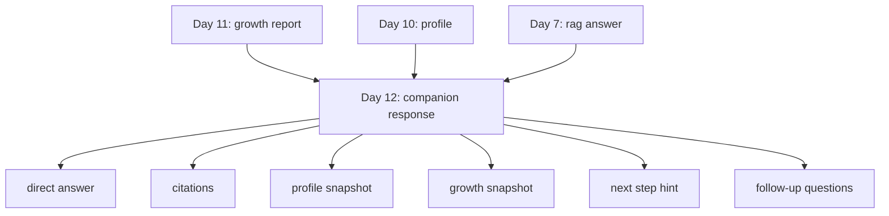

# Day 12：知识库级陪伴式回答与产品化输出

## 今天的总目标

- 不再只返回“answer + sources”
- 开始把回答、引用、画像摘要、阶段摘要，组装成更像产品的结果页输出
- 让现有 RAG、画像、成长分析三条链路，真正汇成一个用户可感知的统一结果

## 今天结束前，你必须拿到什么

- `schemas/companion.py`
- `utils/companion_prompt.py`
- `utils/companion_builder.py`
- `routers/companion.py`
- `scripts/debug_day12.py`
- 一套你能自己复述的“current_user + knowledge_base + question + profile + growth -> companion response”理解框架

---

## Day 12 一图总览

如果把 Day 12 压缩成一句话，它做的就是：

> 把单次问答结果，升级成带上下文、带画像、带阶段感、带下一步提示的陪伴式输出。

今天的主链路可以先背成这样：

```text
get current user
-> validate knowledge base ownership
-> generate rag answer
-> load memory entries by knowledge_base_id
-> build memory library
-> build long-term profile
-> build growth report
-> merge into companion response
```

你今天要特别清楚：

- Day 11 的重点是“最近发生了什么变化”
- Day 12 的重点是“怎么把这些理解结果一次性更完整地呈现给用户”

---

## 为什么 Day 12 要重构

你当前项目的聊天接口，本质上还是：

```text
question
-> retrieve chunks
-> llm
-> answer + sources
```

这个主干当然没问题，  
但它还更像“知识问答接口”，而不是“长期陪伴产品输出”。

如果只返回：

- `answer`
- `sources`

那用户拿到的感受通常还是：

- 系统回答了我
- 但系统并没有把“它对我这个知识库的理解”一起带出来

可你前面 Day 9 到 Day 11 已经陆续有了：

- `memory_library`
- `profile`
- `growth_report`

所以 Day 12 的一句话重构目标就是：

> 不要让这些分析结果各自孤立存在，而要把它们汇总成一次更完整、更像产品的回答。

---

## Day 12 整体架构

```mermaid
flowchart TD
    A[current_user] --> B[校验 knowledge_base ownership]
    B --> C[generate_rag_answer]
    B --> D[list_memory_entries_by_knowledge_base_id]
    D --> E[build_memory_library]
    E --> F[build_personal_profile]
    F --> G[build_growth_report]
    C --> H[companion_builder]
    G --> H
    F --> H
    H --> I[companion_prompt]
    I --> J[get_llm]
    J --> K[PydanticOutputParser]
    K --> L[CompanionAnswerResult]
    L --> M[/companion 路由返回]
```

### 你要怎么理解这张图

#### 第 1 层：认证与作用域层

这层负责：

- 从 JWT 拿到 `current_user`
- 校验 `knowledge_base_id` 归属当前用户

Day 12 虽然是“结果页整合”，  
但它仍然必须先解决一个最基础的问题：

- 这份结果到底是给谁看的

#### 第 2 层：底层能力调用层

这层负责：

- 用 RAG 回答当前问题
- 用记忆库构建长期画像
- 用时间窗口构建阶段报告

白话理解：

- Day 12 不是重新发明底层能力
- 而是把前面已经做出来的能力，组合成一次更完整的输出

#### 第 3 层：结果组装层

这层负责：

- 从 `rag_result` 里提炼直接回答
- 从 `profile` 里提炼长期画像摘要
- 从 `growth_report` 里提炼阶段变化摘要
- 再补一个“下一步最建议做什么”

这一步非常像产品工作，不再只是单纯算法调用。

---

## Day 11 到 Day 12 的交接图



这张图你要记住：

- Day 7 提供“能回答”
- Day 10 提供“长期理解”
- Day 11 提供“最近变化”
- Day 12 才开始把这些东西真正整成一个产品结果

---

## 今天的边界要讲透

## 第 1 层：Day 12 不是重写 RAG

今天最容易误判的地方是：

- 以为要再优化一次检索
- 以为要再改一次向量库
- 以为要再改一版 prompt_builder

这些都不是今天的重点。

今天真正的重点是：

- 把已有回答和已有分析，合成一次更完整的陪伴式输出

所以今天你要守住一个边界：

- RAG 还是 RAG
- 画像还是画像
- 成长分析还是成长分析
- Day 12 负责“组合与呈现”

## 第 2 层：Day 12 的输出必须是结构化的

今天千万别做成：

- 一大段好看的文案

因为那种东西虽然好读，  
但很难：

- 前端展示
- 后续调试
- 二次复用

所以今天建议至少保留这些字段：

- `direct_answer`
- `citations`
- `profile_snapshot`
- `growth_snapshot`
- `next_step_hint`
- `follow_up_questions`
- `companion_message`

它们加在一起，才更像一个结果页。

## 第 3 层：Day 12 要比 Day 11 更“用户可见”

Day 10 和 Day 11 的输出，更像系统内部分析能力。

但 Day 12 开始要想一件事：

> 如果用户只看一个接口结果，它看起来像不像一个真正可用的产品输出？

所以今天的结果应该既有：

- 直接回答

也有：

- 我为什么这样回答
- 这个回答和你的长期画像有什么关系
- 这个回答和你最近阶段有什么关系
- 你下一步可以怎么继续问

## 第 4 层：产品化输出不能脱离依据

Day 12 看起来更温和、更像产品，  
但不能因此丢掉依据感。

所以今天还是要保留：

- `citations`
- `sources`
- 画像摘要来自什么
- 阶段摘要来自什么

否则就会变成：

- 输出很好看
- 但不可信

## 第 5 层：今天只做“陪伴式输出”，不要急着做“系统性建议引擎”

今天你可以给：

- `next_step_hint`
- `follow_up_questions`

但不要今天就把它扩成完整行动计划。

因为更系统的建议生成，  
是 Day 13 的事情。

---

## 上午学习：09:00 - 12:00

## 09:00 - 09:50：先把 Day 12 主链路讲顺

今天你必须能顺着说出来：

```text
current_user
-> knowledge_base_id
-> rag answer
-> memory library
-> profile
-> growth report
-> companion response
```

你今天必须能回答这两个问题：

1. 为什么 Day 12 不是再做一版聊天接口？
2. 为什么 Day 12 的结果一定要同时带上“回答”和“分析摘要”？

## 09:50 - 10:40：先想清楚 Day 12 的最小输出结构

今天建议先做这 7 个字段：

- `knowledge_base_id`
- `question`
- `direct_answer`
- `citations`
- `profile_snapshot`
- `growth_snapshot`
- `next_step_hint`
- `follow_up_questions`
- `companion_message`

这里你一定要先想清楚：

- `direct_answer`
  - 负责快速回答当前问题
- `profile_snapshot`
  - 负责补“长期我是怎么理解你的”
- `growth_snapshot`
  - 负责补“你最近在发生什么变化”

## 10:40 - 11:30：把接口形态想清楚

今天推荐的接口风格是：

```text
POST /companion/knowledge-bases/{knowledge_base_id}/reply
Authorization: Bearer <token>
```

请求体建议最小只保留：

- `question`
- `top_k`

内部流程建议：

1. `Depends(get_current_user)`
2. 校验知识库归属
3. 调 `generate_rag_answer(...)`
4. 拉知识库下 `memory_entries`
5. 组织 `memory_library`
6. 生成 `profile`
7. 生成 `growth_report`
8. 生成 `companion_response`

## 11:30 - 12:00：先决定今天怎么验收

Day 12 的最小验收目标：

- 能基于一个问题返回“产品化回答结果”
- 结果里同时包含回答、引用、长期画像摘要、阶段摘要
- 路由接入 JWT
- 结果能被 schema 校验通过

---

## 下午编码：14:00 - 18:00

## 14:00 - 14:40：先定义陪伴式输出结构

建议新增文件：

- `schemas/companion.py`

建议最小结构：

```python
from pydantic import BaseModel, Field


class CompanionQueryRequest(BaseModel):
    question: str = Field(..., description="用户问题")
    top_k: int = Field(default=4, ge=1, le=10, description="检索片段数量")


class CompanionCitationItem(BaseModel):
    document_id: str = Field(..., description="来源文档 ID")
    chunk_id: str = Field(..., description="来源片段 ID")
    page_no: int | None = Field(default=None, description="页码")
    text: str = Field(..., description="引用片段文本")
    reason: str = Field(..., description="为什么这个片段支撑当前回答")


class CompanionAnswerResult(BaseModel):
    knowledge_base_id: str = Field(..., description="所属知识库")
    question: str = Field(..., description="用户问题")
    direct_answer: str = Field(..., description="直接回答")
    citations: list[CompanionCitationItem] = Field(default_factory=list)
    profile_snapshot: str = Field(..., description="长期画像摘要")
    growth_snapshot: str = Field(..., description="最近阶段摘要")
    next_step_hint: str = Field(..., description="最建议的下一步")
    follow_up_questions: list[str] = Field(default_factory=list, description="推荐继续追问的问题")
    companion_message: str = Field(..., description="更像产品输出的陪伴式总结")
```

这里你一定要看懂：

- `citations`
  - 保留依据感
- `profile_snapshot`
  - 连接长期画像
- `growth_snapshot`
  - 连接阶段变化

## 14:40 - 15:20：实现 `utils/companion_prompt.py`

今天 prompt 的关键，不是“写得多温柔”，  
而是：

- 明确输入里已经有直接回答、画像、阶段分析
- 要求模型做“整合”，而不是重做底层分析
- 输出必须严格结构化

### `utils/companion_prompt.py` 练手骨架版

```python
from langchain_core.prompts import ChatPromptTemplate


def get_companion_prompt(format_instructions: str) -> ChatPromptTemplate:
    # 你要做的事：
    # 1. 用 ChatPromptTemplate.from_messages(...)
    # 2. 准备一个 system 消息
    # 3. 明确告诉模型：输入包含问题、rag 回答、引用、长期画像、阶段报告
    # 4. 明确告诉模型：重点是做产品化整合，不是重写一遍底层分析
    # 5. 明确告诉模型：不能编造引用，不能输出脱离输入的判断
    # 6. 在 human 消息里至少包含 user_id、knowledge_base_id、companion_input_text
    # 7. 把 format_instructions 拼进去，约束输出结构
    raise NotImplementedError("先自己实现 get_companion_prompt")
```

### `utils/companion_prompt.py` 参考答案

```python
from langchain_core.prompts import ChatPromptTemplate


def get_companion_prompt(format_instructions: str) -> ChatPromptTemplate:
    return ChatPromptTemplate.from_messages(
        [
            (
                "system",
                "你是一个陪伴式回答整理助手。"
                "你会基于当前问题的 RAG 回答、引用片段、长期画像和阶段分析，"
                "整理出更像产品结果页的结构化输出。"
                "你不能编造引用，不能输出脱离输入依据的判断，"
                "重点是整合，不是重复做底层检索分析。"
                "输出必须严格遵守格式要求。"
            ),
            (
                "human",
                "current_user_id={user_id}\n"
                "knowledge_base_id={knowledge_base_id}\n"
                "companion_input=\n{companion_input_text}\n\n"
                "{format_instructions}"
            ),
        ]
    ).partial(format_instructions=format_instructions)
```

## 15:20 - 16:20：实现 `utils/companion_builder.py`

今天的重点不是让模型更复杂，  
而是把输入边界收干净。

建议函数拆成两层：

```python
def build_companion_input(
        *,
        question: str,
        rag_result: dict,
        profile: dict,
        growth_report: dict,
) -> str:
    # 你要做的事：
    # 1. 组装一个统一 payload
    # 2. 至少包含 question、rag_result、profile、growth_report
    # 3. 用 json.dumps(...) 转成字符串
    # 4. ensure_ascii=False，保证中文可读
    # 5. default=str，避免 datetime 序列化报错
    # 6. indent=2，方便调试
    raise NotImplementedError("先自己实现 build_companion_input")


async def build_companion_response(
        *,
        user_id: int,
        knowledge_base_id: str,
        question: str,
        rag_result: dict,
        profile: dict,
        growth_report: dict,
) -> dict:
    # 你要做的事：
    # 1. 创建 PydanticOutputParser
    # 2. 获取 format_instructions
    # 3. 调 get_companion_prompt(...)
    # 4. 调 build_companion_input(...)
    # 5. 获取 llm
    # 6. 组装 chain = prompt | llm | parser
    # 7. 调 chain.ainvoke({...})，传入 user_id、knowledge_base_id、companion_input_text
    # 8. 返回 result.model_dump()
    raise NotImplementedError("先自己实现 build_companion_response")
```

推荐主流程：

1. 先收口当前问题和 RAG 回答
2. 再收口长期画像和阶段报告
3. `json.dumps(..., ensure_ascii=False, default=str, indent=2)`
4. `prompt | llm | parser`
5. 返回 `result.model_dump()`

### `utils/companion_builder.py` 参考答案

```python
import json

from langchain_core.output_parsers import PydanticOutputParser

from schemas.companion import CompanionAnswerResult
from utils.companion_prompt import get_companion_prompt
from clients.llm_client import get_llm


def build_companion_input(
        *,
        question: str,
        rag_result: dict,
        profile: dict,
        growth_report: dict,
) -> str:
  payload = {
    "question": question,
    "rag_result": rag_result,
    "profile": profile,
    "growth_report": growth_report,
  }

  return json.dumps(
    payload,
    ensure_ascii=False,
    default=str,
    indent=2,
  )


async def build_companion_response(
        *,
        user_id: int,
        knowledge_base_id: str,
        question: str,
        rag_result: dict,
        profile: dict,
        growth_report: dict,
) -> dict:
  parser = PydanticOutputParser(pydantic_object=CompanionAnswerResult)
  instructions = parser.get_format_instructions()

  prompt = get_companion_prompt(format_instructions=instructions)
  llm = get_llm()
  chain = prompt | llm | parser

  result = await chain.ainvoke(
    {
      "user_id": user_id,
      "knowledge_base_id": knowledge_base_id,
      "companion_input_text": build_companion_input(
        question=question,
        rag_result=rag_result,
        profile=profile,
        growth_report=growth_report,
      ),
    }
  )

  payload = result.model_dump()
  payload["knowledge_base_id"] = knowledge_base_id
  payload["question"] = question
  return payload
```

## 16:20 - 17:00：补产品化输出路由

建议新增：

- `routers/companion.py`

建议接口：

```python
POST /companion/knowledge-bases/{knowledge_base_id}/reply
Authorization: Bearer <token>
```

### `routers/companion.py` 练手骨架版

```python
from fastapi import APIRouter, Depends
from sqlalchemy.ext.asyncio import AsyncSession

from conf.database import get_database
from crud.knowledge_base import get_knowledge_base_by_id
from crud.memory_entry import list_memory_entries_by_knowledge_base_id
from models.user import User
from schemas.companion import CompanionAnswerResult, CompanionQueryRequest
from utils.auth import get_current_user
from services.companion_service import build_companion_response
from services.growth_service import build_growth_report
from services.memory_service import build_memory_library
from services.profile_service import build_personal_profile
from services.query_service import generate_rag_answer
from utils.response import success_response

router = APIRouter(prefix="/companion", tags=["companion"])


@router.post("/knowledge-bases/{knowledge_base_id}/reply")
async def get_companion_reply(
        knowledge_base_id: str,
        payload: CompanionQueryRequest,
        current_user: User = Depends(get_current_user),
        db: AsyncSession = Depends(get_database),
):
  # 你要做的事：
  # 1. 查询 knowledge_base
  # 2. 判断 knowledge_base 是否存在
  # 3. 校验 knowledge_base.user_id == current_user.id
  # 4. 调 generate_rag_answer(...)
  # 5. 读取该知识库下的 memory entries
  # 6. 转成 build_memory_library(...) 需要的 dict 列表
  # 7. 调 build_memory_library(entries)
  # 8. 调 await build_personal_profile(...)
  # 9. 调 await build_growth_report(...)
  # 10. 调 await build_companion_response(...)
  # 11. 用 CompanionAnswerResult 校验结果
  # 12. return success_response(data=data)
  raise NotImplementedError("先自己实现 get_companion_reply")
```

今天路由里你一定要做的事：

1. 查知识库
2. 校验归属
3. 调 RAG 拿当前问题的回答
4. 再把长期画像和阶段报告一起拼进去
5. 最后返回统一产品结果

### `routers/companion.py` 参考答案

```python
from fastapi import APIRouter, Depends
from sqlalchemy.ext.asyncio import AsyncSession

from conf.database import get_database
from crud.knowledge_base import get_knowledge_base_by_id
from crud.memory_entry import list_memory_entries_by_knowledge_base_id
from models.user import User
from schemas.companion import CompanionAnswerResult, CompanionQueryRequest
from utils.auth import get_current_user
from services.companion_service import build_companion_response
from utils.exceptions import BusinessException
from services.growth_service import build_growth_report
from services.memory_service import build_memory_library
from services.profile_service import build_personal_profile
from services.query_service import generate_rag_answer
from utils.response import success_response

router = APIRouter(prefix="/companion", tags=["companion"])


@router.post("/knowledge-bases/{knowledge_base_id}/reply")
async def get_companion_reply(
        knowledge_base_id: str,
        payload: CompanionQueryRequest,
        current_user: User = Depends(get_current_user),
        db: AsyncSession = Depends(get_database),
):
  knowledge_base = await get_knowledge_base_by_id(db, knowledge_base_id)
  if not knowledge_base:
    raise BusinessException(message="知识库不存在", code=4042, status_code=404)
  if knowledge_base.user_id != current_user.id:
    raise BusinessException(message="知识库不属于当前用户", code=4007)

  rag_result = await generate_rag_answer(
    question=payload.question,
    knowledge_base_id=knowledge_base_id,
    user_id=current_user.id,
    top_k=payload.top_k,
  )

  rows = await list_memory_entries_by_knowledge_base_id(
    db,
    knowledge_base_id=knowledge_base_id,
  )

  entries = [
    {
      "id": item.id,
      "entry_name": item.entry_name,
      "entry_type": item.entry_type,
      "summary": item.summary,
      "created_at": item.created_at,
    }
    for item in rows
  ]

  memory_library = build_memory_library(entries)
  profile = await build_personal_profile(
    user_id=current_user.id,
    knowledge_base_id=knowledge_base_id,
    memory_library=memory_library,
  )
  growth_report = await build_growth_report(
    user_id=current_user.id,
    knowledge_base_id=knowledge_base_id,
    memory_library=memory_library,
    profile=profile,
    recent_days=30,
  )
  result = await build_companion_response(
    user_id=current_user.id,
    knowledge_base_id=knowledge_base_id,
    question=payload.question,
    rag_result=rag_result,
    profile=profile,
    growth_report=growth_report,
  )
  data = CompanionAnswerResult(**result)

  return success_response(data=data)
```

## 17:00 - 17:40：做一个最小调试脚本

建议新增：

- `scripts/debug_day12.py`

今天脚本里最值得看的不是“有没有返回”，  
而是：

- `direct_answer` 是否仍然清楚
- `profile_snapshot` 是否真的贴着长期画像
- `growth_snapshot` 是否真的贴着最近阶段
- `next_step_hint` 是否比通用鸡汤更具体

### `scripts/debug_day12.py` 练手骨架版

```python
import asyncio

from services.companion_service import build_companion_response


async def main():
  # 你要做的事：
  # 1. 准备一个最小 rag_result 模拟对象
  # 2. 准备一个最小 profile 模拟对象
  # 3. 准备一个最小 growth_report 模拟对象
  # 4. 调 build_companion_response(...)
  # 5. 打印 direct_answer
  # 6. 打印 profile_snapshot
  # 7. 打印 growth_snapshot
  # 8. 打印 next_step_hint
  # 9. 打印 follow_up_questions
  raise NotImplementedError("先自己实现 main")


if __name__ == "__main__":
  asyncio.run(main())
```

建议至少打印：

- `direct_answer`
- `profile_snapshot`
- `growth_snapshot`
- `next_step_hint`
- `follow_up_questions`

### `scripts/debug_day12.py` 参考答案

```python
import asyncio

from services.companion_service import build_companion_response

rag_result = {
  "answer": "你现在最值得优先做的，是把知识库级画像、阶段分析和聊天回答整成一个统一输出层。",
  "sources": [
    {
      "document_id": "doc_001",
      "chunk_id": "chunk_001",
      "page_no": 1,
      "text": "最近持续在做记忆库、画像与阶段分析能力的串联。",
      "knowledge_base_id": "kb_demo_001",
    }
  ],
}

profile = {
  "knowledge_base_id": "kb_demo_001",
  "entry_count": 8,
  "profile_summary": "长期关注个人成长、知识管理和 AI 后端系统构建。",
  "main_themes": [
    {
      "theme_name": "知识管理",
      "reason": "多条词条都围绕记忆沉淀与长期复用展开",
      "evidence_entries": ["知识管理", "个人成长记录"],
    }
  ],
  "ability_tags": [
    {
      "ability_name": "FastAPI 后端开发",
      "reason": "持续围绕接口、鉴权和数据流转进行实现",
      "evidence_entries": ["FastAPI 后端开发"],
    }
  ],
  "expression_style": "偏结构化、复盘式表达",
  "growth_focus": ["把系统能力整成产品闭环"],
}

growth_report = {
  "knowledge_base_id": "kb_demo_001",
  "analysis_window": "最近 30 天 vs 更早阶段",
  "stage_summary": "最近明显从底层能力实现，转向产品化组合输出。",
  "recent_focus": ["陪伴式输出", "统一结果页"],
  "theme_changes": [
    {
      "theme_name": "产品化输出",
      "change_type": "stronger",
      "reason": "最近多条内容都在强调把画像、阶段分析和问答整合起来",
      "evidence_entries": ["统一输出层", "陪伴式回答"],
    }
  ],
  "highlights": ["开始形成产品视角，而不是只停留在接口能力"],
  "blockers": ["结果还没有统一输出结构"],
  "next_actions": ["先做 companion response schema 和路由"],
}


async def main():
  result = await build_companion_response(
    user_id=1,
    knowledge_base_id="kb_demo_001",
    question="我现在最该优先补哪一层？",
    rag_result=rag_result,
    profile=profile,
    growth_report=growth_report,
  )

  print("direct_answer")
  print(result["direct_answer"])
  print()

  print("profile_snapshot")
  print(result["profile_snapshot"])
  print()

  print("growth_snapshot")
  print(result["growth_snapshot"])
  print()

  print("next_step_hint")
  print(result["next_step_hint"])
  print()

  print("follow_up_questions")
  for item in result["follow_up_questions"]:
    print(item)


if __name__ == "__main__":
  asyncio.run(main())
```

## 17:40 - 18:00：给 Day 13 留下行动层入口

今天你要留住这句话：

```text
Day 12:
productized companion output

Day 13:
action-oriented growth advice
```

也就是：

- Day 12 是把结果更完整地展示出来
- Day 13 才开始系统化地产生建议和行动计划

---

## 晚上复盘：20:00 - 21:00

今晚你必须自己讲顺的 10 个点：

1. 为什么 Day 12 不是重写一版聊天接口？
2. 为什么陪伴式输出一定要同时保留直接回答和引用？
3. 为什么 Day 12 要把画像摘要和阶段摘要一起带出来？
4. `direct_answer` 和 `companion_message` 的区别是什么？
5. 为什么 Day 12 的结果必须是结构化而不是纯文案？
6. 为什么 Day 12 仍然必须保留依据感？
7. 为什么今天不要急着把建议层做得过重？
8. Day 12 和 Day 13 的边界到底是什么？
9. 为什么产品化输出会比单个分析接口更像真正产品？
10. 为什么 Day 12 是后面 Mneme MVP 展示体验的关键一环？

---

## 今日验收标准

- 能基于一个问题返回结构化陪伴式输出
- 路由接入 `Depends(get_current_user)`
- 有知识库归属校验
- `direct_answer` 可用
- `citations` 可用
- `profile_snapshot` 可用
- `growth_snapshot` 可用
- `next_step_hint` 可用
- `build_companion_response(...)` 可用

---

## 今天最容易踩的坑

### 坑 1：把 Day 12 做成聊天接口换皮

问题：

- 只是多包了一层
- 没有真正带出长期画像和阶段变化

规避建议：

- 今天一定把 `rag_result + profile + growth_report` 三份输入都接起来

### 坑 2：把 Day 12 做成一段很长的文案

问题：

- 可读性不一定更高
- 前端也不方便拆开展示

规避建议：

- 保持结构化字段输出

### 坑 3：为了“像产品”就丢掉引用

问题：

- 输出更顺了
- 但可信度下降了

规避建议：

- `citations` 继续保留

### 坑 4：把 Day 13 的建议层提前做进来

问题：

- 容易把边界做乱
- 今天的主线会变得不清楚

规避建议：

- 今天只保留 `next_step_hint`
- 更完整的行动建议留到明天

### 坑 5：输出没有知识库归属

问题：

- 多用户场景下不清楚结果属于谁

规避建议：

- 结果里明确保留 `knowledge_base_id`

---

## 给明天的交接提示

明天你会进入“建议与行动导向”这一层：

- 怎么把阶段变化转成下一步动作
- 怎么让建议更具体、更低负担、更贴着当前阶段
- 怎么让 Mneme 从“理解你”进一步走向“帮助你”

所以 Day 12 的意义是：

> 先把问答、画像、成长分析，整理成一份真正能给用户看的统一结果。

只有统一结果先站住，  
Day 13 的建议层才有落点。
