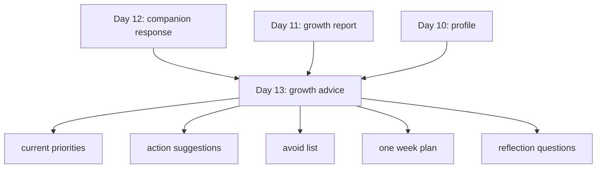

# Day 13：知识库级成长建议与行动计划

## 今天的总目标

- 不再只停留在“理解你、总结你”
- 开始把长期画像和阶段变化，转成更具体的成长建议与行动计划
- 让 Mneme 从“分析型系统”进一步走向“帮助型系统”

## 今天结束前，你必须拿到什么

- `schemas/advice.py`
- `utils/advice_prompt.py`
- `utils/advice_builder.py`
- `routers/advice.py`
- `scripts/debug_day13.py`
- 一套你能自己复述的“current_user + knowledge_base + profile + growth_report + focus_goal -> growth advice”理解框架

---

## Day 13 一图总览

如果把 Day 13 压缩成一句话，它做的就是：

> 基于长期画像和最近阶段变化，生成更可执行、更低负担、更贴着当前状态的成长建议。

今天的主链路可以先背成这样：

```text
get current user
-> validate knowledge base ownership
-> load memory entries by knowledge_base_id
-> build memory library
-> build long-term profile
-> build growth report
-> merge focus goal
-> build growth advice
```

你今天要特别清楚：

- Day 12 的重点是“更完整地呈现结果”
- Day 13 的重点是“把结果变成下一步行动”

---

## 为什么 Day 13 要重构

如果系统只会输出：

- 你长期像什么
- 你最近发生了什么变化

那它仍然更像一个：

- 总结工具
- 回顾工具
- 观察工具

但 `Mneme` 想往前再走一步，  
它应该还要能回答：

- 你现在最值得优先做什么
- 哪些动作最适合当前阶段
- 哪些建议现在反而不该给

所以 Day 13 的一句话重构目标就是：

> 不要让分析停在“描述”，而要让分析开始转成“行动导向”。

这一步一旦走通，  
整个系统的产品感会明显增强。

---

## Day 13 整体架构

```mermaid
flowchart TD
    A[current_user] --> B[校验 knowledge_base ownership]
    B --> C[list_memory_entries_by_knowledge_base_id]
    C --> D[build_memory_library]
    D --> E[build_personal_profile]
    E --> F[build_growth_report]
    F --> G[advice_builder]
    E --> G
    H[focus_goal] --> G
    G --> I[advice_prompt]
    I --> J[get_llm]
    J --> K[PydanticOutputParser]
    K --> L[GrowthAdviceResult]
    L --> M[/advice 路由返回]
```

### 你要怎么理解这张图

#### 第 1 层：认证与作用域层

这一层负责：

- 只允许当前用户给自己的知识库生成建议
- 保证建议结果有明确归属

这件事到了 Day 13 反而更重要，  
因为建议一旦越权，问题会比“看错画像”更严重。

#### 第 2 层：基线输入层

这一层负责：

- 从 `memory_entries` 组织出 `memory_library`
- 从 `memory_library` 得到长期 `profile`
- 从 `profile + timeline` 得到 `growth_report`

白话理解：

- 没有长期画像，就不知道建议该贴着谁
- 没有阶段报告，就不知道建议该贴着现在的变化

#### 第 3 层：建议生成层

这一层负责：

- 总结当前优先级
- 输出 2 到 3 条最有价值的建议
- 给出低负担的第一步
- 明确哪些事先不要做

今天的建议不追求“覆盖一切”，  
而追求：

- 少
- 准
- 可执行

---

## Day 12 到 Day 13 的交接图



这张图你要记住：

- Day 12 让结果更完整
- Day 13 让结果更可行动

---

## 今天的边界要讲透

## 第 1 层：Day 13 不是“人生导师模式”

今天一定要克制。

系统可以给：

- 成长建议
- 学习建议
- 写作建议
- 系统构建建议

但不能一下子变成：

- 全能人生教练

因为当前输入来源主要还是：

- 个人知识库内容
- 阶段变化信号

所以建议必须紧贴输入材料，  
不能随便上升到巨大人生命题。

## 第 2 层：建议必须可执行，而不是鸡汤

今天你要特别警惕这种输出：

- 继续努力
- 保持成长
- 多做复盘
- 坚持学习

这些话当然没错，  
但没有真正帮助用户行动。

所以今天建议尽量长成这样：

- 做什么
- 为什么现在做
- 第一步怎么做

这三个层次一旦齐了，  
建议才开始像“可执行建议”。

## 第 3 层：建议数量要少，不要过载

Day 13 最容易出现的另一个问题是：

- 想一次性给很多建议

但用户真正能执行的，  
往往只有少数几件事。

所以今天第一版建议控制在：

- 2 到 3 条重点建议

反而会更好。

## 第 4 层：建议可以带 `focus_goal`，但不能完全脱离底层分析

今天可以允许请求里带一个可选字段：

- `focus_goal`

比如：

- “我想优先提升写作表达”
- “我想优先把项目做成 demo”

但这个字段的作用只是：

- 帮助系统做轻量偏向

而不是：

- 完全覆盖掉画像和阶段报告本身

## 第 5 层：Day 13 仍然必须保留依据感

虽然今天输出的是建议，  
但建议也最好能带一点证据意识。

比如：

- `action_suggestions` 里保留 `evidence_entries`

这样以后你看建议时，  
就能追问：

> 这条建议到底是基于哪些词条或变化信号给出的？

---

## 上午学习：09:00 - 12:00

## 09:00 - 09:50：先把 Day 13 主链路讲顺

今天你必须能顺着说出来：

```text
current_user
-> knowledge_base_id
-> memory entries
-> memory library
-> profile
-> growth report
-> focus goal
-> growth advice
```

你今天必须能回答这两个问题：

1. 为什么 Day 13 不能只基于 Day 12 的 `companion response` 给建议？
2. 为什么今天的建议一定要尽量少、尽量具体？

## 09:50 - 10:40：先想清楚 Day 13 的最小输出结构

今天建议先做这 6 个字段：

- `advice_summary`
- `current_priorities`
- `action_suggestions`
- `avoid_list`
- `one_week_plan`
- `reflection_questions`

这里你一定要先想明白：

- `current_priorities`
  - 负责告诉用户现在最该抓什么
- `action_suggestions`
  - 负责告诉用户现在该怎么做
- `avoid_list`
  - 负责告诉用户现在别被什么分散

## 10:40 - 11:30：把接口形态想清楚

今天推荐的接口风格是：

```text
POST /advice/knowledge-bases/{knowledge_base_id}
Authorization: Bearer <token>
```

请求体建议最小只保留：

- `focus_goal`

内部流程建议：

1. `Depends(get_current_user)`
2. 校验知识库归属
3. 读取 `memory_entries`
4. 生成 `memory_library`
5. 生成 `profile`
6. 生成 `growth_report`
7. 生成 `growth_advice`

## 11:30 - 12:00：先决定今天怎么验收

Day 13 的最小验收目标：

- 能基于 `knowledge_base_id` 输出结构化建议
- 路由接入 JWT
- 建议数量控制得住
- 建议内容足够具体，不是空泛鸡汤
- 结果能被 schema 校验通过

---

## 下午编码：14:00 - 18:00

## 14:00 - 14:40：先定义建议输出结构

建议新增文件：

- `schemas/advice.py`

建议最小结构：

```python
from pydantic import BaseModel, Field


class GrowthAdviceRequest(BaseModel):
    focus_goal: str | None = Field(default=None, description="可选，希望优先关注的目标")


class ActionSuggestionItem(BaseModel):
    area: str = Field(..., description="建议领域")
    why_now: str = Field(..., description="为什么当前阶段适合做这件事")
    action: str = Field(..., description="建议动作")
    first_step: str = Field(..., description="最小第一步")
    evidence_entries: list[str] = Field(default_factory=list, description="支撑这条建议的词条名")


class GrowthAdviceResult(BaseModel):
    knowledge_base_id: str = Field(..., description="所属知识库")
    focus_goal: str | None = Field(default=None, description="可选目标")
    advice_summary: str = Field(..., description="建议摘要")
    current_priorities: list[str] = Field(default_factory=list, description="当前优先级")
    action_suggestions: list[ActionSuggestionItem] = Field(default_factory=list)
    avoid_list: list[str] = Field(default_factory=list, description="当前不建议分散精力的方向")
    one_week_plan: list[str] = Field(default_factory=list, description="未来一周的建议动作")
    reflection_questions: list[str] = Field(default_factory=list, description="帮助继续复盘的问题")
```

这里你一定要看懂：

- `action_suggestions`
  - 是今天真正的核心
- `first_step`
  - 决定这条建议是不是能立刻执行

## 14:40 - 15:20：实现 `utils/advice_prompt.py`

今天 prompt 的重点不是“像励志博主”，  
而是：

- 建议要少
- 建议要具体
- 建议要贴着输入
- 建议要允许保守结论

### `utils/advice_prompt.py` 练手骨架版

```python
from langchain_core.prompts import ChatPromptTemplate


def get_growth_advice_prompt(format_instructions: str) -> ChatPromptTemplate:
    # 你要做的事：
    # 1. 用 ChatPromptTemplate.from_messages(...)
    # 2. 准备一个 system 消息
    # 3. 明确告诉模型：输入包含长期画像、阶段报告、可选 focus_goal
    # 4. 明确告诉模型：建议要少、具体、低负担、可执行
    # 5. 明确告诉模型：不能脱离输入编造背景，不能输出空泛鸡汤
    # 6. 在 human 消息里至少包含 user_id、knowledge_base_id、advice_input_text
    # 7. 把 format_instructions 拼进去，约束输出结构
    raise NotImplementedError("先自己实现 get_growth_advice_prompt")
```

### `utils/advice_prompt.py` 参考答案

```python
from langchain_core.prompts import ChatPromptTemplate


def get_growth_advice_prompt(format_instructions: str) -> ChatPromptTemplate:
    return ChatPromptTemplate.from_messages(
        [
            (
                "system",
                "你是一个成长建议助手。"
                "你会基于长期画像、阶段分析和可选 focus goal，"
                "给出少量、具体、低负担、可执行的成长建议。"
                "你不能脱离输入编造背景，不能给出空泛鸡汤，"
                "也不要一次性给过多建议。"
                "输出必须严格遵守格式要求。"
            ),
            (
                "human",
                "current_user_id={user_id}\n"
                "knowledge_base_id={knowledge_base_id}\n"
                "advice_input=\n{advice_input_text}\n\n"
                "{format_instructions}"
            ),
        ]
    ).partial(format_instructions=format_instructions)
```

## 15:20 - 16:20：实现 `utils/advice_builder.py`

今天的重点不是增加很多逻辑分支，  
而是把输入材料整理得足够稳定。

建议函数拆成两层：

```python
def build_advice_input(
        *,
        knowledge_base_id: str,
        profile: dict,
        growth_report: dict,
        focus_goal: str | None,
) -> str:
    # 你要做的事：
    # 1. 组装一个统一 payload
    # 2. 至少包含 knowledge_base_id、focus_goal、profile、growth_report
    # 3. 用 json.dumps(...) 转成字符串
    # 4. ensure_ascii=False，保证中文可读
    # 5. default=str，避免 datetime 序列化报错
    # 6. indent=2，方便调试
    raise NotImplementedError("先自己实现 build_advice_input")


async def build_growth_advice(
        *,
        user_id: int,
        knowledge_base_id: str,
        profile: dict,
        growth_report: dict,
        focus_goal: str | None = None,
) -> dict:
    # 你要做的事：
    # 1. 创建 PydanticOutputParser
    # 2. 获取 format_instructions
    # 3. 调 get_growth_advice_prompt(...)
    # 4. 调 build_advice_input(...)
    # 5. 获取 llm
    # 6. 组装 chain = prompt | llm | parser
    # 7. 调 chain.ainvoke({...})，传入 user_id、knowledge_base_id、advice_input_text
    # 8. 返回 result.model_dump()
    raise NotImplementedError("先自己实现 build_growth_advice")
```

推荐主流程：

1. 先把 `profile` 和 `growth_report` 统一打包
2. 再把 `focus_goal` 作为轻量偏向信息加进去
3. `json.dumps(..., ensure_ascii=False, default=str, indent=2)`
4. `prompt | llm | parser`
5. 返回 `result.model_dump()`

### `utils/advice_builder.py` 参考答案

```python
import json

from langchain_core.output_parsers import PydanticOutputParser

from schemas.advice import GrowthAdviceResult
from utils.advice_prompt import get_growth_advice_prompt
from utils.llm import get_llm


def build_advice_input(
        *,
        knowledge_base_id: str,
        profile: dict,
        growth_report: dict,
        focus_goal: str | None,
) -> str:
    payload = {
        "knowledge_base_id": knowledge_base_id,
        "focus_goal": focus_goal,
        "profile": profile,
        "growth_report": growth_report,
    }

    return json.dumps(
        payload,
        ensure_ascii=False,
        default=str,
        indent=2,
    )


async def build_growth_advice(
        *,
        user_id: int,
        knowledge_base_id: str,
        profile: dict,
        growth_report: dict,
        focus_goal: str | None = None,
) -> dict:
    parser = PydanticOutputParser(pydantic_object=GrowthAdviceResult)
    instructions = parser.get_format_instructions()

    prompt = get_growth_advice_prompt(format_instructions=instructions)
    llm = get_llm()
    chain = prompt | llm | parser

    result = await chain.ainvoke(
        {
            "user_id": user_id,
            "knowledge_base_id": knowledge_base_id,
            "advice_input_text": build_advice_input(
                knowledge_base_id=knowledge_base_id,
                profile=profile,
                growth_report=growth_report,
                focus_goal=focus_goal,
            ),
        }
    )

    payload = result.model_dump()
    payload["knowledge_base_id"] = knowledge_base_id
    payload["focus_goal"] = focus_goal
    return payload
```

## 16:20 - 17:00：补建议路由

建议新增：

- `routers/advice.py`

建议接口：

```python
POST /advice/knowledge-bases/{knowledge_base_id}
Authorization: Bearer <token>
```

### `routers/advice.py` 练手骨架版

```python
from fastapi import APIRouter, Depends
from sqlalchemy.ext.asyncio import AsyncSession

from conf.database import get_database
from crud.knowledge_base import get_knowledge_base_by_id
from crud.memory_entry import list_memory_entries_by_knowledge_base_id
from models.user import User
from schemas.advice import GrowthAdviceRequest, GrowthAdviceResult
from utils.advice_builder import build_growth_advice
from utils.auth import get_current_user
from utils.growth_analyzer import build_growth_report
from utils.memory_organizer import build_memory_library
from utils.profile_builder import build_personal_profile
from utils.response import success_response


router = APIRouter(prefix="/advice", tags=["advice"])


@router.post("/knowledge-bases/{knowledge_base_id}")
async def get_growth_advice(
        knowledge_base_id: str,
        payload: GrowthAdviceRequest,
        current_user: User = Depends(get_current_user),
        db: AsyncSession = Depends(get_database),
):
    # 你要做的事：
    # 1. 查询 knowledge_base
    # 2. 判断 knowledge_base 是否存在
    # 3. 校验 knowledge_base.user_id == current_user.id
    # 4. 读取该知识库下的 memory entries
    # 5. 转成 build_memory_library(...) 需要的 dict 列表
    # 6. 调 build_memory_library(entries)
    # 7. 调 await build_personal_profile(...)
    # 8. 调 await build_growth_report(...)
    # 9. 调 await build_growth_advice(...)
    # 10. 用 GrowthAdviceResult 校验结果
    # 11. return success_response(data=data)
    raise NotImplementedError("先自己实现 get_growth_advice")
```

今天路由里你一定要做的事：

1. 查知识库
2. 校验归属
3. 先拿到长期画像和阶段报告
4. 再生成更可执行的建议
5. 返回结构化行动结果

### `routers/advice.py` 参考答案

```python
from fastapi import APIRouter, Depends
from sqlalchemy.ext.asyncio import AsyncSession

from conf.database import get_database
from crud.knowledge_base import get_knowledge_base_by_id
from crud.memory_entry import list_memory_entries_by_knowledge_base_id
from models.user import User
from schemas.advice import GrowthAdviceRequest, GrowthAdviceResult
from utils.advice_builder import build_growth_advice
from utils.auth import get_current_user
from utils.exceptions import BusinessException
from utils.growth_analyzer import build_growth_report
from utils.memory_organizer import build_memory_library
from utils.profile_builder import build_personal_profile
from utils.response import success_response


router = APIRouter(prefix="/advice", tags=["advice"])


@router.post("/knowledge-bases/{knowledge_base_id}")
async def get_growth_advice(
        knowledge_base_id: str,
        payload: GrowthAdviceRequest,
        current_user: User = Depends(get_current_user),
        db: AsyncSession = Depends(get_database),
):
    knowledge_base = await get_knowledge_base_by_id(db, knowledge_base_id)
    if not knowledge_base:
        raise BusinessException(message="知识库不存在", code=4042, status_code=404)
    if knowledge_base.user_id != current_user.id:
        raise BusinessException(message="知识库不属于当前用户", code=4007)

    rows = await list_memory_entries_by_knowledge_base_id(
        db,
        knowledge_base_id=knowledge_base_id,
    )

    entries = [
        {
            "id": item.id,
            "entry_name": item.entry_name,
            "entry_type": item.entry_type,
            "summary": item.summary,
            "created_at": item.created_at,
        }
        for item in rows
    ]

    memory_library = build_memory_library(entries)
    profile = await build_personal_profile(
        user_id=current_user.id,
        knowledge_base_id=knowledge_base_id,
        memory_library=memory_library,
    )
    growth_report = await build_growth_report(
        user_id=current_user.id,
        knowledge_base_id=knowledge_base_id,
        memory_library=memory_library,
        profile=profile,
        recent_days=30,
    )
    result = await build_growth_advice(
        user_id=current_user.id,
        knowledge_base_id=knowledge_base_id,
        profile=profile,
        growth_report=growth_report,
        focus_goal=payload.focus_goal,
    )
    data = GrowthAdviceResult(**result)

    return success_response(data=data)
```

## 17:00 - 17:40：做一个最小调试脚本

建议新增：

- `scripts/debug_day13.py`

今天脚本里最值得看的不是“有没有建议”，  
而是：

- 建议是不是足够少
- 建议是不是足够具体
- 第一小步是不是低负担
- 反思问题是不是能帮助继续记录

### `scripts/debug_day13.py` 练手骨架版

```python
import asyncio

from utils.advice_builder import build_growth_advice


async def main():
    # 你要做的事：
    # 1. 准备一个最小 profile 模拟对象
    # 2. 准备一个最小 growth_report 模拟对象
    # 3. 传入 focus_goal
    # 4. 调 build_growth_advice(...)
    # 5. 打印 advice_summary
    # 6. 打印 current_priorities
    # 7. 打印 action_suggestions
    # 8. 打印 one_week_plan
    # 9. 打印 reflection_questions
    raise NotImplementedError("先自己实现 main")


if __name__ == "__main__":
    asyncio.run(main())
```

建议至少打印：

- `advice_summary`
- `current_priorities`
- `action_suggestions`
- `one_week_plan`
- `reflection_questions`

### `scripts/debug_day13.py` 参考答案

```python
import asyncio

from utils.advice_builder import build_growth_advice


profile = {
    "knowledge_base_id": "kb_demo_001",
    "entry_count": 8,
    "profile_summary": "长期关注个人成长、知识管理和 AI 后端系统构建。",
    "main_themes": [
        {
            "theme_name": "知识管理",
            "reason": "多条内容围绕长期沉淀和复用展开",
            "evidence_entries": ["知识管理", "个人成长记录"],
        }
    ],
    "ability_tags": [
        {
            "ability_name": "FastAPI 后端开发",
            "reason": "持续在做接口和业务能力实现",
            "evidence_entries": ["FastAPI 后端开发"],
        }
    ],
    "expression_style": "偏结构化、复盘式表达",
    "growth_focus": ["把系统能力沉淀成产品闭环"],
}

growth_report = {
    "knowledge_base_id": "kb_demo_001",
    "analysis_window": "最近 30 天 vs 更早阶段",
    "stage_summary": "最近明显从底层实现，转向产品化组合与可展示输出。",
    "recent_focus": ["陪伴式输出", "成长建议"],
    "theme_changes": [
        {
            "theme_name": "产品化输出",
            "change_type": "stronger",
            "reason": "最近内容多次强调统一结果页和行动导向",
            "evidence_entries": ["统一输出层", "成长建议"],
        }
    ],
    "highlights": ["已经从单功能实现开始转向完整产品闭环"],
    "blockers": ["建议层还不够可执行"],
    "next_actions": ["做建议 schema、建议 prompt 和建议路由"],
}


async def main():
    result = await build_growth_advice(
        user_id=1,
        knowledge_base_id="kb_demo_001",
        profile=profile,
        growth_report=growth_report,
        focus_goal="优先把项目做成更完整的可演示产品",
    )

    print("advice_summary")
    print(result["advice_summary"])
    print()

    print("current_priorities")
    for item in result["current_priorities"]:
        print(item)
    print()

    print("action_suggestions")
    for item in result["action_suggestions"]:
        print(item)
    print()

    print("one_week_plan")
    for item in result["one_week_plan"]:
        print(item)
    print()

    print("reflection_questions")
    for item in result["reflection_questions"]:
        print(item)


if __name__ == "__main__":
    asyncio.run(main())
```

## 17:40 - 18:00：给 Day 14 留下最终收束入口

今天你要留住这句话：

```text
Day 13:
action-oriented advice

Day 14:
Mneme MVP demo and story
```

也就是：

- Day 13 是让系统开始“帮助你”
- Day 14 才是把整套能力收成一个完整的 Mneme MVP

---

## 晚上复盘：20:00 - 21:00

今晚你必须自己讲顺的 10 个点：

1. 为什么 Day 13 不是再写一版成长分析？
2. 为什么建议不能只基于 Day 12 的结果页文本？
3. 为什么建议一定要尽量少、尽量具体？
4. `current_priorities` 和 `action_suggestions` 的区别是什么？
5. 为什么 `first_step` 是今天很关键的字段？
6. 为什么建议层也要保留依据感？
7. `focus_goal` 应该怎样影响建议，才不至于把系统带偏？
8. 为什么 `avoid_list` 也很重要？
9. Day 13 和 Day 14 的边界到底是什么？
10. 为什么 Day 13 会让 Mneme 更像“私人教师”而不只是“复盘工具”？

---

## 今日验收标准

- 能基于 `knowledge_base_id` 输出结构化成长建议
- 路由接入 `Depends(get_current_user)`
- 有知识库归属校验
- `advice_summary` 可用
- `current_priorities` 可用
- `action_suggestions` 可用
- `one_week_plan` 可用
- `reflection_questions` 可用
- `build_growth_advice(...)` 可用

---

## 今天最容易踩的坑

### 坑 1：建议太大、太空、太泛

问题：

- 看起来很对
- 实际无法执行

规避建议：

- 让每条建议都尽量带上 `first_step`

### 坑 2：建议数量太多

问题：

- 用户反而不知道先做什么

规避建议：

- 第一版尽量只给 2 到 3 条重点建议

### 坑 3：建议脱离阶段变化

问题：

- 会变成模板化输出

规避建议：

- 今天的建议一定要贴着 `growth_report`

### 坑 4：`focus_goal` 权重过高

问题：

- 模型可能只盯着目标，不看真实输入

规避建议：

- 把 `focus_goal` 当成轻量偏向，而不是绝对命令

### 坑 5：把 Day 14 的展示层提前混进来

问题：

- 今天主线会被冲淡

规避建议：

- 今天只做建议与行动计划
- 最终品牌故事和演示收束留给 Day 14

---

## 给明天的交接提示

明天你会进入最终收束层：

- 怎么把 14 天的能力串成一个完整故事
- 怎么让接口、文档和演示视角统一
- 怎么真正把项目叫作 `Mneme`

所以 Day 13 的意义是：

> 先让系统不只会总结你，还能给出贴着当前阶段的下一步动作。

只有建议层先立住，  
Day 14 的 Mneme MVP 才会真正有灵魂。
