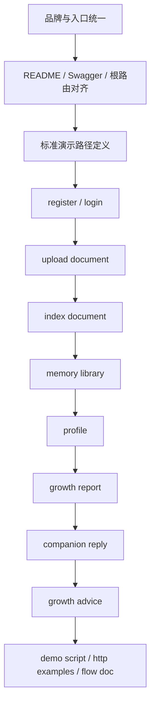
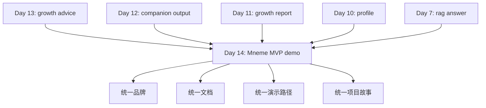

# Day 14：Mneme MVP 最终收束与统一演示

## 今天的总目标

- 不再新增一条独立的大能力
- 把 Day 1 到 Day 13 已经做出来的东西，收成一个真正能讲清楚的 `Mneme` MVP
- 让品牌名、入口文案、接口视角、README、流程图、调试脚本，第一次真正统一

## 今天结束前，你必须拿到什么

- `conf/config.py`
- `main.py`
- `README.md`
- `docs/flow.md`
- `test_main.http`
- `scripts/day14_demo.py`
- 一套你能自己复述的“register/login -> upload -> index -> memory -> profile -> growth -> companion -> advice”完整产品故事

---

## Day 14 一图总览

如果把 Day 14 压缩成一句话，它做的就是：

> 不再让 `Mneme` 看起来像一堆已经完成的接口，而是让它第一次长成一个有名字、有闭环、有演示路径的产品原型。

今天的主链路可以先背成这样：

```text
统一项目品牌与入口
-> 明确标准演示路径
-> 把 README / flow / http examples 对齐
-> 跑通一次从输入内容到输出建议的完整链路
-> 让 Mneme 具备“别人拿到仓库就知道它是什么”的状态
```

你今天要特别清楚：

- Day 13 的重点是“开始帮助你”
- Day 14 的重点是“把这套帮助能力收成一个完整的 Mneme MVP”

---

## 为什么 Day 14 必须做最终收束

到 Day 13 为止，你已经有了：

- 文档接入
- 索引建立
- RAG 回答
- 记忆库组织
- 个人画像
- 阶段成长分析
- 陪伴式回答
- 行动建议

但如果今天不做最终收束，项目仍然容易给人一种感觉：

- 功能很多
- 但故事分散
- 接口能看懂一部分
- 可整体演示的主线还不够明确

现在仓库里最需要补上的，不是新的分析能力，而是下面这件事：

> 让任何一个第一次接触仓库的人，都能在 5 分钟内看明白 `Mneme` 是什么、它的完整闭环是什么、最值得演示的路径是什么。

尤其你现在已经能看到几个明显信号：

- `README.md` 更偏产品愿景，运行与调用说明还不完整
- `docs/flow.md` 还停留在早期上传 -> 检索 -> 回答的链路
- `test_main.http` 还没有覆盖真正的核心接口
- 配置里的项目名和根路由文案，还没有完全统一到 `Mneme`

所以 Day 14 的一句话重构目标就是：

> 不再继续横向铺功能，而是把已有能力纵向收成一个可展示、可讲解、可交接的 Mneme MVP。

---

## Day 14 整体架构



### 你要怎么理解这张图

## 第 1 层：品牌与入口层

这一层负责：

- 把项目名字、描述、欢迎文案、README 开头统一起来
- 让系统从“Agentic RAG Assistant”真正切到 `Mneme`

今天这一步很重要，  
因为 Day 14 是这个项目第一次从“工程集合”走向“产品原型”。

## 第 2 层：标准演示路径层

这一层负责：

- 决定以后你讲项目时，默认讲哪一条路径
- 决定 README、`test_main.http`、调试脚本是不是同一套顺序

白话理解：

- 没有标准演示路径，就会每次临场现编
- 一旦现编，项目故事就容易散

## 第 3 层：资料统一层

这一层负责：

- `README.md` 说清楚项目定位、启动方式、接口主线
- `docs/flow.md` 展示最新链路，而不是停在早期 RAG
- `test_main.http` 覆盖真正要演示的接口
- `scripts/day14_demo.py` 给出一条最顺手的串联脚本

今天的重点不是“资料多”，  
而是“所有资料都围绕同一条主线”。

## 第 4 层：演示闭环层

这一层负责：

- 让你能真正做一次完整演示
- 让别人看到：这不是普通问答项目，而是一个“记忆 -> 理解 -> 建议”的闭环系统

---

## Day 13 到 Day 14 的交接图



这张图你要记住：

- Day 13 让系统开始给下一步建议
- Day 14 才让这整条链路变成真正可展示的 `Mneme` MVP

---

## 今天的边界要讲透

## 第 1 层：Day 14 不是再加一个新接口

今天最容易误判的地方是：

- 想再补一个“最终总览接口”
- 想再加一个“更高级”的分析模块
- 想再扩一层前端展示

这些都不是今天的第一优先级。

今天真正的重点是：

- 收束
- 统一
- 演示
- 讲清楚

## 第 2 层：Day 14 一定要面向“第一次看仓库的人”

今天你不能只站在“我自己已经知道这个项目怎么跑”的角度。

你必须站在下面这类人角度去写：

- 面试官
- 协作者
- 第一次打开仓库的朋友
- 两周后的你自己

如果他们不能快速看明白：

- 这是个什么项目
- 怎么启动
- 怎么走完整链路

那 Day 14 其实还没有完成。

## 第 3 层：今天要统一的是“标准主线”，不是覆盖所有分支

你不需要把所有接口都做成超长演示。

今天只要牢牢抓住一条最标准的主线：

- 用户注册或登录
- 进入默认知识库
- 上传并索引内容
- 从记忆库走到画像和成长分析
- 从画像和成长分析走到陪伴回答和成长建议

只要这条主线清楚，MVP 就立住了。

## 第 4 层：文档必须忠于真实代码，而不是理想中的未来版本

今天非常忌讳的一件事是：

- README 写得很好看
- 但接口例子跑不通
- 流程图画得很完整
- 但仓库里其实没有对应能力

所以 Day 14 的资料必须做到：

- 写你已经有的
- 标出你还没有的
- 不要假装所有愿景都已经实现

## 第 5 层：今天要把“Mneme”这个名字真正落下去

前面几天你已经把产品气质慢慢做出来了，  
但 Day 14 才是品牌真正落地的一天。

今天至少要统一下面几类地方：

- `PROJECT_NAME`
- `DESCRIPTION`
- 根路由欢迎语
- README 标题和开头
- 流程图里的命名口径

只有这些统一了，  
这个项目才不再只是“一个 agentic rag 仓库”，  
而是一个真正叫 `Mneme` 的产品原型。

---

## 上午学习：09:00 - 12:00

## 09:00 - 09:50：先把 Day 14 的收束主线讲顺

今天早上第一件事不是写文档，  
而是先把下面这条话讲顺：

```text
Mneme 不是普通上传文件问答
而是个人内容进入系统后
逐步沉淀为记忆库
再进一步形成画像、阶段理解和建议
```

这 50 分钟你要完成的是：

- 用一句话讲清项目定位
- 用一条链路讲清完整主线
- 用一句话讲清它为什么和普通 RAG 不一样

如果这三句话不顺，  
后面写 README 就很容易散。

## 09:50 - 10:40：冻结 Day 14 的 MVP 展示范围

这 50 分钟你要先克制住扩展冲动。

今天建议冻结的 MVP 范围是：

- 认证
- 知识库
- 文档上传与索引
- 记忆库
- 画像
- 成长分析
- 陪伴式回答
- 成长建议

今天不建议继续扩的东西包括：

- 新数据模型
- 新的大 Prompt 能力
- 前端页面工程
- 更复杂的会话系统

记住一句话：

> Day 14 的价值，不在于“又做了什么”，而在于“终于把已经做出来的东西讲清楚了”。

## 10:40 - 11:30：设计标准演示顺序

这 50 分钟你要先决定以后所有演示都按什么顺序走。

推荐顺序：

1. `POST /auth/register`
2. `POST /auth/login`
3. `GET /auth/me`
4. `POST /kb/documents/upload`
5. `POST /kb/documents/{document_id}/index`
6. `GET /memory/knowledge-bases/{knowledge_base_id}/library`
7. `GET /profile/knowledge-bases/{knowledge_base_id}`
8. `GET /analysis/knowledge-bases/{knowledge_base_id}/growth`
9. `POST /companion/knowledge-bases/{knowledge_base_id}/reply`
10. `POST /advice/knowledge-bases/{knowledge_base_id}`

你后面写的：

- README
- `test_main.http`
- `scripts/day14_demo.py`

最好都围绕这条顺序。

## 11:30 - 12:00：先决定今天怎么验收

今天中午前就要把验收标准写死，  
不要等晚上才回头补。

Day 14 的验收重点不是“模型答得多漂亮”，  
而是：

- 项目名统一了没有
- 文档能看懂没有
- 演示路径顺不顺
- 主要接口有没有被清楚组织出来

---

## 下午编码：14:00 - 18:00

## 14:00 - 14:40：统一项目品牌与入口文案

这一段建议优先看：

- `conf/config.py`
- `main.py`

你要重点处理的是：

- 把项目标题切到 `Mneme`
- 把描述改成更贴近“记忆与成长平台”
- 把根路由欢迎语从早期开发口径统一成当前品牌口径

今天这一步很小，  
但它会明显改变仓库的第一印象。

## 14:40 - 15:20：补 README 的“能用”部分

这一段重点改：

- `README.md`

README 现在的长处是：

- 产品愿景很顺
- 项目定位很清楚

README 现在最需要补的是：

- 环境准备
- 启动方式
- 关键配置说明
- 核心接口清单
- 一条完整演示路径

今天 README 不要只写“为什么值得做”，  
还要让别人知道“怎么把它跑起来”。

## 15:20 - 16:00：更新 `docs/flow.md`

这一步建议把早期的上传 -> 问答链路，  
升级成更完整的最新版主线：

```text
上传内容
-> 索引建立
-> 记忆库组织
-> 画像生成
-> 阶段分析
-> 陪伴输出
-> 成长建议
```

同时建议补两张图里的至少一张：

- 工程数据流图
- 用户价值闭环图

## 16:00 - 16:40：扩展 `test_main.http`

目前这个文件只覆盖了：

- 根路由
- hello

这显然不够支撑 Day 14。

今天建议补到至少包含：

- 注册
- 登录
- 获取当前用户
- 上传
- 建立索引
- 查看 memory library
- 查看 profile
- 查看 growth report
- 生成 companion reply
- 生成 growth advice

这样你以后的调试成本会明显下降。

## 16:40 - 17:20：写 `scripts/day14_demo.py`

今天最好补一个真正服务于演示的脚本，  
它不一定替代 HTTP 调试，  
但它能让你快速复现核心链路。

这个脚本建议承担的职责是：

- 明确演示顺序
- 固定示例输入
- 打印关键输出字段
- 帮你排练项目讲解顺序

Day 14 的 demo script 不追求万能，  
只追求“最顺手地讲完整个项目”。

## 17:20 - 18:00：做一次统一口径校对

最后 40 分钟不要急着再加东西，  
而是做一次统一校对：

- `Mneme` 这个名字是否前后一致
- 流程图和 README 的主线是否一致
- HTTP 示例和脚本是否一致
- 路由命名和文档描述是否一致

这一步看似细碎，  
但它会直接决定这个项目是否有“完成感”。

---

## 晚上复盘：20:00 - 21:00

今晚你必须自己讲顺的 10 个点：

1. 为什么 Day 14 不是继续做新功能？
2. 为什么一个项目做到了 Day 13 还必须做 Day 14 的最终收束？
3. `Mneme` 和普通问答型 RAG 的核心区别到底是什么？
4. 为什么 Day 14 一定要先定义“标准演示路径”？
5. README 为什么不能只写愿景，不写运行方式？
6. 为什么流程图也必须同步升级，而不是一直保留早期版本？
7. 为什么 `test_main.http` 是 Day 14 很关键的交付物？
8. 为什么品牌统一会影响整个项目的第一印象？
9. Day 14 和 Day 15 的边界到底是什么？
10. 为什么 Day 14 做完之后，这个项目才第一次真正像一个 Mneme MVP？

---

## 今日验收标准

- 项目名、描述、欢迎语基本统一到 `Mneme`
- `README.md` 补齐基础运行说明和核心接口主线
- `docs/flow.md` 升级为最新链路
- `test_main.http` 覆盖核心演示接口
- 有一个 `scripts/day14_demo.py` 或等价的最小演示脚本
- 能讲清楚从内容输入到成长建议输出的完整闭环
- 能让第一次看仓库的人在较短时间内理解项目定位

---

## 今天最容易踩的坑

### 坑 1：忍不住继续加功能

问题：

- 时间会被新的实现吞掉
- 最终收束反而做不完

规避建议：

- 今天只允许做“统一、补文档、补演示、补入口口径”

### 坑 2：README 写得好看，但例子跑不通

问题：

- 展示感很好
- 可信度很差

规避建议：

- README 里的关键路径一定和真实接口保持一致

### 坑 3：流程图还是早期链路

问题：

- 项目已经变了
- 图却还在讲 Day 7 以前的故事

规避建议：

- 今天必须把 `memory -> profile -> growth -> companion -> advice` 带进流程图

### 坑 4：演示路径每次都临场改

问题：

- 讲解不稳定
- 别人也难以复现

规避建议：

- 今天就把“标准演示顺序”固定下来

### 坑 5：品牌口径前后不一致

问题：

- README 叫 `Mneme`
- 配置还叫 `Agentic RAG Assistant`
- 根路由欢迎语还是早期表达

规避建议：

- 今天至少统一项目名、描述和欢迎语

---

## 给明天的交接提示

明天你会进入最终验收层：

- 不只是讲得顺
- 还要跑得稳
- 不只是看起来完整
- 还要真正完成一次全链路自测与缺口修补

所以 Day 14 的意义是：

> 先把 14 天的能力收成一个真正叫 `Mneme` 的最小可演示版本。

只有 Day 14 先把故事、资料和入口统一住，  
Day 15 的最终验收与完美收官才有真正的落点。
