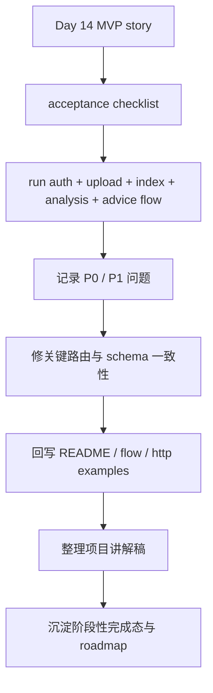
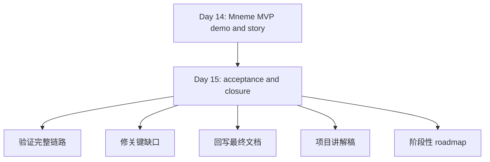

# Day 15：最终验收、缺口修补与完美收官

## 今天的总目标

- 不再继续横向加新能力
- 站在“真实交付”和“真实演示”视角，把 Mneme 做一次完整验收
- 修掉会影响演示、可信度和完整性的关键问题
- 给这个阶段留下一个能交付、能讲解、能继续迭代的清晰句号

## 今天结束前，你必须拿到什么

- `test_main.http`
- `README.md`
- `docs/flow.md`
- `scripts/day15_acceptance.py`
- 需要时补到的关键修复文件：
  - `routers/advice.py`
  - `routers/companion.py`
  - `routers/profile.py`
  - `routers/analysis.py`
  - `schemas/advice.py`
  - `schemas/companion.py`
- 一套你能自己复述的“项目验收清单 + 1 分钟项目讲解稿 + 下一阶段 roadmap”闭环

---

## Day 15 一图总览

如果把 Day 15 压缩成一句话，它做的就是：

> 用一次严肃的自测、一次必要的修补、一次清晰的表达，把 `Mneme` 从“已经完成的 MVP”收成“真正能结束第一阶段”的项目版本。

今天的主链路可以先背成这样：

```text
按标准演示路径做全链路自测
-> 记录阻塞问题和不一致问题
-> 只修真正影响验收的关键缺口
-> 回写 README / flow / http examples
-> 提炼最终讲解稿与下一阶段 roadmap
```

你今天要特别清楚：

- Day 14 的重点是“统一故事和演示”
- Day 15 的重点是“证明这个故事真的跑得通，并把第一阶段好好收住”

---

## 为什么 Day 15 仍然非常有必要

很多项目做到 Day 14 就会停，  
因为它已经：

- 看起来像产品
- 文档也差不多有了
- 功能链路也已经连起来了

但真正的危险，往往就在这里。

如果没有 Day 15，这个项目很可能会留下下面几类问题：

- 演示主线在文档里能讲通，真实接口却有不一致
- 部分请求体、路径参数、认证边界没有完全校对
- README 写了，但没有基于真实结果回写
- 项目已经“完成”，但没人能说清楚它到底完成到什么程度

所以 Day 15 不是多出来的一天，  
它是在回答一个更现实的问题：

> 当你说“这个项目阶段性完成了”的时候，你到底是基于什么证据在说这句话？

Day 15 的一句话目标就是：

> 让 `Mneme` 的完成，不只是情绪上的完成，而是一次有清单、有证据、有修补、有对外表达的完成。

---

## Day 15 整体架构



### 你要怎么理解这张图

## 第 1 层：验收层

这一层负责：

- 按真实用户路径验证接口
- 明确哪些链路已经可用
- 明确哪些问题会直接破坏演示

今天最重要的不是“感觉差不多”，  
而是“有一张验收清单，有一条真实走过的链路”。

## 第 2 层：关键修补层

这一层负责：

- 只修真正影响完整闭环的关键问题
- 统一请求体、路径参数、认证边界、返回结构这些最容易出错的地方

Day 15 不适合做无止境重构，  
它更适合做“最后一轮高价值修补”。

## 第 3 层：文档回写层

这一层负责：

- 把自测后的真实结果回写进 README
- 把流程图和 HTTP 示例更新到最终状态
- 保证资料和代码不再打架

## 第 4 层：对外表达层

这一层负责：

- 提炼 1 分钟项目讲解稿
- 提炼 3 条可用于简历或答辩的项目表达
- 明确下一阶段 roadmap，而不是假装项目已经“全做完了”

这一步不是包装，  
而是在帮你沉淀真正的交付意识。

---

## Day 14 到 Day 15 的交接图



这张图你要记住：

- Day 14 解决“看起来已经是一个完整项目”
- Day 15 解决“它真的可以作为第一阶段成品交付”

---

## 今天的边界要讲透

## 第 1 层：Day 15 不是 Day 16 的开端

今天很容易发生的事情是：

- 验收时又想到新功能
- 修 bug 时顺手想重构一大片
- 文档补完后又想开第二阶段

这些都很正常，  
但今天必须克制。

Day 15 的任务不是继续扩张，  
而是收官。

## 第 2 层：只修影响验收的关键缺口

今天不要求你把所有代码都磨到完美。

今天最值得修的是：

- 真实跑不通的接口
- 请求体和路径参数不一致的问题
- 认证和知识库归属校验不一致的问题
- README 和真实行为不一致的问题

今天不值得陷进去的，是：

- 风格洁癖式重构
- 与当前闭环无关的代码美化
- 低优先级枝节问题

## 第 3 层：验收一定要按真实用户路径，而不是按模块碎测

今天不能只做下面这种验证：

- 单独测一个 builder
- 单独测一个 prompt
- 单独看一个 schema

这些当然有价值，  
但 Day 15 必须至少走通一次完整链路：

- 注册或登录
- 上传并索引
- 查看记忆库
- 生成画像
- 生成成长分析
- 生成陪伴回答
- 生成行动建议

只有这样，  
你才能真正知道项目是不是闭环了。

## 第 4 层：最终文档必须诚实

今天的文档一定要诚实面对两件事：

- 已经完成了什么
- 还没有完成什么

如果今天为了“好看”而夸大完成度，  
那这个句号其实是不稳的。

所以 Day 15 的最终资料里，  
最好明确保留：

- 当前版本能力边界
- 已知限制
- 下一阶段计划

## 第 5 层：完美的句号，不是“没有缺点”，而是“边界清楚、状态清楚”

这个项目不一定在 Day 15 之后就彻底停止，  
但 Day 15 至少要做到：

- 当前版本能稳定讲清楚
- 当前版本的主链路能被证明
- 当前版本的缺口被标注清楚

这就已经是一个很成熟的收尾了。

---

## 上午学习：09:00 - 12:00

## 09:00 - 09:50：先写 Day 15 验收矩阵

今天最先要做的不是点接口，  
而是先写出验收矩阵。

建议至少列这几块：

1. 认证
2. 知识库与文档接入
3. 索引建立
4. 记忆库组织
5. 画像
6. 成长分析
7. 陪伴式回答
8. 成长建议
9. README 与流程图
10. 演示路径可复现性

有了矩阵，  
你今天就不会乱修。

## 09:50 - 10:40：先判断哪些问题是 P0，哪些只是 P1

这 50 分钟建议给问题分级：

- P0：直接导致主链路跑不通
- P1：能跑但明显不一致
- P2：体验优化项

Day 15 重点只盯：

- P0
- 部分 P1

千万不要让 P2 把今天拖垮。

## 10:40 - 11:30：重新讲一遍“项目到底完成到哪一步”

今天这 50 分钟非常重要。

你要重新回答：

- 这个项目当前最核心的价值是什么
- 当前版本最强的一条链路是什么
- 当前版本最明确的边界是什么

这一步做完，  
你晚上的讲解稿才不会虚。

## 11:30 - 12:00：提前写下最终完成标准

今天中午前就把最终完成标准写下来：

- 哪些接口必须实测成功
- 哪些文档必须同步完成
- 哪些限制必须明确写出

如果这一步拖到晚上，  
就很容易出现“觉得差不多了就收工”的模糊状态。

---

## 下午编码：14:00 - 18:00

## 14:00 - 14:40：按标准主线做一次完整自测

这一段建议重点跑：

- `test_main.http`
- `scripts/day14_demo.py`

如果你愿意，  
今天还可以补一个：

- `scripts/day15_acceptance.py`

它的职责不是替代所有测试，  
而是服务于“第一阶段最终验收”。

## 14:40 - 15:20：修关键的一致性问题

这一步建议优先看：

- `routers/advice.py`
- `routers/companion.py`
- `routers/profile.py`
- `routers/analysis.py`
- `schemas/advice.py`
- `schemas/companion.py`

今天最值得修的，是这一类问题：

- path 参数和 body 字段职责不清
- 新接口与旧接口的认证方式不一致
- knowledge base 归属校验口径不一致
- response 字段和 README 示例不一致

记住一句话：

> Day 15 修的是“验收阻塞点”，不是“所有想改的地方”。

## 15:20 - 16:00：把自测结果回写到 README 和 flow

这一步建议处理：

- `README.md`
- `docs/flow.md`
- `test_main.http`

回写时一定优先相信：

- 今天真实跑出来的结果

而不是：

- 昨天记忆里的版本

只有回写之后，  
资料才真正进入最终状态。

## 16:00 - 16:40：补 `scripts/day15_acceptance.py`

这个脚本建议非常克制，  
只做下面几件事：

- 顺序打印核心检查项
- 输出关键接口或 builder 的核心字段
- 帮你快速验证“项目现在是不是处于可演示状态”

它的定位不是单元测试框架，  
而是“收官验收脚本”。

## 16:40 - 17:20：写 1 分钟项目讲解稿和 3 条项目表达

Day 15 不应该只停留在代码层。

今天建议你沉淀出下面两类内容：

- 1 分钟项目讲解稿
- 3 条简历或答辩可用的项目表述

这一步可以写在：

- `README.md`
- 或单独放进 `target/` 下的总结文档

重点不是包装辞藻，  
而是把项目价值压缩到最有力的表达。

## 17:20 - 18:00：留下阶段性 roadmap 和最终句号

最后 40 分钟建议补一小段非常重要的内容：

- 当前版本已经完成什么
- 下一阶段如果继续做，最值得做什么

推荐下一阶段只保留少量方向：

- 接口一致性继续打磨
- 自动化测试
- 异步索引或任务队列
- 前端展示层
- 部署与容器化

这一步会让 Day 15 的结束更成熟，  
因为它不是戛然而止，  
而是阶段性完成。

---

## 晚上复盘：20:00 - 21:00

今晚你必须自己讲顺的 10 个点：

1. 为什么 Day 15 不是多余的一天？
2. 为什么项目“看起来完成”不等于“真的完成”？
3. 什么样的问题应该被列为 Day 15 的 P0？
4. 为什么最终验收必须按真实用户路径进行？
5. 为什么 Day 15 不适合做大面积重构？
6. 为什么 README 必须根据真实自测结果回写？
7. 当前版本的 `Mneme` 最值得讲的闭环是什么？
8. 当前版本最应该诚实承认的限制是什么？
9. 如果要给这个项目写 1 分钟讲解稿，最核心的三句话是什么？
10. 为什么“边界清楚、状态清楚”比“假装已经完美”更重要？

---

## 今日验收标准

- 标准演示路径至少完整跑通一次
- `test_main.http` 覆盖核心链路且可用于复现
- 关键路由与 schema 的边界基本一致
- README 与真实接口行为基本一致
- `docs/flow.md` 与最终主线一致
- 有一个 `scripts/day15_acceptance.py` 或等价的收官验收脚本
- 能用 1 分钟讲清项目定位、核心链路和价值
- 能明确说明当前版本边界与下一阶段方向

---

## 今天最容易踩的坑

### 坑 1：一验收就想重构一切

问题：

- 本来是收尾
- 最后变成新一轮重构

规避建议：

- 只修 P0 和关键 P1

### 坑 2：只测 happy path，不测真实闭环

问题：

- 看起来都能用
- 一串起来就断

规避建议：

- 至少走一遍完整主线，不要只测单点

### 坑 3：文档没有跟着修复同步更新

问题：

- 代码已经变了
- 文档还停在旧版本

规避建议：

- 今天每修一个关键点，就同步考虑 README / HTTP 示例是否要回写

### 坑 4：为了“完美收官”而过度包装

问题：

- 讲得很满
- 实际边界不清

规避建议：

- 明确写出当前限制和下一阶段计划

### 坑 5：结束时没有留下明确完成态

问题：

- 做了很多事
- 但说不清到底完成了什么

规避建议：

- 最后一定沉淀：完成清单、讲解稿、roadmap

---

## 给这一阶段的结束语

Day 15 结束时，你要能坦然地说：

```text
Mneme 第一阶段已经完成：
它已经能把个人内容接入系统
沉淀为记忆库
进一步形成画像和阶段理解
并输出陪伴式回答与成长建议
```

同时你也要能诚实地补上后半句：

```text
下一阶段最值得继续做的
是自动化测试、接口一致性打磨、异步任务和展示层建设
```

所以 Day 15 的意义不是“从此再也不动这个项目”，  
而是：

> 给第一阶段一个足够清晰、足够诚实、也足够漂亮的句号。
