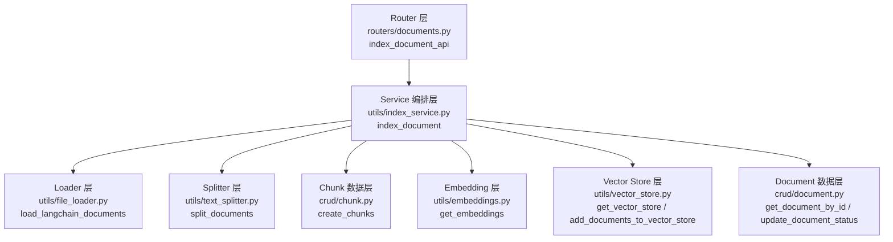
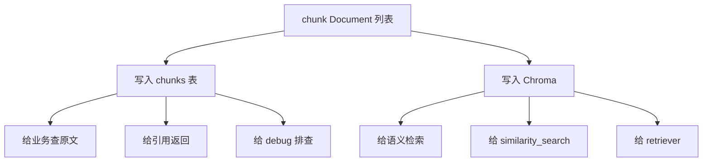
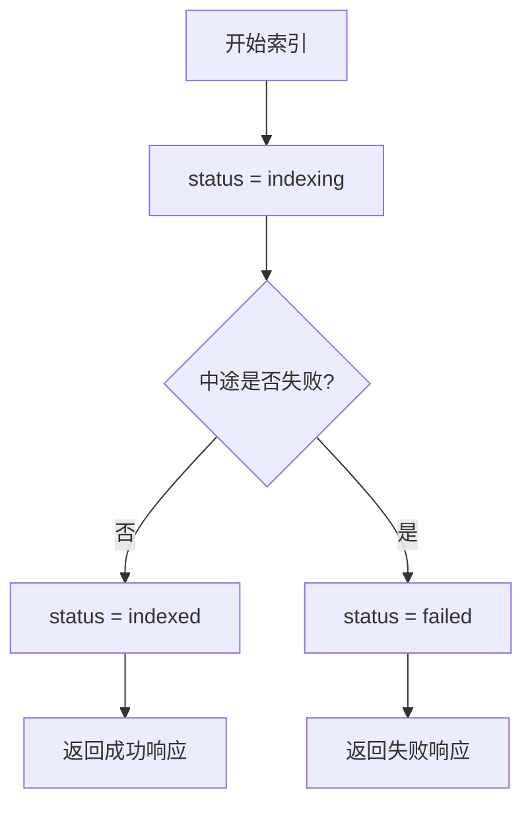

# Day 5：Embedding 和向量入库

## 今天的总目标

- 接入 embedding 模块
- 建立最小可用的向量存储
- 实现 `POST /kb/documents/{document_id}/index`
- 让系统能够确认 chunk 数量和索引状态

## 今天结束前，你必须拿到什么

- `utils/embeddings.py`
- `utils/vector_store.py`
- `utils/index_service.py`
- `POST /kb/documents/{document_id}/index`
- 一套你能自己复述的“embedding -> vector store -> retriever”理解框架

---

## Day 5 一图总览

如果把 Day 5 压缩成一句话，它做的就是：

> 把 Day 3 上传进来的文件、Day 4 切出来的文本块，真正变成“可检索的向量知识库”。

你今天做的事情虽然看起来多，但本质上可以浓缩成这条主链路：

```text
find document
-> load file
-> split text
-> save chunks
-> embed chunks
-> store vectors
-> update status
```

也就是你说的这种思路：

- `load`
- `split`
- `save`
- `embed`
- `store`
- `update`

如果再翻译成更工程化的说法，就是：

- 路由层收请求
- 编排层串流程
- 基础能力层做具体工作
- 数据层和向量层分别落库

---

## Day 5 整体架构

### 先看最粗粒度的三层结构



### 你要怎么理解这三层

#### 第 1 层：Router 层

只负责：

- 接收 HTTP 请求
- 校验最基本参数
- 决定是否调用索引流程
- 返回响应

不负责：

- 真正读文件
- 真正切文本
- 真正写向量库

白话理解：

Router 像前台接待，不像后厨。

#### 第 2 层：Service 编排层

只负责：

- 按固定顺序把各个步骤串起来

比如：

- 先更新状态为 `indexing`
- 再读文件
- 再切 chunk
- 再写 chunks 表
- 再写向量库
- 最后更新为 `indexed`

白话理解：

`utils/index_service.py` 就像总调度台。

#### 第 3 层：能力层 / 数据层

这些文件各自只做一件事：

- `utils/file_loader.py`
  - 负责读文件
- `utils/text_splitter.py`
  - 负责切 chunk
- `crud/chunk.py`
  - 负责写 chunk 表
- `utils/embeddings.py`
  - 负责提供 embedding 模型
- `utils/vector_store.py`
  - 负责向量库接入
- `crud/document.py`
  - 负责查文档、改状态

这层的关键词是：

> 各干各的，不互相越界

---

## Day 5 主链路流程图

### 先看高层版

```mermaid
flowchart LR
    A[POST /kb/documents/{document_id}/index] --> B[查 documents 表]
    B --> C[load 文件正文]
    C --> D[split 切分 chunk]
    D --> E[写 chunks 表]
    E --> F[生成 embedding]
    F --> G[写入 Chroma]
    G --> H[更新 documents.status = indexed]
    H --> I[返回 chunk_count]
```

这张图对应的主线非常简单：

- `load`
- `split`
- `save chunk`
- `embed`
- `store vector`
- `update status`

你现在可以把 Day 5 先看成是：

> 从“文件存在”走到“文件可检索”

---

## Day 5 详细流程图

### 这一版把函数也标出来

```mermaid
flowchart TD
    A[客户端调用\nPOST /kb/documents/{document_id}/index] --> B[index_document_api\nrouters/documents.py]
    B --> C[get_document_by_id\ncrud/document.py]
    C --> D{文档存在吗?}
    D -- 否 --> E[抛 404 业务异常]
    D -- 是 --> F{状态允许索引吗?}
    F -- 否 --> G[返回重复索引/处理中提示]
    F -- 是 --> H[index_document\nutils/index_service.py]

    H --> I[update_document_status('indexing')\ncrud/document.py]
    H --> J[load_langchain_documents\nutils/file_loader.py]
    J --> K[得到 LangChain Document 列表]
    H --> L[split_documents\nutils/text_splitter.py]
    L --> M[得到 chunk Document 列表]
    H --> N[create_chunks\ncrud/chunk.py]
    N --> O[chunks 表落库]
    H --> P[add_documents_to_vector_store\nutils/vector_store.py]
    P --> Q[get_vector_store\nutils/vector_store.py]
    Q --> R[get_embeddings\nutils/embeddings.py]
    R --> S[embedding 模型把 chunk 变向量]
    S --> T[Chroma collection 落库]
    H --> U[update_document_status('indexed')\ncrud/document.py]
    U --> V[返回 document_id / chunk_count / status]
    V --> W[success_response\n返回给客户端]
```

---

## 每个函数在整个流程里到底干什么

### 入口函数

- 文件：[documents.py](/e:/python_files/agentic_rag/routers/documents.py)
- 函数：`index_document_api`
- 作用：
  - 收到索引请求
  - 查文档是否存在
  - 判断能不能开始索引
  - 调用 `index_document`
  - 把结果包装成 API 响应

### 流程总控函数

- 文件：[index_service.py](/e:/python_files/agentic_rag/utils/index_service.py)
- 函数：`index_document`
- 作用：
  - 这是 Day 5 最核心的函数
  - 它不直接实现所有细节
  - 它只是按顺序“调度别人干活”

你可以把它记成：

```text
index_document
-> update indexing
-> load
-> split
-> save chunks
-> add vector store
-> update indexed
```

### 文件读取函数

- 文件：[file_loader.py](/e:/python_files/agentic_rag/utils/file_loader.py)
- 函数：`load_langchain_documents`
- 作用：
  - 根据 `file_type` 选 loader
  - 读取原始文件
  - 变成 LangChain `Document`
  - 给 `metadata` 补上业务字段

### 文本切分函数

- 文件：[text_splitter.py](/e:/python_files/agentic_rag/utils/text_splitter.py)
- 函数：`build_text_splitter`
- 作用：
  - 配置 chunk 大小
  - 配置 overlap
  - 配置中文分隔符

- 文件：[text_splitter.py](/e:/python_files/agentic_rag/utils/text_splitter.py)
- 函数：`split_documents`
- 作用：
  - 把 LangChain `Document` 切成 chunk
  - 给 chunk 补 `chunk_id`、`chunk_index`、`page_no`、`start_offset`

### chunk 数据落库函数

- 文件：[chunk.py](/e:/python_files/agentic_rag/crud/chunk.py)
- 函数：`create_chunks`
- 作用：
  - 把 chunk Document 变成 ORM `Chunk`
  - 写入 `chunks` 表

### embedding 提供函数

- 文件：[embeddings.py](/e:/python_files/agentic_rag/utils/embeddings.py)
- 函数：`get_embeddings`
- 作用：
  - 提供一个可复用的 embedding 模型实例

### 向量库函数

- 文件：[vector_store.py](/e:/python_files/agentic_rag/utils/vector_store.py)
- 函数：`get_vector_store`
- 作用：
  - 创建或获取 Chroma collection

- 文件：[vector_store.py](/e:/python_files/agentic_rag/utils/vector_store.py)
- 函数：`add_documents_to_vector_store`
- 作用：
  - 把 chunk 文本交给 Chroma
  - Chroma 再调用 embedding_function 生成向量并存储

### 文档状态函数

- 文件：[document.py](/e:/python_files/agentic_rag/crud/document.py)
- 函数：`get_document_by_id`
- 作用：
  - 查文档是否存在

- 文件：[document.py](/e:/python_files/agentic_rag/crud/document.py)
- 函数：`update_document_status`
- 作用：
  - 把文档状态改成 `indexing`、`indexed` 或 `failed`

---

## Day 5 的双轨存储图

### 这一张图专门解释“为什么要存两份”



这张图你一定要看懂。

同一份 chunk，会走两条轨道：

- 轨道 1：落到 `chunks` 表
- 轨道 2：落到向量库

它们不是重复建设，而是职责不同。

---

## Day 5 的异常分支图

### 这一张图帮你理解为什么要更新状态



这张图背后的核心思想是：

- `uploaded`
  - 只是上传完成
- `indexing`
  - 正在处理
- `indexed`
  - 真正可检索
- `failed`
  - 处理失败，等待重试或排查

这就是为什么 Day 5 不只是“接个 embedding”那么简单。  
它已经开始具备“像系统一样管理流程状态”的味道了。

---

## 你可以把 Day 5 背成这 5 句话

1. Day 5 的核心不是模型回答问题，而是把 chunk 变成可检索的向量。
2. `index_document_api` 是入口，`index_document` 是总调度。
3. `load` 和 `split` 负责把原始文件变成标准 chunk。
4. `chunks` 表和 Chroma 是两条并行存储轨道。
5. `indexed` 这个状态，代表文档已经从“上传完成”升级成“可检索完成”。

---

## 今天的 LangChain，要加倍详细地讲

## 第 1 层：先把 3 个角色彻底分开

RAG 初学者最容易把这 3 个东西混成一坨：

- embedding 模型
- 向量库
- retriever

今天你一定要分清。

### embedding 模型负责什么

- 它负责把文本变成数字向量

白话理解：

它像一个“语义翻译器”：

- 输入一句人类文字
- 输出一串机器更容易做相似度计算的数字

### 向量库负责什么

- 它负责保存这些向量
- 负责做相似度搜索

白话理解：

它像一个“语义仓库 + 近邻检索器”。

### retriever 负责什么

- 它站在应用层，对外提供“给我问题，我帮你找相关片段”的接口

白话理解：

它像一个“检索门面”：

- 底层可能是 Chroma、FAISS、PGVector
- 但对上层业务来说，统一都叫 retriever

今天你先背这三句话：

> embedding 负责“算向量”  
> vector store 负责“存向量 + 查相似”  
> retriever 负责“把检索这件事包装成更好用的接口”

---

## 第 2 层：今天的完整索引链路是什么

```text
查 documents 表
-> 拿到 file_path / file_type
-> loader 读文件
-> splitter 切 chunk
-> chunks 写入数据库
-> embedding 模型给 chunk 生成向量
-> Chroma 存储向量
-> documents.status 更新为 indexed
```

你现在要注意：

- “写 chunks 表”
- “写向量库”

这是两套存储，不是一套。

### 为什么要存两份

因为它们解决的问题不同：

- `chunks` 表
  - 方便查原文、做引用、做 debug
- 向量库
  - 方便做相似度检索

所以你后面要习惯这种双轨思维：

- 一条轨道存“人能读的内容和元信息”
- 一条轨道存“机器检索用的向量”

---

## 第 3 层：现代 LangChain 包怎么选

今天这个点你一定要看懂，不然后面一搜博客很容易被旧版本误导。

### 你今天推荐用的包

- `langchain-huggingface`
  - 放 HuggingFace embedding 集成
- `langchain-chroma`
  - 放 Chroma 向量库集成

### 为什么不继续写 `langchain_community.embeddings.HuggingFaceEmbeddings`

因为现在它已经逐步被独立集成包替代了。  
同理，OpenAI 那边也更推荐 `langchain_openai.OpenAIEmbeddings`。

这件事你不用背版本号，只要记住趋势：

> LangChain 正在把各类第三方集成，从“大杂烩社区包”往“独立集成包”迁移。

---

## 第 4 层：今天先选哪种 embedding 方案

### 主线方案

为了让你本地更容易练手，Day 5 建议主线先用：

- `langchain_huggingface.HuggingFaceEmbeddings`

它的好处是：

- 不一定强依赖远程 API
- 更适合本地先打通流程

### 你要知道的代价

- 首次下载模型可能比较慢
- CPU 环境下算 embedding 速度不一定快

### 备用方案

如果你后面更想走云 API 路线，也可以改成：

- `langchain_openai.OpenAIEmbeddings`

但 Day 5 先把“流程”学懂，比先纠结“哪家模型最好”更重要。

---

## 第 5 层：Chroma 到底在这里扮演什么角色

Chroma 是今天最适合你的原因很简单：

- 本地就能跑
- 接入门槛低
- 和 LangChain 对接方便

你今天先把它想成：

- 一个本地向量仓库
- 支持 collection
- 支持 add_documents
- 支持 similarity_search

### 今天你要记一个很实用的点

新版 Chroma 场景下，只要你设置了 `persist_directory`，  
一般就已经具备落盘能力了。

白话理解：

- 你重点是把 collection 名、落盘目录、embedding_function 接好
- 不要把精力花在老版本文章里那些历史写法上

---

## 第 6 层：为什么 Day 5 就做索引 API

因为到了今天，你已经具备了这几样东西：

- documents 表
- 文件上传
- loader
- splitter
- chunk metadata

现在正好把这些串成第一条“完整索引链路”。

这条链路一旦打通，RAG 项目的骨架就立起来了。

---

## 上午学习：09:00 - 12:00

## 09:00 - 09:50：彻底讲懂 embedding

### 你今天必须能回答

1. embedding 到底输出什么？
2. 为什么模型问答前要先做 embedding？
3. 为什么原始文本不能直接做高效语义检索？

### 大白话理解

embedding 不是“总结文本”，也不是“理解文本后写答案”。  
它只是把文本映射成一串向量。

你可以把它理解成：

- 原始文字：人类语言
- embedding 向量：机器做相似度比较的坐标

所以 embedding 阶段没有“回答问题”这件事。  
它只是在为后面的检索打地基。

---

## 09:50 - 10:40：彻底讲懂 vector store

### 你今天必须能说清

- vector store 不负责生成 embedding
- vector store 只负责保存和搜索

### 一个最容易出现的误解

很多人会说：

- “我把文本丢给 Chroma，让 Chroma 帮我转向量”

这句话从使用体验上不算全错，  
但从职责理解上不够准确。

更准确的说法是：

- 你把文本和 embedding 函数一起交给 Chroma
- Chroma 内部会调用 embedding 函数去算向量
- 真正负责“算”的，仍然是 embedding 模型

这个细节你一旦搞懂，后面换向量库、换 embedding 模型时，思路会非常清楚。

---

## 10:40 - 11:30：彻底讲懂索引 API 干了什么

`POST /kb/documents/{document_id}/index` 今天要做的事，不要背成黑盒。

它本质上只是把几个普通步骤串起来：

1. 根据 `document_id` 找文档
2. 检查文档是否存在
3. 检查状态是否允许索引
4. 读文件
5. 切 chunk
6. chunk 写数据库
7. chunk 写向量库
8. 更新状态
9. 返回 `chunk_count`

这就是典型的“工程化 RAG 索引流程”。

---

## 11:30 - 12:00：先接受一个现实限制

### Day 5 的最小实现，不追求“双写强一致”

你今天会发生两次写操作：

- 写数据库
- 写向量库

这两次写入严格来说不是天然强一致事务。  
也就是说，如果中间一步失败，理论上可能出现部分成功。

### 为什么今天先接受这个现实

因为 Day 5 目标是先跑通最小索引链路。  
后面 Day 11 做异步任务、Day 12 做日志异常处理时，再逐步增强一致性和补偿逻辑。

成熟工程师很重要的一点就是：

> 先知道问题在哪，再决定今天要不要解决到极致。

---

## 下午编码：14:00 - 18:00

## 14:00 - 14:30：先补依赖和配置

### 推荐安装

```powershell
pip install -U langchain-huggingface langchain-chroma chromadb sentence-transformers
```

### 推荐补到 `conf/config.py` 的配置

```python
EMBEDDING_MODEL_NAME = "sentence-transformers/all-mpnet-base-v2"
CHROMA_COLLECTION_NAME = "document_chunks"
CHROMA_PERSIST_DIR = STORAGE_DIR / "vector_store"
```

### 为什么今天就要把这些写进配置

因为 embedding 模型名、向量库目录、collection 名都属于“易变配置”。  
不要把它们散落在业务代码里。

---

## 14:30 - 15:10：实现 `utils/embeddings.py`

### `utils/embeddings.py` 练手骨架版

```python
from langchain_huggingface import HuggingFaceEmbeddings

from conf.config import settings


def get_embeddings() -> HuggingFaceEmbeddings:
    # 你要做的事：
    # 1. 返回一个 HuggingFaceEmbeddings 实例
    # 2. model_name 从 settings 里拿
    # 3. model_kwargs 先用 {"device": "cpu"}
    # 4. encode_kwargs 先打开 normalize_embeddings
    raise NotImplementedError("先自己实现 get_embeddings")
```

### `utils/embeddings.py` 参考答案

```python
from langchain_huggingface import HuggingFaceEmbeddings

from conf.config import settings


def get_embeddings() -> HuggingFaceEmbeddings:
    return HuggingFaceEmbeddings(
        model_name=settings.EMBEDDING_MODEL_NAME,
        model_kwargs={"device": "cpu"},
        encode_kwargs={"normalize_embeddings": True},
    )
```

### 这段代码你要看懂 3 个点

#### 点 1：为什么 `device` 先写 `cpu`

因为 Day 5 的重点是先跑通。  
等你后面确认环境支持，再切 GPU 也不迟。

#### 点 2：为什么要 `normalize_embeddings=True`

这是为了让后面向量相似度计算更稳定一些。  
你现在先把它理解成“让向量比较更规整”就够了。

#### 点 3：为什么把实例构造放到函数里

因为后面你可能会换：

- HuggingFace
- OpenAI
- 甚至本地别的 embedding 模型

统一从一个函数出口拿 embedding，对后续替换最友好。

---

## 15:10 - 15:50：实现 `utils/vector_store.py`

### `utils/vector_store.py` 练手骨架版

```python
from langchain_core.documents import Document as LCDocument
from langchain_chroma import Chroma

from conf.config import settings
from utils.embeddings import get_embeddings


def get_vector_store() -> Chroma:
    # 你要做的事：
    # 1. 返回一个 Chroma 实例
    # 2. collection_name 从 settings 里拿
    # 3. persist_directory 从 settings 里拿
    # 4. embedding_function 用 get_embeddings()
    raise NotImplementedError("先自己实现 get_vector_store")


def add_documents_to_vector_store(chunk_docs: list[LCDocument]) -> None:
    # 你要做的事：
    # 1. 先拿到 vector_store
    # 2. 从每个 chunk 的 metadata 里取出 chunk_id 作为 ids
    # 3. 调用 add_documents(documents=..., ids=...)
    # 4. 这里不用自己手动写 persist()
    raise NotImplementedError("先自己实现 add_documents_to_vector_store")
```

### `utils/vector_store.py` 参考答案

```python
from langchain_core.documents import Document as LCDocument
from langchain_chroma import Chroma

from conf.config import settings
from utils.embeddings import get_embeddings


def get_vector_store() -> Chroma:
    return Chroma(
        collection_name=settings.CHROMA_COLLECTION_NAME,
        embedding_function=get_embeddings(),
        persist_directory=str(settings.CHROMA_PERSIST_DIR),
    )


def add_documents_to_vector_store(chunk_docs: list[LCDocument]) -> None:
    vector_store = get_vector_store()
    ids = [chunk.metadata["chunk_id"] for chunk in chunk_docs]
    vector_store.add_documents(documents=chunk_docs, ids=ids)
```

### 这里最关键的理解

- `add_documents()` 看起来像“直接加文档”
- 但它背后会借助 embedding_function 把文档先变向量

所以你可以把这一步理解成：

> 业务层面传文档  
> 向量层面实际存向量

---

## 15:50 - 16:20：给 `crud/document.py` 补状态更新

### 为什么 Day 5 要补这个函数

因为索引流程里至少会有这些状态：

- `uploaded`
- `indexing`
- `indexed`
- `failed`

### `crud/document.py` 练手骨架版

```python
from sqlalchemy.ext.asyncio import AsyncSession


async def update_document_status(
    db: AsyncSession,
    *,
    document_id: str,
    status: str,
):
    # 你要做的事：
    # 1. 先查出 document
    # 2. 如果找不到，返回 None
    # 3. 找到后更新 status
    # 4. flush + refresh
    # 5. 返回更新后的 document
    raise NotImplementedError("先自己实现 update_document_status")
```

### `crud/document.py` 参考答案

```python
from sqlalchemy.ext.asyncio import AsyncSession


async def update_document_status(
    db: AsyncSession,
    *,
    document_id: str,
    status: str,
):
    document = await get_document_by_id(db, document_id)
    if document is None:
        return None

    document.status = status
    await db.flush()
    await db.refresh(document)
    return document
```

### 这一段背后的工程意识

不要在路由里到处手写：

- `document.status = ...`
- `await db.flush()`

把它收进 CRUD 函数里，后面会更整洁。

---

## 16:20 - 17:00：实现 `utils/index_service.py`

### 这个文件今天非常重要

它是 Day 5 最核心的“编排层”。  
你可以把它理解成：

- router 只负责收请求
- index_service 负责真正串整个索引流程

### `utils/index_service.py` 练手骨架版

```python
from sqlalchemy.ext.asyncio import AsyncSession

from crud.chunk import create_chunks
from crud.document import update_document_status
from models.document import Document
from utils.file_loader import load_langchain_documents
from utils.text_splitter import split_documents
from utils.vector_store import add_documents_to_vector_store


async def index_document(db: AsyncSession, document: Document) -> dict:
    # 你要做的事：
    # 1. 把 document.status 更新为 indexing
    # 2. 调 load_langchain_documents 读出正文
    # 3. 调 split_documents 切 chunk
    # 4. 调 create_chunks 写 chunks 表
    # 5. 调 add_documents_to_vector_store 写向量库
    # 6. 把 document.status 更新为 indexed
    # 7. 返回 document_id / chunk_count / status
    raise NotImplementedError("先自己实现 index_document")
```

### `utils/index_service.py` 参考答案

```python
from sqlalchemy.ext.asyncio import AsyncSession

from crud.chunk import create_chunks
from crud.document import update_document_status
from models.document import Document
from utils.file_loader import load_langchain_documents
from utils.text_splitter import split_documents
from utils.vector_store import add_documents_to_vector_store


async def index_document(db: AsyncSession, document: Document) -> dict:
    await update_document_status(db, document_id=document.id, status="indexing")

    loaded_docs = load_langchain_documents(
        file_path=document.file_path,
        file_type=document.file_type,
        document_id=document.id,
        file_name=document.file_name,
    )

    chunk_docs = split_documents(
        document_id=document.id,
        documents=loaded_docs,
    )

    await create_chunks(
        db,
        document_id=document.id,
        chunk_docs=chunk_docs,
    )

    add_documents_to_vector_store(chunk_docs)

    await update_document_status(db, document_id=document.id, status="indexed")

    return {
        "document_id": document.id,
        "chunk_count": len(chunk_docs),
        "status": "indexed",
    }
```

### 这里你一定要看懂

`index_service` 本质上不是“高级魔法”，只是把这几步串起来：

- load
- split
- save chunks
- add vector store
- update status

这就是 RAG 工程里的“编排层”。

---

## 17:00 - 18:00：补 schema 和 index API

### `schemas/document.py` 建议新增

```python
from pydantic import BaseModel


class DocumentIndexData(BaseModel):
    document_id: str
    chunk_count: int
    status: str
```

### `routers/documents.py` 练手骨架版

```python
from fastapi import APIRouter, Depends
from sqlalchemy.ext.asyncio import AsyncSession

from conf.database import get_database
from crud.document import get_document_by_id, update_document_status
from schemas.document import DocumentIndexData
from utils.exceptions import BusinessException
from utils.index_service import index_document
from utils.response import success_response

router = APIRouter(prefix="/kb/documents", tags=["documents"])


@router.post("/{document_id}/index")
async def index_document_api(
    document_id: str,
    db: AsyncSession = Depends(get_database),
):
    # 你要做的事：
    # 1. 根据 document_id 查文档
    # 2. 如果文档不存在，抛 404
    # 3. 如果文档已经是 indexed，可以选择直接返回或提示重复索引
    # 4. 调用 index_document(db, document)
    # 5. 如果索引出错，把状态改成 failed
    # 6. 返回 success_response(...)
    raise NotImplementedError("先自己实现 index_document_api")
```

### `routers/documents.py` 参考答案

```python
from fastapi import APIRouter, Depends
from sqlalchemy.ext.asyncio import AsyncSession

from conf.database import get_database
from crud.document import get_document_by_id, update_document_status
from schemas.document import DocumentIndexData
from utils.exceptions import BusinessException
from utils.index_service import index_document
from utils.response import success_response

router = APIRouter(prefix="/kb/documents", tags=["documents"])


@router.post("/{document_id}/index")
async def index_document_api(
    document_id: str,
    db: AsyncSession = Depends(get_database),
):
    document = await get_document_by_id(db, document_id)
    if document is None:
        raise BusinessException(message="文档不存在", code=4041, status_code=404)

    if document.status == "indexing":
        raise BusinessException(message="文档正在索引中，请稍后再试", code=4005)

    try:
        result = await index_document(db, document)
    except Exception as exc:
        await update_document_status(db, document_id=document_id, status="failed")
        await db.commit()
        raise BusinessException(message=f"建立索引失败：{exc}", code=5002, status_code=500)

    return success_response(
        data=DocumentIndexData(**result),
        message="index success",
    )
```

### 为什么失败时这里显式 `await db.commit()`

这是一个非常值得你学的工程细节。

因为你现在的 `get_database()` 依赖大致是：

- 成功时 commit
- 抛异常时 rollback

如果你在失败分支里：

- 先把状态改成 `failed`
- 然后马上抛异常

那依赖层很可能会把这个改动一起回滚掉。  
于是数据库里根本留不下 `failed`。

所以这里显式 `commit()` 是有意为之。  
它的意思是：

- 先把失败状态落盘
- 再把业务异常抛出去

这个细节非常工程化，你现在能看懂就很棒。

---

## 晚上复盘：20:00 - 21:00

### 今晚你必须自己讲顺的 10 个点

1. embedding、vector store、retriever 分别负责什么？
2. 为什么 vector store 不是 embedding 模型？
3. 为什么 Day 5 要同时存 chunks 表和向量库？
4. 为什么今天用 `langchain_huggingface` 而不是旧写法？
5. Chroma 在今天的角色到底是什么？
6. `POST /kb/documents/{document_id}/index` 本质上做了哪几步？
7. 为什么 `index_service` 应该单独抽文件？
8. 为什么状态更新要收进 CRUD？
9. 为什么失败分支里要显式 `commit()`？
10. Day 5 为什么先接受“双写不完全强一致”？

---

## 今日验收标准

- 能成功创建 embedding 实例
- 能把 chunk 写入 Chroma
- `POST /kb/documents/{document_id}/index` 可用
- 索引成功后能返回 `chunk_count`
- 文档状态能从 `uploaded` 变成 `indexed`
- 本地能看到向量库落盘目录

---

## 今天最容易踩的坑

### 坑 1：把 embedding 和向量库混为一谈

问题：

- 理解会一直糊涂
- 后面替换组件时会非常痛苦

规避建议：

- embedding 负责算
- vector store 负责存和查

### 坑 2：继续用旧版社区 embedding 写法

问题：

- 以后容易碰到弃用提示

规避建议：

- HuggingFace 走 `langchain_huggingface`
- OpenAI 走 `langchain_openai`

### 坑 3：向量库写进去了，但 chunk 表没写

问题：

- 后面做引用和 debug 很难

规避建议：

- 记住数据库 chunk 表和向量库是两条存储轨道

### 坑 4：把索引流程全堆在 router 里

问题：

- router 会变得巨大而混乱

规避建议：

- router 收请求
- service 串流程

### 坑 5：失败时状态没真正落盘

问题：

- 看起来代码写了 `failed`
- 实际数据库还是旧状态

规避建议：

- 理解依赖里的 rollback 机制
- 必要时显式 commit

---

## 给明天的交接提示

明天开始，你就会进入真正的“查得到”阶段：

- 基于向量库做检索
- 打印召回片段
- 先验证“找得准不准”

到那一步你会真正体会到：

- Day 4 切分是否合理
- Day 5 向量化是否顺畅

这就是为什么 Day 4 和 Day 5 一定要打牢。  
它们决定了后面 RAG 回答质量的下限。
