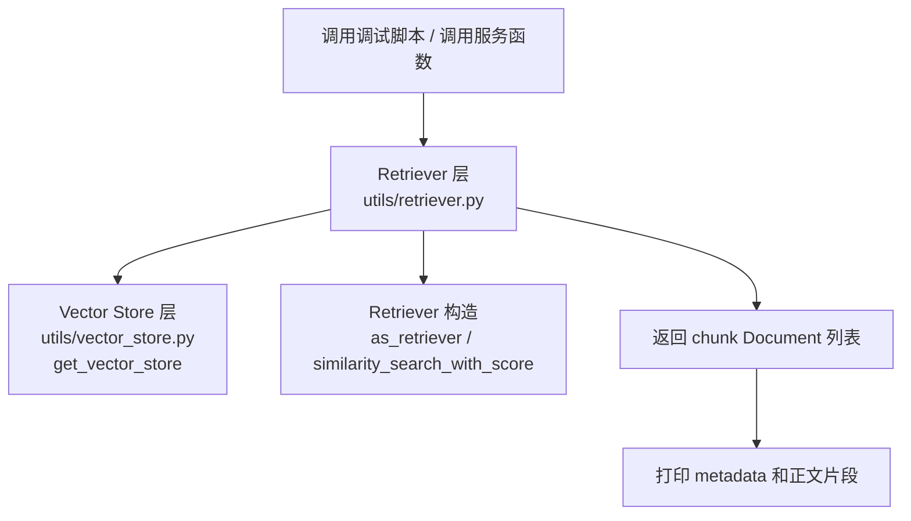
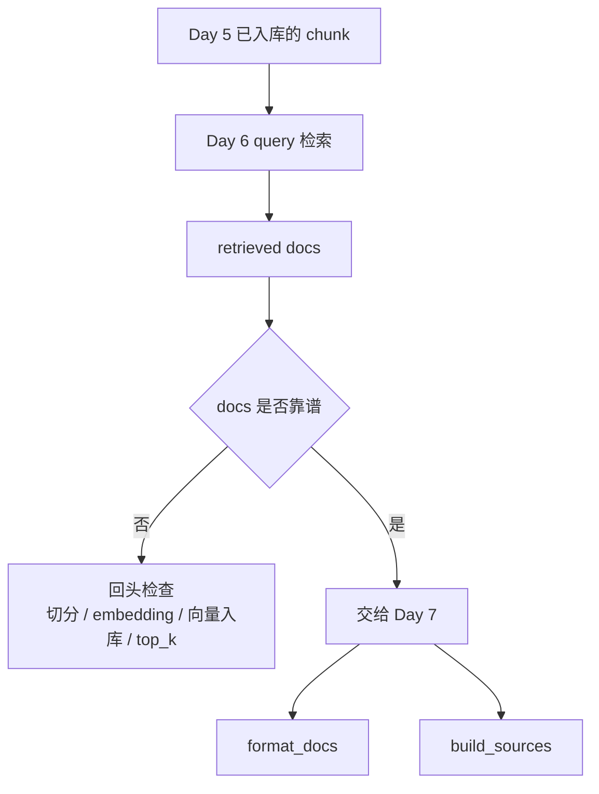

# Day 6：Retriever 检索能力

## 今天的总目标

- 把已经建好的向量库真正用起来
- 实现最小可用的 retriever
- 支持 `top_k`
- 能打印和检查检索片段

## 今天结束前，你必须拿到什么

- `utils/retriever.py`
- 一个能打印检索结果的调试脚本
- 一套你能自己复述的“vector store -> retriever -> retrieved docs”理解框架
- 一次针对真实问题的检索验证结果

---

## Day 6 一图总览

如果把 Day 6 压缩成一句话，它做的就是：

> 把 Day 5 存进向量库的 chunk，真正按用户问题查出来。

今天最核心的主链路非常简单：

```text
question
-> vector store
-> retriever
-> top_k docs
-> print docs
-> check docs
```

也就是：

- `query`
- `retrieve`
- `inspect`

你现在要把 Day 6 的任务目标看得非常清楚：

- 不是先回答问题
- 不是先做漂亮 prompt
- 不是先追求语气自然

而是先验证：

> 系统到底能不能把对的片段找出来

---

## Day 6 整体架构

### 先看最粗粒度的三层结构



### 你要怎么理解这三层

#### 第 1 层：调用层

它可能是：

- 临时调试脚本
- 后面聊天接口里的内部调用

这一层只负责发起“我要检索”的动作。

#### 第 2 层：Retriever 层

这是 Day 6 的主角。  
它不是新的数据库，也不是新的模型。

它的本质是：

- 基于向量库包装出来的检索接口
- 对上层隐藏底层检索细节

#### 第 3 层：结果检查层

今天非常关键的一点是：

- 检索完别急着接 LLM
- 先肉眼看检索出来的片段对不对

因为 Day 6 先验证的是“查得到”，不是“答得漂亮”。

---

## Day 6 详细流程图

这一段我建议你反复看，因为它把“问题是怎么一步步变成检索结果”的过程完整展开了。

```mermaid
flowchart TD
    A[输入 query 字符串\n例如: 这个文档的主要内容是什么] --> B[scripts/debug_day6.py\n或后续业务函数]
    B --> C[utils/retriever.py\nretrieve_documents_with_scores(query, top_k)]
    C --> D[get_vector_store()]
    D --> E[get_embeddings()]
    E --> F[HuggingFaceEmbeddings\n把 query 编码成向量]
    D --> G[Chroma 向量库对象]
    C --> H[similarity_search_with_score\n或 retriever.invoke]
    H --> G
    G --> I[返回结果\nlist[(LCDocument, score)]]
    I --> J[读取 doc.metadata]
    I --> K[读取 doc.page_content]
    J --> L[确认 document_id / chunk_id / page_no]
    K --> M[确认正文片段是否相关]
    L --> N[判断召回是否靠谱]
    M --> N
```

### 你要怎么顺着这张图理解

- `A -> B`
  - 上层只是提出一个自然语言问题
  - 这时候还没有 prompt，也没有大模型回答

- `B -> C`
  - Day 6 的主角是 `utils/retriever.py`
  - 上层不应该直接去碰 Chroma 的各种细节

- `C -> D -> E`
  - 检索不是拿字符串直接比字符串
  - 它会先用 embedding 模型把 query 变成向量

- `C -> H -> G`
  - 真正做相似度查找的是向量库
  - retriever 只是帮你把“怎么查”包装起来

- `I -> J + K`
  - 返回结果后，不能只看“有结果”
  - 要同时看 metadata 和正文内容

- `L + M -> N`
  - 只有“来源对了”且“内容也对了”
  - 你才能说这次检索是真的靠谱

---

## Day 6 函数落点图

下面这张图专门回答一个问题：

> 这些函数到底是在流程的哪一站起作用？

```mermaid
flowchart LR
    A[query: str] --> B[get_vector_store\nutils/vector_store.py]
    B --> C[get_embeddings\nutils/embeddings.py]
    B --> D[get_retriever\nutils/retriever.py]
    D --> E[retrieve_documents\nutils/retriever.py]
    D --> F[retrieve_documents_with_scores\nutils/retriever.py]
    E --> G[list[LCDocument]]
    F --> H[list[(LCDocument, score)]]
    G --> I[build_retrieval_result\nutils/retriever.py]
    H --> J[scripts/debug_day6.py\n打印 score + metadata + content]
    I --> K[给 Day 7 当原材料]
```

### 每个函数各自负责什么

- `get_embeddings`
  - 提供 embedding 模型
  - 让 query 和 chunk 都能进入同一个向量空间

- `get_vector_store`
  - 返回 Chroma 实例
  - 是检索段访问向量库的统一入口

- `get_retriever`
  - 把 Chroma 包装成 retriever
  - 让后面能统一调用 `invoke`

- `retrieve_documents`
  - 更适合正式链路
  - 返回 `list[LCDocument]`

- `retrieve_documents_with_scores`
  - 更适合调试阶段
  - 返回文档和分数，方便你检查召回质量

- `build_retrieval_result`
  - 把 LangChain `Document` 转成更贴近业务的字典结构
  - 方便 Day 7、Day 8 往接口层继续传

---

## Day 6 到 Day 7 的交接图

Day 6 最重要的产物不是“答案”，而是“靠谱的 docs”。



### 这张交接图你一定要记住

- Day 6 的终点不是 `answer`
- Day 6 的终点是 `retrieved docs`
- Day 7 的起点正是这批 `docs`

所以 Day 6 做得越扎实，Day 7 越轻松。

---

## 今天的 LangChain，要继续加倍详细地讲

## 第 1 层：Retriever 到底是什么

很多人一听到 retriever，就以为它是：

- 一个新的模型
- 一个新的数据库
- 一个新的高级算法

其实都不是。

Retriever 的本质更像一个“统一检索门面”。

白话理解：

- 底层是 Chroma 也好，FAISS 也好，PGVector 也好
- 上层只想说一句：“给我问题，我要相关文档”

Retriever 就是在做这层统一包装。

你现在把它记成一句话：

> Retriever 是“对检索动作的标准化封装”，不是新的存储，不是新的模型。

---

## 第 2 层：`similarity_search` 和 `as_retriever` 到底有什么区别

这个问题非常关键。

### `similarity_search`

更像是你直接对向量库说：

- 帮我按相似度查一下

它通常更“底层一些”。

### `as_retriever`

更像是你先把向量库包装成 retriever，然后以后统一用：

- `retriever.invoke(query)`

白话理解：

- `similarity_search` 像你直接开仓库叉车
- `as_retriever` 像你先把仓库包装成一个“取货窗口”

### 为什么 Day 6 两个都建议你学

因为它们用途不同：

- `similarity_search_with_score`
  - 很适合调试
  - 你能看到相似度分数
- `as_retriever`
  - 很适合后面接 RAG 链
  - 接口更统一

所以今天推荐做法是：

- 调试时：优先 `similarity_search_with_score`
- 正式接链路时：优先 `as_retriever`

---

## 第 3 层：`top_k` 到底意味着什么

### 它不是“越大越好”

`top_k` 表示：

- 最多取多少条最相关的 chunk

### 为什么不能盲目取很多条

因为你后面把这些 chunk 拼进 prompt 时，会遇到两个问题：

- 上下文变长
- 噪音变多

所以 `top_k` 太小和太大都不好：

- 太小
  - 容易漏关键信息
- 太大
  - 容易把无关信息也塞进去

### 初学阶段推荐值

- `top_k = 4`

这也是为什么前面计划里一直把 `4` 当默认值。  
它不是唯一正确值，但对学习阶段足够合适。

---

## 第 4 层：为什么 Day 6 要先看分数

你今天一定要养成一个很专业的习惯：

> 不要只看“有没有返回结果”，要看“返回结果为什么是这些”。

这就是 `similarity_search_with_score` 的价值。

它让你能看到：

- 哪些 chunk 被召回了
- 召回顺序怎么样
- 分数大概是什么样子

这样你后面一旦检索不准，就知道该查哪里：

- chunk 切得不对
- embedding 效果不对
- 向量库里根本没写进去
- top_k 配置不合适

---

## 第 5 层：为什么 Day 6 不急着接 LLM

这个思路你一定要学会。

RAG 出问题时，链路通常分两段：

1. 检索段
2. 生成段

如果你 Day 6 就把检索和生成搅在一起，你很难判断：

- 是没查到
- 还是查到了但模型没用好

所以今天要先把检索段单独拆出来检查。

白话理解：

- Day 6 是“翻资料能力”
- Day 7 才是“基于资料作答能力”

---

## 第 6 层：`similarity`、`mmr`、`threshold` 到底是什么

你今天至少要知道 3 种常见检索模式。

### 1. `similarity`

最直接的相似度搜索。

意思是：

- 找和问题最像的 chunk

这通常是 Day 6 最适合的默认选择。

### 2. `mmr`

`mmr` = `max marginal relevance`

你不用一上来就背公式。  
先记住它的实际效果：

- 不只看“像不像”
- 还会考虑“返回结果之间不要太重复”

白话理解：

- `similarity`：找最像的
- `mmr`：找像的，同时尽量别都长得一样

### 3. `similarity_score_threshold`

意思是：

- 只返回相似度达到某个阈值的结果

这个模式很好理解，但 Day 6 初学阶段不必作为主线。  
你知道它存在就够了。

---

## 上午学习：09:00 - 12:00

## 09:00 - 09:50：把 Day 6 的主链路讲顺

### 你今天必须能顺着说出来

```text
用户提问
-> retriever 收到 query
-> retriever 调 vector store
-> vector store 按向量相似度找 chunk
-> 返回 top_k 个相关 chunk
-> 先打印出来检查
```

### 你今天必须能回答这两个问题

1. retriever 和 vector store 的关系是什么？
2. 为什么 Day 6 必须先验证“查得到”，而不是直接接 LLM？

---

## 09:50 - 10:40：理解 Chroma 怎么变成 retriever

### 你今天最重要的一句代码心智模型

```python
vector_store = get_vector_store()
retriever = vector_store.as_retriever(search_kwargs={"k": 4})
```

这两行不要背成魔法。  
它的意思其实很朴素：

1. 先拿到底层向量库对象
2. 再把它包装成一个标准检索器

### 为什么这一步有意义

因为后面在 RAG 链里：

- prompt 不关心你底层是不是 Chroma
- llm 也不关心你底层是不是 Chroma

它们只关心：

- 你能不能给我一组相关文档

这就是 retriever 这层抽象的价值。

---

## 10:40 - 11:30：想清楚今天怎么做调试

### Day 6 最重要的调试维度

你今天最少要打印：

- 原始问题
- 返回 chunk 数量
- 每条 chunk 的 `chunk_id`
- 每条 chunk 的 `document_id`
- 每条 chunk 的 `page_no`
- 每条 chunk 的正文前 100 个字符
- 如果有分数，再打印分数

### 为什么要打印这么多

因为这些信息刚好能帮你排查 3 类问题：

1. 是否真的召回了文档内容
2. 是否召回到了正确文档
3. 是否召回到了合理位置

---

## 11:30 - 12:00：先决定今天怎么验收

### Day 6 的验收不是“模型回答正确”

而是：

- 对文档中明确存在的信息发问
- 看 retriever 能不能召回相关 chunk

比如你的测试问题应该长这样：

- “这份文档的核心主题是什么？”
- “文档里提到了哪些模块？”
- “文档中出现了什么 API 路径？”

这些问题的答案必须在文档里真实存在。  
不要拿文档里根本没有的开放问题做 Day 6 检索验收。

---

## 下午编码：14:00 - 18:00

## 14:00 - 14:30：实现 `utils/retriever.py`

### 今天建议落地的文件

- `utils/retriever.py`
- `scripts/debug_day6.py`

### `utils/retriever.py` 练手骨架版

```python
from langchain_core.documents import Document as LCDocument

from clients.vector_store_client import get_vector_store


def get_retriever(top_k: int = 4):
  # 你要做的事：
  # 1. 先拿到 vector_store
  # 2. 调用 as_retriever(...)
  # 3. search_type 先用默认的 similarity
  # 4. search_kwargs 至少传 {"k": top_k}
  # 5. 返回 retriever
  raise NotImplementedError("先自己实现 get_retriever")


def retrieve_documents(query: str, top_k: int = 4) -> list[LCDocument]:
  # 你要做的事：
  # 1. 调 get_retriever(top_k)
  # 2. 调 retriever.invoke(query)
  # 3. 返回文档列表
  raise NotImplementedError("先自己实现 retrieve_documents")


def retrieve_documents_with_scores(query: str, top_k: int = 4):
  # 你要做的事：
  # 1. 直接拿 vector_store
  # 2. 调 similarity_search_with_score(query=..., k=top_k)
  # 3. 返回 [(doc, score), ...]
  raise NotImplementedError("先自己实现 retrieve_documents_with_scores")
```

### `utils/retriever.py` 参考答案

```python
from langchain_core.documents import Document as LCDocument

from clients.vector_store_client import get_vector_store


def get_retriever(top_k: int = 4):
  vector_store = get_vector_store()
  retriever = vector_store.as_retriever(
    search_type="similarity",
    search_kwargs={"k": top_k},
  )
  return retriever


def retrieve_documents(query: str, top_k: int = 4) -> list[LCDocument]:
  retriever = get_retriever(top_k=top_k)
  docs = retriever.invoke(query)
  return docs


def retrieve_documents_with_scores(query: str, top_k: int = 4):
  vector_store = get_vector_store()
  return vector_store.similarity_search_with_score(query=query, k=top_k)
```

### 这里你一定要看懂

- `get_retriever`
  - 是“正式接链路”的入口
- `retrieve_documents_with_scores`
  - 是“调试召回质量”的入口

这两个函数看起来很像，但用途不同。  
一个偏正式使用，一个偏调试检查。

---

## 14:30 - 15:20：实现调试脚本

### `scripts/debug_day6.py` 练手骨架版

```python
from services.context_service import retrieve_documents_with_scores


def main():
  query = "请替换成一个你测试文档里真实存在的信息问题"

  # 你要做的事：
  # 1. 调用 retrieve_documents_with_scores(query, top_k=4)
  # 2. 打印返回结果总数
  # 3. 遍历每个 (doc, score)
  # 4. 打印 score、metadata、正文前 120 个字符
  raise NotImplementedError("先自己实现 main")


if __name__ == "__main__":
  main()
```

### `scripts/debug_day6.py` 参考答案

```python
from services.context_service import retrieve_documents_with_scores


def main():
  query = "Agentic RAG 私有知识助手的核心目标是什么？"
  results = retrieve_documents_with_scores(query, top_k=4)

  print(f"query={query}")
  print(f"result_count={len(results)}")

  for index, (doc, score) in enumerate(results, start=1):
    print("=" * 60)
    print(f"rank={index}")
    print(f"score={score}")
    print(f"metadata={doc.metadata}")
    print(f"content_preview={doc.page_content[:120]}")


if __name__ == "__main__":
  main()
```

### 为什么 Day 6 强烈建议你单独写调试脚本

因为它让你不需要等到：

- API 接好
- prompt 接好
- llm 接好

就能单独验证检索。  
这就是“把复杂链路拆开调试”的工程思维。

---

## 15:20 - 16:10：给 retriever 加一个更工程化的包装

### 你今天可以继续往前走半步

如果你不想让后面业务层直接调用最原始的 Chroma 接口，可以加一个更统一的包装函数。

### `utils/retriever.py` 扩展示例

#### 练手骨架版

```python
from langchain_core.documents import Document as LCDocument


def build_retrieval_result(docs: list[LCDocument]) -> list[dict]:
    # 你要做的事：
    # 1. 遍历 docs
    # 2. 从 metadata 里提取 document_id / chunk_id / page_no
    # 3. 再带上 page_content
    # 4. 返回一个更适合你业务层使用的字典列表
    raise NotImplementedError("先自己实现 build_retrieval_result")
```

#### 参考答案

```python
from langchain_core.documents import Document as LCDocument


def build_retrieval_result(docs: list[LCDocument]) -> list[dict]:
    results: list[dict] = []

    for doc in docs:
        results.append(
            {
                "document_id": doc.metadata.get("document_id"),
                "chunk_id": doc.metadata.get("chunk_id"),
                "page_no": doc.metadata.get("page_no"),
                "text": doc.page_content,
            }
        )

    return results
```

### 这一步为什么有价值

因为你后面 Day 7、Day 8、Day 9 都会越来越频繁地用到“检索结果”。  
如果从 Day 6 开始就把返回格式往业务友好方向整理，后面会省很多事。

---

## 16:10 - 17:00：理解 `mmr`，但今天先不把它当主线

### 你今天可以顺手写一个可选版本

#### 练手骨架版

```python
def get_mmr_retriever(top_k: int = 4, fetch_k: int = 20):
    # 你要做的事：
    # 1. 拿到 vector_store
    # 2. 用 as_retriever(search_type="mmr", ...)
    # 3. search_kwargs 至少传 k / fetch_k / lambda_mult
    # 4. 返回 retriever
    raise NotImplementedError("先自己实现 get_mmr_retriever")
```

#### 参考答案

```python
def get_mmr_retriever(top_k: int = 4, fetch_k: int = 20):
    vector_store = get_vector_store()
    retriever = vector_store.as_retriever(
        search_type="mmr",
        search_kwargs={
            "k": top_k,
            "fetch_k": fetch_k,
            "lambda_mult": 0.5,
        },
    )
    return retriever
```

### 但为什么今天不建议你主线就用 `mmr`

因为你现在更需要先看懂最朴素的：

- 向量库到底怎么召回
- top_k 到底怎么影响结果

主线先用 `similarity`，概念会更清爽。

---

## 17:00 - 18:00：做一次真实召回验证

### 你今天至少做 3 组问题测试

#### 测试 1：问题和文档原句很接近

目的：

- 看系统能不能轻松召回

#### 测试 2：问题和文档表达不同，但语义接近

目的：

- 看 embedding 检索是否真的有语义能力

#### 测试 3：问题和文档无关

目的：

- 看系统会不会乱召回一堆貌似相关但其实不对的片段

### 你要记录下来的观察点

- top_k=4 时够不够
- 召回结果是否太重复
- chunk 切分是否太碎
- 页面信息是否还能追踪

---

## 晚上复盘：20:00 - 21:00

### 今晚你必须自己讲顺的 9 个点

1. retriever 和 vector store 到底是什么关系？
2. `similarity_search` 和 `as_retriever` 有什么区别？
3. 为什么 Day 6 要先看分数？
4. `top_k` 是做什么的？
5. 为什么 `top_k` 不是越大越好？
6. `similarity` 和 `mmr` 有什么区别？
7. 为什么 Day 6 不急着接 LLM？
8. 为什么要单独写调试脚本？
9. 检索质量差时，应该优先怀疑哪几层？

---

## 今日验收标准

- 能通过 query 从向量库召回 chunk
- `retrieve_documents(query, top_k)` 可用
- `retrieve_documents_with_scores(query, top_k)` 可用
- 能打印每条结果的 metadata 和正文片段
- 对文档中明确存在的信息，能召回相关 chunk
- 你能肉眼判断召回质量

---

## 今天最容易踩的坑

### 坑 1：只看有没有结果，不看结果质量

问题：

- 看起来检索通了
- 实际召回的是错的

规避建议：

- 一定打印 chunk 内容和 metadata

### 坑 2：Day 6 就急着接 prompt 和 llm

问题：

- 一旦回答不对，不知道是检索错了还是生成错了

规避建议：

- 先把检索段单独调通

### 坑 3：把 `as_retriever` 当成新数据库

问题：

- 对职责理解会一直混乱

规避建议：

- retriever 只是向量库的标准化检索门面

### 坑 4：问题设计得太空泛

问题：

- 很难判断召回到底算不算对

规避建议：

- 先用文档里明确存在答案的问题做测试

### 坑 5：看到分数就过度解读

问题：

- 不同库、不同距离度量下，分数含义并不完全一样

规避建议：

- 先把分数当“相对排序参考”，不要神化单个数值

---

## 给明天的交接提示

明天会进入最小 RAG 回答链路：

- 检索到 chunk
- 把 chunk 组织成上下文
- 填进 prompt
- 调 llm 生成答案
- 返回 answer

到那时你会真正理解：

- 为什么 Day 6 的检索质量是 Day 7 回答质量的上限
- 为什么检索不准时，prompt 再好也救不回来

所以 Day 6 的核心就是一句话：

> 先确认系统能把对的资料翻出来，再谈让模型怎么回答。
