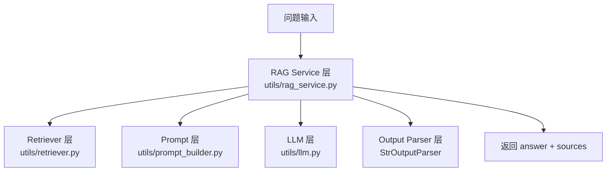
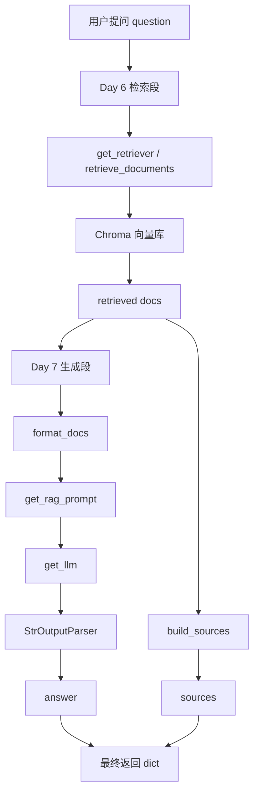
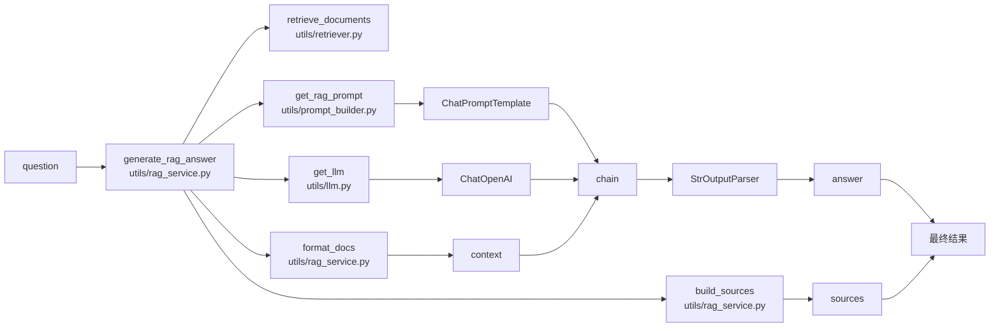

# Day 7：最小问答链路

## 今天的总目标

- 把检索结果真正拼进 prompt
- 调模型生成回答
- 返回答案

## 今天结束前，你必须拿到什么

- `utils/llm.py`
- `utils/prompt_builder.py`
- `utils/rag_service.py`
- 一个最小问答 demo
- 一套你能自己复述的“retrieve -> prompt -> llm -> answer”理解框架

---

## Day 7 一图总览

如果把 Day 7 压缩成一句话，它做的就是：

> 让系统不只是“查到资料”，而是“基于资料回答问题”。

今天的主链路可以先背成这样：

```text
question
-> retrieve docs
-> format context
-> build prompt
-> call llm
-> parse answer
-> return answer
```

也就是：

- `retrieve`
- `format`
- `prompt`
- `generate`
- `parse`

你现在要特别清楚：

- Day 6 解决“资料找不找得到”
- Day 7 解决“怎么把资料喂给模型并生成回答”

---

## Day 7 整体架构

### 先看最粗粒度的三层结构



### 你要怎么理解这三层

#### 第 1 层：检索层

负责：

- 根据问题取回相关 chunk

这一步提供的是“原材料”。

#### 第 2 层：生成层

负责：

- 把问题和上下文组装成 prompt
- 交给 LLM 生成回答

这一步提供的是“加工过程”。

#### 第 3 层：结果层

负责：

- 把模型输出变成稳定的字符串
- 保留检索出来的 sources

这一步提供的是“最终可用结果”。

---

## Day 6 + Day 7 串联总图

你现在已经走到一个关键节点了。  
Day 6 和 Day 7 其实不是两块完全分开的内容，而是一前一后两段流水线。



### 这张总图告诉你的核心事实

- Day 6 负责把资料“翻出来”
- Day 7 负责把资料“喂给模型并组织回答”
- `retrieved docs` 是两天之间最关键的交接物

如果这一步你脑子里是通的，后面的 RAG 会轻松很多。

---

## Day 7 详细主链路流程图

这一张图是 Day 7 最值得背下来的流程图。  
它把 `generate_rag_answer` 内部到底发生了什么拆得非常开。

```mermaid
flowchart TD
    A[question: str] --> B[generate_rag_answer\nutils/rag_service.py]
    B --> C[retrieve_documents(question, top_k)]
    C --> D[get_retriever\nutils/retriever.py]
    D --> E[get_vector_store\nutils/vector_store.py]
    E --> F[Chroma]
    F --> G[list[LCDocument]\nretrieved docs]
    G --> H{docs 是否为空}
    H -- 是 --> I[直接返回\nanswer=未检索到相关内容\nsources=[]]
    H -- 否 --> J[format_docs(docs)]
    G --> K[build_sources(docs)]
    J --> L[context: str]
    L --> M[get_rag_prompt()]
    M --> N[ChatPromptTemplate]
    N --> O[get_llm()]
    O --> P[ChatOpenAI -> 千问兼容接口]
    P --> Q[StrOutputParser]
    L --> R[chain.ainvoke\n{\"context\": context, \"question\": question}]
    N --> R
    O --> R
    Q --> S[answer: str]
    K --> T[sources: list[dict]]
    S --> U[返回结果 dict]
    T --> U
```

### 这张图你可以拆成 4 段来背

#### 第 1 段：取资料

- `generate_rag_answer`
- `retrieve_documents`
- `get_retriever`
- `get_vector_store`

这一段只负责：

- 根据 question 去找相关片段

#### 第 2 段：整理资料

- `format_docs`
- `build_sources`

这一段把同一批 docs 分成两路：

- 一路变成 `context` 给模型吃
- 一路变成 `sources` 给结果保留证据

#### 第 3 段：调用模型

- `get_rag_prompt`
- `get_llm`
- `StrOutputParser`

这一段负责：

- 把 `question + context` 送进模型
- 再把模型输出整理成纯字符串

#### 第 4 段：组装结果

- `answer`
- `sources`

最后统一返回：

- `{"answer": ..., "sources": ...}`

---

## Day 7 函数落点图

你后面写代码时，最容易糊涂的是：

> 这些函数都在同一个文件夹里，但它们到底谁先执行，谁后执行？



### 每个函数到底在什么时候起作用

- `retrieve_documents`
  - 最先起作用
  - 没有它，后面根本没有 docs

- `format_docs`
  - 在拿到 docs 之后立刻起作用
  - 把 docs 翻译成模型能读的上下文字符串

- `build_sources`
  - 和 `format_docs` 处理的是同一批 docs
  - 但目标不是给模型，而是给结果保留证据

- `get_rag_prompt`
  - 提供 prompt 模板
  - 负责定义“模型应该怎么读 context”

- `get_llm`
  - 提供真正的聊天模型客户端
  - 现在这层默认接的是阿里千问兼容接口

- `StrOutputParser`
  - 做最后一道整理
  - 把模型输出变成普通字符串

---

## Day 7 数据形态变化图

这一张图专门看“数据长相”是怎么一步步变化的。

```mermaid
flowchart TD
    A[question: str] --> B[retrieved docs: list[LCDocument]]
    B --> C[context: str]
    B --> D[sources: list[dict]]
    C --> E[prompt messages]
    E --> F[llm raw output]
    F --> G[answer: str]
    G --> H[result: dict]
    D --> H
```

### 你一定要知道每一步数据在变什么

- `str -> list[LCDocument]`
  - 从一个问题，变成一批相关资料

- `list[LCDocument] -> context: str`
  - 从程序对象，变成模型能直接读取的文字

- `context + question -> prompt messages`
  - 从纯文本变量，变成结构化 prompt

- `llm raw output -> answer: str`
  - 从模型返回对象，变成稳定字符串

- `answer + sources -> result: dict`
  - 从内部处理结果，变成接口可返回的数据结构

---

## 今天的 LangChain，要继续往深里讲

## 第 1 层：RAG 回答不等于“把问题直接丢给模型”

这个点你一定要想透。

普通聊天模型的链路像这样：

```text
question -> llm -> answer
```

而今天的最小 RAG 链路是：

```text
question
-> retrieve docs
-> prompt(context + question)
-> llm
-> answer
```

你看，多出来的核心环节是：

- `retrieve docs`
- `context`

这就是 RAG 的本质差别。

白话理解：

- 普通问答：模型靠自己脑子答
- RAG 问答：模型先看资料，再答

---

## 第 2 层：为什么今天要把“检索”和“生成”分开写

很多初学者会觉得：

- 能不能直接写一个大函数，从问题直接到答案

当然能。  
但今天不推荐这么做。

因为你现在正在学习阶段，必须能看清这两段：

### 检索段

- 给问题
- 取回相关文档

### 生成段

- 把文档格式化成上下文
- 拼进 prompt
- 调 LLM

只要这两段你脑子里是分开的，后面 debug 会轻松很多。

---

## 第 3 层：为什么 `format_docs` 不能偷懒

你今天会拿到一组检索出来的 `Document`。

它不是直接就能塞进 LLM 的。

为什么？

因为 LLM 不认识 Python 里的对象列表。  
它只认识最终传给它的文字上下文。

所以你必须有一个 `format_docs` 步骤，把：

- 多条 `Document`
- 每条的正文
- 每条的来源信息

整理成一段模型能吃的文本。

这一步非常关键。  
你可以把它理解成：

> 把检索结果从“程序对象”翻译成“模型可读上下文”

---

## 第 4 层：ChatPromptTemplate 到底在帮你干什么

### 它不是在替你写 prompt 内容

它只是帮你把 prompt 模板结构化。

比如你今天通常会有两类输入：

- `context`
- `question`

而 `ChatPromptTemplate` 的作用是：

- 把这些变量按你定义的模板格式，变成真正的消息列表

白话理解：

- 你负责写提示词思路
- `ChatPromptTemplate` 负责把变量塞进去

### 为什么它比拼字符串更好

因为后面你很容易扩展：

- system message
- human message
- 历史消息
- 可选 placeholder

这就是结构化 prompt 的价值。

---

## 第 5 层：为什么 `prompt | llm | StrOutputParser()` 这么常见

这一段你后面会经常看到：

```python
chain = prompt | llm | StrOutputParser()
```

先别怕。  
它只是 LangChain 的 Runnable 链式写法。

你可以把它翻译成大白话：

1. 先把变量套进 prompt
2. 再把 prompt 发给 LLM
3. 再把 LLM 输出整理成普通字符串

这就完了。

所以这不是神秘语法，它只是把 3 个步骤串起来。

---

## 第 6 层：为什么今天主线先不用 `RunnablePassthrough`

这个决定是为了照顾你现在的学习阶段。

LangChain 里常见一种更“炫”的写法：

```python
{
  "context": retriever | format_docs,
  "question": RunnablePassthrough(),
} | prompt | llm | StrOutputParser()
```

这很强大，但对初学者来说也更绕。

所以 Day 7 我建议你先学显式写法：

1. 先手动 `retrieve_documents(question)`
2. 再手动 `format_docs(docs)`
3. 再调 `chain.ainvoke({...})`

这样你能更清楚地看到每一步发生了什么。

等你 Day 7 的最小链路跑通，再回头学 `RunnablePassthrough`，会顺很多。

---

## 第 7 层：为什么今天要把 `sources` 和 `answer` 一起返回

虽然 Day 8 才重点做引用返回，但 Day 7 就应该先保留 sources。

原因很简单：

- answer 是给人看的
- sources 是给你校验“答得靠不靠谱”的

如果 Day 7 就只返回 answer，你很快会遇到一个痛点：

- 模型说得头头是道
- 但你不知道它到底参考了什么

所以今天即使先不做漂亮引用格式，也要先把 source 基础结构留出来。

---

## 上午学习：09:00 - 12:00

## 09:00 - 09:50：把 Day 7 的主链路讲顺

### 今天你必须能顺着说出来

```text
用户提问
-> retriever 召回 chunk
-> format_docs 组织上下文
-> prompt 把 context 和 question 拼起来
-> llm 生成回答
-> parser 变成字符串
-> 返回 answer
```

### 你今天必须能回答这两个问题

1. 为什么 LLM 不能直接吃 `Document` 对象列表？
2. 为什么 Day 7 不应该把检索和生成完全糊成一团？

---

## 09:50 - 10:40：想清楚今天的 prompt 应该长什么样

### Day 7 的最小 prompt 目标

不是追求文风华丽，  
而是先让模型学会：

- 只根据上下文回答
- 不知道就明确说不知道
- 不要编造文档里没有的信息

### 一个足够好的 Day 7 system 指令

你可以先把它理解成 3 条纪律：

1. 优先依据上下文作答
2. 上下文没有就不要瞎编
3. 回答尽量简洁清楚

这比一开始就堆很多复杂规则更实用。

---

## 10:40 - 11:30：理解为什么 `sources` 不能从 answer 里反推

这个点很多初学者容易想错。

你不能指望：

- 模型回答完
- 然后你再从回答文字里反推出它用了哪些 chunk

正确做法是：

- 在调用 LLM 前，你就已经拿到了 retrieved docs
- 这些 docs 本身就是 source

所以今天的正确思路是：

```text
先检索出 docs
-> docs 一份去格式化给模型
-> docs 另一份保留成 sources
```

这就是为什么 Day 7 的结果结构应该天然是：

- `answer`
- `sources`

---

## 11:30 - 12:00：先决定今天怎么验收

### Day 7 的最小验收目标

不是“像 ChatGPT 一样聪明”，而是：

- 已索引文档能回答
- 回答主要依据文档
- 结果里保留 source 列表

也就是说，Day 7 验收关键词是：

- 能答
- 靠谱
- 可追踪

---

## 下午编码：14:00 - 18:00

## 14:00 - 14:30：先补模型配置

### 推荐安装

```powershell
pip install -U langchain-openai
```

### 先说一个你大概率会疑惑的问题

你明明想接的是阿里千问，  
为什么这里安装的还是 `langchain-openai`？

这不是写错了。  
原因是：

- 阿里百炼提供了 OpenAI 兼容接口
- `langchain_openai.ChatOpenAI` 本质上是一个“兼容 OpenAI 风格接口的聊天模型客户端”
- 只要你把 `base_url` 指向阿里百炼兼容地址，再把 `api_key` 换成 `DASHSCOPE_API_KEY`
- 它就可以实际去调用千问模型

所以你现在可以先把它理解成：

> 我们不是在“调用 OpenAI 官方”，而是在“借用 OpenAI 兼容的客户端写法，去调用阿里千问”。

### 推荐补到 `conf/config.py` 的配置

```python
DASHSCOPE_API_KEY = os.getenv("DASHSCOPE_API_KEY", "")
LLM_BASE_URL = os.getenv(
    "LLM_BASE_URL",
    "https://dashscope.aliyuncs.com/compatible-mode/v1",
)
LLM_MODEL_NAME = os.getenv("LLM_MODEL_NAME", "qwen-plus")
LLM_TEMPERATURE = float(os.getenv("LLM_TEMPERATURE", "0"))
```

### 推荐你本地先这样配环境变量

```powershell
$env:DASHSCOPE_API_KEY="你的阿里百炼key"
$env:LLM_MODEL_NAME="qwen-plus"
$env:LLM_BASE_URL="https://dashscope.aliyuncs.com/compatible-mode/v1"
```

### 为什么这里要拆成 `DASHSCOPE_API_KEY + LLM_*`

因为这套写法兼顾了两件事：

- `DASHSCOPE_API_KEY`
  - 直接表达“我们现在默认接的是阿里百炼”
- `LLM_MODEL_NAME`、`LLM_BASE_URL`
  - 又保留了模型名和网关地址的灵活性

以后你可能会换：

- 千问的不同模型
- 阿里百炼别的兼容地址
- 将来再切到别的 OpenAI 兼容服务

所以现在这种拆法，对学习和后续演进都比较友好。

---

## 14:30 - 15:00：实现 `utils/llm.py`

### `utils/llm.py` 练手骨架版

```python
from langchain_openai import ChatOpenAI

from conf.config import settings


def get_llm() -> ChatOpenAI:
    # 你要做的事：
    # 1. 返回一个 ChatOpenAI 实例
    # 2. model 从 settings 里拿
    # 3. api_key 这里先用 settings.DASHSCOPE_API_KEY
    # 4. temperature 先设成 0
    # 5. base_url 指向阿里百炼兼容地址
    raise NotImplementedError("先自己实现 get_llm")
```

### `utils/llm.py` 参考答案

```python
from langchain_openai import ChatOpenAI

from conf.config import settings


def get_llm() -> ChatOpenAI:
    kwargs = {
        "model": settings.LLM_MODEL_NAME,
        "api_key": settings.DASHSCOPE_API_KEY,
        "temperature": settings.LLM_TEMPERATURE,
    }

    if settings.LLM_BASE_URL:
        kwargs["base_url"] = settings.LLM_BASE_URL

    return ChatOpenAI(**kwargs)
```

### 这段代码你要看懂 3 个点

#### 点 1：为什么 temperature 先设成 0

因为 Day 7 的目标是“基于资料稳定回答”，不是写创意文案。  
温度低一点，更利于先做稳定测试。

#### 点 2：为什么这里虽然是千问，却还是 `ChatOpenAI`

因为你用的是：

- `langchain_openai` 这个客户端
- 阿里百炼的 OpenAI 兼容接口

也就是说：

- 类名看起来像 OpenAI
- 但真正调用到的模型，可以是千问

你现在不要把“客户端类名”和“实际模型供应商”混成一回事。

#### 点 3：为什么 `base_url` 做成可配置

因为这能兼容更多部署方式。  
你的业务代码不用因为供应商变化而大改。

#### 点 4：为什么 `get_llm()` 单独抽文件

因为后面一旦换模型提供商，你只需要改这一处。

---

## 15:00 - 15:40：实现 `utils/prompt_builder.py`

### `utils/prompt_builder.py` 练手骨架版

```python
from langchain_core.prompts import ChatPromptTemplate


def get_rag_prompt() -> ChatPromptTemplate:
    # 你要做的事：
    # 1. 用 ChatPromptTemplate.from_messages(...)
    # 2. 准备一个 system 消息
    # 3. system 里告诉模型：只能基于 context 回答
    # 4. human 消息里至少包含 context 和 question 两个变量
    raise NotImplementedError("先自己实现 get_rag_prompt")
```

### `utils/prompt_builder.py` 参考答案

```python
from langchain_core.prompts import ChatPromptTemplate


def get_rag_prompt() -> ChatPromptTemplate:
    return ChatPromptTemplate.from_messages(
        [
            (
                "system",
                "你是一个基于知识库回答问题的助手。"
                "请优先依据提供的 context 回答。"
                "如果 context 里没有足够信息，请明确说“我无法从已检索内容中确定答案”，不要编造。",
            ),
            (
                "human",
                "已检索内容如下：\n{context}\n\n用户问题：\n{question}",
            ),
        ]
    )
```

### 为什么 Day 7 的 prompt 不要写太花

因为你现在更重要的是验证：

- 检索出来的内容有没有被用上
- 模型有没有按规则回答

先把规则写清楚，比把 prompt 写得很长更重要。

---

## 15:40 - 16:40：实现 `utils/rag_service.py`

### `utils/rag_service.py` 练手骨架版

```python
from langchain_core.documents import Document as LCDocument
from langchain_core.output_parsers import StrOutputParser

from clients.llm_client import get_llm
from utils.prompt_builder import get_rag_prompt
from services.context_service import retrieve_documents


def format_docs(docs: list[LCDocument]) -> str:
  # 你要做的事：
  # 1. 遍历 docs
  # 2. 取出 page_content
  # 3. 最好顺手把 document_id / chunk_id / page_no 也格式化进去
  # 4. 用 \n\n 拼成一大段上下文字符串
  raise NotImplementedError("先自己实现 format_docs")


def build_sources(docs: list[LCDocument]) -> list[dict]:
  # 你要做的事：
  # 1. 遍历 docs
  # 2. 从 metadata 里提取 document_id / chunk_id / page_no
  # 3. 带上原始文本
  # 4. 返回 sources 列表
  raise NotImplementedError("先自己实现 build_sources")


async def generate_rag_answer(question: str, top_k: int = 4) -> dict:
  # 你要做的事：
  # 1. 先调 retrieve_documents(question, top_k)
  # 2. 如果没有召回内容，直接返回一个“未检索到相关内容”的结果
  # 3. 调 format_docs(docs) 得到 context
  # 4. 构造 chain = prompt | llm | StrOutputParser()
  # 5. 用 chain.ainvoke({"context": context, "question": question}) 拿 answer
  # 6. 同时用 build_sources(docs) 组装 sources
  # 7. 返回 {"answer": ..., "sources": ...}
  raise NotImplementedError("先自己实现 generate_rag_answer")
```

### `utils/rag_service.py` 参考答案

```python
from langchain_core.documents import Document as LCDocument
from langchain_core.output_parsers import StrOutputParser

from clients.llm_client import get_llm
from utils.prompt_builder import get_rag_prompt
from services.context_service import retrieve_documents


def format_docs(docs: list[LCDocument]) -> str:
  sections: list[str] = []

  for index, doc in enumerate(docs, start=1):
    sections.append(
      "\n".join(
        [
          f"[片段 {index}]",
          f"document_id={doc.metadata.get('document_id')}",
          f"chunk_id={doc.metadata.get('chunk_id')}",
          f"page_no={doc.metadata.get('page_no')}",
          f"text={doc.page_content}",
        ]
      )
    )

  return "\n\n".join(sections)


def build_sources(docs: list[LCDocument]) -> list[dict]:
  sources: list[dict] = []

  for doc in docs:
    sources.append(
      {
        "document_id": doc.metadata.get("document_id"),
        "chunk_id": doc.metadata.get("chunk_id"),
        "page_no": doc.metadata.get("page_no"),
        "text": doc.page_content,
      }
    )

  return sources


async def generate_rag_answer(question: str, top_k: int = 4) -> dict:
  docs = retrieve_documents(question, top_k=top_k)

  if not docs:
    return {
      "answer": "我无法从已检索内容中找到相关答案。",
      "sources": [],
    }

  context = format_docs(docs)
  prompt = get_rag_prompt()
  llm = get_llm()
  chain = prompt | llm | StrOutputParser()

  answer = await chain.ainvoke(
    {
      "context": context,
      "question": question,
    }
  )

  return {
    "answer": answer,
    "sources": build_sources(docs),
  }
```

### 这一段你一定要看懂

`generate_rag_answer` 本质上做的事情非常朴素：

1. 先查资料
2. 再整理资料
3. 再让模型基于资料回答
4. 最后把资料来源带回去

这就是最小 RAG 回答链路。

---

## 16:40 - 17:20：做一个最小问答调试脚本

### `scripts/debug_day7.py` 练手骨架版

```python
import asyncio

from services.query_service import generate_rag_answer


async def main():
  question = "请替换成一个你的文档里真实能回答的问题"

  # 你要做的事：
  # 1. 调 generate_rag_answer(question, top_k=4)
  # 2. 打印 answer
  # 3. 打印 sources 数量
  # 4. 打印前 2 条 source 预览
  raise NotImplementedError("先自己实现 main")


if __name__ == "__main__":
  asyncio.run(main())
```

### `scripts/debug_day7.py` 参考答案

```python
import asyncio

from services.query_service import generate_rag_answer


async def main():
  question = "Agentic RAG 私有知识助手的核心目标是什么？"
  result = await generate_rag_answer(question, top_k=4)

  print("=" * 60)
  print("answer:")
  print(result["answer"])
  print("=" * 60)
  print(f"source_count={len(result['sources'])}")

  for source in result["sources"][:2]:
    print("-" * 40)
    print(source["document_id"], source["chunk_id"], source["page_no"])
    print(source["text"][:120])


if __name__ == "__main__":
  asyncio.run(main())
```

### 为什么 Day 7 仍然建议先用脚本调试

因为这样你能先把下面这些环节单独看清楚：

- 检索内容
- prompt 拼装
- 模型输出
- source 返回

不要一上来就把所有问题都放到 API 层排查。

---

## 17:20 - 18:00：理解一个更进阶但今天不强求的写法

### 先看显式写法

Day 7 主线你已经学的是：

```text
docs = retrieve_documents(question)
context = format_docs(docs)
answer = chain.ainvoke({"context": context, "question": question})
```

这非常适合初学阶段。

### 再看进阶 Runnable 写法

你后面可能会看到这样的模式：

```python
from langchain_core.output_parsers import StrOutputParser
from langchain_core.runnables.passthrough import RunnablePassthrough

chain = (
    {
        "context": get_retriever(top_k=4) | format_docs,
        "question": RunnablePassthrough(),
    }
    | get_rag_prompt()
    | get_llm()
    | StrOutputParser()
)
```

### 为什么今天不把它当主线

因为它把：

- 检索
- 上下文格式化
- prompt
- llm

压成了一条很漂亮的链。  
但对现在的你来说，先看清每一步会更重要。

所以今天你只需要知道：

- 这是一种更 LangChain 风格的写法
- 等你显式链路学会后，再回来看它会很轻松

---

## 晚上复盘：20:00 - 21:00

### 今晚你必须自己讲顺的 10 个点

1. Day 7 比 Day 6 多出来的核心步骤是什么？
2. 为什么 LLM 不能直接吃 `Document` 列表？
3. `format_docs` 到底在做什么翻译工作？
4. `ChatPromptTemplate` 解决了什么问题？
5. 为什么 Day 7 的 prompt 先不要写太花？
6. `prompt | llm | StrOutputParser()` 本质上是哪 3 步？
7. 为什么 Day 7 主线先不用 `RunnablePassthrough`？
8. 为什么 answer 和 sources 要一起返回？
9. 如果回答不对，应该先查检索段还是生成段？
10. 为什么 Day 7 仍然建议先用调试脚本？

---

## 今日验收标准

- 能根据问题召回相关 chunk
- 能把 chunk 格式化成可读 context
- 能调用 llm 生成回答
- `generate_rag_answer(question, top_k)` 可用
- 返回结果里同时有 `answer` 和 `sources`
- 对已索引文档能做一轮最小问答 demo

---

## 今天最容易踩的坑

### 坑 1：把检索结果原样塞给模型

问题：

- 模型吃不到结构清晰的上下文

规避建议：

- 一定先做 `format_docs`

### 坑 2：prompt 写得很复杂，但检索内容很差

问题：

- 会误以为 prompt 能救检索问题

规避建议：

- 先确认 Day 6 的检索质量过关

### 坑 3：只返回 answer，不保留 sources

问题：

- 后面无法判断答案依据

规避建议：

- Day 7 就把 source 结构先留好

### 坑 4：直接上进阶 Runnable 链，结果自己看不懂

问题：

- 链子很漂亮
- 但你不知道每一步发生了什么

规避建议：

- 先学显式写法
- 再学压缩写法

### 坑 5：模型温度过高

问题：

- 容易让测试结果不稳定

规避建议：

- Day 7 先把 `temperature` 设成 `0`

---

## 给明天的交接提示

明天你会开始做结果结构化和引用增强：

- answer 怎么和 source 更明确绑定
- 响应结构怎么更像产品能力
- 引用片段怎么更适合前端和接口层使用

所以 Day 7 的意义是：

> 先把“能基于资料回答”这条最小主链路跑通。

一旦这条线通了，后面做引用、聊天接口、缓存和异步任务，都会顺很多。
