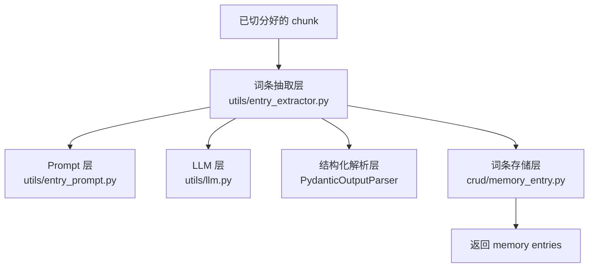
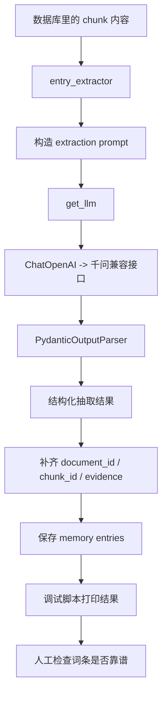
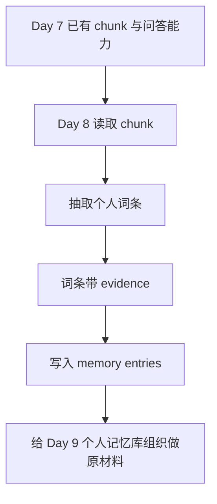

# Day 8：个人词条抽取

## 今天的总目标

- 不再只停留在 `chunk` 检索
- 把个人内容进一步抽取成“个人词条”
- 让系统开始从“记住文本”走向“记住这个人的关键线索”

## 今天结束前，你必须拿到什么

- `models/memory_entry.py`
- `schemas/memory_entry.py`
- `crud/memory_entry.py`
- `utils/entry_prompt.py`
- `utils/entry_extractor.py`
- 一个能验证词条抽取结果的调试脚本
- 一套你能自己复述的“chunk -> entry”理解框架

---

## Day 8 一图总览

如果把 Day 8 压缩成一句话，它做的就是：

> 把原本只适合机器检索的文本块，升级成更适合理解“这个人”的个人词条。

今天的主链路可以先背成这样：

```text
chunk text
-> extract entries
-> classify entry type
-> keep evidence
-> save entries
-> inspect entries
```

也就是：

- `extract`
- `classify`
- `evidence`
- `save`
- `inspect`

你今天要特别清楚：

- Day 6、Day 7 里的 `chunk`
  - 更像机器检索的最小单位
- Day 8 里的 `entry`
  - 更像“这个人的记忆线索”和“个人画像原材料”

---

## Day 8 整体架构

### 先看最粗粒度的三层结构



### 你要怎么理解这三层

#### 第 1 层：输入层

输入不是“一个大文档”，而是：

- 已经切好的 chunk

因为 Day 8 的重点不是重新处理全文，  
而是在已有基础上继续抽出更有意义的语义单位。

#### 第 2 层：词条抽取层

这是 Day 8 的主角。  
它负责：

- 读 chunk
- 提取个人词条
- 判断词条类型
- 保留证据文本

#### 第 3 层：结果层

这一层负责：

- 把抽出来的词条保存下来
- 让它们以后能被查询、聚合和组织

也就是说，Day 8 的产物不是一段回答，  
而是一批“可以长期沉淀”的 `memory entries`。

---

## Day 8 详细流程图

这一张图你要反复看，因为它把“文本块怎么变成词条”的过程完全展开了。



### 你要怎么顺着这张图理解

- `A -> B`
  - Day 8 不再直接面向用户问题
  - 而是面向“已经入库的个人内容”

- `B -> C -> D -> E`
  - LLM 在这里不是回答用户
  - 而是在帮你做“结构化理解”

- `E -> F -> G`
  - 结构化解析非常关键
  - 如果只返回一坨自然语言，后面很难组织成记忆库

- `G -> H`
  - 抽出来的词条必须带证据
  - 否则后面你不知道这个词条到底从哪来的

- `H -> I -> J`
  - 保存之后要立刻肉眼检查
  - 不要等到 Day 10 做画像时才发现词条抽错了

---

## Day 7 到 Day 8 的交接图

Day 7 的终点是“能回答”，  
Day 8 的起点是“能抽取个人线索”。



### 这一张图你一定要记住

- Day 7 主要产物是 `answer`
- Day 8 主要产物是 `entry`

从今天开始，系统开始有“更像人类理解”的中间层了。

---

## 今天的 LangChain，要继续抽丝剥茧地讲

## 第 1 层：为什么 Day 8 不能只靠 chunk

这个点非常关键。

`chunk` 很适合：

- 向量检索
- 控制上下文长度
- 给模型提供原始材料

但 `chunk` 不适合直接拿来做“个人理解”。

为什么？

因为 chunk 更像：

- 机器切出来的文本块

而不是：

- 人真正关心的语义单位

比如一段简历 chunk 里可能同时出现：

- 学校
- 时间
- 项目经验
- 技术栈
- 成果

这些东西混在一个 chunk 里，不利于后面做个人画像。

所以今天要做的事是：

> 把“机器切块”进一步升级成“人类可理解的个人词条”。

---

## 第 2 层：词条到底是什么

你可以把 `memory entry` 理解成：

> 一条有明确语义、能指向某个主题或经历、并且能被长期复用的个人记忆线索。

它不是简单关键词。  
它至少应该包括：

- `entry_name`
  - 词条名字
- `entry_type`
  - 词条类型
- `summary`
  - 这条词条是什么意思
- `evidence_text`
  - 它来自哪段原文

举个白话例子：

如果 chunk 里出现：

- “2023-2027 安徽理工大学 计算机专业”
- “FastAPI + JWT + Docker 项目部署”

那抽出来的词条可能是：

- `安徽理工大学`
  - `stage`
- `FastAPI 后端开发`
  - `ability`
- `Docker 部署经验`
  - `ability`

这就比原始 chunk 更适合后面做画像。

---

## 第 3 层：为什么 Day 8 要开始结构化输出

今天你第一次真正会强烈感受到：

> 不是所有 LLM 输出都适合“只看文本”。

Day 7 的回答可以是自然语言。  
但 Day 8 不行。

因为 Day 8 的结果后面还要继续被系统使用。  
所以它必须长得稳定，最好像：

```json
{
  "entries": [
    {
      "entry_name": "FastAPI 后端开发",
      "entry_type": "ability",
      "summary": "有 FastAPI 项目开发经验",
      "evidence_text": "......"
    }
  ]
}
```

这就是为什么今天要引入：

- `PydanticOutputParser`

白话理解：

- prompt 负责告诉模型“该提取什么”
- parser 负责告诉模型“该按什么结构返回”

---

## 第 4 层：`PydanticOutputParser` 到底在帮你干什么

它不是在替你理解文本。  
理解文本的仍然是大模型。

它做的事情是：

- 先定义一个 Pydantic 结构
- 再把这个结构要求告诉模型
- 最后把模型输出解析成你想要的 Python 对象

你可以把它理解成：

> 给 LLM 的回答装一个“固定形状的盒子”。

这样后面保存数据库、组织记忆库、做画像，都会省很多事。

---

## 第 5 层：为什么 Day 8 一定要保留 evidence

这个点非常重要。

词条一旦脱离原始证据，很快就会出问题：

- 你不知道这条词条从哪来的
- 你不知道模型是不是编的
- 你后面无法追踪错误

所以今天的词条结构一定要至少带：

- `document_id`
- `chunk_id`
- `evidence_text`

这会让 `Mneme` 的“记忆”不是空想象，  
而是永远带着可追溯依据。

---

## 上午学习：09:00 - 12:00

## 09:00 - 09:50：先把 Day 8 的主链路讲顺

### 今天你必须能顺着说出来

```text
系统读 chunk
-> 用 prompt 告诉模型要抽什么词条
-> 模型按结构化格式返回
-> 保留证据文本
-> 把词条写入 memory entries
```

### 你今天必须能回答这两个问题

1. 为什么 `chunk` 不能直接等于“个人记忆”？
2. 为什么 Day 8 的输出必须结构化，而不能只是一段自然语言？

---

## 09:50 - 10:40：想清楚词条类型应该怎么设计

### Day 8 初学阶段建议先用 5 类

- `theme`
  - 长期主题
- `event`
  - 事件经历
- `ability`
  - 能力或技能
- `emotion`
  - 情绪与心态
- `stage`
  - 人生阶段或时期

### 为什么今天不要把类型搞得太多

因为你现在更重要的是先跑通：

- 能稳定抽取
- 能肉眼检查
- 能为 Day 9 的记忆库组织提供原材料

先少而稳，比一开始设计 20 种类型更重要。

---

## 10:40 - 11:30：理解 Day 8 的 LLM 不再是在“回答问题”

Day 7 的模型工作是：

- 根据 context 回答用户问题

Day 8 的模型工作是：

- 从文本里抽取结构化词条

所以今天你要清楚：

- Day 7 是 `question answering`
- Day 8 是 `structured extraction`

这两种用途都能用同一个 LLM 客户端，  
但心智模型完全不同。

---

## 11:30 - 12:00：先决定今天怎么验收

### Day 8 的最小验收目标

不是“抽得百分百完美”，  
而是：

- 能从真实 chunk 里抽出 2 到 5 条合理词条
- 每条词条有类型
- 每条词条有 summary
- 每条词条有 evidence

也就是说，Day 8 的验收关键词是：

- 抽得出
- 结构稳
- 可追踪

---

## 下午编码：14:00 - 18:00

## 14:00 - 14:40：先设计词条数据结构

### 建议新增的文件

- `models/memory_entry.py`
- `schemas/memory_entry.py`

### `models/memory_entry.py` 示例

```python
from sqlalchemy import Float, ForeignKey, Index, String, Text
from sqlalchemy.orm import Mapped, mapped_column

from models.base import Base


class MemoryEntry(Base):
    __tablename__ = "memory_entries"
    __table_args__ = (
        Index("idx_memory_entries_document_id", "document_id"),
        Index("idx_memory_entries_entry_type", "entry_type"),
        Index("idx_memory_entries_chunk_id", "chunk_id"),
    )

    id: Mapped[str] = mapped_column(String(64), primary_key=True)
    document_id: Mapped[str] = mapped_column(
        String(64),
        ForeignKey("documents.id"),
        nullable=False,
    )
    chunk_id: Mapped[str] = mapped_column(String(64), nullable=False)
    entry_name: Mapped[str] = mapped_column(String(255), nullable=False)
    entry_type: Mapped[str] = mapped_column(String(50), nullable=False)
    summary: Mapped[str] = mapped_column(Text, nullable=False)
    evidence_text: Mapped[str] = mapped_column(Text, nullable=False)
    importance_score: Mapped[float] = mapped_column(Float, nullable=False, default=0.5)
```

### `schemas/memory_entry.py` 示例

```python
from pydantic import BaseModel, Field


class MemoryEntryExtractItem(BaseModel):
    entry_name: str = Field(..., description="词条名称")
    entry_type: str = Field(..., description="词条类型")
    summary: str = Field(..., description="词条简述")
    evidence_text: str = Field(..., description="支撑这条词条的原文证据")
    importance_score: float = Field(default=0.5, description="重要性分数，0 到 1")


class MemoryEntryExtractionResult(BaseModel):
    entries: list[MemoryEntryExtractItem]
```

### 这里你一定要看懂

- `memory_entries` 表
  - 是 Day 8 最关键的新表
- 它不是原文表
  - 而是“个人语义线索表”

---

## 14:40 - 15:20：实现 `utils/entry_prompt.py`

### `utils/entry_prompt.py` 练手骨架版

```python
from langchain_core.prompts import ChatPromptTemplate


def get_entry_extraction_prompt(format_instructions: str) -> ChatPromptTemplate:
    # 你要做的事：
    # 1. 准备一个 system 消息
    # 2. 明确告诉模型：要从个人内容里抽取 memory entries
    # 3. 说明 entry_type 先只允许 theme / event / ability / emotion / stage
    # 4. 告诉模型每条 entry 必须带 evidence_text
    # 5. 把 format_instructions 拼进 prompt，约束输出结构
    raise NotImplementedError("先自己实现 get_entry_extraction_prompt")
```

### `utils/entry_prompt.py` 参考答案

```python
from langchain_core.prompts import ChatPromptTemplate


def get_entry_extraction_prompt(format_instructions: str) -> ChatPromptTemplate:
    return ChatPromptTemplate.from_messages(
        [
            (
                "system",
                "你是一个个人记忆词条抽取助手。"
                "请从输入文本中抽取最有价值的个人词条。"
                "词条类型只允许：theme、event、ability、emotion、stage。"
                "每条词条必须简洁明确，并保留 evidence_text。"
                "如果文本里没有值得抽取的内容，返回空列表。"
                f"\n\n输出必须严格遵守下面的格式要求：\n{format_instructions}",
            ),
            (
                "human",
                "document_id={document_id}\n"
                "chunk_id={chunk_id}\n"
                "page_no={page_no}\n\n"
                "原始文本如下：\n{chunk_text}",
            ),
        ]
    )
```

### 为什么这一段要看懂

Day 8 的 prompt 不是在问“答案是什么”，  
而是在告诉模型：

- 你现在扮演的是抽取器
- 你要抽什么
- 你要按什么形状返回

---

## 15:20 - 16:20：实现 `utils/entry_extractor.py`

### `utils/entry_extractor.py` 练手骨架版

```python
import uuid

from langchain_core.documents import Document as LCDocument
from langchain_core.output_parsers import PydanticOutputParser

from schemas.memory_entry import MemoryEntryExtractionResult
from utils.entry_prompt import get_entry_extraction_prompt
from utils.llm import get_llm


async def extract_entries_from_chunk(doc: LCDocument) -> list[dict]:
    # 你要做的事：
    # 1. 创建 PydanticOutputParser
    # 2. 获取 format_instructions
    # 3. 构造 prompt
    # 4. 调 llm 做结构化抽取
    # 5. 把 parser 解析出的 entries 补齐 id / document_id / chunk_id / page_no
    # 6. 返回统一字典列表
    raise NotImplementedError("先自己实现 extract_entries_from_chunk")


async def extract_entries_from_chunks(chunk_docs: list[LCDocument]) -> list[dict]:
    # 你要做的事：
    # 1. 遍历所有 chunk_docs
    # 2. 逐个调用 extract_entries_from_chunk
    # 3. 合并成一个总列表
    raise NotImplementedError("先自己实现 extract_entries_from_chunks")
```

### `utils/entry_extractor.py` 参考答案

```python
import uuid

from langchain_core.documents import Document as LCDocument
from langchain_core.output_parsers import PydanticOutputParser

from schemas.memory_entry import MemoryEntryExtractionResult
from utils.entry_prompt import get_entry_extraction_prompt
from utils.llm import get_llm


async def extract_entries_from_chunk(doc: LCDocument) -> list[dict]:
    parser = PydanticOutputParser(pydantic_object=MemoryEntryExtractionResult)
    prompt = get_entry_extraction_prompt(parser.get_format_instructions())
    llm = get_llm()
    chain = prompt | llm | parser

    result = await chain.ainvoke(
        {
            "document_id": doc.metadata.get("document_id"),
            "chunk_id": doc.metadata.get("chunk_id"),
            "page_no": doc.metadata.get("page_no"),
            "chunk_text": doc.page_content,
        }
    )

    entries: list[dict] = []

    for item in result.entries:
        entries.append(
            {
                "id": f"entry_{uuid.uuid4().hex[:12]}",
                "document_id": doc.metadata.get("document_id"),
                "chunk_id": doc.metadata.get("chunk_id"),
                "page_no": doc.metadata.get("page_no"),
                "entry_name": item.entry_name,
                "entry_type": item.entry_type,
                "summary": item.summary,
                "evidence_text": item.evidence_text,
                "importance_score": item.importance_score,
            }
        )

    return entries


async def extract_entries_from_chunks(chunk_docs: list[LCDocument]) -> list[dict]:
    all_entries: list[dict] = []

    for doc in chunk_docs:
        entries = await extract_entries_from_chunk(doc)
        all_entries.extend(entries)

    return all_entries
```

### 这里你一定要看懂

`PydanticOutputParser` 的作用不是“理解文本”，  
而是：

1. 告诉模型输出长什么样
2. 把输出转成稳定 Python 对象

这就是 Day 8 跟 Day 7 的一个关键变化：

- Day 7 更像自然语言问答
- Day 8 更像结构化语义抽取

---

## 16:20 - 17:00：实现 `crud/memory_entry.py`

### `crud/memory_entry.py` 练手骨架版

```python
from sqlalchemy import select
from sqlalchemy.ext.asyncio import AsyncSession

from models.memory_entry import MemoryEntry


async def create_memory_entries(
        db: AsyncSession,
        *,
        entries: list[dict],
) -> list[MemoryEntry]:
    # 你要做的事：
    # 1. 把每个 dict 转成 MemoryEntry ORM 对象
    # 2. 批量 add_all
    # 3. flush
    # 4. 返回 ORM 列表
    raise NotImplementedError("先自己实现 create_memory_entries")


async def list_memory_entries_by_document_id(
        db: AsyncSession,
        *,
        document_id: str,
) -> list[MemoryEntry]:
    # 你要做的事：
    # 1. 按 document_id 查询
    # 2. 按 created_at 升序或 entry_type 排序都可以
    raise NotImplementedError("先自己实现 list_memory_entries_by_document_id")
```

### `crud/memory_entry.py` 参考答案

```python
from sqlalchemy import select
from sqlalchemy.ext.asyncio import AsyncSession

from models.memory_entry import MemoryEntry


async def create_memory_entries(
        db: AsyncSession,
        *,
        entries: list[dict],
) -> list[MemoryEntry]:
    objects = [MemoryEntry(**item) for item in entries]
    db.add_all(objects)
    await db.flush()
    return objects


async def list_memory_entries_by_document_id(
        db: AsyncSession,
        *,
        document_id: str,
) -> list[MemoryEntry]:
    stmt = (
        select(MemoryEntry)
        .where(MemoryEntry.document_id == document_id)
        .order_by(MemoryEntry.created_at.asc())
    )
    result = await db.execute(stmt)
    return list(result.scalars().all())
```

### 为什么 Day 8 要把词条落库

因为今天的词条不是临时结果，  
而是 Day 9、Day 10、Day 11 继续往上构建的原材料。

---

## 17:00 - 17:40：做一个最小调试脚本

### `scripts/debug_day8.py` 练手骨架版

```python
import asyncio


async def main():
    # 你要做的事：
    # 1. 构造一个示例 LCDocument
    # 2. 调 extract_entries_from_chunk(...)
    # 3. 打印抽出的 entry 数量
    # 4. 打印每条 entry 的名称、类型、summary
    raise NotImplementedError("先自己实现 main")


if __name__ == "__main__":
    asyncio.run(main())
```

### `scripts/debug_day8.py` 参考答案

```python
import asyncio

from langchain_core.documents import Document as LCDocument

from utils.entry_extractor import extract_entries_from_chunk


async def main():
    doc = LCDocument(
        page_content=(
            "我在安徽理工大学学习计算机相关课程，"
            "曾使用 FastAPI、JWT、Docker 完成一个后端项目，"
            "最近对后端架构和个人成长记录非常感兴趣。"
        ),
        metadata={
            "document_id": "doc_demo_001",
            "chunk_id": "chunk_demo_001",
            "page_no": 1,
        },
    )

    entries = await extract_entries_from_chunk(doc)

    print(f"entry_count={len(entries)}")
    for item in entries:
        print("=" * 60)
        print(item["entry_name"])
        print(item["entry_type"])
        print(item["summary"])
        print(item["evidence_text"])


if __name__ == "__main__":
    asyncio.run(main())
```

### 为什么 Day 8 先用单 chunk 调试

因为这样你能先确认：

- prompt 是否合理
- 结构化输出是否稳定
- evidence 是否保留

先把单点打透，再去批量跑所有 chunk。

---

## 17:40 - 18:00：给 Day 9 留出接口

### 你今天可以顺手留下这个心智模型

Day 8 的输出不是最终产品结果，  
它只是 Day 9 的输入。

也就是说：

```text
Day 8:
chunk -> entry

Day 9:
entry -> memory library
```

这句话你最好今天就背下来。

---

## 晚上复盘：20:00 - 21:00

### 今晚你必须自己讲顺的 10 个点

1. 为什么 `chunk` 不能直接等于个人记忆？
2. `memory entry` 和关键词有什么区别？
3. 为什么 Day 8 要做结构化输出？
4. `PydanticOutputParser` 到底做了什么？
5. Day 8 的模型任务和 Day 7 有什么不同？
6. 为什么每条词条一定要带 evidence？
7. 为什么词条要落库，而不是只在内存里存在？
8. `entry_type` 为什么先别设计太多？
9. 如果模型抽出很多空洞词条，应该先改 prompt 还是改数据库？
10. Day 8 和 Day 9 的交接物到底是什么？

---

## 今日验收标准

- 能从单个 chunk 中抽出结构化词条
- 每条词条至少包含 `entry_name`、`entry_type`、`summary`、`evidence_text`
- 能保留 `document_id`、`chunk_id`、`page_no`
- `extract_entries_from_chunk(...)` 可用
- `extract_entries_from_chunks(...)` 可用
- 能肉眼判断抽取结果是否合理

---

## 今天最容易踩的坑

### 坑 1：把词条做成关键词列表

问题：

- 看起来像抽取成功了
- 实际上不适合后面做画像和记忆组织

规避建议：

- 词条至少要有名称、类型、简述和证据

### 坑 2：让模型自由发挥输出格式

问题：

- 后面代码很难解析

规避建议：

- 今天一定引入结构化 parser

### 坑 3：词条没有 evidence

问题：

- 后面无法校验真假

规避建议：

- 词条必须带 `evidence_text`

### 坑 4：词条类型设计过度复杂

问题：

- 抽取不稳定
- 调试成本高

规避建议：

- 先用 5 类跑通主链路

### 坑 5：一上来就批量跑全库

问题：

- 一旦抽取效果差，很难定位是 prompt 还是某些 chunk 的问题

规避建议：

- 先调单个 chunk
- 再逐步扩大范围

---

## 给明天的交接提示

明天你会开始做“个人记忆库组织”：

- 怎么按时间组织词条
- 怎么按主题聚合词条
- 怎么把零散词条整理成更像个人档案的结构

所以 Day 8 的意义是：

> 先让系统学会从个人内容里抽出有意义的记忆线索。

只有线索抽得靠谱，  
Day 9 的个人记忆库才不会搭歪。
