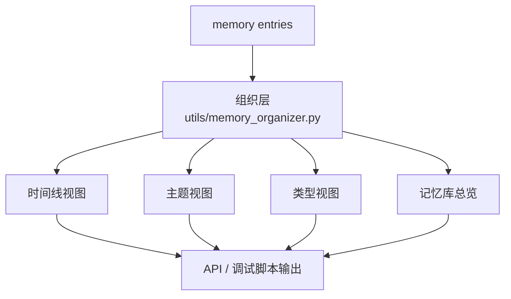
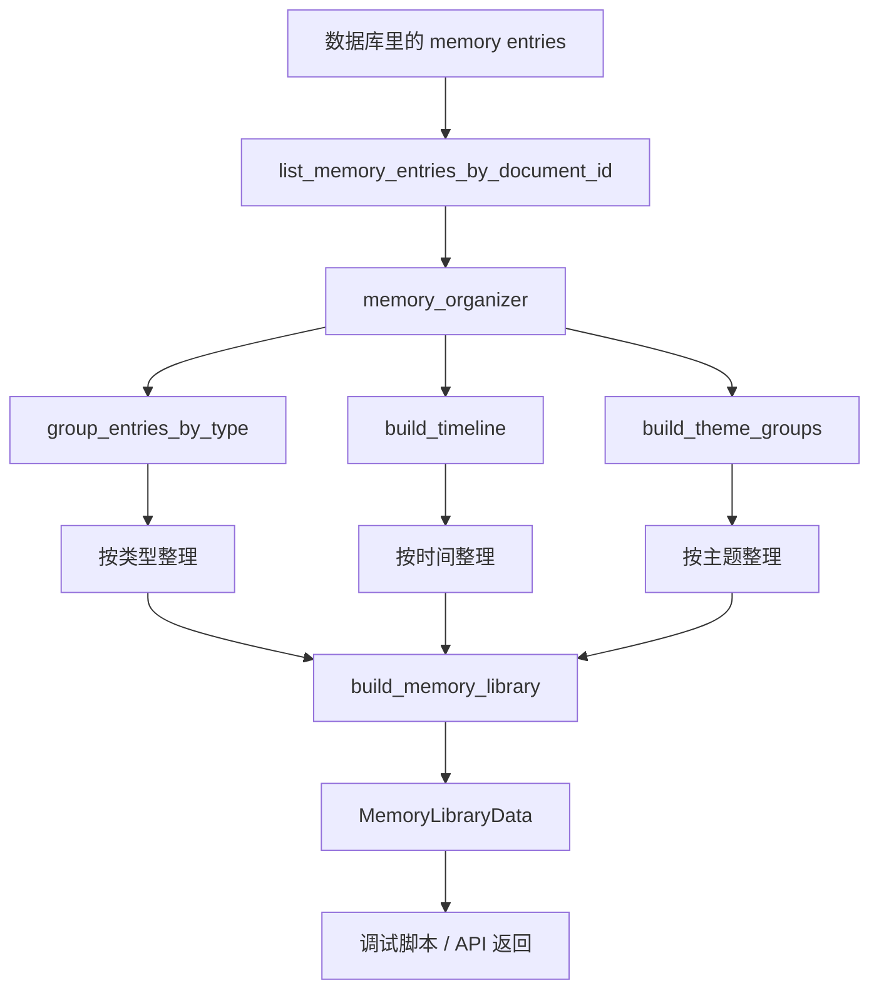
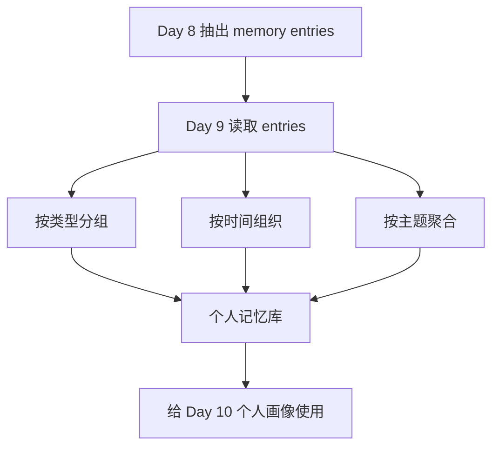

# Day 9：个人记忆库组织

## 今天的总目标

- 把 Day 8 的零散词条组织成“个人记忆库”
- 能按时间、主题、类型查看一个人的内容线索
- 给 Day 10 的个人画像准备更稳定的输入结构

## 今天结束前，你必须拿到什么

- `schemas/memory_library.py`
- `utils/memory_organizer.py`
- `routers/memory.py`
- 一个能打印个人记忆库结果的调试脚本
- 一套你能自己复述的“entry -> memory library”理解框架

---

## Day 9 一图总览

如果把 Day 9 压缩成一句话，它做的就是：

> 把零散的个人词条，组织成更像“这个人长期内容档案”的记忆库结构。

今天的主链路可以先背成这样：

```text
load entries
-> group by type
-> build timeline
-> build theme buckets
-> build memory library
-> inspect structure
```

也就是：

- `load`
- `group`
- `timeline`
- `theme`
- `library`
- `inspect`

你今天要特别清楚：

- Day 8 的重点是“抽出来”
- Day 9 的重点是“组织起来”

---

## Day 9 整体架构

### 先看最粗粒度的三层结构



### 你要怎么理解这三层

#### 第 1 层：词条层

这是 Day 8 的产物。

它回答的是：

- 文本里提到了哪些重要线索

#### 第 2 层：组织层

这是 Day 9 的主角。

它回答的是：

- 这些线索怎么组合起来，才能更像一个“人的记忆结构”

#### 第 3 层：输出层

这一层负责：

- 把记忆库结果提供给调试脚本
- 或者提供给后面的 API 层

也就是说，Day 9 的产物不是画像本身，  
而是一个更适合做画像的中间结构。

---

## Day 9 详细流程图



### 你要怎么顺着这张图理解

- `A -> B`
  - Day 9 的输入已经不再是 chunk
  - 而是 Day 8 的 memory entries

- `B -> C`
  - 组织层不是在生成新知识
  - 而是在整理已有知识

- `C -> D / E / F`
  - 同一批 entry，会被拆成多种视角
  - 时间线、主题、类型，这三个视角缺一不可

- `D / E / F -> J`
  - 最后的记忆库不是单一列表
  - 而是一个多视图结构

---

## Day 8 到 Day 9 的交接图



### 这张图你要记住

- Day 8 的产物是“线索”
- Day 9 的产物是“结构”

没有 Day 9，Day 10 的画像就很容易变成：

- 只看零散词条
- 缺少时间感
- 缺少主题感

---

## 今天的核心概念，要继续讲透

## 第 1 层：词条不等于记忆库

这是 Day 9 最重要的一句话。

`entry` 是：

- 单条语义线索

`memory library` 是：

- 一组被组织起来的线索集合

你可以这样理解：

- entry 像拼图块
- memory library 像已经拼出轮廓的画面

所以今天不是再抽取更多 entry，  
而是要开始回答：

> 这些词条合在一起，到底讲出了一个什么样的人？

---

## 第 2 层：为什么 Day 9 一定要有时间线

一个人的成长，不是平面的。  
它天然带着时间顺序。

如果你只看一堆词条：

- FastAPI
- Docker
- 安徽理工大学
- 成长记录
- 后端架构

你能看出这个人关注什么，  
但你很难看出：

- 先发生了什么
- 后发生了什么
- 最近在变成什么样

所以 Day 9 的时间线非常关键。  
它是 Day 10、Day 11 做画像和阶段总结的基础。

---

## 第 3 层：为什么 Day 9 还不能急着做“评价这个人”

很多人一到这一步，就会很想直接做：

- 这个人的整体评价是什么

但今天还不应该这么快。

因为 Day 9 的任务是：

- 先把记忆组织好

只有组织好，  
后面的画像才更稳。

白话理解：

- Day 8：先捡出材料
- Day 9：先把材料归档
- Day 10：再开始做画像

---

## 第 4 层：为什么 Day 9 反而不一定比 Day 8 更依赖 LangChain

这个点很值得你记住。

很多初学者会觉得：

- 越往后做，LangChain 应该越多

其实不一定。

Day 8 需要 LangChain 的地方很多，因为要做：

- prompt
- llm
- parser

Day 9 的主角反而更偏工程组织：

- 分组
- 排序
- 聚合
- 结构化返回

这说明一个非常成熟的工程观念：

> 不是所有 AI 项目的每一层，都一定要靠 LangChain 才成立。

LangChain 很重要，  
但产品结构同样重要。

---

## 第 5 层：Day 9 的“记忆库”到底长什么样

今天建议你先把它做成一个最小结构：

- `timeline`
  - 时间线列表
- `by_type`
  - 按类型分组
- `by_theme`
  - 按主题聚合

白话理解：

- timeline 解决“什么时候”
- by_type 解决“属于哪类”
- by_theme 解决“围绕什么主题”

这 3 个视角先做出来，  
Day 9 就已经很有价值了。

---

## 上午学习：09:00 - 12:00

## 09:00 - 09:50：把 Day 9 的主链路讲顺

### 今天你必须能顺着说出来

```text
系统读取 memory entries
-> 按类型分组
-> 按时间组织
-> 按主题聚合
-> 形成 memory library
-> 返回给调试脚本或接口
```

### 你今天必须能回答这两个问题

1. 为什么 `entry` 不能直接等于“个人记忆库”？
2. 为什么 Day 9 一定要有时间线视图？

---

## 09:50 - 10:40：先想清楚 Day 9 的最小输出结构

### 今天建议先做这 3 个字段

```python
{
    "timeline": [...],
    "by_type": {...},
    "by_theme": {...},
}
```

### 为什么先做这么少

因为 Day 9 的重点不是把字段设计得特别华丽，  
而是先让你真正看见：

- 同一批词条被组织成多视图结构之后
- 它和一堆零散 entry 的区别到底在哪

---

## 10:40 - 11:30：理解 Day 9 和 Day 10 的边界

Day 9：

- 组织记忆

Day 10：

- 解释记忆

这两个动作一定不要混。

如果 Day 9 就急着做很多“评价”，  
很容易出现：

- 结构还没稳
- 结论先飞了

所以今天你更像在做：

- 档案整理
- 不是结论生成

---

## 11:30 - 12:00：先决定今天怎么验收

### Day 9 的最小验收目标

- 能把同一份文档的 entries 组织成一个记忆库对象
- 能按时间返回 timeline
- 能按类型返回 by_type
- 能按主题返回 by_theme

也就是说，Day 9 的验收关键词是：

- 结构成形
- 视角清楚
- 便于后续画像

---

## 下午编码：14:00 - 18:00

## 14:00 - 14:40：先定义记忆库输出结构

### 建议新增文件

- `schemas/memory_library.py`

### `schemas/memory_library.py` 示例

```python
from datetime import datetime
from pydantic import BaseModel


class MemoryTimelineItem(BaseModel):
    entry_id: str
    entry_name: str
    entry_type: str
    summary: str
    created_at: datetime


class MemoryThemeItem(BaseModel):
    theme_name: str
    entries: list[str]
    count: int


class MemoryLibraryData(BaseModel):
    timeline: list[MemoryTimelineItem]
    by_type: dict[str, list[str]]
    by_theme: list[MemoryThemeItem]
```

### 这里你一定要看懂

Day 9 的 schema 不再是单条数据，  
而是“一个组织结果”。

---

## 14:40 - 15:40：实现 `utils/memory_organizer.py`

### `utils/memory_organizer.py` 练手骨架版

```python
from collections import defaultdict


def group_entries_by_type(entries: list[dict]) -> dict[str, list[str]]:
    # 你要做的事：
    # 1. 准备一个 defaultdict(list)
    # 2. 遍历 entries
    # 3. 按 entry_type 分组
    # 4. 这里先存 entry_name 就够了
    raise NotImplementedError("先自己实现 group_entries_by_type")


def build_timeline(entries: list[dict]) -> list[dict]:
    # 你要做的事：
    # 1. 按 created_at 排序
    # 2. 抽出最适合展示时间线的字段
    # 3. 返回列表
    raise NotImplementedError("先自己实现 build_timeline")


def build_theme_groups(entries: list[dict]) -> list[dict]:
    # 你要做的事：
    # 1. 先用 entry_name 做一个最小主题聚合
    # 2. 统计每个主题出现次数
    # 3. 返回 [{"theme_name": ..., "entries": [...], "count": ...}, ...]
    raise NotImplementedError("先自己实现 build_theme_groups")


def build_memory_library(entries: list[dict]) -> dict:
    # 你要做的事：
    # 1. 同时调用上面 3 个函数
    # 2. 拼成一个统一 dict
    raise NotImplementedError("先自己实现 build_memory_library")
```

### `utils/memory_organizer.py` 参考答案

```python
from collections import defaultdict


def group_entries_by_type(entries: list[dict]) -> dict[str, list[str]]:
    grouped: defaultdict[str, list[str]] = defaultdict(list)

    for item in entries:
        grouped[item["entry_type"]].append(item["entry_name"])

    return dict(grouped)


def build_timeline(entries: list[dict]) -> list[dict]:
    sorted_entries = sorted(entries, key=lambda x: x["created_at"])

    return [
        {
            "entry_id": item["id"],
            "entry_name": item["entry_name"],
            "entry_type": item["entry_type"],
            "summary": item["summary"],
            "created_at": item["created_at"],
        }
        for item in sorted_entries
    ]


def build_theme_groups(entries: list[dict]) -> list[dict]:
    grouped: defaultdict[str, list[str]] = defaultdict(list)

    for item in entries:
        grouped[item["entry_name"]].append(item["summary"])

    results: list[dict] = []
    for theme_name, related_entries in grouped.items():
        results.append(
            {
                "theme_name": theme_name,
                "entries": related_entries,
                "count": len(related_entries),
            }
        )

    results.sort(key=lambda x: x["count"], reverse=True)
    return results


def build_memory_library(entries: list[dict]) -> dict:
    return {
        "timeline": build_timeline(entries),
        "by_type": group_entries_by_type(entries),
        "by_theme": build_theme_groups(entries),
    }
```

### 为什么 Day 9 先用 Python 聚合就够了

因为今天重点不是：

- 让模型再说一遍

而是：

- 先把结构搭出来

Day 9 的价值在于组织，  
不是在于又调用一次 LLM。

---

## 15:40 - 16:20：给 Day 9 补一个查询接口

### `routers/memory.py` 练手骨架版

```python
from fastapi import APIRouter, Depends
from sqlalchemy.ext.asyncio import AsyncSession

from conf.database import get_database

router = APIRouter(prefix="/memory", tags=["memory"])


@router.get("/{document_id}/library")
async def get_memory_library(
        document_id: str,
        db: AsyncSession = Depends(get_database),
):
    # 你要做的事：
    # 1. 读取这个 document_id 下的 memory entries
    # 2. 转成 dict 列表
    # 3. 调 build_memory_library(entries)
    # 4. 返回统一响应
    raise NotImplementedError("先自己实现 get_memory_library")
```

### `routers/memory.py` 参考答案

```python
from fastapi import APIRouter, Depends
from sqlalchemy.ext.asyncio import AsyncSession

from conf.database import get_database
from crud.memory_entry import list_memory_entries_by_document_id
from utils.memory_organizer import build_memory_library
from utils.response import success_response

router = APIRouter(prefix="/memory", tags=["memory"])


@router.get("/{document_id}/library")
async def get_memory_library(
        document_id: str,
        db: AsyncSession = Depends(get_database),
):
    rows = await list_memory_entries_by_document_id(
        db,
        document_id=document_id,
    )

    entries = [
        {
            "id": item.id,
            "entry_name": item.entry_name,
            "entry_type": item.entry_type,
            "summary": item.summary,
            "created_at": item.created_at,
        }
        for item in rows
    ]

    data = build_memory_library(entries)
    return success_response(data=data)
```

### 为什么 Day 9 要开始有 memory 路由

因为从今天开始，  
你已经不只是做“文档问答”，而是开始做：

- 个人记忆视图

这和 `Mneme` 的产品方向是对齐的。

---

## 16:20 - 17:00：做一个最小调试脚本

### `scripts/debug_day9.py` 练手骨架版

```python
from utils.memory_organizer import build_memory_library


def main():
    # 你要做的事：
    # 1. 准备 3 到 5 条模拟 entries
    # 2. 调 build_memory_library(entries)
    # 3. 打印 timeline
    # 4. 打印 by_type
    # 5. 打印 by_theme
    raise NotImplementedError("先自己实现 main")


if __name__ == "__main__":
    main()
```

### `scripts/debug_day9.py` 参考答案

```python
from datetime import datetime, timedelta

from utils.memory_organizer import build_memory_library


def main():
    now = datetime.now()
    entries = [
        {
            "id": "entry_001",
            "entry_name": "FastAPI 后端开发",
            "entry_type": "ability",
            "summary": "有 FastAPI 项目开发经验",
            "created_at": now - timedelta(days=3),
        },
        {
            "id": "entry_002",
            "entry_name": "安徽理工大学",
            "entry_type": "stage",
            "summary": "当前教育阶段与学校背景",
            "created_at": now - timedelta(days=2),
        },
        {
            "id": "entry_003",
            "entry_name": "个人成长记录",
            "entry_type": "theme",
            "summary": "长期关注成长、复盘与记录",
            "created_at": now - timedelta(days=1),
        },
    ]

    library = build_memory_library(entries)

    print("=" * 60)
    print("timeline")
    print(library["timeline"])
    print("=" * 60)
    print("by_type")
    print(library["by_type"])
    print("=" * 60)
    print("by_theme")
    print(library["by_theme"])


if __name__ == "__main__":
    main()
```

### 为什么 Day 9 的调试脚本很重要

因为今天最容易出错的不是 LLM，  
而是：

- 结构设计不清
- 聚合视角不清
- 返回格式太乱

脚本调试最适合先看结构。

---

## 17:00 - 18:00：给 Day 10 预留画像接口

### 你今天要留下来的心智模型

Day 9 的输出不是最终结论，  
而是画像的输入。

也就是说：

```text
Day 9:
memory library

Day 10:
profile summary
```

只有先把时间线、主题线、类型线组织好，  
Day 10 的画像才会更像“这个人”，而不是一堆散乱标签。

---

## 晚上复盘：20:00 - 21:00

### 今晚你必须自己讲顺的 10 个点

1. `entry` 和 `memory library` 的区别是什么？
2. 为什么 Day 9 一定要有 timeline？
3. `by_type` 和 `by_theme` 分别解决什么问题？
4. 为什么 Day 9 还不急着做“整体评价”？
5. 为什么 Day 9 不一定比 Day 8 更依赖 LangChain？
6. 为什么 Day 9 更像“整理档案”而不是“生成结论”？
7. 如果主题聚合结果很碎，应该先改哪一层？
8. 为什么 Day 9 要开始有 `memory` 路由？
9. Day 9 的产物怎么交给 Day 10？
10. 为什么今天的结构设计会直接影响后面的产品感？

---

## 今日验收标准

- 能从 entries 组织出一个 memory library
- `timeline` 可用
- `by_type` 可用
- `by_theme` 可用
- `build_memory_library(entries)` 可用
- 能通过脚本或 API 查看组织结果

---

## 今天最容易踩的坑

### 坑 1：把记忆库做成一个普通列表

问题：

- 看起来像有数据
- 但没有时间感，也没有主题感

规避建议：

- 至少同时保留 timeline、by_type、by_theme

### 坑 2：Day 9 就急着给人下结论

问题：

- 结构没稳，结论先跑了

规避建议：

- 今天先组织，不急着评价

### 坑 3：把主题聚合做成一堆近义词碎片

问题：

- 后面画像会非常杂乱

规避建议：

- 先用简单规则跑通
- Day 10 再考虑更智能的主题归并

### 坑 4：试图把所有事情都交给 LLM

问题：

- 成本高
- 结果不稳定
- 结构难控

规避建议：

- 今天的主线尽量用 Python 组织结构

### 坑 5：没有时间视角

问题：

- 后面很难做成长分析

规避建议：

- timeline 今天一定要先做出来

---

## 给明天的交接提示

明天你会进入个人画像的第一版：

- 长期主题是什么
- 主要能力轮廓是什么
- 表达和关注点偏向哪里

所以 Day 9 的意义是：

> 先把零散词条整理成一个更像“个人记忆档案”的结构。

只有档案结构清楚了，  
Day 10 的画像才不会空。
